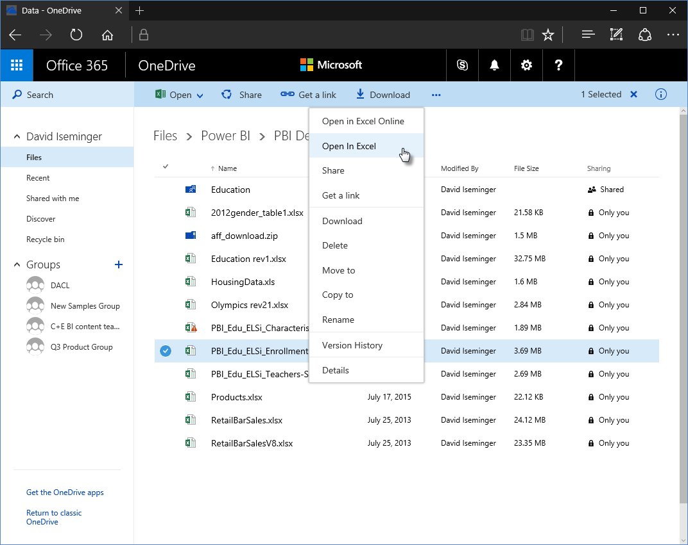

# ใช้ลิงก์ OneDrive for Business ใน Power BI DesktopUse OneDrive for Business links in Power BI Desktop
หลายคนมีเวิร์กบุ๊ก Excel ที่จัดเก็บไว้ใน OneDrive for Business ที่จะเหมาะสำหรับใช้งานกับ Power BI DesktopMany people have Excel workbooks stored in OneDrive for Business that would be great for use with Power BI Desktop. ด้วย Power BI Desktop คุณสามารถใช้ลิงก์ออนไลน์สำหรับไฟล์ Excel ที่จัดเก็บไว้ใน OneDrive for Business เพื่อสร้างรายงานและวิชวลได้With Power BI Desktop, you can use online links for Excel files stored in OneDrive for Business to create reports and visuals. คุณสามารถใช้บัญชีผู้ใช้กลุ่ม OneDrive for Business หรือบัญชีผู้ใช้บุคคล OneDrive for Business ของคุณก็ได้You can use a OneDrive for Business group account or your individual OneDrive for Business account.

การรับลิงก์ออนไลน์จาก OneDrive for Business ต้องใช้ขั้นตอนที่เฉพาะเจาะจงสองสามขั้นตอนGetting an online link from OneDrive for Business requires a few specific steps. ส่วนต่อไปนี้จะอธิบายขั้นตอนดังกล่าว ให้คุณสามารถแชร์ลิงก์ของไฟล์ระหว่างกลุ่ม ระหว่างเครื่อง และกับเพื่อนร่วมงานของคุณThe following sections explain those steps, which let you share the file link among groups, across different machines, and with your coworkers.

## รับลิงก์จาก ExcelGet a link from Excel
1. นำทางไปยังที่ตั้ง OneDrive for Business ของคุณโดยใช้เบราว์เซอร์Navigate to your OneDrive for Business location using a browser. คลิกขวาไฟล์ที่คุณต้องการใช้ และเลือก **เปิดใน Excel**Right-click the file you want to use, and select **Open in Excel**.
   
   > [!NOTE]
   > อินเทอร์เฟซบนเบราว์เซอร์ของคุณอาจไม่เหมือนรูปต่อไปนี้Your browser interface might not look exactly like the following image. มีหลายวิธีในการเลือก **เปิดใน Excel** สำหรับไฟล์ในอินเทอร์เฟซบนเบราว์เซอร์ OneDrive for Business ของคุณThere are many ways to select **Open in Excel** for files in your OneDrive for Business browser interface. คุณสามารถใช้ทางเลือกใด ๆ ที่ทำให้คุณสามารถเปิดไฟล์ใน ExcelYou can use any option that allows you to open the file in Excel.
   
   

2. ใน Excel เลือก **ไฟล์** > **ข้อมูล** จากนั้นเลือกปุ่ม **คัดลอกเส้นทาง** ดังที่แสดงในรูปต่อไปนี้In Excel, select **File** > **Info**, and then select the **Copy path** button, as shown in the following image.
   
   

## ใช้ลิงก์ใน Power BI DesktopUse the link in Power BI Desktop
ใน Power BI Desktop คุณสามารถใช้ลิงก์ที่คุณเพิ่งคัดลอกไปยังคลิปบอร์ดIn Power BI Desktop, you can use the link you just copied to the clipboard. ทำตามขั้นตอนต่อไปนี้:Take the following steps:

1. ใน Power BI Desktop ให้เลือก **รับข้อมูล** > **เว็บ**In Power BI Desktop, select **Get Data** > **Web**.
   
   
2. ด้วยตัวเลือก **พื้นฐาน** ที่เลือกไว้ วางลิงก์ในกล่องโต้ตอบ **จากเว็บ**With the **Basic** option selected, paste the link into the **From Web** dialog box.
3. ลบสตริง *?web=1* ออกที่จุดสิ้นสุดของลิงก์เพื่อให้ Power BI Desktop สามารถนำทางไปยังไฟล์ของคุณอย่างถูกต้อง จากนั้นเลือก **ตกลง**Remove the *?web=1* string at the end of the link so that Power BI Desktop can properly navigate to your file, and then select **OK**.
   
     
4. ถ้า Power BI Desktop พร้อมท์คุณสำหรับข้อมูลประจำตัว เลือก **Windows** (สำหรับไซต์ SharePoint ภายในองค์กร) หรือ **บัญชีองค์กร** (สำหรับ Microsoft 365 หรือ ไซต์ OneDrive for Business) อย่างใดอย่างหนึ่งIf Power BI Desktop prompts you for credentials, choose either **Windows** (for on-premises SharePoint sites) or **Organizational Account** (for Microsoft 365 or OneDrive for Business sites).
   
   

   กล่องโต้ตอบ **ตัวนำทาง** จะปรากฏขึ้น ช่วยให้คุณสามารถเลือกจากรายการของตาราง แผ่นงาน และช่วงที่พบในเวิร์กบุ๊ก ExcelA **Navigator** dialog box appears, allowing you to select from the list of tables, sheets, and ranges found in the Excel workbook. จากที่นั่น คุณสามารถใช้ไฟล์ OneDrive for Business เช่นเดียวกับไฟล์ Excel อื่น ๆ ได้From there, you can use the OneDrive for Business file just like any other Excel file. คุณสามารถสร้างรายงานและใช้ในชุดข้อมูลได้เช่นเดียวกับที่คุณต้องการกับแหล่งข้อมูลอื่น ๆYou can create reports and use it in datasets like you would with any other data source.

> [!NOTE]
> หากต้องการใช้ไฟล์ OneDrive for Business เป็นแหล่งข้อมูลในบริการของ Power BI ที่เปิดใช้งาน **การบริการรีเฟรช** สำหรับไฟล์ดังกล่าว ตรวจสอบให้แน่ใจว่า คุณเลือก **OAuth2** เป็น **วิธีการรับรองความถูกต้อง** เมื่อกำหนดค่าการตั้งค่าการรีเฟรชของคุณTo use a OneDrive for Business file as a data source in the Power BI service, with **Service Refresh** enabled for that file, make sure you select **OAuth2** as the **Authentication method** when configuring your refresh settings. มิฉะนั้น คุณอาจพบข้อผิดพลาด (เช่น *ไม่สามารถปรับปรุงข้อมูลประจำตัวสำหรับแหล่งข้อมูล*) เมื่อคุณพยายามเชื่อมต่อ หรือรีเฟรชได้Otherwise, you may encounter an error (such as, *Failed to update data source credentials*) when you attempt to connect or to refresh. การเลือก **OAuth2** ให้เป็นวิธีการรับรองความถูกต้อง เป็นการแก้ไขข้อผิดพลาดข้อมูลประจำตัวนั้นSelecting **OAuth2** as the authentication method remedies that credentials error.
>
