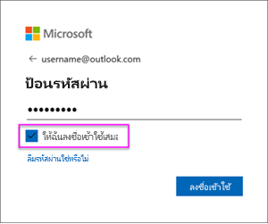

# รีเฟรชชุดข้อมูลที่สร้างขึ้นจากการไฟล์ .CSV บน OneDrive หรือ SharePoint OnlineRefresh a dataset created from a .CSV file on OneDrive or SharePoint Online
## มีข้อดีอะไรบ้างWhat are the advantages?
เมื่อคุณเชื่อมต่อไปยังไฟล์ .csv บน OneDrive หรือ SharePoint Online ชุดข้อมูลจะถูกสร้างขึ้นใน Power BIWhen you connect to a .csv file on OneDrive or SharePoint Online, a dataset is created in Power BI. จากนั้น ข้อมูลจากไฟล์ .csv จะถูกนำเข้าลงในชุดข้อมูลใน Power BIData from the .csv file is then imported into the dataset in Power BI. Power BI จะเชื่อมต่อไปยังไฟล์โดยอัตโนมัติ และรีเฟรชการเปลี่ยนแปลงใด ๆ กับชุดข้อมูลใน Power BIPower BI then automatically connects to the file and refreshes any changes with the dataset in Power BI. ถ้าคุณแก้ไขไฟล์ .csv ใน OneDrive หรือ SharePoint Online เมื่อคุณบันทึก การเปลี่ยนแปลงดังกล่าวจะปรากฏใน Power BI ซึ่งมักทำภายในประมาณหนึ่งชั่วโมงIf you edit the .csv file in OneDrive, or SharePoint Online, once you save, those changes will appear in Power BI, usually within about an hour. การแสดงภาพใด ๆ ใน Power BI ที่มาจากชุดข้อมูลจะถูกอัปเดตโดยอัตโนมัติด้วยAny visualizations in Power BI based on the dataset are automatically updated too.

ถ้าไฟล์ของคุณอยู่ในโฟลเดอร์ที่แชร์บน OneDrive for Business หรือ SharePoint Online ผู้ใช้อื่น ๆ สามารถทำงานบนไฟล์เดียวกันได้If your files are in a shared folder on OneDrive for Business, or SharePoint Online, other users can work on the same file. เมื่อบันทึก การเปลี่ยนแปลงจะถูกอัปเดตโดยอัตโนมัติใน Power BI ซึ่งมักทำภายในหนึ่งชั่วโมงOnce saved, any changes made are automatically updated in Power BI, usually within an hour.

องค์กรจำนวนมากเรียกใช้กระบวนการที่คิวรีฐานข้อมูลโดยอัตโนมัติ แล้วบันทึกไปยังไฟล์ .csv ในแต่ละวันMany organizations run processes that automatically query databases for data that is then saved to a .csv file each day. ถ้าไฟล์ถูกจัดเก็บบน OneDrive หรือ SharePoint Online และไฟล์เดียวกันถูกเขียนทับในแต่ละวัน แทนที่จะสร้างไฟล์ใหม่ด้วยชื่อที่แตกต่างกันในแต่ละวัน คุณสามารถเชื่อมต่อไปยังไฟล์นั้นใน Power BIIf the file is stored on OneDrive, or SharePoint Online, and the same file is overwritten each day, as opposed to a new file with a different name being created each day, you can connect to that file in Power BI. ชุดข้อมูลของคุณที่เชื่อมต่อกับไฟล์จะถูกซิงโครไนซ์ในไม่นาน หลังจากที่ไฟล์บน OneDrive หรือ SharePoint Online ถูกอัปเดตYour dataset that connects to the file will be synchronized soon after the file on OneDrive, or SharePoint Online, is updated. การแสดงภาพใด ๆ จากชุดข้อมูลนั้น จะถูกอัปเดตโดยอัตโนมัติเช่นกันAny visualizations based on the dataset are automatically updated too.

## รับรองอะไรบ้างWhat’s supported?
แฟ้มค่าที่คั่นด้วยเครื่องหมายจุลภาค เป็นแฟ้มข้อความแบบง่าย ๆ ดังนั้นการเชื่อมต่อกับแหล่งข้อมูลภายนอก และรายงาน จะไม่ได้รับการสนับสนุนComma separated value files are simple text files, so connections to external data sources and reports are not supported. คุณไม่สามารถกำหนดการรีเฟรชตามเวลา บนชุดข้อมูลที่สร้างจากแฟ้มค่าที่คั่นด้วยเครื่องหมายจุลภาคYou cannot schedule refresh on a dataset created from a comma delimited file. แต่ถ้าไฟล์อยู่บน OneDrive หรือ SharePoint Online, Power BI จะซิงโครไนซ์การเปลี่ยนแปลงใด ๆ ของไฟล์ไปยังชุดข้อมูลประมาณทุกชั่วโมงโดยอัตโนมัติHowever, when the file is on OneDrive, or SharePoint Online, Power BI will synchronize any changes to the file with the dataset automatically about every hour.

## OneDrive หรือ OneDrive สำหรับธุรกิจOneDrive or OneDrive for Business. ความแตกต่างคืออะไรWhat’s the difference?
ถ้าคุณมีทั้ง OneDrive ส่วนบุคคลและ OneDrive for Business แนะนำให้คุณเก็บไฟล์ต่าง ๆ ที่คุณต้องการเชื่อมต่อใน Power BI บน OneDrive for BusinessIf you have both a personal OneDrive and OneDrive for Business, it’s recommended you keep any files you want to connect to in Power BI on OneDrive for Business. นี่คือสาเหตุว่าทำไม: คุณอาจใช้บัญชีที่ต่างกันสองบัญชีในการลงชื่อเข้าใช้ OneDrive ส่วนบุคคล และ OneDrive สำหรับธุรกิจHere’s why: You likely use two different accounts to sign into them.

การเชื่อมต่อกับ OneDrive for Business ใน Power BI มักทำได้อย่างราบรื่น เพราะบัญชีที่คุณลงชื่อเข้าใช้ Power BI มักเป็นบัญชีเดียวกับที่ลงชื่อเข้าใช้ใน OneDrive for BusinessConnecting to OneDrive for Business in Power BI is typically seamless because the same account you use to sign into Power BI with is often the same account used to sign into OneDrive for Business. แต่ใน OneDrive ส่วนบุคคล คุณลงชื่อเข้าใช้ด้วย[บัญชี Microsoft](https://account.microsoft.com)But, with personal OneDrive, you likely sign in with a different [Microsoft account](https://account.microsoft.com).

เมื่อคุณลงชื่อเข้าใช้บัญชี Microsoft ของคุณ ตรวจสอบให้แน่ใจว่าได้เลือก “คงการลงชื่อเข้าใช้ของฉันไว้เสมอ”When you sign into your Microsoft account, be sure to select Keep me signed in. จากนั้น Power BI ถึงสามารถแล้วซิงโครไนซ์การอัปเดตใด ๆ กับชุดข้อมูลใน Power BI ได้Power BI can then synchronize any updates with datasets in Power BI

ถ้าคุณทำการเปลี่ยนแปลงไฟล์ .csv ของคุณบน OneDrive ที่ไม่สามารถซิงโครไนซ์กับชุดข้อมูลใน Power BI ได้ เนื่องจากข้อมูลประจำตัวของบัญชี Microsoft ของคุณอาจมีการเปลี่ยนแปลง คุณจะต้องเชื่อมต่อกับไฟล์ และนำเข้าอีกครั้งจาก OneDrive ส่วนบุคคลของคุณIf you make changes to your .csv file on OneDrive that cannot be synchronized with the dataset in Power BI because your Microsoft account credentials might have changed, you’ll need to connect to the file and import it again from your personal OneDrive.

## เมื่อเกิดสิ่งผิดปกติขึ้นWhen things go wrong
ถ้ามีการเปลี่ยนแปลงข้อมูลในไฟล์ .csv บน OneDrive และเปลี่ยนแปลงนั้นจะไม่ถูกแสดงใน Power BI สาเหตุน่าจะมาจาก Power BI ไม่สามารถเชื่อมต่อไปยัง OneDrive ของคุณIf data in the .csv file on OneDrive is changing and those changes aren’t being reflected in Power BI, it’s most likely because Power BI cannot connect to your OneDrive. ลองเชื่อมต่อไปยังไฟล์และการนำเข้าอีกครั้งTry connecting to the file and importing it again. ถ้าคุณได้รับพร้อมท์ให้ลงชื่อเข้าใช้ ตรวจสอบให้แน่ใจว่า คุณเลือก **คงการลงชื่อเข้าใช้ของฉันไว้เสมอ**If you’re prompted to sign in, make sure you select **Keep me signed in**.

## ขั้นตอนถัดไปNext steps
[เครื่องมือสำหรับการแก้ไขปัญหาการรีเฟรช](service-gateway-onprem-tshoot.md)
[การแก้ไขปัญหาการรีเฟรซสถานการณ์ต่าง ๆ](refresh-troubleshooting-refresh-scenarios.md)[Tools for troubleshooting refresh issues](service-gateway-onprem-tshoot.md)
[Troubleshooting refresh scenarios](refresh-troubleshooting-refresh-scenarios.md)

มีคำถามเพิ่มเติมหรือไม่More questions? [ลองถามชุมชน Power BITry asking the Power BI Community](https://community.powerbi.com/)

