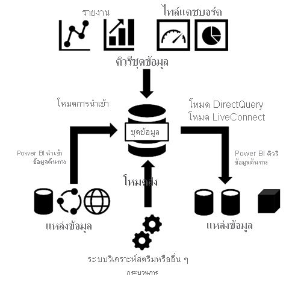
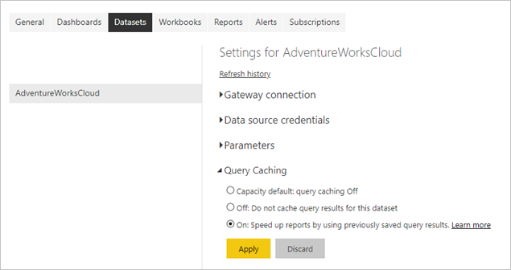
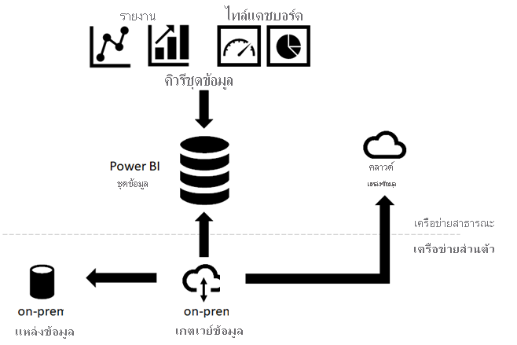

# <a name="data-refresh-in-power-bi"></a><span data-ttu-id="5b9d2-103">การรีเฟรชข้อมูลใน Power BI</span><span class="sxs-lookup"><span data-stu-id="5b9d2-103">Data refresh in Power BI</span></span>

<span data-ttu-id="5b9d2-104">Power BI ช่วยให้คุณสามารถเปลี่ยนจากข้อมูลเป็นข้อมูลเชิงลึกเพื่อดำเนินการได้อย่างรวดเร็ว แต่คุณต้องตรวจสอบให้แน่ใจว่าข้อมูลในรายงาน Power BI และแดชบอร์ดเป็นข้อมูลล่าสุด</span><span class="sxs-lookup"><span data-stu-id="5b9d2-104">Power BI enables you to go from data to insight to action quickly, yet you must make sure the data in your Power BI reports and dashboards is recent.</span></span> <span data-ttu-id="5b9d2-105">การเรียนรู้วิธีการรีเฟรชข้อมูลมักเป็นสิ่งสำคัญเพื่อให้ได้ผลลัพธ์ที่แม่นยำ</span><span class="sxs-lookup"><span data-stu-id="5b9d2-105">Knowing how to refresh the data is often critical in delivering accurate results.</span></span>

<span data-ttu-id="5b9d2-106">บทความนี้อธิบายคุณสมบัติการรีเฟรชข้อมูลของ Power BI และความเชื่อมโยงกันในระดับแนวคิด</span><span class="sxs-lookup"><span data-stu-id="5b9d2-106">This article describes the data refresh features of Power BI and their dependencies at a conceptual level.</span></span> <span data-ttu-id="5b9d2-107">นอกจากนี้ยังมีวิธีปฏิบัติที่ดีที่สุดและเคล็ดลับเพื่อหลีกเลี่ยงปัญหาการรีเฟรชทั่วไป</span><span class="sxs-lookup"><span data-stu-id="5b9d2-107">It also provides best practices and tips to avoid common refresh issues.</span></span> <span data-ttu-id="5b9d2-108">เนื้อหาจะกำหนดโครงสร้างเพื่อช่วยให้คุณเข้าใจว่าการรีเฟรชข้อมูลทำงานอย่างไร</span><span class="sxs-lookup"><span data-stu-id="5b9d2-108">The content lays a foundation to help you understand how data refresh works.</span></span> <span data-ttu-id="5b9d2-109">สำหรับคำแนะนำทีละขั้นตอนที่เป็นเป้าหมายเพื่อกำหนดค่าการรีเฟรชข้อมูล ให้ดูที่บทช่วยสอนและคำแนะนำวิธีการที่ระบุไว้ในส่วนขั้นตอนถัดไปที่ท้ายบทความนี้</span><span class="sxs-lookup"><span data-stu-id="5b9d2-109">For targeted step-by-step instructions to configure data refresh, refer to the tutorials and how-to guides listed in the Next steps section at the end of this article.</span></span>

## <a name="understanding-data-refresh"></a><span data-ttu-id="5b9d2-110">การทำความเข้าใจเกี่ยวกับการรีเฟรชข้อมูล</span><span class="sxs-lookup"><span data-stu-id="5b9d2-110">Understanding data refresh</span></span>

<span data-ttu-id="5b9d2-111">เมื่อใดก็ตามที่คุณรีเฟรชข้อมูล Power BI จะต้องทำการคิวรีแหล่งข้อมูลพื้นฐาน บางทีอาจโหลดข้อมูลจากแหล่งข้อมูลลงในชุดข้อมูลจากนั้นอัปเดตการแสดงภาพข้อมูลใด ๆ ในรายงานหรือแดชบอร์ดที่ใช้ชุดข้อมูลที่อัปเดต</span><span class="sxs-lookup"><span data-stu-id="5b9d2-111">Whenever you refresh data, Power BI must query the underlying data sources, possibly load the source data into a dataset, and then update any visualizations in your reports or dashboards that rely on the updated dataset.</span></span> <span data-ttu-id="5b9d2-112">กระบวนการทั้งหมดประกอบด้วยหลายขั้นตอน ขึ้นอยู่กับโหมดการจัดเก็บข้อมูลของชุดข้อมูลตามที่อธิบายไว้ในส่วนต่อไปนี้ี้</span><span class="sxs-lookup"><span data-stu-id="5b9d2-112">The entire process consists of multiple phases, depending on the storage modes of your datasets, as explained in the following sections.</span></span>

<span data-ttu-id="5b9d2-113">เพื่อทำความเข้าใจวิธีการที่ Power BI รีเฟรชชุดข้อมูล รายงาน และแดชบอร์ด คุณต้องการทราบแนวคิดต่อไปนี้:</span><span class="sxs-lookup"><span data-stu-id="5b9d2-113">To understand how Power BI refreshes your datasets, reports, and dashboards, you must be aware of the following concepts:</span></span>

- <span data-ttu-id="5b9d2-114">**โหมดการจัดเก็บข้อมูลและชนิดของชุดข้อมูล**: โหมดการจัดเก็บข้อมูลและชนิดของชุดข้อมูลที่ Power BI สนับสนุน มีข้อกำหนดการรีเฟรชที่แตกต่างกัน</span><span class="sxs-lookup"><span data-stu-id="5b9d2-114">**Storage modes and dataset types**: The storage modes and dataset types that Power BI supports have different refresh requirements.</span></span> <span data-ttu-id="5b9d2-115">คุณสามารถเลือกระหว่างการนำเข้าข้อมูลอีกครั้งใน Power BI เพื่อดูการเปลี่ยนแปลงใด ๆ ที่เกิดขึ้นหรือทำการคิวรีข้อมูลโดยตรงที่แหล่งที่มา</span><span class="sxs-lookup"><span data-stu-id="5b9d2-115">You can choose between re-importing data into Power BI to see any changes that occurred or querying the data directly at the source.</span></span>
- <span data-ttu-id="5b9d2-116">**ชนิดการรีเฟรชของ Power BI**: โดยไม่คำนึงถึงข้อมูลจำเพาะของชุดข้อมูล การทราบวิธีการรีเฟรชประเภทต่าง ๆ สามารถช่วยให้คุณเข้าใจว่า Power BI อาจใช้เวลาในระหว่างการดำเนินการรีเฟรช</span><span class="sxs-lookup"><span data-stu-id="5b9d2-116">**Power BI refresh types**: Regardless of dataset specifics, knowing the various refresh types can help you understand where Power BI might spend its time during a refresh operation.</span></span> <span data-ttu-id="5b9d2-117">และรวมรายละเอียดเหล่านี้กับข้อมูลจำเพาะของโหมดการจัดเก็บข้อมูลจะช่วยให้เข้าใจสิ่งที่ Power BI ดำเนินการอย่างตรงกันเมื่อคุณเลือก **รีเฟรชเดี๋ยวนี้** สำหรับชุดข้อมูล</span><span class="sxs-lookup"><span data-stu-id="5b9d2-117">And combining these details with storage mode specifics helps to understand what exactly Power BI performs when you select **Refresh Now** for a dataset.</span></span>

### <a name="storage-modes-and-dataset-types"></a><span data-ttu-id="5b9d2-118">โหมดการจัดเก็บข้อมูลและชนิดของชุดข้อมูล</span><span class="sxs-lookup"><span data-stu-id="5b9d2-118">Storage modes and dataset types</span></span>

<span data-ttu-id="5b9d2-119">ชุดข้อมูล Power BI สามารถทำงานในโหมดใดโหมดหนึ่งต่อไปนี้เพื่อเข้าถึงข้อมูลจากแหล่งข้อมูลที่หลากหลาย</span><span class="sxs-lookup"><span data-stu-id="5b9d2-119">A Power BI dataset can operate in one of the following modes to access data from a variety of data sources.</span></span> <span data-ttu-id="5b9d2-120">สำหรับข้อมูลเพิ่มเติม โปรดดู [โหมดการจัดเก็บข้อมูลใน Power BI Desktop](../transform-model/desktop-storage-mode.md)</span><span class="sxs-lookup"><span data-stu-id="5b9d2-120">For more information, see [Storage mode in Power BI Desktop](../transform-model/desktop-storage-mode.md).</span></span>

- <span data-ttu-id="5b9d2-121">โหมดการนำเข้า</span><span class="sxs-lookup"><span data-stu-id="5b9d2-121">Import mode</span></span>
- <span data-ttu-id="5b9d2-122">โหมด DirectQuery</span><span class="sxs-lookup"><span data-stu-id="5b9d2-122">DirectQuery mode</span></span>
- <span data-ttu-id="5b9d2-123">โหมด LiveConnect</span><span class="sxs-lookup"><span data-stu-id="5b9d2-123">LiveConnect mode</span></span>
- <span data-ttu-id="5b9d2-124">โหมดส่ง</span><span class="sxs-lookup"><span data-stu-id="5b9d2-124">Push mode</span></span>

<span data-ttu-id="5b9d2-125">แผนภาพต่อไปนี้แสดงให้เห็นถึงโฟลว์ของข้อมูลที่แตกต่างกัน ขึ้นอยู่กับโหมดการจัดเก็บข้อมูล</span><span class="sxs-lookup"><span data-stu-id="5b9d2-125">The following diagram illustrates the different data flows, based on storage mode.</span></span> <span data-ttu-id="5b9d2-126">จุดที่สำคัญที่สุดคือเฉพาะชุดข้อมูลของโหมดการนำเข้าเท่านั้นที่จำเป็นต้องมีการรีเฟรชข้อมูลจากแหล่งข้อมูล</span><span class="sxs-lookup"><span data-stu-id="5b9d2-126">The most significant point is that only Import mode datasets require a source data refresh.</span></span> <span data-ttu-id="5b9d2-127">ซึ่งจำเป็นต้องรีเฟรชเนื่องจากมีเพียงชุดข้อมูลประเภทนี้ที่นำเข้าข้อมูลจากแหล่งข้อมูล และข้อมูลที่นำเข้าอาจได้รับการอัปเดตตามปกติหรือแบบเฉพาะกิจ</span><span class="sxs-lookup"><span data-stu-id="5b9d2-127">They require refresh because only this type of dataset imports data from its data sources, and the imported data might be updated on a regular or ad-hoc basis.</span></span> <span data-ttu-id="5b9d2-128">ชุดข้อมูล DirectQuery และชุดข้อมูลในโหมด LiveConnect ใน Analysis Services จะไม่นำเข้าข้อมูล แต่จะคิวรีแหล่งข้อมูลพื้นฐานที่มีการโต้ตอบกับผู้ใช้ทุกคน</span><span class="sxs-lookup"><span data-stu-id="5b9d2-128">DirectQuery datasets and datasets in LiveConnect mode to Analysis Services don't import data; they query the underlying data source with every user interaction.</span></span> <span data-ttu-id="5b9d2-129">ชุดข้อมูลในโหมดส่งไม่สามารถเข้าถึงแหล่งข้อมูลใด ๆ ได้โดยตรง แต่ต้องการให้คุณส่งข้อมูลไปยัง Power BI</span><span class="sxs-lookup"><span data-stu-id="5b9d2-129">Datasets in push mode don't access any data sources directly but expect you to push the data into Power BI.</span></span> <span data-ttu-id="5b9d2-130">ข้อกำหนดการรีเฟรชชุดข้อมูลจะแตกต่างกันไป ขึ้นอยู่กับโหมดการจัดเก็บข้อมูล/ประเภทชุดข้อมูล</span><span class="sxs-lookup"><span data-stu-id="5b9d2-130">Dataset refresh requirements vary depending on the storage mode/dataset type.</span></span>



#### <a name="datasets-in-import-mode"></a><span data-ttu-id="5b9d2-132">ชุดข้อมูลในโหมดการนำเข้า</span><span class="sxs-lookup"><span data-stu-id="5b9d2-132">Datasets in Import mode</span></span>

<span data-ttu-id="5b9d2-133">Power BI นำเข้าข้อมูลจากแหล่งข้อมูลต้นฉบับไปยังชุดข้อมูล</span><span class="sxs-lookup"><span data-stu-id="5b9d2-133">Power BI imports the data from the original data sources into the dataset.</span></span> <span data-ttu-id="5b9d2-134">รายงาน Power BI และคิวรีแดชบอร์ดที่ส่งไปยังชุดข้อมูลจะส่งคืนผลลัพธ์จากตารางและคอลัมน์ที่นำเข้า</span><span class="sxs-lookup"><span data-stu-id="5b9d2-134">Power BI report and dashboard queries submitted to the dataset return results from the imported tables and columns.</span></span> <span data-ttu-id="5b9d2-135">คุณอาจถือว่าชุดข้อมูลดังกล่าวเป็นส่วนหนึ่งของการคัดลอกในตอนนั้น</span><span class="sxs-lookup"><span data-stu-id="5b9d2-135">You might consider such a dataset a point-in-time copy.</span></span> <span data-ttu-id="5b9d2-136">เนื่องจาก Power BI ทำการคัดลอกข้อมูล คุณต้องรีเฟรชชุดข้อมูลเพื่อดึงข้อมูลการเปลี่ยนแปลงจากแหล่งข้อมูลพื้นฐาน</span><span class="sxs-lookup"><span data-stu-id="5b9d2-136">Because Power BI copies the data, you must refresh the dataset to fetch changes from the underlying data sources.</span></span>

<span data-ttu-id="5b9d2-137">เนื่องจาก Power BI ทำการแคชข้อมูล ขนาดชุดข้อมูลของโหมดการนำเข้าจึงมีความสำคัญ</span><span class="sxs-lookup"><span data-stu-id="5b9d2-137">Because Power BI caches the data, Import mode dataset sizes can be substantial.</span></span> <span data-ttu-id="5b9d2-138">ดูตารางต่อไปนี้สำหรับขนาดชุดข้อมูลสูงสุดต่อความจุ</span><span class="sxs-lookup"><span data-stu-id="5b9d2-138">Refer to the following table for maximum dataset sizes per capacity.</span></span> <span data-ttu-id="5b9d2-139">รักษาให้อยู่ต่ำกว่าขนาดชุดข้อมูลสูงสุดเพื่อหลีกเลี่ยงปัญหาการรีเฟรชที่อาจเกิดขึ้นหากชุดข้อมูลของคุณต้องการมากกว่าทรัพยากรที่มีสูงสุดในระหว่างการดำเนินการรีเฟรช</span><span class="sxs-lookup"><span data-stu-id="5b9d2-139">Stay well below the maximum dataset sizes to avoid refresh issues that might occur if your datasets require more than the maximum available resources during a refresh operation.</span></span>

| <span data-ttu-id="5b9d2-140">ประเภทความจุ</span><span class="sxs-lookup"><span data-stu-id="5b9d2-140">Capacity type</span></span> | <span data-ttu-id="5b9d2-141">ขนาดชุดข้อมูลสูงสุด</span><span class="sxs-lookup"><span data-stu-id="5b9d2-141">Maximum dataset size</span></span> |
| --- | --- |
| <span data-ttu-id="5b9d2-142">แชร์, A1, A2 หรือ A3</span><span class="sxs-lookup"><span data-stu-id="5b9d2-142">Shared, A1, A2, or A3</span></span> | <span data-ttu-id="5b9d2-143">1 GB</span><span class="sxs-lookup"><span data-stu-id="5b9d2-143">1 GB</span></span> |
| <span data-ttu-id="5b9d2-144">A4 หรือ P1</span><span class="sxs-lookup"><span data-stu-id="5b9d2-144">A4 or P1</span></span> | <span data-ttu-id="5b9d2-145">3 GB</span><span class="sxs-lookup"><span data-stu-id="5b9d2-145">3 GB</span></span> |
| <span data-ttu-id="5b9d2-146">A5 หรือ P2</span><span class="sxs-lookup"><span data-stu-id="5b9d2-146">A5 or P2</span></span> | <span data-ttu-id="5b9d2-147">6 GB</span><span class="sxs-lookup"><span data-stu-id="5b9d2-147">6 GB</span></span> |
| <span data-ttu-id="5b9d2-148">A6 หรือ P3</span><span class="sxs-lookup"><span data-stu-id="5b9d2-148">A6 or P3</span></span> | <span data-ttu-id="5b9d2-149">10 GB</span><span class="sxs-lookup"><span data-stu-id="5b9d2-149">10 GB</span></span> |
| | |

#### <a name="datasets-in-directqueryliveconnect-mode"></a><span data-ttu-id="5b9d2-150">ชุดข้อมูลในโหมด DirectQuery/LiveConnect</span><span class="sxs-lookup"><span data-stu-id="5b9d2-150">Datasets in DirectQuery/LiveConnect mode</span></span>

<span data-ttu-id="5b9d2-151">Power BI ไม่นำเข้าข้อมูลผ่านการเชื่อมต่อที่ใช้งานในโหมด DirectQuery/LiveConnect</span><span class="sxs-lookup"><span data-stu-id="5b9d2-151">Power BI does not import data over connections that operate in DirectQuery/LiveConnect mode.</span></span> <span data-ttu-id="5b9d2-152">แต่ชุดข้อมูลจะส่งกลับผลลัพธ์จากแหล่งข้อมูลพื้นฐานเมื่อใดก็ตามที่รายงานหรือแดชบอร์ดทำการคิวรีชุดข้อมูล</span><span class="sxs-lookup"><span data-stu-id="5b9d2-152">Instead, the dataset returns results from the underlying data source whenever a report or dashboard queries the dataset.</span></span> <span data-ttu-id="5b9d2-153">Power BI จะแปลงและส่งต่อคิวรีไปยังแหล่งข้อมูล</span><span class="sxs-lookup"><span data-stu-id="5b9d2-153">Power BI transforms and forwards the queries to the data source.</span></span>

<span data-ttu-id="5b9d2-154">แม้ว่าโหมด DirectQuery และ LiveConnect จะคล้ายกันกับที่ Power BI ส่งต่อการคิวรีไปยังแหล่งข้อมูล แต่สิ่งสำคัญคือต้องทราบว่า Power BI ไม่จำเป็นต้องแปลงการคิวรีในโหมด LiveConnect</span><span class="sxs-lookup"><span data-stu-id="5b9d2-154">Although DirectQuery mode and LiveConnect mode are similar in that Power BI forwards the queries to the source, it is important to note that Power BI does not have to transform queries in LiveConnect mode.</span></span> <span data-ttu-id="5b9d2-155">คิวรีจะตรงไปยังอินสแตนซ์ Analysis Services ที่โฮสต์ฐานข้อมูลโดยไม่ต้องใช้ทรัพยากรในความจุที่ใช้ร่วมกันหรือความจุพรีเมียม</span><span class="sxs-lookup"><span data-stu-id="5b9d2-155">The queries go directly to the Analysis Services instance hosting the database without consuming resources on shared capacity or a Premium capacity.</span></span>

<span data-ttu-id="5b9d2-156">เนื่องจาก Power BI ไม่นำเข้าข้อมูล คุณจึงไม่จำเป็นต้องเรียกใช้การรีเฟรชข้อมูล</span><span class="sxs-lookup"><span data-stu-id="5b9d2-156">Because Power BI does not import the data, you don't need to run a data refresh.</span></span> <span data-ttu-id="5b9d2-157">อย่างไรก็ตาม Power BI ยังคงดำเนินการรีเฟรชไทล์ และอาจรวมถึงการรีเฟรชรายงานตามที่อธิบายในส่วนถัดไปเกี่ยวกับชนิดของการรีเฟรช</span><span class="sxs-lookup"><span data-stu-id="5b9d2-157">However, Power BI still performs tile refreshes and possibly report refreshes, as the next section on refresh types explains.</span></span> <span data-ttu-id="5b9d2-158">ไทล์คือภาพวิชวลรายงานที่ปักหมุดไว้ที่แดชบอร์ด และการรีเฟรชไทล์ของแดชบอร์ดเกิดขึ้นประมาณทุกชั่วโมงเพื่อให้ไทล์แสดงผลลัพธ์ล่าสุด</span><span class="sxs-lookup"><span data-stu-id="5b9d2-158">A tile is a report visual pinned to a dashboard, and dashboard tile refreshes happen about every hour so that the tiles show recent results.</span></span> <span data-ttu-id="5b9d2-159">คุณสามารถเปลี่ยนแปลงกำหนดตารางเวลาในการตั้งค่าชุดข้อมูลตามสกรีนช็อตด้านล่าง หรือบังคับให้มีการอัปเดตแดชบอร์ดด้วยตนเอง โดยใช้ตัวเลือก **รีเฟรชเดี๋ยวนี้** ได้</span><span class="sxs-lookup"><span data-stu-id="5b9d2-159">You can change the schedule in the dataset settings, as in the screenshot below, or force a dashboard update manually by using the **Refresh Now** option.</span></span>


> [!NOTE]
> <span data-ttu-id="5b9d2-161">ส่วน **รีเฟรชแคชตามกำหนดเวลา** ของแท็บ **ชุดข้อมูล** จะไม่พร้อมใช้งานสำหรับชุดข้อมูลในโหมดการนำเข้า</span><span class="sxs-lookup"><span data-stu-id="5b9d2-161">The **Scheduled cache refresh** section of the **Datasets** tab is not available for datasets in import mode.</span></span> <span data-ttu-id="5b9d2-162">ชุดข้อมูลเหล่านี้ไม่จำเป็นต้องทำการรีเฟรชไทล์แยกเนื่องจาก Power BI จะรีเฟรชไทล์โดยอัตโนมัติในระหว่างการรีเฟรชข้อมูลตามกำหนดเวลาหรือตามคำขอ</span><span class="sxs-lookup"><span data-stu-id="5b9d2-162">These datasets don't require a separate tile refresh because Power BI refreshes the tiles automatically during each scheduled or on-demand data refresh.</span></span>

#### <a name="push-datasets"></a><span data-ttu-id="5b9d2-163">ส่งชุดข้อมูล</span><span class="sxs-lookup"><span data-stu-id="5b9d2-163">Push datasets</span></span>

<span data-ttu-id="5b9d2-164">ชุดข้อมูลการส่งไม่มีคำจำกัดความที่เป็นทางการของแหล่งข้อมูลดังนั้นจึงไม่ต้องการให้คุณทำการรีเฟรชข้อมูลใน Power BI</span><span class="sxs-lookup"><span data-stu-id="5b9d2-164">Push datasets don't contain a formal definition of a data source, so they don't require you to perform a data refresh in Power BI.</span></span> <span data-ttu-id="5b9d2-165">คุณทำการรีเฟรชได้โดยการส่งข้อมูลของคุณเข้าไปในชุดข้อมูลผ่านบริการหรือกระบวนการภายนอกเช่น Azure Stream Analyticss</span><span class="sxs-lookup"><span data-stu-id="5b9d2-165">You refresh them by pushing your data into the dataset through an external service or process, such as Azure Stream Analytics.</span></span> <span data-ttu-id="5b9d2-166">วิธีนี้เป็นวิธีแบบทั่วไปสำหรับการวิเคราะห์แบบเรียลไทม์ด้วย Power BI</span><span class="sxs-lookup"><span data-stu-id="5b9d2-166">This is a common approach for real-time analytics with Power BI.</span></span> <span data-ttu-id="5b9d2-167">Power BI ยังคงดำเนินการรีเฟรชแคชสำหรับไทล์ใด ๆ ที่ใช้อยู่ด้านบนของชุดข้อมูลการส่ง</span><span class="sxs-lookup"><span data-stu-id="5b9d2-167">Power BI still performs cache refreshes for any tiles used on top of a push dataset.</span></span> <span data-ttu-id="5b9d2-168">สำหรับรายละเอียด ดู[บทช่วยสอน: Stream Analytics และ Power BI: แดชบอร์ดการวิเคราะห์แบบเรียลไทม์สำหรับการสตรีมข้อมูล](/azure/stream-analytics/stream-analytics-power-bi-dashboard)</span><span class="sxs-lookup"><span data-stu-id="5b9d2-168">For a detailed walkthrough, see [Tutorial: Stream Analytics and Power BI: A real-time analytics dashboard for streaming data](/azure/stream-analytics/stream-analytics-power-bi-dashboard).</span></span>

> [!NOTE]
> <span data-ttu-id="5b9d2-169">โหมดส่งมีข้อจำกัดหลายอย่างตามที่ระบุไว้ใน[ข้อจำกัดของ Power BI REST API](../developer/automation/api-rest-api-limitations.md)</span><span class="sxs-lookup"><span data-stu-id="5b9d2-169">Push Mode has several limitations as documented in [Power BI REST API limitations](../developer/automation/api-rest-api-limitations.md).</span></span>

### <a name="power-bi-refresh-types"></a><span data-ttu-id="5b9d2-170">ชนิดการรีเฟรชของ Power BI</span><span class="sxs-lookup"><span data-stu-id="5b9d2-170">Power BI refresh types</span></span>

<span data-ttu-id="5b9d2-171">การดำเนินการรีเฟรช Power BI อาจประกอบด้วยการรีเฟรชหลายประเภทรวมถึงการรีเฟรชข้อมูล การรีเฟรช OneDrive การรีเฟรชของแคชคิวรี การรีเฟรชไทล์ และการรีเฟรชภาพวิชวลของรายงาน</span><span class="sxs-lookup"><span data-stu-id="5b9d2-171">A Power BI refresh operation can consist of multiple refresh types, including data refresh, OneDrive refresh, refresh of query caches, tile refresh, and refresh of report visuals.</span></span> <span data-ttu-id="5b9d2-172">ในขณะที่ Power BI กำหนดขั้นตอนการรีเฟรชที่จำเป็นสำหรับชุดข้อมูลที่กำหนดไว้โดยอัตโนมัติ คุณควรทราบว่าการรีเฟรชเหล่านี้ก่อให้เกิดความซับซ้อนและระยะเวลาของการรีเฟรชอย่างไร</span><span class="sxs-lookup"><span data-stu-id="5b9d2-172">While Power BI determines the required refresh steps for a given dataset automatically, you should know how they contribute to the complexity and duration of a refresh operation.</span></span> <span data-ttu-id="5b9d2-173">สำหรับการอ้างอิงด่วน ดูตารางต่อไปนี้</span><span class="sxs-lookup"><span data-stu-id="5b9d2-173">For a quick reference, refer to the following table.</span></span>

| <span data-ttu-id="5b9d2-174">โหมดการจัดเก็บข้อมูล</span><span class="sxs-lookup"><span data-stu-id="5b9d2-174">Storage mode</span></span> | <span data-ttu-id="5b9d2-175">การรีเฟรชข้อมูล</span><span class="sxs-lookup"><span data-stu-id="5b9d2-175">Data refresh</span></span> | <span data-ttu-id="5b9d2-176">การรีเฟรช OneDrive</span><span class="sxs-lookup"><span data-stu-id="5b9d2-176">OneDrive refresh</span></span> | <span data-ttu-id="5b9d2-177">การแคชของคิวรี</span><span class="sxs-lookup"><span data-stu-id="5b9d2-177">Query caches</span></span> | <span data-ttu-id="5b9d2-178">การรีเฟรชไทล์</span><span class="sxs-lookup"><span data-stu-id="5b9d2-178">Tile refresh</span></span> | <span data-ttu-id="5b9d2-179">ภาพวิชวลรายงาน</span><span class="sxs-lookup"><span data-stu-id="5b9d2-179">Report visuals</span></span> |
| --- | --- | --- | --- | --- | --- |
| <span data-ttu-id="5b9d2-180">นำเข้า</span><span class="sxs-lookup"><span data-stu-id="5b9d2-180">Import</span></span> | <span data-ttu-id="5b9d2-181">ตามกำหนดเวลาและตามคำขอ</span><span class="sxs-lookup"><span data-stu-id="5b9d2-181">Scheduled and on-demand</span></span> | <span data-ttu-id="5b9d2-182">ใช่ สำหรับชุดข้อมูลที่เชื่อมต่อ</span><span class="sxs-lookup"><span data-stu-id="5b9d2-182">Yes, for connected datasets</span></span> | <span data-ttu-id="5b9d2-183">ถ้าเปิดใช้งานบนความจุพรีเมียม</span><span class="sxs-lookup"><span data-stu-id="5b9d2-183">If enabled on Premium capacity</span></span> | <span data-ttu-id="5b9d2-184">โดยอัตโนมัติ และตามคำขอ</span><span class="sxs-lookup"><span data-stu-id="5b9d2-184">Automatically and on-demand</span></span> | <span data-ttu-id="5b9d2-185">ไม่ใช่</span><span class="sxs-lookup"><span data-stu-id="5b9d2-185">No</span></span> |
| <span data-ttu-id="5b9d2-186">DirectQuery</span><span class="sxs-lookup"><span data-stu-id="5b9d2-186">DirectQuery</span></span> | <span data-ttu-id="5b9d2-187">ไม่สามารถใช้งานได้</span><span class="sxs-lookup"><span data-stu-id="5b9d2-187">Not applicable</span></span> | <span data-ttu-id="5b9d2-188">ใช่ สำหรับชุดข้อมูลที่เชื่อมต่อ</span><span class="sxs-lookup"><span data-stu-id="5b9d2-188">Yes, for connected datasets</span></span> | <span data-ttu-id="5b9d2-189">ถ้าเปิดใช้งานบนความจุพรีเมียม</span><span class="sxs-lookup"><span data-stu-id="5b9d2-189">If enabled on Premium capacity</span></span> | <span data-ttu-id="5b9d2-190">โดยอัตโนมัติ และตามคำขอ</span><span class="sxs-lookup"><span data-stu-id="5b9d2-190">Automatically and on-demand</span></span> | <span data-ttu-id="5b9d2-191">ไม่ใช่</span><span class="sxs-lookup"><span data-stu-id="5b9d2-191">No</span></span> |
| <span data-ttu-id="5b9d2-192">LiveConnect</span><span class="sxs-lookup"><span data-stu-id="5b9d2-192">LiveConnect</span></span> | <span data-ttu-id="5b9d2-193">ไม่สามารถใช้งานได้</span><span class="sxs-lookup"><span data-stu-id="5b9d2-193">Not applicable</span></span> | <span data-ttu-id="5b9d2-194">ใช่ สำหรับชุดข้อมูลที่เชื่อมต่อ</span><span class="sxs-lookup"><span data-stu-id="5b9d2-194">Yes, for connected datasets</span></span> | <span data-ttu-id="5b9d2-195">ถ้าเปิดใช้งานบนความจุพรีเมียม</span><span class="sxs-lookup"><span data-stu-id="5b9d2-195">If enabled on Premium capacity</span></span> | <span data-ttu-id="5b9d2-196">โดยอัตโนมัติ และตามคำขอ</span><span class="sxs-lookup"><span data-stu-id="5b9d2-196">Automatically and on-demand</span></span> | <span data-ttu-id="5b9d2-197">ใช่</span><span class="sxs-lookup"><span data-stu-id="5b9d2-197">Yes</span></span> |
| <span data-ttu-id="5b9d2-198">ส่ง</span><span class="sxs-lookup"><span data-stu-id="5b9d2-198">Push</span></span> | <span data-ttu-id="5b9d2-199">ไม่สามารถใช้งานได้</span><span class="sxs-lookup"><span data-stu-id="5b9d2-199">Not applicable</span></span> | <span data-ttu-id="5b9d2-200">ไม่สามารถใช้งานได้</span><span class="sxs-lookup"><span data-stu-id="5b9d2-200">Not applicable</span></span> | <span data-ttu-id="5b9d2-201">ไม่ได้ผล</span><span class="sxs-lookup"><span data-stu-id="5b9d2-201">Not practical</span></span> | <span data-ttu-id="5b9d2-202">โดยอัตโนมัติ และตามคำขอ</span><span class="sxs-lookup"><span data-stu-id="5b9d2-202">Automatically and on-demand</span></span> | <span data-ttu-id="5b9d2-203">ไม่ใช่</span><span class="sxs-lookup"><span data-stu-id="5b9d2-203">No</span></span> |
| | | | | | |

#### <a name="data-refresh"></a><span data-ttu-id="5b9d2-204">การรีเฟรชข้อมูล</span><span class="sxs-lookup"><span data-stu-id="5b9d2-204">Data refresh</span></span>

<span data-ttu-id="5b9d2-205">สำหรับผู้ใช้ Power BI โดยทั่วไปการรีเฟรชข้อมูลหมายถึงการนำเข้าข้อมูลจากแหล่งข้อมูลดั้งเดิมไปยังชุดข้อมูล ไม่ว่าจะตามกำหนดเวลาการรีเฟรชหรือตามคำขอ</span><span class="sxs-lookup"><span data-stu-id="5b9d2-205">For Power BI users, refreshing data typically means importing data from the original data sources into a dataset, either based on a refresh schedule or on-demand.</span></span> <span data-ttu-id="5b9d2-206">คุณสามารถทำการรีเฟรชชุดข้อมูลได้หลายชุดต่อวัน ซึ่งอาจจำเป็นถ้าข้อมูลจากแหล่งข้อมูลเปลี่ยนแปลงบ่อย</span><span class="sxs-lookup"><span data-stu-id="5b9d2-206">You can perform multiple dataset refreshes daily, which might be necessary if the underlying source data changes frequently.</span></span> <span data-ttu-id="5b9d2-207">Power BI จะจำกัดชุดข้อมูลบนความจุที่ใช้ร่วมกันสำหรับการรีเฟรชแปดรายการต่อวัน</span><span class="sxs-lookup"><span data-stu-id="5b9d2-207">Power BI limits datasets on shared capacity to eight daily refreshes.</span></span> <span data-ttu-id="5b9d2-208">หากชุดข้อมูลนั้นอยู่ในความจุพรีเมียม คุณสามารถกำหนดตารางเวลาการรีเฟรชได้สูงสุด 48 รายการต่อวันในการตั้งค่าชุดข้อมูล</span><span class="sxs-lookup"><span data-stu-id="5b9d2-208">If the dataset resides on a Premium capacity, you can schedule up to 48 refreshes per day in the dataset settings.</span></span> <span data-ttu-id="5b9d2-209">สำหรับข้อมูลเพิ่มเติม โปรดดู [กำหนดค่าการรีเฟรชตามกำหนดการ](#configure-scheduled-refresh) ในบทความนี้ได้ในภายหลัง</span><span class="sxs-lookup"><span data-stu-id="5b9d2-209">For more information, see [Configure scheduled refresh](#configure-scheduled-refresh) later in this article.</span></span> <span data-ttu-id="5b9d2-210">ชุดข้อมูลบนความจุแบบพรีเมียมที่มีการเปิดใช้งาน [ตำแหน่งข้อมูล XMLA](../admin/service-premium-connect-tools.md) สำหรับการอ่าน - เขียนจะสนับสนุนการดำเนินการรีเฟรชแบบไม่จำกัด เมื่อกำหนดค่าโดยทางโปรแกรมด้วย TMSL หรือ PowerShell</span><span class="sxs-lookup"><span data-stu-id="5b9d2-210">Datasets on a Premium capacity with the [XMLA endpoint](../admin/service-premium-connect-tools.md) enabled for read-write support unlimited refresh operations when configured programmatically with TMSL or PowerShell.</span></span>

<span data-ttu-id="5b9d2-211">สิ่งสำคัญคือต้องกำหนดข้อจำกัดของความจุที่ใช้ร่วมกันสำหรับการรีเฟรชรายวันที่ใช้กับการรีเฟรชทั้งแบบกำหนดเวลาและ API รวมกัน</span><span class="sxs-lookup"><span data-stu-id="5b9d2-211">It is also important to call out that the shared-capacity limitation for daily refreshes applies to both scheduled refreshes and API refreshes combined.</span></span> <span data-ttu-id="5b9d2-212">คุณยังสามารถทริกเกอร์การรีเฟรชตามคำขอโดยการเลือก **รีเฟรชเดี๋ยวนี้** ในเมนูชุดข้อมูล ตามที่สกรีนช็อตต่อไปนี้แสดง</span><span class="sxs-lookup"><span data-stu-id="5b9d2-212">You can also trigger an on-demand refresh by selecting **Refresh Now** in the dataset menu, as the following screenshot depicts.</span></span> <span data-ttu-id="5b9d2-213">การรีเฟรชตามความต้องการจะไม่รวมอยู่ในข้อจำกัดการรีเฟรช</span><span class="sxs-lookup"><span data-stu-id="5b9d2-213">On-demand refreshes are not included in the refresh limitation.</span></span> <span data-ttu-id="5b9d2-214">นอกจากนี้โปรดทราบว่าชุดข้อมูลบนความจุ Premium ไม่ได้กำหนดขีดจำกัดสำหรับการรีเฟรช API</span><span class="sxs-lookup"><span data-stu-id="5b9d2-214">Also note that datasets on a Premium capacity don't impose limitations for API refreshes.</span></span> <span data-ttu-id="5b9d2-215">หากคุณมีความสนใจในการสร้างโซลูชันการรีเฟรชของคุณเองโดยใช้ Power BI REST API ดู[ชุดข้อมูล-รีเฟรช-ชุดข้อมูล](/rest/api/power-bi/datasets/refreshdataset)</span><span class="sxs-lookup"><span data-stu-id="5b9d2-215">If you are interested in building your own refresh solution by using the Power BI REST API, see [Datasets - Refresh Dataset](/rest/api/power-bi/datasets/refreshdataset).</span></span>


> [!NOTE]
> <span data-ttu-id="5b9d2-217">การรีเฟรชข้อมูลจะต้องดำเนินการให้แล้วเสร็จภายในเวลาไม่เกิน 2 ชั่วโมงบนความจุที่ใช้ร่วมกัน</span><span class="sxs-lookup"><span data-stu-id="5b9d2-217">Data refreshes must complete in less than 2 hours on shared capacity.</span></span> <span data-ttu-id="5b9d2-218">หากชุดข้อมูลของคุณต้องการการดำเนินการรีเฟรชที่นานขึ้น ให้ลองย้ายชุดข้อมูลไปยังความจุพรีเมียม</span><span class="sxs-lookup"><span data-stu-id="5b9d2-218">If your datasets require longer refresh operations, consider moving the dataset onto a Premium capacity.</span></span> <span data-ttu-id="5b9d2-219">ในความจุพรีเมียม ระยะเวลาการรีเฟรชสูงสุดคือ 5 ชั่วโมง</span><span class="sxs-lookup"><span data-stu-id="5b9d2-219">On Premium, the maximum refresh duration is 5 hours.</span></span>

#### <a name="onedrive-refresh"></a><span data-ttu-id="5b9d2-220">การรีเฟรช OneDrive</span><span class="sxs-lookup"><span data-stu-id="5b9d2-220">OneDrive refresh</span></span>

<span data-ttu-id="5b9d2-221">หากคุณสร้างชุดข้อมูลและรายงานตามไฟล์ Power BI Desktop, สมุดงาน Excel หรือไฟล์ค่าที่คั่นด้วยเครื่องหมายจุลภาค (.csv) บน OneDrive หรือ SharePoint Online, Power BI จะทำการรีเฟรชอีกประเภทหนึ่งเรียกว่าการรีเฟรช OneDrive</span><span class="sxs-lookup"><span data-stu-id="5b9d2-221">If you created your datasets and reports based on a Power BI Desktop file, Excel workbook, or comma separated value (.csv) file on OneDrive or SharePoint Online, Power BI performs another type of refresh, known as OneDrive refresh.</span></span> <span data-ttu-id="5b9d2-222">สำหรับข้อมูลเพิ่มเติม ดู [รับข้อมูลจากไฟล์สำหรับ Power BI](service-get-data-from-files.md)</span><span class="sxs-lookup"><span data-stu-id="5b9d2-222">For more information, see [Get data from files for Power BI](service-get-data-from-files.md).</span></span>

<span data-ttu-id="5b9d2-223">การรีเฟรช OneDrive จะซิงโครไนซ์ชุดข้อมูลและรายงานด้วยไฟล์แหล่งข้อมูล ซึ่งไม่เหมือนกับการรีเฟรชชุดข้อมูลในระหว่างที่ Power BI นำเข้าข้อมูลจากแหล่งข้อมูลไปยังชุดข้อมูล</span><span class="sxs-lookup"><span data-stu-id="5b9d2-223">Unlike a dataset refresh during which Power BI imports data from a data source into a dataset, OneDrive refresh synchronizes datasets and reports with their source files.</span></span> <span data-ttu-id="5b9d2-224">ตามค่าเริ่มต้น Power BI จะตรวจสอบทุก ๆ ชั่วโมงหากชุดข้อมูลที่เชื่อมต่อกับไฟล์ใน OneDrive หรือ SharePoint Online ต้องการการซิงโครไนซ์</span><span class="sxs-lookup"><span data-stu-id="5b9d2-224">By default, Power BI checks about every hour if a dataset connected to a file on OneDrive or SharePoint Online requires synchronization.</span></span>

<span data-ttu-id="5b9d2-225">Power BI ดำเนินการรีเฟรชตาม ID รายการใน OneDrive ดังนั้นโปรดไตร่ตรองให้ดีเมื่อพิจารณาระหว่างการอัปเดตและการแทนที่</span><span class="sxs-lookup"><span data-stu-id="5b9d2-225">Power BI performs refresh based on an item ID in OneDrive, so be thoughtful when considering updates versus replacement.</span></span> <span data-ttu-id="5b9d2-226">เมื่อคุณตั้งค่าไฟล์ OneDrive เป็นแหล่งข้อมูล Power BI จะอ้างอิง ID รายการของไฟล์นั้นเมื่อทำการรีเฟรช</span><span class="sxs-lookup"><span data-stu-id="5b9d2-226">When you set a OneDrive file as the data source, Power BI references the item ID of the file when it performs the refresh.</span></span> <span data-ttu-id="5b9d2-227">พิจารณาสถานการณ์ต่อไปนี้: คุณมีไฟล์หลัก _A_ และสำเนาการผลิตของไฟล์นั้น _B_ และคุณได้กำหนดค่าการรีเฟรช OneDrive สำหรับไฟล์ B หากคุณ _คัดลอก_ ไฟล์ A บนไฟล์ B การดำเนินการคัดลอกจะลบไฟล์ B เก่าและสร้างไฟล์ B ใหม่ด้วย ID รายการอื่น ซึ่งทำให้การรีเฟรช OneDrive ล้มเหลว</span><span class="sxs-lookup"><span data-stu-id="5b9d2-227">Consider the following scenario: you have a master file _A_ and a production copy of that file _B_, and you configure OneDrive refresh for file B. If you then _copy_ file A over file B, the copy operation deletes the old file B and creates a new file B with a different item ID, which breaks OneDrive refresh.</span></span> <span data-ttu-id="5b9d2-228">เพื่อหลีกเลี่ยงสถานการณ์ดังกล่าว คุณสามารถอัปโหลดและแทนที่ไฟล์ B ซึ่งจะเก็บ ID รายการเดิมของไฟล์ไว้</span><span class="sxs-lookup"><span data-stu-id="5b9d2-228">To avoid that situation, you can instead upload and replace file B, which keeps its same item ID.</span></span>

<span data-ttu-id="5b9d2-229">คุณสามารถย้ายไฟล์ไปยังตำแหน่งอื่น (โดยใช้การลากและวาง เป็นต้น) และการรีเฟรชจะทำงานต่อไปได้เพราะ Power BI ยังรู้จัก ID ของไฟล์</span><span class="sxs-lookup"><span data-stu-id="5b9d2-229">You can move the file to another location (using drag and drop, for example) and refresh will continue to work because Power BI still knows the file ID.</span></span> <span data-ttu-id="5b9d2-230">อย่างไรก็ตาม ถ้าคุณคัดลอกไฟล์นั้นไปยังตำแหน่งที่ตั้งอื่น อินสแตนซ์ใหม่ของไฟล์และ fileID ใหม่จะถูกสร้างขึ้น</span><span class="sxs-lookup"><span data-stu-id="5b9d2-230">However, if you copy that file to another location, a new instance of the file and a new fileID is created.</span></span> <span data-ttu-id="5b9d2-231">ดังนั้นการอ้างอิงไฟล์ Power BI ของคุณจะไม่สามารถใช้งานได้อีกต่อไปและการรีเฟรชจะล้มเหลว</span><span class="sxs-lookup"><span data-stu-id="5b9d2-231">Therefore, your Power BI file reference is no longer valid and refresh will fail.</span></span>

> [!NOTE]
> <span data-ttu-id="5b9d2-232">Power BI อาจใช้เวลานานถึง 60 นาทีในการรีเฟรชชุดข้อมูล แม้เมื่อการซิงค์เสร็จสมบูรณ์ในเครื่องภายในของคุณและหลังจากที่คุณใช้ *รีเฟรชทันที* ในบริการของ Power BI ก็ตาม</span><span class="sxs-lookup"><span data-stu-id="5b9d2-232">It can take Power BI up to 60 minutes to refresh a dataset, even once the sync has completed on your local machine and after you've used *Refresh now* in the Power BI service.</span></span>

<span data-ttu-id="5b9d2-233">หากต้องการตรวจสอบวงจรการซิงโครไนซ์ที่ผ่านมา ให้ตรวจสอบแท็บ OneDrive ในประวัติการรีเฟรช</span><span class="sxs-lookup"><span data-stu-id="5b9d2-233">To review past synchronization cycles, check the OneDrive tab in the refresh history.</span></span> <span data-ttu-id="5b9d2-234">สกรีนช็อตต่อไปนี้แสดงวงจรการซิงโครไนซ์ที่เสร็จสมบูรณ์สำหรับชุดข้อมูลตัวอย่าง</span><span class="sxs-lookup"><span data-stu-id="5b9d2-234">The following screenshot shows a completed synchronization cycle for a sample dataset.</span></span>


<span data-ttu-id="5b9d2-236">ตามสกรีนช็อตด้านบนที่แสดงไว้ Power BI จะระบุว่าการรีเฟรช OneDrive นี้เป็นการรีเฟรชแบบ **ตามกำหนดเวลา** แต่ไม่สามารถกำหนดค่าช่วงเวลารีเฟรช</span><span class="sxs-lookup"><span data-stu-id="5b9d2-236">As the above screenshot shows, Power BI identified this OneDrive refresh as a **Scheduled** refresh, but it is not possible to configure the refresh interval.</span></span> <span data-ttu-id="5b9d2-237">คุณสามารถปิดการรีเฟรช OneDrive ได้เฉพาะในการตั้งค่าของชุดข้อมูลเท่านั้น</span><span class="sxs-lookup"><span data-stu-id="5b9d2-237">You can only deactivate OneDrive refresh in the dataset's settings.</span></span> <span data-ttu-id="5b9d2-238">การปิดการรีเฟรชจะมีประโยชน์หากคุณไม่ต้องการให้ชุดข้อมูลและรายงานใน Power BI รับการเปลี่ยนแปลงใด ๆ จากไฟล์แหล่งข้อมูลโดยอัตโนมัติ</span><span class="sxs-lookup"><span data-stu-id="5b9d2-238">Deactivating refresh is useful if you don't want your datasets and reports in Power BI to pick up any changes from the source files automatically.</span></span>

<span data-ttu-id="5b9d2-239">โปรดทราบว่าหน้าการตั้งค่าชุดข้อมูลจะแสดงส่วน **ข้อมูลประจำตัว OneDrive** และ **การรีเฟรช OneDrive** หากชุดข้อมูลนั้นเชื่อมต่อกับไฟล์ใน OneDrive หรือ SharePoint Online เช่นเดียวกับในสกรีนช็อตต่อไปนี้</span><span class="sxs-lookup"><span data-stu-id="5b9d2-239">Note that the dataset settings page only shows the **OneDrive Credentials** and **OneDrive refresh** sections if the dataset is connected to a file in OneDrive or SharePoint Online, as in the following screenshot.</span></span> <span data-ttu-id="5b9d2-240">ชุดข้อมูลที่ไม่ได้เชื่อมต่อกับไฟล์แหล่งข้อมูลใน OneDrive หรือ SharePoint Online จะไม่แสดงส่วนเหล่านี้</span><span class="sxs-lookup"><span data-stu-id="5b9d2-240">Datasets that are not connected to sources file in OneDrive or SharePoint Online don't show these sections.</span></span>


<span data-ttu-id="5b9d2-242">ถ้าคุณปิดใช้งานการรีเฟรช OneDrive สำหรับชุดข้อมูล คุณยังคงสามารถซิงโครไนซ์ชุดข้อมูลได้ตามคำขอโดยการเลือก **รีเฟรชเดี๋ยวนี้** ในเมนูชุดข้อมูล</span><span class="sxs-lookup"><span data-stu-id="5b9d2-242">If you disable OneDrive refresh for a dataset, you can still synchronize your dataset on-demand by selecting **Refresh Now** in the dataset menu.</span></span> <span data-ttu-id="5b9d2-243">ในฐานะที่เป็นส่วนหนึ่งของการรีเฟรชตามคำขอ Power BI จะตรวจสอบว่าไฟล์แหล่งข้อมูลใน OneDrive หรือ SharePoint Online ใหม่กว่าชุดข้อมูลใน Power BI และซิงโครไนซ์ชุดข้อมูลหากเป็นกรณีนี้</span><span class="sxs-lookup"><span data-stu-id="5b9d2-243">As part of the on-demand refresh, Power BI checks if the source file on OneDrive or SharePoint Online is newer than the dataset in Power BI and synchronizes the dataset if this is the case.</span></span> <span data-ttu-id="5b9d2-244">**ประวัติการรีเฟรช** จะระบุรายการกิจกรรมเหล่านี้เป็นการรีเฟรชตามคำขอบนแท็บ **OneDrive**</span><span class="sxs-lookup"><span data-stu-id="5b9d2-244">The **Refresh history** lists these activities as on-demand refreshes on the **OneDrive** tab.</span></span>

<span data-ttu-id="5b9d2-245">โปรดทราบว่าการรีเฟรช OneDrive ไม่ดึงข้อมูลมาจากแหล่งข้อมูลต้นฉบับ</span><span class="sxs-lookup"><span data-stu-id="5b9d2-245">Keep in mind that OneDrive refresh does not pull data from the original data sources.</span></span> <span data-ttu-id="5b9d2-246">การรีเฟรช OneDrive จะเพียงแค่อัปเดตทรัพยากรใน Power BI ด้วยเมตาดาต้า และข้อมูลจากไฟล์. pbix, .xlsx หรือ. csv ดังที่แผนภาพด้านล่างแสดง</span><span class="sxs-lookup"><span data-stu-id="5b9d2-246">OneDrive refresh simply updates the resources in Power BI with the metadata and data from the .pbix, .xlsx, or .csv file, as the following diagram illustrates.</span></span> <span data-ttu-id="5b9d2-247">เพื่อให้แน่ใจว่าชุดข้อมูลมีข้อมูลล่าสุดจากแหล่งข้อมูล Power BI ยังทริกเกอร์การรีเฟรชข้อมูลโดยเป็นส่วนหนึ่งของการรีเฟรชตามคำขอ</span><span class="sxs-lookup"><span data-stu-id="5b9d2-247">To ensure that the dataset has the most recent data from the data sources, Power BI also triggers a data refresh as part of an on-demand refresh.</span></span> <span data-ttu-id="5b9d2-248">คุณสามารถตรวจสอบได้ใน **ประวัติการรีเฟรช** ถ้าคุณสลับไปแท็บ **ตามกำหนดเวลา**</span><span class="sxs-lookup"><span data-stu-id="5b9d2-248">You can verify this in the **Refresh history** if you switch to the **Scheduled** tab.</span></span>


<span data-ttu-id="5b9d2-250">หากคุณยังคงเปิดใช้งานการรีเฟรช OneDrive สำหรับชุดข้อมูลที่เชื่อมต่อกับ OneDrive หรือ SharePoint Online และคุณต้องการทำการรีเฟรชข้อมูลตามกำหนดเวลา ตรวจสอบให้แน่ใจว่าคุณกำหนดค่ากำหนดเวลาเพื่อให้ Power BI ทำการรีเฟรชข้อมูลหลังจากการรีเฟรช OneDrive</span><span class="sxs-lookup"><span data-stu-id="5b9d2-250">If you keep OneDrive refresh enabled for a OneDrive or SharePoint Online-connected dataset and you want to perform data refresh on a scheduled basis, make sure you configure the schedule so that Power BI performs the data refresh after the OneDrive refresh.</span></span> <span data-ttu-id="5b9d2-251">ตัวอย่างเช่น ถ้าคุณสร้างบริการหรือกระบวนการของคุณเองเพื่ออัปเดตไฟล์แหล่งข้อมูลใน OneDrive หรือ SharePoint Online ทุกคืนเวลา 1.00 น. คุณสามารถกำหนดค่าการรีเฟรชตามกำหนดเวลาเป็น 2:30 น. เพื่อให้ Power BI มีเวลาเพียงพอในการรีเฟรช OneDrive ให้แล้วเสร็จก่อนที่จะเริ่มต้นการรีเฟรชข้อมูล</span><span class="sxs-lookup"><span data-stu-id="5b9d2-251">For example, if you created your own service or process to update the source file in OneDrive or SharePoint Online every night at 1 am, you could configure scheduled refresh for 2:30 am to give Power BI enough time to complete the OneDrive refresh before starting the data refresh.</span></span>

#### <a name="refresh-of-query-caches"></a><span data-ttu-id="5b9d2-252">การรีเฟรชของการแคชคิวรี</span><span class="sxs-lookup"><span data-stu-id="5b9d2-252">Refresh of query caches</span></span>

<span data-ttu-id="5b9d2-253">ถ้าชุดข้อมูลของคุณอยู่บนความจุพรีเมียม คุณอาจสามารถปรับปรุงประสิทธิภาพของแดชบอร์ดและรายงานที่เกี่ยวข้องใด ๆ โดยการเปิดใช้งานการแคชคิวรีตามสกรีนช็อตต่อไปนี้</span><span class="sxs-lookup"><span data-stu-id="5b9d2-253">If your dataset resides on a Premium capacity, you might be able to improve the performance of any associated reports and dashboards by enabling query caching, as in the following screenshot.</span></span> <span data-ttu-id="5b9d2-254">การแคชคิวรีแนะนำความจุ Premium เพื่อใช้บริการการแคชในพื้นที่เพื่อรักษาผลลัพธ์คิวรี หลีกเลี่ยงแหล่งข้อมูลแฝงในการคำนวณผลลัพธ์เหล่านั้น</span><span class="sxs-lookup"><span data-stu-id="5b9d2-254">Query caching instructs the Premium capacity to use its local caching service to maintain query results, avoiding having the underlying data source compute those results.</span></span> <span data-ttu-id="5b9d2-255">สำหรับข้อมูลเพิ่มเติม ให้ดู [การแคชคิวรีใน Power BI Premium](power-bi-query-caching.md)</span><span class="sxs-lookup"><span data-stu-id="5b9d2-255">For more information, see [Query caching in Power BI Premium](power-bi-query-caching.md).</span></span>



<span data-ttu-id="5b9d2-257">อย่างไรก็ตามหลังจากการรีเฟรชข้อมูลแล้ว ผลการคิวรีที่แคชไว้ก่อนหน้านี้จะไม่สามารถใช้งานได้อีกต่อไป</span><span class="sxs-lookup"><span data-stu-id="5b9d2-257">Following a data refresh, however, previously cached query results are no longer valid.</span></span> <span data-ttu-id="5b9d2-258">Power BI จะยกเลิกผลลัพธ์ที่แคชไว้เหล่านี้ และต้องสร้างผลลัพธ์ใหม่</span><span class="sxs-lookup"><span data-stu-id="5b9d2-258">Power BI discards these cached results and must rebuild them.</span></span> <span data-ttu-id="5b9d2-259">ด้วยเหตุผลนี้ การแคชคิวรีอาจไม่เป็นประโยชน์ต่อรายงานและแดชบอร์ดที่เชื่อมโยงกับชุดข้อมูลที่คุณรีเฟรชบ่อย ๆ เช่น 48 ครั้งต่อวัน</span><span class="sxs-lookup"><span data-stu-id="5b9d2-259">For this reason, query caching might not be as beneficial for reports and dashboards associated with datasets that you refresh very often, such as 48 times per day.</span></span>

#### <a name="tile-refresh"></a><span data-ttu-id="5b9d2-260">การรีเฟรชไทล์</span><span class="sxs-lookup"><span data-stu-id="5b9d2-260">Tile refresh</span></span>

<span data-ttu-id="5b9d2-261">Power BI จะเก็บการแคชสำหรับภาพวิชวลของไทล์ทุกภาพบนแดชบอร์ดของคุณและอัปเดตการแคชไทล์เชิงรุกเมื่อข้อมูลเปลี่ยนแปลง</span><span class="sxs-lookup"><span data-stu-id="5b9d2-261">Power BI maintains a cache for every tile visual on your dashboards and proactively updates the tile caches when data changes.</span></span> <span data-ttu-id="5b9d2-262">กล่าวอีกนัยหนึ่ง การรีเฟรชไทล์เกิดขึ้นโดยอัตโนมัติหลังจากการรีเฟรชข้อมูล</span><span class="sxs-lookup"><span data-stu-id="5b9d2-262">In other words, tile refresh happens automatically following a data refresh.</span></span> <span data-ttu-id="5b9d2-263">ซึ่งเป็นจริงสำหรับการดำเนินการรีเฟรชทั้งแบบตามกำหนดเวลาและตามคำขอ</span><span class="sxs-lookup"><span data-stu-id="5b9d2-263">This is true for both, scheduled and on-demand refresh operations.</span></span> <span data-ttu-id="5b9d2-264">คุณยังสามารถบังคับใช้การรีเฟรชไทล์ได้โดยการเลือก **ตัวเลือกเพิ่มเติม** (...) ที่มุมบนขวาของแดชบอร์ดและเลือก **รีเฟรชไทล์แดชบอร์ด**</span><span class="sxs-lookup"><span data-stu-id="5b9d2-264">You can also force a tile refresh by selecting **More options** (...) in the upper right of a dashboard and selecting **Refresh dashboard tiles**.</span></span>


<span data-ttu-id="5b9d2-266">เนื่องจากการรีเฟรชเกิดขึ้นโดยอัตโนมัติ คุณอาจถือว่าการรีเฟรชไทล์เป็นส่วนภายในของการรีเฟรชข้อมูล</span><span class="sxs-lookup"><span data-stu-id="5b9d2-266">Because it happens automatically, you can consider tile refresh an intrinsic part of data refresh.</span></span> <span data-ttu-id="5b9d2-267">เหนือสิ่งอื่นใด คุณอาจสังเกตเห็นว่าระยะเวลาการรีเฟรชจะเพิ่มขึ้นตามจำนวนไทล์</span><span class="sxs-lookup"><span data-stu-id="5b9d2-267">Among other things, you might notice that the refresh duration increases with the number of tiles.</span></span> <span data-ttu-id="5b9d2-268">ค่าใช้จ่ายในการรีเฟรชไทล์อาจมีความสำคัญ</span><span class="sxs-lookup"><span data-stu-id="5b9d2-268">The tile refresh overhead can be significant.</span></span>

<span data-ttu-id="5b9d2-269">ตามค่าเริ่มต้น Power BI จะเก็บแคชเดียวสำหรับทุกไทล์ แต่ถ้าคุณใช้การรักษาความปลอดภัยแบบไดนามิกเพื่อจำกัดการเข้าถึงข้อมูลตามบทบาทของผู้ใช้ตามที่กล่าวไว้ในบทความ [ความปลอดภัยระดับแถว (RLS) ด้วย Power BI](../admin/service-admin-rls.md) ดังนั้น Power BI ต้องเก็บแคชสำหรับทุกบทบาทและทุกไทล์</span><span class="sxs-lookup"><span data-stu-id="5b9d2-269">By default, Power BI maintains a single cache for every tile, but if you use dynamic security to restrict data access based on user roles, as covered in the article [row-level security (RLS) with Power BI](../admin/service-admin-rls.md), then Power BI must maintain a cache for every role and every tile.</span></span> <span data-ttu-id="5b9d2-270">จำนวนแคชไทล์คูณด้วยจำนวนบทบาท</span><span class="sxs-lookup"><span data-stu-id="5b9d2-270">The number of tile caches multiplies by the number of roles.</span></span>

<span data-ttu-id="5b9d2-271">สถานการณ์อาจมีส่วนเกี่ยวข้องมากขึ้นถ้าชุดข้อมูลของคุณใช้การเชื่อมต่อแบบสดไปยังรูปแบบข้อมูล Analysis Services ที่มี RLS ตามที่เน้นไว้ในบทช่วยสอน [การรักษาความปลอดภัยระดับแถวแบบไดนามิกด้วยรูปแบบตารางบริการการวิเคราะห์](desktop-tutorial-row-level-security-onprem-ssas-tabular.md)</span><span class="sxs-lookup"><span data-stu-id="5b9d2-271">The situation can get even more involved if your dataset uses a live connection to an Analysis Services data model with RLS, as highlighted in the tutorial [Dynamic row level security with Analysis services tabular model](desktop-tutorial-row-level-security-onprem-ssas-tabular.md).</span></span> <span data-ttu-id="5b9d2-272">ในสถานการณ์นี้ Power BI ต้องเก็บและรีเฟรชแคชสำหรับทุกไทล์และผู้ใช้ทุกคนที่เคยดูแดชบอร์ด</span><span class="sxs-lookup"><span data-stu-id="5b9d2-272">In this situation, Power BI must maintain and refresh a cache for every tile and every user who ever viewed the dashboard.</span></span> <span data-ttu-id="5b9d2-273">ซึ่งไม่ใช่เรื่องแปลกที่ส่วนการรีเฟรชไทล์ของการดำเนินการรีเฟรชข้อมูลดังกล่าวจะเกินเวลาที่ใช้ในการดึงข้อมูลจากแหล่งข้อมูล</span><span class="sxs-lookup"><span data-stu-id="5b9d2-273">It is not uncommon that the tile refresh portion of such a data refresh operation far exceeds the time it takes to fetch the data from the source.</span></span> <span data-ttu-id="5b9d2-274">สำหรับรายละเอียดเกี่ยวกับการรีเฟรชไทล์ ดู [การแก้ไขปัญหาข้อผิดพลาดของไทล์](refresh-troubleshooting-tile-errors.md)</span><span class="sxs-lookup"><span data-stu-id="5b9d2-274">For more details around tile refresh, see [Troubleshooting tile errors](refresh-troubleshooting-tile-errors.md).</span></span>

#### <a name="refresh-of-report-visuals"></a><span data-ttu-id="5b9d2-275">การรีเฟรชของภาพวิชวลรายงาน</span><span class="sxs-lookup"><span data-stu-id="5b9d2-275">Refresh of report visuals</span></span>

<span data-ttu-id="5b9d2-276">กระบวนการรีเฟรชนี้มีความสำคัญน้อยเพราะจะเกี่ยวข้องเฉพาะการเชื่อมต่อแบบสดกับ Analysis Services เท่านั้น</span><span class="sxs-lookup"><span data-stu-id="5b9d2-276">This refresh process is less important because it is only relevant for live connections to Analysis Services.</span></span> <span data-ttu-id="5b9d2-277">สำหรับการเชื่อมต่อเหล่านี้ Power BI จะแคชสถานะสุดท้ายของภาพวิชวลรายงานเพื่อที่ว่าเมื่อคุณดูรายงานอีกครั้ง Power BI ไม่จำเป็นต้องคิวรีรูปแบบตาราง Analysis Services</span><span class="sxs-lookup"><span data-stu-id="5b9d2-277">For these connections, Power BI caches the last state of the report visuals so that when you view the report again, Power BI does not have to query the Analysis Services tabular model.</span></span> <span data-ttu-id="5b9d2-278">เมื่อคุณโต้ตอบกับรายงานเช่น โดยการเปลี่ยนตัวกรองรายงาน Power BI คิวรีรูปแบบตารางและอัปเดตภาพวิชวลรายงานโดยอัตโนมัติ</span><span class="sxs-lookup"><span data-stu-id="5b9d2-278">When you interact with the report, such as by changing a report filter, Power BI queries the tabular model and updates the report visuals automatically.</span></span> <span data-ttu-id="5b9d2-279">หากคุณสงสัยว่ารายงานกำลังแสดงข้อมูลเก่า คุณยังสามารถเลือกปุ่มรีเฟรชของรายงานเพื่อทริกเกอร์ภาพวิชวลรายงานทั้งหมดตามสกรีนช็อตต่อไปนี้แสดง</span><span class="sxs-lookup"><span data-stu-id="5b9d2-279">If you suspect that a report is showing stale data, you can also select the Refresh button of the report to trigger a refresh of all report visuals, as the following screenshot illustrates.</span></span>


## <a name="review-data-infrastructure-dependencies"></a><span data-ttu-id="5b9d2-281">ตรวจสอบความเชื่อมโยงกันของโครงสร้างพื้นฐานของข้อมูล</span><span class="sxs-lookup"><span data-stu-id="5b9d2-281">Review data infrastructure dependencies</span></span>

<span data-ttu-id="5b9d2-282">การรีเฟรชข้อมูลจะไม่สามารถดำเนินการได้สำเร็จเว้นแต่ว่าแหล่งข้อมูลพื้นฐานนั้นจะสามารถเข้าถึงได้ โดยไม่คำนึงถึงโหมดการจัดเก็บข้อมูล</span><span class="sxs-lookup"><span data-stu-id="5b9d2-282">Regardless of storage modes, no data refresh can succeed unless the underlying data sources are accessible.</span></span> <span data-ttu-id="5b9d2-283">มีสามสถานการณ์การเข้าถึงข้อมูลหลัก:</span><span class="sxs-lookup"><span data-stu-id="5b9d2-283">There are three main data access scenarios:</span></span>

- <span data-ttu-id="5b9d2-284">ชุดข้อมูลใช้แหล่งข้อมูลที่อยู่ภายในองค์กร</span><span class="sxs-lookup"><span data-stu-id="5b9d2-284">A dataset uses data sources that reside on-premises</span></span>
- <span data-ttu-id="5b9d2-285">ชุดข้อมูลใช้แหล่งข้อมูลในระบบคลาวด์</span><span class="sxs-lookup"><span data-stu-id="5b9d2-285">A dataset uses data sources in the cloud</span></span>
- <span data-ttu-id="5b9d2-286">ชุดข้อมูลที่ใช้ข้อมูลจากแหล่งข้อมูลทั้งภายในองค์กรและระบบคลาวด์</span><span class="sxs-lookup"><span data-stu-id="5b9d2-286">A dataset uses data from both, on-premises and cloud sources</span></span>

### <a name="connecting-to-on-premises-data-sources"></a><span data-ttu-id="5b9d2-287">การเชื่อมต่อกับแหล่งข้อมูลภายในองค์กร</span><span class="sxs-lookup"><span data-stu-id="5b9d2-287">Connecting to on-premises data sources</span></span>

<span data-ttu-id="5b9d2-288">หากชุดข้อมูลของคุณใช้แหล่งข้อมูลที่ Power BI ไม่สามารถเข้าถึงผ่านการเชื่อมต่อเครือข่ายโดยตรง คุณต้องกำหนดค่าการเชื่อมต่อเกตเวย์สำหรับชุดข้อมูลนี้ก่อนที่คุณจะสามารถเปิดใช้งานกำหนดตารางเวลาการรีเฟรชหรือทำการรีเฟรชข้อมูลตามคำขอ</span><span class="sxs-lookup"><span data-stu-id="5b9d2-288">If your dataset uses a data source that Power BI can't access over a direct network connection, you must configure a gateway connection for this dataset before you can enable a refresh schedule or perform an on-demand data refresh.</span></span> <span data-ttu-id="5b9d2-289">สำหรับข้อมูลเพิ่มเติมเกี่ยวกับเกตเวย์ข้อมูลและวิธีการทำงาน ดู[เกตเวย์ข้อมูลภายในองค์กรคืออะไร](service-gateway-onprem.md)</span><span class="sxs-lookup"><span data-stu-id="5b9d2-289">For more information about data gateways and how they work, see [What are on-premises data gateways?](service-gateway-onprem.md)</span></span>

<span data-ttu-id="5b9d2-290">คุณมีตัวเลือกต่อไปนี้:</span><span class="sxs-lookup"><span data-stu-id="5b9d2-290">You have the following options:</span></span>

- <span data-ttu-id="5b9d2-291">เลือกเกตเวย์ข้อมูลองค์กรที่มีข้อกำหนดของแหล่งข้อมูลที่จำเป็น</span><span class="sxs-lookup"><span data-stu-id="5b9d2-291">Choose an enterprise data gateway with the required data source definition</span></span>
- <span data-ttu-id="5b9d2-292">ปรับใช้เกตเวย์ข้อมูลส่วนบุคคล</span><span class="sxs-lookup"><span data-stu-id="5b9d2-292">Deploy a personal data gateway</span></span>

> [!NOTE]
> <span data-ttu-id="5b9d2-293">คุณสามารถค้นหารายการของชนิดแหล่งข้อมูลที่จำเป็นต้องใช้เกตเวย์ข้อมูลในบทความ[จัดการแหล่งข้อมูล - นำเข้า/กำหนดตารางเวลาการรีเฟรช](service-gateway-enterprise-manage-scheduled-refresh.md)ได้</span><span class="sxs-lookup"><span data-stu-id="5b9d2-293">You can find a list of data source types that require a data gateway in the article [Manage your data source - Import/Scheduled Refresh](service-gateway-enterprise-manage-scheduled-refresh.md).</span></span>

#### <a name="using-an-enterprise-data-gateway"></a><span data-ttu-id="5b9d2-294">การใช้เกตเวย์ข้อมูลองค์กร</span><span class="sxs-lookup"><span data-stu-id="5b9d2-294">Using an enterprise data gateway</span></span>

<span data-ttu-id="5b9d2-295">Microsoft แนะนำให้ใช้เกตเวย์ข้อมูลองค์กรแทนเกตเวย์ส่วนบุคคลเพื่อเชื่อมต่อชุดข้อมูลกับแหล่งข้อมูลภายในองค์กร</span><span class="sxs-lookup"><span data-stu-id="5b9d2-295">Microsoft recommends using an enterprise data gateway instead of a personal gateway to connect a dataset to an on-premises data source.</span></span> <span data-ttu-id="5b9d2-296">ตรวจสอบให้แน่ใจว่าเกตเวย์ได้รับการกำหนดค่าอย่างเหมาะสมซึ่งหมายความว่าเกตเวย์จะต้องมีการอัปเดตล่าสุดและข้อกำหนดของแหล่งข้อมูลที่จำเป็นทั้งหมด</span><span class="sxs-lookup"><span data-stu-id="5b9d2-296">Make sure the gateway is properly configured, which means the gateway must have the latest updates and all required data source definitions.</span></span> <span data-ttu-id="5b9d2-297">ข้อกำหนดของแหล่งข้อมูลช่วยให้ Power BI มีข้อมูลการเชื่อมต่อสำหรับแหล่งข้อมูลที่กำหนด รวมถึงจุดเชื่อมต่อ โหมดการรับรองความถูกต้อง และข้อมูลประจำตัว</span><span class="sxs-lookup"><span data-stu-id="5b9d2-297">A data source definition provides Power BI with the connection information for a given source, including connection endpoints, authentication mode, and credentials.</span></span> <span data-ttu-id="5b9d2-298">สำหรับข้อมูลเพิ่มเติมเกี่ยวกับการจัดการแหล่งข้อมูลบนเกตเวย์ ดู[จัดการแหล่งข้อมูลของคุณ - นำเข้า/กำหนดตารางเวลาการรีเฟรช](service-gateway-enterprise-manage-scheduled-refresh.md)</span><span class="sxs-lookup"><span data-stu-id="5b9d2-298">For more information about managing data sources on a gateway, see [Manage your data source - import/scheduled refresh](service-gateway-enterprise-manage-scheduled-refresh.md).</span></span>

<span data-ttu-id="5b9d2-299">การเชื่อมต่อชุดข้อมูลกับเกตเวย์องค์กรนั้นค่อนข้างตรงไปตรงมาหากคุณเป็นผู้ดูแลระบบเกตเวย์</span><span class="sxs-lookup"><span data-stu-id="5b9d2-299">Connecting a dataset to an enterprise gateway is relatively straightforward if you are a gateway administrator.</span></span> <span data-ttu-id="5b9d2-300">ด้วยสิทธิของผู้ดูแลระบบ คุณสามารถอัปเดตเกตเวย์และเพิ่มแหล่งข้อมูลที่หายไปทันทีหากจำเป็น</span><span class="sxs-lookup"><span data-stu-id="5b9d2-300">With admin permissions, you can promptly update the gateway and add missing data sources, if necessary.</span></span> <span data-ttu-id="5b9d2-301">ในความเป็นจริง คุณสามารถเพิ่มแหล่งข้อมูลที่ขาดหายไปยังเกตเวย์ของคุณได้โดยตรงจากหน้าการตั้งค่าชุดข้อมูล</span><span class="sxs-lookup"><span data-stu-id="5b9d2-301">In fact, you can add a missing data source to your gateway straight from the dataset settings page.</span></span> <span data-ttu-id="5b9d2-302">ขยายปุ่มสลับเพื่อดูแหล่งข้อมูลและเลือกลิงก์ **เพิ่มลงในเกตเวย์** ตามสกรีนช็อตต่อไปนี้</span><span class="sxs-lookup"><span data-stu-id="5b9d2-302">Expand the toggle button to view the data sources and select the **Add to gateway** link, as in the following screenshot.</span></span> <span data-ttu-id="5b9d2-303">ถ้าคุณไม่ใช่ผู้ดูแลระบบเกตเวย์ ในทางกลับกันคุณจะต้องติดต่อผู้ดูแลระบบเกตเวย์เพื่อเพิ่มข้อกำหนดแหล่งข้อมูลที่จำเป็น</span><span class="sxs-lookup"><span data-stu-id="5b9d2-303">If you are not a gateway administrator, on the other hand, you must contact a gateway admin to add the required data source definition.</span></span>

> [!NOTE]
> <span data-ttu-id="5b9d2-304">เฉพาะผู้ดูแลระบบเกตเวย์เท่านั้นที่สามารถเพิ่มแหล่งข้อมูลลงในเกตเวย์ได้</span><span class="sxs-lookup"><span data-stu-id="5b9d2-304">Only gateway admins can add data sources to a gateway.</span></span> <span data-ttu-id="5b9d2-305">นอกจากนี้ยังต้องตรวจสอบให้แน่ใจว่าผู้ดูแลระบบเกตเวย์ได้เพิ่มบัญชีผู้ใช้ของคุณไปยังรายชื่อผู้ใช้ที่มีสิทธิ์ในการใช้แหล่งข้อมูล</span><span class="sxs-lookup"><span data-stu-id="5b9d2-305">Also make sure your gateway admin adds your user account to the list of users with permissions to use the data source.</span></span> <span data-ttu-id="5b9d2-306">หน้าการตั้งค่าชุดข้อมูลช่วยให้คุณเลือกเกตเวย์ขององค์กรที่มีแหล่งข้อมูลที่ตรงกันที่คุณมีสิทธิ์ในการใช้เท่านั้น</span><span class="sxs-lookup"><span data-stu-id="5b9d2-306">The dataset settings page only lets you select an enterprise gateway with a matching data source that you have permission to use.</span></span>


<span data-ttu-id="5b9d2-308">ตรวจสอบให้แน่ใจว่าคุณแมปข้อกำหนดแหล่งข้อมูลที่ถูกต้องไปยังแหล่งข้อมูลของคุณ</span><span class="sxs-lookup"><span data-stu-id="5b9d2-308">Make sure you map the correct data source definition to your data source.</span></span> <span data-ttu-id="5b9d2-309">ตามที่แสดงในสกรีนช็อตด้านบน ผู้ดูแลระบบเกตเวย์สามารถสร้างข้อกำหนดหลายรายการบนเกตเวย์เดียวที่เชื่อมต่อกับแหล่งข้อมูลเดียวด้วยข้อมูลประจำตัวที่ต่างกัน</span><span class="sxs-lookup"><span data-stu-id="5b9d2-309">As the above screenshot illustrates, gateway admins can create multiple definitions on a single gateway connecting to the same data source, each with different credentials.</span></span> <span data-ttu-id="5b9d2-310">ในตัวอย่างที่แสดง เจ้าของชุดข้อมูลในฝ่ายขายต้องเลือกข้อกำหนดแหล่งข้อมูล AdventureWorksProducts-Sales ขณะที่เจ้าของชุดข้อมูลในฝ่ายสนับสนุนจะแมปชุดข้อมูลไปยังข้อกำหนดแหล่งข้อมูล AdventureWorksProducts-Support</span><span class="sxs-lookup"><span data-stu-id="5b9d2-310">In the example shown, a dataset owner in the Sales department would choose the AdventureWorksProducts-Sales data source definition while a dataset owner in the Support department would map the dataset to the AdventureWorksProducts-Support data source definition.</span></span> <span data-ttu-id="5b9d2-311">ถ้าชื่อของข้อกำหนดแหล่งข้อมูลใช้งานไม่ได้ โปรดติดต่อผู้ดูแลระบบเกตเวย์ของคุณเพื่อขยายความข้อกำหนดที่จะเลือกให้ชัดเจน</span><span class="sxs-lookup"><span data-stu-id="5b9d2-311">If the names of the data source definition aren't intuitive, contact your gateway admin to clarify which definition to pick.</span></span>

> [!NOTE]
> <span data-ttu-id="5b9d2-312">ชุดข้อมูลสามารถใช้การเชื่อมต่อเกตเวย์เดียวเท่านั้น</span><span class="sxs-lookup"><span data-stu-id="5b9d2-312">A dataset can only use a single gateway connection.</span></span> <span data-ttu-id="5b9d2-313">กล่าวอีกนัยหนึ่ง เป็นไปไม่ได้ที่จะเข้าถึงแหล่งข้อมูลภายในองค์กรผ่านการเชื่อมต่อหลายเกตเวย์</span><span class="sxs-lookup"><span data-stu-id="5b9d2-313">In other words, it is not possible to access on-premises data sources across multiple gateway connections.</span></span> <span data-ttu-id="5b9d2-314">ดังนั้นคุณต้องเพิ่มข้อกำหนดของแหล่งข้อมูลที่จำเป็นทั้งหมดไปยังเกตเวย์เดียวกัน</span><span class="sxs-lookup"><span data-stu-id="5b9d2-314">Accordingly, you must add all required data source definitions to the same gateway.</span></span>

#### <a name="deploying-a-personal-data-gateway"></a><span data-ttu-id="5b9d2-315">การปรับใช้เกตเวย์ข้อมูลส่วนบุคคล</span><span class="sxs-lookup"><span data-stu-id="5b9d2-315">Deploying a personal data gateway</span></span>

<span data-ttu-id="5b9d2-316">หากคุณไม่สามารถเข้าถึงเกตเวย์ข้อมูลองค์กรและคุณเป็นคนเดียวที่จัดการชุดข้อมูล ดังนั้นคุณไม่จำเป็นต้องแชร์แหล่งข้อมูลกับผู้อื่น คุณสามารถปรับใช้เกตเวย์ข้อมูลในโหมดส่วนตัวได้</span><span class="sxs-lookup"><span data-stu-id="5b9d2-316">If you have no access to an enterprise data gateway and you're the only person who manages datasets so you don't need to share data sources with others, you can deploy a data gateway in personal mode.</span></span> <span data-ttu-id="5b9d2-317">ในส่วน **การเชื่อมต่อเกตเวย์** ภายใต้ **คุณยังไม่ได้ติดตั้งเกตเวย์ส่วนบุคคล** เลือก **ติดตั้งทันที**</span><span class="sxs-lookup"><span data-stu-id="5b9d2-317">In the **Gateway connection** section, under **You have no personal gateways installed** , select **Install now**.</span></span> <span data-ttu-id="5b9d2-318">เกตเวย์ข้อมูลส่วนบุคคลมีข้อจำกัดหลายตามที่ระบุไว้ใน[เกตเวย์ข้อมูลภายในองค์กร (โหมดส่วนบุคคล)](service-gateway-personal-mode.md)</span><span class="sxs-lookup"><span data-stu-id="5b9d2-318">The personal data gateway has several limitations as documented in [On-premises data gateway (personal mode)](service-gateway-personal-mode.md).</span></span>

<span data-ttu-id="5b9d2-319">คุณไม่จำเป็นต้องเพิ่มข้อกำหนดของแหล่งข้อมูลในเกตเวย์ส่วนบุคคล ซึ่งไม่เหมือนกับสำหรับเกตเวย์ข้อมูลองค์กร</span><span class="sxs-lookup"><span data-stu-id="5b9d2-319">Unlike for an enterprise data gateway, you don't need to add data source definitions to a personal gateway.</span></span> <span data-ttu-id="5b9d2-320">แต่คุณสามารถจัดการการกำหนดค่าแหล่งข้อมูลโดยใช้ส่วน **ข้อมูลประจำตัวของแหล่งข้อมูล** ในการตั้งค่าชุดข้อมูลตามสกรีนช็อตต่อไปนี้แสดง</span><span class="sxs-lookup"><span data-stu-id="5b9d2-320">Instead, you manage the data source configuration by using the **Data source credentials** section in the dataset settings, as the following screenshot illustrates.</span></span>


### <a name="accessing-cloud-data-sources"></a><span data-ttu-id="5b9d2-322">การเข้าถึงแหล่งข้อมูลบนระบบคลาวด์</span><span class="sxs-lookup"><span data-stu-id="5b9d2-322">Accessing cloud data sources</span></span>

<span data-ttu-id="5b9d2-323">ชุดข้อมูลที่ใช้แหล่งข้อมูลบนระบบคลาวด์เช่น Azure SQL DB ไม่จำเป็นต้องมีเกตเวย์ข้อมูลถ้า Power BI สามารถสร้างการเชื่อมต่อเครือข่ายโดยตรงไปยังแหล่งข้อมูล</span><span class="sxs-lookup"><span data-stu-id="5b9d2-323">Datasets that use cloud data sources, such as Azure SQL DB, don't require a data gateway if Power BI can establish a direct network connection to the source.</span></span> <span data-ttu-id="5b9d2-324">ดังนั้นคุณสามารถจัดการการกำหนดค่าแหล่งข้อมูลเหล่านี้โดยใช้ส่วน **ข้อมูลประจำตัวของแหล่งข้อมูล** ในการตั้งค่าชุดข้อมูล</span><span class="sxs-lookup"><span data-stu-id="5b9d2-324">Accordingly, you can manage the configuration of these data sources by using the **Data source credentials** section in the dataset settings.</span></span> <span data-ttu-id="5b9d2-325">ตามสกรีนช็อตต่อไปนี้แสดง คุณไม่จำเป็นต้องกำหนดค่าการเชื่อมต่อเกตเวย์</span><span class="sxs-lookup"><span data-stu-id="5b9d2-325">As the following screenshot shows, you don't need to configure a gateway connection.</span></span>


> [!NOTE]
> <span data-ttu-id="5b9d2-327">ผู้ใช้แต่ละรายสามารถมีได้เพียงหนึ่งชุดข้อมูลประจำตัวสำหรับแต่ละแหล่งข้อมูลเท่านั้น ในชุดข้อมูลทั้งหมดที่พวกเขาเป็นเจ้าของโดยไม่คำนึงถึงพื้นที่ทำงานที่มีพื้นที่ทำงานอยู่</span><span class="sxs-lookup"><span data-stu-id="5b9d2-327">Each user can only have one set of credentials per data source, across all of the data sets they own, regardless of the workspaces where the datasets reside.</span></span> 

### <a name="accessing-on-premises-and-cloud-sources-in-the-same-source-query"></a><span data-ttu-id="5b9d2-328">การเข้าถึงแหล่งข้อมูลภายในองค์กรและระบบคลาวด์ในคิวรีแหล่งข้อมูลเดียวกัน</span><span class="sxs-lookup"><span data-stu-id="5b9d2-328">Accessing on-premises and cloud sources in the same source query</span></span>

<span data-ttu-id="5b9d2-329">ชุดข้อมูลสามารถรับข้อมูลจากหลายแหล่งข้อมูล และแหล่งข้อมูลเหล่านี้สามารถอยู่ภายในองค์กรหรือในระบบคลาวด์</span><span class="sxs-lookup"><span data-stu-id="5b9d2-329">A dataset can get data from multiple sources, and these sources can reside on-premises or in the cloud.</span></span> <span data-ttu-id="5b9d2-330">ชุดข้อมูลสามารถใช้การเชื่อมต่อเกตเวย์เดียวเท่านั้นตามที่กล่าวถึงก่อนหน้านี้</span><span class="sxs-lookup"><span data-stu-id="5b9d2-330">However, a dataset can only use a single gateway connection, as mentioned earlier.</span></span> <span data-ttu-id="5b9d2-331">ในขณะที่แหล่งข้อมูลบนคลาวด์ไม่จำเป็นต้องมีเกตเวย์ แต่จำเป็นต้องใช้เกตเวย์หากชุดข้อมูลเชื่อมต่อกับทั้งแหล่งข้อมูลภายในองค์กรและระบบคลาวด์ในการคิวรี Mashup เดียว</span><span class="sxs-lookup"><span data-stu-id="5b9d2-331">While cloud data sources don't necessarily require a gateway, a gateway is required if a dataset connects to both on-premises and cloud sources in a single mashup query.</span></span> <span data-ttu-id="5b9d2-332">ในสถานการณ์นี้ Power BI ต้องใช้เกตเวย์สำหรับแหล่งข้อมูลบนระะบบคลาวด์ด้วยเช่นกัน</span><span class="sxs-lookup"><span data-stu-id="5b9d2-332">In this scenario, Power BI must use a gateway for the cloud data sources as well.</span></span> <span data-ttu-id="5b9d2-333">แผนภาพต่อไปนี้แสดงให้เห็นว่าชุดข้อมูลดังกล่าวเข้าถึงแหล่งข้อมูลได้อย่างไร</span><span class="sxs-lookup"><span data-stu-id="5b9d2-333">The following diagram illustrates how such a dataset accesses its data sources.</span></span>



> [!NOTE]
> <span data-ttu-id="5b9d2-335">หากชุดข้อมูลใช้คิวรี Mashup ที่แยกต่างหากเพื่อเชื่อมต่อกับแหล่งข้อมูลภายในองค์กรและระบบคลาวด์ Power BI ใช้การเชื่อมต่อเกตเวย์เพื่อเข้าถึงแหล่งข้อมูลภายในองค์กรและการเชื่อมต่อเครือข่ายโดยตรงกับแหล่งข้อมูลบนระบบคลาวด์</span><span class="sxs-lookup"><span data-stu-id="5b9d2-335">If a dataset uses separate mashup queries to connect to on-premises and cloud sources, Power BI uses a gateway connection to reach the on-premises sources and a direct network connection to the cloud sources.</span></span> <span data-ttu-id="5b9d2-336">ถ้าคิวรี Mashup ผสานหรือผนวกข้อมูลจากแหล่งข้อมูลภายในองค์กรและระบบคลาวด์ Power BI จะเปลี่ยนเป็นการเชื่อมต่อเกตเวย์แม้กระทั่งกับแหล่งข้อมูลบนระบบคลาวด์</span><span class="sxs-lookup"><span data-stu-id="5b9d2-336">If a mashup query merges or appends data from on-premises and cloud sources, Power BI switches to the gateway connection even for the cloud sources.</span></span>

<span data-ttu-id="5b9d2-337">ชุดข้อมูล Power BI ต้องใช้ Power Query เพื่อเข้าถึงและดึงข้อมูลจากแหล่งข้อมูล</span><span class="sxs-lookup"><span data-stu-id="5b9d2-337">Power BI datasets rely on Power Query to access and retrieve source data.</span></span> <span data-ttu-id="5b9d2-338">รายการ Mashup ต่อไปนี้แสดงตัวอย่างพื้นฐานของคิวรีที่ผสานข้อมูลจากแหล่งข้อมูลภายในองค์กรและแหล่งข้อมูลบนระบบคลาวด์</span><span class="sxs-lookup"><span data-stu-id="5b9d2-338">The following mashup listing shows a basic example of a query that merges data from an on-premises source and a cloud source.</span></span>

```
Let

    OnPremSource = Sql.Database("on-premises-db", "AdventureWorks"),

    CloudSource = Sql.Databases("cloudsql.database.windows.net", "AdventureWorks"),

    TableData1 = OnPremSource{[Schema="Sales",Item="Customer"]}[Data],

    TableData2 = CloudSource {[Schema="Sales",Item="Customer"]}[Data],

    MergedData = Table.NestedJoin(TableData1, {"BusinessEntityID"}, TableData2, {"BusinessEntityID"}, "MergedData", JoinKind.Inner)

in

    MergedData
```

<span data-ttu-id="5b9d2-339">มีสองตัวเลือกการกำหนดค่าเกตเวย์ข้อมูลเพื่อสนับสนุนการผสานหรือการผนวกข้อมูลจากแหล่งข้อมูลภายในองค์กรและแหล่งข้อมูลบนระบบคลาวด์:</span><span class="sxs-lookup"><span data-stu-id="5b9d2-339">There are two options to configure a data gateway to support merging or appending data from on-premises and cloud sources:</span></span>

- <span data-ttu-id="5b9d2-340">เพิ่มข้อกำหนดของแหล่งข้อมูลสำหรับแหล่งข้อมูลบนระบบคลาวด์ไปยังเกตเวย์ข้อมูล นอกเหนือจากแหล่งข้อมูลภายในองค์กร</span><span class="sxs-lookup"><span data-stu-id="5b9d2-340">Add a data source definition for the cloud source to the data gateway in addition to the on-premises data sources.</span></span>
- <span data-ttu-id="5b9d2-341">เปิดใช้งานกล่องกาเครื่อง **อนุญาตให้ทำการรีเฟรชแหล่งข้อมูลบนระบบคลาวด์ของผู้ใช้ผ่านคลัสเตอร์เกตเวย์นี้**</span><span class="sxs-lookup"><span data-stu-id="5b9d2-341">Enable the checkbox **Allow user's cloud data sources to refresh through this gateway cluster**.</span></span>


<span data-ttu-id="5b9d2-343">ถ้าคุณเปิดใช้งานกล่องกาเครื่องหมาย **อนุญาตให้ทำการรีเฟรชแหล่งข้อมูลบนระบบคลาวด์ของผู้ใช้ผ่านคลัสเตอร์เกตเวย์นี้ในการกำหนดค่าเกตเวย์** ตามในสกรีนช็อตด้านบน Power BI สามารถใช้การกำหนดค่าที่ผู้ใช้กำหนดสำหรับแหล่งข้อมูลบนระบบคลาวด์ภายใต้ **ข้อมูลประจำตัวของแหล่งข้อมูล** ในการตั้งค่าชุดข้อมูล</span><span class="sxs-lookup"><span data-stu-id="5b9d2-343">If you enable the checkbox **Allow user's cloud data sources to refresh through this gateway cluster in the gateway configuration**, as in the screenshot above, Power BI can use the configuration that the user defined for the cloud source under **Data source credentials** in the dataset settings.</span></span> <span data-ttu-id="5b9d2-344">ซึ่งสามารถช่วยลดค่าใช้จ่ายในการกำหนดค่าเกตเวย์</span><span class="sxs-lookup"><span data-stu-id="5b9d2-344">This can help to lower the gateway configuration overhead.</span></span> <span data-ttu-id="5b9d2-345">ในทางกลับกัน หากคุณต้องการควบคุมการเชื่อมต่อที่เกตเวย์ของคุณกำหนดมากขึ้น คุณไม่ควรเปิดใช้งานกล่องกาเครื่องหมายนี้</span><span class="sxs-lookup"><span data-stu-id="5b9d2-345">On the other hand, if you want to have greater control over the connections that your gateway establishes, you should not enable this checkbox.</span></span> <span data-ttu-id="5b9d2-346">ในกรณีนี้ คุณต้องเพิ่มข้อกำหนดของแหล่งข้อมูลที่ชัดเจนสำหรับทุกแหล่งข้อมูลบนระบบคลาวด์ที่คุณต้องการสนับสนุนในเกตเวย์ของคุณ</span><span class="sxs-lookup"><span data-stu-id="5b9d2-346">In this case, you must add an explicit data source definition for every cloud source that you want to support to your gateway.</span></span> <span data-ttu-id="5b9d2-347">นอกจากนี้ยังเป็นไปได้ที่จะเปิดใช้งานกล่องกาเครื่องหมาย และเพิ่มข้อกำหนดของแหล่งข้อมูลที่ชัดเจนสำหรับแหล่งข้อมูลบนระบบคลาวด์ของคุณในเกตเวย์</span><span class="sxs-lookup"><span data-stu-id="5b9d2-347">It is also possible to enable the checkbox and add explicit data source definitions for your cloud sources to a gateway.</span></span> <span data-ttu-id="5b9d2-348">ในกรณีนี้ เกตเวย์ใช้ข้อกำหนดของแหล่งข้อมูลสำหรับแหล่งข้อมูลที่ตรงกันทั้งหมด</span><span class="sxs-lookup"><span data-stu-id="5b9d2-348">In this case, the gateway uses the data source definitions for all matching sources.</span></span>

### <a name="configuring-query-parameters"></a><span data-ttu-id="5b9d2-349">การกำหนดค่าพารามิเตอร์คิวรี</span><span class="sxs-lookup"><span data-stu-id="5b9d2-349">Configuring query parameters</span></span>

<span data-ttu-id="5b9d2-350">คิวรี Mashup หรือ M ที่คุณสร้างโดยใช้ Power Query อาจแตกต่างกันในความซับซ้อนจากขั้นตอนเล็กน้อยไปจนถึงโครงสร้างแบบพารามิเตอร์</span><span class="sxs-lookup"><span data-stu-id="5b9d2-350">The mashup or M queries you create by using Power Query can vary in complexity from trivial steps to parameterized constructs.</span></span> <span data-ttu-id="5b9d2-351">รายการต่อไปนี้แสดงคิวรี Mashup ตัวอย่างขนาดเล็กที่ใช้พารามิเตอร์สองอย่างที่เรียกว่า _SchemaName_ และ _TableName_ เพื่อเข้าถึงตารางที่กำหนดไว้ในฐานข้อมูล AdventureWorks</span><span class="sxs-lookup"><span data-stu-id="5b9d2-351">The following listing shows a small sample mashup query that uses two parameters called _SchemaName_ and _TableName_ to access a given table in an AdventureWorks database.</span></span>

```
let

    Source = Sql.Database("SqlServer01", "AdventureWorks"),

    TableData = Source{[Schema=SchemaName,Item=TableName]}[Data]

in

    TableData
```

> [!NOTE]
> <span data-ttu-id="5b9d2-352">เฉพาะพารามิเตอร์คิวรีเท่านั้นที่ได้รับการสนับสนุนสำหรับชุดข้อมูลของโหมดการนำเข้า</span><span class="sxs-lookup"><span data-stu-id="5b9d2-352">Query parameters are only supported for Import mode datasets.</span></span> <span data-ttu-id="5b9d2-353">โหมด DirectQuery/LiveConnect ไม่สนับสนุนข้อกำหนดของพารามิเตอร์คิวรี</span><span class="sxs-lookup"><span data-stu-id="5b9d2-353">DirectQuery/LiveConnect mode does not support query parameter definitions.</span></span>

<span data-ttu-id="5b9d2-354">เพื่อให้แน่ใจว่าชุดข้อมูลที่มีพารามิเตอร์เข้าถึงข้อมูลที่ถูกต้อง คุณต้องกำหนดค่าพารามิเตอร์คิวรี Mashup ในการตั้งค่าชุดข้อมูล</span><span class="sxs-lookup"><span data-stu-id="5b9d2-354">To ensure that a parameterized dataset accesses the correct data, you must configure the mashup query parameters in the dataset settings.</span></span> <span data-ttu-id="5b9d2-355">คุณยังสามารถอัปเดตพารามิเตอร์ทางโปรแกรมได้โดยใช้ [Power BI REST API](/rest/api/power-bi/datasets/updateparametersingroup)</span><span class="sxs-lookup"><span data-stu-id="5b9d2-355">You can also update the parameters programmatically by using the [Power BI REST API](/rest/api/power-bi/datasets/updateparametersingroup).</span></span> <span data-ttu-id="5b9d2-356">สกรีนช็อตต่อไปนี้แสดงอินเทอร์เฟสผู้ใช้เพื่อกำหนดค่าพารามิเตอร์คิวรีสำหรับชุดข้อมูลที่ใช้คิวรี Mashup ข้างต้น</span><span class="sxs-lookup"><span data-stu-id="5b9d2-356">The following screenshot shows the user interface to configure the query parameters for a dataset that uses the above mashup query.</span></span>


## <a name="refresh-and-dynamic-data-sources"></a><span data-ttu-id="5b9d2-358">รีเฟรชและแหล่งข้อมูลแบบไดนามิก</span><span class="sxs-lookup"><span data-stu-id="5b9d2-358">Refresh and dynamic data sources</span></span>
 
<span data-ttu-id="5b9d2-359">*แหล่งข้อมูลแบบไดนามิก* เป็นแหล่งข้อมูลที่ซึ่งไม่สามารถระบุข้อมูลบางส่วน หรือข้อมูลทั้งหมดที่จำเป็นในการเชื่อมต่อได้จนกว่า Power Query จะเรียกใช้คิวรี เนื่องจากข้อมูลถูกสร้างขึ้นในรูปแบบโค้ด หรือถูกส่งกลับมาจากแหล่งข้อมูลอื่น</span><span class="sxs-lookup"><span data-stu-id="5b9d2-359">A *dynamic data source* is a data source in which some or all of the information required to connect cannot be determined until Power Query runs its query, because the data is generated in code or returned from another data source.</span></span> <span data-ttu-id="5b9d2-360">ตัวอย่างได้แก่: ชื่ออินสแตนซ์และฐานข้อมูลของ SQL Server database เส้นทางของไฟล์ CSV หรือ URL ของบริการเว็บ</span><span class="sxs-lookup"><span data-stu-id="5b9d2-360">Examples include: the instance name and database of a SQL Server database; the path of a CSV file; or the URL of a web service.</span></span> 
 
<span data-ttu-id="5b9d2-361">ในกรณีส่วนใหญ่ชุดข้อมูล Power BI ที่ใช้แหล่งข้อมูลแบบไดนามิกไม่สามารถรีเฟรชในบริการของ Power BI ได้</span><span class="sxs-lookup"><span data-stu-id="5b9d2-361">In most cases, Power BI datasets that use dynamic data sources cannot be refreshed in the Power BI service.</span></span> <span data-ttu-id="5b9d2-362">มีข้อยกเว้นบางอย่างที่สามารถรีเฟรชแหล่งข้อมูลแบบไดนามิกในบริการของ Power BI ได้ เช่น เมื่อใช้ตัวเลือก RelativePath และ Query กับฟังก์ชัน Web.Contents M</span><span class="sxs-lookup"><span data-stu-id="5b9d2-362">There are a few exceptions in which dynamic data sources can be refreshed in the Power BI service, such as when using the RelativePath and Query options with the Web.Contents M function.</span></span> <span data-ttu-id="5b9d2-363">คิวรีที่อ้างอิงพารามิเตอร์ Power Query ยังสามารถรีเฟรชได้</span><span class="sxs-lookup"><span data-stu-id="5b9d2-363">Queries that reference Power Query parameters can also be refreshed.</span></span>
 
<span data-ttu-id="5b9d2-364">เพื่อตรวจสอบว่าแหล่งข้อมูลแบบไดนามิกของคุณสามารถรีเฟรชได้หรือไม่ ให้เปิดกล่องโต้ตอบ **การตั้งค่าแหล่งข้อมูล** ใน **Power Query Editor** จากนั้นเลือก **แหล่งข้อมูลในไฟล์ปัจจุบัน**</span><span class="sxs-lookup"><span data-stu-id="5b9d2-364">To determine whether your dynamic data source can be refreshed, open the **Data Source Settings** dialog in **Power Query Editor**, and then select **Data Sources In Current File**.</span></span> <span data-ttu-id="5b9d2-365">ในหน้าต่างที่ปรากฏขึ้น ให้ค้นหาข้อความเตือนดังต่อไปนี้ดังที่แสดงในรูปต่อไปนี้:</span><span class="sxs-lookup"><span data-stu-id="5b9d2-365">In the window that appears, look for the following warning message, as shown in the following image:</span></span>
 
> [!NOTE]
> <span data-ttu-id="5b9d2-366">แหล่งข้อมูลบางแหล่งอาจไม่อยู่ในรายการเนื่องจากคิวรีที่สร้างขึ้นเอง</span><span class="sxs-lookup"><span data-stu-id="5b9d2-366">Some data sources may not be listed because of hand-authored queries.</span></span>


<span data-ttu-id="5b9d2-368">ถ้ามีการแจ้งเตือนนั้นอยู่ในกล่องโต้ตอบ **การตั้งค่าแหล่งข้อมูล** ที่ได้ปรากฏขึ้น จากนั้นแหล่งข้อมูลแบบไดนามิกที่ไม่สามารถรีเฟรชได้ในบริการของ Power BI จะปรากฏขึ้น</span><span class="sxs-lookup"><span data-stu-id="5b9d2-368">If that warning is present in the **Data Source Settings** dialog that appears, then a dynamic data source that cannot be refreshed in the Power BI service is present.</span></span>

## <a name="configure-scheduled-refresh"></a><span data-ttu-id="5b9d2-369">กำหนดค่าการรีเฟรชตามกำหนดเวลา</span><span class="sxs-lookup"><span data-stu-id="5b9d2-369">Configure scheduled refresh</span></span>

<span data-ttu-id="5b9d2-370">การสร้างการเชื่อมต่อระหว่าง Power BI และแหล่งข้อมูลของคุณเป็นงานที่ท้าทายที่สุดในการกำหนดค่าการรีเฟรชข้อมูล</span><span class="sxs-lookup"><span data-stu-id="5b9d2-370">Establishing connectivity between Power BI and your data sources is by far the most challenging task in configuring a data refresh.</span></span> <span data-ttu-id="5b9d2-371">ขั้นตอนที่เหลือนั้นค่อนข้างตรงไปตรงมา และรวมถึงการตั้งค่ากำหนดตารางเวลาการรีเฟรชและการเปิดใช้งานการแจ้งเตือนความล้มเหลวในการรีเฟรช</span><span class="sxs-lookup"><span data-stu-id="5b9d2-371">The remaining steps are relatively straightforward and include setting the refresh schedule and enabling refresh failure notifications.</span></span> <span data-ttu-id="5b9d2-372">สำหรับคำแนะนำทีละขั้นตอน ดูคู่มือวิธี [การกำหนดค่าการรีเฟรชตามกำหนดเวลา](refresh-scheduled-refresh.md)</span><span class="sxs-lookup"><span data-stu-id="5b9d2-372">For step-by-step instructions, see the how-to guide [Configuring scheduled refresh](refresh-scheduled-refresh.md).</span></span>

### <a name="setting-a-refresh-schedule"></a><span data-ttu-id="5b9d2-373">การตั้งค่ากำหนดตารางเวลาการรีเฟรช</span><span class="sxs-lookup"><span data-stu-id="5b9d2-373">Setting a refresh schedule</span></span>

<span data-ttu-id="5b9d2-374">คุณสามารถกำหนดความถี่ที่และช่วงเวลาเพื่อรีเฟรชชุดข้อมูลได้ที่ส่วน **การรีเฟรชตามกำหนดเวลา**</span><span class="sxs-lookup"><span data-stu-id="5b9d2-374">The **Scheduled refresh** section is where you define the frequency and time slots to refresh a dataset.</span></span> <span data-ttu-id="5b9d2-375">ตามที่ระบุไว้ก่อนหน้านี้ คุณสามารถกำหนดค่าช่วงเวลาการรีเฟรชสูงสุดแปดครั้งต่อวันหากชุดข้อมูลของคุณอยู่ในความจุที่ใช้ร่วมกันหรือ 48 ครั้งต่อวันสำหรับ Power BI Premium</span><span class="sxs-lookup"><span data-stu-id="5b9d2-375">As mentioned earlier, you can configure up to eight daily time slots if your dataset is on shared capacity, or 48 time slots on Power BI Premium.</span></span> <span data-ttu-id="5b9d2-376">สกรีนช็อตต่อไปนี้แสดงตารางการรีเฟรชในช่วงเวลาสิบสองชั่วโมง</span><span class="sxs-lookup"><span data-stu-id="5b9d2-376">The following screenshot shows a refresh schedule on a twelve-hour interval.</span></span>


<span data-ttu-id="5b9d2-378">หลังจากกำหนดตารางการรีเฟรช หน้าการตั้งค่าชุดข้อมูลจะแจ้งให้คุณทราบเกี่ยวกับเวลาการรีเฟรชครั้งถัดไปเช่นเดียวกับในสกรีนช็อตข้างต้น</span><span class="sxs-lookup"><span data-stu-id="5b9d2-378">Having configured a refresh schedule, the dataset settings page informs you about the next refresh time, as in the screenshot above.</span></span> <span data-ttu-id="5b9d2-379">หากคุณต้องการรีเฟรชข้อมูลเร็วขึ้นเช่น เพื่อทดสอบเกตเวย์และการกำหนดค่าแหล่งข้อมูลของคุณ ให้ทำการรีเฟรชตามคำขอโดยใช้ตัวเลือก **รีเฟรชเดี๋ยวนี้** ในเมนูชุดข้อมูลในบานหน้าต่างนำทาง</span><span class="sxs-lookup"><span data-stu-id="5b9d2-379">If you want to refresh the data sooner, such as to test your gateway and data source configuration, perform an on-demand refresh by using the **Refresh Now** option in the dataset menu in the nav pane.</span></span> <span data-ttu-id="5b9d2-380">การรีเฟรชตามความต้องการจะไม่ส่งผลกระทบต่อเวลาการรีเฟรชที่กำหนดไว้ครั้งถัดไป</span><span class="sxs-lookup"><span data-stu-id="5b9d2-380">On-demand refreshes don't affect the next scheduled refresh time.</span></span>

<span data-ttu-id="5b9d2-381">โปรดทราบว่าเวลาการรีเฟรชที่กำหนดค่าไว้อาจไม่ใช่เวลาที่แน่นอนเมื่อ Power BI เริ่มกระบวนการตามกำหนดเวลาครั้งถัดไป</span><span class="sxs-lookup"><span data-stu-id="5b9d2-381">Note also that the configured refresh time might not be the exact time when Power BI starts the next scheduled process.</span></span> <span data-ttu-id="5b9d2-382">Power BI เริ่มต้นการรีเฟรชตามกำหนดเวลาโดยใช้ความพยายามอย่างดีที่สุด</span><span class="sxs-lookup"><span data-stu-id="5b9d2-382">Power BI starts scheduled refreshes on a best effort basis.</span></span> <span data-ttu-id="5b9d2-383">เป้าหมายคือการเริ่มต้นการรีเฟรชภายใน 15 นาทีของช่วงเวลาที่กำหนดไว้ แต่อาจเกิดความล่าช้าได้ถึงหนึ่งชั่วโมงหากบริการไม่สามารถจัดสรรทรัพยากรที่ต้องการได้เร็วขึ้น</span><span class="sxs-lookup"><span data-stu-id="5b9d2-383">The target is to initiate the refresh within 15 minutes of the scheduled time slot, but a delay of up to one hour can occur if the service can't allocate the required resources sooner.</span></span>

> [!NOTE]
> <span data-ttu-id="5b9d2-384">Power BI จะปิดใช้งานกำหนดการรีเฟรชของคุณหลังจากเกิดความล้มเหลวติดต่อกันสี่ครั้ง หรือเมื่อบริการตรวจพบข้อผิดพลาดที่ไม่สามารถกู้คืนได้ซึ่งต้องมีการอัปเดตการกำหนดค่าเช่น ข้อมูลประจำตัวที่ไม่ถูกต้องหรือหมดอายุ</span><span class="sxs-lookup"><span data-stu-id="5b9d2-384">Power BI deactivates your refresh schedule after four consecutive failures or when the service detects an unrecoverable error that requires a configuration update, such as invalid or expired credentials.</span></span> <span data-ttu-id="5b9d2-385">ไม่สามารถเปลี่ยนค่าเกณฑ์ของความล้มเหลวติดต่อ</span><span class="sxs-lookup"><span data-stu-id="5b9d2-385">It is not possible to change the consecutive failures threshold.</span></span>

### <a name="getting-refresh-failure-notifications"></a><span data-ttu-id="5b9d2-386">การรับข้อมูลการแจ้งเตือนความล้มเหลวในการรีเฟรช</span><span class="sxs-lookup"><span data-stu-id="5b9d2-386">Getting refresh failure notifications</span></span>

<span data-ttu-id="5b9d2-387">ตามค่าเริ่มต้น Power BI ส่งการแจ้งเตือนความล้มเหลวในการรีเฟรชผ่านอีเมลไปยังเจ้าของชุดข้อมูลเพื่อให้เจ้าของสามารถดำเนินการได้ในเวลาที่เหมาะสมหากมีปัญหาในการรีเฟรช</span><span class="sxs-lookup"><span data-stu-id="5b9d2-387">By default, Power BI sends refresh failure notifications through email to the dataset owner so that the owner can act in a timely manner should refresh issues occur.</span></span> <span data-ttu-id="5b9d2-388">Power BI ยังส่งการแจ้งเตือนเมื่อบริการปิดใช้งานกำหนดการของคุณเนื่องจากความล้มเหลวติดต่อ</span><span class="sxs-lookup"><span data-stu-id="5b9d2-388">Power BI also sends you a notification when the service disables your schedule due to consecutive failures.</span></span> <span data-ttu-id="5b9d2-389">Microsoft แนะนำให้คุณยกเลิกการเปิดใช้งานกล่องกาเครื่องหมาย **ส่งการแจ้งเตือนความล้มเหลวในการรีเฟรชผ่านอีเมลแจ้งเตือนให้ฉัน**</span><span class="sxs-lookup"><span data-stu-id="5b9d2-389">Microsoft recommends that you leave the checkbox **Send refresh failure notification emails to me** enabled.</span></span>

<span data-ttu-id="5b9d2-390">นอกจากนี้ยังเป็นความคิดที่ดีในการระบุผู้รับเพิ่มเติมโดยใช้กล่องข้อความ **ส่งอีเมลไปยังผู้ใช้เหล่านี้เมื่อการรีเฟรชล้มเหลว**</span><span class="sxs-lookup"><span data-stu-id="5b9d2-390">It is also a good idea to specify additional recipients by using the **Email these users when the refresh fails** textbox.</span></span> <span data-ttu-id="5b9d2-391">ผู้รับที่ระบุจะได้รับการแจ้งเตือนความล้มเหลวในการรีเฟรชนอกเหนือจากเจ้าของชุดข้อมูล</span><span class="sxs-lookup"><span data-stu-id="5b9d2-391">The specified recipients receive refresh failure notifications in addition to the dataset owner.</span></span> <span data-ttu-id="5b9d2-392">ซึ่งอาจเป็นเพื่อนร่วมงานที่ดูแลชุดข้อมูลของคุณในขณะที่คุณหยุดพักผ่อน</span><span class="sxs-lookup"><span data-stu-id="5b9d2-392">This might be a colleague taking care of your datasets while you are on vacation.</span></span> <span data-ttu-id="5b9d2-393">นอกจากนี้ยังอาจเป็นนามแฝงอีเมลของทีมสนับสนุนที่ดูแลปัญหาการรีเฟรชสำหรับแผนกหรือองค์กรของคุณ</span><span class="sxs-lookup"><span data-stu-id="5b9d2-393">It could also be the email alias of your support team taking care of refresh issues for your department or organization.</span></span> <span data-ttu-id="5b9d2-394">การส่งการแจ้งเตือนความล้มเหลวของการรีเฟรชให้กับผู้อื่นนอกเหนือจากเจ้าของชุดข้อมูลจะเป็นประโยชน์เพื่อให้แน่ใจว่าปัญหาเป็นที่รับทราบและได้รับการแก้ไขในลักษณะที่เหมาะสม</span><span class="sxs-lookup"><span data-stu-id="5b9d2-394">Sending refresh failure notifications to others in addition to the dataset owner is helpful to ensure issues get noticed and addressed in a timely manner.</span></span>

<span data-ttu-id="5b9d2-395">โปรดทราบว่า Power BI ไม่เพียงแต่ส่งการแจ้งเตือนเกี่ยวกับความล้มเหลวในการรีเฟรช แต่ยังรวมถึงเมื่อบริการหยุดการรีเฟรชตามกำหนดชั่วคราวเนื่องจากไม่มีการใช้งาน</span><span class="sxs-lookup"><span data-stu-id="5b9d2-395">Note that Power BI not only sends notifications on refresh failures but also when the service pauses a scheduled refresh due to inactivity.</span></span> <span data-ttu-id="5b9d2-396">หลังจากสองเดือนเมื่อไม่มีผู้ใช้เข้าชมแดชบอร์ดหรือรายงานใด ๆ ที่สร้างขึ้นบนชุดข้อมูล Power BI จะถือว่าชุดข้อมูลนั้นไม่ได้ใช้งาน</span><span class="sxs-lookup"><span data-stu-id="5b9d2-396">After two months, when no user has visited any dashboard or report built on the dataset, Power BI considers the dataset inactive.</span></span> <span data-ttu-id="5b9d2-397">ในสถานการณ์นี้ Power BI ส่งข้อความอีเมลไปยังเจ้าของชุดข้อมูลที่ระบุว่าบริการได้หยุดกำหนดการรีเฟรชสำหรับชุดข้อมูลชั่วคราวแล้ว</span><span class="sxs-lookup"><span data-stu-id="5b9d2-397">In this situation, Power BI sends an email message to the dataset owner indicating that the service paused the refresh schedule for the dataset.</span></span> <span data-ttu-id="5b9d2-398">ดูสกรีนช็อตต่อไปนี้สำหรับตัวอย่างของการแจ้งเตือนดังกล่าว</span><span class="sxs-lookup"><span data-stu-id="5b9d2-398">See the following screenshot for an example of such a notification.</span></span>


<span data-ttu-id="5b9d2-400">หากต้องการดำเนินการรีเฟรชตามกำหนดเวลาต่อ ไปยังรายงานหรือแดชบอร์ดที่สร้างขึ้นโดยใช้ชุดข้อมูลนี้หรือด้วยตนเอง รีเฟรชชุดข้อมูลโดยใช้ตัวเลือก **รีเฟรชเดี๋ยวนี้**</span><span class="sxs-lookup"><span data-stu-id="5b9d2-400">To resume scheduled refresh, visit a report or dashboard built using this dataset or manually refresh the dataset using the **Refresh Now** option.</span></span>

### <a name="checking-refresh-status-and-history"></a><span data-ttu-id="5b9d2-401">การตรวจสอบสถานะและประวัติการรีเฟรช</span><span class="sxs-lookup"><span data-stu-id="5b9d2-401">Checking refresh status and history</span></span>

<span data-ttu-id="5b9d2-402">นอกเหนือจากการแจ้งเตือนความล้มเหลว คุณควรตรวจสอบชุดข้อมูลของคุณเป็นระยะเพื่อหาข้อผิดพลาดในการรีเฟรช</span><span class="sxs-lookup"><span data-stu-id="5b9d2-402">In addition to failure notifications, it is a good idea to check your datasets periodically for refresh errors.</span></span> <span data-ttu-id="5b9d2-403">วิธีที่รวดเร็วคือดูรายการชุดข้อมูลในพื้นที่ทำงาน</span><span class="sxs-lookup"><span data-stu-id="5b9d2-403">A quick way is to view the list of datasets in a workspace.</span></span> <span data-ttu-id="5b9d2-404">ชุดข้อมูลที่มีข้อผิดพลาดจะแสดงไอคอนคำเตือนขนาดเล็ก</span><span class="sxs-lookup"><span data-stu-id="5b9d2-404">Datasets with errors show a small warning icon.</span></span> <span data-ttu-id="5b9d2-405">เลือกไอคอนคำเตือนเพื่อรับข้อมูลเพิ่มเติมตามสกรีนช็อตต่อไปนี้</span><span class="sxs-lookup"><span data-stu-id="5b9d2-405">Select the warning icon to obtain additional information, as in the following screenshot.</span></span> <span data-ttu-id="5b9d2-406">สำหรับข้อมูลเพิ่มเติมเกี่ยวกับการแก้ไขปัญหาข้อผิดพลาดในการรีเฟรชที่เฉพาะเจาะจง โปรดดู [การแก้ไขปัญหาสถานการณ์การรีเฟรช](refresh-troubleshooting-refresh-scenarios.md)</span><span class="sxs-lookup"><span data-stu-id="5b9d2-406">For more information about troubleshooting specific refresh errors, see [Troubleshooting refresh scenarios](refresh-troubleshooting-refresh-scenarios.md).</span></span>


<span data-ttu-id="5b9d2-408">ไอคอนคำเตือนช่วยระบุปัญหาของชุดข้อมูลปัจจุบัน แต่ยังควรตรวจสอบประวัติการรีเฟรชในบางครั้ง</span><span class="sxs-lookup"><span data-stu-id="5b9d2-408">The warning icon helps to indicate current dataset issues, but it is also a good idea to check the refresh history occasionally.</span></span> <span data-ttu-id="5b9d2-409">ตามที่ชื่อบอกไว ้ประวัติการรีเฟรชช่วยให้คุณสามารถตรวจสอบสถานะความสำเร็จหรือความล้มเหลวของวงจรการซิงโครไนซ์ที่ผ่านมา</span><span class="sxs-lookup"><span data-stu-id="5b9d2-409">As the name implies, the refresh history enables you to review the success or failure status of past synchronization cycles.</span></span> <span data-ttu-id="5b9d2-410">ตัวอย่างเช่น ผู้ดูแลระบบเกตเวย์อาจอัปเดตชุดข้อมูลประจำตัวของฐานข้อมูลที่หมดอายุแล้ว</span><span class="sxs-lookup"><span data-stu-id="5b9d2-410">For example, a gateway administrator might have updated an expired set of database credentials.</span></span> <span data-ttu-id="5b9d2-411">ตามที่คุณเห็นในสกรีนช็อตต่อไปนี้ ประวัติการรีเฟรชจะแสดงเมื่อการรีเฟรชที่ได้รับผลกระทบเริ่มต้นทำงานอีกครั้ง</span><span class="sxs-lookup"><span data-stu-id="5b9d2-411">As you can see in the following screenshot, the refresh history shows when an affected refresh started working again.</span></span>


> [!NOTE]
> <span data-ttu-id="5b9d2-413">คุณสามารถค้นหาลิงก์เพื่อแสดงประวัติการรีเฟรชในการตั้งค่าชุดข้อมูล</span><span class="sxs-lookup"><span data-stu-id="5b9d2-413">You can find a link to display the refresh history in the dataset settings.</span></span> <span data-ttu-id="5b9d2-414">นอกจากนี้ คุณยังสามารถดึงข้อมูลประวัติการรีเฟรชทางโปรแกรมโดยใช้ [Power BI REST API](/rest/api/power-bi/datasets/getrefreshhistoryingroup)</span><span class="sxs-lookup"><span data-stu-id="5b9d2-414">You can also retrieve the refresh history programmatically by using the [Power BI REST API](/rest/api/power-bi/datasets/getrefreshhistoryingroup).</span></span> <span data-ttu-id="5b9d2-415">ด้วยการใช้โซลูชันที่กำหนดเอง คุณสามารถตรวจสอบประวัติการรีเฟรชของชุดข้อมูลหลายชุดในลักษณะรวมศูนย์</span><span class="sxs-lookup"><span data-stu-id="5b9d2-415">By using a custom solution, you can monitor the refresh history of multiple datasets in a centralized way.</span></span>

## <a name="automatic-page-refresh"></a><span data-ttu-id="5b9d2-416">การรีเฟรชเพจอัตโนมัติ</span><span class="sxs-lookup"><span data-stu-id="5b9d2-416">Automatic page refresh</span></span>

<span data-ttu-id="5b9d2-417">การรีเฟรชหน้าอัตโนมัติทำงานอยู่ในระดับหน้ารายงานและอนุญาตให้ผู้สร้างรายงานตั้งค่าช่วงเวลาการรีเฟรชสำหรับวิชวลในหน้าซึ่งจะใช้งานได้เฉพาะเมื่อมีการใช้งานเพจ</span><span class="sxs-lookup"><span data-stu-id="5b9d2-417">Automatic page refresh works at a report page level, and allows report authors to set a refresh interval for visuals in a page that is only active when the page is being consumed.</span></span> <span data-ttu-id="5b9d2-418">การรีเฟรชหน้าอัตโนมัติสามารถใช้ได้เฉพาะแหล่งข้อมูล DirectQuery เท่านั้น</span><span class="sxs-lookup"><span data-stu-id="5b9d2-418">Automatic page refresh is only available for DirectQuery data sources.</span></span> <span data-ttu-id="5b9d2-419">ช่วงการรีเฟรชต่ำสุดขึ้นอยู่กับชนิดของพื้นที่ทำงานที่มีการเผยแพร่รายงาน และการตั้งค่าผู้ดูแลระบบของความจุสำหรับพื้นที่ทำงานแบบพรีเมียม และ [ฝังเข้าไปใน](../developer/embedded/embedding.md)</span><span class="sxs-lookup"><span data-stu-id="5b9d2-419">The minimum refresh interval depends on which type of workspace the report is published in, and the capacity admin settings for Premium workspaces and [embedded workspaces](../developer/embedded/embedding.md).</span></span>

<span data-ttu-id="5b9d2-420">เรียนรู้เพิ่มเติมเกี่ยวกับการรีเฟรชหน้าอัตโนมัติในบทความ [การรีเฟรชเพจอัตโนมัติ ](../create-reports/desktop-automatic-page-refresh.md)</span><span class="sxs-lookup"><span data-stu-id="5b9d2-420">Learn more about automatic page refresh in the [automatic page refresh](../create-reports/desktop-automatic-page-refresh.md) article.</span></span>

## <a name="best-practices"></a><span data-ttu-id="5b9d2-421">แนวทางปฏิบัติที่ดีที่สุด</span><span class="sxs-lookup"><span data-stu-id="5b9d2-421">Best practices</span></span>

<span data-ttu-id="5b9d2-422">การตรวจสอบประวัติการรีเฟรชของชุดข้อมูลเป็นประจำเป็นหนึ่งในแนวทางปฏิบัติที่ดีที่สุดที่สำคัญที่สุดที่คุณสามารถนำมาใช้เพื่อให้แน่ใจว่ารายงานและแดชบอร์ดของคุณใช้ข้อมูลปัจจุบัน</span><span class="sxs-lookup"><span data-stu-id="5b9d2-422">Checking the refresh history of your datasets regularly is one of the most important best practices you can adopt to ensure that your reports and dashboards use current data.</span></span> <span data-ttu-id="5b9d2-423">หากคุณพบปัญหา ให้จัดการปัญหาทันทีและติดตามกับเจ้าของแหล่งข้อมูลและผู้ดูแลระบบเกตเวย์หากจำเป็น</span><span class="sxs-lookup"><span data-stu-id="5b9d2-423">If you discover issues, address them promptly and follow up with data source owners and gateway administrators if necessary.</span></span>

<span data-ttu-id="5b9d2-424">นอกจากนี้ ให้พิจารณาคำแนะนำต่อไปนี้เพื่อสร้างและรักษากระบวนการรีเฟรชข้อมูลที่เชื่อถือได้สำหรับชุดข้อมูล:</span><span class="sxs-lookup"><span data-stu-id="5b9d2-424">In addition, consider the following recommendations to establish and maintain reliable data refresh processes for your datasets:</span></span>

- <span data-ttu-id="5b9d2-425">กำหนดเวลาการรีเฟรชสำหรับเวลาที่ยุ่งน้อยลงโดยเฉพาะถ้าชุดข้อมูลอยู่ใน Power BI Premium</span><span class="sxs-lookup"><span data-stu-id="5b9d2-425">Schedule your refreshes for less busy times, especially if your datasets are on Power BI Premium.</span></span> <span data-ttu-id="5b9d2-426">หากคุณกระจายวงจรการรีเฟรชสำหรับชุดข้อมูลไปยังช่วงเวลาที่กว้างขึ้น คุณสามารถช่วยหลีกเลี่ยงจุดสูงสุดที่อาจทำให้มีทรัพยากรมากเกินไป</span><span class="sxs-lookup"><span data-stu-id="5b9d2-426">If you distribute the refresh cycles for your datasets across a broader time window, you can help to avoid peaks that might otherwise overtax available resources.</span></span> <span data-ttu-id="5b9d2-427">ความล่าช้าในการเริ่มต้นวงจรการรีเฟรชเป็นตัวบ่งชี้การใช้ทรัพยากรเกิน</span><span class="sxs-lookup"><span data-stu-id="5b9d2-427">Delays starting a refresh cycle are an indicator of resource overload.</span></span> <span data-ttu-id="5b9d2-428">หากความจุพรีเมียมหมดลงอย่างสมบูรณ์ Power BI อาจข้ามวงจรการรีเฟรช</span><span class="sxs-lookup"><span data-stu-id="5b9d2-428">If a Premium capacity is completely exhausted, Power BI might even skip a refresh cycle.</span></span>
- <span data-ttu-id="5b9d2-429">คำนึงถึงขีดจำกัดการรีเฟรช</span><span class="sxs-lookup"><span data-stu-id="5b9d2-429">Keep refresh limits in mind.</span></span> <span data-ttu-id="5b9d2-430">หากข้อมูลจากแหล่งข้อมูลมีการเปลี่ยนแปลงบ่อยหรือปริมาณข้อมูลค่อนข้างมาก ให้พิจารณาใช้โหมด DirectQuery/LiveConnect แทนโหมดการนำเข้าหากโหลดที่เพิ่มที่แหล่งข้อมูลและผลกระทบต่อประสิทธิภาพการคิวรีสามารถยอมรับได้</span><span class="sxs-lookup"><span data-stu-id="5b9d2-430">If the source data changes frequently or the data volume is substantial, consider using DirectQuery/LiveConnect mode instead of Import mode if the increased load at the source and the impact on query performance are acceptable.</span></span> <span data-ttu-id="5b9d2-431">หลีกเลี่ยงการรีเฟรชชุดข้อมูลโหมดการนำเข้าอย่างต่อเนื่อง</span><span class="sxs-lookup"><span data-stu-id="5b9d2-431">Avoid constantly refreshing an Import mode dataset.</span></span> <span data-ttu-id="5b9d2-432">อย่างไรก็ตามโหมด DirectQuery/LiveConnect มีข้อจำกัดหลายประการเช่น ข้อจำกัดหนึ่งล้านแถวสำหรับการส่งคืนข้อมูลและการ จำกัดเวลาตอบสนอง 225 วินาทีสำหรับการเรียกใช้คิวรีตามที่ระบุไว้ใน [ใช้ DirectQuery ใน Power BI Desktop](desktop-use-directquery.md)</span><span class="sxs-lookup"><span data-stu-id="5b9d2-432">However, DirectQuery/LiveConnect mode has several limitations, such as a one-million-row limit for returning data and a 225 seconds response time limit for running queries, as documented in [Use DirectQuery in Power BI Desktop](desktop-use-directquery.md).</span></span> <span data-ttu-id="5b9d2-433">อย่างไรก็ตาม ข้อจำกัดเหล่านี้ต้องการให้คุณใช้โหมดการนำเข้า</span><span class="sxs-lookup"><span data-stu-id="5b9d2-433">These limitations might require you to use Import mode nonetheless.</span></span> <span data-ttu-id="5b9d2-434">สำหรับปริมาณข้อมูลขนาดใหญ่มาก ให้พิจารณาการใช้[การรวมใน Power BI](../transform-model/desktop-aggregations.md)</span><span class="sxs-lookup"><span data-stu-id="5b9d2-434">For very large data volumes, consider the use of [aggregations in Power BI](../transform-model/desktop-aggregations.md).</span></span>
- <span data-ttu-id="5b9d2-435">ตรวจสอบว่าเวลาการรีเฟรชชุดข้อมูลของคุณเกินระยะเวลาการรีเฟรชสูงสุด</span><span class="sxs-lookup"><span data-stu-id="5b9d2-435">Verify that your dataset refresh time does not exceed the maximum refresh duration.</span></span> <span data-ttu-id="5b9d2-436">ใช้ Power BI Desktop เพื่อตรวจสอบระยะเวลาการรีเฟรช</span><span class="sxs-lookup"><span data-stu-id="5b9d2-436">Use Power BI Desktop to check the refresh duration.</span></span> <span data-ttu-id="5b9d2-437">ถ้าจะใช้เวลามากกว่า 2 ชั่วโมง ให้พิจารณาย้ายชุดข้อมูลของคุณไปยัง Power BI Premium</span><span class="sxs-lookup"><span data-stu-id="5b9d2-437">If it takes more than 2 hours, consider moving your dataset to Power BI Premium.</span></span> <span data-ttu-id="5b9d2-438">ชุดข้อมูลของคุณอาจไม่สามารถรีเฟรชได้บนความจุที่ใช้ร่วมกัน</span><span class="sxs-lookup"><span data-stu-id="5b9d2-438">Your dataset might not be refreshable on shared capacity.</span></span> <span data-ttu-id="5b9d2-439">นอกจากนี้ให้ลองใช้ [การรีเฟรชแบบเพิ่มทีละหน่วยใน Power BI Premium ](../admin/service-premium-incremental-refresh.md) สำหรับชุดข้อมูลที่มีขนาดใหญ่กว่า 1GB หรือใช้เวลาหลายชั่วโมงในการรีเฟรช</span><span class="sxs-lookup"><span data-stu-id="5b9d2-439">Also consider using [incremental refresh in Power BI Premium](../admin/service-premium-incremental-refresh.md) for datasets that are larger than 1GB or take several hours to refresh.</span></span>
- <span data-ttu-id="5b9d2-440">ปรับชุดข้อมูลให้เหมาะสมเพื่อรวมเฉพาะตารางและคอลัมน์ที่รายงานและแดชบอร์ดของคุณใช้เท่านั้น</span><span class="sxs-lookup"><span data-stu-id="5b9d2-440">Optimize your datasets to include only those tables and columns that your reports and dashboards use.</span></span> <span data-ttu-id="5b9d2-441">ปรับคิวรี Mashup ให้เหมาะสม และถ้าเป็นไปได้ ให้หลีกเลี่ยงข้อกำหนดของแหล่งข้อมูลแบบไดนามิกและการคำนวณ DAX ราคาแพง</span><span class="sxs-lookup"><span data-stu-id="5b9d2-441">Optimize your mashup queries and, if possible, avoid dynamic data source definitions and expensive DAX calculations.</span></span> <span data-ttu-id="5b9d2-442">หลีกเลี่ยงฟังก์ชัน DAX ที่ทดสอบทุก ๆ แถวในตารางโดยเฉพาะเนื่องจากการใช้หน่วยความจำสูงและค่าใช้จ่ายในการประมวลผล</span><span class="sxs-lookup"><span data-stu-id="5b9d2-442">Specifically avoid DAX functions that test every row in a table because of the high memory consumption and processing overhead.</span></span>
- <span data-ttu-id="5b9d2-443">ใช้การตั้งค่าความเป็นส่วนตัวเหมือนกันใน Power BI Desktop เพื่อให้แน่ใจว่า Power BI สามารถสร้างคิวรีแหล่งข้อมูลที่มีประสิทธิภาพ</span><span class="sxs-lookup"><span data-stu-id="5b9d2-443">Apply the same privacy settings as in Power BI Desktop to ensure that Power BI can generate efficient source queries.</span></span> <span data-ttu-id="5b9d2-444">โปรดทราบว่า Power BI Desktop ไม่เผยแพร่การตั้งค่าความเป็นส่วนตัว</span><span class="sxs-lookup"><span data-stu-id="5b9d2-444">Keep in mind that Power BI Desktop does not publish privacy settings.</span></span> <span data-ttu-id="5b9d2-445">คุณต้องนำการตั้งค่าไปใช้ใหม่ในข้อกำหนดของแหล่งข้อมูลด้วยตนเองหลังจากเผยแพร่ชุดข้อมูลของคุณ</span><span class="sxs-lookup"><span data-stu-id="5b9d2-445">You must manually reapply the settings in the data source definitions after publishing your dataset.</span></span>
- <span data-ttu-id="5b9d2-446">จำกัดจำนวนของภาพวิชวลบนแดชบอร์ดของคุณโดยเฉพาะอย่างยิ่งถ้าคุณใช้[การรักษาความปลอดภัยระดับแถว (RLS)](../admin/service-admin-rls.md)</span><span class="sxs-lookup"><span data-stu-id="5b9d2-446">Limit the number of visuals on your dashboards, especially if you use [row-level security (RLS)](../admin/service-admin-rls.md).</span></span> <span data-ttu-id="5b9d2-447">ตามที่อธิบายไว้ก่อนหน้านี้ในบทความนี้ ไทล์แดชบอร์ดจำนวนมากเกินไปสามารถเพิ่มระยะเวลาการรีเฟรชได้อย่างมาก</span><span class="sxs-lookup"><span data-stu-id="5b9d2-447">As explained earlier in this article, an excessive number of dashboard tiles can significantly increase the refresh duration.</span></span>
- <span data-ttu-id="5b9d2-448">ใช้การปรับใช้เกตเวย์ข้อมูลองค์กรที่เชื่อถือได้เพื่อเชื่อมต่อชุดข้อมูลของคุณกับแหล่งข้อมูลภายในองค์กร</span><span class="sxs-lookup"><span data-stu-id="5b9d2-448">Use a reliable enterprise data gateway deployment to connect your datasets to on-premises data sources.</span></span> <span data-ttu-id="5b9d2-449">หากคุณสังเกตเห็นความล้มเหลวในการรีเฟรชที่เกี่ยวข้องกับเกตเวย์เช่น เกตเวย์ไม่พร้อมใช้งานหรือโอเวอร์โหลด ให้ติดตามผู้ดูแลระบบเกตเวย์เพื่อเพิ่มเกตเวย์เพิ่มเติมในคลัสเตอร์ที่มีอยู่หรือปรับใช้คลัสเตอร์ใหม่</span><span class="sxs-lookup"><span data-stu-id="5b9d2-449">If you notice gateway-related refresh failures, such as gateway unavailable or overloaded, follow up with gateway administrators to either add additional gateways to an existing cluster or deploy a new cluster (scale up versus scale out).</span></span>
- <span data-ttu-id="5b9d2-450">ใช้เกตเวย์ข้อมูลแยกต่างหากสำหรับชุดข้อมูลนำเข้าและชุดข้อมูล DirectQuery/LiveConnect เพื่อให้การนำเข้าข้อมูลระหว่างการรีเฟรชตามกำหนดเวลาไม่ส่งผลกระทบต่อประสิทธิภาพการทำงานของรายงานและแดชชอร์ดที่ด้านบนของชุดข้อมูล DirectQuery/LiveConnect ซึ่งคิวรีแหล่งข้อมูลที่มีการโต้ตอบกับผู้ใช้แต่ละคน</span><span class="sxs-lookup"><span data-stu-id="5b9d2-450">Use separate data gateways for Import datasets and DirectQuery/LiveConnect datasets so that the data imports during scheduled refresh don't impact the performance of reports and dashboards on top of DirectQuery/LiveConnect datasets, which query the data sources with each user interaction.</span></span>
- <span data-ttu-id="5b9d2-451">ตรวจสอบให้แน่ใจว่า Power BI สามารถส่งการแจ้งเตือนความล้มเหลวในการรีเฟรชไปยังกล่องจดหมายของคุณ</span><span class="sxs-lookup"><span data-stu-id="5b9d2-451">Ensure that Power BI can send refresh failure notifications to your mailbox.</span></span> <span data-ttu-id="5b9d2-452">ตัวกรองสแปมอาจบล็อกข้อความอีเมลหรือย้ายไปไว้ในโฟลเดอร์แยกต่างหากซึ่งคุณอาจไม่สังเกตเห็นทันที</span><span class="sxs-lookup"><span data-stu-id="5b9d2-452">Spam filters might block the email messages or move them into a separate folder where you might not notice them immediately.</span></span>


## <a name="next-steps"></a><span data-ttu-id="5b9d2-453">ขั้นตอนถัดไป</span><span class="sxs-lookup"><span data-stu-id="5b9d2-453">Next steps</span></span>

[<span data-ttu-id="5b9d2-454">การกำหนดค่าการรีเฟรชตามกำหนดการ</span><span class="sxs-lookup"><span data-stu-id="5b9d2-454">Configuring scheduled refresh</span></span>](refresh-scheduled-refresh.md)  
[<span data-ttu-id="5b9d2-455">เครื่องมือสำหรับแก้ไขประเด็นปัญหาในการรีเฟรช</span><span class="sxs-lookup"><span data-stu-id="5b9d2-455">Tools for troubleshooting refresh issues</span></span>](service-gateway-onprem-tshoot.md)  
[<span data-ttu-id="5b9d2-456">การแก้ไขปัญหาสถานการณ์สมมติในการรีเฟรช</span><span class="sxs-lookup"><span data-stu-id="5b9d2-456">Troubleshooting refresh scenarios</span></span>](refresh-troubleshooting-refresh-scenarios.md)  

<span data-ttu-id="5b9d2-457">มีคำถามเพิ่มเติมหรือไม่</span><span class="sxs-lookup"><span data-stu-id="5b9d2-457">More questions?</span></span> [<span data-ttu-id="5b9d2-458">ลองถามชุมชน Power BI</span><span class="sxs-lookup"><span data-stu-id="5b9d2-458">Try asking the Power BI Community</span></span>](https://community.powerbi.com/)
