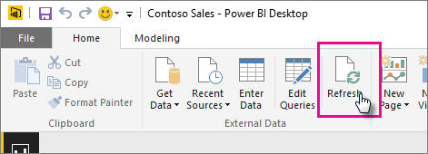

# รีเฟรชชุดข้อมูลที่สร้างจากไฟล์ Power BI Desktop ภายในไดรฟ์ของเครื่องRefresh a dataset created from a Power BI Desktop file on a local drive

## รับรองอะไรบ้างWhat’s supported?

ใน Power BI “รีเฟรชตอนนี้” และ “กำหนดเวลารีเฟรช” ใช้กับชุดข้อมูลที่สร้างจากไฟล์ Power BI Desktop ที่นำเข้าจากไดรฟ์ภายในเครื่องที่มีการใช้ “รับข้อมูล/ตัวแก้ไขคิวรี” เพื่อเชื่อมต่อและโหลดข้อมูลจากแหล่งข้อมูลหนึ่งจากหลายๆ แหล่งต่อไปนี้:In Power BI, Refresh Now and Schedule Refresh is supported for datasets created from Power BI Desktop files imported from a local drive where Get Data/Query Editor is used to connect to and load data from any of the following data sources:

### Power BI Gateway - PersonalPower BI Gateway - Personal

- แหล่งข้อมูลออนไลน์ทั้งหมดที่แสดงใน รับข้อมูลและตัวแก้ไขคิวรี ของ Power BI DesktopAll online data sources shown in Power BI Desktop’s Get Data and Query Editor.
- แหล่งข้อมูลภายในองค์กรทั้งหมดที่แสดงอยู่ใน รับข้อมูลและตัวแก้ไขคิวรี ของ Power BI Desktop ยกเว้นไฟล์ Hadoop (HDFS) และ Microsoft ExchangeAll on-premises data sources shown in Power BI Desktop’s Get Data and Query Editor except for Hadoop file (HDFS) and Microsoft Exchange.

<!-- Refresh Data sources-->
[!INCLUDE [refresh-datasources](../includes/refresh-datasources.md)]

> [!NOTE]
> เกตเวย์ต้องได้รับการติดตั้ง และเรียกใช้เพื่อให้ Power BI เชื่อมต่อกับแหล่งข้อมูลภายในองค์กร และรีเฟรชชุดข้อมูลA gateway must be installed and running in order for Power BI to connect to on-premises data sources and refresh the dataset.
>
>

คุณสามารถดำเนินการรีเฟรชครั้งเดียวด้วยตนเองใน Power BI Desktop ได้โดยเลือก **รีเฟรช** บนริบบอนหน้าแรกYou can perform a one-time, manual refresh in Power BI Desktop by selecting **Refresh** on the Home ribbon. เมื่อคุณเลือก **รีเฟรช** ที่นี่ ข้อมูลในแบบจำลองของ *ไฟล์* จะถูกรีเฟรชด้วยข้อมูลที่อัปเดตจากแหล่งข้อมูลต้นฉบับWhen you select **Refresh** here, the data in the *file’s* model is refreshed with updated data from the original data source. รีเฟรชแบบนี้ซึ่งมาจากภายในแอป Power BI Desktop แตกต่างไปจากการรีเฟรชด้วยตนเองหรือการรีเฟรชตามกำหนดการใน Power BI และเป็นสิ่งสำคัญที่ต้องทำความเข้าใจความแตกต่างนี้This kind of refresh, entirely from within the Power BI Desktop application itself, is different from manual or scheduled refresh in Power BI, and it’s important to understand the distinction.

เมื่อคุณนำเข้าไฟล์ Power BI Desktop ของคุณจากในไดรฟ์ภายใน ข้อมูลพร้อมกับข้อมูลอื่น ๆ ที่เกี่ยวกับรูปแบบจำลองจะถูกโหลดลงในชุดข้อมูลในบริการ Power BIWhen you import your Power BI Desktop file from a local drive, data, along with other information about the model, is loaded into a dataset in the Power BI service. ใน Power BI service ไม่ใช่ Power BI Desktop คุณต้องการรีเฟรชข้อมูลในชุดข้อมูลเนื่องจากการรายงานของคุณจะอิง ใน Power BI serviceIn the Power BI service, not Power BI Desktop, you want to refresh data in the dataset because that is what your reports, in the Power BI service, are based on. เนื่องจากแหล่งข้อมูลอยู่ภายนอก คุณสามารถรีเฟรชชุดข้อมูลด้วยตนเอง โดยใช้ **รีเฟรชตอนนี้** หรือคุณสามารถตั้งค่ากำหนดการรีเฟรช โดยใช้ **รีเฟรชตามกำหนดการ**Because the data sources are external, you can manually refresh the dataset by using **Refresh now** or you can set up a refresh schedule by using **Schedule Refresh**.

เมื่อคุณรีเฟรชชุดข้อมูล Power BI จะไม่มีการเชื่อมต่อไปยังไฟล์บน ไดรฟ์ในเครื่องเพื่อคิวรีให้ได้ข้อมูลที่ปรับปรุงWhen you refresh the dataset, Power BI does not connect to the file on the local drive to query for updated data. Power BI ใช้ข้อมูลในชุดข้อมูลเพื่อเชื่อมต่อโดยตรงกับยังแหล่งข้อมูลเพื่อทำการคิวรีให้ได้ข้อมูลที่ปรับปรุง และจากนั้นก็โหลดข้อมูลที่ปรับปรุงแล้วลงในชุดข้อมูลIt uses information in the dataset to connect directly to the data sources to query for updated data it then loads into the dataset.

> [!NOTE]
> ข้อมูลที่ถูกรีเฟรชในชุดข้อมูลจะไม่ถูกซิงโครไนซ์กลับไปยังไฟล์ใน ไดรฟ์ของเครืื่องRefreshed data in the dataset is not synchronized back to the file on the local drive.
>
>

## ฉันจะกำหนดเวลารีเฟรชได้อย่างไรHow do I schedule refresh?

เมื่อคุณตั้งค่ากำหนดการรีเฟรช Power BI จะเชื่อมต่อโดยตรงไปยังแหล่งข้อมูลโดยใช้ข้อมูลการเชื่อมต่อและข้อมูลประจำตัวในชุดข้อมูลเพื่อคิวรีข้อมูลที่อัปเดตแล้ว จากนั้นจึงโหลดข้อมูลที่อัปเดตแล้วลงในชุดข้อมูลWhen you set up a refresh schedule, Power BI connects directly to the data sources using connection information and credentials in the dataset to query for updated data, then loads the updated data into the dataset. การแสดงภาพด้วยข้อมูลในรายงานและแดชบอร์ดที่อิงชุดข้อมูลนั้นในบริการของ Power BI จะได้รับการอัปเดตตามไปด้วยAny visualizations in reports and dashboards based on that dataset in the Power BI service are also updated.

สำหรับรายละเอียดเกี่ยวกับวิธีการตั้งค่าการรีเฟรชตามกำหนดการ ดูที่[กำหนดค่าการรีเฟรชตามกำหนดการ](refresh-scheduled-refresh.md)For details on how to set up scheduled refresh, see [Configure scheduled refresh](refresh-scheduled-refresh.md).

## เมื่อเกิดสิ่งผิดปกติขึ้นWhen things go wrong

เมื่อเกิดสิ่งผิดปกติขึ้น ซึ่งโดยปกติจะเกิดเนื่องจาก Power BI ไม่สามารถลงชื่อเข้าใช้แหล่งข้อมูล หรือถ้าชุดข้อมูลเชื่อมต่อกับแหล่งข้อมูลภายในองค์กร เกตเวย์จะออฟไลน์When things go wrong, it’s usually because Power BI can’t sign into data sources, or if the dataset connects to an on-premises data source, the gateway is offline. ตรวจสอบให้แน่ใจว่า Power BI สามารถลงชื่อเข้าใช้แหล่งข้อมูลMake sure Power BI can sign into data sources. ถ้ามีการเปลี่ยนแปลงรหัสผ่านที่คุณลงชื่อเพื่อเข้าใช้แหล่งข้อมูล หรือ Power BI ได้รับการให้ออกจากแหล่งข้อมูล กรุณาลองลงชื่อเข้าใช้แหล่งข้อมูลของคุณอีกครั้งในข้อมูลประจำตัวของแหล่งข้อมูลIf a password you use to sign into a data source changes, or Power BI gets signed out from a data source, be sure to try signing into your data sources again in Data Source Credentials.

โปรดแน่ใจว่า ได้เลือก **ส่งอีเมลแจ้งเตือนการรีเฟรชล้มเหลวให้ฉัน**Be sure to leave the **Send refresh failure notification email to me** checked. คุณต้องทราบทันทีว่าการรีเฟรชตามกำหนดการล้มเหลวหรือไม่You’ll want to know right away if a scheduled refresh fails.

## แนวทางการแก้ไขปัญหาTroubleshooting

การรีเฟรชข้อมูลอาจไม่เป็นไปตามที่คาดไว้ในบางครั้งSometimes refreshing data may not go as expected. โดยทั่วไปแล้วเป็นปัญหาที่เกี่ยวข้องกับเกตเวย์Typically this is an issue connected with a gateway. โปรดดูที่บทความแก้ไขปัญหาเกตเวย์สำหรับเครื่องมือและปัญหาที่ทราบแล้วTake a look at the gateway troubleshooting articles for tools and known issues.

- [การแก้ไขปัญหา เกตเวย์ข้อมูลในองค์กรTroubleshooting the On-premises data gateway](service-gateway-onprem-tshoot.md)
- [แก้ไขปัญหาเกตเวย์ Power BI - ส่วนบุคคลTroubleshooting the Power BI Gateway - Personal](service-admin-troubleshooting-power-bi-personal-gateway.md)

มีคำถามเพิ่มเติมหรือไม่More questions? [ลองถามชุมชน Power BITry asking the Power BI Community](https://community.powerbi.com/)
