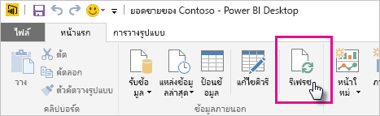
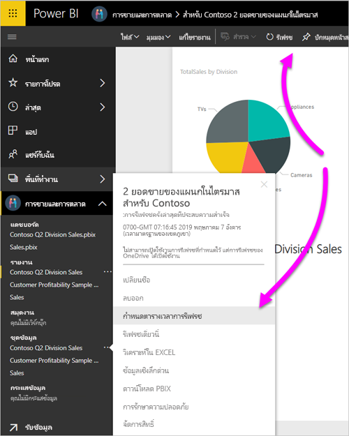

# รีเฟรชชุดข้อมูลที่จัดเก็บบน OneDrive หรือ SharePoint OnlineRefresh a dataset stored on OneDrive or SharePoint Online
การนำเข้าไฟล์จาก OneDrive หรือ SharePoint Online ลงในบริการ Power BI คือวิธียอดเยี่ยมที่แน่ใจได้ว่างานของคุณในPower BI Desktopยังคงซิงค์กับบริการของ Power BIImporting files from OneDrive or SharePoint Online into the Power BI service is a great way to make sure your work in Power BI Desktop stays in sync with the Power BI service.

## ข้อดีของการจัดเก็บไฟล์ Power BI Desktop บน OneDrive หรือ SharePoint OnlineAdvantages of storing a Power BI Desktop file on OneDrive or SharePoint Online
เมื่อคุณจัดเก็บไฟล์ Power BI Desktop บน OneDrive หรือ SharePoint Online ข้อมูลใดๆ ที่คุณได้โหลดลงในแบบจำลองของไฟล์ของคุณจะถูกนำเข้าลงในชุดข้อมูลWhen you store a Power BI Desktop file on OneDrive or SharePoint Online, any data you’ve loaded into your file’s model is imported into the dataset. และรายงานใดๆ ที่คุณสร้างในไฟล์จะถูกโหลดลงใน **รายงาน** ใน Power BI ที่ให้บริการAny reports you’ve created in the file are loaded into **Reports** in the Power BI service. สมมติว่าคุณทำการเปลี่ยนแปลงไฟล์ของคุณบน OneDrive หรือ SharePoint OnlineLet's say you make changes to your file on OneDrive or SharePoint Online. การเปลี่ยนแปลงนี้รวมถึงการมีหน่วยวัดใหม่ เปลี่ยนชื่อคอลัมน์ หรือแก้ไขการแสดงภาพได้These changes can include adding new measures, changing column names, or editing visualizations. เมื่อคุณบันทึกไฟล์ซึ่งเป็นบริการของ Power BI ที่ซิงค์กับการเปลี่ยนแปลงใหม่โดยปกติแล้วจะใช้เวลาภายในประมาณหนึ่งชั่วโมงOnce you save the file, Power BI service syncs with those changes too, usually within about an hour.

คุณสามารถทำการรีเฟรชครั้งเดียวด้วยตนเอง ทันทีใน Power BI Desktop โดยเลือก **รีเฟรช** บน **หน้า** แรกYou can do a one-time, manual refresh right in Power BI Desktop by selecting **Refresh** on the **Home** ribbon. เมื่อคุณเลือก **รีเฟรช** เท่ากับว่าคุณรีเฟรชด้วยข้อมูลที่อัปเดตจากแหล่งข้อมูลต้นฉบับWhen you select **Refresh**, you refresh the file’s model with updated data from the original data source. การรีเฟรชแบบนี้เกิดขึ้นทั้งหมดจากภายในตัวแอปพลิเคชัน Power BI Desktop เองThis kind of refresh happens entirely from within the Power BI Desktop application itself. ซึ่งจะแตกต่างจากการรีเฟรชตามกำหนดการ หรือด้วยตนเองใน Power BI และต้องทำความเข้าใจความแตกต่างIt's different from a manual or scheduled refresh in Power BI, and it’s important to understand the distinction.

เมื่อคุณนำเข้าไฟล์ Power BI Desktop ของคุณจาก OneDrive หรือ SharePoint Online คุณโหลดข้อมูลและข้อมูลเกี่ยวกับแบบจำลองลงในชุดข้อมูลใน Power BIWhen you import your Power BI Desktop file from OneDrive or SharePoint Online, you load data and model information into a dataset in Power BI. คุณจะต้องรีเฟรชชุดข้อมูลในบริการ Power BI เนื่องจากนั่นคือข้องมูลที่รายงานของคุณอ้างอิงตามYou'll want to refresh the dataset in the Power BI service because that's what your reports are based on. เนื่องจากแหล่งข้อมูลอยู่ภายนอก คุณสามารถรีเฟรชชุดข้อมูลด้วยตนเอง โดยใช้ **รีเฟรชตอนนี้** หรือคุณสามารถตั้งค่ากำหนดการรีเฟรช โดยใช้ **รีเฟรชตามกำหนดการ**Because the data sources are external, you can manually refresh the dataset by using **Refresh now** or you can set up a refresh schedule by using **Schedule Refresh**. 

เมื่อคุณรีเฟรชชุดข้อมูล Power BI ไม่มีการเชื่อมต่อไปยังไฟล์บน OneDrive หรือ SharePoint Online เพื่อคิวรีให้ได้ข้อมูลที่ปรับปรุงWhen you refresh the dataset, Power BI doesn't connect to the file on OneDrive or SharePoint Online to query for updated data. ใช้ข้อมูลในชุดข้อมูลเพื่อเชื่อมต่อโดยตรงกับแหล่งข้อมูลเพื่อทำการคิวรีให้ได้ข้อมูลที่ปรับปรุงIt uses information in the dataset to connect directly to the data sources and query for updated data. และจากนั้นก็โหลดลงชุดข้อมูลThen, it loads that data into the dataset. ข้อมูลที่ถูกรีเฟรชในชุดข้อมูลจะไม่ถูกซิงโครไนซ์กลับไปยังไฟล์บน OneDrive หรือ SharePoint OnlineThis refreshed data in the dataset isn't synchronized back to the file on OneDrive or SharePoint Online.

## อะไรบ้างที่ได้รับการสนับสนุน?What’s supported?
ในการสนับสนุนของ Power BI **รีเฟรช** และ **กำหนดการรีเฟรช** ใช้กับชุดข้อมูลที่สร้างจากไฟล์ Power BI Desktop ที่นำเข้าจากไดรฟ์ภายในเครื่องที่มีการใช้ **รับข้อมูล** หรือ **ตัวแก้ไขคิวรี** เพื่อเชื่อมต่อและโหลดข้อมูลจากแหล่งข้อมูลหนึ่งจากหลาย ๆ แหล่งต่อไปนี้Power BI supports **Refresh** and **Schedule Refresh** for datasets created from Power PI Desktop files imported from a local drive where you use **Get Data** or **Query Editor** to connect to and load data from the following data sources.

> [!NOTE]
> การรีเฟรชใน Onedrive refresh สำหรับการเชื่อมต่อชุดข้อมูลที่สนับสนุนOnedrive refresh for live connection datasets is supported. อย่างไรก็ตาม การเปลี่ยนการเชื่อมต่อชุดข้อมูลจากชุดข้อมูลหนึ่งไปยังอกีที่หนึ่งในรายงานที่เผยแพร่แล้ว จะไม่สนับสนุนในเหตุการณ์การรีเฟรชใน OneDriveHowever, changing the live connection dataset, from one dataset to another in an already published report, is not supported in the OneDrive refresh scenario.

### Power BI Gateway - ส่วนบุคคลPower BI Gateway - Personal
* แหล่งข้อมูลออนไลน์ทั้งหมดที่แสดงใน **รับข้อมูล** และ **ตัวแก้ไขคิวรี** ของ Power BI DesktopAll online data sources shown in Power BI Desktop’s **Get Data** and **Query Editor**.
* แหล่งข้อมูลภายในองค์กรทั้งหมดที่แสดงอยู่ใน **รับข้อมูล** และ **ตัวแก้ไขคิวรี** ของ Power BI Desktop ยกเว้นไฟล์ Hadoop (HDFS) และ Microsoft ExchangeAll on-premises data sources shown in Power BI Desktop’s **Get Data** and **Query Editor** except for Hadoop File (HDFS) and Microsoft Exchange.

<!-- Refresh Data sources-->
[!INCLUDE [refresh-datasources](../includes/refresh-datasources.md)]

> [!NOTE]
> เกตเวย์ต้องได้รับการติดตั้ง และเรียกใช้เพื่อให้ Power BI เชื่อมต่อกับแหล่งข้อมูลภายในองค์กร และรีเฟรชชุดข้อมูลA gateway must be installed and running in order for Power BI to connect to on-premises data sources and refresh the dataset.
> 
> 

## OneDrive หรือ OneDrive สำหรับธุรกิจOneDrive or OneDrive for Business. อะไรคือความแตกต่าง?What’s the difference?
ถ้าคุณมีทั้ง OneDrive ส่วนบุคคล และ OneDrive สำหรับธุรกิจ คุณควรเก็บไฟล์ต่างๆ ที่คุณต้องการนำเข้าไปใน Power BI ใน OneDrive สำหรับธุรกิจIf you have both a personal OneDrive and OneDrive for Business, you should keep any files you want to import into Power BI in OneDrive for Business. นี่คือสาเหตุว่าทำไม: คุณน่าจะใช้บัญชีคนละบัญชีเพื่อลงชื่อเข้าใช้บริการทั้งสองHere’s why: You likely use two different accounts to sign into them.

เมื่อคุณเชื่อมต่อไปยัง OneDrive for Business ใน Power BI การเชื่อมต่อนั้นสามารถทำได้ง่ายเนื่องจากบัญชี Power BI ของคุณ  มักเป็นบัญชีเดียวกันของบัญชี OneDrive for BusinessWhen you connect to OneDrive for Business in Power BI, connection is easy because your Power BI account is often the same account as your OneDrive for Business account. ด้วย OneDrive ส่วนบุคคล คุณจะลงชื่อเข้าใช้ด้วย[บัญชี Microsoft](https://account.microsoft.com) อื่นเป็นประจำWith personal OneDrive, you usually sign in with a different [Microsoft account](https://account.microsoft.com).

เมื่อคุณลงชื่อเข้าใช้บัญชี Microsoft ของคุณ ตรวจสอบให้แน่ใจว่าเลือก **ให้ฉันลงชื่อเข้าใช้เสมอ**When you sign in with your Microsoft account, be sure to select **Keep me signed in**. และจากนั้น Power BI จะสามารถซิงโครไนซ์การอัปเดตใด ๆ ที่คุณทำกับไฟล์ใน Power BI Desktop ด้วยชุดข้อมูลใน Power BIPower BI can then synchronize any updates you make in the file in Power BI Desktop with datasets in Power BI.

ถ้าคุณเปลี่ยนข้อมูลประจำตัวของ Microsoft คุณจะไม่สามารถซิงโครไนซ์การเปลี่ยนแปลงได้ระหว่างไฟล์ของคุณบน OneDrive และชุดข้อมูลใน Power BIIf you've changed your Microsoft credentials, you can't synchronize changes between your file on OneDrive and the dataset in Power BI. คุณจำเป็นต้องเชื่อมต่อและนำเข้าไฟล์ของคุณอีกครั้งจาก OneDriveYou need to connect to and import your file again from OneDrive.

## ฉันจะกำหนดเวลารีเฟรชได้อย่างไรHow do I schedule refresh?
เมื่อคุณตั้งค่ากำหนดการรีเฟรช Power BI จะเชื่อมต่อโดยตรงไปยังแหล่งข้อมูลWhen you set up a refresh schedule, Power BI connects directly to the data sources. Power BI ใช้ข้อมูลการเชื่อมต่อและข้อมูลประจำตัวในชุดข้อมูลเพื่อสร้างคิวรีสำหรับข้อมูลที่อัปเดตPower BI uses connection information and credentials in the dataset to query for updated data. จากนั้น Power BI จะโหลดข้อมูลอัปเดตลงในชุดข้อมูลThen Power BI loads the updated data into the dataset. จากนั้น Power BI จะอัปเดตรายงานการแสดงภาพและแดชบอร์ดใดๆ ก็ตามที่อิงชุดข้อมูลนั้นในบริการของ Power BI จะได้รับการอัปเดตตามไปด้วยIt then updates any report visualizations and dashboards based on that dataset in the Power BI service.

สำหรับรายละเอียดเกี่ยวกับวิธีการตั้งค่าการรีเฟรชตามกำหนดการ ดูที่[กำหนดค่าการรีเฟรชตามกำหนดการ](refresh-scheduled-refresh.md)For details on how to set up schedule refresh, see [Configure scheduled refresh](refresh-scheduled-refresh.md).

## เมื่อเกิดสิ่งผิดปกติขึ้นWhen things go wrong
เมื่อสิ่งผิดปกติเกิดขึ้น โดยปกติมักจะเป็นสาเหตุเนื่องจาก Power BI ไม่สามารถลงชื่อเข้าใช้ลงในแหล่งข้อมูลWhen things go wrong, it’s usually because Power BI can’t sign into data sources. อาจไม่สามารถแก้ไขอาการผิดปกติได้ถ้าชุดข้อมูลพยายามเชื่อมต่อกับแหล่งข้อมูลภายในองค์กร แต่เกตเวย์ยังออฟไลน์อยู่Things may also go wrong if the dataset tries to connect to an on-premises data source but the gateway is offline. หากต้องการหลีกเลี่ยงปัญหานี้ โปรดตรวจสอบให้แน่ใจว่า Power BI สามารถลงชื่อเข้าใช้แหล่งข้อมูลTo avoid these issues, make sure Power BI can sign into data sources. ลองลงชื่อเข้าใช้แหล่งข้อมูลของคุณใน **ข้อมูลประจำตัวของแหล่งข้อมูล**Try signing into your data sources in **Data Source Credentials**. ในบางครั้งรหัสผ่านที่คุณใช้เพื่อลงชื่อเข้าใช้แหล่งข้อมูลมีการเปลี่ยนแปลงหรือ Power BI ลงชื่อออกจากแหล่งข้อมูลSometimes the password you use to sign into a data source changes or Power BI gets signed out from a data source.

เมื่อคุณบันทึกการเปลี่ยนแปลงไฟล์ Power BI Desktop บน OneDrive และคุณไม่เห็นการเปลี่ยนแปลงเหล่านั้นใน Power BI ภายในหนึ่งชั่วโมงหรือมากกว่า อาจเป็น เพราะ Power BI ไม่สามารถเชื่อมต่อกับ OneDrive ของคุณWhen you save your changes to the Power BI Desktop file on OneDrive and you don't see those changes in Power BI within an hour or so, it could be because Power BI can't connect to your OneDrive. ลองเชื่อมต่อไปยังไฟล์บน OneDrive อีกครั้งTry connecting to the file on OneDrive again. ถ้าคุณได้รับพร้อมท์ให้ลงชื่อเข้าใช้ ตรวจสอบให้แน่ใจว่า คุณเลือก **คงการลงชื่อเข้าใช้ของฉันไว้เสมอ**If you’re prompted to sign in, make sure you select **Keep me signed** in. เนื่องจาก Power BI ไม่สามารถเชื่อมต่อกับ OneDrive ของคุณเพื่อซิงโครไนซ์กับไฟล์ คุณจะต้องนำเข้าไฟล์ของคุณอีกครั้งBecause Power BI wasn't able to connect to your OneDrive to synchronize with the file, you’ll need to import your file again.

โปรดแน่ใจว่า ได้เลือก **ส่งอีเมลแจ้งเตือนการรีเฟรชล้มเหลวให้ฉัน**Be sure to leave the **Send refresh failure notification email to me** checked. คุณต้องทราบทันทีว่าการรีเฟรชตามกำหนดการล้มเหลวหรือไม่You’ll want to know right away if a scheduled refresh fails.

## การแก้ไขปัญหาTroubleshooting
การรีเฟรชข้อมูลอาจไม่เป็นไปตามที่คาดไว้ในบางครั้งSometimes refreshing data may not go as expected. โดยทั่วไปคุณจะพบปัญหาเกี่ยวกับการรีเฟรชเมื่อคุณเชื่อมต่อกับเกตเวย์You'll typically run into data refresh issues when you're connected with a gateway. โปรดดูที่บทความแก้ไขปัญหาเกตเวย์สำหรับเครื่องมือและปัญหาที่ทราบแล้วTake a look at the gateway troubleshooting articles for tools and known issues.

[การแก้ไขปัญหาเกตเวย์ข้อมูลในองค์กรTroubleshooting the On-premises data gateway](service-gateway-onprem-tshoot.md)

[แก้ไขปัญหาเกตเวย์ Power BI - ส่วนบุคคลTroubleshooting the Power BI Gateway - Personal](service-admin-troubleshooting-power-bi-personal-gateway.md)

มีคำถามเพิ่มเติมหรือไม่More questions? ลองถาม[ชุมชน Power BI](https://community.powerbi.com/)Try asking the [Power BI Community](https://community.powerbi.com/).
