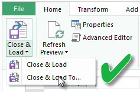

# รีเฟรชชุดข้อมูลที่สร้างขึ้นจากสมุดงาน Excel ใน OneDrive หรือ SharePoint OnlineRefresh a dataset created from an Excel workbook on OneDrive, or SharePoint Online

คุณสามารถนำเข้าสมุดงาน Excel ที่เก็บไว้บนเครื่องของคุณ หรือในพื้นที่เก็บข้อมูลบนคลาวด์ เช่น OneDrive สำหรับธุรกิจ หรือ SharePoint OnlineYou can import Excel workbooks that are stored on your local machine, or in cloud storage such as OneDrive for Business or SharePoint Online. เราจะดูที่ข้อดีของการใช้พื้นที่เก็บข้อมูลบนคลาวด์สำหรับไฟล์ Excel ของคุณWe will look at the advantages of using cloud storage for your Excel files. สำหรับข้อมูลเพิ่มเติมเกี่ยวกับวิธีการนำเข้าไฟล์ Excel ลงใน Power BI ดูที่[รับข้อมูลจากไฟล์สมุดงาน Excel](service-excel-workbook-files.md)For more information on how to import Excel files into Power BI, see [Get data from Excel workbook files](service-excel-workbook-files.md).

## มีข้อดีอะไรบ้างWhat are the advantages?

การนำเข้าไฟล์จาก OneDrive หรือ SharePoint Online เป็นวิธีที่ดีในการตรวจสอบให้แน่ใจว่างานที่คุณกำลังทำอยู่ใน Excel ยังคงซิงค์กับบริการ Power BIImporting files from OneDrive, or SharePoint Online, is a great way to make sure the work you’re doing in Excel stays in-sync with the Power BI service. ข้อมูลใด ๆ ที่คุณโหลดลงในแบบจำลองของไฟล์จะได้รับการนำเข้าลงในชุดข้อมูล และจะมีการโหลดรายงานใด ๆ ที่คุณสร้างในไฟล์ลงใน “รายงาน” ใน Power BIAny data you’ve loaded into your file’s model is imported into the dataset, and any reports you’ve created in the file are loaded into Reports in Power BI. ถ้าคุณทำการเปลี่ยนแปลงไฟล์ของคุณใน OneDrive หรือ SharePoint Online เช่น เพิ่มหน่วยวัดใหม่ เปลี่ยนชื่อคอลัมน์ หรือแก้ไขการแสดงวิชวล เมื่อคุณบันทึก การเปลี่ยนแปลงเหล่านั้นจะได้รับการอัปเดตใน Power BI เช่นกัน โดยปกติจะดำเนินการอัปเดตภายในหนึ่งชั่วโมงIf you make changes to your file on OneDrive, or SharePoint Online, like add new measures, change column names, or edit visualizations, once you save, those changes are updated in Power BI too, usually within about an hour.

เมื่อคุณนำเข้าสมุดงาน Excel จาก OneDrive ส่วนบุคคลของคุณ ข้อมูลใด ๆ ในสมุดงาน เช่น ตารางในแผ่นงานและ/ หรือข้อมูลที่โหลดลงในแบบจำลองข้อมูล Excel และโครงสร้างของแบบจำลองข้อมูล จะได้รับการนำเข้าลงในชุดข้อมูลใหม่ใน Power BIWhen you import an Excel workbook from your personal OneDrive, any data in the workbook, like tables in worksheets and/or data that are loaded into the Excel data model and the structure of the data model, are imported into a new dataset in Power BI. การแสดงวิชวล Power View ใด ๆ จะได้รับการสร้างใหม่ในรายงานAny Power View visualizations are re-created in Reports. Power BI เชื่อมต่อกับสมุดงานใน OneDrive หรือ SharePoint Online โดยอัตโนมัติเพื่อตรวจสอบการอัปเดตทุก ๆ ชั่วโมงPower BI automatically connects to the workbook on OneDrive, or SharePoint Online, about every hour to check for updates. ถ้าสมุดงานมีการเปลี่ยนแปลง Power BI จะรีเฟรชชุดข้อมูลและรายงานในบริการ Power BIIf the workbook has changed, Power BI will refresh the dataset and reports in the Power BI service.

คุณสามารถรีเฟรชชุดข้อมูลในบริการ Power BIYou can refresh the dataset in the Power BI service. เมื่อคุณทำการรีเฟรชด้วยตนเอง หรือรีเฟรชตามกำหนดการในชุดข้อมูล Power BI จะเชื่อมต่อโดยตรงไปยังแหล่งข้อมูลภายนอกเพื่อสร้างคิวรีสำหรับข้อมูลที่อัปเดตแล้ว และโหลดลงในชุดข้อมูลWhen you manually refresh, or schedule refresh, on the dataset, Power BI connects directly to the external data sources to query for updated data it then loads into the dataset. การรีเฟรชชุดข้อมูลจากภายใน Power BI จะไม่รีเฟรชข้อมูลในสมุดงานใน OneDrive หรือ SharePoint OnlineRefreshing a dataset from within Power BI does not refresh the data in the workbook on OneDrive, or SharePoint Online. 

## รับรองอะไรบ้างWhat’s supported?

ใน Power BI **รีเฟรชตอนนี้** และ **กำหนดการรีเฟรช** ใช้กับชุดข้อมูลที่สร้างจากไฟล์ Power BI Desktop ที่นำเข้าจากไดรฟ์ภายในเครื่องที่มีการใช้ “รับข้อมูล/ตัวแก้ไขคิวรี” เพื่อเชื่อมต่อและโหลดข้อมูลจากแหล่งข้อมูลหนึ่งจากหลาย ๆ แหล่งต่อไปนี้:In Power BI, **Refresh Now** and **Schedule Refresh** are supported for datasets created from Power BI Desktop files imported from a local drive where Get Data/Query Editor is used to connect to and load data from any of the following data sources:  

### Power BI Gateway - PersonalPower BI Gateway - Personal

* แหล่งข้อมูลออนไลน์ทั้งหมดที่แสดงใน รับข้อมูลและตัวแก้ไขคิวรี ของ Power BI DesktopAll online data sources shown in Power BI Desktop’s Get Data and Query Editor.
* แหล่งข้อมูลภายในองค์กรทั้งหมดที่แสดงอยู่ใน รับข้อมูลและตัวแก้ไขคิวรี ของ Power BI Desktop ยกเว้นไฟล์ Hadoop (HDFS) และ Microsoft ExchangeAll on-premises data sources shown in Power BI Desktop’s Get Data and Query Editor except for Hadoop file (HDFS) and Microsoft Exchange.

<!-- Refresh Data sources-->
[!INCLUDE [refresh-datasources](../includes/refresh-datasources.md)]

> [!NOTE]
> เกตเวย์ต้องได้รับการติดตั้ง และเรียกใช้เพื่อให้ Power BI เชื่อมต่อกับแหล่งข้อมูลภายในองค์กร และรีเฟรชชุดข้อมูลA gateway must be installed and running in order for Power BI to connect to on-premises data sources and refresh the dataset.
>
>

## OneDrive หรือ OneDrive สำหรับธุรกิจOneDrive or OneDrive for Business. ความแตกต่างคืออะไรWhat’s the difference?

ถ้าคุณมีทั้ง OneDrive ส่วนบุคคล และ OneDrive สำหรับธุรกิจ เราแนะนำให้คุณเก็บไฟล์ต่างๆ ที่คุณต้องการนำเข้าไปใน Power BI ใน OneDrive สำหรับธุรกิจIf you have both a personal OneDrive and OneDrive for Business, it’s recommended you keep any files you want to import into Power BI in OneDrive for Business. นี่คือสาเหตุว่าทำไม: คุณอาจใช้บัญชีที่ต่างกันสองบัญชีในการลงชื่อเข้าใช้ OneDrive ส่วนบุคคล และ OneDrive สำหรับธุรกิจHere’s why: You likely use two different accounts to sign into them.

การเชื่อมต่อกับ OneDrive for Business ใน Power BI มักทำได้อย่างราบรื่น เพราะบัญชีที่คุณลงชื่อเข้าใช้ Power BI มักเป็นบัญชีเดียวกับที่ลงชื่อเข้าใช้ใน OneDrive for BusinessConnecting to OneDrive for Business in Power BI is typically seamless because the same account you use to sign into Power BI is often the same account used to sign into OneDrive for Business. แต่ใน OneDrive ส่วนบุคคล คุณลงชื่อเข้าใช้ด้วย[บัญชี Microsoft](https://account.microsoft.com)But, with personal OneDrive, you likely sign in with a different [Microsoft account](https://account.microsoft.com).

เมื่อคุณลงชื่อเข้าใช้บัญชี Microsoft ของคุณ ตรวจสอบให้แน่ใจว่าเลือก **ให้ฉันลงชื่อเข้าใช้เสมอ**When you sign in with your Microsoft account, be sure to select **Keep me signed in**. และจากนั้น Power BI จะสามารถซิงโครไนซ์การอัปเดตใด ๆ ที่คุณทำกับไฟล์ใน Power BI Desktop ด้วยชุดข้อมูลใน Power BIPower BI can then synchronize any updates you make in the file in Power BI Desktop with datasets in Power BI.  

ถ้าคุณทำการเปลี่ยนแปลงกับไฟล์ของคุณใน OneDrive ที่ไม่สามารถซิงโครไนซ์กับชุดข้อมูลหรือรายงานใน Power BI เนื่องจากข้อมูลประจำตัวของบัญชี Microsoft ของคุณอาจมีการเปลี่ยนแปลง คุณจะต้องเชื่อมต่อ และนำเข้าไฟล์ของคุณอีกครั้งจาก OneDrive ส่วนบุคคลของคุณIf you make changes to your file on OneDrive that cannot be synchronized with the dataset or reports in Power BI, because your Microsoft account credentials might have changed, you’ll need to connect to and import your file again from your personal OneDrive.

## ตัวเลือกสำหรับการเชื่อมต่อไปยังไฟล์ ExcelOptions for connecting to Excel file

เมื่อคุณเชื่อมต่อกับสมุดงาน Excel ใน OneDrive สำหรับธุรกิจ หรือ SharePoint Online คุณจะมีสองตัวเลือกเกี่ยวกับวิธีการนำสิ่งที่อยู่ในสมุดงานของคุณลงใน Power BIWhen you connect to an Excel workbook in OneDrive for Business, or SharePoint Online, you’ll have two options on how to get what’s in your workbook into Power BI.

[**นำเข้าข้อมูล Excel ลงใน Power BI**](service-excel-workbook-files.md#import-or-connect-to-an-excel-workbook-from-power-bi) – เมื่อคุณนำเข้าสมุดงาน Excel จาก OneDrive สำหรับธุรกิจ หรือ SharePoint Online จะมีการทำงานตามที่อธิบายไว้ข้างต้น[**Import Excel data into Power BI**](service-excel-workbook-files.md#import-or-connect-to-an-excel-workbook-from-power-bi) – When you import an Excel workbook from your OneDrive for Business, or SharePoint Online, it works as described above.

[**เชื่อมต่อ จัดการ และดู Excel ใน Power BI**](service-excel-workbook-files.md#one-excel-workbook--two-ways-to-use-it) – เมื่อใช้ตัวเลือกนี้ ให้คุณสร้างการเชื่อมต่อจาก Power BI กับสมุดงานของคุณใน OneDrive สำหรับธุรกิจ หรือ SharePoint Online[**Connect, Manage, and View Excel in Power BI**](service-excel-workbook-files.md#one-excel-workbook--two-ways-to-use-it) – When using this option, you create a connection from Power BI right to your workbook on OneDrive for Business, or SharePoint Online.

เมื่อคุณเชื่อมต่อกับสมุดงาน Excel ด้วยวิธีนี้ จะไม่มีการสร้างชุดข้อมูลใน Power BIWhen you connect to an Excel workbook this way, a dataset is not created in Power BI. อย่างไรก็ตาม สมุดงานจะปรากฏในบริการ Power BI ภายใต้ “รายงาน” ด้วยไอคอน Excel ที่อยู่ถัดจากชื่อHowever, the workbook will appear in the Power BI service under Reports with an Excel icon next to the name. ซึ่งแตกต่างกับ Excel Online คือเมื่อคุณเชื่อมต่อกับสมุดงานของคุณจาก Power BI ถ้าสมุดงานของคุณมีการเชื่อมต่อกับแหล่งข้อมูลภายนอกที่โหลดข้อมูลลงในแบบจำลองข้อมูล Excel คุณสามารถตั้งค่าการรีเฟรชตามกำหนดการได้Unlike with Excel Online, when you connect to your workbook from Power BI, if your workbook has connections to external data sources that load data into the Excel data model, you can set up a refresh schedule.

เมื่อคุณตั้งค่ากำหนดการรีเฟรชด้วยวิธีนี้ จะมีความแตกต่างเพียงอย่างเดียวคือ ข้อมูลที่ได้รับการรีเฟรชจะเข้าไปอยู่ในแบบจำลองข้อมูลของสมุดงานใน OneDrive หรือ SharePoint Online แทนที่จะไปอยู่ในชุดข้อมูลใน Power BIWhen you set up a refresh schedule this way, the only difference is refreshed data goes into the workbook’s data model on OneDrive, or SharePoint Online, rather than a dataset in Power BI.

## ฉันจะแน่ใจได้อย่างไรว่าข้อมูลได้รับการโหลดไปยังแบบจำลองข้อมูล ExcelHow do I make sure data is loaded to the Excel data model?

เมื่อคุณใช้ Power Query (**รับและแปลงข้อมูล** ใน Excel 2016) เพื่อเชื่อมต่อกับแหล่งข้อมูล คุณจะมีหลายตัวเลือกสำหรับตำแหน่งที่จะโหลดข้อมูลWhen you use Power Query (**Get & Transform** in Excel 2016) to connect to a data source, you have several options where to load the data. เมื่อต้องการตรวจสอบให้แน่ใจว่า คุณโหลดข้อมูลลงในแบบจำลองข้อมูล คุณต้องเลือก **เพิ่มข้อมูลนี้ลงในตัวเลือกแบบจำลองข้อมูล** ใน **โหลดไปยัง** กล่องโต้ตอบTo make sure you load data into the data model, you must select the **Add this data to the Data Model** option in the **Load To** dialog box.

> [!NOTE]
> รูปภาพนี้แสดง Excel 2016The images here show Excel 2016.
>
>

ใน **ตัวนำทาง** คลิก **โหลดไปยัง...**In **Navigator**, click **Load To…**  

หรือ ถ้าคุณคลิก **แก้ไข** ใน **ตัวนำทาง** ตัวแก้ไขคิวรีจะเปิดขึ้นOr, If you click **Edit** in **Navigator**, you’ll open the Query Editor. ซึ่งคุณสามารถคลิก **ปิด & โหลดไปยัง...**There you can click **Close & Load To….**  

จากนั้นใน **โหลดไปยัง** ตรวจสอบให้แน่ใจว่าคุณเลือก **เพิ่มข้อมูลนี้ลงในแบบจำลองข้อมูล**Then in **Load To**, make sure you select **Add this data to the Data Model**.  

### เกิดอะไรขึ้นถ้าฉันใช้ “รับข้อมูลภายนอกใน Power Pivot”What if I use Get External Data in Power Pivot?

ไม่มีปัญหาNo problem. เมื่อใดก็ตามที่คุณใช้ Power Pivot เพื่อเชื่อมต่อ และคิวรีข้อมูลจากแหล่งข้อมูลภายในองค์กร หรือแหล่งข้อมูลออนไลน์ ข้อมูลจะได้รับการโหลดลงในแบบจำลองข้อมูลโดยอัตโนมัติWhenever you use Power Pivot to connect to and query data from an on-premises or online data source, the data is automatically loaded to the data model.

## ฉันจะกำหนดเวลารีเฟรชได้อย่างไรHow do I schedule refresh?

เมื่อคุณตั้งค่ากำหนดการรีเฟรช Power BI จะเชื่อมต่อโดยตรงไปยังแหล่งข้อมูลโดยใช้ข้อมูลการเชื่อมต่อและข้อมูลประจำตัวในชุดข้อมูลเพื่อคิวรีข้อมูลที่อัปเดตแล้ว จากนั้นจึงโหลดข้อมูลที่อัปเดตแล้วลงในชุดข้อมูลWhen you set up a refresh schedule, Power BI connects directly to the data sources using connection information and credentials in the dataset to query for updated data, then loads the updated data into the dataset. การแสดงภาพด้วยข้อมูลในรายงานและแดชบอร์ดที่อิงชุดข้อมูลนั้นในบริการของ Power BI จะได้รับการอัปเดตตามไปด้วยAny visualizations in reports and dashboards based on that dataset in the Power BI service are also updated.

สำหรับรายละเอียดเกี่ยวกับวิธีการตั้งค่าการรีเฟรชตามกำหนดการ ดูที่[กำหนดค่าการรีเฟรชตามกำหนดการ](refresh-scheduled-refresh.md)For details on how to set up scheduled refresh, see [Configure scheduled refresh](refresh-scheduled-refresh.md).

## เมื่อเกิดสิ่งผิดปกติขึ้นWhen things go wrong

เมื่อเกิดสิ่งผิดปกติขึ้น ซึ่งโดยปกติจะเกิดเนื่องจาก Power BI ไม่สามารถลงชื่อเข้าใช้แหล่งข้อมูล หรือถ้าชุดข้อมูลเชื่อมต่อกับแหล่งข้อมูลภายในองค์กร เกตเวย์จะออฟไลน์When things go wrong, it’s usually because Power BI can’t sign into data sources, or if the dataset connects to an on-premises data source, the gateway is offline. ตรวจสอบให้แน่ใจว่า Power BI สามารถลงชื่อเข้าใช้แหล่งข้อมูลMake sure Power BI can sign into data sources. ถ้ามีการเปลี่ยนแปลงรหัสผ่านที่คุณลงชื่อเพื่อเข้าใช้แหล่งข้อมูล หรือ Power BI ได้รับการให้ออกจากแหล่งข้อมูล กรุณาลองลงชื่อเข้าใช้แหล่งข้อมูลของคุณอีกครั้งในข้อมูลประจำตัวของแหล่งข้อมูลIf a password you use to sign into a data source changes, or Power BI gets signed out from a data source, be sure to try signing into your data sources again in Data Source Credentials.

โปรดแน่ใจว่าคุณออกจาก **ส่งอีเมล์แจ้งเตือนเมื่อการรีเฟรชล้มเหลวให้ฉันตรวจสอบ**Be sure to leave the **Send refresh failure notification email to me checked**. คุณต้องทราบทันทีว่าการรีเฟรชตามกำหนดการล้มเหลวหรือไม่You’ll want to know right away if a scheduled refresh fails.

## หมายเหตุสำคัญImportant notes

การรีเฟรชไม่ได้รับการสนับสนุนสำหรับฟีด OData ที่เชื่อมต่อ และคิวรีจาก Power PivotRefresh is not supported for OData feeds connected to and queried from Power Pivot. เมื่อใช้ฟีด OData เป็นแหล่งข้อมูล ให้ใช้ Power QueryWhen using an OData feed as a data source, use Power Query.

## แนวทางการแก้ไขปัญหาTroubleshooting

การรีเฟรชข้อมูลอาจไม่เป็นไปตามที่คาดไว้ในบางครั้งSometimes refreshing data may not go as expected. โดยทั่วไปแล้วเป็นปัญหาที่เกี่ยวข้องกับเกตเวย์Typically this is an issue connected with a gateway. โปรดดูที่บทความแก้ไขปัญหาเกตเวย์สำหรับเครื่องมือและปัญหาที่ทราบแล้วTake a look at the gateway troubleshooting articles for tools and known issues:

- [การแก้ไขปัญหา เกตเวย์ข้อมูลในองค์กรTroubleshooting the On-premises data gateway](service-gateway-onprem-tshoot.md)
- [แก้ไขปัญหาเกตเวย์ Power BI - ส่วนบุคคลTroubleshooting the Power BI Gateway - Personal](service-admin-troubleshooting-power-bi-personal-gateway.md)

มีคำถามเพิ่มเติมหรือไม่More questions? [ลองไปที่ชุมชน Power BITry the Power BI Community](https://community.powerbi.com/)
