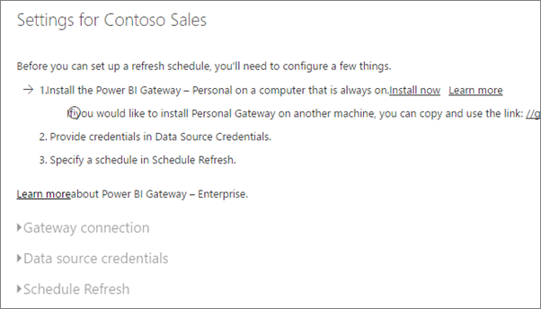
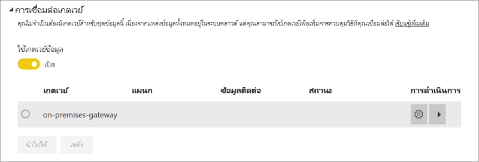

# กำหนดค่าการรีเฟรชตามกำหนดเวลาConfigure scheduled refresh

>[!NOTE]
>หลังจากสองเดือนที่ไม่ได้ใช้งาน การรีเฟรชตามกำหนดการบนชุดข้อมูลของคุณจะหยุดชั่วคราวAfter two months of inactivity, scheduled refresh on your dataset is paused. สำหรับข้อมูลเพิ่มเติม ดู [*การรีเฟรชตามกำหนดการ*](#scheduled-refresh) ในภายหลังในบทความนี้For more information, see [*Scheduled refresh*](#scheduled-refresh) later in this article.

บทความนี้จะอธิบายถึงตัวเลือกที่พร้อมใช้งานสำหรับการรีเฟรชตามกำหนดเวลาทั้ง[เกตเวย์ข้อมูลภายในองค์กร (โหมดส่วนบุคคล)](service-gateway-personal-mode.md) และ[เกตเวย์ข้อมูลภายในองค์กร](service-gateway-onprem.md)This article describes the options available for scheduled refresh for the [On-premises data gateway (personal mode)](service-gateway-personal-mode.md) and the [On-premises data gateway](service-gateway-onprem.md). คุณระบุตัวเลือกการรีเฟรชในพื้นที่ต่อไปนี้ของบริการ Power BI: **การเชื่อมต่อเกตเวย์** **ข้อมูลประจำตัวของแหล่งข้อมูล** และ **การรีเฟรชตามกำหนดเวลา**You specify refresh options in the following areas of the Power BI service: **Gateway connection**, **Data source credentials**, and **Scheduled refresh**. เราจะมาดูกันตามลำดับWe'll look at each in turn. สำหรับข้อมูลเพิ่มเติมเกี่ยวกับการรีเฟรชข้อมูล รวมถึงข้อจำกัดของกำหนดการรีเฟรช โปรดดู [การรีเฟรชข้อมูล](refresh-data.md#data-refresh)For more information about data refresh, including limitations on refresh schedules, see [Data refresh](refresh-data.md#data-refresh).

เมื่อต้องการไปยังหน้าจอ **การรีเฟรชตามกำหนดการ**:To get to the **Scheduled refresh** screen:

1. ในบานหน้าต่างนำทางภายใต้ **ชุดข้อมูล** ให้เลือก **ตัวเลือกเพิ่มเติม** (...) ถัดจากชุดข้อมูลที่ระบุIn the navigation pane, under **Datasets**, select **More options** (...) next to a dataset listed .
2. เลือก **กำหนดเวลารีเฟรช**Select **Schedule Refresh**.

    

## การเชื่อมต่อเกตเวย์Gateway connection

คุณจะเห็นตัวเลือกที่แตกต่างกันต่อไปนี้โดยขึ้นอยู่กับว่าคุณมีเกตเวย์ส่วนบุคคล หรือ เกตเวย์องค์กรที่ออนไลน์ และพร้อมใช้งานหรือไม่You see different options here depending on whether you have a personal, or enterprise, gateway online and available.

ถ้าไม่มีเกตเวย์ที่พร้อมใช้งาน คุณจะเห็น **การเชื่อมต่อเกตเวย์** ถูกปิดใช้งานIf no gateway is available, you see **Gateway connection** disabled. นอกจากนี้คุณจะเห็นข้อความระบุวิธีการติดตั้งเกตเวย์ส่วนบุคคลYou also see a message indicating how to install the personal gateway.

หากคุณมีเกตเวย์ส่วนบุคคลที่กำหนดค่าและเป็นออนไลน์ก็แสดงว่าสามารถเลือกได้If you have a personal gateway configured and it's online, it's available to select. ซึ่งจะแสดงแบบออฟไลน์ ถ้าไม่พร้อมใช้งานIt shows offline if it's not available.

คุณยังสามารถเลือกเกตเวย์องค์กร ถ้าหากเกตเวย์พร้อมใช้งานสำหรับคุณYou can also select the enterprise gateway if one is available for you. คุณจะเห็นว่าเกตเวย์องค์กรพร้อมใช้งานเฉพาะเมื่อบัญชีของคุณแสดงอยู่ในแท็บ **ผู้ใช้** ของแหล่งข้อมูลที่กำหนดค่าไว้สำหรับเกตเวย์ที่ระบุYou only see an enterprise gateway available if your account is listed in the **Users** tab of the data source configured for a given gateway.

## ข้อมูลประจำตัวของแหล่งข้อมูลData source credentials

### Power BI Gateway - ส่วนบุคคลPower BI Gateway - Personal

ถ้าคุณกำลังใช้เกตเวย์ส่วนบุคคลเพื่อรีเฟรชข้อมูล คุณต้องใส่ข้อมูลประจำตัวเพื่อเชื่อมต่อกับแหล่งข้อมูลหลังบ้านIf you are using the personal gateway to refresh data, you must supply the credentials to connect to the back-end data source. ถ้าคุณเชื่อมต่อกับชุดเนื้อหา ข้อมูลประจำตัวที่คุณใส่เพื่อเชื่อมต่อจะดำเนินการสำหรับการรีเฟรชตามกำหนดการจากบริการออนไลน์If you connected to a content pack from an online service, the credentials you entered to connect are carried over for scheduled refresh.

คุณจำเป็นต้องลงชื่อเข้าใช้แหล่งข้อมูลในครั้งแรกที่คุณใช้การรีเฟรชบนชุดข้อมูลเท่านั้นYou're only required to sign in to a data source the first time you use refresh on that dataset. เมื่อใส่แล้ว ข้อมูลประจำตัวเหล่านั้นจะยังคงอยู่กับชุดข้อมูลOnce entered, those credentials are retained with the dataset.

> [!NOTE]
> สำหรับวิธีการรับรองความถูกต้องบางวิธี ถ้ารหัสผ่านที่คุณใช้เพื่อลงชื่อเข้าใช้แหล่งข้อมูลหมดอายุ หรือมีการเปลี่ยนแปลง คุณจะต้องเปลี่ยนรหัสผ่านสำหรับแหล่งข้อมูลใน **ข้อมูลประจำตัวของแหล่งข้อมูล** ด้วยFor some authentication methods, if the password you use to sign into a data source expires or is changed, you need to change it for the data source in **Data source credentials** too.

เมื่อเกิดสิ่งผิดปกติขึ้น ซึ่งโดยปกติปัญหาแล้วจะเกี่ยวกับเกตเวย์ที่ออฟไลน์เนื่องจากไม่สามารถลงชื่อเข้าใช้ Windows และเริ่มบริการ หรือเกี่ยวกับ Power BI ไม่สามารถไม่ลงชื่อเข้าใช้แหล่งข้อมูลเพื่อคิวรีสำหรับข้อมูลที่อัปเดตWhen things go wrong, the problem usually has something to do with either the gateway being offline because it couldn't sign in to Windows and start the service, or Power BI couldn't sign in to the data sources to query for updated data. ถ้าการรีเฟรชล้มเหลว ตรวจสอบการตั้งค่าของชุดข้อมูลIf refresh fails, check the dataset settings. ถ้าบริการเกตเวย์อยู่ในสถานะออฟไลน์ คุณจะเห็นข้อผิดพลาดที่ **สถานะ**If the gateway service is offline, **Status** is where you see the error. ถ้า Power BI ไม่สามารถลงชื่อเข้าใช้แหล่งข้อมูล คุณจะเห็นข้อผิดพลาดในข้อมูลประจำตัวของแหล่งข้อมูลIf Power BI can't sign into the data sources, you see an error in Data Source Credentials.

### เกตเวย์ข้อมูลภายในองค์กรOn-premises data gateway

ถ้าคุณกำลังใช้เกตเวย์ข้อมูลในองค์กรเพื่อรีเฟรชข้อมูล คุณไม่จำเป็นต้องใส่ข้อมูลประจำตัวเนื่องจากมีการกำหนดไว้แล้วสำหรับแหล่งข้อมูลโดยผู้ดูแลเกตเวย์If you are using the On-premises data gateway to refresh data, you do not need to supply credentials, as they are defined for the data source by the gateway administrator.

> [!NOTE]
> เมื่อเชื่อมต่อกับ SharePoint ภายในองค์กรสำหรับการรีเฟรชข้อมูล Power BI สนับสนุนเฉพาะกลไกพิสูจน์ตัวตน *Anonymous*, *Basic* และ *Windows (NTLM/Kerberos)*When connecting to on-premises SharePoint for data refresh, Power BI supports only *Anonymous*, *Basic*, and *Windows (NTLM/Kerberos)* authentication mechanisms. Power BI ไม่รองรับ *ADFS* หรือ *กลไลการพิสูจน์ตัวตนพื้นฐานแบบฟอร์ม* กลไกสำหรับการรีเฟรชข้อมูลของแหล่งข้อมูล SharePoint ภายในองค์กรPower BI does not support *ADFS* or any *Forms-Based Authentication* mechanisms for data refresh of on-premises SharePoint data sources.

## รีเฟรชตามกำหนดการScheduled refresh

คุณสามารถกำหนดความถี่ที่และช่วงเวลาเพื่อรีเฟรชชุดข้อมูลได้ที่ส่วน **การรีเฟรชตามกำหนดการ**The **Scheduled refresh** section is where you define the frequency and time slots to refresh the dataset. บางแหล่งข้อมูลไม่จำเป็นต้องใช้เกตเวย์เพื่อให้สามารถกำหนดค่าในการรีเฟรช ส่วนแหล่งข้อมูลอื่น ๆ จำเป็นต้องใช้เกตเวย์Some data sources do not require a gateway to be configurable for refresh; other data sources require a gateway.

ตั้งค่าแถบ **อัปเดตข้อมูลของคุณอยู่เสมอ** โดยเลื่อนไปที่ **เปิด** เพื่อกำหนดค่าการตั้งค่าSet the **Keep your data up to date** slider to **On** to configure the settings.

> [!NOTE]
> เป้าหมายคือการเริ่มต้นการรีเฟรชภายใน 15 นาทีของช่วงเวลาที่กำหนดไว้ แต่อาจเกิดความล่าช้าได้ถึงหนึ่งชั่วโมงหากบริการไม่สามารถจัดสรรทรัพยากรที่ต้องการได้เร็วขึ้นThe target is to initiate the refresh within 15 minutes of the scheduled time slot, but a delay of up to one hour can occur if the service can't allocate the required resources sooner.

> [!NOTE]
> หลังจากสองเดือนที่ไม่ได้ใช้งาน การรีเฟรชตามกำหนดการบนชุดข้อมูลของคุณจะหยุดชั่วคราวAfter two months of inactivity, scheduled refresh on your dataset is paused. หากไม่มีผู้ใช้เข้าเยี่ยมชมแดชบอร์ดหรือรายงานใด ๆ ที่สร้างบนชุดข้อมูล จะถือว่าชุดข้อมูลนั้นไม่ได้ใช้งานA dataset is considered inactive when no user has visited any dashboard or report built on the dataset. ในเวลานั้น อีเมลจะส่งไปยังเจ้าของชุดข้อมูลเพื่อระบุว่าการรีเฟรชตามกำหนดการจะหยุดชั่วคราวAt that time, the dataset owner is sent an email indicating the scheduled refresh is paused. จากนั้น กำหนดการรีเฟรชสำหรับชุดข้อมูลจะแสดงเป็น **ถูกปิดใช้งาน**The refresh schedule for the dataset is then displayed as **disabled**. เมื่อต้องการทำการรีเฟรชตามกำหนดการต่อ เพียงแค่เข้าไปที่แดชบอร์ดหรือรายงานใด ๆ ที่สร้างบนชุดข้อมูลอีกครั้งTo resume scheduled refresh, simply revisit any dashboard or report built on the dataset.

## อะไรบ้างที่ได้รับการสนับสนุน?What's supported?

> [!NOTE]
> การรีเฟรชที่กำหนดเวลาไว้จะถูกปิดการใช้งานโดยอัตโนมัติหลังจากเกิดข้อผิดพลาดติดต่อกันสี่ครั้งScheduled refresh will also get disabled automatically after four consecutive errors.

ชุดข้อมูลบางชุดได้รับการสนับสนุนเกตเวย์ที่แตกต่างกันสำหรับการรีเฟรชตามกำหนดการCertain datasets are supported against different gateways for scheduled refresh. นี่คือข้อมูลอ้างอิงเพื่อทำความเข้าใจว่ามีอะไรพร้อมใช้งานอยู่Here is a reference to understand what is available.

### Power BI Gateway - ส่วนบุคคลPower BI Gateway - Personal

**Power BI Desktop****Power BI Desktop**

* แหล่งข้อมูลออนไลน์ทั้งหมดที่แสดงใน **รับข้อมูล** และตัวแก้ไขคิวรีของ Power BI DesktopAll online data sources shown in Power BI Desktop's **Get Data** and Query Editor.
* แหล่งข้อมูลภายในองค์กรทั้งหมดที่แสดงอยู่ใน **รับข้อมูล** และตัวแก้ไขคิวรีของ Power BI Desktop ยกเว้นไฟล์ Hadoop (HDFS) และ Microsoft ExchangeAll on-premises data sources shown in Power BI Desktop's **Get Data** and Query Editor except for Hadoop file (HDFS) and Microsoft Exchange.

**Excel****Excel**

* แหล่งข้อมูลออนไลน์ทั้งหมดที่แสดงใน Power QueryAll online data sources shown in Power Query.
* แหล่งข้อมูลภายในองค์กรทั้งหมดที่แสดงอยู่ใน Power Query ยกเว้นไฟล์ Hadoop (HDFS) และ Microsoft ExchangeAll on-premises data sources shown in Power Query except for Hadoop file (HDFS) and Microsoft Exchange.
* แหล่งข้อมูลออนไลน์ทั้งหมดที่แสดงใน Power PivotAll online data sources shown in Power Pivot.
* แหล่งข้อมูลภายในองค์กรทั้งหมดที่แสดงอยู่ใน Power Pivot ยกเว้นไฟล์ Hadoop (HDFS) และ Microsoft ExchangeAll on-premises data sources shown in Power Pivot except for Hadoop file (HDFS) and Microsoft Exchange.

> [!NOTE]
> สำหรับ Excel 2016 และรุ่นใหม่กว่า Power Query จะแสดงอยู่บนส่วน **ข้อมูล** ของริบบอน ใต้ **รับและแปลงข้อมูล**In Excel 2016 and later, Power Query is listed on the **Data** section of the ribbon, under **Get & Transform Data**.

### เกตเวย์ Power BIPower BI Gateway

สำหรับข้อมูลเกี่ยวกับแหล่งข้อมูลที่ได้รับการสนับสนุน ให้ดู [แหล่งข้อมูล Power BI](power-bi-data-sources.md)For information about supported data sources, see [Power BI data sources](power-bi-data-sources.md).

## การแก้ไขปัญหาTroubleshooting
การรีเฟรชข้อมูลอาจไม่เป็นไปตามที่คาดไว้ในบางครั้งSometimes refreshing data may not go as expected. โดยทั่วไปแล้วจะเป็นปัญหาที่เกี่ยวข้องกับเกตเวย์Typically this will be an issue connected with a gateway. โปรดดูที่บทความแก้ไขปัญหาเกตเวย์สำหรับเครื่องมือและปัญหาที่ทราบแล้วTake a look at the gateway troubleshooting articles for tools and known issues.

- [การแก้ไขปัญหาเกตเวย์ข้อมูลในองค์กรTroubleshooting the On-premises data gateway](service-gateway-onprem-tshoot.md)
- [การแก้ไขปัญหา Power BI Gateway - ส่วนบุคคลTroubleshooting the Power BI Gateway - Personal](service-admin-troubleshooting-power-bi-personal-gateway.md)

## ขั้นตอนถัดไปNext steps

- [การรีเฟรชข้อมูลใน Power BIData refresh in Power BI](refresh-data.md)  
- [เกตเวย์ Power BI - ส่วนบุคคลPower BI Gateway - Personal](service-gateway-personal-mode.md)  
- [เกตเวย์ข้อมูลภายในองค์กร (โหมดส่วนบุคคล)On-premises data gateway (personal mode)](service-gateway-onprem.md)  
- [การแก้ไขปัญหาเกตเวย์ข้อมูลในองค์กรTroubleshooting the On-premises data gateway](service-gateway-onprem-tshoot.md)  
- [แก้ไขปัญหาเกตเวย์ Power BI - ส่วนบุคคลTroubleshooting the Power BI Gateway - Personal](service-admin-troubleshooting-power-bi-personal-gateway.md)  

มีคำถามเพิ่มเติมหรือไม่More questions? [ลองถามชุมชน Power BITry asking the Power BI Community](https://community.powerbi.com/)