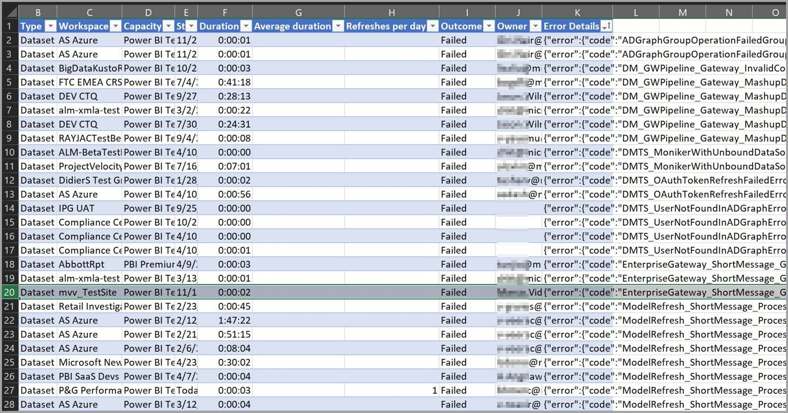

# สรุปการรีเฟรชสำหรับ Power BIRefresh summaries for Power BI

หน้า **สรุปการรีเฟรช** ของ Power BI ที่พบในพอร์ทัลผู้ดูแลระบบ Power BI มีการควบคุมและข้อมูลเชิงลึกเกี่ยวกับตารางเวลาการรีเฟรช ความจุ และการทับซ้อนของตารางเวลาการรีเฟรชที่อาจมีThe Power BI **refresh summaries** page, found in the Power BI Admin portal, provides control and insight into your refresh schedules, capacities, and potential refresh schedule overlaps. คุณสามารถใช้หน้าสรุปการรีเฟรชเพื่อตรวจสอบว่าคุณควรปรับตารางเวลาการรีเฟรชหรือไม่ เรียนรู้รหัสข้อผิดพลาดที่เกี่ยวข้องกับปัญหาการรีเฟรช และจัดการการกำหนดตารางเวลาการรีเฟรชข้อมูลของคุณอย่างถูกต้องYou can use the refresh summaries page to determine whether you should adjust refresh schedules, learn error codes associated with refresh issues, and properly manage your data refresh scheduling. 

หน้าสรุปการรีเฟรชมีสองมุมมองได้แก่:The refresh summaries page has two views:

* **ประวัติ**- แสดงประวัติสรุปการรีเฟรชสำหรับความจุ Power BI Premium ที่คุณเป็นผู้ดูแลระบบ**History** - displays the refresh summary history for Power BI Premium capacities for which you are an administrator.

* **ตารางเวลา** - แสดงมุมมองตารางเวลาสำหรับการรีเฟรชที่กำหนดไว้ ซึ่งยังสามารถค้นพบปัญหาเกี่ยวกับช่วงเวลาที่มีการสมัครรับข้อมูลมากเกินไป**Schedule** - shows the schedule view for scheduled refresh, which also can uncover issues with time slots that are oversubscribed.

คุณยังสามารถส่งออกข้อมูลเกี่ยวกับเหตุการณ์การรีเฟรชไปยังไฟล์ .CSV ซึ่งสามารถให้ข้อมูลที่สำคัญและความเข้าใจในเหตุการณ์การรีเฟรช หรือข้อผิดพลาดที่สามารถส่งผลกระทบต่อประสิทธิภาพการทำงานหรือการดำเนินการรีเฟรชที่กำหนดไว้You can also export information about a refresh event to a .CSV file, which can provide significant information and insight into refresh events or errors that can be impacting the performance or completion of scheduled refresh events.

ส่วนต่อไปนี้จะพิจารณามุมมองเหล่านี้ในแต่ละมุมมองเป็นลำดับThe following sections look at each of these views in turn. 

## รีเฟรชประวัติRefresh history

คุณสามารถเลือกมุมมอง **ประวัติ** ได้โดยการคลิกที่ **ประวัติ** ในหน้าสรุปการรีเฟรชYou can select the **History** view by clicking on **History** in the refresh summaries page.

ประวัติมีข้อมูลภาพรวมผลลัพธ์ของการรีเฟรชที่กำหนดไว้ล่าสุดในความจุที่คุณมีสิทธิ์ในฐานะผู้ดูแลระบบThe History provides an overview of the outcomes of recently scheduled refreshes on the capacities for which you have admin privilege. คุณสามารถเรียงลำดับมุมมองตามคอลัมน์ใด ๆ ได้โดยการคลิกที่คอลัมน์You can sort the view by any column by clicking the column. คุณสามารถเลือกที่จะเรียงลำดับมุมมองตามคอลัมน์ที่เลือกโดยเรียงลำดับจากน้อยไปมาก มากไปน้อย หรือโดยใช้ตัวกรองข้อความYou can choose to sort the view by the column selected by ascending order, descending, or by using text filters.

ในมุมมองประวัติข้อมูลที่เกี่ยวข้องกับการรีเฟรชที่กำหนดไว้จะขึ้นอยู่กับบันทึกรายการล่าสุด 60 รายการสำหรับการรีเฟรชที่กำหนดไว้แต่ละครั้งIn history view, the data associated with a given refresh is based on up 60 most recent records for each scheduled refresh.

นอกจากนี้ คุณยังสามารถส่งออกข้อมูลสำหรับการรีเฟรชที่กำหนดไว้ใด ๆ ไปยัง ไฟล์ .CSV ซึ่งประกอบด้วยข้อมูลรายละเอียด รวมถึงข้อความข้อผิดพลาดสำหรับเหตุการณ์การรีเฟรชแต่ครั้งYou can also export information for any scheduled refresh to a .CSV file, which includes detailed information including error messages for each refresh event. การส่งออกไปยังไฟล์ .CSV ช่วยให้คุณสามารถเรียงลำดับไฟล์ที่ยึดตามคอลัมน์ใด ๆ ค้นหาคำ เรียงลำดับตามรหัสข้อผิดพลาดหรือเจ้าของ และอื่น ๆ ได้Exporting to a .CSV file lets you sort the file based on any of the columns, search for words, sort based on error codes or owners, and so on. รูปภาพต่อไปนี้แสดงตัวอย่างของไฟล์ .CSV ที่ส่งออกThe following image shows an example exported .CSV file. 

ด้วยข้อมูลในไฟล์ที่ส่งออก คุณสามารถตรวจสอบความจุ ระยะเวลา และข้อความข้อผิดพลาดใด ๆ ที่บันทึกไว้สำหรับอินสแตนซ์ของรีเฟรชWith the information in the exported file, you can review the capacity, duration, and any error messages recorded for the instance of refresh. 

## กำหนดตารางเวลาการรีเฟรชRefresh schedule

คุณสามารถเลือกมุมมอง **ตารางเวลา** ได้โดยการคลิกที่ **ตารางเวลา** ในสรุปการรีเฟรชYou can select the **Schedule** view by clicking on **Schedule** in refresh summaries. มุมมองตารางเวลาจะแสดงข้อมูลการกำหนดตารางเวลาสำหรับสัปดาห์ โดยแบ่งออกเป็นช่วงเวลาละ 30 นาทีThe Schedule view displays scheduling information for the week, broken down into 30-minute time slots. 

มุมมองตารางเวลามีประโยชน์อย่างมากในการพิจารณาว่าเหตุการณ์การรีเฟรชที่กำหนดไว้นั้นเว้นระยะไว้อย่างเหมาะสมหรือไม่ ทำให้การรีเฟรชทั้งหมดเสร็จสมบูรณ์โดยไม่ทับซ้อนกัน หรือคุณมีเหตุการณ์การรีเฟรชที่กำหนดไว้ที่ใช้เวลานานเกินไป และสร้างข้อขัดแย้งของทรัพยากรหรือไม่The Schedule view is very useful in determining whether the refresh events scheduled are properly spaced, allowing for all refreshes to complete without overlap, or whether you have scheduled refresh events that are taking too long and creating resource contention. ถ้าคุณพบข้อขัดแย้งของทรัพยากรดังกล่าว คุณควรปรับตารางเวลาการรีเฟรชของคุณเพื่อหลีกเลี่ยงความขัดแย้งหรือการซ้อนทับกัน ดังนั้นการรีเฟรชที่กำหนดไว้ของคุณสามารถดำเนินการให้เสร็จสมบูรณ์ได้If you find such resource contention, you should adjust your refresh schedules to avoid the conflicts or overlap, so your scheduled refreshes can complete successfully. 

คอลัมน์ *เวลาการรีเฟรชที่จองไว้ (นาที)*  คือการคำนวณค่าเฉลี่ยของบันทึกรายการสูงสุดถึง 60 รายการสำหรับแต่ละชุดข้อมูลที่เกี่ยวข้องThe *Refresh time booked (minutes)* column is a calculation of the average of up to 60 records for each associated dataset. ค่าตัวเลขสำหรับช่วงเวลา 30 นาทีแต่ละช่วง คือผลรวมของนาทีที่คำนวณสำหรับการรีเฟรชที่กำหนดไว้ทั้งหมดเพื่อเริ่มต้นในช่วงเวลา **และ** การรีเฟรชที่กำหนดไว้ใด ๆ เพื่อเริ่มต้นช่วงเวลา *ก่อนหน้านี้* แต่มีช่วงเวลาเฉลี่ยที่เกินออกไปในช่วงเวลาที่เลือกThe numeric value for each 30-minute time slot is the sum of minutes calculated for all scheduled refreshes scheduled to start on the time slot **and** any scheduled refreshes set to start on the *previous* time slot, but whose average duration overflows into the time slot that's selected.

คอลัมน์ *เวลาที่พร้อมใช้งานการรีเฟรช (นาที)* คือการคำนวณนาทีที่พร้อมใช้งานสำหรับการรีเฟรชในแต่ละครั้งที่มีการลบการรีเฟรชใดก็ตามที่มีการกำหนดเวลาไว้สำหรับช่องเวลานั้นThe *Refresh time available (minutes)* column is a calculation of the minutes available for refresh in each time slot, minus whatever refresh is already scheduled for that timeslot. ตัวอย่างเช่นถ้าการสมัครใช้งาน P2 ของคุณให้การรีเฟรชที่มีจำนวน 12 แบบพร้อมกันคุณจะมีช่อง 1230 นาที ดังนั้น 12 รีเฟรช x 30 นาทีแต่ละครั้ง = 360 นาทีพร้อมใช้งานสำหรับการรีเฟรชในช่องเวลานั้นFor example, if your P2 subscription provides 12 concurrently running refreshes, you have 12 30-minute slots, so 12 refreshes x 30 minutes each = 360 minutes available for refresh in that time slot. หากคุณมีการรีเฟรชหนึ่งรายการในช่องดังกล่าวที่ใช้เวลา 20 นาที การ *รีเฟรชของคุณพร้อมใช้งาน (นาที)* ในช่องดังกล่าวคือ 340 นาที (360 ทั้งหมดที่พร้อมใช้งานลบ 20 นาทีจองแล้ว = 340 นาทียังคงพร้อมใช้งาน)If you have one refresh booked in that slot that takes 20 minutes, your *Refresh time available (minutes)* in that slot is 340 minutes (360 total minutes available, minus 20 minutes already booked = 340 minutes still available). 

คุณสามารถเลือกช่วงเวลา จากนั้นเลือกปุ่ม **รายละเอียด** ที่เกี่ยวข้องเพื่อดูเหตุการณ์การรีเฟรชที่กำหนดไว้ที่มีส่วนเกี่ยวข้องกับเวลาการรีเฟรที่จองไว้ เจ้าของ และระยะเวลาที่ใช้ในการดำเนินการให้เสร็จสมบูรณ์You can select a time slot and then select the associated **details** button to see which scheduled refresh events contribute to the refresh time booked, their owners, and how long they take to complete.

ลองดูตัวอย่างเพื่อดูวิธีการทำงานLet's look at an example, to see how this works. กล่องโต้ตอบต่อไปนี้จะแสดงขึ้นเมื่อเราเลือกช่วงเวลา 20:30 น. วันอาทิตย์ และคลิก **รายละเอียด**The following dialog is displayed when we select the 8:30 PM time slot for Sunday, and click **details**.

มีสามเหตุการณ์การรีเฟรชที่กำหนดไว้ที่เกิดขึ้นในช่วงเวลานี้There are three scheduled refresh events occurring in this time slot. 

ทั้งการรีเฟรชที่กำหนดไว้ครั้งที่ #1 และ #3 จะถูกกำหนดเวลาไว้สำหรับช่วงเวลา 20:30 น. นี้ ซึ่งเราสามารถตรวจสอบได้โดยดูที่ค่าในคอลัมน์ **ช่วงเวลาที่กำหนดไว้**Scheduled refresh #1 and #3 are both scheduled for this 8:30 PM time slot, which we can determine by looking at the value in the **Scheduled time slot** column. ระยะเวลาโดยเฉลี่ยคือ 4:39 และหกวินาที (0:06) ตามลำดับTheir average durations are 4:39 and six seconds (0:06) respectively. เป็นช่วงเวลาที่เหมาะสมAll is good there.

อย่างไรก็ตาม การรีเฟรชที่กำหนดไว้ครั้งที่ #2 มีการกำหนดเวลาไว้สำหรับช่วงเวลา 20:00 น. แต่เนื่องจากใช้เวลาโดยเฉลี่ยมากกว่า 48 นาทีในการดำเนินการให้เสร็จสมบูรณ์ (ที่เห็นในคอลัมน์ **ระยะเวลาเฉลี่ย**) ซึ่งจะทำให้เหตุการณ์การรีเฟรชเกินออกไปในช่วงเวลา 30 นาทีถัดไปHowever, scheduled refresh #2 is scheduled for the 8:00 PM time slot, but because it takes an average of over 48 minutes to complete (seen in the **Average duration** column), that refresh event overflows into the next 30-minute time slot. 

ซึ่งไม่ดีThat's not good. ผู้ดูแลระบบในกรณีนี้ควรติดต่อเจ้าของของอินสแตนซ์การรีเฟรชที่กำหนดไว้ดังกล่าว และแนะนำให้พวกเขาค้นหาช่วงเวลาที่แตกต่างกันสำหรับการรีเฟรชที่กำหนดไว้ หรือกำหนดตารางเวลาใหม่อีกครั้งเพื่อไม่ให้มีการทับซ้อนกัน หรือค้นหาโซลูชันอื่น ๆ เพื่อป้องกันการทับซ้อนดังกล่าวThe admin in this case should contact the owners of that scheduled refresh instance and suggest they find a different time slot for that scheduled refresh, or reschedule the other refreshes so there's no overlap, or find some other solution to prevent such overlap. 

## ขั้นตอนถัดไปNext steps

- [การรีเฟรชข้อมูลใน Power BIData refresh in Power BI](refresh-data.md)  
- [เกตเวย์ Power BI - ส่วนบุคคลPower BI Gateway - Personal](service-gateway-personal-mode.md)  
- [เกตเวย์ข้อมูลภายในองค์กร (โหมดส่วนบุคคล)On-premises data gateway (personal mode)](service-gateway-onprem.md)  
- [การแก้ไขปัญหาเกตเวย์ข้อมูลในองค์กรTroubleshooting the On-premises data gateway](service-gateway-onprem-tshoot.md)  
- [แก้ไขปัญหาเกตเวย์ Power BI - ส่วนบุคคลTroubleshooting the Power BI Gateway - Personal](service-admin-troubleshooting-power-bi-personal-gateway.md)  

มีคำถามเพิ่มเติมหรือไม่More questions? [ลองถามชุมชน Power BITry asking the Power BI Community](https://community.powerbi.com/)