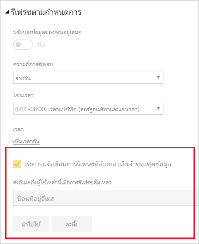

# การแก้ไขปัญหาสถานการณ์สมมติในการรีเฟรชTroubleshooting refresh scenarios

ที่นี่คุณสามารถค้นหาข้อมูลเกี่ยวกับสถานการณ์สมมติที่หลากหลายที่คุณอาจประสบเมื่อรีเฟรชข้อมูลภายในบริการ Power BIHere you can find information regarding different scenarios you may face when refreshing data within the Power BI service.

> [!NOTE]
> ถ้าคุณพบกับสถานการณ์สมมติที่ไม่ได้แสดงอยู่ในรายการด้านล่างนี้ และทำให้เกิดปัญหากับคุณ คุณสามารถขอความช่วยเหลือเพิ่มเติมได้ใน[เว็บไซต์ชุมชน](https://community.powerbi.com/) หรือคุณสามารถสร้าง[ตั๋วสนับสนุน](https://powerbi.microsoft.com/support/)ได้If you encounter a scenario that is not listed below, and it's causing you issues, you can ask for further assistance on the [community site](https://community.powerbi.com/), or you can create a [support ticket](https://powerbi.microsoft.com/support/).
>

คุณควรตรวจสอบให้แน่ใจว่ามีการตอบสนองความต้องการพื้นฐานสำหรับการรีเฟรชและผ่านการตรวจสอบแล้วYou should always ensure that basic requirements for refresh are met and verified. ข้อกำหนดพื้นฐานเหล่านี้ประกอบด้วย:These basic requirements include:

* ตรวจสอบเวอร์ชันของเกตเวย์ว่าเป็นเวอร์ชันล่าสุดVerify the gateway version is up to date
* ตรวจสอบว่ารายงานได้เลือกเกตเวย์แล้ว ถ้าไม่ใช่ แหล่งข้อมูลอาจมีการเปลี่ยนแปลงหรืออาจหายไปVerify the report has a gateway selected - if not, the datasource may have changed or might be missing

หลังจากที่คุณยืนยันความต้องการเหล่านั้นแล้ว โปรดลองดูที่ส่วนต่อไปนี้เพื่อแก้ไขปัญหาเพิ่มเติมOnce you've confirmed those requirements are met, take a look through the following sections for more troubleshooting. 

## การแจ้งเตือนทางอีเมลEmail notifications

หากคุณเข้ามาในบทความนี้จากการแจ้งเตือนทางอีเมล และคุณไม่ต้องการรับอีเมลเกี่ยวกับปัญหาการรีเฟรชอีกต่อไป ให้ติดต่อผู้ดูแลระบบ Power BI ของคุณ ขอให้พวกเขาลบอีเมลของคุณหรือรายชื่ออีเมลที่คุณสมัครใช้งานจากชุดข้อมูลที่เหมาะสมใน Power BIIf you're coming to this article from an email notification, and you no longer want to receive emails about refresh issues, contact your Power BI admin. Ask them to remove your email or an email list you're subscribed to from the appropriate datasets in Power BI. พวกเขาสามารถทำสิ่งนี้ได้จากพื้นที่ต่อไปนี้ในพอร์ทัลผู้ดูแลระบบ Power BIThey can do this from the following area in the Power BI admin portal.

## รีเฟรชโดยการใช้ตัวเชื่อมต่อเว็บ ไม่ทำงานอย่างถูกต้องRefresh using Web connector doesn't work properly

ถ้าคุณมีสคริปต์ตัวเชื่อมต่อเว็บที่ใช้ในฟังก์ชัน [**Web.Page**](/powerquery-m/web-page) และคุณได้อัปเดตชุดข้อมูลหรือรายงานของคุณหลังวันที่ 18 พฤศจิกายน 2016 คุณต้องใช้เกตเวย์สำหรับการรีเฟรชเพื่อให้ระบบทำงานอย่างถูกต้องIf you have a Web connector script that's using the [**Web.Page**](/powerquery-m/web-page) function, and you have updated your dataset or report after November 18th, 2016, you must use a gateway for refresh to work properly.

## แหล่งข้อมูลที่ไม่รับรองสำหรับการรีเฟรชUnsupported data source for refresh

เมื่อต้องการกำหนดค่าชุดข้อมูล อาจมีข้อผิดพลาดที่ระบุว่า ชุดข้อมูลใช้แหล่งข้อมูลที่ไม่รับรองสำหรับการรีเฟรชWhen configuring a dataset, you may get an error indicating the dataset uses an unsupported data source for refresh. สำหรับรายละเอียด ดู[การแก้ไขปัญหาแหล่งข้อมูลที่ไม่รับรองสำหรับการรีเฟรช](service-admin-troubleshoot-unsupported-data-source-for-refresh.md)For details, see [Troubleshooting unsupported data source for refresh](service-admin-troubleshoot-unsupported-data-source-for-refresh.md).

## แดชบอร์ดไม่แสดงการเปลี่ยนแปลงหลังจากรีเฟรชDashboard doesn't reflect changes after refresh

โปรดรอประมาณ 10-15 นาทีสำหรับการรีเฟรชเพื่อให้มีผลในไทล์แดชบอร์ดPlease wait about 10-15 minutes for a refresh to be reflected in the dashboard tiles. ถ้ายังคงไม่ปรากฏขึ้น ให้ปักหมุดการแสดงภาพไปยังแดชบอีกครั้งIf it is still not showing up, re-pin the visualization to the dashboard.

## GatewayNotReachable เมื่อตั้งค่าข้อมูลประจำตัวGatewayNotReachable when setting credentials

คุณอาจพบ `GatewayNotReachable` เมื่อพยายามตั้งค่าข้อมูลประจำตัวสำหรับแหล่งข้อมูลYou may encounter `GatewayNotReachable` when trying to set credentials for a data source. ซึ่งอาจเกิดจากเกตเวย์ที่ไม่อัปเดตThis can be the result of an outdated gateway. ติดตั้งเกตเวย์ล่าสุด แล้วลองอีกครั้งInstall the latest gateway and try again.

## ข้อผิดพลาดเกี่ยวกับการประมวลผล: ระบบเกิดข้อผิดพลาดต่อไปนี้: ประเภทไม่ตรงกันProcessing Error: The following system error occurred: Type Mismatch

ซึ่งอาจเป็นปัญหาจากสคริปต์ M ของคุณภายในไฟล์ Power BI Desktop หรือสมุดงาน Excel ของคุณThis could be an issue with your M script within your Power BI Desktop file or Excel workbook. นอกจากนี้ อาจเกิดจากเวอร์ชัน Power BI Desktop ที่ล้าสมัยIt can also be due to an out-of-date Power BI Desktop version.

## ข้อผิดพลาดการรีเฟรชไทล์Tile refresh errors

สำหรับรายการและคำอธิบายของข้อผิดพลาดที่คุณอาจประสบไทล์แดชบอร์ด ดู[แก้ไขปัญหาข้อผิดพลาดไทล์](refresh-troubleshooting-tile-errors.md)For a list of errors you may encounter with dashboard tiles, and explanations, see [Troubleshooting tile errors](refresh-troubleshooting-tile-errors.md).

## รีเฟรชล้มเหลวเมื่อปรับปรุงข้อมูลจากแหล่งข้อมูลที่ใช้ AAD OAuthRefresh fails when updating data from sources that use AAD OAuth

โทเค็น OAuth ของ Azure Active Director (**AAD**) ที่ใช้งานโดยแหล่งข้อมูลต่าง ๆ มากมายจะหมดอายุในหนึ่งชั่วโมงโดยประมาณThe Azure Active Directory (**AAD**) OAuth token, used by many different data sources, expires in approximately one hour. คุณอาจอยู่ในสถานการณ์ที่การโหลดข้อมูลใช้เวลานานกว่าอายุการใช้งานของโทเค็น (มากกว่าหนึ่งชั่วโมง) เนื่องจากบริการ Power BI รอถึงสองชั่วโมงเมื่อโหลดข้อมูลYou can run into situations where loading data takes longer than the token expiration (more than one hour), since the Power BI service waits for up to two hours when loading data. ในสถานการณ์เช่นนี้ กระบวนการในการโหลดข้อมูลอาจไม่สำเร้จและมีข้อผิดพลาดข้อมูลประจำตัวIn that situation, the data loading process can fail with a credentials error.

แหล่งข้อมูลที่ใช้ AAD OAuth รวมถึง **Microsoft Dynamics CRM Online**, **SharePoint Online** (SPO) และอื่น ๆData sources that use AAD OAuth include **Microsoft Dynamics CRM Online**, **SharePoint Online** (SPO), and others. ถ้าคุณกำลังเชื่อมต่อกับแหล่งข้อมูลดังกล่าวและเกิดความล้มเหลวของข้อมูลประจำตัวเมื่อโหลดข้อมูลใช้เวลามากกว่าหนึ่งชั่วโมง นี่อาจเป็นเหตุผลIf you’re connecting to such data sources, and get a credentials failure when loading data takes more than an hour, this may be the reason.

Microsoft กำลังค้นหาโซลูชันที่ช่วยให้กระบวนหารโหลดข้อมูลทำการรีเฟรชโทเค็นและดำเนินต่อMicrosoft is investigating a solution that allows the data loading process to refresh the token and continue. อย่างไรก็ตาม หากตัวอย่าง Dynamics CRM Online หรือ SharePoint Online ของคุณ (หรือแหล่งข้อมูล AAD OAuth อื่น) มีขนาดใหญ่มากและอาจเข้าในเกณฑ์ค่าต่ำสุดการโหลดข้อมูล 2 ชั่วโมง คุณอาจประสบกับการหมดเวลาการโหลดข้อมูลจากบริการ Power BI ได้เช่นกันHowever, if your Dynamics CRM Online or SharePoint Online instance (or other AAD OAuth data source) is so large that it can run into the two-hour data-load threshold, you may experience a data load timeout from the Power BI service as well.

นอกจากนี้ โปรดทราบว่าสำหรับรีเฟรชเพื่อให้ทำงานได้อย่างเหมาะสม เมื่อเชื่อมต่อไปยังข้อมูลแหล่ง **SharePoint Online** โดยใช้ AAD OAuth คุณต้องใช้บัญชีเดียวกันกับที่คุณใช้เพื่อลงชื่อเข้าใช้ **บริการ Power BI**Also note that, for refresh to work properly, when connecting to a **SharePoint Online** data source using AAD OAuth, you must use the same account that you use to sign in to the **Power BI service**.

## ขีดจำกัดข้อมูลที่ไม่มีการบีบอัดสำหรับรีเฟรชUncompressed data limits for refresh

ขนาดสูงสุดสำหรับชุดข้อมูลที่นำเข้าใน **บริการ Power BI** คือ 1 GBThe maximum size for datasets imported into the **Power BI service** is 1 GB. ชุดข้อมูลเหล่านี้จะถูกบีบอัดเพื่อให้แน่ใจถึงประสิทธิภาพสูงสุดในการทำงานThese datasets are heavily compressed to ensure high performance. นอกจากนี้ ในความจุที่ใช้ร่วมกัน บริการจะวางขีดจำกัดจำนวนข้อมูลที่ไม่บีบอัดที่มีการประมวลผลในระหว่างการรีเฟรชเเป็น 10 GBIn addition, in shared capacity, the service places a limit on the amount of uncompressed data that is processed during refresh to 10 GB. ซึ่งขั้นตอนนี้จะจำกัดบัญชีผู้ใช้ในการบีบอัด ดังนั้นจึงสูงกว่า 1 GB มากThis limit accounts for the compression, and therefore is much higher than 1 GB. ชุดข้อมูลใน Power BI Premium ไม่ขึ้นอยู่กับขีดจำกัดนี้Datasets in Power BI Premium are not subject to this limit. ถ้าการรีเฟรชในบริการ Power BI ล้มเหลวด้วยเหตุผลนี้ โปรดลดปริมาณข้อมูลที่จะนำเข้าไปยัง Power BI และลองอีกครั้งIf refresh in the Power BI service fails for this reason, please reduce the amount of data being imported to Power BI and try again.

## หมดเวลารีเฟรชตามกำหนดการScheduled refresh timeout

รีเฟรชตามกำหนดการสำหรับการหมดเวลาของชุดข้อมูลที่นำเข้าหลังจากสองชั่วโมงScheduled refresh for imported datasets timeout after two hours. การหมดเวลานี้จะเพิ่มเป็น 5 ชั่วโมงสำหรับชุดข้อมูลในพื้นที่ทำงาน **Premium**This timeout is increased to five hours for datasets in **Premium** workspaces. ถ้าคุณประสบกับขีดจำกัดนี้อาจต้องพิจารณาลดขนาดหรือความซับซ้อนของชุดข้อมูลของคุณ หรือพิจารณาแบ่งชุดข้อมูลเป็นขนาดที่เล็กลงIf you  encounter this limit, consider reducing the size or complexity of your dataset, or consider breaking the dataset into smaller pieces.

## รีเฟรชตามกำหนดการล้มเหลวScheduled refresh failures

ถ้าการรีเฟรชตามกำหนดการล้มเหลวสี่ครั้งติดต่อกัน Power BI จะปิดใช้งานการรีเฟรชIf a scheduled refresh fails four times in a row, Power BI disables the refresh. แก้ไขปัญหาพื้นฐาน และจากนั้นจึงเปิดใช้งานการรีเฟรชตามกำหนดการใหม่Address the underlying problem, and then re-enable the scheduled refresh.

## การเข้าถึงทรัพยากรถูกห้ามAccess to the resource is forbidden  

ข้อผิดพลาดนี้สามารถเกิดขึ้นเนื่องจากข้อมูลประจำตัวที่แคชไว้หมดอายุแล้วThis error can occur because of expired cached credentials. ล้างแคชของเบราว์เซอร์อินเทอร์เน็ตของคุณ โดยลงชื่อเข้าใช้ Power BI แล้วไปที่ `https://app.powerbi.com?alwaysPromptForContentProviderCreds=true`Clear your internet browser cache by going signing into Power BI and going to `https://app.powerbi.com?alwaysPromptForContentProviderCreds=true`. ซึ่งเป็นการบังคับการปรับปรุงข้อมูลประจำตัวของคุณThis forces an update of your credentials.

## การรีเฟรชข้อมูลล้มเหลวเนื่องจากการเปลี่ยนรหัสผ่าน หรือข้อมูลประจำตัวที่หมดอายุData refresh failure because of password change or expired credentials

การรีเฟรชข้อมูลอาจล้มเหลวเนื่องจากข้อมูลประจำตัวที่แคชไว้หมดอายุแล้วData refresh can also fail due to expired cached credentials. ล้างแคชของเบราว์เซอร์อินเทอร์เน็ตของคุณ โดยลงชื่อเข้าใช้ Power BI แล้วไปที่ `https://app.powerbi.com?alwaysPromptForContentProviderCreds=true`Clear your internet browser cache by going signing into Power BI and going to `https://app.powerbi.com?alwaysPromptForContentProviderCreds=true`. ซึ่งเป็นการบังคับการปรับปรุงข้อมูลประจำตัวของคุณThis forces an update of your credentials.

## ขั้นตอนถัดไปNext steps

- [การรีเฟรชข้อมูลใน Power BIData refresh in Power BI](refresh-data.md)  
- [การแก้ไขปัญหาเกตเวย์ข้อมูลในองค์กรTroubleshooting the On-premises data gateway](service-gateway-onprem-tshoot.md)  
- [แก้ไขปัญหาเกตเวย์ Power BI - ส่วนบุคคลTroubleshooting the Power BI Gateway - Personal](service-admin-troubleshooting-power-bi-personal-gateway.md)  

มีคำถามเพิ่มเติมหรือไม่More questions? [ลองถามชุมชน Power BITry asking the Microsoft Power BI Community](https://community.powerbi.com/)
