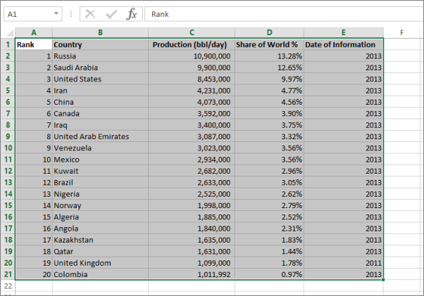
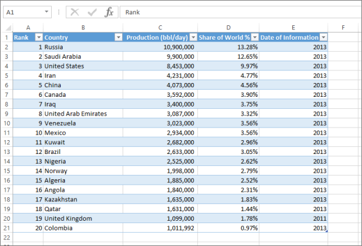

# ข้อผิดพลาด: เราไม่พบข้อมูลใด ๆ ในสมุดงาน Excel ของคุณError: We couldn't find any data in your Excel workbook

>[!NOTE]  
>บทความนี้นำไปใช้กับ Excel 2007 และเวอร์ชันที่ใหม่กว่าThis article applies to Excel 2007 and later.

เมื่อคุณนำเข้าสมุดงาน Excel ไปใน Power BI คุณอาจเห็นข้อผิดพลาดต่อไปนี้:When you import an Excel workbook into Power BI, you may see the following error:

*ข้อผิดพลาด: เราไม่พบข้อมูลใดๆ ที่จัดรูปแบบเป็นตาราง เมื่อต้องการนำเข้าจากโปรแกรม Excel ลงในบริการของ Power BI คุณต้องจัดรูปแบบข้อมูลเป็นตาราง เลือกข้อมูลทั้งหมดที่คุณต้องการในตารางและกด Ctrl + T**Error: We couldn't find any data formatted as a table. To import from Excel into the Power BI service, you need to format the data as a table. Select all the data you want in the table and press Ctrl+T.*

## แก้ไขปัญหาอย่างรวดเร็วQuick solution
1. แก้ไขมุดงานใน ExcelEdit your workbook in Excel.
2. เลือกช่วงของเซลล์ที่มีข้อมูลของคุณSelect the range of cells that contain your data. แถวแรกควรประกอบด้วยส่วนหัวของคอลัมน์ (ชื่อคอลัมน์)The first row should contain your column headers (the column names).
3. กด **Ctrl + T** เพื่อสร้างตารางPress **Ctrl + T** to create a table.
4. บันทึกสมุดงานของคุณSave your workbook.
5. กลับไปยัง Power BI และนำเข้าสมุดงานของคุณอีกครั้ง หรือถ้าคุณกำลังทำงานใน Excel 2016 และคุณได้บันทึกสมุดงานของคุณไปยัง OneDrive for Business ใน Excel ให้คลิกไฟล์ > เผยแพร่Return to Power BI and import your workbook again, or if you're working in Excel 2016 and you've saved your workbook to OneDrive for Business, in Excel, click File > Publish.

## รายละเอียดDetails
### สาเหตุCause
ใน Excel คุณสามารถสร้า **ตาราง** นอกช่วงของเซลล์ได้ ซึ่งทำให้ง่ายขึ้นเมื่อต้องการเรียงลำดับ กรอง และจัดรูปแบบข้อมูลIn Excel, you can create a **table** out of a range of cells, which makes it easier to sort, filter, and format data.

เมื่อคุณนำเข้าสมุดงาน Excel, Power BI จะค้นหาตารางเหล่านี้และนำเข้าในชุดข้อมูลหนึ่ง ถ้าไม่พบตารางใด คุณจะเห็นข้อความข้อผิดพลาดนี้When you import an Excel workbook, Power BI looks for these tables and imports them into a dataset; if it doesn't find any tables, you'll see this error message.

### วิธีแก้Solution
1. เปิดสมุดงานของคุณใน ExcelOpen your workbook in Excel. 
    >[!NOTE]
    >รูปภาพต่อไปนี้เป็นภาพของ Excel 2013The pictures here are of Excel 2013. ถ้าคุณกำลังใช้เวอร์ชันอื่น องค์ประกอบต่าง ๆ อาจแตกต่างกันเล็กน้อย แต่ขั้นตอนต่าง ๆ จะเหมือนกันIf you're using a different version, things may look a little different, but the steps are the same.
    
    
2. เลือกช่วงของเซลล์ที่มีข้อมูลของคุณSelect the range of cells that contain your data. แถวแรกควรประกอบด้วยส่วนหัวของคอลัมน์ (ชื่อคอลัมน์)The first row should contain your column headers (the column names):
   
    
3. ใน Ribbon บนแถบ **แทรก** คลิก **ตาราง**In the ribbon on the **INSERT** tab, click **Table**. (หรือโดยการใช้ทางลัด กด **Ctrl + T**)(Or, as a shortcut, press **Ctrl + T**.)
   
    
4. คุณจะเห็นกล่องโต้ตอบต่อไปนี้You'll see the following dialog. ตรวจสอบให้แน่ใจว่าได้เลือก **ตารางของฉันมีส่วนหัว** และเลือก **ตกลง**:Make sure **My table has headers** is checked, and select **OK**:
   
    
5. ในตอนนี้ ข้อมูลของคุณถูกจัดรูปแบบเป็นตาราง:Now your data is formatted as a table:
   
    
6. บันทึกสมุดงานของคุณSave your workbook.
7. กลับไปยัง Power BIReturn to Power BI. เลือก รับข้อมูล ที่ด้านล่างของบานหน้าต่างนำทางSelect Get Data at the bottom of the nav pane.
   
    
8. ในกล่อง **ไฟล์** เลือก **รับ**In the **Files** box, select **Get**.
   
    
9. นำเข้าสมุดงาน Excel ของคุณอีกครั้งImport your Excel workbook again. ขณะนี้ การนำเข้าควรพบตารางและดำเนินการสำเร็จThis time, the import should find the table and succeed.
   
    ถ้าการนำเข้ายังคงล้มเหลว แจ้งให้เราทราบโดยการคลิก \*\* ชุมชน \*\* ในเมนูช่วยเหลือ:If the import still fails, let us know by clicking \*\*Community \*\*in the help menu:
   
    
