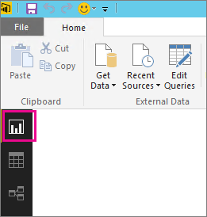

# <a name="troubleshooting-unsupported-data-source-for-refresh"></a><span data-ttu-id="49913-103">แก้ไขปัญหาแหล่งข้อมูลไม่รองรับสำหรับรีเฟรช</span><span class="sxs-lookup"><span data-stu-id="49913-103">Troubleshooting unsupported data source for refresh</span></span>
<span data-ttu-id="49913-104">คุณอาจเห็นข้อผิดพลาดเมื่อพยายามที่จะกำหนดค่าชุดข้อมูลสำหรับรีเฟรชตามกำหนดการ</span><span class="sxs-lookup"><span data-stu-id="49913-104">You may see an error when trying to configured a dataset for scheduled refresh.</span></span>

```output
You cannot schedule refresh for this dataset because it gets data from sources that currently don’t support refresh.
```

<span data-ttu-id="49913-105">ซึ่งเกิดขึ้นเมื่อแหล่งข้อมูลที่คุณใช้ที่อยู่ภายใน Power BI Desktop ไมสนับสนุนการรีเฟรช</span><span class="sxs-lookup"><span data-stu-id="49913-105">This happens when the data source you used, within Power BI Desktop, isn’t supported for refresh.</span></span> <span data-ttu-id="49913-106">คุณจะต้องค้นหาแหล่งข้อมูลที่คุณกำลังใช้และการเปรียบเทียบแหล่งข้อมูลดังกล่าวกับรายการของแหล่งข้อมูลที่สนับสนุนที่[รีเฟรชข้อมูลใน Power BI](refresh-data.md)</span><span class="sxs-lookup"><span data-stu-id="49913-106">You will need to find the data source that you are using and compare that against the list of supported data sources at [Refresh data in Power BI](refresh-data.md).</span></span> 

## <a name="find-the-data-source"></a><span data-ttu-id="49913-107">ค้นหาแหล่งข้อมูล</span><span class="sxs-lookup"><span data-stu-id="49913-107">Find the data source</span></span>
<span data-ttu-id="49913-108">ถ้าคุณไม่แน่ใจว่ามีการใช้แหล่งข้อมูลใด คุณสามารถค้นหาได้โดยการใช้ขั้นตอนต่อไปนี้ภายใน Power BI Desktop</span><span class="sxs-lookup"><span data-stu-id="49913-108">If you aren’t sure what data source was used, you can find that using the following steps within Power BI Desktop.</span></span>  

1. <span data-ttu-id="49913-109">ใน Power BI Desktop ตรวจสอบให้แน่ใจว่าคุณอยู่บนพื้นที่ **รายงาน**</span><span class="sxs-lookup"><span data-stu-id="49913-109">In Power BI Desktop, make sure you are on the **Report** pane.</span></span>  
   <span data-ttu-id="49913-110"></span><span class="sxs-lookup"><span data-stu-id="49913-110"></span></span>
2. <span data-ttu-id="49913-111">เลือก **แก้ไขแบบสอบถาม** จากแถบ Ribbon</span><span class="sxs-lookup"><span data-stu-id="49913-111">Select **Edit Queries** from the ribbon bar.</span></span>  
   <span data-ttu-id="49913-112"></span><span class="sxs-lookup"><span data-stu-id="49913-112"></span></span>
3. <span data-ttu-id="49913-113">เลือก **ตัวแก้ไขขั้นสูง**</span><span class="sxs-lookup"><span data-stu-id="49913-113">Select **Advanced Editor**.</span></span>  
   <span data-ttu-id="49913-114"></span><span class="sxs-lookup"><span data-stu-id="49913-114"></span></span>
4. <span data-ttu-id="49913-115">สร้างบันทึกย่อของผู้ให้บริการที่อยู่ในรายการสำหรับแหล่งข้อมูล</span><span class="sxs-lookup"><span data-stu-id="49913-115">Make note of the provider listed for the source.</span></span>  <span data-ttu-id="49913-116">ในตัวอย่างนี้ ผู้ให้บริการคือ ActiveDirectory</span><span class="sxs-lookup"><span data-stu-id="49913-116">In this example, the provider is ActiveDirectory.</span></span>  
   
5. <span data-ttu-id="49913-118">เปรียบเทียบผู้ให้บริการด้วยรายการของแหล่งข้อมูลที่สนับสนุนซึ่งพบได้ใน [แหล่งข้อมูล Power BI](power-bi-data-sources.md)</span><span class="sxs-lookup"><span data-stu-id="49913-118">Compare the provider with the list of supported data sources found in [Power BI data sources](power-bi-data-sources.md).</span></span>

> [!NOTE]
> <span data-ttu-id="49913-119">สำหรับปัญหาการรีเฟรชที่เกี่ยวข้องกับแหล่งข้อมูลแบบไดนามิก รวมถึงแหล่งข้อมูลที่มีคิวรีที่สร้างด้วยมือ ดู [การรีเฟรชและแหล่งข้อมูลแบบไดนามิก](refresh-data.md#refresh-and-dynamic-data-sources)</span><span class="sxs-lookup"><span data-stu-id="49913-119">For refresh issues related to dynamic data sources, including data sources that include hand-authored queries, see [refresh and dynamic data sources](refresh-data.md#refresh-and-dynamic-data-sources).</span></span>


## <a name="next-steps"></a><span data-ttu-id="49913-120">ขั้นตอนถัดไป</span><span class="sxs-lookup"><span data-stu-id="49913-120">Next steps</span></span>
[<span data-ttu-id="49913-121">รีเฟรชข้อมูล</span><span class="sxs-lookup"><span data-stu-id="49913-121">Data Refresh</span></span>](refresh-data.md)  
[<span data-ttu-id="49913-122">เกตเวย์ Power BI - ส่วนบุคคล</span><span class="sxs-lookup"><span data-stu-id="49913-122">Power BI Gateway - Personal</span></span>](service-gateway-personal-mode.md)  
[<span data-ttu-id="49913-123">On-premises data gateway (เกตเวย์ข้อมูลภายในองค์กร)</span><span class="sxs-lookup"><span data-stu-id="49913-123">On-premises data gateway</span></span>](service-gateway-onprem.md)  
[<span data-ttu-id="49913-124">การแก้ไขปัญหาเกตเวย์ข้อมูลในองค์กร</span><span class="sxs-lookup"><span data-stu-id="49913-124">Troubleshooting the On-premises data gateway</span></span>](service-gateway-onprem-tshoot.md)  
[<span data-ttu-id="49913-125">แก้ไขปัญหาเกตเวย์ Power BI - ส่วนบุคคล</span><span class="sxs-lookup"><span data-stu-id="49913-125">Troubleshooting the Power BI Gateway - Personal</span></span>](service-admin-troubleshooting-power-bi-personal-gateway.md)  

<span data-ttu-id="49913-126">มีคำถามเพิ่มเติมหรือไม่</span><span class="sxs-lookup"><span data-stu-id="49913-126">More questions?</span></span> [<span data-ttu-id="49913-127">ลองถามชุมชน Power BI</span><span class="sxs-lookup"><span data-stu-id="49913-127">Try asking the Power BI Community</span></span>](https://community.powerbi.com/)
