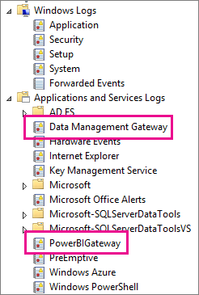

# แก้ไขปัญหาเกตเวย์ Power BI (โหมดส่วนตัว)Troubleshooting Power BI gateway (personal mode)

[!INCLUDE [gateway-rewrite](../includes/gateway-rewrite.md)]

ส่วนต่อไปนี้จะตรวจสอบปัญหาทั่วไปบางประการที่คุณอาจพบเมื่อคุณใช้เกตเวย์ข้อมูล Power BI ในองค์กร (โหมดส่วนบุคคล)The following sections go through some common issues you might come across when you use the Power BI on-premises data gateway (personal mode).

## ปรับปรุงเป็นเวอร์ชันล่าสุดUpdate to the latest version

เวอร์ชันปัจจุบันของเกตเวย์สำหรับใช้งานส่วนบุคคลคือ เกตเวย์ข้อมูลภายในองค์กร (โหมดส่วนบุคคล)The current version of the gateway for personal use is the on-premises data gateway (personal mode). อัปเดตการติดตั้งเมื่อต้องใช้เวอร์ชันนั้นUpdate your installation to use that version.

ปัญหาจำนวนมากสามารถเกิดขึ้นได้เมื่อเวอร์ชันของเกตเวย์ล้าสมัยMany issues can surface when the gateway version is out of date. ดังนั้นหลักปฏิบัติทั่วไปที่ดีคือต้องแน่ใจว่าเวอร์ชันของคุณเป็นเวอร์ชันล่าสุดIt's a good general practice to make sure you're on the latest version. ถ้าคุณไม่ได้อัปเดตเกตเวย์นานเป็นเดือนหรือนานกว่านั้น คุณอาจจะต้องพิจารณาการติดตั้งเกตเวย์เวอร์ชันล่าสุดIf you haven't updated the gateway for a month or longer, consider installing the latest version of the gateway. จากนั้นดูว่าคุณสามารถทำให้เกิดปัญหาซ้ำได้หรือไม่Then see if you can reproduce the issue.

## การติดตั้งInstallation
**เกตเวย์ (โหมดส่วนบุคคล) ดำเนินการในเวอร์ชัน 64 บิต:** ถ้าเครื่องของคุณเป็นเวอร์ชัน 32 บิต คุณไม่สามารถติดตั้งเกตเวย์ (โหมดส่วนบุคคล) ได้**Gateway (personal mode) operates on 64-bit versions:** If your machine is a 32-bit version, you can't install the gateway (personal mode). ระบบปฏิบัติการของคุณจะต้องเป็นเวอร์ชัน 64 บิตYour operating system has to be a 64-bit version. ติดตั้ง Windows เวอร์ชัน 64 บิต หรือติดตั้งเกตเวย์ (โหมดส่วนบุคคล) บนเครื่อง 64 บิตInstall a 64-bit version of Windows or install the gateway (personal mode) on a 64-bit machine.

**การติดตั้งเกตเวย์ (โหมดส่วนบุคคล) ล้มเหลวเนื่องจากบริการแม้ว่าคุณจะเป็นผู้ดูแลระบบภายในสำหรับคอมพิวเตอร์ก็ตาม:** การติดตั้งอาจล้มเหลวถ้าผู้ใช้อยู่ในกลุ่มผู้ดูแลระบบภายในของคอมพิวเตอร์ แต่นโยบายกลุ่มไม่อนุญาตให้ผู้ใช้ลงชื่อเข้าใช้ในฐานะบริการ**Gateway (personal mode) fails to install as a service even though you're a local administrator for the computer:** Installation can fail if the user is in the computer’s local Administrator group, but Group Policy doesn't allow that username to sign in as a service. ตรวจสอบให้แน่ใจว่านโยบายกลุ่มอนุญาตให้ผู้ใช้สามารถลงชื่อเข้าใช้ในฐานะบริการได้Ensure that Group Policy lets a user sign in as a service. เรากำลังแก้ปัญหานี้We’re working on a fix for this issue. สำหรับข้อมูลเพิ่มเติม โปรดดู [เพิ่มเข้าสู่ระบบในฐานะบริการที่ถูกต้องไปยังบัญชี](/previous-versions/windows/it-pro/windows-server-2003/cc739424(v=ws.10))For more information, see [Add the Log on as a service right to an account](/previous-versions/windows/it-pro/windows-server-2003/cc739424(v=ws.10)).

**การดำเนินการหมดเวลา:** ข้อความนี้สามารถเกิดได้ทั่วไปถ้าคอมพิวเตอร์ (เครื่องจริงหรือ VM) ที่คุณกำลังติดตั้งเกตเวย์ (โหมดส่วนบุคคล) มีตัวประมวลผลหลักเดียวกัน**Operation timed out:** This message is common if the computer (physical machine or VM) on which you’re installing the gateway (personal mode) has a single core processor. ปิดทุกแอปพลิเคชัน ปิดการประมวลผลใดก็ตามที่ไม่จำเป็น และลองติดตั้งอีกครั้งClose any applications, turn off any non-essential processes, and try installing again.

**ไม่สามารถติดตั้งเกตเวย์การจัดการข้อมูลหรือตัวเชื่อมต่อ Analysis Services บนคอมพิวเตอร์เครื่องเดียวกันกับเกตเวย์ (โหมดส่วนบุคคล):** ถ้าคุณมีตัวเชื่อมต่อ Analysis Services หรือติดตั้งเกตเวย์การจัดการข้อมูลแล้ว คุณต้องถอนการติดตั้งตัวเชื่อมต่อหรือเกตเวย์ก่อน**Data management gateway or Analysis Services connector can't be installed on the same computer as gateway (personal mode):** If you already have an Analysis Services connector or a data management gateway installed, you must first uninstall the connector or the gateway. แล้วลองติดตั้งเกตเวย์ (โหมดส่วนบุคคล)Then, try installing the gateway (personal mode).

> [!NOTE]
> ถ้าคุณพบปัญหาระหว่างการติดตั้ง บันทึกการตั้งค่าสามารถให้ข้อมูลเพื่อช่วยให้คุณสามารถแก้ไขปัญหาได้If you encounter an issue during installation, the setup logs can provide information to help you resolve the issue. สำหรับข้อมูลเพิ่มเติม โปรดดู [บันทึกการตั้งค่า](#SetupLogs)For more information, see [Setup logs](#SetupLogs).
> 
> 

 **การกำหนดค่าพร็อกซี:** คุณอาจพบปัญหาเกี่ยวกับการกำหนดค่าเกตเวย์ (โหมดส่วนบุคคล) ถ้าสภาพแวดล้อมของคุณจำเป็นต้องใช้พร็อกซี**Proxy configuration:** You might see issues with configuring the gateway (personal mode) if your environment needs the use of a proxy. เมื่อต้องการเรียนรู้เพิ่มเติมเกี่ยวกับวิธีการกำหนดค่าพร็อกซีข้อมูล โปรดดู [การกำหนดค่าพร็อกซีสำหรับเกตเวย์ข้อมูลภายในองค์กร](/data-integration/gateway/service-gateway-proxy)To learn more about how to configure proxy information, see [Configure proxy settings for the on-premises data gateway](/data-integration/gateway/service-gateway-proxy).

## กำหนดตารางเวลาการรีเฟรชSchedule refresh
**ข้อผิดพลาด: ข้อมูลประจำตัวที่จัดเก็บไว้ในระบบคลาวด์สูญหาย****Error: The credential stored in the cloud is missing.**

คุณอาจได้รับข้อความข้อผิดพลาดนี้ในการตั้งค่าสำหรับ\<dataset\> ถ้าคุณมีการรีเฟรชตามกำหนดการ จากนั้นมีการถอนการติดตั้งและการติดตั้งเกตเวย์ (โหมดส่วนบุคคล) อีกครั้งYou might get this error in settings for \<dataset\> if you have a scheduled refresh and then you uninstalled and reinstalled the gateway (personal mode). เมื่อคุณถอนการติดตั้งการเกตเวย์ (โหมดส่วนบุคคล) ข้อมูลประจำตัวของแหล่งข้อมูลสำหรับชุดข้อมูลที่ได้รับการกำหนดค่าสำหรับรีเฟรชจะถูกลบออกจากบริการของ Power BI ด้วยWhen you uninstall a gateway (personal mode), the data source credentials for a dataset that was configured for refresh are removed from the Power BI service.

**วิธีแก้ไข:** ใน Power BI ไปที่การตั้งค่าการรีเฟรชสำหรับชุดข้อมูล**Solution:** In Power BI, go to the refresh settings for a dataset. ใน **การจัดการแหล่งข้อมูล** สำหรับแหล่งข้อมูลใด ๆ ที่มีข้อผิดพลาด เลือก **แก้ไขข้อมูลประจำตัว**In **Manage Data Sources**, for any data source with an error, select **Edit credentials**. จากนั้นลงชื่อเข้าใช้แหล่งข้อมูลอีกครั้งThen sign in to the data source again.

**ข้อผิดพลาด: ข้อมูลประจำตัวที่ระบุไว้สำหรับชุดข้อมูลไม่ถูกต้อง โปรดอัปเดตข้อมูลประจำตัวผ่านการรีเฟรชหรือในกล่องโต้ตอบการตั้งค่าแหล่งข้อมูลเพื่อดำเนินการต่อ****Error: The credentials provided for the dataset are invalid. Please update the credentials through a refresh or in the Data Source Settings dialog to continue.**

**วิธีแก้ไข:** ถ้าคุณได้รับข้อความข้อมูลประจำตัว อาจหมายถึง:**Solution:** If you get a credentials message, it could mean:

* ชื่อผู้ใช้และรหัสผ่านที่คุณใช้ในการลงชื่อเข้าใช้แหล่งข้อมูลนั้นไม่ทันสมัยThe usernames and passwords that you used to sign in to data sources aren't up to date. ใน Power BI ไปที่การตั้งค่ารีเฟรชสำหรับชุดข้อมูลนั้นIn Power BI, go to refresh settings for the dataset. ใน **การจัดการแหล่งข้อมูล** ให้เลือก **แก้ไขข้อมูลประจำตัว** เพื่ออัปเดตข้อมูลประจำตัวสำหรับแหล่งข้อมูลIn **Manage Data Sources**, select **Edit credentials** to update the credentials for the data source.
* Mashups ระหว่างแหล่งข้อมูลบนระบบคลาวด์และแหล่งภายในองค์กรในแบบสอบถามเดียว จะรีเฟรชในเกตเวย์ (โหมดส่วนบุคคล) ไม่สำเร็จถ้าหนึ่งในแหล่งข้อมูลใช้ OAuth สำหรับการรับรองความถูกต้องMashups between a cloud source and an on-premises source, in a single query, fail to refresh in the gateway (personal mode) if one of the sources is using OAuth for authentication. ตัวอย่างของปัญหานี้คือ Mashup ระหว่าง CRM Online และในอินสแตนซ์ SQL Server ภายในเครื่องAn example of this issue is a mashup between CRM Online and a local SQL Server instance. Mashup ล้มเหลวเนื่องจาก CRM Online ต้องใช้ OAuthThe mashup fails because CRM Online requires OAuth.
  
  ข้อผิดพลาดนี้เป็นปัญหาที่ทราบแล้วและกำลังมีการตรวจสอบThis error is a known issue, and it's being looked at. ในการเข้าแก้ไขปัญหา ต้องมีคิวรีสำหรับแหล่งข้อมูลบนระบบคลาวด์และแหล่งข้อมูลภายในองค์กรที่แยกกันTo work around the problem, have a separate query for the cloud source and the on-premises source. จากนั้น ใช้การผสานหรือผนวกคิวรีเมื่อต้องการรวมเข้าด้วยกันThen, use a merge or append query to combine them.

**ข้อผิดพลาด: แหล่งข้อมูลที่ไม่สนับสนุน****Error: Unsupported data source.**

**วิธีแก้ไข:** ถ้าคุณได้รับข้อความแหล่งข้อมูลที่ไม่สนับสนุนในการตั้งค่า **การรีเฟรชตามกำหนดการ** อาจหมายถึง:**Solution:** If you get an unsupported data source message in **Schedule Refresh** settings, it could mean: 

* ในขณะนี้แหล่งข้อมูลไม่สนับสนุนสำหรับการรีเฟรชใน Power BIThe data source isn't currently supported for refresh in Power BI. 
* สมุดงาน Excel ไม่มีแบบจำลองข้อมูล มีเฉพาะข้อมูลในแผ่นงานเท่านั้นThe Excel workbook doesn't contain a data model, only worksheet data. Power BI ในขณะนี้สนับสนุนเฉพาะการรีเฟรชถ้าสมุดงาน Excel ที่อัปโหลดประกอบด้วยแบบจำลองข้อมูลPower BI currently only supports refresh if the uploaded Excel workbook contains a data model. เมื่อคุณนำเข้าข้อมูลโดยใช้ Power Query ใน Excel ให้เลือกตัวเลือก **โหลด** เพื่อโหลดข้อมูลไปยังแบบจำลองข้อมูลWhen you import data by using Power Query in Excel, choose the **Load** option to load data to a data model. ตัวเลือกนี้ช่วยให้แน่ใจว่ามีการนำเข้าข้อมูลในแบบจำลองข้อมูลแล้วThis option ensures that data is imported into a data model. 

**ข้อผิดพลาด: [ไม่สามารถรวมข้อมูล] &lt;ส่วนคิวรี&gt;/&lt;... &gt;/&lt;... &gt;กำลังเข้าถึงแหล่งข้อมูลที่มีระดับความเป็นส่วนตัวที่ไม่สามารถใช้ร่วมกันได้ โปรดสร้างชุดรวมข้อมูลนี้อีกครั้ง****Error: [Unable to combine data] &lt;query part&gt;/&lt;…&gt;/&lt;…&gt; is accessing data sources that have privacy levels, which cannot be used together. Please rebuild this data combination.**

**วิธีแก้ไข:** ข้อผิดพลาดนี้เกิดเนื่องจากข้อจำกัดด้านระดับความเป็นส่วนตัวและชนิดของแหล่งข้อมูลที่คุณกำลังใช้**Solution:** This error is because of the privacy-level restrictions and the types of data sources you're using.

**ข้อผิดพลาด: แหล่งที่มาของข้องมูลเกิดข้อผิดพลาด: เราไม่สามารถแปลงค่า "\[ตาราง\]" เป็นพิมพ์ตารางได้****Error: Data source error: We cannot convert the value "\[Table\]" to type Table.**

**วิธีแก้ไข:** ข้อผิดพลาดนี้เกิดเนื่องจากข้อจำกัดด้านระดับความเป็นส่วนตัวและชนิดของแหล่งข้อมูลที่คุณกำลังใช้**Solution:** This error is because of the privacy-level restrictions and the types of data sources you're using.

**ข้อผิดพลาด: มีเนื้อที่ไม่เพียงพอสำหรับแถวนี้****Error: There is not enough space for this row.**

**วิธีแก้ไข:** ข้อผิดพลาดนี้เกิดขึ้นถ้าคุณมีแถวเดียวที่มีขนาดมากกว่า 4 เมกะไบต์**Solution:** This error occurs if you have a single row greater than 4 MB in size. ค้นหาแถวจากแหล่งข้อมูลของคุณ และพยายามทำการกรองออกหรือลดขนาดสำหรับแถวนั้นFind the row from your data source, and attempt to filter it out or reduce the size for that row.

## แหล่งข้อมูลData sources
**ไม่มีผู้ให้บริการข้อมูล:** เกตเวย์ (โหมดส่วนบุคคล) ดำเนินการในเวอร์ชัน 64 บิตเท่านั้น**Missing data provider:** The gateway (personal mode) operates on 64-bit versions only. ต้องใช้ตัวให้บริการข้อมูลเวอร์ชัน 64 บิตในการติดตั้งบนคอมพิวเตอร์เครื่องเดียวกันกับที่ติดตั้งเกตเวย์ (โหมดส่วนบุคคล)It requires a 64-bit version of the data providers to be installed on the same computer where the gateway (personal mode) is installed. ตัวอย่างเช่น ถ้าแหล่งข้อมูลในชุดข้อมูลเป็น Microsoft Access คุณต้องติดตั้งตัวให้บริการ 64 บิต ACE บนคอมพิวเตอร์เครื่องเดียวกันกับที่คุณติดตั้งเกตเวย์ (โหมดส่วนบุคคล)For example, if the data source in the dataset is Microsoft Access, you must install the 64-bit ACE provider on the same computer where you installed the gateway (personal mode). 

>[!NOTE]
>ถ้าคุณมี Excel เวอร์ชัน 32 บิต คุณไม่สามารถติดตั้งผู้ให้บริการ ACE เวอร์ชัน 64 บิต บนคอมพิวเตอร์เครื่องเดียวกันได้If you have a 32-bit version of Excel, you can't install a 64-bit version ACE provider on the same computer.

**การรับรองความถูกต้องของ Windows ไม่ได้รับการสนับสนุนสำหรับฐานข้อมูล Access:** ในขณะนี้ Power BI สนับสนุนเฉพาะการรับรองความถูกต้องแบบไม่ระบุชื่อสำหรับฐานข้อมูล Access เท่านั้น**Windows authentication is not supported for Access database:** Power BI currently only supports Anonymous authentication for the Access database.

**ข้อผิดพลาด: เกิดข้อผิดพลาดในการลงชื่อเข้าใช้เมื่อคุณใส่ข้อมูลประจำตัวสำหรับแหล่งข้อมูล:** ถ้าคุณได้รับข้อผิดพลาดเช่นนี้เมื่อคุณใส่ข้อมูลประจำตัวของ Windows สำหรับแหล่งข้อมูล:**Error: Sign-in error when you enter credentials for a data source:** If you get an error like this one when you enter Windows credentials for a data source: 

  

คุณอาจยังคงอยู่บนเกตเวย์ (โหมดส่วนบุคคล) รุ่นเก่ากว่าYou might still be on an older version of the gateway (personal mode). 

**วิธีแก้ไข:** สำหรับข้อมูลเพิ่มเติม โปรดดู [ติดตั้งเกตเวย์ Power BI เวอร์ชันล่าสุด (โหมดส่วนบุคคล)](https://powerbi.microsoft.com/gateway/)**Solution:** For more information, see [Install the latest version of Power BI gateway (personal mode)](https://powerbi.microsoft.com/gateway/).

**ข้อผิดพลาด: เกิดข้อผิดพลาดในการลงชื่อเข้าใช้เมื่อคุณเลือกการรับรองความถูกต้องของ Windows สำหรับแหล่งข้อมูลโดยใช้ OLEDB ของ ACE:** ถ้าคุณได้รับข้อผิดพลาดต่อไปนี้เมื่อคุณใส่ข้อมูลประจำตัวของแหล่งข้อมูลสำหรับแหล่งข้อมูลโดยใช้ผู้ให้บริการ OLEDB ของ ACE:**Error: Sign-in error when you select Windows authentication for a data source using ACE OLEDB:** If you get the following error when you enter data source credentials for a data source using an ACE OLEDB provider:

ในขณะนี้ Power BI ไม่สนับสนุนการรับรองความถูกต้องของ Windows สำหรับแหล่งข้อมูลโดยใช้ผู้ให้บริการ OLEDB ของ ACEPower BI doesn't currently support Windows authentication for a data source using an ACE OLEDB provider.

**วิธีแก้ไข:** ในการแก้ไขข้อผิดพลาดนี้ ให้เลือก **การรับรองความถูกต้องแบบไม่ระบุชื่อ****Solution:** To work around this error, select **Anonymous authentication**. สำหรับผู้ให้บริการ OLEDB ของ ACE แบบดั้งเดิม ข้อมูลประจำตัวแบบไม่ระบุชื่อเทียบเท่ากับข้อมูลประจำตัวของ WindowsFor a legacy ACE OLEDB provider, anonymous credentials are equal to Windows credentials.

## การรีเฟรชไทล์Tile refresh
ถ้าคุณได้รับข้อผิดพลาดเมื่อรีเฟรชไทล์แดชบอร์ด ให้ดู[การแก้ไขปัญหาข้อผิดพลาดของไทล์](refresh-troubleshooting-tile-errors.md)If you receive an error when dashboard tiles refresh, see [Troubleshooting tile errors](refresh-troubleshooting-tile-errors.md).

## เครื่องมือสำหรับการแก้ไขปัญหาTools for troubleshooting
### รีเฟรชประวัติRefresh history
**ประวัติการรีเฟรช** จะช่วยให้คุณเห็นข้อผิดพลาดที่เกิดขึ้น และพบข้อมูลที่เป็นประโยชน์ถ้าคุณต้องการสร้างคำขอการสนับสนุนWith **Refresh history**, you can see what errors occurred and find useful data if you need to create a support request. คุณสามารถดูการรีเฟรชได้ทั้งตามกำหนดการ และตามต้องการYou can view both scheduled and on-demand refreshes. ต่อไปนี้เป็นวิธีนำพาคุณไปยัง **ประวัติการรีเฟรช**Here's how you get to **Refresh history**.

1. ในบานหน้าต่างการนำทางของ Power BI ใน **ชุดข้อมูล** ให้เลือกชุดข้อมูลIn the Power BI nav pane, in **Datasets**, select a dataset. เปิดเมนู และเลือก **การรีเฟรชตามกำหนดการ**Open the menu, and select **Schedule Refresh**.

   
1. ใน **การตั้งค่าสำหรับ ...**  ให้เลือก **ประวัติการรีเฟรช**In **Settings for...**, select **Refresh history**. 

   
   
   

### รายการบันทึกเหตุการณ์Event logs
บันทึกเหตุการณ์ต่าง ๆ สามารถแสดงข้อมูลได้Several event logs can provide information. สองส่วนแรก นั่นคือ **Data Management Gateway** และ **PowerBIGateway** จะปรากฏอยู่ถ้าคุณเป็นผู้ดูแลระบบบนเครื่องThe first two, **Data Management Gateway** and **PowerBIGateway**, are present if you're an admin on the machine. ถ้าคุณไม่ใช่ผู้ดูแลระบบและคุณกำลังใช้เกตเวย์ข้อมูล (โหมดส่วนบุคคล) คุณจะเห็นรายการบันทึกภายในบันทึก **แอปพลิเคชัน**If you're not an admin, and you're using the data gateway (personal mode), you'll see the log entries within the **Application** log.

บันทึก **Data Management Gateway** และ **PowerBIGateway** อยู่ใต้ **บันทึกแอปพลิเคชันและบริการ**The **Data Management Gateway** and **PowerBIGateway** logs are present under **Application and Services Logs**.

### ติดตาม FiddlerFiddler trace
[Fiddler](https://www.telerik.com/fiddler)เป็นเครื่องมือฟรีจาก Telerik ที่ติดตามการส่งข้อมูล HTTP[Fiddler](https://www.telerik.com/fiddler) is a free tool from Telerik that monitors HTTP traffic. คุณสามารถดูการสื่อสารได้ด้วยบริการของ Power BI จากเครื่องไคลเอ็นต์You can see the communication with the Power BI service from the client machine. การสื่อสารนี้อาจจะแสดงข้อผิดพลาดและข้อมูลอื่นที่เกี่ยวข้องThis communication might show errors and other related information.

### บันทึกการตั้งค่าSetup logs
ถ้าเกตเวย์ (โหมดส่วนบุคคล) ล้มเหลวในการติดตั้ง คุณจะเห็นลิงก์ที่แสดงบันทึกการตั้งค่าIf the gateway (personal mode) fails to install, you'll see a link to show the setup log. บันทึกการตั้งค่าจะสามารถแสดงรายละเอียดเกี่ยวกับความล้มเหลวดังกล่าวได้The setup log can show you details about the failure. บันทึกเหล่านี้เป็นบันทึกการติดตั้ง Windows และที่รู้จักกันในชื่อบันทึก MSIThese logs are Windows Install logs, also known as MSI logs. บันทึกเหล่านี้อาจค่อนข้างซับซ้อนและยากต่อการอ่านThey can be fairly complex and hard to read. โดยทั่วไปแล้ว ข้อผิดพลาดที่เป็นผลลัพธ์จะอยู่ที่ด้านล่าง แต่ในการระบุสาเหตุของข้อผิดพลาดไม่ใช่เรื่องไม่สำคัญTypically, the resulting error is at the bottom, but determining the cause of the error isn't trivial. ซึ่งอาจเป็นผลมาจากข้อผิดพลาดในบันทึกที่แตกต่างกันIt could be a result of errors in a different log. ซึ่งยังอาจเป็นผลมาจากข้อผิดพลาดที่มากกว่าแค่ในบันทึกอีกด้วยIt could also be a result of an error higher up in the log.

หรือคุณสามารถไปที่โฟลเดอร์ Temp (%temp%) ของคุณ และค้นหาไฟล์ที่ขึ้นต้นด้วย *Power\_BI\_*Or, you can go to your Temp folder (%temp%) and look for files that start with *Power\_BI\_*.

> [!NOTE]
> การไปที่ %temp% อาจนำคุณไปยังโฟลเดอร์ย่อยของ Temp ไฟล์ *Power\_BI\_* จะอยู่ในรูทของไดเรกทอรี TempGoing to %temp% might take you to a subfolder of Temp. The *Power\_BI\_* files are in the root of the Temp directory. คุณอาจจำเป็นต้องไปยังหนึ่งระดับหรือสองระดับYou might need to go up a level or two.
> 
> 

## ขั้นตอนถัดไปNext steps
- [กำหนดค่าการตั้งค่าพร็อกซีสำหรับเกตเวย์ข้อมูลภายในองค์กร](/data-integration/gateway/service-gateway-proxy)- [การรีเฟรชข้อมูล](refresh-data.md)[Configure proxy settings for the on-premises data gateway](/data-integration/gateway/service-gateway-proxy)- [Data refresh](refresh-data.md)  
- [เกตเวย์ Power BI - ส่วนบุคคลPower BI gateway - Personal](service-gateway-personal-mode.md)  
- [แก้ไขปัญหาข้อผิดพลาดไทล์Troubleshooting tile errors](refresh-troubleshooting-tile-errors.md)  
- [การแก้ไขปัญหาเกตเวย์ข้อมูลภายในองค์กรTroubleshooting the on-premises data gateway](service-gateway-onprem-tshoot.md) 
 
มีคำถามเพิ่มเติมหรือไม่More questions? ลองถาม[ชุมชน Power BI](https://community.powerbi.com/)Try asking the [Power BI Community](https://community.powerbi.com/).