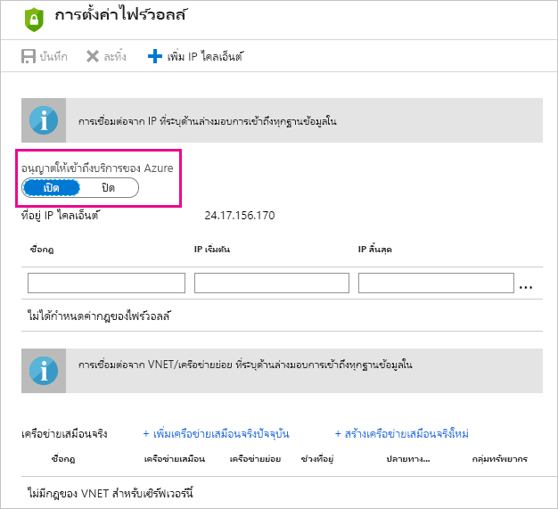

# แก้ไขปัญหาการรีเฟรชตามกำหนดการสำหรับ Azure SQL Database ใน Power BITroubleshooting scheduled refresh for Azure SQL Databases in Power BI

สำหรับข้อมูลโดยละเอียดเกี่ยวกับการรีเฟรช โปรดดูหัวข้อ [รีเฟรชข้อมูลใน Power BI](refresh-data.md) และ [กำหนดค่าการรีเฟรชตามกำหนดเวลา](refresh-scheduled-refresh.md)For detailed information about refresh, see [Refresh data in Power BI](refresh-data.md) and [Configure scheduled refresh](refresh-scheduled-refresh.md).

ขณะที่กำลังตั้งค่าการรีเฟรชตามกำหนดเวลสสำหรับฐานข้อมูล Azure SQL หากคุณได้รับข้อผิดพลาดที่มีรหัสข้อผิดพลาด 400 เมื่อแก้ไขข้อมูลประจำตัว กรุณาลองทำตามขั้นตอนต่อไปนี้เพื่อตั้งค่ากฎไฟร์วอลล์ที่เหมาะสมWhile setting up scheduled refresh for Azure SQL database, if you get an error with error code 400 when editing the credentials, try the following to set up the appropriate firewall rule:

1. ลงชื่อเข้าใช้ไปยัง [พอร์ทัล Azure](https://portal.azure.com)Sign in to the [Azure portal](https://portal.azure.com).

1. ไปยังฐานข้อมูล Azure SQL ที่คุณกำลังกำหนดค่าการรีเฟรชGo to the Azure SQL database for which you're configuring refresh.

1. ที่ด้านบนของแผ่น **ภาพรวม** ให้เลือก **ตั้งค่าไฟร์วอลล์ของเซิร์ฟเวอร์**At the top of the **Overview** blade, select **Set server firewall**.

1. บนแผ่น **การตั้งค่าไฟร์วอลล์** คุณควรตรวจสอบให้แน่ใจว่ามีการตั้งค่า **อนุญาตการเข้าถึงบริการ Azure** เป็น **ON**On the **Firewall settings** blade, make sure that **Allow access to Azure services** is set to **ON**.

      

มีคำถามเพิ่มเติมหรือไม่More questions? [ลองไปที่ชุมชน Power BITry the Power BI Community](https://community.powerbi.com/)
