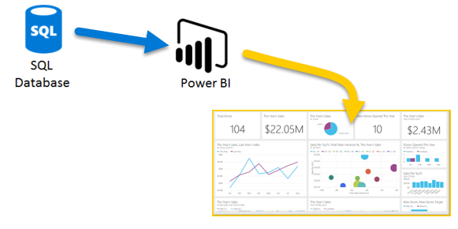
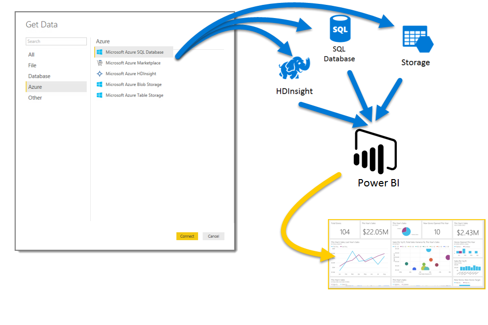

# Azure และ Power BIAzure and Power BI

ด้วยบริการ **Azure** และ **Power BI** คุณสามารถเปิดใช้การประมวลผลข้อมูลของคุณลงในการวิเคราะห์และรายงานที่ให้ข้อมูลเชิงลึกแบบเรียลไทม์ในธุรกิจของคุณได้With **Azure** services and **Power BI**, you can turn your data processing efforts into analytics and reports that provide real-time insights into your business. ไม่ว่าการประมวลข้อมูลจะอยู่ในคลาวด์หรือภายในองค์กร ตรงไปตรงมาหรือซับซ้อน มาจากแหล่งเดียวหรือปรับมาตราส่วนให้กว้างขึ้น จัดเก็บเอาไว้หรือเรียลไทม์ก็ตาม Azure และ Power BI มีภาวะเชื่อมต่อและการหาปริพันธ์ที่อยู่ภายใน เพื่อให้ความพยายามในระบบธุรกิจอัจฉริยะเป็นจริงขึ้นมาได้Whether your data processing is cloud-based or on-premises, straightforward, or complex, single-sourced or massively scaled, warehoused, or real-time, Azure and Power BI have the built-in connectivity and integration to bring your business intelligence efforts to life.

Power BI มีการเชื่อมต่อ Azure ที่พร้อมใช้งานที่หลากหลาย และโซลูชันข่าวกรองทางธุรกิจที่คุณสามารถสร้างได้ด้วยบริการเหล่านั้น จะมีความเป็นเอกลักษณ์เช่นเดียวกับธุรกิจของคุณPower BI has a multitude of Azure connections available, and the business intelligence solutions you can create with those services are as unique as your business. คุณสามารถเชื่อมต่อในปริมานน้อยได้ เช่น หนึ่งแหล่งข้อมูล Azure หรือจำนวนไม่กี่แหล่ง จาก นั้นจัดรูปร่างและปรับปรุงข้อมูลของคุณเพื่อสร้างรายงานแบบกำหนดเองYou can connect as few as one Azure data source, or a handful, then shape and refine your data to build customized reports.

## ฐานข้อมูล Azure SQL และ Power BIAzure SQL Database and Power BI

คุณสามารถเริ่มต้นด้วยการเชื่อมต่อตรงไปยังฐานข้อมูล SQL Azure และสร้างรายงานเพื่อตรวจติดตามความคืบหน้าของธุรกิจของคุณได้You can start with a straightforward connection to an Azure SQL Database, and create reports to monitor the progress of your business. การใช้[Power BI Desktop](../fundamentals/desktop-getting-started.md) คุณสามารถสร้างรายงานที่ระบุแนวโน้มและตัวบ่งชี้ประสิทธิภาพที่สำคัญที่ขับเคลื่อนธุรกิจของคุณให้มุ่งไปข้างหน้าUsing the [Power BI Desktop](../fundamentals/desktop-getting-started.md), you can create reports that  identify trends and key performance indicators that move your business forward.

มีข้อมูลเพิ่มเติมจำนวนมากที่ให้คุณเรียนรู้เกี่ยวกับ[ฐานข้อมูล Azure SQL](https://azure.microsoft.com/services/sql-database/) ได้There's plenty more information for you to learn about [Azure SQL Database](https://azure.microsoft.com/services/sql-database/).

## แปลง ปรับรูปร่าง และผสานข้อมูลในระบบคลาวด์ของคุณTransform, shape, and merge your cloud data

คุณมีข้อมูลที่ซับซ้อนกว่าและมีทุกประเภทของแหล่งที่มาของข้อมูลหรือไม่?Do you have more complex data, and all sorts of sources? ไม่มีปัญหาNo problem. ด้วย **Power BI Desktop** และบริการของ Azure คุณสามารถเชื่อมต่อได้ง่าย ๆ โดยการแตะกล่องโต้ตอบ **รับข้อมูล**With **Power BI Desktop** and Azure services, connections are just a tap of the **Get Data** dialog away. ภายในแบบสอบถามเดียวกัน คุณสามารถเชื่อมต่อ **ฐานข้อมูล SQL Azure** ของคุณ แหล่งข้อมูล **Azure HDInsight** ของคุณ และ **การเก็บข้อมูล Azure Blob** ของคุณได้ (หรือ **ตารางเก็บข้อมูล Azure**) จากนั้นเลือกเฉพาะชุดย่อยภายในแต่ละรายการที่คุณต้องการและปรับปรุงเอกสารจากตรงนั้นWithin the same Query you can connect to your **Azure SQL Database**, your **Azure HDInsight** data source, and your **Azure Blob Storage** (or **Azure Table Storage**), then select only the subsets within each that you need, and refine it from there.

คุณสามารถสร้างรายงานอื่นสำหรับผู้ชมกลุ่มอื่นโดยใช้การเชื่อมต่อข้อมูลเดียวกันและแม้แต่การสอบถามเดียวกันได้เช่นกันYou can create different reports for different audiences too, using the same data connections and even the same Query. เพียงแค่สร้างหน้ารายงานใหม่ ปรับปรุงการแสดงภาพของคุณสำหรับแต่ละผู้ชม และดูการติดตามความก้าวหน้าธุรกิจของคุณJust build a new report page, refine your visualizations for each audience, and watch it keep the business in the know.

สำหรับข้อมูลเพิ่มเติม โปรดดูที่แหล่งทรัพยากรต่อไปนี้:For more information, take a look at the following resources:

* [ฐานข้อมูล Azure SQLAzure SQL Database](https://azure.microsoft.com/services/sql-database/)
* [Azure HDInsight (HDFS)Azure HDInsight](https://azure.microsoft.com/services/hdinsight/)
* [พื้นที่จัดเก็บ Azure](https://azure.microsoft.com/services/storage/) (พื้นที่จัดเก็บ Blob และพื้นที่จัดเก็บตาราง)[Azure Storage](https://azure.microsoft.com/services/storage/) (Blob storage and Table storage)

## รับรายงานที่ซับซ้อน (และทำล่วงหน้า) โดยใช้ Azure Services และ Power BIGet complex (and ahead) using Azure Services and Power BI

คุณสามารถขยายได้มากเท่าที่คุณต้องการสำหรับ Azure และ Power BIYou can expand as much as you need with Azure and Power BI. ควบคุมการประมวลผลข้อมูลหลายแหล่ง ใช้ระบบแบบเรียลไทม์ขนาดใหญ่ ใช้[Stream Analytics](https://azure.microsoft.com/services/stream-analytics/)และ[Event Hubs](https://azure.microsoft.com/services/event-hubs/)และรวมบริการ SaaS ต่าง ๆ ของคุณเข้ากับรายงานข่าวกรองทางธุรกิจที่ให้ข้อมูลทางธุรกิจที่ล้ำสมัยกับคุณHarness multi-source data processing, make use of massive real-time systems, use [Stream Analytics](https://azure.microsoft.com/services/stream-analytics/)and [Event Hubs](https://azure.microsoft.com/services/event-hubs/), and coalesce your varied SaaS services into business intelligence reports that give your business an edge.

## ข้อมูลเชิงลึกในบริบทพร้อมการวิเคราะห์ Power BI EmbeddedContext insights with Power BI Embedded analytics

ฝังการแสดงภาพเชิงโต้ตอบอันน่าทึ่งในแอปพลิเคชัน เว็บไซต์ พอร์ทัล และอื่นๆ เพื่อใช้ประโยชน์จากข้อมูลธุรกิจของคุณEmbed stunning, interactive data visualizations in applications, websites, portals, and more, to take advantage of your business data. ด้วย [Power BI Embedded เป็นแหล่งทรัพยากรใน Azure](https://azure.microsoft.com/services/power-bi-embedded/) คุณจะสามารถฝังรายงานเชิงโต้ตอบและแดชบอร์ดได้อย่างง่ายดาย ดังนั้นผู้ใช้ของคุณจะเพลิดเพลินไปกับการใช้งานข้ามอุปกรณ์ที่สม่ำเสมอและมีความแม่นยำสูงWith [Power BI Embedded as a resource in Azure](https://azure.microsoft.com/services/power-bi-embedded/), you can easily embed interactive reports and dashboards, so your users can enjoy consistent, high-fidelity experiences across devices.  Power BI ที่ใช้กับการฝังการวิเคราะห์นั้นมีไว้เพื่อช่วยในการเดินทางจากข้อมูล -> ความรู้ -> ข้อมูลเชิงลึก -> การดำเนินการPower BI used with embedding analytics is to help you through your journey from Data -> Knowledge -> Insights -> Actions.  ยิ่งไปกว่านั้น คุณสามารถขยายค่าของ Power BI และ Azure ได้โดยการฝังการวิเคราะห์ใน [แอปพลิเคชันและพอร์ทัลภายในขององค์](https://powerbi.microsoft.com/developers/embedded-analytics/organization/)Furthermore, you can extend the value of Power BI and Azure also by embedding analytics in your [organization's internal applications and portals](https://powerbi.microsoft.com/developers/embedded-analytics/organization/).

มีข้อมูลจำนวนมากเกี่ยวกับ Power BI API ใน[พอร์ทัลนักพัฒนา Power BI](https://dev.powerbi.com)There's lots of information about Power BI APIs in the [Power BI Developer Portal](https://dev.powerbi.com).

สำหรับข้อมูลเพิ่มเติมดู [Power BI Embedded อะไรใน Azure](../developer/embedded/azure-pbie-what-is-power-bi-embedded.md)For more information, see [What is Power BI Embedded in Azure?](../developer/embedded/azure-pbie-what-is-power-bi-embedded.md).

## ฝังข้อมูล Power BI ของคุณไว้ภายในแอปEmbed your Power BI data within your app

ฝังการแสดงภาพเชิงโต้ตอบอันน่าทึ่งในแอปพลิเคชัน เว็บไซต์ พอร์ทัล และอื่นๆ เพื่อแสดงข้อมูลธุรกิจของคุณในบริบทEmbed stunning, interactive data visualizations in applications, websites, portals, and more, to showcase your business data in context. ด้วยการใช้ [Power BI Embedded ใน Azure](https://azure.microsoft.com/services/power-bi-embedded/) คุณสามารถฝังรายงานเชิงโต้ตอบและแดชบอร์ดได้อย่างง่ายดาย เพื่อให้ผู้ใช้ของคุณเพลิดเพลินไปกับการใช้งานข้ามอุปกรณ์ที่สม่ำเสมอและมีความแม่นยำสูงUsing [Power BI Embedded in Azure](https://azure.microsoft.com/services/power-bi-embedded/), you can easily embed interactive reports and dashboards, so your users can enjoy consistent, high-fidelity experiences across devices.

## คุณสามารถทำอะไรได้บ้างกับ Azure และ Power BI?What could you do with Azure and Power BI?

มีหลากหลายสถานการณ์มากทีี่เราสามารถใช้งาน **Azure** ร่วมกับ **Power BI** ได้ ความเป็นไปได้และโอกาสต่าง ๆ จะมีความเป็นเอกลักษณ์เฉกเช่นธุรกิจของคุณThere are all sorts of scenarios where **Azure** and **Power BI** can be combined - the possibilities and opportunities are as unique as your business. สำหรับข้อมูลเพิ่มเติมเกี่ยวกับ **บริการ Azure** สามารถดูได้ที่ [เพจภาพรวม](/azure/machine-learning/team-data-science-process/plan-your-environment)ซึ่งอธิบายเกี่ยวกับ **สถานการณ์สมมติการวิเคราะห์ข้อมูลโดยใช้ Azure** และเรียนรู้วิธีการเปลี่ยนแปลงแหล่งข้อมูลเป็นข่าวกรองที่ขับเคลื่อนธุรกิจของคุณให้ก้าวไปข้างหน้าFor more information about **Azure services**, check out this [overview page](/azure/machine-learning/team-data-science-process/plan-your-environment), which describes **Data Analytics Scenarios using Azure**, and learn how to transform your data sources into intelligence that drives your business ahead.