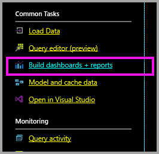
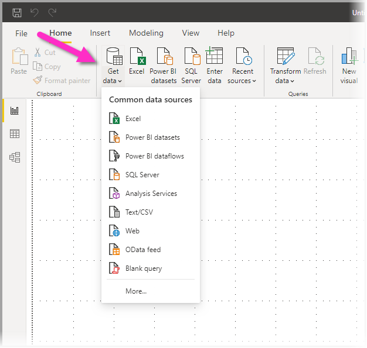
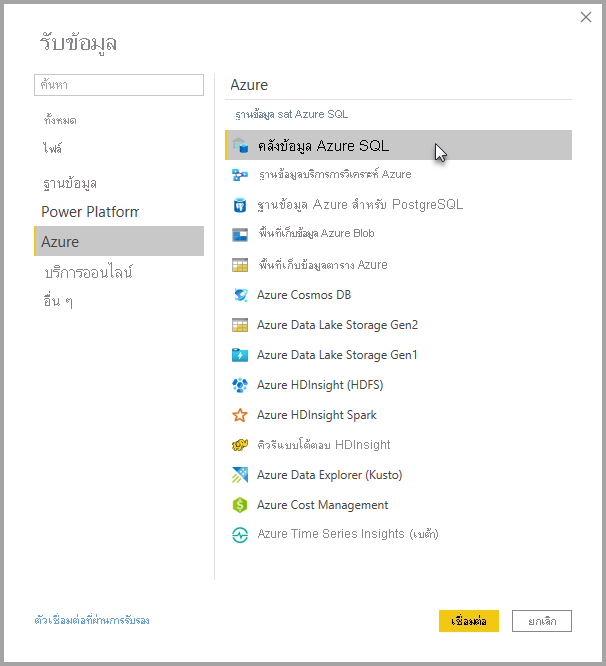
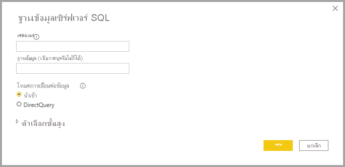
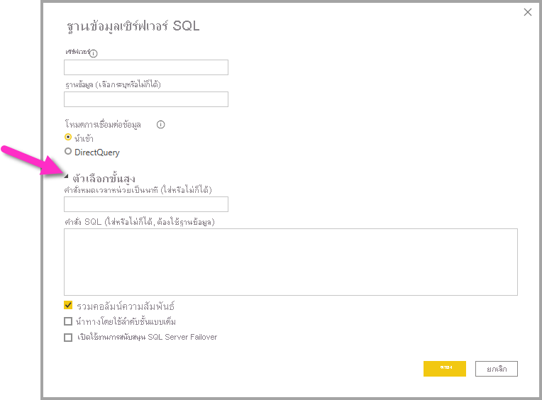

# Azure SQL Data Warehouse พร้อม DirectQueryAzure SQL Data Warehouse with DirectQuery

Azure SQL Data Warehouse พร้อม DirectQuery ช่วยให้คุณสามารถสร้างรายงานแบบไดนามิกที่ยึดตามข้อมูลและเมทริกซ์ที่คุณมีอยู่แล้วใน Azure SQL Data WarehouseAzure SQL Data Warehouse with DirectQuery allows you to create dynamic reports based on data and metrics you already have in Azure SQL Data Warehouse. ด้วย DirectQuery แบบสอบถามจะถูกส่งกลับไปยัง Azure SQL Data Warehouse ของคุณในแบบเรียลไทม์ ตามที่คุณสำรวจข้อมูลWith DirectQuery, queries are sent back to your Azure SQL Data Warehouse in real time as you explore the data. โดยแบบสอบถามแบบเรียลไทม์นั้นมีการรวมเข้ากับ SQL Data Warehouse ส่วนหนึ่ง เพื่อให้ผู้ใช้งานสามารถสร้างรายงานแบบไดนามิกได้ในเวลาเพียงไม่นาน แม้จะมีข้อมูลเยอะระดับเทราไบต์Real-time queries, combined with the scale of SQL Data Warehouse enables users to create dynamic reports in minutes against terabytes of data. นอกจากนี้ ลิงก์ **สร้างแดชบอร์ด + รายงาน** ช่วยให้ผู้ใช้สามารถสร้างรายงาน Power BI โดยใช้ SQL Data Warehouse ของพวกเขาIn addition, the **Build dashboards + reports** link allows users to create Power BI reports using their SQL Data Warehouse.

เมื่อใช้ตัวเชื่อมต่อ SQL Data Warehouse:When using the SQL Data Warehouse connector:

* ระบุชื่อเซิร์ฟเวอร์ที่มีคุณสมบัติครบถ้วนเมื่อเชื่อมต่อ (ดูด้านล่างสำหรับรายละเอียด)Specify the fully qualified server name when connecting (see below for details)
* ตรวจสอบให้แน่ใจว่ามีการกำหนดค่ากฎไฟร์วอลล์สำหรับเซิร์ฟเวอร์เพื่อ "อนุญาตการเข้าถึงบริการ Azure"Ensure firewall rules for the server are configured to "Allow access to Azure services"
* ทุกการดำเนินการ เช่น การเลือกคอลัมน์ หรือเพิ่มตัวกรองจะสอบถามคลังข้อมูลโดยตรงEvery action such as selecting a column or adding a filter will directly query the data warehouse
* ไทล์จะถูกตั้งค่าการรีเฟรชทุก 15 นาทีโดยประมาณ และรีเฟรชไม่จำเป็นต้องมีการทำกำหนดการTiles are set to refresh approximately every 15 minutes and refresh does not need to be scheduled.  ซึ่งคุณอาจปรับการรีเฟรชในส่วนการตั้งค่าขั้นสูงได้เมื่อทำการเชื่อมต่อRefresh can be adjusted in the Advanced settings when you connect.
* การถามตอบสำหรับชุดข้อมูล DirectQuery ไม่พร้อมใช้งานQ&A isn't available for DirectQuery datasets
* ไม่มีการเลือกการเปลี่ยนแปลง Schema โดยอัตโนมัติSchema changes aren't picked up automatically

ข้อจำกัดและบันทึกย่อเหล่านี้อาจเปลี่ยนแปลงขณะที่เราปรับปรุงประสบการณ์การใช้งานขึ้นเรื่อย ๆThese restrictions and notes may change as we continue to improve the experience. ขั้นตอนในการเชื่อมต่อจะมีรายละเอียดดังด้านล่างThe steps to connect are detailed below.

## สร้างแดชบอร์ดและรายงานใน Power BIBuild dashboards and reports in Power BI

> [!Important]
> เรากำลังปรับปรุงการเชื่อมต่อของเรากับคลังข้อมูล SQL ของ AzureWe have been improving our connectivity to Azure SQL Data Warehouse. สำหรับประสบการณ์ดีที่สุดในการเชื่อมต่อกับแหล่งคลังข้อมูล SQL ของ Azure ของคุณ ใช้ Power BI DesktopFor the best experience to connect to your Azure SQL Data Warehouse data source, use Power BI Desktop. เมื่อคุณได้สร้างรูปแบบข้อมูลและรายงานของคุณแล้ว คุณสามารถเผยแพร่สิ่งดังกล่าวไปยังบริการ Power BIOnce you've built your model and report, you can publish it to the Power BI service. ตัวเชื่อมต่อโดยตรงที่มีอยู่ก่อนหน้านี้สำหรับ Azure SQL Data Warehouse ในบริการ Power BI ในขณะนี้ไม่สามารถใช้ได้อีกต่อไปThe previously available direct connector for Azure SQL Data Warehouse in the Power BI service is no longer available.

การเคลื่อนย้ายข้อมูลระหว่าง SQL Data Warehouse กับ Power BI คือการสร้างรายงานใน Power BI DesktopThe easiest way to move between your SQL Data Warehouse and Power BI is to create reports in Power BI Desktop. คุณสามารถใช้ปุ่ม **สร้างแดชบอร์ด + รายงาน** ภายในพอร์ทัล AzureYou can use the **Build dashboards + reports** button within the Azure portal.

1. ในการเริ่มต้น ให้ดาวน์โหลดและติดตั้ง Power BI DesktopTo get started, download and install Power BI Desktop. ดูบทความ [รับ Power BI Desktop](../fundamentals/desktop-get-the-desktop.md) สำหรับข้อมูลเกี่ยวกับการดาวน์โหลดและติดตั้ง หรือไปยังขั้นตอนถัดไปโดยตรงSee the [get Power BI Desktop](../fundamentals/desktop-get-the-desktop.md) article for information about downloading and installing, or go directly to the next step.

2. คุณยังสามารถคลิกลิงก์ **สร้างแดชบอร์ด + รายงาน** เพื่อดาวน์โหลด Power BI Desktop ได้อีกด้วยYou can also click the **Build dashboards + reports** link to download Power BI Desktop.

    

## เชื่อมต่อผ่านทาง Power BI DesktopConnecting through Power BI Desktop

คุณสามารถเชื่อมต่อกับ SQL Data Warehouse ได้โดยใช้ปุ่ม **รับข้อมูล** ใน Power BI DesktopYou can connect to a SQL Data Warehouse using the **Get Data** button in Power BI Desktop. 

1. เลือกปุ่ม **รับข้อมูล** จากเมนู **หน้าหลัก**Select the **Get Data** button from the **Home** menu.  

    

2. เลือก **เพิ่มเติม ...** เพื่อดูแหล่งข้อมูลทั้งหมดที่มีอยู่Select **More...** to see all available data sources. จากหน้าต่างที่ปรากฏขึ้น ให้เลือก **Azure** จากบานหน้าต่างด้านซ้ายจากนั้นเลือก **Azure SQL Data Warehouse** จากรายการของตัวเชื่อมต่อที่พร้อมใช้งานในบานหน้าต่างด้านขวาFrom the window that appears, select **Azure** from the left pane, then select **Azure SQL Data Warehouse** from the list of available connectors in the right pane.

    

3. ในหน้าต่างที่ปรากฏขึ้น ให้ใส่เซิร์ฟเวอร์ของคุณและเลือกระบุฐานข้อมูลที่คุณต้องการเชื่อมต่อIn the window that appears, input your Server and optionally state the Database to which you want to connect. คุณยังสามารถเลือกโหมดการเชื่อมต่อข้อมูลของคุณ: Import หรือ DirectQueryYou can also select your data connectivity mode: Import or DirectQuery. สำหรับการเข้าถึงข้อมูลแบบเรียลไทม์ใน Azure SQL Data Warehouse ของคุณ ให้ใช้ DirectQueryFor real-time access to information in your Azure SQL Data Warehouse, use DirectQuery.

    

4. สำหรับตัวเลือกขั้นสูงสำหรับการเชื่อมต่อ Azure SQL Data Warehouse ให้เลือกลูกศรลงที่อยู่ด้านช้าง **ตัวเลือกขั้นสูง** เพื่อแสดงตัวเลือกเพิ่มเติมสำหรับการเชื่อมต่อของคุณFor advanced options for the Azure SQL Data Warehouse connection, select the down arrow beside **Advanced options** to display additional options for your connection.

    

ส่วนถัดไปจะอธิบายวิธีการค้นหาค่าพารามิเตอร์สำหรับการเชื่อมต่อของคุณThe next section describes how to find parameter values for your connection. 

## ค้นหาค่าพารามิเตอร์Finding Parameter Values

สามารถค้นหาชื่อเซิร์ฟเวอร์และชื่อฐานข้อมูลแบบเต็มของคุณได้ในพอร์ทัล Microsoft AzureYour fully qualified server name and database name can be found in the Azure portal. โปรดสังเกตว่ามีเฉพาะ SQL Data Warehouse เท่านั้นที่ปรากฏในพอร์ทัล Azure ในขณะนี้Note that SQL Data Warehouse only has a presence in the Azure portal at this time.

> [!NOTE]
> ถ้าผู้เช่า Power BI ของคุณอยู่ในภูมิภาคเดียวกันกับ Azure SQL Data Warehouse จะไม่มีค่าธรรมเนียมขาออกIf your Power BI tenant is in the same region as the Azure SQL Data Warehouse there will be no egress charges. คุณสามารถค้นหาตำแหน่งที่ผู้เช่า Power BI ของคุณอยู่โดยใช้[คำแนะนำเหล่านี้](../admin/service-admin-where-is-my-tenant-located.md)ได้You can find where your Power BI tenant is located using [these instructions](../admin/service-admin-where-is-my-tenant-located.md).

[!INCLUDE [direct-query-sso](../includes/direct-query-sso.md)]

## ขั้นตอนถัดไปNext steps

* [เกี่ยวกับการใช้ DirectQuery ใน Power BIAbout using DirectQuery in Power BI](desktop-directquery-about.md)
* [Power BI คืออะไรWhat is Power BI?](../fundamentals/power-bi-overview.md)  
* [รับข้อมูลสำหรับ Power BIGet Data for Power BI](service-get-data.md)  
* [คลังข้อมูล Azure SQLAzure SQL Data Warehouse](/azure/sql-data-warehouse/sql-data-warehouse-overview-what-is/)

มีคำถามเพิ่มเติมหรือไม่More questions? [ลองไปที่ชุมชน Power BITry the Power BI Community](https://community.powerbi.com/)