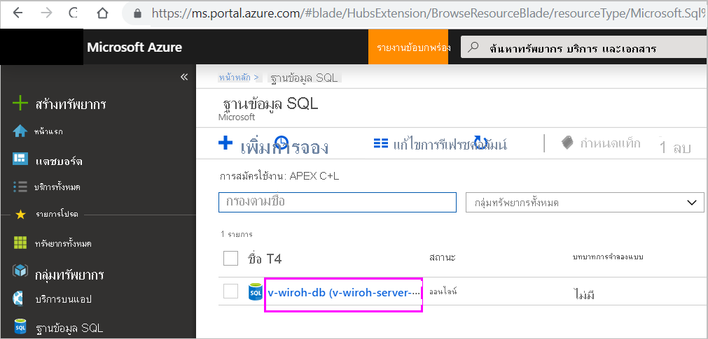
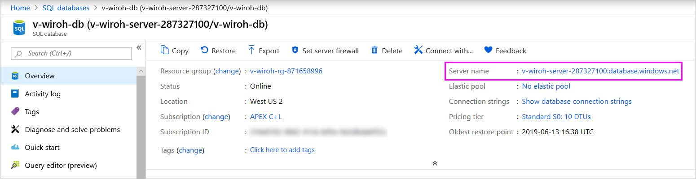

# Azure SQL Database พร้อม DirectQueryAzure SQL Database with DirectQuery

เรียนรู้วิธีการเชื่อมต่อโดยตรงไปยังฐานข้อมูล SQL Azure และสร้างรายงานที่ใช้ข้อมูลสดLearn how you can connect directly to Azure SQL Database and create reports that use live data. คุณสามารถเก็บข้อมูลของคุณที่แหล่งข้อมูลได้ แต่ไม่ใช่ใน Power BIYou can keep your data at the source and not in Power BI.

ด้วย DirectQuery แบบสอบถามจะถูกส่งกลับไปยังฐานข้อมูล SQL Azure ของคุณตามที่คุณสำรวจข้อมูลในมุมมองรายงานWith DirectQuery, queries are sent back to your Azure SQL Database as you explore the data in the report view. ประสบการณ์การใช้งานนี้แนะนำสำหรับผู้ใช้ที่คุ้นเคยกับฐานข้อมูลและเอนทิตีที่ผู้ใช้งานดังกล่าวเชื่อมต่อด้วยThis experience is suggested for users who are familiar with the databases and entities they connect to.

> [!Important]
> คำอธิบายนี้อนุมานว่าฐานข้อมูล Azure SQL ไม่ได้อยู่หลัง VNET หรือเปิดใช้งานจุดเชื่อมโยงส่วนตัวThis description assumes that Azure SQL database is not behind a VNET or has private link endpoint enabled.

**หมายเหตุ:****Notes:**

* ระบุชื่อเซิร์ฟเวอร์ที่มีคุณสมบัติครบถ้วนเมื่อเชื่อมต่อ (ดูด้านล่างสำหรับรายละเอียดเพิ่มเติม)Specify the fully qualified server name when connecting (see below for more details).
* ตรวจสอบให้แน่ใจว่ามีการกำหนดค่ากฎไฟร์วอลล์สำหรับฐานข้อมูลเพื่อ "[อนุญาตการเข้าถึงบริการ Azure](/azure/sql-database/sql-database-networkaccess-overview#allow-azure-services)"Ensure firewall rules for the database are configured to "[Allow access to Azure services](/azure/sql-database/sql-database-networkaccess-overview#allow-azure-services)."
* ทุกการดำเนินการ เช่น การเลือกคอลัมน์หรือการเพิ่มตัวกรอง จะส่งการสอบถามย้อนกลับไปยังฐานข้อมูลEvery action such as selecting a column or adding a filter will send a query back to the database.
* ไทล์จะรีเฟรชทุกชั่วโมง (รีเฟรชไม่จำเป็นต้องมีการจัดกำหนดการ)Tiles are refreshed every hour (refresh does not need to be scheduled). คุณสามารถปรับความถี่การรีเฟรชในส่วนการตั้งค่าขั้นสูงเมื่อทำการเชื่อมต่อYou can adjust how often to refresh in the Advanced settings when you connect.
* การถามตอบไม่พร้อมใช้งานสำหรับชุดข้อมูล DirectQueryQ&A is not available for DirectQuery datasets.
* การเปลี่ยนแปลงเค้าร่างจะไม่ถูกเลือกโดยอัตโนมัติSchema changes are not picked up automatically.

ข้อจำกัดและบันทึกย่อเหล่านี้อาจเปลี่ยนแปลงขณะที่เราปรับปรุงประสบการณ์การใช้งานขึ้นเรื่อย ๆThese restrictions and notes may change as we continue to improve the experiences. ขั้นตอนในการเชื่อมต่อจะมีรายละเอียดดังด้านล่างThe steps to connect are detailed below.

> [!Important]
> เรากำลังปรับปรุงการเชื่อมต่อของเรากับฐานข้อมูล SQL ของ AzureWe have been improving our connectivity to Azure SQL Database.  ใช้ Power BI Desktop เชื่อมต่อกับแหล่งฐานข้อมูล SQL ของ AzureFor the best experience to connect to your Azure SQL Database data source, use Power BI Desktop.  เมื่อคุณได้สร้างรูปแบบข้อมูลและรายงานของคุณแล้ว คุณสามารถเผยแพร่สิ่งดังกล่าวไปยังบริการ Power BIOnce you've built your model and report, you can publish it to the Power BI service.  ตัวเชื่อมต่อโดยตรงกับฐานข้อมูล SQL ของ Azure ในบริการ Power BI ในขณะนี้ไม่ได้รับการสนับสนุนThe direct connector for Azure SQL Database in the Power BI service is now deprecated.

## ใช้ DirectQuery ใน Power BI DesktopPower BI Desktop and DirectQuery

เมื่อต้องการเชื่อมต่อกับฐานข้อมูล SQL Azure ที่ใช้ DirectQuery คุณจะต้องใช้ Power BI DesktopTo connect to Azure SQL Database using DirectQuery, you must use Power BI Desktop. แนวทางนี้เพิ่มความยืดหยุ่นและขีดความสามารถให้มากขึ้นThis approach provides additional flexibility and capabilities. รายงานที่สร้างขึ้นโดยใช้ Power BI Desktop จะสามารถเผยแพร่ไปยังบริการ Power BI ได้Reports created using Power BI Desktop can then be published to the Power BI service. คุณสามารถเรียนรู้เพิ่มเติมเกี่ยวกับวิธีการเชื่อมต่อ[ฐานข้อมูล SQL Azure ที่ใช้ DirectQuery](desktop-use-directquery.md)ภายใน Power BI Desktop ได้You can learn more about how to connect to [Azure SQL Database using DirectQuery](desktop-use-directquery.md) within Power BI Desktop.

## ค้นหาค่าพารามิเตอร์ต่างๆFind parameter values

คุณสามารถค้นหาชื่อเซิร์ฟเวอร์และชื่อฐานข้อมูลแบบเต็มได้ในพอร์ทัล AzureYou can find your fully qualified server name and database name in the Azure portal.

[!INCLUDE [direct-query-sso](../includes/direct-query-sso.md)]

## ขั้นตอนถัดไปNext steps

* [ใช้ DirectQuery ใน Power BI DesktopUse DirectQuery in Power BI Desktop](desktop-use-directquery.md)  
* [Power BI คืออะไรWhat is Power BI?](../fundamentals/power-bi-overview.md)  
* [รับข้อมูลสำหรับ Power BIGet data for Power BI](service-get-data.md)  

มีคำถามเพิ่มเติมหรือไม่More questions? [ลองไปที่ชุมชน Power BITry the Power BI community](https://community.powerbi.com/)