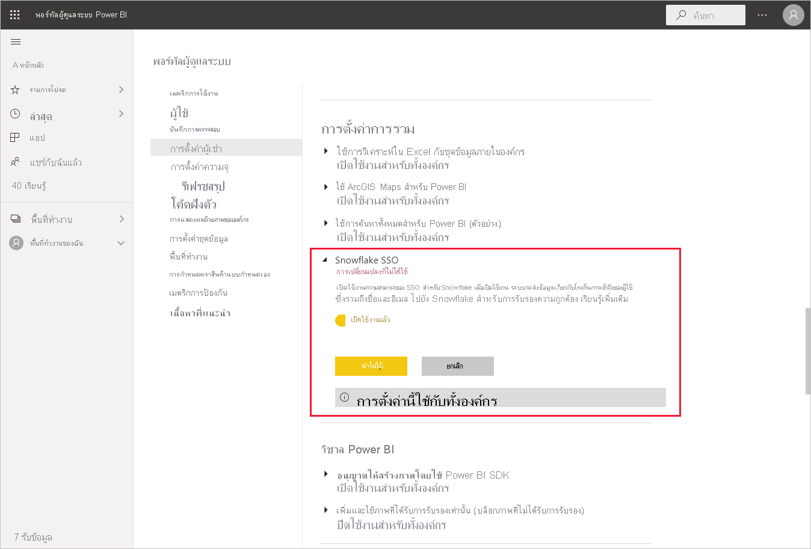
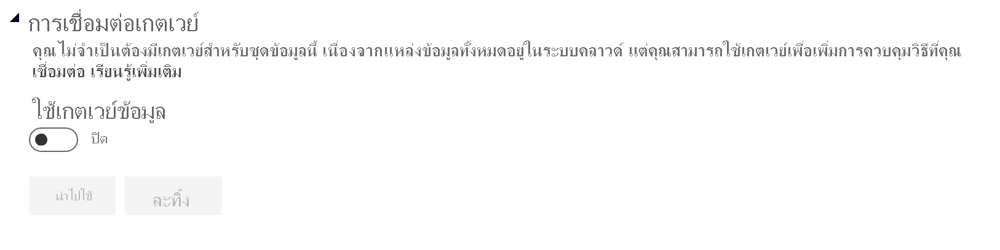
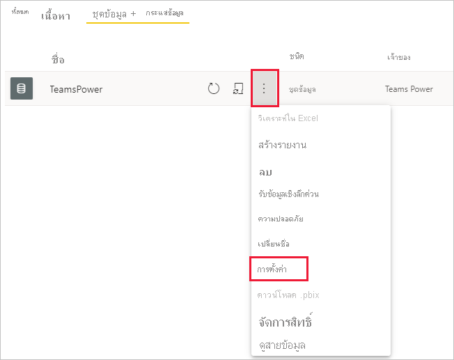
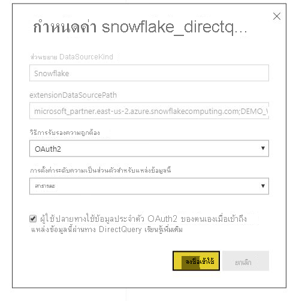

# เชื่อมต่อกับ Snowflake ในบริการของ Power BIConnect to Snowflake in Power BI Service

## บทนำIntroduction

การเชื่อมต่อกับ Snowflake ในบริการของ Power BI มีความแตกต่างจากตัวเชื่อมต่ออื่นๆ เพียงหนึ่งประการConnecting to Snowflake in the Power BI service  differs from other connectors in only one way. Snowflake มีความสามารถเพิ่มเติมสำหรับ Azure Active Directory (AAD) ด้วยตัวเลือกสำหรับ SSOSnowflake has an additional capability for Azure Active Directory (AAD), with an option for SSO. ส่วนต่างๆ ของการรวมต้องมีบทบาทการดูแลที่แตกต่างกันใน Snowflake Power BI และ AzureParts of the integration require different administrative roles across Snowflake, Power BI, and Azure. คุณยังสามารถเลือกเปิดใช้งานการรับรองความถูกต้อง AAD โดยไม่ต้องใช้ SSO ได้You can also choose to enable AAD authentication without using SSO. การรับรองความถูกต้องเบื้องต้นทำงานคล้ายกับตัวเชื่อมต่ออื่น ๆ ในบริการBasic authentication works similarly to other connectors in the service.

ในการกำหนดค่าการรวม AAD และเลือกเปิดใช้งาน SSO ให้ทำตามขั้นตอนในบทความนี้:To configure AAD integration and optionally enable SSO, follow the steps in this article:

* ถ้าคุณเป็นผู้ดูแลระบบ Snowflake โปรดอ่านบทความ [Power BI SSO ถึง Snowflake - เริ่มต้นใช้งาน](https://docs.snowflake.com/en/user-guide/oauth-powerbi.html) ในเอกสารคู่มือ SnowflakeIf you're the Snowflake admin, read the [Power BI SSO to Snowflake - Getting Started](https://docs.snowflake.com/en/user-guide/oauth-powerbi.html) article in the Snowflake documentation.
* ถ้าคุณเป็นผู้ดูแลระบบ Power BI ให้อ้างอิง [การกำหนดค่าบริการของ Power BI - พอร์ทัลผู้ดูแลระบบ](service-connect-snowflake.md#admin-portal) เพื่อเรียนรู้วิธีการเปิดใช้งาน SSOIf you're a Power BI admin, reference [Power BI Service configuration - Admin Portal](service-connect-snowflake.md#admin-portal) to learn how to enable SSO.
* ถ้าคุณเป็นผู้สร้างชุดข้อมูล Power BI ให้อ้างอิง [การกำหนดค่าบริการของ Power BI - การกำหนดค่าชุดข้อมูลด้วย AAD](service-connect-snowflake.md#configuring-a-dataset-with-aad) เพื่อเรียนรู้วิธีการเปิดใช้งาน SSOIf you're a Power BI dataset creator, reference [Power BI Service configuration - Configuring a dataset with AAD](service-connect-snowflake.md#configuring-a-dataset-with-aad) to learn how to enable SSO.

## การกำหนดค่าบริการ Power BIPower BI Service configuration

### พอร์ทัลผู้ดูแลระบบAdmin portal

เมื่อต้องการเปิดใช้งาน SSO ผู้ดูแลระบบส่วนกลางจะต้องเปิดการตั้งค่าในพอร์ทัลผู้ดูแลระบบ Power BITo enable SSO, a global admin has to turn on the setting in the Power BI Admin portal. การตั้งค่านี้จะอนุมัติการส่งข้อมูลประจำตัว AAD ไปยัง Snowflake สำหรับการรับรองความถูกต้องสำหรับทั้งองค์กรThis setting approves sending AAD credentials to Snowflake for authentication for the entire organization. ทำตามขั้นตอนเหล่านี้เพื่อเปิดใช้งาน SSO:Follow these steps to enable SSO:

1. [ลงชื่อเข้าใช้ Power BI](https://app.powerbi.com) โดยใช้ข้อมูลประจำตัวของผู้ดูแลระบบส่วนกลาง[Sign in to Power BI](https://app.powerbi.com) using global admin credentials.
1. เลือก **การตั้งค่า** จากเมนูส่วนหัวของหน้า จากนั้นเลือก **พอร์ทัลผู้ดูแลระบบ**Select **Settings** from the page header menu, then select **Admin portal**.
1. เลือก **การตั้งค่าผู้เช่า** จากนั้นเลื่อนเพื่อค้นหา **การตั้งค่าการรวม**Select **Tenant settings**, then scroll to locate **Integration settings**.

   

4. ขยาย **Snowflake SSO** สลับการตั้งค่าเป็น **เปิดใช้งาน** จากนั้นเลือก **นำไปใช้**Expand **Snowflake SSO**, toggle the setting to **Enabled**, then select **Apply**.

ขั้นตอนนี้จะต้องยินยอมให้ส่งโทเค็น AAD ของคุณไปยังเซิร์ฟเวอร์ SnowflakeThis step is required to consent to sending your AAD token to the  Snowflake  servers. หลังจากที่คุณเปิดใช้งานการตั้งค่า อาจใช้เวลาถึงหนึ่งชั่วโมงจึงจะมีผลการใช้งานAfter you enable the setting, it may take up to an hour for it to take effect.

หลังจากที่มีการเปิดใช้งาน SSO คุณสามารถใช้รายงานกับ SSO ได้After SSO is enabled you can use reports with SSO.

### การกำหนดค่าชุดข้อมูลที่มี AADConfiguring a Dataset with AAD

หลังจากที่มีการเผยแพร่รายงานที่อิงตามตัวเชื่อมต่อ Snowflake ไปยังบริการของ Power BI ผู้สร้างชุดข้อมูลต้องอัปเดตตั้งค่าสำหรับพื้นที่ทำงานที่เหมาะสมเพื่อให้สามารถใช้ SSO ได้After a report that is based on the Snowflake connector is published to the Power BI service, the dataset creator has to update settings for the appropriate workspace so that it will use SSO.

เนื่องด้วยวิธีการทำงานของ Power BI นั้น SSO จะทำงานเฉพาะเมื่อไม่มีการเรียกใช้แหล่งข้อมูลผ่านเกตเวย์ข้อมูลภายในองค์กรBecause of the way that Power BI works, SSO will only work when no data sources are run through the on-premises data gateway. ข้อจำกัดแสดงดังรายการด้านล่าง:Limitations are listed below:

* หากคุณกำลังใช้เฉพาะแหล่งข้อมูล Snowflake ในแบบจำลองข้อมูลของคุณ คุณสามารถใช้ SSO ได้ถ้าคุณเลือกที่จะไม่ใช้เกตเวย์ข้อมูลภายในองค์กรIf you're using only a Snowflake source in your data model, then you can use SSO if you choose not to use the on-premises data gateway.
* หากคุณกำลังใช้แหล่งข้อมูล Snowflake กับแหล่งข้อมูลอื่น คุณสามารถใช้ SSO ได้หากไม่มีแหล่งข้อมูลใดที่ใช้เกตเวย์ข้อมูลภายในองค์กรIf you're using a Snowflake source and another source, then you can use SSO if none of the sources use the on-premises data gateway.
* หากคุณกำลังใช้แหล่งข้อมูล Snowflake ผ่านเกตเวย์ข้อมูลภายในองค์กร โปรดทราบว่าข้อมูลประจำตัว AAD ยังไม่รองรับในขณะนี้If you're using a Snowflake source through the on-premises data gateway, AAD credentials aren't currently supported. การพิจารณานี้อาจมีความเกี่ยวข้องในกรณีที่คุณกำลังพยายามเข้าถึง VNet จาก IP เดียวกับเกตเวย์ที่ติดตั้งอยู่ในนั้น แทนที่จะเป็นจากช่วง IP ทั้งหมดของ Power BIThis consideration might be relevant in case you're trying to access a VNet from a single IP with the gateway installed on it, rather than from the entire Power BI IP range.
* หากคุณกำลังใช้แหล่งข้อมูล Snowflake และแหล่งข้อมูลอื่นที่ต้องการใช้เกตเวย์ คุณจะต้องใช้ Snowflake ผ่านเกตเวย์ข้อมูลภายในองค์กรเช่นกันIf you're using a Snowflake source and another source that requires a gateway, you need to use Snowflake through the on-premises data gateway as well. คุณจะไม่สามารถใช้ SSO ในกรณีนี้ได้You won't be able to use SSO in this case.

เรียนรู้เพิ่มเติมเกี่ยวกับวิธีการใช้เกตเวย์ข้อมูลภายในองค์กรใน [เกตเวย์ข้อมูลภายในองค์กรคืออะไร](service-gateway-onprem.md)Learn more about how to use the on-premises data gateway, in [What is an on-premises data gateway?](service-gateway-onprem.md)

หากคุณไม่ได้ใช้เกตเวย์นั้น คุณพร้อมใช้งานแล้วIf you aren't using the gateway, you're all set. เมื่อคุณมีการกำหนดค่าข้อมูลประจำตัว Snowflake บนเกตเวย์ข้อมูลภายในองค์กรของคุณแล้ว แต่คุณใช้เฉพาะแหล่งข้อมูลนั้นในแบบจำลองของคุณ คุณสามารถคลิกปุ่มสลับบนหน้าการตั้งค่าชุดข้อมูล เพื่อปิดเกตเวย์สำหรับแบบจำลองข้อมูลนั้นได้When you have Snowflake credentials configured on your on-premises data gateway, but are only using that data source in your model, you can click the toggle on the Dataset settings page to turn off the gateway for that data model.

เมื่อต้องการเปิดใช้งาน SSO สำหรับชุดข้อมูล ให้ทำตามขั้นตอนเหล่านี้:To turn on SSO for a dataset, follow these steps:

1. [ลงชื่อเข้าใช้ Power BI](https://app.powerbi.com) โดยใช้ข้อมูลประจำตัวของผู้สร้างชุดข้อมูล[Sign in to Power BI](https://app.powerbi.com) using dataset creator credentials.
1. เลือกพื้นที่ทำงานที่เหมาะสม จากนั้นเลือก **การตั้งค่า** จากเมนูตัวเลือกเพิ่มเติมที่อยู่ถัดจากชื่อชุดข้อมูลSelect the appropriate workspace, then choose **Settings** from the more options menu that's located next to the dataset name.
  
1. เลือก **ข้อมูลประจำตัวของแหล่งข้อมูล** และลงชื่อเข้าใช้Select **Data source credentials** and sign in. คุณสามารถลงชื่อเข้าใช้ชุดข้อมูลไปยัง Snowflake ได้ด้วยข้อมูลประจำตัวพื้นฐานหรือข้อมูลประจำตัว OAuth2 (AAD)The dataset can be signed into Snowflake with Basic or OAuth2 (AAD) credentials. ถ้าคุณใช้ AAD คุณสามารถเปิดใช้งาน SSO ในขั้นตอนถัดไปif you use AAD, you can enable SSO in the next step.
1. เลือกตัวเลือก **ผู้ใช้ใช้ข้อมูลประจำตัว OAuth2 ของตนเองเมื่อเข้าถึงแหล่งข้อมูลนี้ผ่านทาง DirectQuery**Select the option **End users use their own OAuth2 credentials when accessing this data source via DirectQuery**. การตั้งค่านี้จะเป็นการเปิดใช้งาน AAD SSOThis setting will enable AAD SSO. ไม่ว่าผู้ใช้เริ่มต้นจะลงชื่อเข้าใช้ด้วยการรับรองความถูกต้องเบื้องต้นหรือ OAuth2 (AAD) ข้อมูลประจำตัวของ AAD ก็คือสิ่งที่จะถูกส่งไปยัง SSOWhether the first user signs in with Basic authentication or OAuth2 (AAD), the AAD credentials are what will be sent for SSO.

    

เมื่อเสร็จสิ้นขั้นตอนดังกล่าวแล้ว ผู้ใช้ควรใช้การรับรองความถูกต้อง AAD ของตนโดยอัตโนมัติเพื่อเชื่อมต่อกับข้อมูลจากชุดข้อมูลของ Snowflake นั้นAfter these steps are done, users should automatically use their AAD authentication to connect to data from that Snowflake dataset.

ถ้าคุณเลือกที่จะไม่เปิดใช้งาน SSO จากนั้นผู้ใช้จะรีเฟรชรายงานจะใช้ข้อมูลประจำตัวของผู้ใช้ที่เข้าสู่ระบบ เช่น รายงาน Power BI อื่นๆ ส่วนใหญ่If you choose not to enable SSO, then users refreshing the report will use the credentials of the user who signed in, like most other Power BI reports.

### การแก้ไขปัญหาTroubleshooting

หากพบปัญหาใดก็ตามเกี่ยวกับการรวม โปรดอ้างอิง [คู่มือการแก้ไขปัญหา](https://docs.snowflake.com/en/user-guide/oauth-powerbi.html#troubleshooting) ของ SnowflakeIf you run into any issues with the integration, refer to the Snowflake [troubleshooting guide](https://docs.snowflake.com/en/user-guide/oauth-powerbi.html#troubleshooting).

## ขั้นตอนถัดไปNext steps

* [แหล่งข้อมูลสำหรับบริการ Power BIData sources for the Power BI service](service-get-data.md)
* [เชื่อมต่อกับชุดข้อมูลในบริการของ Power BI จาก Power BI DesktopConnect to datasets in the Power BI service from Power BI desktop](desktop-report-lifecycle-datasets.md)
* [เชื่อมต่อกับ Snowflake Computing WarehouseConnect to a Snowflake computing warehouse](desktop-connect-snowflake.md)