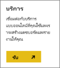
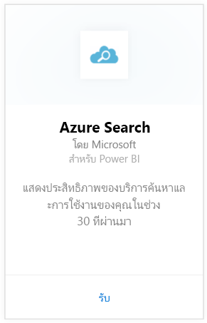
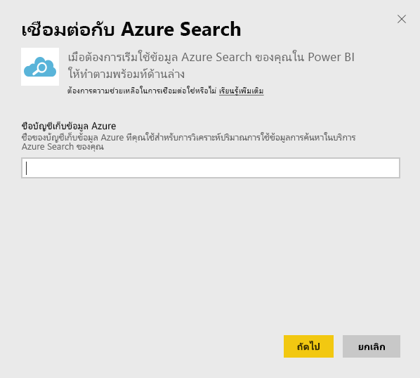
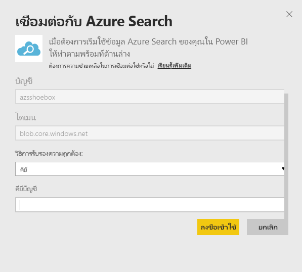
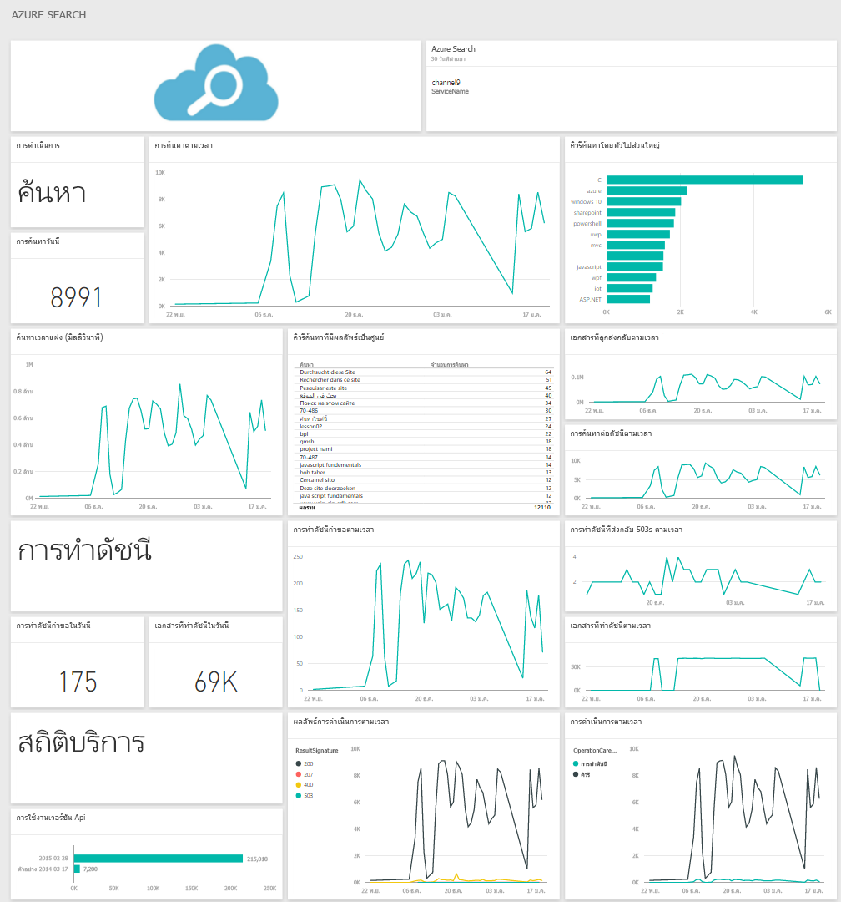

# เชื่อมต่อกับ Azure Search ด้วย Power BIConnect to Azure Search with Power BI
การวิเคราะห์การรับส่งข้อมูล Azure Search (Azure Search Traffic Analytics) ช่วยให้คุณสามารถตรวจติดตามและทำความเข้าใจเกี่ยวกับการรับส่งข้อมูลไปยังบริการค้นหา Azure ของคุณAzure Search Traffic Analytics allows you to monitor and understand the traffic to your Azure Search service. ชุดเนื้อหา Azure Search สำหรับ Power BI ให้ข้อมูลเชิงลึกโดยละเอียดเกี่ยวกับข้อมูลการค้นหาของคุณ โดยรวมถึงการค้นหา การทำดัชนี สถิติการบริการ และเวลาแฝงในช่วงเวลส 30 วันที่ผ่านมาThe Azure Search content pack for Power BI provides detailed insights on your Search data, including Search, Indexing, Service Stats and Latency from the last 30 days. คุณสามารถพบรายละเอียดเพิ่มเติมใน[บล็อกโพสต์ Azure](https://azure.microsoft.com/blog/analyzing-your-azure-search-traffic/)More details can be found in the [Azure blog post](https://azure.microsoft.com/blog/analyzing-your-azure-search-traffic/).

[!INCLUDE [include-short-name](../includes/service-deprecate-content-packs.md)]

เชื่อมต่อไปยัง[ชุดเนื้อหา Azure Search](https://app.powerbi.com/getdata/services/azure-search)สำหรับ Power BIConnect to the [Azure Search content pack](https://app.powerbi.com/getdata/services/azure-search) for Power BI.

## วิธีการเชื่อมต่อHow to connect
1. เลือก **รับข้อมูล** ที่ด้านล่างของบานหน้าต่างนำทางSelect **Get Data** at the bottom of the nav pane.
   
    
2. ในกล่อง **บริการ** เลือก **รับ**In the **Services** box, select **Get**.
   
    
3. เลือก **Azure Search** \> **รับ**Select **Azure Search** \> **Get**.
   
   
4. ใส่ชื่อบัญชีเก็บข้อมูลตารางที่จัดเก็บการวิเคราะห์ Azure Search ของคุณProvide the name of the table storage account your Azure Search analysis is stored.
   
   
5. เลือก **คีย์** เป็นกลไกการรับรองความถูกต้อง และใส่คีย์บัญชีเก็บข้อมูลของคุณSelect **Key** as the Authentication Mechanism and provide your storage account key. คลิก **ลงชื่อเข้าใช้** เพื่อเริ่มกระบวนการการโหลดClick **Sign In** and to begin the loading process.
   
   
6. เมื่อการดาวน์โหลดเสร็จสิ้น แดชบอร์ดใหม่ รายงาน และแบบจำลองจะปรากฏในบานหน้าต่างนำทางOnce the loading is complete, a new dashboard, report and model will appear in the nav pane. เลือกแดชบอร์ดเพื่อดูข้อมูลที่นำเข้าของคุณSelect the dashboard to view your imported data.
   
    

**ฉันต้องทำอะไรตอนนี้****What now?**

* ลอง[ถามคำถามในกล่อง Q&A](../consumer/end-user-q-and-a.md)ที่ด้านบนของแดชบอร์ดTry [asking a question in the Q&A box](../consumer/end-user-q-and-a.md) at the top of the dashboard
* [เปลี่ยนไทล์](../create-reports/service-dashboard-edit-tile.md)ในแดชบอร์ด[Change the tiles](../create-reports/service-dashboard-edit-tile.md) in the dashboard.
* [เลือกไทล์](../consumer/end-user-tiles.md)เพื่อเปิดรายงานด้านใน[Select a tile](../consumer/end-user-tiles.md) to open the underlying report.
* แม้ว่าชุดข้อมูลของคุณจะถูกกำหนดให้รีเฟรชรายวัน แต่คุณสามารถเปลี่ยนกำหนดการรีเฟรช หรือลองรีเฟรชตามความต้องการได้โดยใช้ **รีเฟรชเดี๋ยวนี้**While your dataset will be scheduled to refresh daily, you can change the refresh schedule or try refreshing it on demand using **Refresh Now**

## ความต้องการของระบบSystem requirements
ชุดเนื้อหา Azure Search ต้องมีการวิเคราะห์การรับส่งข้อมูล Azure Search ที่เปิดใช้งานในบัญชีผู้ใช้The Azure Search content pack requires Azure Search Traffic Analytics to be enabled on the account.

## การแก้ไขปัญหาTroubleshooting
ตรวจสอบให้แน่ใจว่าใส่ชื่อบัญชีเก็บข้อมูลได้อย่างถูกต้อง พร้อมกับคีย์การเข้าถึงแบบเต็มEnsure the storage account name is correctly provided along with the full access key. ชื่อบัญชีเก็บข้อมูลควรตรงกับบัญชีผู้ใช้ที่กำหนดค่าด้วยการวิเคราะห์การรับส่งข้อมูล Azure SearchThe storage account name should correspond to the account configured with Azure Search Traffic Analytics.

## ขั้นตอนถัดไปNext steps
[Power BI คืออะไรWhat is Power BI?](../fundamentals/power-bi-overview.md)

[แนวคิดพื้นฐานสำหรับนักออกแบบในบริการ Power BIBasic concepts for designers in the Power BI service](../fundamentals/service-basic-concepts.md)
