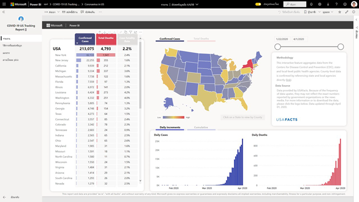
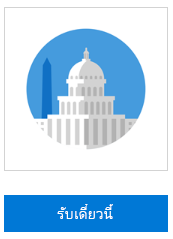
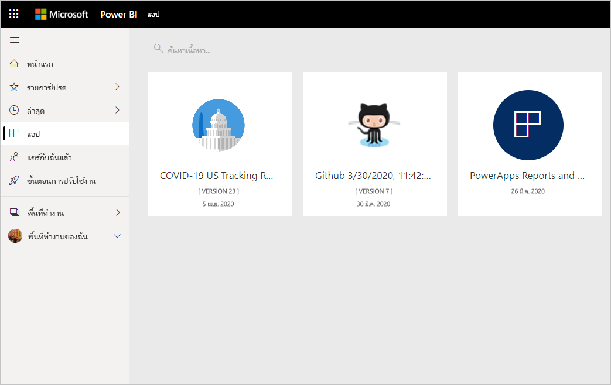
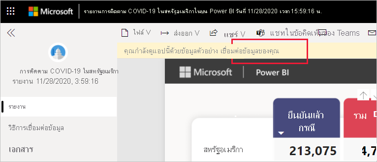
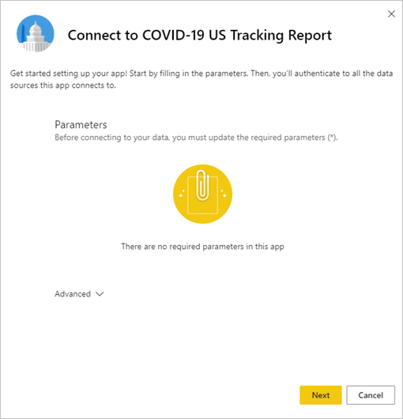
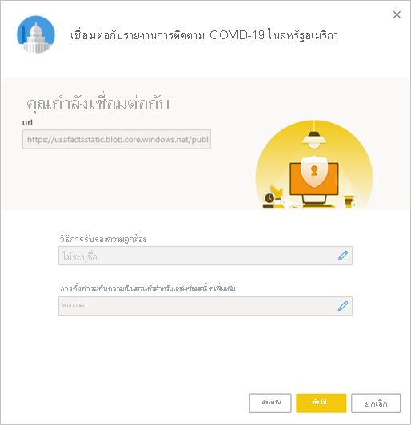
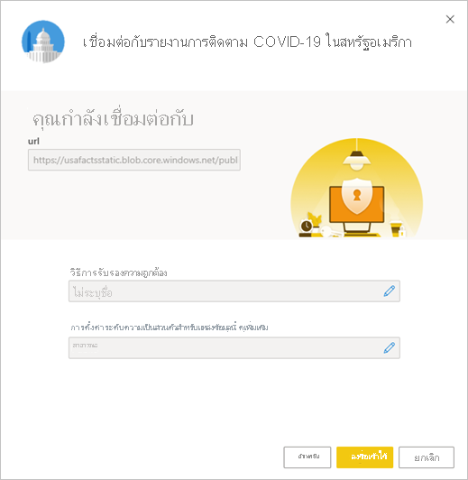
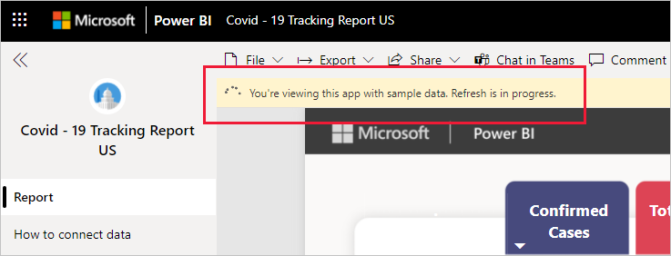

# การเชื่อมต่อรายงานการติดตาม COVID-19 ในสหรัฐอเมริกา
บทความนี้จะแจ้งวิธีการติดตั้งแอปเทมเพลตสำหรับรายงานการติดตาม COVID-19 และวิธีการเชื่อมต่อกับแหล่งข้อมูลให้คุณทราบ

สำหรับข้อมูลโดยละเอียดเกี่ยวกับตัวรายงาน รวมถึงการปฏิเสธความรับผิดชอบและข้อมูลเกี่ยวกับข้อมูล โปรดศึกษาจาก[ตัวอย่างการติดตาม COVID-19 ของรัฐแห่งสหรัฐอเมริกาและรัฐบาลท้องถิ่น](../create-reports/sample-covid-19-us.md)

หลังจากที่คุณได้ติดตั้งแอปเทมเพลตและเชื่อมต่อกับแหล่งข้อมูลแล้ว คุณสามารถปรับแต่งรายงานได้ตามความต้องการของคุณ จากนั้นคุณจะสามารถเผยแพร่รายงานออกเป็นแอปให้กับเพื่อนร่วมงานในองค์กรของคุณได้

## ติดตั้งแอป

1. คลิกที่ลิงก์ต่อไปนี้เพื่อเข้าถึงแอป: [แอปเทมเพลตรายงานการติดตาม COVID-19 ในสหรัฐอเมริกา](https://app.powerbi.com/groups/me/getapps/services/pbi-contentpacks.covid19ms)

1. เมื่อคุณอยู่ในหน้า AppSource ของแอป ให้คลิกที่ [**รับทันที**](https://app.powerbi.com/groups/me/getapps/services/pbi-contentpacks.covid19ms)

    

1. เมื่อมีข้อความแสดงขึ้น ให้คลิก **Install** หลังจากที่ติดตั้งแอปแล้ว คุณจะเห็นแอปบนหน้าแอปของคุณ

   

## เชื่อมต่อกับแหล่งข้อมูล

1. คลิกที่ไอคอนบนหน้าแอปของคุณเพื่อเปิดแอป แอปจะเปิดขึ้นและแสดงข้อมูลตัวอย่าง

1. เลือกลิงก์ **เชื่อมต่อข้อมูลของคุณ** บนแบนเนอร์ที่ด้านบนของหน้า

   

1. กล่องโต้ตอบพารามิเตอร์จะปรากฏขึ้น ไม่มีพารามิเตอร์ที่จำเป็น คลิก **ถัดไป**

   

1. กล่องโต้ตอบวิธีการรับรองความถูกต้องจะปรากฏขึ้น ระบบจะแสดงค่าที่แนะนำ อย่าเปลี่ยนแปลงข้อมูลเหล่านี ้เว้นแต่ว่าคุณมีความรู้เฉพาะเกี่ยวกับค่าต่าง ๆ

    คลิก **ถัดไป**

   

1. คลิก **ลงชื่อเข้าใช้**

   
 
   รายงานจะเชื่อมต่อกับแหล่งข้อมูล ซึ่งจะมีข้อมูลล่าสุดแจ้งเข้าไปอยู่เสมอ ในช่วงเวลานี้ คุณจะเห็นข้อมูลตัวอย่างและการรีเฟรชกำลังดำเนินการอยู่

   

## กำหนดเวลาการรีเฟรชรายงาน

เมื่อการรีเฟรชข้อมูลเสร็จสมบูรณ์ คุณจะอยู่ในพื้นที่ทำงานที่เชื่อมโยงกับแอป [ตั้งค่ากำหนดเวลาการรีเฟรช](../connect-data/refresh-scheduled-refresh.md)เพื่อให้ข้อมูลรายงานเป็นข้อมูลล่าสุดอยู่เสมอ

## ปรับแต่งตามความต้องการและแชร์

คุณสามารถดูรายละเอียดได้ที่[ปรับแต่งและแชร์แอป](../connect-data/service-template-apps-install-distribute.md#customize-and-share-the-app) ตรวจสอบให้มั่นใจว่าคุณได้อ่าน[ข้อความปฏิเสธความรับผิดชอบของรายงาน](../create-reports/sample-covid-19-us.md#disclaimers)ก่อนที่จะเผยแพร่หรือแจกจ่ายแอป

## ขั้นตอนถัดไป
* [ตัวอย่างการติดตาม COVID-19 สำหรับรัฐของสหรัฐอเมริกาและรัฐบาลในท้องถิ่น](../create-reports/sample-covid-19-us.md)
* มีคำถามหรือไม่? [ลองถามชุมชน Power BI](https://community.powerbi.com/)
* [แอปเทมเพลต Power BI คืออะไร](../connect-data/service-template-apps-overview.md)
* [ติดตั้งและแจกจ่ายแอปเทมเพลตในองค์กรของคุณ](../connect-data/service-template-apps-install-distribute.md)
