# การเชื่อมต่อเข้ากับรายงานสภาพการณ์การสื่อสารในภาวะวิกฤติConnect to the Crisis Communication Presence Report

แอป Power BI นี้เป็นระบบรายงาน/แดชบอร์ดใน Microsoft Power Platform สำหรับการสื่อสารในภาวะวิกฤติThis Power BI app is the report/dashboard artifact in the Microsoft Power Platform solution for Crisis Communication. ซึ่งจะติดตามตำแหน่งของผู้ปฏิบัติงานสำหรับผู้ใช้งานแอปการสื่อสารในภาวะวิกฤติIt tracks worker location for Crisis Communication app users. โซลูชั่นนี้จะผสานรวมความจุของ Power Apps, Power Automate, Teams, SharePoint และ Power BI เข้าด้วยกันThe solution combines capabilities of Power Apps, Power Automate, Teams, SharePoint and Power BI. ซึ่งสามารถใช้งานได้ทั้งบนเว็บ ในอุปกรณ์เคลื่อนที่ หรือใน TeamsIt can be used on the web, mobile or in Teams.

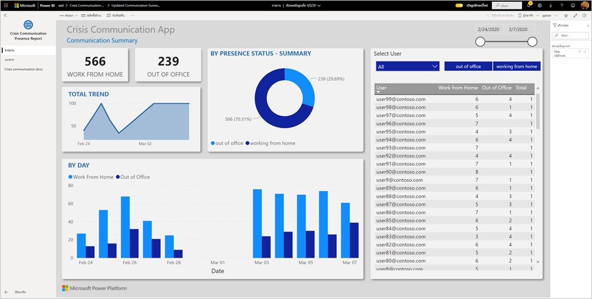

แดชบอร์ดจะแสดงข้อมูลทั้งหมดไว้ในระบบสุขภาพของผู้จัดการกรณีฉุกเฉิน เพื่อช่วยให้พวกเขาได้ดูแล้วทำการตัดสินใจได้อย่างถูกต้องและทันเวลาThe dashboard shows emergency managers aggregate data across their health system to help them to make timely, correct decisions.

บทความนี้จะแจ้งวิธีการติดตั้งแอปและวิธีการเชื่อมต่อกับแหล่งข้อมูลให้คุณทราบThis article tells  you how to install the app and how to connect to the data sources. สำหรับข้อมูลเพิ่มเติมเกี่ยวกับแอปการสื่อสารในภาวะวิกฤติ โปรดศึกษาจาก[การตั้งค่าและการเรียนรู้ตัวอย่างเทมเพลตของการสื่อสารในภาวะวิกฤติใน Power Apps](/powerapps/maker/canvas-apps/sample-crisis-communication-app)For more information about the Crisis Communication app, see [Set up and learn about the Crisis Communication sample template in Power Apps](/powerapps/maker/canvas-apps/sample-crisis-communication-app)

หลังจากที่คุณได้ติดตั้งแอปเทมเพลตและเชื่อมต่อกับแหล่งข้อมูลแล้ว คุณสามารถปรับแต่งรายงานได้ตามความต้องการของคุณAfter you've installed the template app and connected to the data sources, you can customize the report as per your needs. จากนั้นคุณจะสามารถเผยแพร่รายงานออกเป็นแอปให้กับเพื่อนร่วมงานในองค์กรของคุณได้You can then distribute it as an app to colleagues in your organization.

## ข้อกำหนดเบื้องต้นPrerequisites

ก่อนที่จะติดตั้งแอปเทมเพลตนี้ คุณต้องติดตั้งและตั้งค่า[ตัวอย่างการสื่อสารในภาวะวิกฤติ](/powerapps/maker/canvas-apps/sample-crisis-communication-app)ก่อนBefore installing this template app, you must first install and set up the [Crisis Communication sample](/powerapps/maker/canvas-apps/sample-crisis-communication-app). การติดตั้งโซลูชันนี้จะสร้างการอ้างอิงแหล่งข้อมูลที่จำเป็นเพื่อป้อนข้อมูลลงในแอปInstalling this solution creates the datasource references necessary to populate the app with data.

เมื่อติดตั้งตัวอย่างเทมเพลตของการสื่อสารในภาวะวิกฤติแล้ว ให้จดบันทึก[เส้นทางโฟลเดอร์รายการ SharePoint ของ "CI_Employee Status" และ ID รายการ](/powerapps/maker/canvas-apps/sample-crisis-communication-app#monitor-office-absences-with-power-bi)When installing the Crisis Communication sample, take note of the [SharePoint list folder path of "CI_Employee Status" and list ID](/powerapps/maker/canvas-apps/sample-crisis-communication-app#monitor-office-absences-with-power-bi).

## ติดตั้งแอปInstall the app

1. คลิกที่ลิงก์ต่อไปนี้เพื่อเข้าถึงแอป: [แอปเทมเพลตรายงานสภาพการณ์การสื่อสารในภาวะวิกฤติ](https://appsource.microsoft.com/en-us/product/power-bi/pbi-contentpacks.crisiscomms)Click the following link to get to the app: [Crisis Communication Presence Report template app](https://appsource.microsoft.com/en-us/product/power-bi/pbi-contentpacks.crisiscomms)

1. บนหน้า AppSource สำหรับแอป ให้เลือก [**รับทันที**](https://appsource.microsoft.com/en-us/product/power-bi/pbi-contentpacks.crisiscomms)On the AppSource page for the app, select [**GET IT NOW**](https://appsource.microsoft.com/en-us/product/power-bi/pbi-contentpacks.crisiscomms).

    [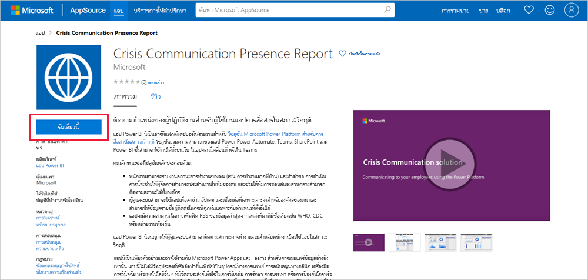](https://appsource.microsoft.com/en-us/product/power-bi/pbi-contentpacks.crisiscomms)

1. อ่านข้อมูลใน **สิ่งสุดท้ายที่ต้องทำเพิ่มเติม** แล้วเลือก **ดำเนินการต่อ**Read the information in **One more thing**, and select **Continue**.

    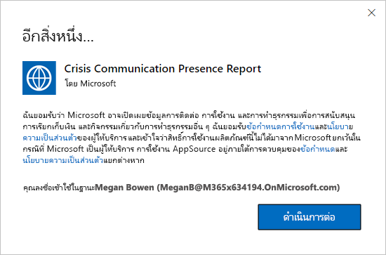

1. เลือก **ติดตั้ง**Select **Install**. 

    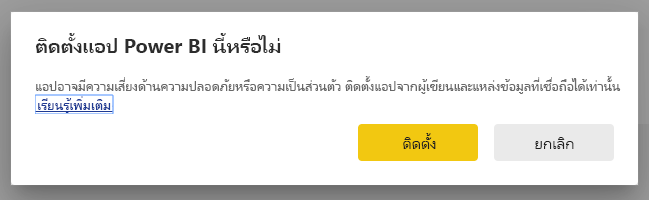

    หลังจากที่ติดตั้งแอปแล้ว คุณจะเห็นแอปบนหน้าแอปของคุณOnce the app has installed, you see it on your Apps page.

   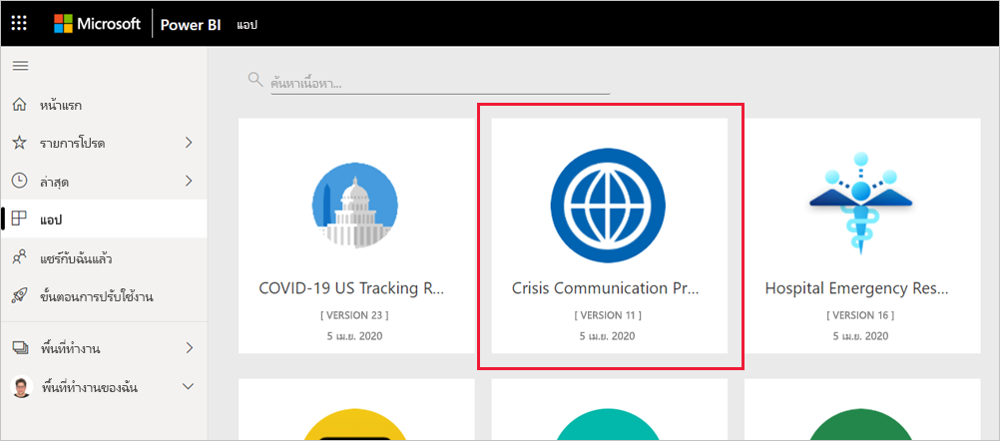

## เชื่อมต่อกับแหล่งข้อมูลConnect to data sources

1. เลือกไอคอนบนหน้าแอปของคุณเพื่อเปิดแอปSelect the icon on your Apps page to open the app.

   แอปจะเปิดขึ้นและแสดงข้อมูลตัวอย่างThe app opens, showing sample data.

1. เลือกลิงก์ **เชื่อมต่อข้อมูลของคุณ** บนแบนเนอร์ที่ด้านบนของหน้าSelect the **Connect your data** link on the banner at the top of the page.

   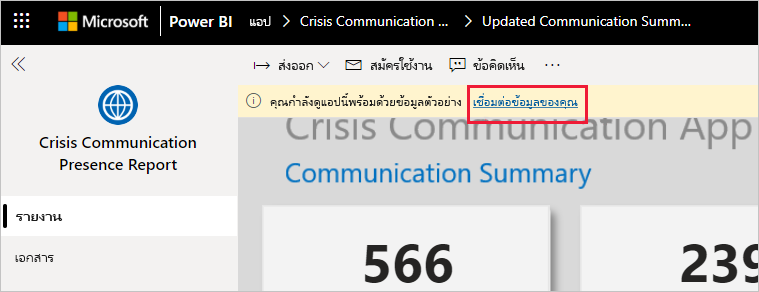

1. ในกล่องโต้ตอบ:In the dialog box:
   1. ในช่อง SharePoint_Folder ให้ป้อน[เส้นทางรายการ SharePoint ของ "CI_Employee Status"](/powerapps/maker/canvas-apps/sample-crisis-communication-app#monitor-office-absences-with-power-bi)In the SharePoint_Folder field, enter your ["CI_Employee Status" SharePoint list path](/powerapps/maker/canvas-apps/sample-crisis-communication-app#monitor-office-absences-with-power-bi).
   1. ในช่อง List_ID ให้ป้อน ID รายการที่คุณได้มาจากการตั้งค่ารายการIn the List_ID field, enter your list ID that you got from list settings. เมื่อป้อนเสร็จเรียบร้อย ให้คลิก **ถัดไป**When done, click **Next**.

   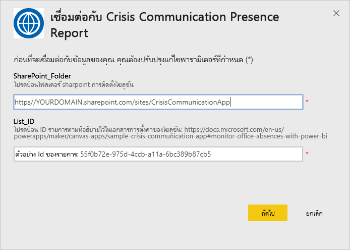

1. ในกล่องโต้ตอบที่ปรากฏขึ้นถัดไป ให้ตั้งค่าวิธีการรับรองความถูกต้องให้กับ **OAuth2**In the next dialog that appears, set the authentication method to **OAuth2**. คุณไม่ต้องปรับเปลี่ยนการตั้งค่าระดับความเป็นส่วนตัวใด ๆYou don't have to do anything to the privacy level setting.

   เลือก **ลงชื่อเข้าใช้**Select **Sign in**.

   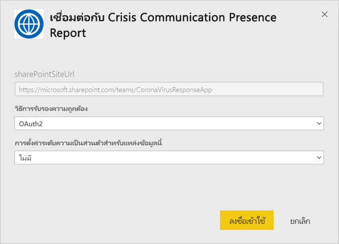

1. ที่หน้าจอลงชื่อเข้าใช้ของ Microsoft ใหลงชื่อเข้าใช้ Power BIAt the Microsoft sign-in screen, sign in to Power BI.

   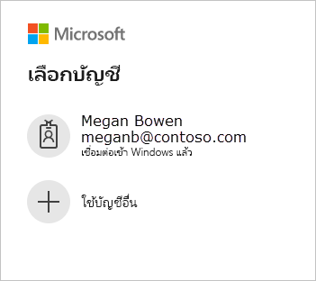

   หลังจากที่คุณลงชื่อเข้าใช้แล้ว รายงานจะเชื่อมต่อเข้ากับแหล่งข้อมูลและจะได้รับข้อมูลล่าสุดAfter you've signed in, the report connects to the data sources and is populated with up-to-date data. ในช่วงเวลานี้ ตัวตรวจสอบกิจกรรมจะเปิดทำงานDuring this time, the activity monitor turns.

   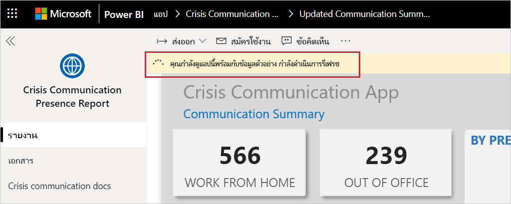

## กำหนดเวลาการรีเฟรชรายงานSchedule report refresh

เมื่อรีเฟรชข้อมูลแล้ว ให้[ตั้งค่ากำหนดเวลาการรีเฟรช](../connect-data/refresh-scheduled-refresh.md)เพื่อให้ข้อมูลรายงานเป็นข้อมูลล่าสุดอยู่เสมอWhen the data refresh has completed, [set up a refresh schedule](../connect-data/refresh-scheduled-refresh.md) to keep the report data up to date.

1. ในแถบส่วนหัวด้านบนสุด เลือก **Power BI**In the top header bar, select **Power BI**.

   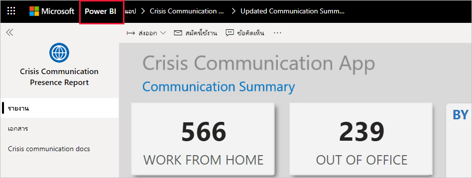

1. ในหน้าต่างนำทางด้านซ้าย มองหาแดชบอร์ดการสนับสนุนการตัดสินใจเกี่ยวกับการตอบสนองต่อสภาวะฉุกเฉินของโรงพยาบาลที่อยู่ใน **พื้นที่ทำงาน** แล้วปฏิบัติตามคำแนะนำที่อธิบายไว้ในบทความ[การปรับค่าการรีเฟรชตามกำหนดเวลา](../connect-data/refresh-scheduled-refresh.md)In the left navigation pane, look for the Hospital Emergency Response Decision Support Dashboard workspace under **Workspaces**, and follow the instruction described in the [Configure scheduled refresh](../connect-data/refresh-scheduled-refresh.md) article.

## ปรับแต่งตามความต้องการและแชร์Customize and share

คุณสามารถดูรายละเอียดได้ที่[ปรับแต่งและแชร์แอป](../connect-data/service-template-apps-install-distribute.md#customize-and-share-the-app)See [Customize and share the app](../connect-data/service-template-apps-install-distribute.md#customize-and-share-the-app) for details. ตรวจสอบให้มั่นใจว่าคุณได้อ่าน[ข้อความปฏิเสธความรับผิดชอบของรายงาน](../create-reports/sample-covid-19-us.md#disclaimers)ก่อนที่จะเผยแพร่หรือแจกจ่ายแอปBe sure to review the [report disclaimers](../create-reports/sample-covid-19-us.md#disclaimers) before publishing or distributing the app.

## ขั้นตอนถัดไปNext steps
* [ตั้งค่าและเรียนรู้เกี่ยวกับตัวอย่างเทมเพลตของการสื่อสารในภาวะวิกฤติใน Power AppsSet up and learn about the Crisis Communication sample template in Power Apps](/powerapps/maker/canvas-apps/sample-crisis-communication-app)
* มีคำถามหรือไม่Questions? [ลองถามชุมชน Power BITry asking the Power BI Community](https://community.powerbi.com/)
* [แอปเทมเพลต Power BI คืออะไรWhat are Power BI template apps?](../connect-data/service-template-apps-overview.md)
* [ติดตั้งและแจกจ่ายแอปเทมเพลตในองค์กรของคุณInstall and distribute template apps in your organization](../connect-data/service-template-apps-install-distribute.md)
