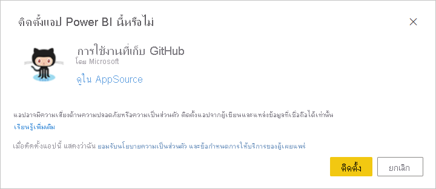
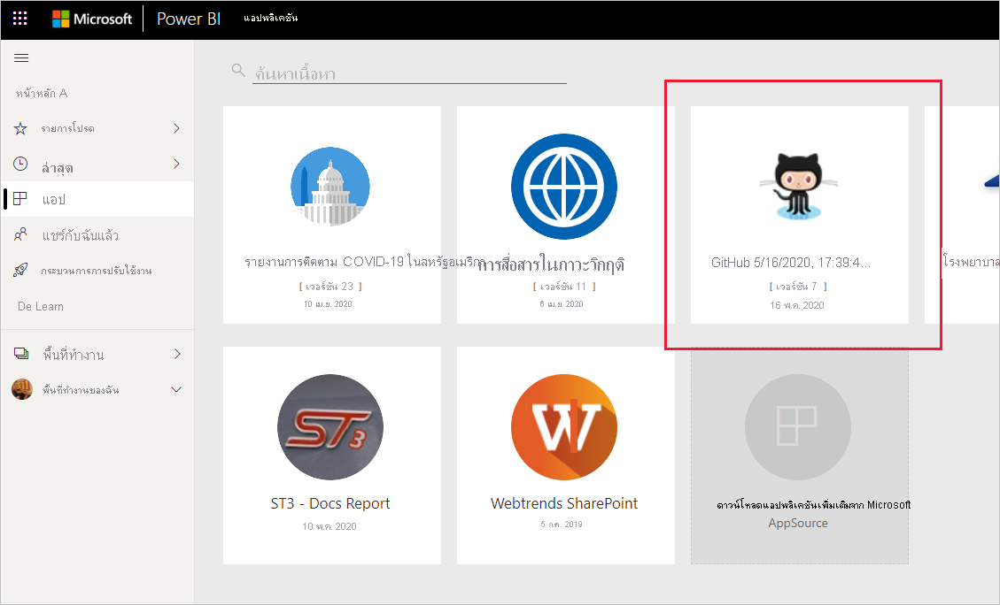
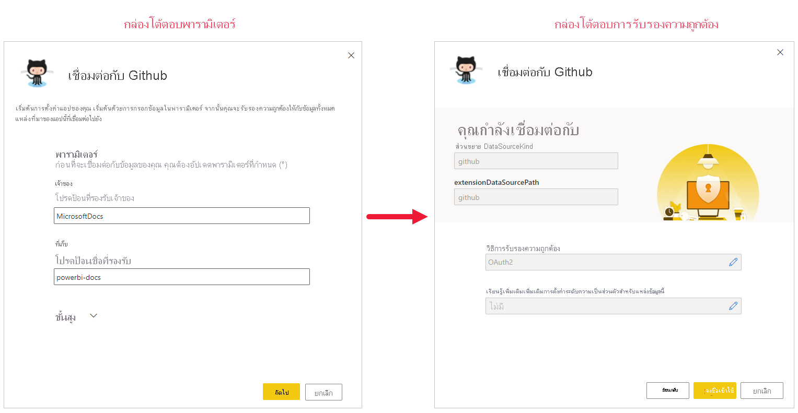
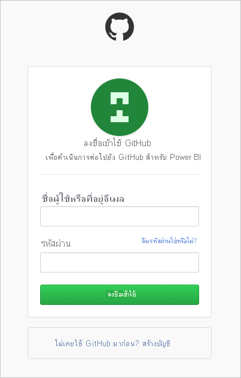
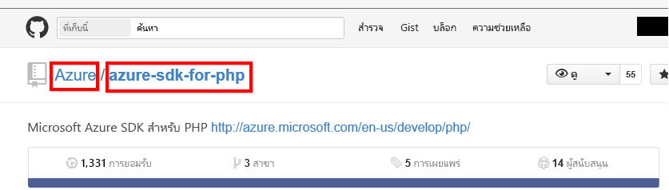

# <a name="connect-to-github-with-power-bi"></a><span data-ttu-id="e1a54-103">เชื่อมต่อกับ GitHub ด้วย Power BI</span><span class="sxs-lookup"><span data-stu-id="e1a54-103">Connect to GitHub with Power BI</span></span>
<span data-ttu-id="e1a54-104">บทความนี้จะแนะนำคุณในการดึงข้อมูลของคุณจากบัญชี GitHub ของคุณด้วยแอปเทมเพลตของ Power BI template</span><span class="sxs-lookup"><span data-stu-id="e1a54-104">This article walks you through pulling your data from your GitHub account with a Power BI template app.</span></span> <span data-ttu-id="e1a54-105">แอปเทมเพลตจะสร้างพื้นที่ทำงานที่มีแดชบอร์ด ชุดรายงาน และชุดข้อมูลที่จะช่วยให้คุณสามารถสำรวจข้อมูลบน GitHub ของคุณได้</span><span class="sxs-lookup"><span data-stu-id="e1a54-105">The template app generates a workspace with a dashboard, a set of reports, and a dataset to allow you to explore your GitHub data.</span></span> <span data-ttu-id="e1a54-106">แอป GitHub สำหรับ Power BI แสดงข้อมูลเชิงลึกในที่ข้อมูลจัดเก็บของ GitHub หรือที่เรียกว่า repo กับข้อมูล การจัดสรร ปัญหา คำขอการดึง และผู้ใช้ที่ใช้งานอยู่</span><span class="sxs-lookup"><span data-stu-id="e1a54-106">The GitHub app for Power BI shows you insights into your GitHub repository, also known as repo, with data around contributions, issues, pull requests, and active users.</span></span>


<span data-ttu-id="e1a54-108">หลังจากที่คุณได้ติดตั้งแอปแบบเทมเพลตแล้ว คุณสามารถเปลี่ยนแดชบอร์ดและรายงานได้</span><span class="sxs-lookup"><span data-stu-id="e1a54-108">After you've installed the template app, you can change the dashboard and report.</span></span> <span data-ttu-id="e1a54-109">จากนั้นคุณสามารถเผยแพร่เป็นแอปไปยังเพื่อนร่วมงานในองค์กรของคุณได้</span><span class="sxs-lookup"><span data-stu-id="e1a54-109">Then you can distribute it as an app to colleagues in your organization.</span></span>

<span data-ttu-id="e1a54-110">เชื่อมต่อไปยัง[แอปเทมเพลต GitHub ](https://app.powerbi.com/groups/me/getapps/services/pbi-contentpacks.pbiapps-github)หรืออ่านเพิ่มเติมเกี่ยวกับการ[รวม GitHub ](https://powerbi.microsoft.com/integrations/github)กับ Power BI</span><span class="sxs-lookup"><span data-stu-id="e1a54-110">Connect to the [GitHub template app](https://app.powerbi.com/groups/me/getapps/services/pbi-contentpacks.pbiapps-github) or read more about the [GitHub integration](https://powerbi.microsoft.com/integrations/github) with Power BI.</span></span>

<span data-ttu-id="e1a54-111">คุณยังสามารถลองใช้[บทช่วยสอน GitHub](service-tutorial-connect-to-github.md) ได้</span><span class="sxs-lookup"><span data-stu-id="e1a54-111">You can also try the [GitHub tutorial](service-tutorial-connect-to-github.md).</span></span> <span data-ttu-id="e1a54-112">ซึ่งติดตั้งข้อมูล GitHub ที่แท้จริงเกี่ยวกับ repo สาธารณะสำหรับเอกสาร Power BI</span><span class="sxs-lookup"><span data-stu-id="e1a54-112">It installs real GitHub data about the public repo for the  Power BI documentation.</span></span>

>[!NOTE]
><span data-ttu-id="e1a54-113">แอปเทมเพลตนี้จำเป็นต้องมีบัญชีผู้ใช้ GitHub ที่สามารถเข้าถึงที่เก็บได้</span><span class="sxs-lookup"><span data-stu-id="e1a54-113">This template app requires the GitHub account to have access to the repo.</span></span> <span data-ttu-id="e1a54-114">รายละเอียดเพิ่มเติมเกี่ยวกับข้อกำหนดด้านล่าง</span><span class="sxs-lookup"><span data-stu-id="e1a54-114">More details on requirements below.</span></span>
>
><span data-ttu-id="e1a54-115">แอปเทมเพลตนี้ไม่รองรับ GitHub Enterprise</span><span class="sxs-lookup"><span data-stu-id="e1a54-115">This template app does not support GitHub Enterprise.</span></span>

## <a name="install-the-app"></a><span data-ttu-id="e1a54-116">ติดตั้งแอป</span><span class="sxs-lookup"><span data-stu-id="e1a54-116">Install the app</span></span>

1. <span data-ttu-id="e1a54-117">คลิกที่ลิงก์ต่อไปนี้เพื่อเข้าถึงแอป: [แอปเทมเพลต GitHub](https://app.powerbi.com/groups/me/getapps/services/pbi-contentpacks.pbiapps-github)</span><span class="sxs-lookup"><span data-stu-id="e1a54-117">Click the following link to get to the app: [GitHub template app](https://app.powerbi.com/groups/me/getapps/services/pbi-contentpacks.pbiapps-github)</span></span>

1. <span data-ttu-id="e1a54-118">บนหน้า AppSource สำหรับแอป ให้เลือก [**รับทันที**](https://app.powerbi.com/groups/me/getapps/services/pbi-contentpacks.pbiapps-github)</span><span class="sxs-lookup"><span data-stu-id="e1a54-118">On the AppSource page for the app, select [**GET IT NOW**](https://app.powerbi.com/groups/me/getapps/services/pbi-contentpacks.pbiapps-github).</span></span>

    <span data-ttu-id="e1a54-119">[](https://app.powerbi.com/groups/me/getapps/services/pbi-contentpacks.pbiapps-github)</span><span class="sxs-lookup"><span data-stu-id="e1a54-119">[](https://app.powerbi.com/groups/me/getapps/services/pbi-contentpacks.pbiapps-github)</span></span>

1. <span data-ttu-id="e1a54-120">เลือก **ติดตั้ง**</span><span class="sxs-lookup"><span data-stu-id="e1a54-120">Select **Install**.</span></span> 

    

    <span data-ttu-id="e1a54-122">หลังจากที่ติดตั้งแอปแล้ว คุณจะเห็นแอปบนหน้าแอปของคุณ</span><span class="sxs-lookup"><span data-stu-id="e1a54-122">Once the app has installed, you see it on your Apps page.</span></span>

   

## <a name="connect-to-data-sources"></a><span data-ttu-id="e1a54-124">เชื่อมต่อกับแหล่งข้อมูล</span><span class="sxs-lookup"><span data-stu-id="e1a54-124">Connect to data sources</span></span>

1. <span data-ttu-id="e1a54-125">เลือกไอคอนบนหน้าแอปของคุณเพื่อเปิดแอป</span><span class="sxs-lookup"><span data-stu-id="e1a54-125">Select the icon on your Apps page to open the app.</span></span>

   <span data-ttu-id="e1a54-126">แอปจะเปิดขึ้นและแสดงข้อมูลตัวอย่าง</span><span class="sxs-lookup"><span data-stu-id="e1a54-126">The app opens, showing sample data.</span></span>

1. <span data-ttu-id="e1a54-127">เลือกลิงก์ **เชื่อมต่อข้อมูลของคุณ** บนแบนเนอร์ที่ด้านบนของหน้า</span><span class="sxs-lookup"><span data-stu-id="e1a54-127">Select the **Connect your data** link on the banner at the top of the page.</span></span>

   

1. <span data-ttu-id="e1a54-129">ซึ่งจะเปิดกล่องโต้ตอบพารามิเตอร์ ที่คุณสามารถเปลี่ยนแหล่งข้อมูลจากข้อมูลตัวอย่างเป็นแหล่งข้อมูลของคุณเอง (ดู[ข้อจำกัดที่รู้จัก](service-template-apps-overview.md#known-limitations)) ตามด้วยกล่องโต้ตอบวิธีการรับรองความถูกต้อง</span><span class="sxs-lookup"><span data-stu-id="e1a54-129">This opens the parameters dialog, where you change the data source from the sample data to your own data source (see [known limitations](service-template-apps-overview.md#known-limitations)), followed by the authentication method dialog.</span></span> <span data-ttu-id="e1a54-130">คุณอาจต้องกำหนดค่าใหม่ในกล่องโต้ตอบเหล่านี้</span><span class="sxs-lookup"><span data-stu-id="e1a54-130">You may have to redefine the values in these dialogs.</span></span>

   


1. <span data-ttu-id="e1a54-132">ใส่ข้อมูลประจำตัว GitHub ของคุณและทำตามขั้นตอนการรับรองความถูกต้องของ GitHub (คุณอาจข้ามขั้นตอนนี้ ถ้าคุณได้ลงชื่อเข้าใช้ด้วยเบราว์เซอร์ของคุณอยู่แล้ว)</span><span class="sxs-lookup"><span data-stu-id="e1a54-132">Enter your GitHub credentials and follow the GitHub authentication process (this step might be skipped if you're already signed in with your browser).</span></span>

   


<span data-ttu-id="e1a54-134">เมื่อคุณกรอกข้อมูลในกล่องโต้ตอบการเชื่อมต่อเสร็จแล้วและลงชื่อเข้าใช้ GitHub แล้ว กระบวนการเชื่อมต่อจะเริ่มขึ้น</span><span class="sxs-lookup"><span data-stu-id="e1a54-134">Once you've finished filling out the connection dialogs and signed in to GitHub, the connection process starts.</span></span> <span data-ttu-id="e1a54-135">แบนเนอร์จะแจ้งให้คุณทราบว่าข้อมูลกำลังถูกรีเฟรช และในระหว่างนี้คุณกำลังดูข้อมูลตัวอย่าง</span><span class="sxs-lookup"><span data-stu-id="e1a54-135">A banner informs you that the data is being refreshed, and that in the meantime you are viewing sample data.</span></span>


<span data-ttu-id="e1a54-137">ข้อมูลรายงานของคุณจะรีเฟรชโดยอัตโนมัติหนึ่งครั้งต่อวัน เว้นแต่ว่าคุณจะปิดใช้งานการดำเนินการนี้ในระหว่างกระบวนการลงชื่อเข้าใช้</span><span class="sxs-lookup"><span data-stu-id="e1a54-137">Your report data will automatically refresh once a day, unless you disabled this during the sign-in process.</span></span> <span data-ttu-id="e1a54-138">นอกจากนี้ คุณยังสามารถ [ตั้งค่าตารางเวลาการรีเฟรชของคุณเอง](./refresh-scheduled-refresh.md) เพื่อรักษาข้อมูลรายงานให้เป็นปัจจุบันหากคุณต้องการ</span><span class="sxs-lookup"><span data-stu-id="e1a54-138">You can also [set up your own refresh schedule](./refresh-scheduled-refresh.md) to keep the report data up to date if you so desire.</span></span>

## <a name="customize-and-share"></a><span data-ttu-id="e1a54-139">ปรับแต่งตามความต้องการและแชร์</span><span class="sxs-lookup"><span data-stu-id="e1a54-139">Customize and share</span></span>

<span data-ttu-id="e1a54-140">เมื่อต้องการกำหนดค่าและแชร์แอปของคุณ ให้เลือกไอคอนรูปดินสอที่มุมบนขวาของหน้า</span><span class="sxs-lookup"><span data-stu-id="e1a54-140">To customize and share your app, select the pencil icon at the top right corner of the page.</span></span>


<span data-ttu-id="e1a54-142">สำหรับข้อมูลเกี่ยวกับการแก้ไขอาร์ทิแฟกต์ในพื้นที่ทำงาน โปรดดู</span><span class="sxs-lookup"><span data-stu-id="e1a54-142">For information about editing artifacts in the workspace, see</span></span>
* [<span data-ttu-id="e1a54-143">แนะนำตัวแก้ไขรายงานใน Power BI</span><span class="sxs-lookup"><span data-stu-id="e1a54-143">Tour the report editor in Power BI</span></span>](../create-reports/service-the-report-editor-take-a-tour.md)
* [<span data-ttu-id="e1a54-144">แนวคิดพื้นฐานสำหรับนักออกแบบในบริการ Power BI</span><span class="sxs-lookup"><span data-stu-id="e1a54-144">Basic concepts for designers in the Power BI service</span></span>](../fundamentals/service-basic-concepts.md)

<span data-ttu-id="e1a54-145">หลังจากที่คุณทำการเปลี่ยนแปลงใดก็ตามที่คุณต้องการทำกับอาร์ทิแฟกต์ในพื้นที่ทำงาน คุณก็พร้อมที่จะเผยแพร่และแชร์แอป</span><span class="sxs-lookup"><span data-stu-id="e1a54-145">Once you are done making any changes you wish to the artifacts in the workspace, you are ready to publish and share the app.</span></span> <span data-ttu-id="e1a54-146">ดู [เผยแพร่แอปของคุณ](../collaborate-share/service-create-distribute-apps.md#publish-your-app) เพื่อเรียนรู้วิธีการทำเช่นนี้</span><span class="sxs-lookup"><span data-stu-id="e1a54-146">See [Publish your app](../collaborate-share/service-create-distribute-apps.md#publish-your-app) to learn how to do this.</span></span>

## <a name="whats-included-in-the-app"></a><span data-ttu-id="e1a54-147">มีอะไรรวมอยู่ในแอปบ้าง</span><span class="sxs-lookup"><span data-stu-id="e1a54-147">What's included in the app</span></span>
<span data-ttu-id="e1a54-148">ข้อมูลต่อไปนี้จะพร้อมใช้งานจาก GitHub ใน Power BI</span><span class="sxs-lookup"><span data-stu-id="e1a54-148">The following data is available from GitHub in Power BI:</span></span>     

| <span data-ttu-id="e1a54-149">ชื่อตาราง</span><span class="sxs-lookup"><span data-stu-id="e1a54-149">Table name</span></span> | <span data-ttu-id="e1a54-150">คำอธิบาย</span><span class="sxs-lookup"><span data-stu-id="e1a54-150">Description</span></span> |
| --- | --- |
| <span data-ttu-id="e1a54-151">การสนับสนุน</span><span class="sxs-lookup"><span data-stu-id="e1a54-151">Contributions</span></span> |<span data-ttu-id="e1a54-152">ตารางจัดสรรให้ ผลรวม การเพิ่มเติม การลบและการกระทำที่อนุญาตโดยผู้ให้การสนับสนุนที่เพิ่มแต่ละสัปดาห์</span><span class="sxs-lookup"><span data-stu-id="e1a54-152">The contributions table gives the total additions, deletions, and commits authored by the contributor aggregated per week.</span></span> <span data-ttu-id="e1a54-153">ผู้สนับสนุน 100 อันดับแรกถูกรวมไว้</span><span class="sxs-lookup"><span data-stu-id="e1a54-153">The top 100 contributors are included.</span></span> |
| <span data-ttu-id="e1a54-154">ปัญหา</span><span class="sxs-lookup"><span data-stu-id="e1a54-154">Issues</span></span> |<span data-ttu-id="e1a54-155">รายการปัญหาทั้งหมดสำหรับ repo ที่เลือก และประกอบด้วยการคำนวณเช่นเวลาเฉลี่ยและเวลารวมเพื่อปิดข้อปัญหา รวมปัญหาที่เปิด รวมปัญหาที่ปิด</span><span class="sxs-lookup"><span data-stu-id="e1a54-155">List all issues for the selected repo and it contains calculations like total and average time to close an issue, Total open issues,  Total closed issues.</span></span> <span data-ttu-id="e1a54-156">ตารางนี้จะว่างเปล่าเมื่อไม่มีปัญหาใน repo</span><span class="sxs-lookup"><span data-stu-id="e1a54-156">This table will be empty when there are no issues in the repo.</span></span> |
| <span data-ttu-id="e1a54-157">คำขอดึงข้อมูล</span><span class="sxs-lookup"><span data-stu-id="e1a54-157">Pull requests</span></span> |<span data-ttu-id="e1a54-158">ตารางนี้ประกอบด้วย Pull Requests ทั้งหมดดึงของ repo และบุคคลที่ขอดึง</span><span class="sxs-lookup"><span data-stu-id="e1a54-158">This table contains all the Pull Requests for the repo and who pulled the request.</span></span> <span data-ttu-id="e1a54-159">ซึ่งยังประกอบด้วยคำนวณ จำนวน Pull Requests เปิด ปิด และจำนวนรวม ระยะเวลาของ Pull Requests และระยะเวลาค่าเฉลี่ยของ Pull Requests</span><span class="sxs-lookup"><span data-stu-id="e1a54-159">It also contains calculations around how many open, closed, and total pull requests, how long it took to pull the requests and how long the average pull request took.</span></span> <span data-ttu-id="e1a54-160">ตารางนี้จะว่างเปล่าเมื่อไม่มีคำขอดึงข้อมูลในที่เก็บ</span><span class="sxs-lookup"><span data-stu-id="e1a54-160">This table will be empty when there are no pull requests in the repo.</span></span> |
| <span data-ttu-id="e1a54-161">ผู้ใช้</span><span class="sxs-lookup"><span data-stu-id="e1a54-161">Users</span></span> |<span data-ttu-id="e1a54-162">ตารางนี้แสดงรายการของผู้ใช้ GitHub หรือผู้ให้การสนับสนุนที่ได้ทำการจัดสรร ที่เก็บข้อมูลปัญหา หรือได้รับการแก้ไข Pull Requests ของ repo ที่เลือก</span><span class="sxs-lookup"><span data-stu-id="e1a54-162">This table provides a list of GitHub users or contributors who have made contributions, filed issues, or solved Pull requests for the repo selected.</span></span> |
| <span data-ttu-id="e1a54-163">หลักเป้าหมาย</span><span class="sxs-lookup"><span data-stu-id="e1a54-163">Milestones</span></span> |<span data-ttu-id="e1a54-164">มีเหตุการณ์สำคัญทั้งหมดสำหรับ repo ที่เลือก</span><span class="sxs-lookup"><span data-stu-id="e1a54-164">It has all the Milestones for the selected repo.</span></span> |
| <span data-ttu-id="e1a54-165">DateTable</span><span class="sxs-lookup"><span data-stu-id="e1a54-165">DateTable</span></span> |<span data-ttu-id="e1a54-166">ตารางนี้ประกอบด้วยวันที่จากวันนี้ และปีในอดีตที่ช่วยให้คุณสามารถวิเคราะห์ข้อมูล GitHub ของคุณตามวัน</span><span class="sxs-lookup"><span data-stu-id="e1a54-166">This table contains dates from today and for years in the past that allow you to analyze your GitHub data by date.</span></span> |
| <span data-ttu-id="e1a54-167">ContributionPunchCard</span><span class="sxs-lookup"><span data-stu-id="e1a54-167">ContributionPunchCard</span></span> |<span data-ttu-id="e1a54-168">ตารางนี้สามารถใช้เป็นการ์ดความสามารถจัดสรรสำหรับ repo ที่เลือก</span><span class="sxs-lookup"><span data-stu-id="e1a54-168">This table can be used as a contribution punch card for the selected repo.</span></span> <span data-ttu-id="e1a54-169">ซึ่งแสดงยอมรับ โดยวันของสัปดาห์และชั่วโมงของวัน</span><span class="sxs-lookup"><span data-stu-id="e1a54-169">It shows commits by day of week and hour of day.</span></span> <span data-ttu-id="e1a54-170">ตารางนี้ไม่ได้รับการเชื่อมต่อกับตารางอื่นในแบบจำลอง</span><span class="sxs-lookup"><span data-stu-id="e1a54-170">This table is not connected to other tables in the model.</span></span> |
| <span data-ttu-id="e1a54-171">RepoDetails</span><span class="sxs-lookup"><span data-stu-id="e1a54-171">RepoDetails</span></span> |<span data-ttu-id="e1a54-172">ตารางนี้มีรายละเอียดสำหรับ repo ที่เลือก</span><span class="sxs-lookup"><span data-stu-id="e1a54-172">This table provides details for the repo selected.</span></span> |

## <a name="system-requirements"></a><span data-ttu-id="e1a54-173">ความต้องการของระบบ</span><span class="sxs-lookup"><span data-stu-id="e1a54-173">System requirements</span></span>
* <span data-ttu-id="e1a54-174">บัญชีผู้ใช้ GitHub ที่มีสิทธิ์เข้าถึง repo</span><span class="sxs-lookup"><span data-stu-id="e1a54-174">The GitHub account that has access to the repo.</span></span>  
* <span data-ttu-id="e1a54-175">สิทธิ์ที่มอบให้กับ Power BI สำหรับแอป GitHub ในระหว่างการเข้าสู่ระบบครั้งแรก</span><span class="sxs-lookup"><span data-stu-id="e1a54-175">Permission granted to the Power BI for GitHub app during first login.</span></span> <span data-ttu-id="e1a54-176">ดูรายละเอียดด้านล่างในการยกเลิกการเข้าถึง</span><span class="sxs-lookup"><span data-stu-id="e1a54-176">See details below on revoking access.</span></span>  
* <span data-ttu-id="e1a54-177">มีการเรียกใช้ API เพียงพอที่สามารถดึงและรีเฟรชข้อมูล</span><span class="sxs-lookup"><span data-stu-id="e1a54-177">Sufficient API calls available to pull and refresh the data.</span></span>
>[!NOTE]
><span data-ttu-id="e1a54-178">แอปเทมเพลตนี้ไม่รองรับ GitHub Enterprise</span><span class="sxs-lookup"><span data-stu-id="e1a54-178">This template app does not support GitHub Enterprise.</span></span>

### <a name="de-authorize-power-bi"></a><span data-ttu-id="e1a54-179">ยกเลิกอนุญาต Power BI</span><span class="sxs-lookup"><span data-stu-id="e1a54-179">De-authorize Power BI</span></span>
<span data-ttu-id="e1a54-180">เมื่อต้องการยกเลิกอนุญาต Power BI เนื่องจากได้เชื่อมต่อกับ GitHub repo ของคุณ คุณสามารถยกเลิกการเข้าถึงใน GitHub</span><span class="sxs-lookup"><span data-stu-id="e1a54-180">To de-authorize Power BI from being connected to your GitHub repo, you can Revoke access in GitHub.</span></span> <span data-ttu-id="e1a54-181">ดูหัวข้อ[ความช่วยเหลือ GitHub](https://help.github.com/articles/keeping-your-ssh-keys-and-application-access-tokens-safe/#reviewing-your-authorized-applications-oauth) สำหรับรายละเอียด</span><span class="sxs-lookup"><span data-stu-id="e1a54-181">See this [GitHub help](https://help.github.com/articles/keeping-your-ssh-keys-and-application-access-tokens-safe/#reviewing-your-authorized-applications-oauth) topic for details.</span></span>

<a name="FindingParams"></a>
## <a name="finding-parameters"></a><span data-ttu-id="e1a54-182">การค้นหาพารามิเตอร์</span><span class="sxs-lookup"><span data-stu-id="e1a54-182">Finding parameters</span></span>
<span data-ttu-id="e1a54-183">คุณสามารถกำหนดเจ้าของและที่เก็บ โดยด repo ใน GitHub เอง</span><span class="sxs-lookup"><span data-stu-id="e1a54-183">You can determine the owner and repository by looking at the repository in GitHub itself:</span></span>



<span data-ttu-id="e1a54-185">ส่วนแรกของ "Azure" คือเจ้าของ และส่วนสอง "azure-sdk-for-php" เป็นส่วนเก็บข้อมูล</span><span class="sxs-lookup"><span data-stu-id="e1a54-185">The first part "Azure" is the owner and the second part "azure-sdk-for-php" is the repository itself.</span></span>  <span data-ttu-id="e1a54-186">คุณเห็นสิ่งเหล่านี้เหมือนกันสองรายการใน URL repo</span><span class="sxs-lookup"><span data-stu-id="e1a54-186">You see these same two items in the URL of the repository:</span></span>

```console
<https://github.com/Azure/azure-sdk-for-php> .
```

## <a name="troubleshooting"></a><span data-ttu-id="e1a54-187">การแก้ไขปัญหา</span><span class="sxs-lookup"><span data-stu-id="e1a54-187">Troubleshooting</span></span>
<span data-ttu-id="e1a54-188">ถ้าจำเป็น คุณสามารถตรวจสอบข้อมูลประจำตัว GitHub ของคุณ</span><span class="sxs-lookup"><span data-stu-id="e1a54-188">If necessary, you can verify your GitHub credentials.</span></span>  

1. <span data-ttu-id="e1a54-189">ในหน้าต่างเบราว์เซอร์อื่น ไปที่เว็บไซต์ GitHub และเข้าสู่ระบบ GitHub</span><span class="sxs-lookup"><span data-stu-id="e1a54-189">In another browser window, go to the GitHub web site and sign in to GitHub.</span></span> <span data-ttu-id="e1a54-190">คุณสามารถเห็นว่าคุณกำลังเข้าสู่ระบบ ที่มุมขวาบนของไซต์ GitHub</span><span class="sxs-lookup"><span data-stu-id="e1a54-190">You can see you’re logged in, in the upper-right corner of the GitHub site.</span></span>    
2. <span data-ttu-id="e1a54-191">ใน GitHub นำทางไปยัง URL ของ repo ที่คุณวางแผนที่จะเข้าถึงใน Power BI</span><span class="sxs-lookup"><span data-stu-id="e1a54-191">In GitHub, navigate to the URL of the repo you plan to access in Power BI.</span></span> <span data-ttu-id="e1a54-192">ตัวอย่างเช่น: https://github.com/dotnet/corefx</span><span class="sxs-lookup"><span data-stu-id="e1a54-192">For example: https://github.com/dotnet/corefx.</span></span>  
3. <span data-ttu-id="e1a54-193">กลับไปที่ Power BI ลองเชื่อมต่อกับ GitHub</span><span class="sxs-lookup"><span data-stu-id="e1a54-193">Back in Power BI, try connecting to GitHub.</span></span> <span data-ttu-id="e1a54-194">ในกล่องโต้ตอบการกำหนดค่า GitHub ให้ใช้ชื่อของ repo และเจ้าของ repo สำหรับ repo ที่เดียวกัน</span><span class="sxs-lookup"><span data-stu-id="e1a54-194">In the Configure GitHub dialog box, use the names of the repo and repo owner for that same repo.</span></span>  

## <a name="next-steps"></a><span data-ttu-id="e1a54-195">ขั้นตอนถัดไป</span><span class="sxs-lookup"><span data-stu-id="e1a54-195">Next steps</span></span>

* [<span data-ttu-id="e1a54-196">บทช่วยสอน: เชื่อมต่อกับ GitHub repo ด้วย Power BI</span><span class="sxs-lookup"><span data-stu-id="e1a54-196">Tutorial: Connect to a GitHub repo with Power BI</span></span>](service-tutorial-connect-to-github.md)
* [<span data-ttu-id="e1a54-197">สร้างพื้นที่ทำงานใหม่ใน Power BI</span><span class="sxs-lookup"><span data-stu-id="e1a54-197">Create the new workspaces in Power BI</span></span>](../collaborate-share/service-create-the-new-workspaces.md)
* [<span data-ttu-id="e1a54-198">ติดตั้งและใช้แอปฯใน Power BI</span><span class="sxs-lookup"><span data-stu-id="e1a54-198">Install and use apps in Power BI</span></span>](../consumer/end-user-apps.md)
* [<span data-ttu-id="e1a54-199">เชื่อมต่อกับแอป Power BI สำหรับบริการภายนอก</span><span class="sxs-lookup"><span data-stu-id="e1a54-199">Connect to Power BI apps for external services</span></span>](service-connect-to-services.md)
* <span data-ttu-id="e1a54-200">มีคำถามหรือไม่</span><span class="sxs-lookup"><span data-stu-id="e1a54-200">Questions?</span></span> [<span data-ttu-id="e1a54-201">ลองถามชุมชน Power BI</span><span class="sxs-lookup"><span data-stu-id="e1a54-201">Try asking the Power BI Community</span></span>](https://community.powerbi.com/)
