# การเชื่อมต่อเข้ากับแดชบอร์ดการสนับสนุนการตัดสินใจเกี่ยวกับการตอบสนองต่อสภาวะฉุกเฉินของโรงพยาบาลConnect to the Hospital Emergency Response Decision Support Dashboard
แอปเทมเพลตแดชบอร์ดการสนับสนุนการตัดสินใจเกี่ยวกับการตอบสนองต่อสภาวะฉุกเฉินของโรงพยาบาลเป็นส่วนประกอบการรายงานของ[โซลูชั่น Microsoft Power Platform สำหรับการตอบสนองต่อสภาวะฉุกเฉินสำหรับการดูแลสุขภาพ](https://powerapps.microsoft.com/blog/emergency-response-solution-a-microsoft-power-platform-solution-for-healthcare-emergency-response/)The Hospital Emergency Response Decision Support Dashboard template app is the reporting component of the [Microsoft Power Platform solution for healthcare emergency response](https://powerapps.microsoft.com/blog/emergency-response-solution-a-microsoft-power-platform-solution-for-healthcare-emergency-response/). แดชบอร์ดจะแสดงข้อมูลทั้งหมดไว้ในระบบสุขภาพของผู้จัดการกรณีฉุกเฉิน เพื่อช่วยให้พวกเขาได้ดูแล้วทำการตัดสินใจได้อย่างถูกต้องและทันเวลาThe dashboard shows emergency managers aggregate data across their health system to help them to make timely, correct decisions.

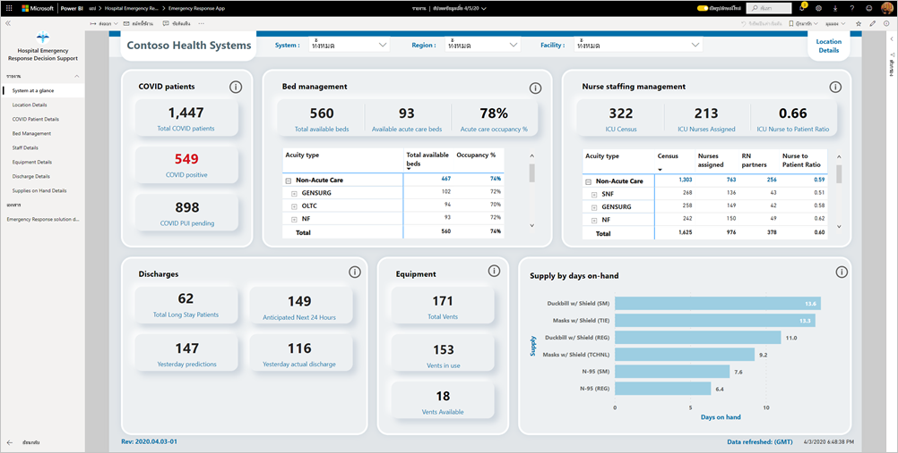

บทความนี้จะแจ้งวิธีการติดตั้งแอปและวิธีการเชื่อมต่อกับแหล่งข้อมูลให้คุณทราบThis article tells  you how to install the app and how to connect to the data sources. หากต้องการเรียนรู้วิธีการใช้รายงานที่คุณจะเห็นจากแอปนี้ โปรดศึกษาจาก[เอกสารเรื่องแอปแดชบอร์ดการสนับสนุนการตัดสินใจเกี่ยวกับการตอบสนองต่อสภาวะฉุกเฉินของโรงพยาบาล](/powerapps/sample-apps/emergency-response/deploy-configure#view-the-power-bi-dashboard)To learn how to use the report that you will see with this app, see the [Hospital Emergency Response Decision Support Dashboard documentation](/powerapps/sample-apps/emergency-response/deploy-configure#view-the-power-bi-dashboard).

หลังจากที่คุณได้ติดตั้งแอปเทมเพลตและเชื่อมต่อกับแหล่งข้อมูลแล้ว คุณสามารถปรับแต่งรายงานได้ตามความต้องการของคุณAfter you've installed the template app and connected to the data sources, you can customize the report as per your needs. จากนั้นคุณจะสามารถเผยแพร่รายงานออกเป็นแอปให้กับเพื่อนร่วมงานในองค์กรของคุณได้You can then distribute it as an app to colleagues in your organization.

## ข้อกำหนดเบื้องต้นPrerequisites

ก่อนที่จะติดตั้งแอปเทมเพลตนี้ คุณต้องติดตั้งและตั้งค่า[โซลูชั่น Power Platform สำหรับการตอบสนองต่อสภาวะฉุกเฉินของโรงพยาบาล](/powerapps/sample-apps/emergency-response/deploy-configure)ก่อนBefore installing this template app, you must first install and set up the [Hospital Emergency Response Power Platform solution](/powerapps/sample-apps/emergency-response/deploy-configure). การติดตั้งโซลูชันนี้จะสร้างการอ้างอิงแหล่งข้อมูลที่จำเป็นเพื่อป้อนข้อมูลลงในแอปInstalling this solution creates the datasource references necessary to populate the app with data.

เมื่อทำการติดตั้งโซลูชั่น Power Platform สำหรับการตอบสนองต่อสภาวะฉุกเฉินของโรงพยาบาลแล้ว ให้จดบันทึก [URL ของสภาพแวดล้อมอินสแตนซ์ Common Data Service ของคุณ](/powerapps/sample-apps/emergency-response/deploy-configure#publish-the-power-bi-dashboard)เอาไว้When installing Hospital Emergency Response Power Platform solution, take note of the [URL of your Common Data Service environment instance](/powerapps/sample-apps/emergency-response/deploy-configure#publish-the-power-bi-dashboard). คุณจะต้องใช้ข้อมูลนี้เพื่อเชื่อมต่อแอปเทมเพลตเข้ากับข้อมูลYou will need it to connect the template app to the data.

## ติดตั้งแอปInstall the app

1. คลิกที่ลิงก์ต่อไปนี้เพื่อเข้าถึงแอป: [แอปเทมเพลตแดชบอร์ดการสนับสนุนการตัดสินใจเกี่ยวกับการตอบสนองต่อสภาวะฉุกเฉินของโรงพยาบาล](https://aka.ms/AppSource_Hospital_offer)Click the following link to get to the app: [Hospital Emergency Response Decision Support Dashboard template app](https://aka.ms/AppSource_Hospital_offer)

1. บนหน้า AppSource สำหรับแอป ให้เลือก [**รับทันที**](https://aka.ms/AppSource_Hospital_offer)On the AppSource page for the app, select [**GET IT NOW**](https://aka.ms/AppSource_Hospital_offer).

    [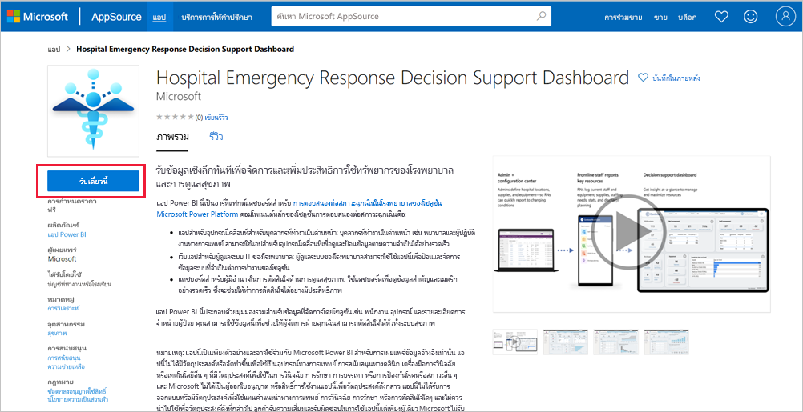](https://aka.ms/AppSource_Hospital_offer)

1. อ่านข้อมูลใน **สิ่งสุดท้ายที่ต้องทำเพิ่มเติม** แล้วเลือก **ดำเนินการต่อ**Read the information in **One more thing**, and select **Continue**.

    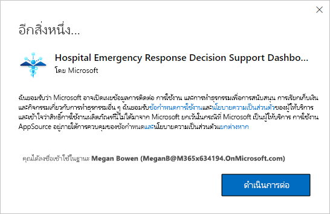

1. เลือก **ติดตั้ง**Select **Install**. 

    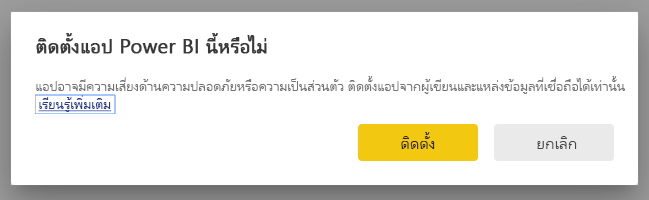

    หลังจากที่ติดตั้งแอปแล้ว คุณจะเห็นแอปบนหน้าแอปของคุณOnce the app has installed, you see it on your Apps page.

   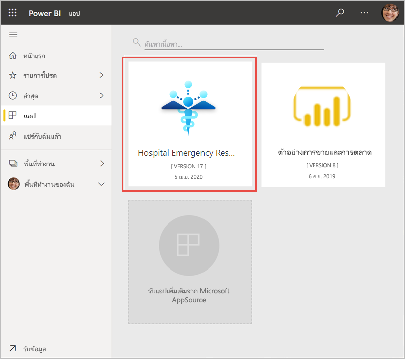

## เชื่อมต่อกับแหล่งข้อมูลConnect to data sources

1. เลือกไอคอนบนหน้าแอปของคุณเพื่อเปิดแอปSelect the icon on your Apps page to open the app.

1. บนหน้าจอเริ่มต้น เลือก **สำรวจ**On the splash screen, select **Explore**.

   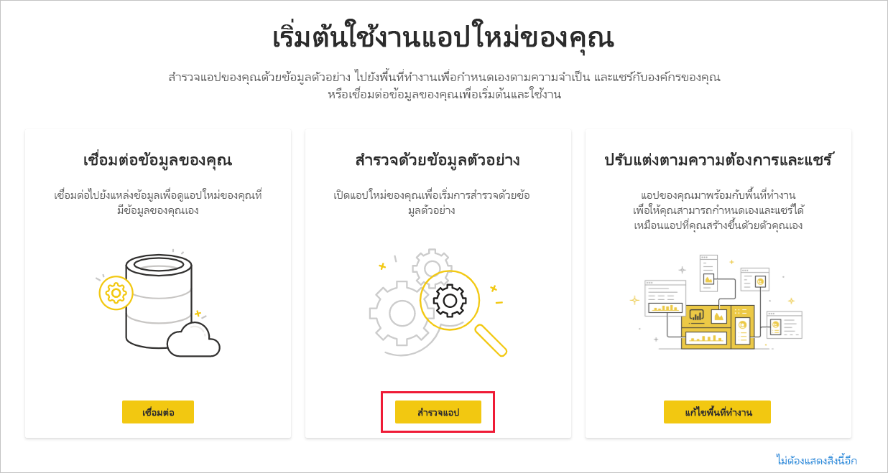

   แอปจะเปิดขึ้นและแสดงข้อมูลตัวอย่างThe app opens, showing sample data.

1. เลือกลิงก์ **เชื่อมต่อข้อมูลของคุณ** บนแบนเนอร์ที่ด้านบนของหน้าSelect the **Connect your data** link on the banner at the top of the page.

   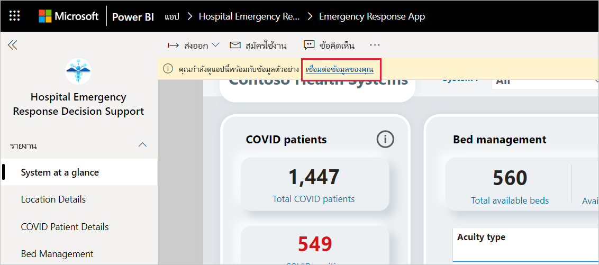

1. ในกล่องโต้ตอบ:In the dialog box:
   1. ในช่องชื่อองค์กร ให้ป้อนชื่อองค์กรของคุณ เช่น "Contoso Health Systems"In the organization name field, enter the name of your organization, for example, "Contoso Health Systems". คุณสามารถป้อนข้อมูลช่องนี้หรือไม่ก็ได้This field is optional. ชื่อนี้จะปรากฏที่ด้านบนซ้ายของแดชบอร์ดThis name appears in the upper-left side of the dashboard.
   1. ในช่อง CDS_base_solution ให้พิมพ์ [URL ของอินสแตนซ์สภาพแวดล้อม Common Data Service ของคุณ](/powerapps/sample-apps/emergency-response/deploy-configure#publish-the-power-bi-dashboard)In the CDS_base_solution field, Type the [URL of your Common Data Service environment instance](/powerapps/sample-apps/emergency-response/deploy-configure#publish-the-power-bi-dashboard). เช่น: https://[myenv].crm.dynamics.comFor example: https://[myenv].crm.dynamics.com. เมื่อป้อนเสร็จเรียบร้อย ให้คลิก **ถัดไป**When done, click **Next**.

   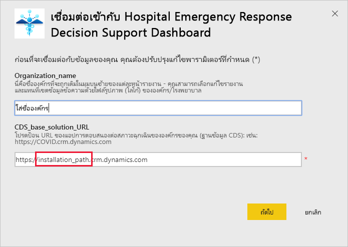

1. ในกล่องโต้ตอบที่ปรากฏขึ้นถัดไป ให้ตั้งค่าวิธีการรับรองความถูกต้องให้กับ **OAuth2**In the next dialog that appears, set the authentication method to **OAuth2**. คุณไม่ต้องปรับเปลี่ยนการตั้งค่าระดับความเป็นส่วนตัวใด ๆYou don't have to do anything to the privacy level setting.

   เลือก **ลงชื่อเข้าใช้**Select **Sign in**.

   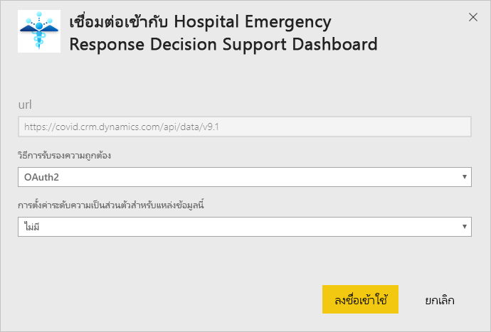

1. ที่หน้าจอลงชื่อเข้าใช้ของ Microsoft ใหลงชื่อเข้าใช้ Power BIAt the Microsoft sign-in screen, sign in to Power BI.

   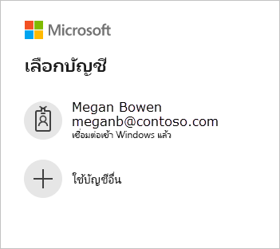

   หลังจากที่คุณลงชื่อเข้าใช้แล้ว รายงานจะเชื่อมต่อเข้ากับแหล่งข้อมูลและจะได้รับข้อมูลล่าสุดAfter you've signed in, the report connects to the data sources and is populated with up-to-date data. ในช่วงเวลานี้ ตัวตรวจสอบกิจกรรมจะเปิดทำงานDuring this time, the activity monitor turns.

   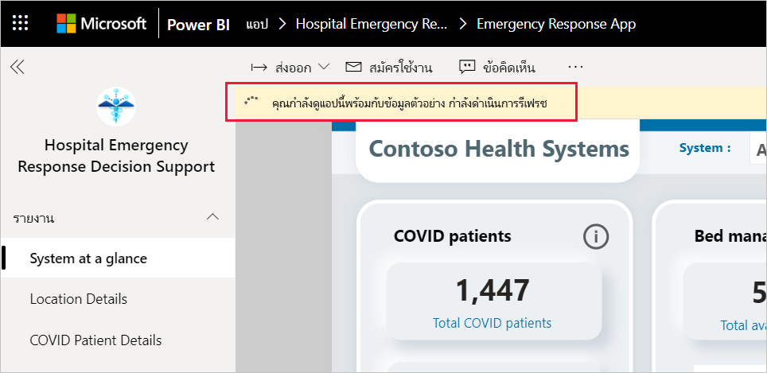

## กำหนดเวลาการรีเฟรชรายงานSchedule report refresh

เมื่อรีเฟรชข้อมูลแล้ว ให้[ตั้งค่ากำหนดเวลาการรีเฟรช](../connect-data/refresh-scheduled-refresh.md)เพื่อให้ข้อมูลรายงานเป็นข้อมูลล่าสุดอยู่เสมอWhen the data refresh has completed, [set up a refresh schedule](../connect-data/refresh-scheduled-refresh.md) to keep the report data up to date.

1. ในแถบส่วนหัวด้านบนสุด เลือก **Power BI**In the top header bar, select **Power BI**.

   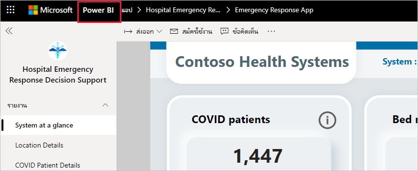

1. ในหน้าต่างนำทางด้านซ้าย มองหาแดชบอร์ดการสนับสนุนการตัดสินใจเกี่ยวกับการตอบสนองต่อสภาวะฉุกเฉินของโรงพยาบาลที่อยู่ใน **พื้นที่ทำงาน** แล้วปฏิบัติตามคำแนะนำที่อธิบายไว้ในบทความ [การปรับค่าการรีเฟรชตามกำหนดเวลา](../connect-data/refresh-scheduled-refresh.md)In the left navigation pane, look for the Hospital Emergency Response Decision Support Dashboard workspace under **Workspaces**, and follow the instructions described in the [Configure scheduled refresh](../connect-data/refresh-scheduled-refresh.md) article.

## ปรับแต่งตามความต้องการและแชร์Customize and share

คุณสามารถดูรายละเอียดได้ที่[ปรับแต่งและแชร์แอป](../connect-data/service-template-apps-install-distribute.md#customize-and-share-the-app)See [Customize and share the app](../connect-data/service-template-apps-install-distribute.md#customize-and-share-the-app) for details. ตรวจสอบให้มั่นใจว่าคุณได้อ่าน[ข้อความปฏิเสธความรับผิดชอบของรายงาน](../create-reports/sample-covid-19-us.md#disclaimers)ก่อนที่จะเผยแพร่หรือแจกจ่ายแอปBe sure to review the [report disclaimers](../create-reports/sample-covid-19-us.md#disclaimers) before publishing or distributing the app.

## ขั้นตอนถัดไปNext steps
* [การทำความเข้าใจรายงานของการตอบสนองต่อสภาวะฉุกเฉินของโรงพยาบาลUnderstanding the Hospital Emergency Response report](/powerapps/sample-apps/emergency-response/deploy-configure#view-the-power-bi-dashboard)
* [ตั้งค่าและเรียนรู้เกี่ยวกับตัวอย่างเทมเพลตของการสื่อสารในภาวะวิกฤติใน Power AppsSet up and learn about the Crisis Communication sample template in Power Apps](/powerapps/maker/canvas-apps/sample-crisis-communication-app)
* มีคำถามหรือไม่Questions? [ลองถามชุมชน Power BITry asking the Power BI Community](https://community.powerbi.com/)
* [แอปเทมเพลต Power BI คืออะไรWhat are Power BI template apps?](../connect-data/service-template-apps-overview.md)
* [ติดตั้งและแจกจ่ายแอปเทมเพลตในองค์กรของคุณInstall and distribute template apps in your organization](../connect-data/service-template-apps-install-distribute.md)