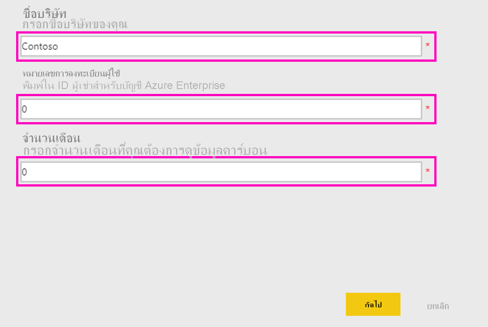

# หน้าการรองรับเครื่องคำนวณความยั่งยืนของ Microsoft

เครื่องคำนวณความยั่งยืนของ Microsoft ให้ข้อมูลเชิงลึกเกี่ยวกับการปลดปล่อยก๊าซคาร์บอนที่เกี่ยวข้องกับบริการของ Azure ผู้ที่รับผิดชอบในการรายงานและขับเคลื่อนความยั่งยืนภายในองค์กรขณะนี้มีความสามารถในการวัดผลกระทบของคาร์บอนของการสมัครใช้งาน Azure แต่ละครั้ง รวมถึงดูการประหยัดคาร์บอนโดยประมาณจากการดำเนินการปริมาณเหล่านั้นใน Azure กับศูนย์ข้อมูลภายในองค์กร ข้อมูลนี้อาจใช้สำหรับการรายงานก๊าซเรือนกระจกของการปล่อยมลพิษขอบเขต3

> [!NOTE]
> เวอร์ชันนี้ของตัวเชื่อมต่อนี้รองรับเฉพาะการลงทะเบียนแบบองค์กรจาก[พอร์ทัลของ Azure Enterprise](https://ea.azure.com) การลงทะเบียนในประเทศจีนยังใช้ไม่ได้ในขณะนี้

## สิ่งที่จำเป็นต้องมี

หากต้องการเข้าถึงเครื่องคำนวณความยั่งยืนของ Microsoft คุณจะต้องใช้ข้อมูลต่อไปนี้จากผู้ดูแลระบบ Azure ขององค์กรของคุณ:

- ID ผู้เช่า
- คีย์การเข้าถึง
- หมายเลขการลงทะเบียน
- เฉพาะบทบาทผู้ดูแลระบบ Azure เท่านั้นที่สามารถรับรองความถูกต้องและเชื่อมต่อเครื่องคิดเลขไปยังข้อมูลของบริษัทได้ (**เฉพาะสำหรับเวอร์ชันแสดงตัวอย่างของเดือนธันวาคม 2020**)

หากต้องการค้นหาหมายเลขการลงทะเบียนของบริษัทของคุณ ให้ทำดังนี้:

1. ลงชื่อเข้าใช้ใน [พอร์ทัล Azure Enterprise](https://ea.azure.com) ในฐานะผู้ดูแลระบบ
2. เลือก **Active Directory** หรือ **จัดการ** บนแถบนำทางด้านซ้าย หมายเลขการลงทะเบียนของบริษัทของคุณจะแสดงที่นี่:

   

หากต้องการค้นหาคีย์การเข้าถึงของบริษัทของคุณ ให้ทำดังนี้:

1. ลงชื่อเข้าใช้ใน [พอร์ทัล Azure Enterprise](https://ea.azure.com) ในฐานะผู้ดูแลระบบ
2. เลือก **รายงาน** จากนั้นเลือก **คีย์การเข้าถึง API** เพื่อขอรับคีย์บัญชีการลงทะเบียนหลัก

## เครื่องคำนวณความยั่งยืนเผยแพร่ในเดือนมกราคม 2020

### วิธีการเชื่อมต่อ

[!INCLUDE [powerbi-service-apps-get-more-apps](../includes/powerbi-service-apps-get-more-apps.md)]

3. เลือก **เครื่องคำนวณความยั่งยืนของ Microsoft** จากนั้นเลือก **รับทันที**

4. ใน **ติดตั้งแอป Power BI นี้หรือไม่** เลือก **ติดตั้ง**

5. ในบานหน้าต่าง **แอป** ให้เลือกไทล์ **เครื่องคำนวณความยั่งยืนของ Microsoft**

6. ในส่วน **เริ่มต้นใช้งานแอปใหม่ของคุณ** ให้เลือก **เชื่อมต่อ**

   

7. ป้อน **ชื่อบริษัท** และ **หมายเลขการลงทะเบียนผู้ใช้** และ **จำนวนเดือน** สำหรับข้อมูลเกี่ยวกับการขอรับหมายเลขการลงทะเบียนของคุณ ให้ดู[ข้อกำหนดเบื้องต้น](#prerequisites) เลือก **ถัดไป**

   

8. ป้อนข้อมูลต่อไปนี้:

   | ฟิลด์ | ค่า |
   | --- | --- |
   | **วิธีการรับรองความถูกต้อง** | เลือก **คีย์** |
   | **คีย์บัญชี** | ป้อนคีย์การเข้าถึงของคุณ |
   | **การตั้งค่าระดับความเป็นส่วนตัวสำหรับแหล่งข้อมูลนี้** | เลือก **องค์กร** |

   

9. เลือก **ลงชื่อเข้าใช้**

10. กระบวนการนำเข้าเริ่มต้นโดยอัตโนมัติ เมื่อเสร็จสิ้นแล้ว แดชบอร์ด รายงาน และแบบจำลองใหม่จะปรากฏใน **บานหน้าต่างนำทาง** เลือกรายงานเพื่อดูข้อมูลที่นำเข้าของคุณ

### การใช้แอป

หากต้องการอัปเดตพารามิเตอร์ ให้ทำดังนี้:

1. นำทางไปยังการตั้งค่า **ชุดข้อมูล** และเข้าถึงการตั้งค่าที่เกี่ยวข้องกับพื้นที่ทำงานของแอป
2. อัปเดต **ชื่อบริษัท** และ **หมายเลขการลงทะเบียนผู้ใช้** หรือ **จำนวนเดือน** หากจำเป็น
3. เลือก **รีเฟรช** เพื่อโหลดข้อมูลด้วยพารามิเตอร์ใหม่ที่ถูกนำไปใช้

## การเผยแพร่เครื่องคำนวณความยั่งยืน (ตัวอย่าง) ธันวาคม 2020

คำนวณการปล่อยคาร์บอนบนคลาวด์ของคุณวันนี้ด้วยเครื่องคำนวณความยั่งยืนของ Microsoft

การบัญชีคาร์บอนที่ถูกต้องต้องการข้อมูลที่ดีจากคู่ค้า ผู้ขาย และซัพพลายเออร์ เครื่องคำนวณความยั่งยืนของ Microsoft มอบความโปร่งใสในการปล่อยก๊าซคาร์บอนที่เกิดจากการใช้งาน Azure และ Microsoft Dynamics ของคุณ

บัญชีคาร์บอนของ Microsoft ขยายขอบเขตการปล่อยมลพิษทั้งสามขอบเขตด้วยวิธีการที่ตรวจสอบโดยมหาวิทยาลัยสแตนฟอร์ดในปี 2018 โดยใช้การบัญชีคาร์บอนที่สม่ำเสมอและแม่นยำเพื่อหาจำนวนผลกระทบของบริการคลาวด์ของ Microsoft ที่มีต่อผลกระทบด้านสิ่งแวดล้อมของลูกค้า Microsoft เป็นผู้ให้บริการระบบคลาวด์รายเดียวที่ให้ความโปร่งใสในระดับนี้แก่ลูกค้าในขณะที่รวบรวมรายงานสำหรับข้อกำหนดการรายงานโดยสมัครใจหรือตามกฎหมาย

### ก่อนที่คุณจะเริ่มต้น

เครื่องคำนวณความยั่งยืนของ Microsoft ทำงานบน Power BI Pro ถ้าคุณไม่มี Power BI Pro [ทดลองใช้ฟรีทันที](https://powerbi.microsoft.com/power-bi-pro)

คุณต้องมีหมายเลขการลงทะเบียน Azure หากคุณยังไม่มี ให้ขอความช่วยเหลือจากผู้ดูแลระบบ Azure ขององค์กร สำหรับข้อมูลเพิ่มเติม ให้ดู[ข้อกำหนดเบื้องต้น](#prerequisites)

### การเชื่อมต่อเครื่องเครื่องคำนวณ: ห้าขั้นตอนง่ายๆ ในการทำบัญชีใหเป็นคาร์บอน

1. ดาวน์โหลดแอปจาก [AppSource](https://go.microsoft.com/fwlink/?linkid=2151690)

   

   คุณยังสามารถค้นหาแอปใน Power BI ได้

   

2. เปิดแอป

3. ป้อนหมายเลขการลงทะเบียนของคุณ เลือก **เชื่อมต่อข้อมูลของคุณ** จากนั้นป้อนหมายเลขการลงทะเบียนของคุณ สำหรับข้อมูลเพิ่มเติมเกี่ยวกับการรับหมายเลขการลงทะเบียนของคุณ ให้ดู[ข้อกำหนดเบื้องต้น](#prerequisites)

   

4. เชื่อมต่อบัญชีของคุณ:
   - ใน **คุณกำลังเชื่อมต่อกับ (1 จาก 2)**  ภายใต้ **วิธีการรับรองความถูกต้อง** ให้เลือก **OAuth2** และภายใต้ **การตั้งค่าระดับความเป็นส่วนตัวสำหรับแหล่งข้อมูลนี้** ให้เลือก **องค์กร**

      
 
   - เลือกบัญชีผู้ใช้

      
       
   - ใน **คุณกำลังเชื่อมต่อกับ (2 จาก 2)**  ภายใต้ **วิธีการรับรองความถูกต้อง** ให้เลือก **OAuth2** และภายใต้ **การตั้งค่าระดับความเป็นส่วนตัวสำหรับแหล่งข้อมูลนี้** ให้เลือก **องค์กร**

     
    
5. รอให้มุมมองที่จะสร้างขึ้น ซึ่งอาจใช้เวลาถึง 24 ชั่วโมง

### แหล่งทรัพยากรเพิ่มเติม

- [วิดีโอวิธีการ](https://go.microsoft.com/fwlink/?linkid=2151608)
- [ประโยชน์ที่ได้รับจากคาร์บอนของการประมวลผลแบบคลาวด์: การศึกษาบนระบบคลาวด์ของ Microsoft ที่มีความสัมพันธ์กับ WSP](https://download.microsoft.com/download/7/3/9/739BC4AD-A855-436E-961D-9C95EB51DAF9/Microsoft_Cloud_Carbon_Study_2018.pdf)

### คำถามที่ถามบ่อย

#### การตั้งค่าแอป

**ฉันได้รับข้อผิดพลาดในขณะที่เชื่อมต่อข้อมูลของฉันด้วยเครื่องคำนวณ ฉันสามารถทำอะไรได้บ้าง**

ก่อนอื่น ให้ตรวจสอบการจัดการค่าใช้จ่ายของ Azure ที่คุณมีสิทธิ์ผู้ดูแลระบบ IT หากคุณไม่ต้องการ ให้ส่งคำขอการเข้าถึงนี้จากผู้ดูแลระบบของคุณ ถัดไป ทำให้แน่ใจว่าคุณกำลังใช้หมายเลขการลงทะเบียนที่ถูกต้อง

**ฉันป้อนหมายเลขการลงทะเบียนของฉัน แต่ไม่มีการโหลดข้อมูลบริษัทของฉัน ปัญหาคืออะไร**

การแสดงตัวอย่างสาธารณะของเครื่องคำนวณความยั่งยืนอาจใช้เวลาถึง 24 ชั่วโมงในการโหลดข้อมูลของคุณ ส่งกลับหลังจาก 24 ชั่วโมงและเลือกปุ่ม **รีเฟรช** ใน Power BI

**Microsoft พยายามเปลี่ยนความรับผิดชอบในการปล่อยมลพิษจาก Microsoft มาเป็นฉันหรือไม่**

หมายเลข การปล่อยคาร์บอนจากบริการ Azure ได้รับการรายงานว่าเป็นการปล่อยมลพิษในขอบเขต 1 และ 2 ของ Microsoft ซึ่งสอดคล้องกับ[โพรโทคอล Greenhouse Gas (GHG) ](https://ghgprotocol.org/) ที่เป็นมาตรฐานอุตสาหกรรม โพรโทคอล GHG กำหนดขอบเขต 3 ขอบเขตการปล่อยมลพิษเป็นการปล่อยที่หน่วยงานอื่นปล่อยออกมาในนามของคุณและจะนับเป็นสองเท่า เครื่องคำนวณความยั่งยืนของ Microsoft มอบความโปร่งใสใหม่ให้กับขอบเขต 3 ขอบเขตการปล่อยมลพิษที่เกี่ยวข้องกับการใช้บริการ Azure โดยเฉพาะขอบเขต 3 หมวด 1 "สินค้าและบริการที่ซื้อ"

**เหตุใดการปล่อยมลพิษของฉันจากการใช้งานคลาวด์ของ Microsoft จึงต่ำกว่าที่ควรเป็นอย่างมากหากฉันใช้โซลูชันภายในองค์กร**

Microsoft ดำเนินการ[การศึกษาซึ่งเผยแพร่ในปี 2018](https://blogs.microsoft.com/on-the-issues/2018/05/17/microsoft-cloud-delivers-when-it-comes-to-energy-efficiency-and-carbon-emission-reductions-study-finds/) ซึ่งประเมินความแตกต่างระหว่าง Microsoft cloud และในองค์กรหรือศูนย์ข้อมูลแบบเดิม ผลการวิจัยแสดงให้เห็นว่าการคำนวณและที่เก็บข้อมูล Azure นั้นประหยัดพลังงานมากกว่าศูนย์ข้อมูลองค์กรแบบเดิมถึง 52 ถึง 79 เปอร์เซ็นต์ ทั้งนี้ขึ้นอยู่กับการเปรียบเทียบที่เฉพาะเจาะจงที่ต่ำเกินไป ปานกลาง หรือมีประสิทธิภาพสูงในองค์กร เมื่อคำนึงถึงการซื้อพลังงานหมุนเวียนของเรา Azure มีประสิทธิภาพคาร์บอนมากกว่า 79 ถึง 98 เปอร์เซ็นต์ การประหยัดเหล่านี้เกิดจากฟีเจอร์หลักสี่ประการของ Microsoft Cloud: ประสิทธิภาพการดำเนินงานด้านไอที ประสิทธิภาพของอุปกรณ์ไอที ประสิทธิภาพโครงสร้างพื้นฐานของศูนย์ข้อมูล และไฟฟ้าหมุนเวียน

**หากการดำเนินงานของ Microsoft เป็นกลางและขับเคลื่อนโดยพลังงานหมุนเวียน เหตุใดการปล่อยมลพิษของลูกค้าจากบริการ Azure จึงไม่เป็นศูนย์**

มีสาเหตุหลัก 2 ประการที่การปล่อยมลพิษของลูกค้าจาก Microsoft ไม่เป็นศูนย์ ประการแรกเกี่ยวข้องกับแนวปฏิบัติทางการบัญชี GHG และประการที่สองเกี่ยวข้องกับขอบเขตของการวิเคราะห์นี้ เพื่อให้เกิดการทำงานที่เป็นกลางของคาร์บอน Microsoft ใช้การชดเชยคาร์บอนเพื่อลดแหล่งของการปล่อยก๊าซบางอย่างเช่นการเผาไหม้เชื้อเพลิงในสถานที่สำหรับเครื่องกำเนิดไฟฟ้าสำรอง สารทำความเย็น และยานพาหนะ สิ่งเหล่านี้ช่วยลดการปล่อยก๊าซ *สุทธิ* ของ Microsoft ให้เหลือศูนย์ เขาคำนวณรายงานการปล่อยก๊าซเรือนกระจก *รวม* ก่อนที่จะใช้การชดเชยเหล่านี้แม้ว่าจะมีการรายงานปริมาณการชดเชยและปริมาณการปล่อยมลพิษสุทธิในแท็บ **การรายงาน GHG** เพื่อความโปร่งใสมากยิ่งขึ้น เหตุผลประการที่สองคือนอกเหนือจากพลังงานและการปล่อยมลพิษที่เกี่ยวข้องกับการดำเนินงานของศูนย์ข้อมูลของ Microsoft แล้ว การปล่อยมลพิษยังรวมถึงพลังงานที่ผู้ให้บริการอินเทอร์เน็ตใช้นอกขอบเขตการดำเนินงานของ Microsoft เพื่อส่งข้อมูลระหว่างศูนย์ข้อมูล Microsoft และลูกค้า Azure

**ฉันควรใช้ข้อมูลนี้อย่างไร และฉันจะรายงานได้อย่างไร**

คุณสามารถรายงานการปล่อยมลพิษของคุณเป็นส่วนหนึ่งของขอบเขต 3 การปล่อยคาร์บอนทางอ้อมของบริษัท ของคุณ ขอบเขตที่ 3 การปล่อยมลพิษมักจะเปิดเผยในรายงานความยั่งยืน การเปลี่ยนแปลงสภาพภูมิอากาศของ CDP และหน่วยงานอื่นๆ นอกเหนือจากยอดรวมการปล่อยมลพิษแล้ว การประหยัดการปล่อยมลพิษยังเป็นตัวอย่างที่ชัดเจนว่าการตัดสินใจของ บริษัทของคุณในการใช้บริการ Microsoft Azure มีส่วนช่วยลดการปล่อยมลพิษทั่วโลกอย่างไร เพื่อให้เป็นบริบท แอปจะระบุไมล์รถที่เทียบเท่าที่หลีกเลี่ยงซึ่งสอดคล้องกับการลดการปล่อยก๊าซเรือนกระจกโดยพิจารณาจากปัจจัยการคำนวณความเทียบเท่าของ EPA ณ เดือนมกราคม 2020

**ฉันจะสามารถลดการปล่อยมลพิษได้อย่างไร**

การใช้ทรัพยากรและต้นทุนอย่างมีประสิทธิภาพใน Azure จะช่วยลดผลกระทบต่อสิ่งแวดล้อมจากการใช้ Azure ของคุณ ตัวอย่างเช่น เครื่องเสมือนที่ไม่ได้ใช้งานนั้นสิ้นเปลืองไม่ว่าจะอยู่ในระบบคลาวด์หรือในองค์กรก็ตาม เครื่องเสมือนที่ปรับขนาดให้เหมาะสมเพื่อปรับปรุงปัจจัยการใช้ประโยชน์เชิงคำนวณ (CUF) จะลดการใช้พลังงานต่อเอาต์พุตที่มีประโยชน์เช่นเดียวกับเซิร์ฟเวอร์จริง [การจัดการค่าใช้จ่าย Azure Cost](/azure/cost-management-billing/costs/cost-mgt-best-practices)  ช่วยให้คุณมีเครื่องมือในการวางแผนวิเคราะห์และลดค่าใช้จ่ายของคุณเพื่อเพิ่มการลงทุนบนคลาวด์ของคุณ

#### วิธีการ

**วิธีการที่อยู่เบื้องหลังเครื่องมือคืออะไร**

เครื่องคำนวณความยั่งยืนของ Microsoft สะท้อนให้เห็นถึงบริการคลาวด์เฉพาะที่ใช้และข้อกำหนดด้านพลังงานที่เกี่ยวข้องประสิทธิภาพของศูนย์ข้อมูลที่ให้บริการเหล่านั้น การผสมเชื้อเพลิงไฟฟ้าในภูมิภาคที่ศูนย์ข้อมูลเหล่านั้นดำเนินการ และการซื้อพลังงานหมุนเวียนของ Microsoft ในการพัฒนาแอปวิธีการและการนำไปใช้งานได้ผ่านการตรวจสอบจากบุคคลที่สามเพื่อให้แน่ใจว่าสอดคล้องกับสถาบันทรัพยากรโลก (WRI) /สภาธุรกิจโลกเพื่อการพัฒนาที่ยั่งยืน (WBCSD) ก๊าซเรือนกระจก (GHG) โพรโตคอลการบัญชีองค์กรและมาตรฐานการรายงาน ขอบเขตของการตรวจสอบดำเนินการตามมาตรฐาน ISO 14064-3: ก๊าซเรือนกระจก -- ส่วนที่ 3: ข้อมูลจำเพาะพร้อมคำแนะนำสำหรับการตรวจสอบความถูกต้องและการยืนยันของการยืนยันก๊าซเรือนกระจกรวมถึงการประมาณการปล่อยก๊าซจากบริการ Azure แต่ไม่รวมการประมาณการปล่อยก๊าซในสถานที่ตามลักษณะที่ไม่ตรงตามความจริงของการประมาณการนั้นๆ คำอธิบายโดยละเอียดเพิ่มเติมของการคำนวณคาร์บอนได้รับการบันทึกไว้ในแท็บ **วิธีการคำนวณ** ในเครื่องมือ

**ข้อมูลใดบ้างที่จำเป็นในการคำนวณ Azure carbon footprint คุณเข้าถึงข้อมูลของบริษัทของฉันหรือไม่**

การคำนวณคาร์บอนโดยประมาณจะดำเนินการตามปริมาณการใช้บริการ Azure ที่เข้าถึงโดยใช้รายได้ที่ใช้โดย Azure เครื่องคำนวณไม่เข้าถึงข้อมูลลูกค้าที่เก็บไว้ของคุณ ข้อมูลการใช้จะรวมกับข้อมูลการติดตามพลังงานและคาร์บอนของ Microsoft เพื่อคำนวณการปล่อยมลพิษโดยประมาณที่เกี่ยวข้องกับการใช้บริการ Azure ของคุณโดยพิจารณาจากศูนย์ข้อมูลที่ให้บริการเหล่านั้น

**การคำนวณนี้รวมบริการ Azure และภูมิภาค Azure ทั้งหมดหรือไม่**

ค่าประมาณรวมถึงบริการ Azure ทั้งหมดในภูมิภาค Azure ทั้งหมดที่เกี่ยวข้องกับ ID ผู้เช่าที่ให้ไว้ระหว่างการตั้งค่า

#### การระบุลักษณะการปล่อยมลพิษภายในองค์กร

**เครื่องคำนวณความยั่งยืนของ Microsoft จะรับข้อมูลเกี่ยวกับการปล่อยมลพิษและการดำเนินงานในองค์กรของฉันได้จากที่ใด**

เครื่องคำนวณความยั่งยืนของ Microsoft ไม่ได้รับข้อมูลใดๆ โดยเฉพาะเกี่ยวกับศูนย์ข้อมูลในองค์กรของคุณ *ยกเว้น* ข้อมูลที่คุณให้ไว้ ตามที่อธิบายไว้ในคำถามที่พบบ่อยที่ตามมา เครื่องคำนวณความยั่งยืนของ Microsoft อาศัยการวิจัยในอุตสาหกรรมและข้อมูลของผู้ใช้เกี่ยวกับประสิทธิภาพและการผสมผสานด้านพลังงานของทางเลือกในองค์กรเพื่อพัฒนาการประมาณการการปล่อยมลพิษภายในองค์กร

**อะไรคือสมมติฐานเกี่ยวกับการประมาณค่าภายในองค์กร การประหยัดประสิทธิภาพเป็นเพียงจากการปรับปรุงประสิทธิภาพการใช้พลังงาน (PUE) หรือไม่**

ประสิทธิภาพที่เกี่ยวข้องกับบริการคลาวด์ของ Microsoft มีมากกว่า PUE ที่ปรับปรุงใหม่ ในขณะที่ศูนย์ข้อมูลของ Microsoft มุ่งมั่นที่จะเพิ่มประสิทธิภาพ PUE แต่การปรับปรุงประสิทธิภาพเบื้องต้นมาจากประสิทธิภาพการดำเนินงานด้านไอที (การจัดเตรียมแบบไดนามิก การใช้งานหลายรุ่น การใช้เซิร์ฟเวอร์) และประสิทธิภาพของอุปกรณ์ไอที (การปรับแต่งฮาร์ดแวร์ให้เข้ากับบริการเพื่อให้มั่นใจว่าพลังงานจะไปสู่ผลลัพธ์ที่เป็นประโยชน์มากขึ้น) (ปรับปรุง PUE) [การศึกษาในปี 2018](https://blogs.microsoft.com/on-the-issues/2018/05/17/microsoft-cloud-delivers-when-it-comes-to-energy-efficiency-and-carbon-emission-reductions-study-finds/) ของเราจะวัดปริมาณการประหยัดเหล่านี้เมื่อเทียบกับทางเลือกในองค์กรที่หลากหลายตั้งแต่ศูนย์ข้อมูลประสิทธิภาพต่ำไปจนถึงศูนย์ข้อมูลประสิทธิภาพสูง การค้นพบนี้ใช้เพื่อประเมินการใช้พลังงานที่จำเป็นสำหรับศูนย์ข้อมูลภายในองค์กรที่เกี่ยวข้องเพื่อให้บริการแบบเดียวกับที่ลูกค้าแต่ละรายใช้บนคลาวด์ของ Microsoft

**ส่วนผสมของพลังงานที่สันนิษฐานสำหรับโครงสร้างพื้นฐานในองค์กรคืออะไร**

ตามค่าเริ่มต้นเครื่องคำนวณความยั่งยืนของ Microsoft จะประมาณการการปล่อยมลพิษภายในองค์กรโดยพิจารณาจากการผสมผสานระหว่างพลังงานหมุนเวียนและพลังงานที่ไม่สามารถต่ออายุได้บนกริด สันนิษฐานว่าศูนย์ข้อมูลภายในองค์กรจะอยู่ในตารางเดียวกับศูนย์ข้อมูลของ Microsoft อย่างไรก็ตาม สำหรับลูกค้าที่ซื้อไฟฟ้าหมุนเวียน *นอกเหนือจาก* สิ่งที่อยู่บนกริด (เช่น ผ่านข้อตกลงการซื้อไฟฟ้า) ผู้ใช้สามารถเลือกเปอร์เซ็นต์ของไฟฟ้าหมุนเวียนได้และเครื่องคำนวณความยั่งยืนของ Microsoft จะปรับเปลี่ยนในองค์กรการปล่อยมลพิษตามนั้น

**เมื่อใดที่ฉันควรเลือกขนาดต่ำ ปานกลาง หรือสูง เพื่อประสิทธิภาพของโครงสร้างพื้นฐานในองค์กร**

ผู้ใช้ควรเลือกประสิทธิภาพที่เป็นตัวแทนมากที่สุดของการปรับใช้ในสถานที่ที่ต้องการเปรียบเทียบโดยพิจารณาจากลักษณะของอุปกรณ์และศูนย์ข้อมูลที่นี่:

- **ต่ำ:** เซิร์ฟเวอร์จริงและหน่วยเก็บข้อมูลที่เชื่อมต่อโดยตรงในศูนย์ข้อมูลขนาดเล็ก (500-1,999 ตารางฟุต)
- **กลาง:** การผสมของเซิร์ฟเวอร์จริง/เสมือนและพื้นที่จัดเก็บข้อมูลที่แนบ/เฉพาะในศูนย์ข้อมูลภายในระดับกลาง (2,000-19,999 ตารางฟุต)
- **สูง:** เซิร์ฟเวอร์เสมือนและที่จัดเก็บเฉพาะในศูนย์ข้อมูลภายในขั้นสูง (> 20000 ตารางฟุต)