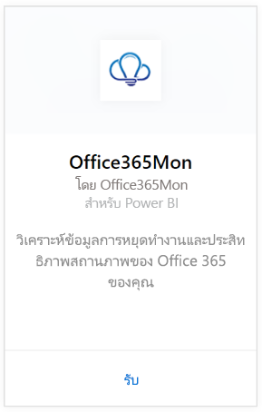
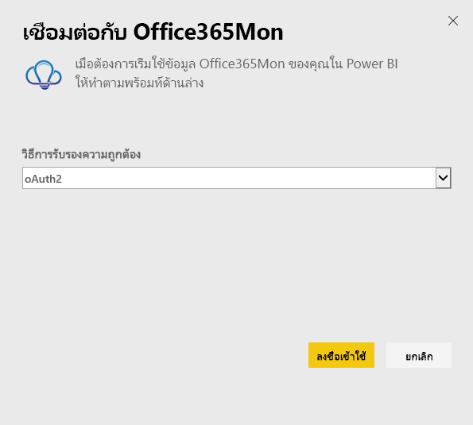
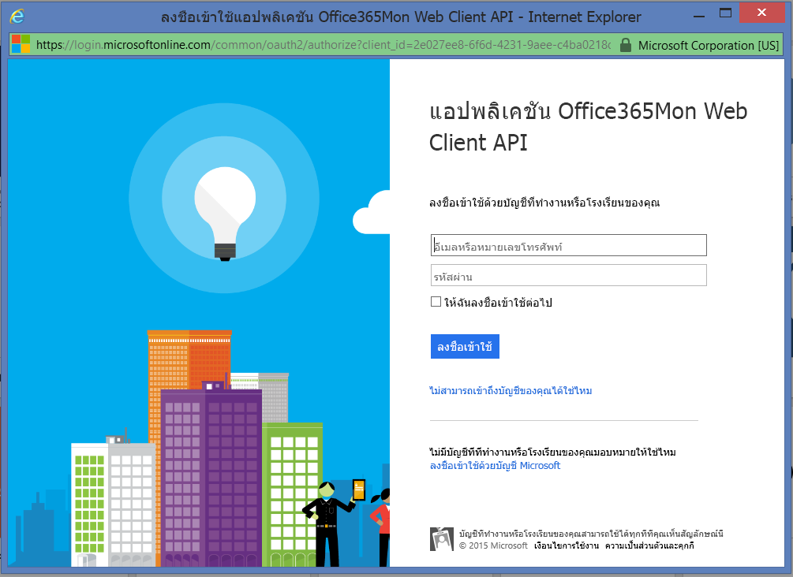
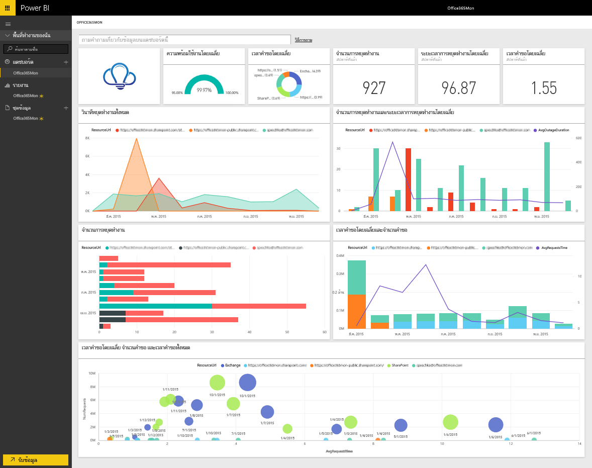

# เชื่อมต่อกับ Office365Mon ด้วย Power BIConnect to Office365Mon with Power BI
การวิเคราะห์การหยุดการทำงานและข้อมูลสมรรถนะการทำงานของ Office 365 ของคุณทำได้ง่ายด้วย Power BI และแอปแม่แบบ Office365MonAnalyzing your Office 365 outages and health performance data is easy with Power BI and the Office365Mon template app. Power BI ดึงข้อมูลของคุณ ทั้งการหยุดทำงานและปัญหาด้านสุขภาพ จากนั้นสร้างแดชบอร์ดแบบคิดนอกกรอบและรายงานที่ยึดตามข้อมูลนั้นPower BI retrieves your data, including outages and health probes, then builds an out-of-box dashboard and reports based on that data.

เชื่อมต่อไปยัง[แอปแม่แบบ Office365Mon](https://msit.powerbi.com/groups/me/getapps/services/office365mon.office365mon_powerbi_v3)สำหรับ Power BIConnect to the [Office365Mon template app](https://msit.powerbi.com/groups/me/getapps/services/office365mon.office365mon_powerbi_v3) for Power BI.

>[!NOTE]
>จำเป็นต้องมีบัญชีผู้ดูแลระบบ Office365Mon เพื่อเชื่อมต่อและโหลดแอปแม่แบบ Power BIAn Office365Mon admin account is required to connect and load the Power BI template app.

## วิธีการเชื่อมต่อHow to connect
1. เลือก **รับข้อมูล** ที่ด้านล่างของบานหน้าต่างนำทางSelect **Get Data** at the bottom of the nav pane.
   
   
2. ในกล่อง **บริการ** เลือก **รับ**In the **Services** box, select **Get**.
   
    
3. เลือก **Office365Mon** \> **รับ**Select **Office365Mon** \> **Get**.
   
   
4. สำหรับวิธีการรับรองความถูกต้อง ให้เลือก **oAuth2** \> **ลงชื่อเข้าใช้**For Authentication Method, select **oAuth2** \> **Sign In**.
   
   เมื่อไดถูกถาม ให้ใส่ข้อมูลประจำตัวของผู้ดูแลระบบ Office365Mon และทำตามกระบวนการรับรองความถูกต้องWhen prompted, enter your Office365Mon admin credentials and follow the authentication process.
   
   
   
   
5. หลังจากที่ Power BI นำเข้าข้อมูลแล้ว คุณจะเห็นแดชบอร์ด รายงาน และชุดข้อมูลใหม่ในบานหน้าต่างนำทางAfter Power BI imports the data you will see a new dashboard, report, and dataset in the nav pane. รายการใหม่ถูกทำเครื่องหมายด้วยเครื่องหมายดอกจันสีเหลือง \* เลือกกรอก Office365MonNew items are marked with a yellow asterisk \*, select the Office365Mon entry.
   
   

**ฉันต้องทำอะไรตอนนี้****What now?**

* ลอง[ถามคำถามในกล่อง Q&A](../consumer/end-user-q-and-a.md)ที่ด้านบนของแดชบอร์ดTry [asking a question in the Q&A box](../consumer/end-user-q-and-a.md) at the top of the dashboard
* [เปลี่ยนไทล์](../create-reports/service-dashboard-edit-tile.md)ในแดชบอร์ด[Change the tiles](../create-reports/service-dashboard-edit-tile.md) in the dashboard.
* [เลือกไทล์](../consumer/end-user-tiles.md)เพื่อเปิดรายงานด้านใน[Select a tile](../consumer/end-user-tiles.md) to open the underlying report.
* แม้ว่าชุดข้อมูลของคุณจะถูกกำหนดให้รีเฟรชรายวัน แต่คุณสามารถเปลี่ยนกำหนดการรีเฟรช หรือลองรีเฟรชตามความต้องการได้โดยใช้ **รีเฟรชเดี๋ยวนี้**While your dataset will be scheduled to refresh daily, you can change the refresh schedule or try refreshing it on demand using **Refresh Now**

## การแก้ไขปัญหาTroubleshooting
ถ้าคุณได้รับข้อผิดพลาด **"เข้าสู่ระบบล้มเหลว"** หลังจากใช้ข้อมูลประจำตัวของการสมัครใช้งาน Office365Mon เข้าระบบ จากนั้นบัญชีคุณไม่มีสิทธิ์ในการดึงข้อมูล Office365Mon จากบัญชีของคุณIf you get a **"login failed"** error after using your Office365Mon subscription credentials to login, then the account you are using doesn't have permissions to retrieve the Office365Mon data from your account. ตรวจสอบนี่เป็นบัญชีผู้ดูแลระบบ และลองอีกครั้งVerify it is an admin account and try again.

## ขั้นตอนถัดไปNext steps
[Power BI คืออะไรWhat is Power BI?](../fundamentals/power-bi-overview.md)

[รับข้อมูลสำหรับ Power BIGet Data for Power BI](service-get-data.md)
