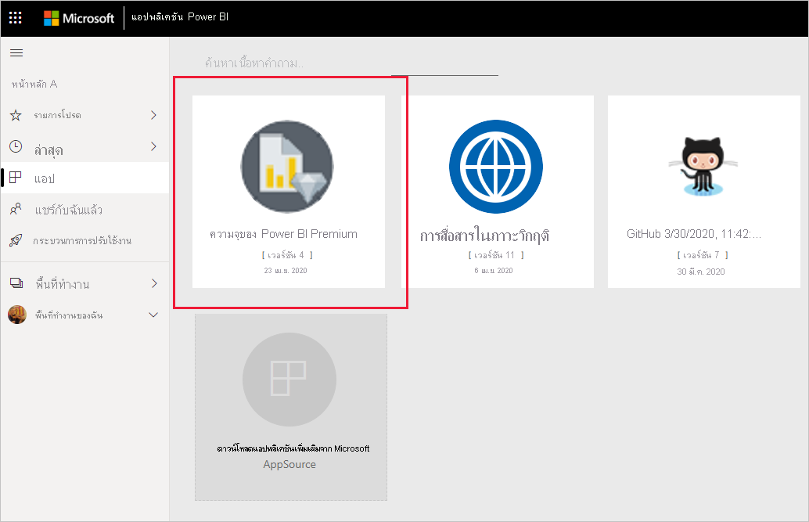
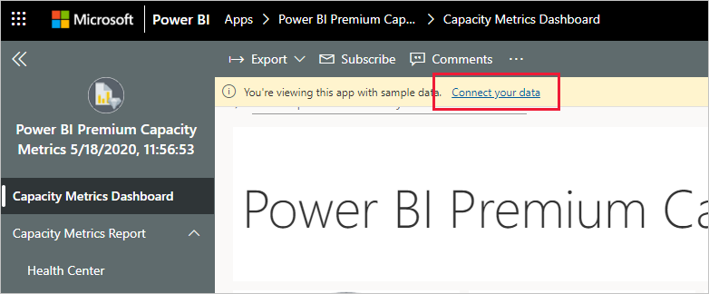
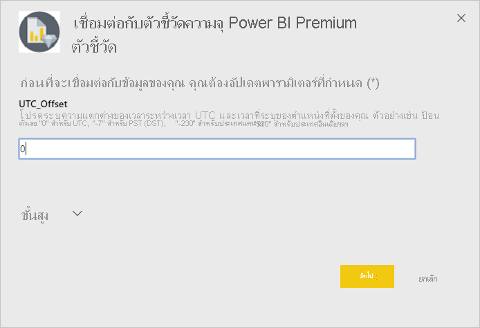
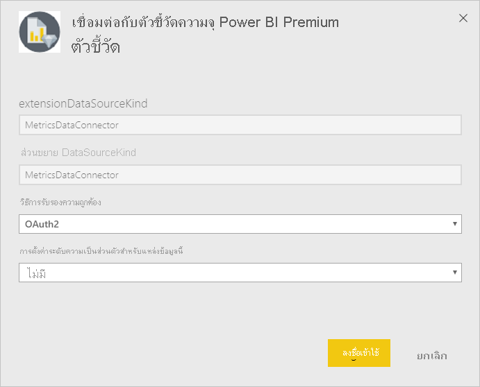
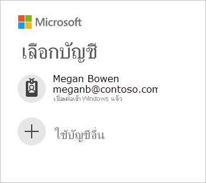
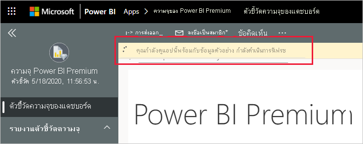
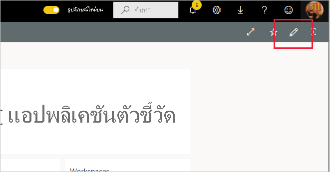

# เชื่อมต่อกับเมตริกความจุ Power BI PremiumConnect to Power BI Premium Capacity Metrics

การตรวจสอบความจุของคุณเป็นสิ่งสำคัญในการตัดสินใจอย่างชาญฉลาดว่าจะใช้ทรัพยากรความจุ Premium ของคุณให้ดีที่สุดได้อย่างไรMonitoring your capacities is essential to making informed decisions on how best to utilize your Premium capacity resources. แอปเมตริกความจุ Power BI Premium มีข้อมูลเชิงลึกมากที่สุดเกี่ยวกับวิธีการใช้งานความจุของคุณThe Power BI Premium Capacity Metrics app provides the most in-depth information into how your capacities are performing.

บทความนี้จะแจ้งวิธีการติดตั้งแอปและการเชื่อมต่อกับแหล่งข้อมูลThis article describes how to install the app and connect to data sources. สำหรับข้อมูลเกี่ยวกับเนื้อหาของรายงานและวิธีการใช้งาน ดู [ตรวจสอบความจุ Premium ด้วยแอป](../admin/service-admin-premium-monitor-capacity.md)และ [บล็อกโพสต์ของแอปเมตริกความจุ Power BI Premium](https://powerbi.microsoft.com/blog/premium-capacity-metrics-app-new-health-center-with-kpis-to-explore-relevant-metrics-and-steps-to-mitigate-issues/)For information about the contents of the report and how to use it, see [Monitor Premium capacities with the app](../admin/service-admin-premium-monitor-capacity.md), and the [Premium Capacity Metrics app blog post](https://powerbi.microsoft.com/blog/premium-capacity-metrics-app-new-health-center-with-kpis-to-explore-relevant-metrics-and-steps-to-mitigate-issues/).

หลังจากที่คุณได้ติดตั้งแอปและเชื่อมต่อกับแหล่งข้อมูลแล้ว คุณสามารถปรับแต่งรายงานได้ตามความต้องการของคุณAfter you've installed the app and connected to the data sources, you can customize the report as per your needs. จากนั้นคุณจะสามารถเผยแพร่รายงานให้กับเพื่อนร่วมงานในองค์กรของคุณได้You can then distribute it to colleagues in your organization.

> [!NOTE]
> การติดตั้งแอปเทมเพลตจำเป็นต้องใช้[สิทธิ์](./service-template-apps-install-distribute.md#prerequisites)Installing template apps requires [permissions](./service-template-apps-install-distribute.md#prerequisites). ติดต่อผู้ดูแลระบบ Power BI ของคุณ ถ้าคุณพบว่าคุณไม่มีสิทธิ์เพียงพอContact your Power BI admin if you find you don't have sufficient permissions.

## ติดตั้งแอปInstall the app

1. คลิกที่ลิงก์ต่อไปนี้เพื่อเข้าถึงแอป: [แอปเทมเพลตเมตริกความจุ Power BI Premium](https://app.powerbi.com/groups/me/getapps/services/pbi_pcmm.capacity-metrics-dxt)Click the following link to get to the app: [Power BI Premium Capacity Metrics template app](https://app.powerbi.com/groups/me/getapps/services/pbi_pcmm.capacity-metrics-dxt)

1. บนหน้า AppSource สำหรับแอป ให้เลือก [**รับทันที**](https://app.powerbi.com/groups/me/getapps/services/pbi_pcmm.capacity-metrics-dxt)On the AppSource page for the app, select [**GET IT NOW**](https://app.powerbi.com/groups/me/getapps/services/pbi_pcmm.capacity-metrics-dxt).

    

1. เลือก **ติดตั้ง**Select **Install**. 

    

    > [!NOTE]
    > ถ้าคุณได้ติดตั้งแอปก่อนหน้านี้แล้ว คุณจะถูกถามว่าคุณต้องการ [เขียนทับการติดตั้ง](./service-template-apps-install-distribute.md#update-a-template-app) หรือติดตั้งไปยังพื้นที่ทำงานใหม่If you've installed the app previously, you will be asked whether you want to [overwrite that installation](./service-template-apps-install-distribute.md#update-a-template-app) or install to a new workspace.

    หลังจากที่ติดตั้งแอปแล้ว คุณจะเห็นแอปบนหน้าแอปของคุณOnce the app has installed, you see it on your Apps page.

   

## เชื่อมต่อกับแหล่งข้อมูลConnect to data sources

1. เลือกไอคอนบนหน้าแอปของคุณเพื่อเปิดแอปSelect the icon on your Apps page to open the app.

1. บนหน้าจอเริ่มต้น เลือก **สำรวจ**On the splash screen, select **Explore**.

   

   แอปจะเปิดขึ้นและแสดงข้อมูลตัวอย่างThe app opens, showing sample data.

1. เลือกลิงก์ **เชื่อมต่อข้อมูลของคุณ** บนแบนเนอร์ที่ด้านบนของหน้าSelect the **Connect your data** link on the banner at the top of the page.

   

1. ในกล่องโต้ตอบที่ปรากฏขึ้น ให้ตั้งค่าออฟเซต UTC นั่นคือความแตกต่างของชั่วโมงระหว่างเวลามาตรฐานสากลและเวลาในตำแหน่งที่ตั้งของคุณIn the dialog box that appears, set the UTC offset, that is, the difference in hours between Coordinated Universal Time and the time in your location. จากนั้น คลิก **ถัดไป**Then click **Next**.
  
   
   **หมายเหตุ: รูปแบบสำหรับครึ่งชั่วโมงควรเป็นทศนิยม (ตัวอย่างเช่น 5.5, 2.5, ฯลฯ)**
**Note: The format for half hours should be decimal (for example, 5.5, 2.5, etc.).**

1. ในกล่องโต้ตอบถัดไปที่ปรากฏขึ้น คุณไม่จำเป็นต้องทำอะไรIn the next dialog that appears, you don't have to do anything. เพียงแค่เลือก **ลงชื่อเข้าใช้**Just select **Sign in**.

   

1. ที่หน้าจอลงชื่อเข้าใช้ของ Microsoft ใหลงชื่อเข้าใช้ Power BIAt the Microsoft sign-in screen, sign in to Power BI.

   

   หลังจากที่คุณลงชื่อเข้าใช้แล้ว รายงานจะเชื่อมต่อเข้ากับแหล่งข้อมูลและจะได้รับข้อมูลล่าสุดAfter you've signed in, the report connects to the data sources and is populated with up-to-date data. ในช่วงเวลานี้ ตัวตรวจสอบกิจกรรมจะเปิดทำงานDuring this time, the activity monitor turns.

   

   ข้อมูลรายงานของคุณจะรีเฟรชโดยอัตโนมัติหนึ่งครั้งต่อวัน เว้นแต่ว่าคุณจะปิดใช้งานการดำเนินการนี้ในระหว่างกระบวนการลงชื่อเข้าใช้Your report data will automatically refresh once a day, unless you disabled this during the sign-in process. นอกจากนี้ คุณยังสามารถ [ตั้งค่าตารางเวลาการรีเฟรชของคุณเอง](./refresh-scheduled-refresh.md) เพื่อรักษาข้อมูลรายงานให้เป็นปัจจุบันหากคุณต้องการYou can also [set up your own refresh schedule](./refresh-scheduled-refresh.md) to keep the report data up to date if you so desire.

## ปรับแต่งตามความต้องการและแชร์Customize and share

เมื่อต้องการเริ่มต้นการปรับแต่งแอปตามความต้องการ ให้คลิกที่ไอคอนรูปดินสอในมุมบนขวาTo start customizing the app, click the pencil icon in the upper right corner.

 

คุณสามารถดูรายละเอียดได้ที่[ปรับแต่งและแชร์แอป](./service-template-apps-install-distribute.md#customize-and-share-the-app)See [Customize and share the app](./service-template-apps-install-distribute.md#customize-and-share-the-app) for details.

## ขั้นตอนถัดไปNext steps
* [ตรวจสอบความจุ Premium ด้วยแอปMonitor Premium capacities with the app](../admin/service-admin-premium-monitor-capacity.md)
* [บล็อกโพสต์ของแอปเมตริกความจุ Power BI PremiumPremium Capacity Metrics app blog post](https://powerbi.microsoft.com/blog/premium-capacity-metrics-app-new-health-center-with-kpis-to-explore-relevant-metrics-and-steps-to-mitigate-issues/)
* [แอปเทมเพลต Power BI คืออะไรWhat are Power BI template apps?](./service-template-apps-overview.md)
* [ติดตั้งและแจกจ่ายแอปเทมเพลตในองค์กรของคุณInstall and distribute template apps in your organization](./service-template-apps-install-distribute.md)
* มีคำถามหรือไม่Questions? [ลองถามชุมชน Power BITry asking the Power BI Community](https://community.powerbi.com/)