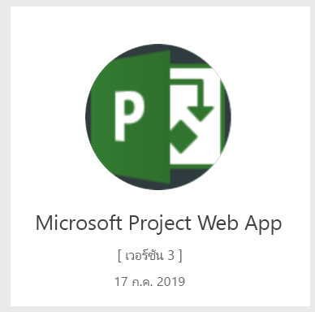

# เชื่อมต่อไปยัง Project Web App ด้วย Power BIConnect to Project Web App with Power BI
Microsoft Project Web App เป็นโซลูชันออนไลน์ที่ยืดหยุ่นสำหรับการจัดการพอร์ตโครงการ (PPM) และงานประจำวันMicrosoft Project Web App is a flexible online solution for project portfolio management (PPM) and everyday work. Project Web App ช่วยให้องค์กรสามารถเริ่มต้นและจัดลำดับความสำคัญการลงทุนในพอร์ตโครงการ และส่งมอบมูลค่าทางธุรกิจตามที่ต้องการได้Project Web App enables organizations to get started, prioritize project portfolio investments and deliver the intended business value. Project Web App Template App สำหรับ Power BI ช่วยให้คุณสามารถปลดล็อคข้อมูลเชิงลึกจาก Project Web App เพื่อจัดการโครงการ พอร์ตโครงการ และทรัพยากรThe Project Web App Template App for Power BI allows you to unlock insight from Project Web App to help manage projects, portfolios and resources.

เชื่อมต่อไปยัง [Project Web App Template App](https://appsource.microsoft.com/product/power-bi/pbi_msprojectonline.pbi-microsoftprojectwebapp) สำหรับ Power BIConnect to the [Project Web App Template App](https://appsource.microsoft.com/product/power-bi/pbi_msprojectonline.pbi-microsoftprojectwebapp) for Power BI.

## วิธีการเชื่อมต่อHow to connect

1. เลือก **แอป** ในบานหน้าต่างนำทาง > เลือก **รับแอป** ในมุมบนขวาSelect **Apps** in the nav pane > select **Get apps** in the upper right corner.

    

2. ในกล่อง **บริการ** เลือก **รับ**In the **Services** box, select **Get**.
   
   
3. ใน AppSource เลือกแท็บ **Apps** และค้นหา/เลือก **Microsoft Project Web App**In AppSource, select the **Apps** tab, and search/select **Microsoft Project Web App**.
   
4. คุณจะได้รับข้อความที่บอกว่า - **ติดตั้งแอป Power BI นี้หรือไม่** เลือก **ติดตั้ง**You will get a message saying - **Install this Power BI App?** select **Install**. 

   
5. ในบานหน้าต่าง **แอป** ให้เลือกไทล์ **Microsoft Project Web App**In the **Apps** pane, select the **Microsoft Project Web App** tile. 
   
   
6. ใน **เริ่มต้นใช้งานแอปใหม่ของคุณ** ให้เลือก **เชื่อมต่อข้อมูล**In **Get started with your new app**, select **Connect data**.
   
   
7. ในกล่องข้อความ **Project Web App URL** ใส่ URL สำหรับ Project Web App (PWA) ที่คุณต้องการเชื่อมต่อIn the **Project Web App URL** text box, enter the URL for the Project Web App (PWA) you want to connect to.  หมายเหตุ ส่วนนี้อาจแตกต่างจากตัวอย่างดังกล่าวถ้าคุณมีโดเมนแบบกำหนดเองNote this may differ from the example if you have a custom domain. ในกล่องข้อความ **PWA ไซต์ภาษา** พิมพ์หมายเลขที่แสดงภาษาของไซต์ PWA ของคุณIn the **PWA Site Language** text box, type the number that corresponds to your PWA site language. พิมพ์ตัวเลขหลักเดียว '1' สำหรับภาษาอังกฤษ '2' สำหรับภาษาฝรั่งเศส '3' สำหรับภาษาเยอรมัน '4' สำหรับภาษาโปรตุเกส (บราซิล), ' 5' สำหรับภาษาโปรตุเกส (โปรตุเกส) และ ' 6' สำหรับภาษาสเปนType the single digit '1' for English, '2' for French, '3' for German, '4' for Portuguese (Brazil), '5' for Portuguese (Portugal) and '6' for Spanish. 
   
   
8. สำหรับวิธีการรับรองความถูกต้อง ให้เลือก **oAuth2** \> **ลงชื่อเข้าใช้**For Authentication Method, select **oAuth2** \> **Sign In**. เมื่อได้รับข้อความปรากฏขึ้น ให้ใส่ข้อมูลประจำตัวของ Project Web App และทำตามกระบวนการรับรองความถูกต้องWhen prompted, enter your Project Web App credentials and follow the authentication process.

    > [!NOTE]
    > คุณจำเป็นต้องมีสิทธิ์การใช้งานสำหรับ Portfolio Viewer (ผู้ดูพอร์ตโครงการ) Portfolio Manager (ผู้จัดการพอร์ต) หรือ Administrator (ผู้ดูแลระบบ) สำหรับ Project Web App ที่คุณกำลังเชื่อมต่อYou need to have Portfolio Viewer, Portfolio Manager, or Administrator permissions for the Project Web App you are connecting to.

9. คุณจะเห็นการแจ้งเตือนที่ระบุว่า กำลังโหลดข้อมูลของคุณYou’ll see a notification indicating your data is loading. ขึ้นอยู่กับขนาดบัญชีของคุณ ซึ่งอาจใช้เวลาสักครู่Depending on the size of your account this may take some time. หลังจากที่ Power BI นำเข้าข้อมูลแล้ว คุณจะเห็นเนื้อหาของพื้นที่ทำงานใหม่ของคุณAfter Power BI imports the data, you will see the contents of your new workspace. คุณอาจจำเป็นต้องรีเฟรชชุดข้อมูลเพื่อรับการอัปเดตล่าสุดYou may need to refresh the dataset to get the latest updates. 

    หลังจากที่ Power BI นำเข้าข้อมูลแล้ว คุณจะเห็นรายงานที่มี 13 หน้า และชุดข้อมูลในบานหน้าต่างนำทางAfter Power BI imports the data you will see the report with 13 pages and dataset in the nav pane. 

10. หลังจากรายงานของคุณพร้อม ดำเนินการต่อและเริ่มการสำรวจข้อมูล Project Web App!Once your reports are ready, go ahead and start exploring your Project Web App data! Template App มาพร้อมกับรายงาน 13 หน้าที่เป็นภาพรวมการจัดการพอร์ตโครงการ (6 หน้ารายงาน), ภาพรวมทรัพยากร (5 หน้ารายงาน) และ สถานะของโครงการ (2 หน้ารายงาน)The Template App comes with 13 rich and detailed reports for the Portfolio Overview (6 report pages), Resource Overview (5 report pages) and Project Status (2 report pages). 

    
   
    
   
    

**ฉันต้องทำอะไรตอนนี้****What now?**

* แม้ว่าชุดข้อมูลของคุณจะถูกกำหนดให้รีเฟรชรายวัน แต่คุณสามารถเปลี่ยนกำหนดการรีเฟรช หรือลองรีเฟรชตามความต้องการได้โดยใช้ **รีเฟรชเดี๋ยวนี้**While your dataset will be scheduled to refresh daily, you can change the refresh schedule or try refreshing it on demand using **Refresh Now**.

**ขยาย Template App****Expand the Template App**

ดาวน์โหลด[GitHub PBIT ไฟล์](https://github.com/OfficeDev/Project-Power-BI-Content-Packs)เมื่อต้องการกำหนดค่า และปรับปรุงชุดเนื้อหาDownload the [GitHub PBIT file](https://github.com/OfficeDev/Project-Power-BI-Content-Packs) to further customize and update the Content Pack.

## ขั้นตอนถัดไปNext steps
[เริ่มต้นใช้งานใน Power BIGet started in Power BI](../fundamentals/service-get-started.md)

[รับข้อมูลใน Power BIGet data in Power BI](service-get-data.md)
