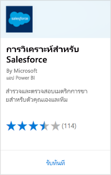
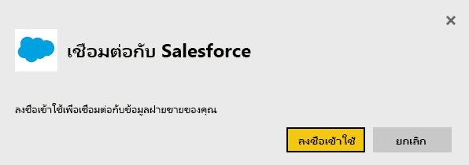
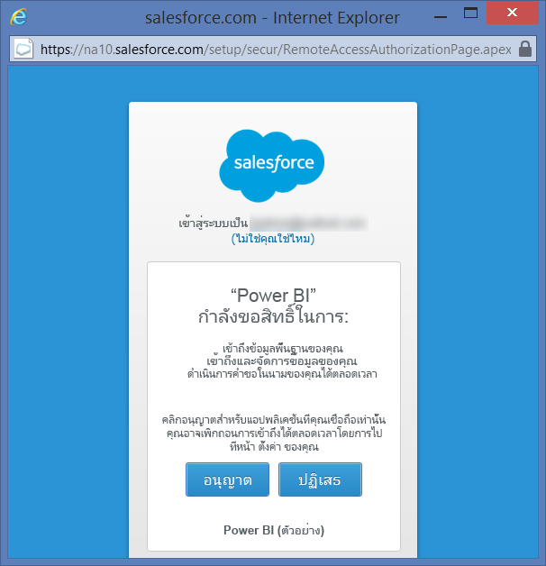
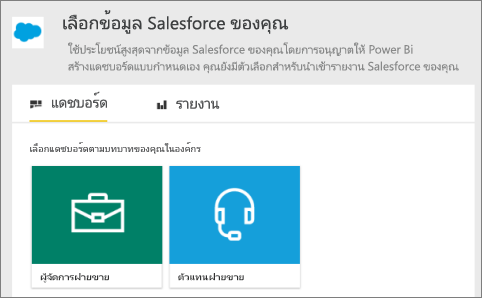
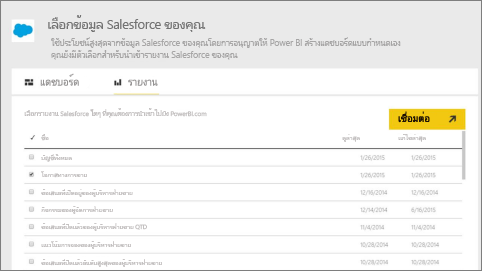
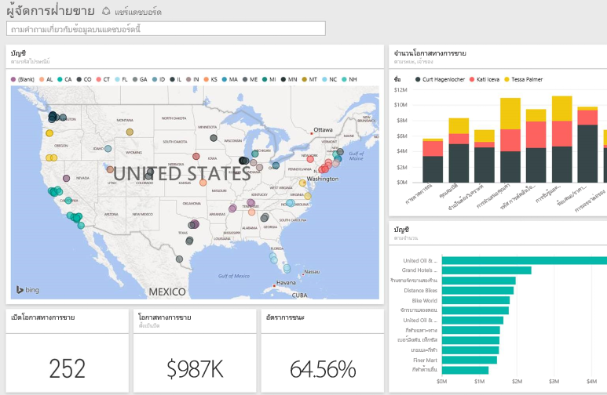

# เชื่อมต่อกับ Salesforce ด้วย Power BIConnect to Salesforce with Power BI
ด้วย Power BI คุณสามารถเชื่อมต่อกับบัญชี Salesforce.com ของคุณได้อย่างง่ายดายWith Power BI, you can easily connect to your Salesforce.com account. ด้วยการเชื่อมต่อนี้ คุณสามารถค้นคืนข้อมูล Salesforce ของคุณ และมีแดชบอร์ดและรายงานโดยอัตโนมัติที่ให้มาWith this connection, you can retrieve your Salesforce data and have a dashboard and reports automatically provided.

อ่านเพิ่มเติมเกี่ยวกับ[การรวม Salesforce ](https://powerbi.microsoft.com/integrations/salesforce)ด้วย Power BIRead more about the [Salesforce integration](https://powerbi.microsoft.com/integrations/salesforce) with Power BI.

## วิธีการเชื่อมต่อHow to connect
1. ใน Power BI ให้เลือก **รับข้อมูล** ที่ด้านล่างของบานหน้าต่างนำทางIn Power BI, select **Get Data** at the bottom of the nav pane.
   
    
2. ในกล่อง **บริการ** เลือก **รับ**In the **Services** box, select **Get**.
   
    
3. เลือก **วิเคราะห์สำหรับ Salesforce** และเลือก **รับ**Select **Analytics for Salesforce** and select **Get**.  
   
   
4. เลือก **ลงชื่อเข้าใช้** เพื่อเริ่มการลงชื่อเข้าใช้ในโฟลว์Select **Sign In** to start the sign in flow.
   
    
5. เมื่อมีข้อความถาม ให้ใส่ข้อมูลประจำตัวของ SalesforceWhen prompted, enter your Salesforce credentials. คลิก **อนุญาต** และอนุญาตให้ Power BI เข้าถึงข้อมูล Salesforce พื้นฐานและข้อมูลของคุณSelect **Allow** and let Power BI access your basic Salesforce information and data.
   
   
6. กำหนดค่าสิ่งที่คุณต้องการนำเข้าลงใน Power BI โดยใช้ตัวเลือกรายการเลือกแบบดึงลงConfigure what you'd like to import into Power BI using the drop-down option:
   
   * **แดชบอร์ด****Dashboard**
     
     เลือกแดชบอร์ดที่กำหนดไว้ล่วงหน้าโดยยึดตาม persona (เช่น **ผู้จัดการฝ่ายขาย**)Select a predefined dashboard based on a persona (such as **Sales Manager**). แดชบอร์ดเหล่านี้จะค้นคืนชุดข้อมูลมาตรฐานเฉพาะจาก Salesforce และจะไม่รวมเขตข้อมูลแบบกำหนดเองThese dashboards retrieve a specific set of Salesforce standard data, which doesn't include custom fields.
     
     
   * **รายงาน****Reports**
     
     เลือกอย่างน้อยหนึ่งรายงานแบบกำหนดเองจากบัญชี Salesforce ของคุณSelect one or more custom reports from your Salesforce account. รายงานเหล่านี้ตรงกับมุมมองของคุณใน Salesforce และสามารถรวมข้อมูลจากเขตข้อมูลแบบกำหนดเองหรือวัตถุThese reports match your views in Salesforce and can include data from custom fields or objects.
     
     
     
     ถ้าคุณไม่เห็นรายงานใดๆ ให้เพิ่มหรือสร้าบัญชี Salesforce ของคุณ แล้วลองเชื่อมต่ออีกครั้งIf you don't see any reports, add or create them in your Salesforce account and try connecting again.

7. คลิก **เชื่อมต่อ** เพื่อเริ่มกระบวนการนำเข้าSelect **Connect** to begin the import process. ในระหว่างการนำเข้า คุณเห็นการแจ้งเตือนที่แสดงว่าการนำเข้ากำลังดำเนินการอยู่During the import, you see a notification showing the import is in progress. เมื่อนำเข้าเสร็จสมบูรณ์ คุณจะเห็นแดชบอร์ด รายงาน และชุดข้อมูลสำหรับข้อมูล Salesforce ของคุณที่แสดงอยู่ในบานหน้าต่างนำทางWhen the import is complete, you see a dashboard, report, and dataset for your Salesforce data listed in the nav pane.
   
   

คุณสามารถปรับเปลี่ยนแดชบอร์ดเพื่อแสดงข้อมูลของคุณด้วยวิธีที่คุณต้องการYou can change the dashboard to display your data how you'd like. คุณสามารถถามคำถาม Q&A หรือ [เลือกไทล์](../consumer/end-user-tiles.md) เพื่อเปิดรายงานด้านในและ[แก้ไข หรือลบไทล์ในแดชบอร์ดออก](../create-reports/service-dashboard-edit-tile.md)You can ask questions with Q&A or [select a tile](../consumer/end-user-tiles.md) to open the underlying report and [edit or remove dashboard tiles](../create-reports/service-dashboard-edit-tile.md).

**ฉันต้องทำอะไรตอนนี้****What now?**

* ลอง[ถามคำถามในกล่อง Q&A](../consumer/end-user-q-and-a.md)ที่ด้านบนของแดชบอร์ดTry [asking a question in the Q&A box](../consumer/end-user-q-and-a.md) at the top of the dashboard
* [แก้ไข หรือลบไทล์](../create-reports/service-dashboard-edit-tile.md)ในแดชบอร์ดออก[Edit or remove a tile](../create-reports/service-dashboard-edit-tile.md) in the dashboard
* [เลือกไทล์](../create-reports/service-dashboard-tiles.md)เพื่อเปิดรายงานด้านใน[Select a tile](../create-reports/service-dashboard-tiles.md) to open the underlying report
* แม้ว่าชุดข้อมูลของคุณถูกกำหนดให้รีเฟรชรายวัน แต่คุณสามารถปรับเปลี่ยนกำหนดการรีเฟรช หรือลองรีเฟรชตามความต้องการได้โดยใช้ **รีเฟรชตอนนี้**While your dataset is scheduled to refresh daily, you can change the refresh schedule or try refreshing it on demand using **Refresh Now**

## ข้อกำหนดของระบบและข้อควรพิจารณาSystem requirements and considerations

- เชื่อมต่อกับบัญชีผลิตภัณฑ์ Salesforce ที่สามารถเข้าถึง API ที่เปิดใช้งานConnected with a production Salesforce account that has API access enabled

- สิทธิที่มอบให้กับแอป Power BI ในระหว่างการลงชื่อเข้าใช้Permission granted to the Power BI app during sign in

- บัญชีมีการเรียกใช้ API เพียงพอที่สามารถใช้งานดึงและรีเฟรชข้อมูลThe account has sufficient API calls available to pull and refresh the data

- โทเค็นรับรองตัวตนที่จำเป็นกับการรีเฟรชA valid authentication token is required for refresh. Salesforce มีขีดจำกัดของโทเค็นรับรองตัวตนห้าโทเค็นต่อแอปพลิเคชัน ดังนั้นเพื่อให้แน่ใจว่า คุณมีชุดข้อมูล Salesforce ที่นำเข้า 5 ชุดหรือน้อยกว่าSalesforce has a limit of five authentication tokens per application so make sure you've five or less Salesforce data sets imported.

- Salesforce Reports API มีข้อจำกัดที่สนับสนุนสูงสุด 2,000 แถวข้อมูลThe Salesforce Reports API has a restriction that supports up to 2,000 rows of data.

## การแก้ไขปัญหาTroubleshooting

ถ้าคุณพบข้อผิดพลาดใด ๆ โดยบังเอิญ ให้ตรวจสอบความต้องการด้านบนIf you come across any errors, review the requirements above. 

ขณะนี้ยังไม่รองรับการลงชื่อเข้าใช้บนโดเมนระบบทดสอบหรือแบบกำหนดเองSigning in to a custom or sandbox domain isn't currently supported.

### ข้อความ “ไม่สามารถเชื่อมต่อกับเซิร์ฟเวอร์ระยะไกลได้”"Unable to connect to the remote server" message

ถ้าคุณได้รับข้อความ "ไม่สามารถเชื่อมต่อกับเซิร์ฟเวอร์ระยะไกล" เมื่อพยายามเชื่อมต่อกับบัญชี Salesforce ของคุณ ให้ดูโซลูชันนี้บนฟอรั่มต่อไปนี้: [ข้อความข้อผิดพลาดการลงชื่อเข้าใช้ระบบตัวเชื่อมต่อ Salesforce: ไม่สามารถเชื่อมต่อกับเซิร์ฟเวอร์ระยะไกลได้](https://www.outsystems.com/forums/Forum_TopicView.aspx?TopicId=17674&TopicName=log-in-error-message-unable-to-connect-to-the-remote-server&)If you get an "Unable to connect to the remote server" message when trying to connect to your Salesforce account, see this solution on the following forum: [Salesforce Connector sign in Error Message: Unable to connect to the remote server](https://www.outsystems.com/forums/Forum_TopicView.aspx?TopicId=17674&TopicName=log-in-error-message-unable-to-connect-to-the-remote-server&)

## ขั้นตอนถัดไปNext steps
[Power BI คืออะไรWhat is Power BI?](../fundamentals/power-bi-overview.md)

[แหล่งข้อมูลสำหรับบริการ Power BIData sources for the Power BI service](service-get-data.md)
