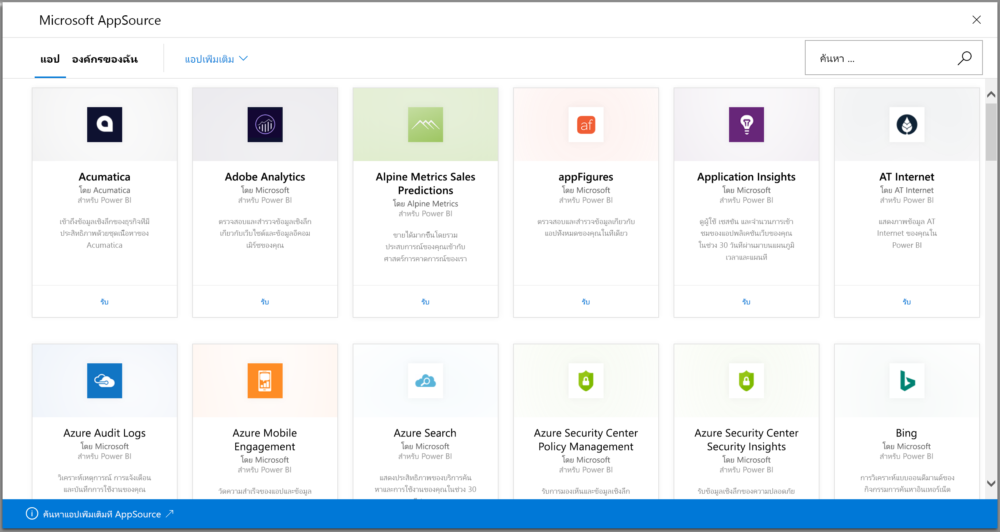
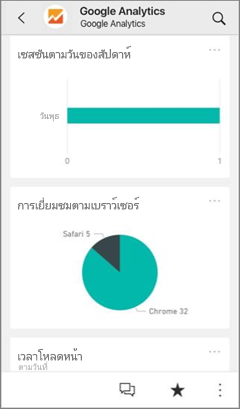
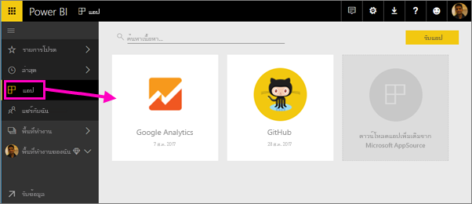
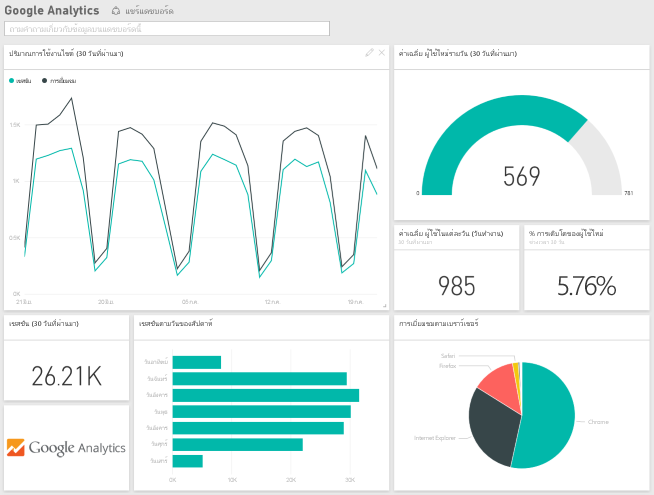
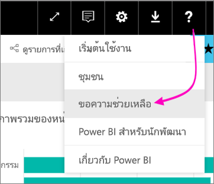

# เชื่อมต่อกับบริการที่คุณใช้กับ Power BIConnect to the services you use with Power BI
ด้วย Power BI คุณสามารถเชื่อมต่อกับบริการที่คุณใช้จำนวนมาก เพื่อเรียกใช้ธุรกิจของคุณ เช่น Salesforce, Microsoft Dynamics CRM และ Google AnalyticsWith Power BI, you can connect to many of the services you use to run your business, such as Salesforce, Microsoft Dynamics, and Google Analytics. Power BI เริ่มต้นโดยใช้ข้อมูลประจำตัวของคุณเพื่อเชื่อมต่อกับบริการPower BI starts by using your credentials to connect to the service. และจากนั้นสร้าง *พื้นที่ทำงาน* Power BI ด้วยแดชบอร์ดและชุดของรายงาน Power BI ที่แสดงข้อมูลของคุณและให้ข้อมูลภาพเชิงลึกเกี่ยวกับธุรกิจของคุณโดยอัตโนมัติIt creates a Power BI *workspace* with a dashboard and a set of Power BI reports that automatically show your data and provide visual insights about your business.

>[!IMPORTANT]
>ชุดเนื้อหาของบริการจะถูกแทนที่ด้วย [แอปเทมเพลต](./service-template-apps-overview.md)Service content packs are being replaced by [Template apps](./service-template-apps-overview.md). ตั้งแต่วันที่ 25 กันยายน 2019 มีชุดเนื้อหาจำนวนหนึ่งที่เลิกใช้แล้วAs of September 25, 2019, a number of content packs have already been deprecated. ชุดเนื้อหาที่เลิกใช้แล้วที่คุณเคยติดตั้งจะยังคงอยู่ในบัญชีของคุณ แต่จะไม่มีเอกสารประกอบหรือการสนับสนุน และจะไม่สามารถติดตั้งได้อีกAny deprecated content pack that you have installed will remain in your account, but no documentation or support will be provided for it, nor will it be possible to install it again.

เข้าสู่ระบบ Power BI เพื่อดู[บริการที่คุณสามารถเชื่อมต่อ](https://app.powerbi.com/getdata/services)ทั้งหมดSign in to Power BI to view all of the [services you can connect to](https://app.powerbi.com/getdata/services). 

หลังจากที่คุณติดตั้งแอป คุณสามารถดูแดชบอร์ดและรายงานในแอปและพื้นที่ทำงานในบริการของ Power BI ([https://app.powerbi.com](https://app.powerbi.com))After you install the app, you can view the dashboard and reports in the app and the workspace in the Power BI service ([https://app.powerbi.com](https://app.powerbi.com)). นอกจากนี้ คุณยังสามารถดูข้อมูลได้ในแอป Power BI สำหรับอุปกรณ์เคลื่อนที่You can also view them in the Power BI mobile apps. ในพื้นที่ทำงาน คุณสามารถปรับเปลี่ยนแดชบอร์ดและรายงานตามความต้องการขององค์กรของคุณ และแจกจ่ายให้เพื่อนร่วมงานของคุณเป็น *แอป* ได้In the workspace, you can modify the dashboard and reports to meet the needs of your organization, and then distribute them to your colleagues as an *app*. 

## เริ่มใช้งานGet started
[!INCLUDE [powerbi-service-apps-get-more-apps](../includes/powerbi-service-apps-get-more-apps.md)]

## แก้ไขแดชบอร์ดและรายงานEdit the dashboard and reports
เมื่อการนำเข้าเสร็จสมบูรณ์ แอปใหม่จะปรากฏบนหน้าแอปWhen the import is complete, the new app appears on the Apps page.

1. เลือก **แอป** ในบานหน้าต่างนำทาง > เลือกแอปSelect **Apps** in the nav pane > select the app.
   
     
2. คุณสามารถถามคำถามโดยการพิมพ์ในกล่องถามตอบ หรือคลิกที่ไทล์เพื่อเปิดรายงานพื้นฐานYou can ask a question by typing in the Q&A box, or click a tile to open the underlying report. 
   
    
   
    เปลี่ยนแดชบอร์ดและรายงานเพื่อให้เหมาะสมกับความต้องการขององค์กรของคุณChange the dashboard and report to fit the needs of your organization. จากนั้น[แจกจ่ายแอปของคุณไปยังเพื่อนร่วมงานของคุณ](../collaborate-share/service-create-distribute-apps.md)Then [distribute your app to your colleagues](../collaborate-share/service-create-distribute-apps.md)

## มีอะไรรวมอยู่บ้างWhat's included
หลังจากเชื่อมต่อกับบริการ คุณเห็นแอปและพื้นที่ทำงานที่สร้างขึ้นใหม่ด้วยแดชบอร์ด รายงาน และชุดข้อมูลAfter connecting to a service, you see a newly created app and workspace with a dashboard, reports, and dataset. ข้อมูลจากบริการจะเน้นไปที่สถานการณ์เฉพาะ และอาจรวมถึงข้อมูลทั้งหมดจากบริการThe data from the service is focused on a specific scenario and may not include all the information from the service. ข้อมูลมีการจัดกำหนดการการรีเฟรชโดยอัตโนมัตหนึ่งครั้งต่อวันThe data is scheduled to refresh automatically once per day. คุณสามารถควบคุมการกำหนดเวลาโดยการเลือกชุดข้อมูลYou can control the schedule by selecting the dataset.

คุณยังสามารถ[เชื่อมต่อกับบริการมากมายใน Power BI Desktop](desktop-data-sources.md) เช่น Google Analytics และสร้างแดชบอร์ดและรายงานที่กำหนดเองของคุณเองYou can also [connect to many services in Power BI Desktop](desktop-data-sources.md), such as Google Analytics, and create your own customized dashboards and reports.  

สำหรับรายละเอียดเพิ่มเติมเกี่ยวกับการเชื่อมต่อกับบริการที่เฉพาะเจาะจง โปรดดูที่หน้าช่วยเหลือส่วนบุคคลFor more details on connecting to specific services, refer to the individual help pages.

## แนวทางการแก้ไขปัญหาTroubleshooting
**ไทล์ที่ว่างเปล่า****Empty tiles**  
ขณะที่ Power BI เชื่อมต่อไปยังบริการครั้งแรก คุณอาจเห็นชุดที่ว่างเปล่าของไทล์บนแดชบอร์ดของคุณWhile Power BI is first connecting to the service, you may see an empty set of tiles on your dashboard. ถ้าคุณยังคงเห็นแดชบอร์ดว่างเปล่าหลังจากชั่วโมง 2 อาจเป็นได้ว่าการเชื่อมต่อล้มเหลวIf you still see an empty dashboard after 2 hours, it's likely the connection failed. ถ้าคุณไม่เห็นข้อความแสดงข้อผิดพลาดที่มีรายละเอียดในการแก้ไขปัญหา ให้ยื่นตั๋วการสนับสนุนIf you didn't see an error message with information on correcting the issue, file a support ticket.

* เลือกไอคอนเครื่องหมายคำถาม ( **?** ) ที่มุมบนขวา > **รับความช่วยเหลือ**Select the question mark icon (**?**) in the upper-right corner >  **Get help**.
  
    

**ข้อมูลที่หายไป****Missing information**  
แดชบอร์ดและรายงานมีเนื้อหาข้อมูลจากบริการจะเน้นไปที่สถานการณ์เฉพาะ และอาจรวมถึงข้อมูลทั้งหมดจากบริการThe dashboard and reports include content from the service focused on a specific scenario. หากคุณกำลังมองหาเมตริกเฉพาะในแอปและไม่เห็น ให้เพิ่มแนวคิดบนหน้า[การสนับสนุน Power BI](https://support.powerbi.com/forums/265200-power-bi)If you're looking for a specific metric in the app and don't see it, add an idea on the [Power BI Support](https://support.powerbi.com/forums/265200-power-bi) page.

## บริการให้คำปรึกษาSuggesting services
คุณใช้บริการและคุณต้องการให้คำแนะนำแอป Power BI ใช่หรือไม่Do you use a service you'd like to suggest for a Power BI app? ไปที่[สนับสนุน Power BI ](https://support.powerbi.com/forums/265200-power-bi)หน้า และแจ้งให้เราทราบGo to the [Power BI Support](https://support.powerbi.com/forums/265200-power-bi) page and let us know.

ถ้าคุณสนใจในการสร้างแอปแม่แบบเพื่อกระจายด้วยตนเอง ดู[สร้างแอปแม่แบบใน Power BI](service-template-apps-create.md)If you're interested in creating template apps to distribute yourself, see [Create a template app in Power BI](service-template-apps-create.md). คู่ค้า Power BI สามารถสร้างแอป Power BI ด้วยโค๊ดเพียงเล็กน้อยหรือไม่มีเลย และปรับใช้กับลูกค้า Power BI ได้Power BI partners can build Power BI apps with little or no coding, and deploy them to Power BI customers. 

## ขั้นตอนถัดไปNext steps
* [แจกจ่ายแอปไปยังเพื่อนร่วมงานของคุณDistribute apps to your colleagues](../collaborate-share/service-create-distribute-apps.md)
* [สร้างพื้นที่ทำงานใหม่ใน Power BICreate the new workspaces in Power BI](../collaborate-share/service-create-the-new-workspaces.md)
* มีคำถามหรือไม่?Questions? [ลองถามชุมชน Power BITry asking the Power BI Community](https://community.powerbi.com/)