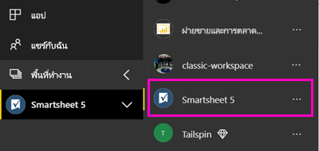

# เชื่อมต่อกับ Smartsheet ด้วย Power BIConnect to Smartsheet with Power BI
บทความนี้จะแนะนำคุณในการดึงข้อมูลของคุณจากบัญชี Smartsheet ของคุณด้วยแอปเทมเพลตของ Power BIThis article walks you through pulling your data from your Smartsheet account with a Power BI template app. Smartsheet มีแพลตฟอร์มอย่างง่าย สำหรับการทำงานร่วมกันและการแชร์ไฟล์Smartsheet offers an easy platform for collaboration and file sharing. แอปเทมเพลต Smartsheet สำหรับ Power BI มีแดชบอร์ด รายงาน และชุดข้อมูลที่แสดงภาพรวมของบัญชี Smartsheet ของคุณThe Smartsheet template app for Power BI provides a dashboard, reports, and dataset that show an overview of your Smartsheet account. คุณยังสามารถใช้ [Power BI Desktop](desktop-connect-to-data.md) เพื่อเชื่อมต่อโดยตรงไปยังแต่ละแผ่นงานในบัญชีของคุณได้You can also use [Power BI Desktop](desktop-connect-to-data.md) to connect directly to individual sheets in your account. 

หลังจากที่คุณได้ติดตั้งแอปแบบเทมเพลตแล้ว คุณสามารถเปลี่ยนแดชบอร์ดและรายงานได้After you've installed the template app, you can change the dashboard and report. จากนั้นคุณสามารถเผยแพร่เป็นแอปไปยังเพื่อนร่วมงานในองค์กรของคุณได้Then you can distribute it as an app to colleagues in your organization.

เชื่อมต่อไปยัง[แอปเทมเพลต Smartsheet](https://app.powerbi.com/groups/me/getapps/services/pbi-contentpacks.pbiapps-smartsheet)สำหรับ Power BIConnect to the [Smartsheet template app](https://app.powerbi.com/groups/me/getapps/services/pbi-contentpacks.pbiapps-smartsheet) for Power BI.

>[!NOTE]
>บัญชีผู้ดูแลระบบ Smartsheet เป็นที่ต้องการสำหรับการเชื่อมต่อและการโหลดแอปเทมเพลต Power BI ที่มีการเข้าถึงเพิ่มเติมA Smartsheet admin account is preferred for connecting and loading the Power BI template app as it has additional access.

## วิธีการเชื่อมต่อHow to connect

[!INCLUDE [powerbi-service-apps-get-more-apps](../includes/powerbi-service-apps-get-more-apps.md)]

3. เลือก **Smartsheet** \> **รับทันที**Select **Smartsheet** \> **Get it now**.
4. ใน **ติดตั้งแอป Power BI นี้หรือไม่** เลือก **ติดตั้ง**In **Install this Power BI App?** select **Install**.
4. ในบานหน้าต่าง **แอป** เลือกไทล์ **Smartsheet**In the **Apps** pane, select the **Smartsheet** tile.

    

6. ในส่วน **เริ่มต้นใช้งานแอปใหม่ของคุณ** ให้เลือก **เชื่อมต่อ**In **Get started with your new app**, select **Connect**.

    

4. สำหรับวิธีการรับรองความถูกต้อง เลือก **oAuth2 \> ลงชื่อเข้าใช้**For Authentication Method, select **oAuth2 \> Sign In**.
   
   เมื่อได้รับพร้อมท์ ใส่ข้อมูลประจำตัวของ Smartsheet และทำตามกระบวนการรับรองความถูกต้องWhen prompted, enter your Smartsheet credentials and follow the authentication process.
   
   
   
   

5. หลังจากที่ Power BI นำเข้าข้อมูลแล้วแดชบอร์ด Smartsheet จะเปิดขึ้นAfter Power BI imports the data, the Smartsheet dashboard opens.
   
   

## ปรับเปลี่ยนและเผยแพร่แอปของคุณModify and distribute your app

คุณได้ติดตั้งแอปเทมเพลต SmartsheetYou've installed the Smartsheet template app. ซึ่งหมายความว่าคุณยังได้สร้างพื้นที่ทำงานของแอป Smartsheet อีกด้วยThat means you've also created the Smartsheet workspace. ในพื้นที่ทำงาน คุณสามารถเปลี่ยนรายงานและแดชบอร์ด จากนั้นเผยแพร่เป็น *แอป* ไปยังเพื่อนร่วมงานในองค์กรของคุณได้In the workspace, you can change the report and dashboard, and then distribute it as an *app* to colleagues in your organization. 

1. หากต้องการดูเนื้อหาทั้งหมดของพื้นที่ทำงาน Smartsheet ใหม่ของคุณในบานหน้าต่างนำทาง เลือก **พื้นที่ทำงาน** > **Smartsheet**To view all the contents of your new Smartsheet workspace, in the nav pane, select **Workspaces** > **Smartsheet**. 

    

    มุมมองนี้เป็นรายการเนื้อหาสำหรับพื้นที่ทำงานThis view is the content list for the workspace. ที่มุมบนขวา คุณจะเห็น **อัปเดตแอป**In the upper-right corner, you see **Update app**. เมื่อคุณพร้อมที่จะเผยแพร่แอปของคุณไปยังเพื่อนร่วมงานของคุณ นั่นคือที่ที่คุณจะเริ่มต้นWhen you're ready to distribute your app to your colleagues, that's where you'll start. 

    

2. เลือก **รายงาน** และ **ชุดข้อมูล** เพื่อดูองค์ประกอบอื่น ๆ ในพื้นที่ทำงานSelect **Reports** and **Datasets** to see the other elements in the workspace.

    อ่านเกี่ยวกับ [การเผยแพร่แอป](../collaborate-share/service-create-distribute-apps.md) ให้เพื่อนร่วมงานของคุณRead about [distributing apps](../collaborate-share/service-create-distribute-apps.md) to your colleagues.

## มีอะไรรวมอยู่บ้างWhat's included
แอปเทมเพลต Smartsheet สำหรับ Power BI มีภาพรวมของบัญชี Smartsheet ของคุณ เช่น จำนวนของพื้นที่ทำงาน รายงาน และแผ่นงานที่คุณมี เมื่อใดที่ถูกแก้ไข ฯลฯ ผู้ใช้ที่เป็นผู้ดูแลระบบยังเห็นข้อมูลเกี่ยวกับผู้ใช้ในระบบของพวกเขา เช่น ผู้ที่สร้างแผ่นงานอันดับต้น ๆThe Smartsheet template app for Power BI includes an overview of your Smartsheet account, such as the number of workspaces, reports, and sheets you have, when they're modified etc. Admin users also see some information around the users in their system, such as top sheet creators.  

เพื่อเชื่อมต่อโดยตรงไปยังแต่ละแผ่นงานในบัญชีของคุณ คุณสามารถใช้ตัวเชื่อมต่อ Smartsheet ใน [Power BI Desktop](desktop-connect-to-data.md) ได้To connect directly to individual sheets in your account, you can use the Smartsheet connector in the [Power BI Desktop](desktop-connect-to-data.md).  

## ขั้นตอนถัดไปNext steps

* [สร้างพื้นที่ทำงานใหม่ใน Power BICreate the new workspaces in Power BI](../collaborate-share/service-create-the-new-workspaces.md)
* [ติดตั้งและใช้แอปฯใน Power BIInstall and use apps in Power BI](../consumer/end-user-apps.md)
* [เชื่อมต่อกับแอป Power BI สำหรับบริการภายนอกCOnnect to Power BI apps for external services](service-connect-to-services.md)
* มีคำถามหรือไม่Questions? [ลองถามชุมชน Power BITry asking the Power BI Community](https://community.powerbi.com/)