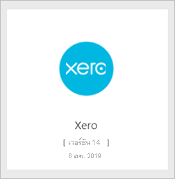
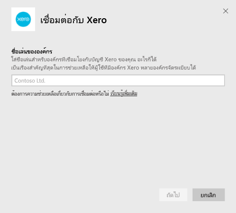
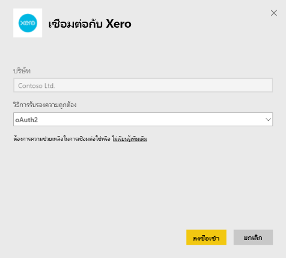
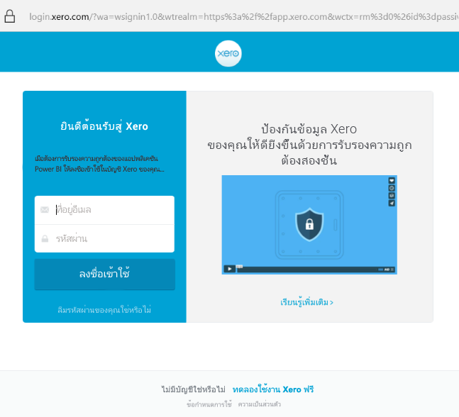

# เชื่อมต่อกับ Xero ด้วย Power BIConnect to Xero with Power BI
Xero เป็นซอฟต์แวร์บัญชีออนไลน์ที่ใช้งานง่ายซึ่งออกแบบมาสำหรับธุรกิจขนาดเล็กโดยเฉพาะXero is easy to use online accounting software that's designed specifically for small businesses. สร้างการนำเสนอข้อมูลที่น่าสนใจโดยอิงจากข้อมูลทางการเงิน Xero ของคุณด้วยแอปเทมเพลต Power BICreate compelling visualizations based on your Xero financials with this Power BI template app. แดชบอร์ดเริ่มต้นของคุณประกอบด้วยตัวชี้วัดธุรกิจขนาดเล็กหลายรายการ เช่น สถานะเงินสด รายได้และค่าใช้จ่าย แนวโน้มการสูญเสียกำไร จำนวนวันที่จะได้รับรายได้ และผลตอบแทนจากการลงทุนYour default dashboard includes many small business metrics like cash position, revenue vs. expenses, profit loss trend, debtor days, and return on investment.

เชื่อมต่อกับ [แอปเทมเพลต Xero](https://app.powerbi.com/getdata/services/xero) สำหรับ Power BI หรือเรียนรู้เพิ่มเติมเกี่ยวกับการรวม [Xero และ Power BI](https://help.xero.com/Power-BI)Connect to the [Xero template app](https://app.powerbi.com/getdata/services/xero) for Power BI or learn more about the [Xero and Power BI](https://help.xero.com/Power-BI) integration.

## วิธีการเชื่อมต่อHow to connect

[!INCLUDE [powerbi-service-apps-get-more-apps](../includes/powerbi-service-apps-get-more-apps.md)]

3. เลือก **Xero** \> **ดาวน์โหลดตอนนี้**Select **Xero** \> **Get it now**.
4. ใน **ติดตั้งแอป Power BI นี้หรือไม่** เลือก **ติดตั้ง**In **Install this Power BI app?** select **Install**.

    

4. ในบานหน้าต่าง **แอป** เลือกไทล์ **Xero**In the **Apps** pane, select the **Xero** tile.

   

6. ในส่วน **เริ่มต้นใช้งานแอปใหม่ของคุณ** ให้เลือก **เชื่อมต่อ**In **Get started with your new app**, select **Connect**.

    

4. ใส่ชื่อเล่นสำหรับองค์กรที่เชื่อมโยงกับบัญชี Xero ของคุณEnter a nickname for the organization associated with your Xero account. ชื่อเล่นนี้จะเป็นอะไรก็ได้ ชื่อนี้จะช่วยให้ผู้ใช้ที่มีหลายกับองค์กร Xero สามารถแยกแยะแต่ละองค์กรได้Anything will do, it's mostly to help users with multiple Xero organizations keep them all straight. ดูรายละเอียดใน [การค้นหาพารามิเตอร์](#FindingParams) ต่อไปในบทความนี้See details on [finding parameters](#FindingParams) later in this article.

    

5. สำหรับ **วิธีการรับรองความถูกต้อง** เลือก **OAuth**For **Authentication Method**, select **OAuth**. เมื่อได้รับแจ้งให้ลงชื่อเข้าใช้บัญชี Xero ของคุณ และเลือกองค์กรที่จะเชื่อมต่อWhen prompted sign into your Xero account and select the organization to connect to. เมื่อเข้าสู่ระบบเสร็จสมบูรณ์แล้ว ให้เลือก **ลงชื่อเข้าใช้** เพื่อเริ่มกระบวนการการโหลดOnce sign-in is complete, select **Sign In** to start the loading process.
   
    
   
    
6. หลังจากอนุมัติ กระบวนการนำเข้าจะเริ่มโดยอัตโนมัติAfter approving, the import process will begin automatically. เมื่อเสร็จสิ้น แดชบอร์ด รายงาน และแบบจำลองใหม่จะปรากฏขึ้นในบานหน้าต่างนำทางWhen complete, a new dashboard, report, and model will appear in the nav pane. เลือกแดชบอร์ดเพื่อดูข้อมูลที่นำเข้าของคุณSelect the dashboard to view your imported data.
   
     

**ฉันต้องทำอะไรตอนนี้****What now?**

* ลอง[ถามคำถามในกล่อง Q&A](../consumer/end-user-q-and-a.md)ที่ด้านบนของแดชบอร์ดTry [asking a question in the Q&A box](../consumer/end-user-q-and-a.md) at the top of the dashboard
* [เปลี่ยนไทล์](../create-reports/service-dashboard-edit-tile.md)ในแดชบอร์ด[Change the tiles](../create-reports/service-dashboard-edit-tile.md) in the dashboard.
* [เลือกไทล์](../consumer/end-user-tiles.md)เพื่อเปิดรายงานด้านใน[Select a tile](../consumer/end-user-tiles.md) to open the underlying report.
* แม้ว่าชุดข้อมูลของคุณจะถูกกำหนดให้รีเฟรชรายวัน แต่คุณสามารถเปลี่ยนกำหนดการรีเฟรช หรือลองรีเฟรชตามความต้องการได้โดยใช้ **รีเฟรชเดี๋ยวนี้**While your dataset will be scheduled to refresh daily, you can change the refresh schedule or try refreshing it on demand using **Refresh Now**

## มีอะไรรวมอยู่บ้างWhat's included
แดชบอร์ดแอปเทมเพลตประกอบด้วยไทล์และเมตริกที่ครอบคลุมหลายส่วน พร้อมกับรายงานที่เกี่ยวข้องเมื่อต้องการเรียนรู้เพิ่มเติม:The template app dashboard includes tiles and metrics that cover a variety of areas, with corresponding reports to learn more:  

| พื้นที่Area | แดชบอร์ดไทล์Dashboard Tiles | รายงานReport |
| --- | --- | --- |
| เงินสดCash |กระแสเงินสดรายวันDaily cash flow  เงินสดเข้าCash in  เงินสดออกCash out  ยอดดุลปิดบัญชี ตามบัญชีผู้ใช้Closing balance by account  ยอดดุลปิดบัญชีวันนี้Closing balance today |บัญชีธนาคารBank Accounts |
| ลูกค้าCustomer |ยอดขายที่ออกใบแจ้งหนี้Invoiced sales  ยอดขายที่ออกใบแจ้งหนี้ตามลูกค้าInvoiced sales by customer  แนวโน้มการเพิ่มยอดขายที่ออกใบแจ้งหนี้Invoiced sales growth trend  ใบแจ้งหนี้ครบกำหนดชำระInvoices due  หนี้คงค้างOutstanding receivables  หนี้ที่เกินกำหนดชำระOverdue receivables |ลูกค้าCustomer  สินค้าคงคลังInventory |
| ผู้ขายSupplier |การสั่งซื้อที่เรียกเก็บเงินBilled purchases  การสั่งซื้อที่เรียกเก็บเงินโดยผู้ขายBilled purchases by supplier  แนวโน้มการเติบโตของการสั่งซื้อที่เรียกเก็บเงินBilled purchases growth trend   ใบเรียกเก็บเงินที่ครบกำหนดBills due  เจ้าหนี้คงเหลือOutstanding payables  เจ้าหนี้เกินกำหนดOverdue payables |ผู้ขายSuppliers  สินค้าคงคลังInventory |
| สินค้าคงคลังInventory |ยอดขายรายเดือนตามผลิตภัณฑ์Monthly sales amount by product |สินค้าคงคลังInventory |
| กำไรขาดทุนProfit and loss |กำไรและขาดทุนรายเดือนMonthly profit and loss  กำไรสุทธีนี้Net profit this fiscal year  กำไรสุทธิเดือนนี้Net profit this month  บัญชีค่าใช้จ่ายสูงสุดTop expense accounts |กำไรขาดทุนProfit and Loss |
| งบดุลBalance sheet |สินทรัพย์รวมTotal assets  หนี้สินรวมTotal liabilities  ส่วนผู้ถือหุ้นEquity |งบดุลBalance Sheet |
| สถานภาพHealth |อัตราส่วนปัจจุบันCurrent ratio  อัตรากำไรขั้นต้นGross profit percentage   อัตราผลตอบแทนจากสินทรัพย์รวมReturn on total assets  อัตราส่วนหนี้สินรวมต่อส่วนของผู้ถือหุ้นTotal liabilities to equity ratio |สถานภาพHealth  อภิธานศัพท์และบันทึกทางเทคนิคGlossary and Technical Notes |

ชุดข้อมูลยังรวมถึงตารางต่อไปนี้เพื่อกำหนดค่ารายงานและแดชบอร์ดของคุณThe dataset also includes the following tables to customize your reports and dashboards:  

* ที่อยู่Addresses  
* การแจ้งเตือนAlerts  
* ยอดคงเหลือในบัญชีประจำวันของธนาคารBank Statement Daily Balance  
* งบธนาคารBank Statements  
* รายชื่อผู้ติดต่อContacts  
* การเบิกค่าใช้จ่ายExpense Claims  
* รายการใบแจ้งหนี้Invoice Line Items  
* ใบแจ้งหนี้Invoices  
* รายการItems  
* สิ้นสุดเดือนMonth End  
* องค์กรOrganization  
* งบดุลทดลองTrial Balance  
* บัญชี XeroXero Accounts

## ความต้องการของระบบSystem requirements
การเข้าถึงแอปเทมเพลต Xero ต้องการบทบาทต่อไปนี้: "มาตรฐาน + รายงาน" หรือ "ผู้แนะนำ"The following roles are required to access the Xero template app: "Standard + Reports" or "Advisor".

## การค้นหาพารามิเตอร์Finding parameters
ระบุชื่อสำหรับองค์กรของคุณเพื่อติดตามใน Power BIProvide a name for your organization to track in Power BI. ชื่อที่ระบุจะทำให้คุณสามารถเชื่อมต่อกับองค์กรหลายองค์กรได้A specific name allows you to connect to multiple different organizations. คุณไม่สามารถเชื่อมต่อกับองค์กรเดียวกันหลายครั้ง เนื่องจากจะส่งผลต่อการรีเฟรชตามกำหนดการYou can't connect to the same organization multiple times, as it will affect the scheduled refresh.   

## การแก้ไขปัญหาTroubleshooting
* ผู้ใช้ Xero ต้องมีบทบาทต่อไปนี้เพื่อเข้าถึงแอปเทมเพลต Xero สำหรับ Power BI: "มาตรฐาน + รายงาน" หรือ "ผู้แนะนำ"Xero users must have the following roles to access the Xero template app for Power BI: "Standard + Reports" or "Advisor". แอปเทมเพลตอาศัยการอนุญาตจากผู้ใช้เพื่อเข้าถึงข้อมูลรายงานผ่านทาง Power BIThe template app relies on the user-based permissions to access reporting data through Power BI.
* ในระหว่างการโหลด ไทล์บนแดชบอร์ดจะอยู่ในสถานะการโหลดแบบทั่วไปDuring the load, the tiles on the dashboard are in a generic loading state. ไทล์จะยังคงอยู่ในสถานะนั้นจนกว่าการโหลดทั้งหมดจะเสร็จสมบูรณ์They stay that way until the full load completes. ถ้าคุณได้รับการแจ้งเตือนว่าการโหลดของคุณเสร็จสมบูรณ์แล้ว แต่ยังคงมีไทล์กำลังโหลด ลองรีเฟรชแดชบอร์ดไทล์โดยใช้...ในด้านบนขวาของแดชบอร์ดของคุณIf you receive a notification that your load completed but the tiles are still loading, try refreshing the dashboard tiles using the ... in the top right of your dashboard.
* ถ้าแอปเทมเพลตของคุณล้มเหลวในการรีเฟรช โปรดตรวจสอบว่าคุณได้เชื่อมต่อกับองค์กรเดียวกันมากกว่าหนึ่งครั้งใน Power BI หรือไม่If your template app fails to refresh, check if you have connected to the same organization more than once in Power BI. Xero อนุญาตการเชื่อมต่อที่ใช้งานอยู่กับองค์กรเดียวเท่านั้น และคุณอาจเห็นข้อผิดพลาดที่ระบุว่าข้อมูลประจำตัวของคุณไม่ถูกต้องหากคุณเชื่อมต่อกับเครือข่ายเดียวกันมากกว่าหนึ่งครั้งXero only allows a single active connection to an organization and you may see an error indicating your credentials are invalid if you connect to the same one more than once.  
* สำหรับปัญหาการเชื่อมต่อแอปเทมเพลต Xero สำหรับ Power BI เช่น ข้อความข้อผิดพลาดหรือเวลาในการโหลดช้า ก่อนอื่นให้ล้างแคช / คุกกี้และเริ่มระบบเบราว์เซอร์ใหม่ จากนั้นจึงเชื่อมต่อกับ Power BI อีกครั้งFor issues connecting the Xero template app for Power BI, like error messages or slow load times, first clear the cache / cookies and restart the browser, then reconnect to Power BI.  

สำหรับปัญหาอื่นๆ  ให้รายงานไปยัง https://support.powerbi.com ถ้าปัญหายังคงมีอยู่For other issues, file a ticket at https://support.powerbi.com if the issue persists.

## ขั้นตอนถัดไปNext steps
[เริ่มต้นใช้งานใน Power BIGet started in Power BI](../fundamentals/service-get-started.md)

[รับข้อมูลใน Power BIGet data in Power BI](service-get-data.md)
