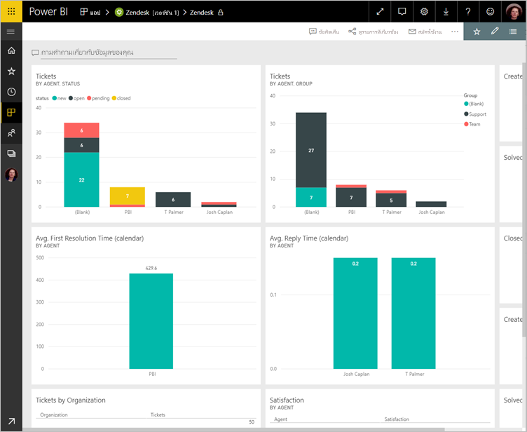

# เชื่อมต่อกับ Zendesk ด้วย Power BIConnect to Zendesk with Power BI

บทความนี้จะแนะนำคุณในการดึงข้อมูลของคุณจากบัญชี Zendesk ของคุณด้วยแอปเทมเพลตของ Power BIThis article walks you through pulling your data from your Zendesk account with a Power BI template app. แอป Zendesk นำเสนอแดชบอร์ด Power BI และชุดของรายงาน Power BI ที่มีข้อมูลเชิงลึกเกี่ยวกับปริมาณตั๋วและประสิทธิภาพการทำงานของบริษัทตัวแทนThe Zendesk app offers a Power BI dashboard and a set of Power BI reports that provide insights about your ticket volumes and agent performance. ข้อมูลถูกรีเฟรชโดยอัตโนมัติวันละครั้งThe data is refreshed automatically once a day. 

หลังจากที่คุณได้ติดตั้งแอปแบบเทมเพลตคุณสามารถกำหนดแดชบอร์ดและรายงานเพื่อเน้นข้อมูลที่คุณสนใจมากที่สุดได้After you've installed the template app, you can customize the dashboard and report to highlight the information you care about most. จากนั้นคุณสามารถเผยแพร่เป็นแอปไปยังเพื่อนร่วมงานในองค์กรของคุณได้Then you can distribute it as an app to colleagues in your organization.

เชื่อมต่อไปยัง[แอปเทมเพลต Zendesk](https://app.powerbi.com/getdata/services/zendesk)หรืออ่านเพิ่มเติมเกี่ยวกับการ[รวม Zendesk](https://powerbi.microsoft.com/integrations/zendesk)กับ Power BIConnect to the [Zendesk template app](https://app.powerbi.com/getdata/services/zendesk) or read more about the [Zendesk integration](https://powerbi.microsoft.com/integrations/zendesk) with Power BI.

หลังจากที่คุณได้ติดตั้งแอปแบบเทมเพลตแล้ว คุณสามารถเปลี่ยนแดชบอร์ดและรายงานได้After you've installed the template app, you can change the dashboard and report. จากนั้นคุณสามารถเผยแพร่เป็นแอปไปยังเพื่อนร่วมงานในองค์กรของคุณได้Then you can distribute it as an app to colleagues in your organization.

>[!NOTE]
>คุณจำเป็นต้องมีบัญชีผู้ดูแลระบบ Zendesk เพื่อเชื่อมต่อYou need a Zendesk Admin account to connect. รายละเอียดเพิ่มเติมเกี่ยวกับ[ข้อกำหนด](#system-requirements) อยู่ที่ด้านล่างMore details on [requirements](#system-requirements) below.

>[!WARNING]
>ก่อนวันที่ 15 ต.ค. 2019 นั้น Zendesk Support Search API อนุญาตให้ได้รับผลลัพธ์รวม 200,000 รายการ ผ่านการแบ่งหน้าของคิวรีขนาดใหญ่Before Oct 15, 2019, the Zendesk Support Search API allowed for a total of 200,000 results to be received through pagination of large queries. เพื่อจัดแนวการใช้งานการค้นหาให้สอดคล้องกับขอบเขตที่ตั้งใจไว้ ตอนนี้ Zendesk จำกัดจำนวนผลลัพธ์สูงสุดที่ส่งคืนเท่ากับ 1,000 รายการ โดยมีผลลัพธ์สูงสุด 100 รายการต่อหน้าTo align search usage with its intended scope, Zendesk now limits the maximum number of results returned to 1,000 total results, with a maximum of 100 results per page. อย่างไรก็ตาม ตัวเชื่อมต่อ Zendesk Power BI ปัจจุบันยังคงสามารถสร้างการเรียกใช้ API ที่เกินขีดจำกัดใหม่เหล่านี้ส่งผลให้เกิดผลลัพธ์ที่อาจทำให้เข้าใจผิดได้However, the current Power BI Zendesk connector can still create API calls that exceed these new limits, resulting in possibly misleading results.

## วิธีการเชื่อมต่อHow to connect

[!INCLUDE [powerbi-service-apps-get-more-apps](../includes/powerbi-service-apps-get-more-apps.md)]

3. เลือก **Zendesk** \> **รับทันที**Select **Zendesk** \> **Get it now**.
4. ใน **ติดตั้งแอป Power BI นี้หรือไม่** เลือก **ติดตั้ง**In **Install this Power BI App?** select **Install**.
4. ในบานหน้าต่าง **แอป** เลือกไทล์ **Zendesk**In the **Apps** pane, select the **Zendesk** tile.

    

6. ในส่วน **เริ่มต้นใช้งานแอปใหม่ของคุณ** ให้เลือก **เชื่อมต่อ**In **Get started with your new app**, select **Connect**.

    

4. ให้ URL ที่เชื่อมโยงกับบัญชีของคุณProvide the URL associated with your account. URL มีฟอร์ม **https://company.zendesk.com**The URL has the form **https://company.zendesk.com**. ดูรายละเอียดที่ [การค้นหาพารามิเตอร์เหล่านี้](#finding-parameters) ด้านล่างSee details on [finding these parameters](#finding-parameters) below.
   
   

5. เมื่อมีข้อความปรากฏ ใส่ข้อมูลประจำตัวของ ZendeskWhen prompted, enter your Zendesk credentials.  เลือก **oAuth 2** เป็นกลไกการรับรองความถูกต้อง แล้วคลิก **ลงชื่อเข้าใช้**Select **oAuth 2** as the Authentication Mechanism and click **Sign In**. ทำตามขั้นตอนการรับรองความถูกต้อง ZendeskFollow the Zendesk authentication flow. (ถ้าคุณลงชื่อเข้าใช้ Zendesk อยู่แล้วในเบราว์เซอร์ของคุณ คุณอาจไม่ได้รับข้อความปรากฏให้ใส่ข้อมูลประจำตัว)(If you're already signed in to Zendesk in your browser, you may not be prompted for credentials.)
   
   > [!NOTE]
   > แอปเทมเพลตนี้ต้องการให้คุณเชื่อมต่อกับบัญชีผู้ดูแลระบบ ZendeskThis template app requires that you connect with a Zendesk Admin account. 
   > 
   
   
6. คลิก **อนุญาต** เพื่ออนุญาตให้ Power BI เข้าถึงข้อมูล Zendesk ของคุณClick **Allow** to allow Power BI to access your Zendesk data.
   
   
7. คลิก **เชื่อมต่อ** เพื่อเริ่มกระบวนการนำเข้าClick **Connect** to begin the import process. 
8. หลังจากที่ Power BI นำเข้าข้อมูลคุณจะเห็นรายการเนื้อหาสำหรับแอ Zendesk ของคุณ: แดชบอร์ด รายงานและชุดข้อมูลใหม่After Power BI imports the data, you see the content list for your Zendesk app: a new dashboard, report, and dataset.
9. เลือกแดชบอร์ดที่จะเริ่มต้นกระบวนการสำรวจSelect the dashboard to start the exploration process.

    
   
## ปรับเปลี่ยนและเผยแพร่แอปของคุณModify and distribute your app

คุณได้ติดตั้งแอปเทมเพลต ZendeskYou've installed the Zendesk template app. ซึ่งหมายความว่าคุณยังได้สร้างพื้นที่ทำงานของ Zendesk อีกด้วยThat means you've also created the Zendesk workspace. ในพื้นที่ทำงาน คุณสามารถเปลี่ยนรายงานและแดชบอร์ด จากนั้นเผยแพร่เป็น *แอป* ไปยังเพื่อนร่วมงานในองค์กรของคุณได้In the workspace, you can change the report and dashboard, and then distribute it as an *app* to colleagues in your organization. 

1. หากต้องการดูเนื้อหาทั้งหมดของพื้นที่ทำงาน Zendesk ใหม่ของคุณในบานหน้าต่างนำทาง เลือก **พื้นที่ทำงาน** > **Zendesk**To view all the contents of your new Zendesk workspace, in the nav pane, select **Workspaces** > **Zendesk**. 

    

    มุมมองนี้เป็นรายการเนื้อหาสำหรับพื้นที่ทำงานThis view is the content list for the workspace. ที่มุมบนขวา คุณจะเห็น **อัปเดตแอป**In the upper-right corner, you see **Update app**. เมื่อคุณพร้อมที่จะเผยแพร่แอปของคุณไปยังเพื่อนร่วมงานของคุณ นั่นคือที่ที่คุณจะเริ่มต้นWhen you're ready to distribute your app to your colleagues, that's where you'll start. 

    

2. เลือก **รายงาน** และ **ชุดข้อมูล** เพื่อดูองค์ประกอบอื่น ๆ ในพื้นที่ทำงานSelect **Reports** and **Datasets** to see the other elements in the workspace.

    อ่านเกี่ยวกับ [การเผยแพร่แอป](../collaborate-share/service-create-distribute-apps.md) ให้เพื่อนร่วมงานของคุณRead about [distributing apps](../collaborate-share/service-create-distribute-apps.md) to your colleagues.

## ความต้องการของระบบSystem requirements
บัญชีผู้ดูแลระบบ Zendesk จำเป็นสำหรับการเข้าถึงแอปเทมเพลต ZendeskA Zendesk Administrator account is required to access the Zendesk template app. ถ้าคุณตัวแทนหรือเป็นผู้ใช้ปลายทาง และคุณสนใจดูข้อมูล Zendesk ของคุณ เพิ่มคำแนะนำและตรวจทานตัวเชื่อมต่อ Zendesk ใน [Power BI Desktop](desktop-connect-to-data.md)If you're an agent or an end user and are interested in viewing your Zendesk data, add a suggestion and review the Zendesk connector in the [Power BI Desktop](desktop-connect-to-data.md).

## การค้นหาพารามิเตอร์Finding parameters
URL ของ Zendesk ของคุณจะเหมือนกับ URL ที่คุณใช้เพื่อลงชื่อเข้าใช้บัญชี Zendesk ของคุณYour Zendesk URL will be the same as the URL you use to sign into your Zendesk account. ถ้าคุณไม่แน่ใจใน URL ของ Zendesk ของคุณ คุณสามารถใช้ตัว[ช่วยเหลือในการเข้าสู่ระบบ](https://www.zendesk.com/login/) สำหรับ Zendesk ได้If you're not sure of your Zendesk URL, you can use the Zendesk [login help](https://www.zendesk.com/login/).

## การแก้ไขปัญหาTroubleshooting
ถ้าคุณมีปัญหาในการเชื่อมต่อ ตรวจสอบ URL ของ Zendesk ของคุณ และยืนยันว่าคุณกำลังใช้บัญชีผู้ดูแลระบบ ZendeskIf you're having issues connecting, check your Zendesk URL and confirm you're using a Zendesk administrator account.

## ขั้นตอนถัดไปNext steps

* [สร้างพื้นที่ทำงานใหม่ใน Power BICreate the new workspaces in Power BI](../collaborate-share/service-create-the-new-workspaces.md)
* [ติดตั้งและใช้แอปฯใน Power BIInstall and use apps in Power BI](../consumer/end-user-apps.md)
* [เชื่อมต่อกับแอป Power BI สำหรับบริการภายนอกCOnnect to Power BI apps for external services](service-connect-to-services.md)
* มีคำถามหรือไม่Questions? [ลองถามชุมชน Power BITry asking the Power BI Community](https://community.powerbi.com/)
