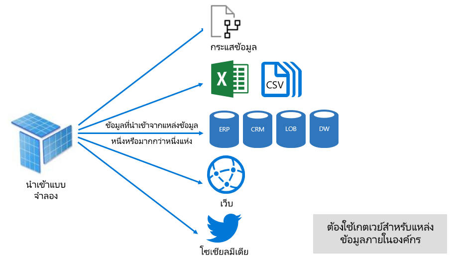
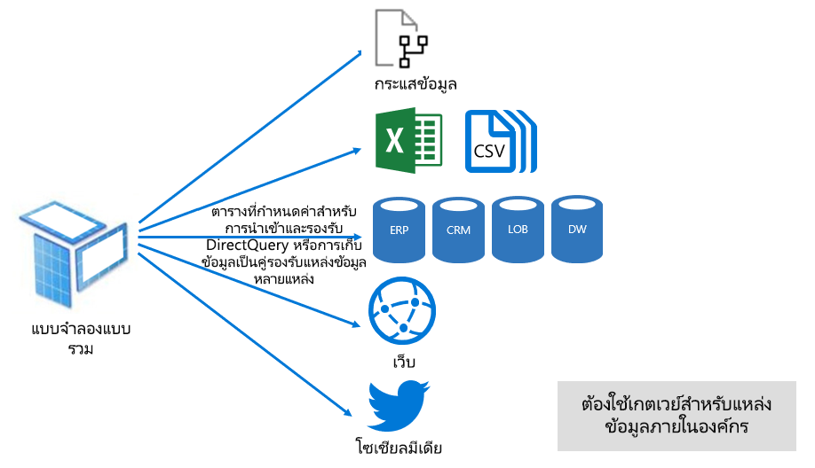

# โหมดชุดข้อมูลในบริการของ Power BIDataset modes in the Power BI service

บทความนี้แสดงคำอธิบายทางเทคนิคของโหมดชุดข้อมูล Power BIThis article provides a technical explanation of Power BI dataset modes. ซึ่งจะนำไปใช้กับชุดข้อมูลที่แสดงการเชื่อมต่อสดไปยังแบบจำลอง Analysis Services ที่โฮสต์ภายนอกและยังเป็นแบบจำลองที่พัฒนาใน Power BI DesktopIt applies to datasets that represent a live connection to an external-hosted Analysis Services model, and also to models developed in Power BI Desktop. บทความเน้นเหตุผลสำหรับแต่ละโหมดและผลกระทบที่เป็นไปได้บนทรัพยากรความจุของ Power BIThe article emphasizes the rationale for each mode, and possible impacts on Power BI capacity resources.

โหมดชุดข้อมูลที่สามคือ:The three dataset modes are:

- [นำเข้าImport](#import-mode)
- [DirectQueryDirectQuery](#directquery-mode)
- [สีผสมComposite](#composite-mode)

## โหมดการนำเข้าImport mode

โหมด _นำเข้า_  คือโหมดที่ใช้บ่อยที่สุดในการพัฒนาแบบจำลอง_Import_ mode is the most common mode used to develop models. โหมดนี้ส่งผลให้ประสิทธิภาพการทำงานรวดเร็วมากด้วยการคิวรีในหน่วยความจำThis mode delivers extremely fast performance thanks to in-memory querying. นอกจากนี้ยังมีความยืดหยุ่นในการออกแบบเพื่อโมเดลและการสนับสนุนสำหรับฟีเจอร์บริการของ Power BI เฉพาะ (ถามตอบ ข้อมูลเชิงลึกด่วน ฯลฯ)It also offers design flexibility to modelers, and support for specific Power BI service features (Q&A, Quick Insights, etc.). เนื่องจากจุดแข็งเหล่านี้เป็นโหมดเริ่มต้นเมื่อสร้างโซลูชัน Power BI Desktop ใหม่Because of these strengths, it's the default mode when creating a new Power BI Desktop solution.

เป็นสิ่งสำคัญที่ต้องทำความเข้าใจว่าข้อมูลที่นำเข้าจะถูกจัดเก็บไว้ในดิสก์เสมอIt's important to understand that imported data is always stored to disk. เมื่อสอบถามหรือรีเฟรช ข้อมูลจะต้องโหลดลงในหน่วยความจำของความจุ Power BI แบบเต็มWhen queried or refreshed, the data must be fully loaded into memory of the Power BI capacity. เมื่ออยู่ในหน่วยความจำแบบจำลอง การนำสามารถเข้าทำให้พบผลลัพธ์แบบสอบถามได้อย่างรวดเร็วOnce in memory, Import models can then achieve very fast query results. คุณจะต้องเข้าใจว่าไม่มีแนวคิดเกี่ยวกับแบบจำลองการนำเข้าที่โหลดบางส่วนลงในหน่วยความจำIt's also important to understand that there's no concept of an Import model being partially loaded into memory.

เมื่อรีเฟรช ข้อมูลจะถูกบีบอัดและปรับให้เหมาะสม จากนั้นจึงเก็บข้อมูลลงในดิสก์โดยกลไกที่จัดเก็บข้อมูล VertiPaqWhen refreshed, data is compressed and optimized and then stored to disk by the VertiPaq storage engine. เมื่อโหลดจากดิสก์ลงในหน่วยความจำ อาจเป็นไปได้ที่จะเห็นการบีบอัด10 เท่าWhen loaded from disk into memory, it's possible to see 10x compression.  ดังนั้นจึงเหมาะสมที่จะคาดหวังว่าข้อมูลต้นฉบับ 10 GB ที่สามารถบีบอัดได้ในขนาดประมาณ 1 GBSo, it's reasonable to expect that 10 GB of source data can compress to about 1 GB in size. ขนาดที่เก็บข้อมูลบนดิสก์สามารถลดลงได้ 20% จากการดำเนินการข้างต้นStorage size on disk can achieve a 20% reduction from the compressed size. (ความแตกต่างในขนาดสามารถกำหนดได้โดยการเปรียบเทียบขนาดไฟล์ Power BI Desktop กับหน่วยความจำตัวจัดการงานที่ใช้สำหรับไฟล์ได้)(The difference in size can be determined by comparing the Power BI Desktop file size with the Task Manager memory usage of the file.)

ความยืดหยุ่นในการออกแบบสามารถทำได้ในสามวิธีDesign flexibility can be achieved in three ways. ผู้สร้างแบบจำลองข้อมูลสามารถที่จะ:Data modelers can:

- รวมข้อมูลโดยการแคชข้อมูลจากกระแสข้อมูลและแหล่งข้อมูลภายนอก และประเภทแหล่งข้อมูลหรือรูปแบบก็ตามIntegrate data by caching data from dataflows, and external data sources, whatever the data source type or format
- ใช้ประโยชน์จากการตั้งค่าของฟังก์ชัน  [Power Query Formula Language](/powerquery-m/) (เรียกอย่างไม่เป็นทางการว่า M) ทั้งหมดเมื่อสร้างคิวรีการเตรียมข้อมูลLeverage the entire set of [Power Query Formula Language](/powerquery-m/) (informally referred to as M) functions when creating data preparation queries
- ใช้ประโยชน์จากการตั้งค่าทั้งหมดของฟังก์ชัน [Data Analysis Expressions (DAX)](/dax/)  เมื่อปรับปรุงแบบจำลองที่มีตรรกะทางธุรกิจ ด้วยคอลัมน์จากการคำนวณ ตารางจากการคำนวณ และหน่วยวัดLeverage the entire set of [Data Analysis Expressions (DAX)](/dax/) functions when enhancing the model with business logic. มีการรองรับสำหรับคอลัมน์จากการคำนวณ ตารางที่มีการคำนวณ และหน่วยวัดThere's support for calculated columns, calculated tables, and measures.

ดังที่แสดงในรูปต่อไปนี้ แบบจำลองการนำเข้าสามารถรวมข้อมูลจากแหล่งข้อมูลที่สนับสนุนชนิดต่าง ๆ จำนวนเท่าใดก็ได้As shown in the following image, an Import model can integrate data from any number of supported data source types.

อย่างไรก็ตาม ถึงแม้จะมีข้อได้เปรียบที่น่าสนใจที่เกี่ยวข้องกับแบบจำลองการนำเข้า แต่ก็มีข้อเสียเช่นกัน:However, while there are compelling advantages associated with Import models, there are disadvantages, too:

- ต้องโหลดแบบจำลองทั้งหมดลงในหน่วยความจำก่อน Power BI จึงสามารถคิวรีแบบจำลองได้ ซึ่งสามารถสร้างแรงกดดันต่อทรัพยากรที่มีอยู่เมื่อจำนวนและขนาดของแบบจำลองขยายขึ้นThe entire model must be loaded to memory before Power BI can query the model, which can place pressure on available capacity resources, especially as the number and size of Import models grow
- ข้อมูลแบบจำลองจะเป็นปัจจุบันเฉพาะในการรีเฟรชครั้งล่าสุดเท่านั้นดังนั้นจึงจำเป็นต้องรีเฟรชแบบจำลองการนำเข้าตามกำหนดเวลาModel data is only as current as the latest refresh, and so Import models need to be refreshed, usually on a scheduled basis
- การรีเฟรชเต็มรูปแบบจะลบข้อมูลทั้งหมดออกจากตารางทั้งหมด และโหลดจากแหล่งข้อมูลใหม่A full refresh will remove all data from all tables and reload it from the data source. ซึ่งอาจใช้ทรัพยากรสูงมากในแง่ของเวลาและทรัพยากรสำหรับบริการของ Power BI และแหล่งข้อมูลThis operation can be expensive in terms of time and resources for the Power BI service, and the data source(s).

    > [!NOTE]
    > Power BI สามารถทำการรีเฟรชแบบเพิ่มหน่วยเพื่อหลีกเลี่ยงการตัดทอนและโหลดตารางทั้งหมดได้Power BI can achieve incremental refresh to avoid truncating and reloading entire tables. อย่างไรก็ตามคุณฟีเจอร์นี้ได้รับการสนับสนุนเฉพาะเมื่อมีการโฮสต์ชุดข้อมูลในพื้นที่ทำงานบนความจุ PremiumHowever, this feature is only supported when the dataset is hosted in workspaces on Premium capacities. สำหรับข้อมูลเพิ่มเติม โปรดดูที่บทความ[การรีเฟรชแบบเพิ่มทีละส่วนใน Power BI Premium](../admin/service-premium-incremental-refresh.md)For more information, see the [Incremental refresh in Power BI Premium](../admin/service-premium-incremental-refresh.md) article.

จากมุมมองแหล่งข้อมูลบริการ Power BI นำเข้าโมเดลจำเป็นต้องใช้:From a Power BI service resource perspective, Import models require:

- หน่วยความจำที่เพียงพอในการโหลดแบบจำลองเมื่อทำการคิวรีหรือรีเฟรชSufficient memory to load the model when it's queried or refreshed
- ทรัพยากรการประมวลผลและทรัพยากรหน่วยความจำเพิ่มเติมเพื่อรีเฟรชข้อมูลProcessing resources and additional memory resources to refresh data

## โหมด DirectQueryDirectQuery mode

_โหมด_ DirectQuery เป็นอีกทางเลือกในการนำเข้าโหมด_DirectQuery_ mode is an alternative to Import mode. แบบจำลองที่พัฒนาในโหมด DirectQuery จะไม่นำเข้าข้อมูลModels developed in DirectQuery mode don't import data. แต่โหมดนั้นๆ ประกอบด้วยเมตาดาต้าที่กำหนดโครงสร้างแบบจำลองเท่านั้นInstead, they consist only of metadata defining the model structure. เมื่อคิวรีแบบจำลอง คิวรีเดิมจะถูกใช้เพื่อดึงข้อมูลจากแหล่งข้อมูลต้นทางWhen the model is queried, native queries are used to retrieve data from the underlying data source.

มีสองเหตุผลหลักที่ควรพิจารณาในการพัฒนาแบบจำลอง DirectQuery ดังนี้:There are two main reasons to consider developing a DirectQuery model:

- เมื่อปริมาณข้อมูลมีขนาดใหญ่เกินไป แม้ว่าจะใช้วิธีการลดข้อมูล[เพื่อโหลดข้อมูลลงในแบบจำลอง](../guidance/import-modeling-data-reduction.md)หรือเพื่อรีเฟรชในทางปฏิบัติWhen data volumes are too large - even when [data reduction methods](../guidance/import-modeling-data-reduction.md) are applied - to load into a model, or practically refresh
- เเมื่อรายงานและแดชบอร์ดต้องการนำเสนอข้อมูล "ที่ใกล้เคียงกับเวลาจริง" นอกเหนือจากสิ่งที่สามารถทำได้ภายในขีดจำกัดการรีเฟรชตามกำหนดเวลาWhen reports and dashboards need to deliver "near real-time" data, beyond what can be achieved within scheduled refresh limits. (ขีดจำกัดการรีเฟรชตามกำหนดเวลาคือ แปดครั้งต่อวันสำหรับความจุที่ใช้ร่วมกัน และ48 ครั้งต่อวันสำหรับความจุแบบ  Premium)(Scheduled refresh limits are eight times a day for shared capacity, and 48 times a day for a Premium capacity.)

มีข้อดีหลายอย่างที่เกี่ยวข้องกับแบบจำลอง DirectQuery:There are several advantages associated with DirectQuery models:

- ไม่มีข้อจำกัดด้านขนาดของแบบจำลองการนำเข้าImport model size limits don't apply
- แบบจำลองไม่จำเป็นต้องรีเฟรชModels don't require refresh
- ผู้ใช้รายงานจะเห็นข้อมูลล่าสุดเมื่อมีการโต้ตอบกับตัวกรองรายงานและแบ่งส่วนข้อมูลReport users will see the latest data when interacting with report filters and slicers. นอกจากนี้ผู้ใช้ที่รายงานสามารถรีเฟรชรายงานทั้งหมดเพื่อดึงข้อมูลปัจจุบันได้Also, report users can refresh the entire report to retrieve current data.
- สามารถพัฒนารายงานแบบเรียลไทม์ได้โดยใช้ฟีเจอร์[การรีเฟรชหน้า โดยอัตโนมัติ](../create-reports/desktop-automatic-page-refresh.md)Real-time reports can be developed by using the [Automatic page refresh](../create-reports/desktop-automatic-page-refresh.md) feature
- ไทล์แดชบอร์ดที่เมื่อยึดตามแบบจำลอง DirectQuery สามารถอัปเดตโดยอัตโนมัติ บ่อยที่สุดทุก 15 นาทีDashboard tiles, when based on DirectQuery models, can update automatically as frequently as every 15 minutes

อย่างไรก็ตาม จะมีข้อจำกัดบางประการเกี่ยวกับแบบจำลอง DirectQuery:However, there are some limitations associated with DirectQuery models:

- สูตร DAX จะถูกจำกัดให้ใช้เฉพาะฟังก์ชันที่สามารถสลับเปลี่ยน คิวรีเดิมได้ที่ได้รับโดยแหล่งข้อมูลDAX formulas are limited to use only functions that can be transposed to native queries understood by the data source. ตารางจากการคำนวณไม่ได้รับการสนับสนุนCalculated tables are not supported.
- คุณลักษณะถามตอบและข้อมูลเชิงลึกด่วนที่ไม่ได้รับการสนับสนุนQ&A and Quick Insights features aren't supported

จากมุมมองทรัพยากรบริการของ Power BI แบบจำลอง DirectQuery จำเป็นต้องใช้:From a Power BI service resource perspective, DirectQuery models require:

- หน่วยความจำน้อยที่สุดในการโหลดแบบจำลอง (เมตาดาต้าเท่านั้น) เมื่อมีการคิวรีแล้วMinimal memory to load the model (metadata only) when it's queried
- บางครั้งบริการของ Power BI ต้องใช้ทรัพยากรตัวประมวลผลที่สำคัญในการสร้างและประมวลผลคิวรีที่ส่งไปยังแหล่งข้อมูลSometimes the Power BI service must use significant processor resources to generate and process queries sent to the data source. เมื่อสถานการณ์นี้เกิดขึ้นอาจส่งผลกระทบต่อความเร็ว โดยเฉพาะเมื่อผู้ใช้คิวรีแบบจำลองพร้อมกันWhen this situation arises, it can impact throughput, especially when concurrent users are querying the model.

สำหรับข้อมูลเพิ่มเติม โปรดดู[ใช้ Direct Query ใน Power BI Desktop](desktop-use-directquery.md)For more information, see [Use Direct Query in Power BI Desktop](desktop-use-directquery.md).

## โหมดแบบรวมComposite mode

_โหมดแบบรวม_ สามารถผสมโหมดการนำเข้าและ DirectQuery หรือรวมแหล่งข้อมูล DirectQuery หลายรายการได้_Composite_ mode can mix Import and DirectQuery modes, or integrate multiple DirectQuery data sources. แบบจำลองที่พัฒนาขึ้นในโหมดแบบรวมรองรับโหมดที่เก็บข้อมูลสำหรับตารางแบบจำลองแต่ละรายการModels developed in Composite mode support configuring the storage mode for each model table. นอกจากนี้โหมดนี้ยังรองรับตารางที่มีการคำนวณ (ที่กำหนดไว้กับ DAX)This mode also supports calculated tables (defined with DAX).

โหมดที่เก็บข้อมูลสำหรับตารางสามารถกำหนดค่าเป็นนำเข้า DirectQuery หรือแบบคู่ได้The table storage mode can be configured as Import, DirectQuery, or Dual. ตารางที่ได้รับการกำหนดค่าเป็นโหมดที่เก็บข้อมูลคู่คือทั้งนำเข้าและ DirectQuery และการตั้งค่านี้อนุญาตให้บริการของ Power BI ให้กำหนดโหมดที่มีประสิทธิภาพมากที่สุดในการใช้งานบนพื้นฐานของแต่ละคิวรีA table configured as Dual storage mode is both Import and DirectQuery, and this setting allows the Power BI service to determine the most efficient mode to use on a query-by-query basis.

แบบจำลองแบบรวมจะนำเสนอสิ่งที่ดีสุดของโหมดการนำเข้าและ DirectQueryComposite models strive to deliver the best of Import and DirectQuery modes. เมื่อกำหนดค่าอย่างเหมาะสมจะสามารถรวมประสิทธิภาพการทำงานคิวรีของแบบจำลองในหน่วยความจำที่มีความสามารถในการดึงข้อมูลที่ใกล้เคียงกับข้อมูลแบบเรียลไทม์จากแหล่งข้อมูลได้When configured appropriately they can combine the high query performance of in-memory models with the ability to retrieve near real-time data from data sources.

ข้อมูลโมเดลที่พัฒนาโมเดลแบบรวมมีแนวโน้มที่จะกำหนดค่าตารางชนิดมิติในการนำเข้าหรือโหมดที่เก็บข้อมูลคู่และตารางชนิดความจริงในโหมด DirectQueryData modelers who develop Composite models are likely to configure dimension-type tables in Import or Dual storage mode, and fact-type tables in DirectQuery mode. สำหรับข้อมูลเพิ่มเติมเกี่ยวกับบทบาทของตารางแบบจำลอง โปรดดูหัวข้อ[ทำความเข้าใจ star schema และความสำคัญสำหรับ Power BI](../guidance/star-schema.md)For more information about model table roles, see [Understand star schema and the importance for Power BI](../guidance/star-schema.md).

ตัวอย่างเช่น พิจารณาแบบจำลองที่มีตารางชนิด **ผลิตภัณฑ์** ในโหมดคู่และตาราง **ยอดขาย** ชนิดความจริงในโหมด DirectQueryFor example, consider a model with a **Product** dimension-type table in Dual mode, and a **Sales** fact-type table in DirectQuery mode. ตาราง **ผลิตภัณฑ์** อาจมีประสิทธิภาพและได้รับการคิวรีอย่างรวดเร็วจากในหน่วยความจำเพื่อแสดงตัวแบ่งส่วนข้อมูลรายงานThe **Product** table could be efficiently and quickly queried from in-memory to render a report slicer. ตาราง **ยอดขาย** ยังได้รับการคิวรีในโหมด DirectQuery ด้วยตาราง **ผลิตภัณฑ์** ที่เกี่ยวข้องได้อีกด้วยThe **Sales** table could also be queried in DirectQuery mode with the related **Product** table. คิวรีสุดท้ายสามารถเปิดใช้งานการสร้างคิวรี SQL แบบดั้งเดิมที่มีประสิทธิภาพเดียวซึ่งรวม **ผลิตภัณฑ์** และตาราง **ยอดขาย** และกรองตามค่าตัวแบ่งส่วนข้อมูลThe latter query could enable the generation of a single efficient native SQL query that joins **Product** and **Sales** tables, and filters by the slicer values.

สำหรับข้อมูลเพิ่มเติม โปรดดูการ[ใช้โมเดลแบบรวมใน Power BI Desktop](../transform-model/desktop-composite-models.md)For more information, see [Use composite models in Power BI Desktop](../transform-model/desktop-composite-models.md).

## ขั้นตอนถัดไปNext steps

- [ชุดข้อมูลในบริการ Power BIDatasets in the Power BI service](service-dataset-modes-understand.md)
- [โหมดที่เก็บข้อมูลใน Power BI DesktopStorage mode in Power BI Desktop](../transform-model/desktop-storage-mode.md)
- [การใช้ DirectQuery ใน Power BIUsing DirectQuery in Power BI](desktop-directquery-about.md)
- [ใช้แบบจำลองแบบรวมใน Power BI DesktopUse composite models in Power BI Desktop](../transform-model/desktop-composite-models.md)
- มีคำถามเพิ่มเติมหรือไม่More questions? [ลองถามชุมชน Power BITry asking the Power BI Community](https://community.powerbi.com/)
