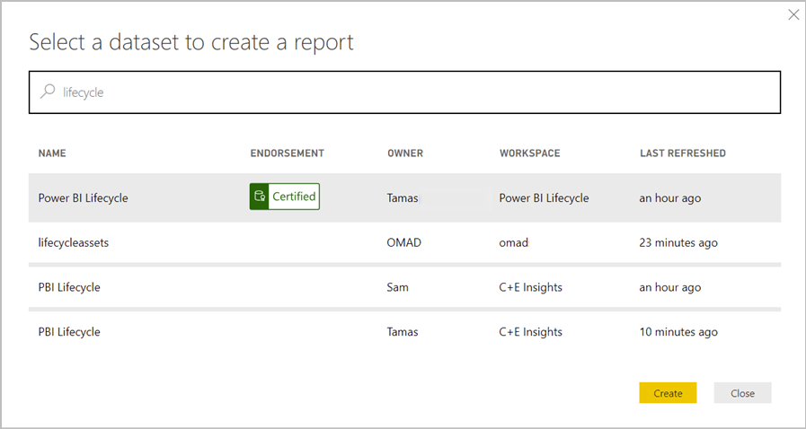

# บทนำชุดข้อมูลทั้งพื้นที่ทำงานIntro to datasets across workspaces

ข่าวกรองธุรกิจเป็นกิจกรรมการทำงานร่วมกันBusiness intelligence is a collaborative activity. เป็นสิ่งสำคัญในการสร้างชุดข้อมูลที่ได้มาตรฐานซึ่งอาจเป็น “แหล่งข้อมูลความจริงแหล่งเดียว”It's important to establish standardized datasets that can be the 'one source of truth.' การค้นหาและการนำชุดข้อมูลที่ได้มาตรฐานเหล่านั้นมาใช้ใหม่เป็นสิ่งสำคัญThen discovering and reusing those standardized datasets is key. เมื่อผู้สร้างข้อมูลที่เชี่ยวชาญในองค์กรของคุณจะสร้างและแชร์ชุดข้อมูลที่ปรับแต่งแล้ว ผู้สร้างรายงานสามารถเริ่มต้นใช้ชุดข้อมูลเหล่านั้นเพื่อสร้างรายงานที่ถูกต้องWhen expert data modelers in your organization create and share optimized datasets, report creators can start with those datasets to build accurate reports. แล้วองค์กรของคุณจะมีข้อมูลที่สอดคล้องกันสำหรับการตัดสินใจ และการพัฒนาข้อมูลที่สมบูรณ์แบบThen your organization has consistent data for making decisions, and a healthy data culture.

ใน Power BI ผู้สร้างชุดข้อมูลสามารถควบคุมผู้ที่สามารถเข้าถึงข้อมูลได้โดยใช้[สิทธิ์ในการสร้าง](service-datasets-build-permissions.md)In Power BI, dataset creators can control who has access to their data by using the [Build permission](service-datasets-build-permissions.md). ผู้สร้างชุดข้อมูลยังสามารถ *รับรอง* หรือ *เลื่อนระดับ* ชุดข้อมูลเพื่อให้ผู้อื่นสามารถค้นหาได้Dataset creators can also *certify* or *promote* datasets so others can discover them. ด้วยวิธีนั้น ผู้เขียนรายงานจะทราบว่าชุดข้อมูลใดที่มีคุณภาพสูงและเป็นทางการและพวกเขาสามารถใช้ชุดข้อมูลเหล่านั้นได้ทุกที่ที่พวกเขาเขียนใน Power BIThat way, report authors know which datasets are high quality and official, and they can use those datasets wherever they author in Power BI. ผู้ดูแลระบบมีการตั้งค่าผู้เช่าใหม่เพื่อ[ควบคุมการใช้งานชุดข้อมูลทั่วทั้งพื้นที่ทำงาน](service-datasets-admin-across-workspaces.md)Admins have a new tenant setting to [govern the use of datasets across workspaces](service-datasets-admin-across-workspaces.md).

## การแชร์ชุดข้อมูลและประสบการณ์การใช้งานพื้นที่ทำงานใหม่Dataset sharing and the new workspace experience

การสร้างรายงานที่ยึดตามชุดข้อมูลในพื้นที่ทำงานแตกต่างกัน และการคัดลอกรายงานไปยังพื้นที่ทำงานแตกต่างกันจะควบคู่ไปกับ[ประสบการณ์การใช้งานพื้นที่ทำงานใหม่](../collaborate-share/service-create-the-new-workspaces.md):Building reports based on datasets in different workspaces, and copying reports to different workspaces, are tightly coupled with the [new workspace experience](../collaborate-share/service-create-the-new-workspaces.md):

- ในบริการ เมื่อคุณเปิดแค็ตตาล็อกชุดข้อมูลจากประสบการณ์พื้นที่ทำงานใหม่ แค็ตตาล็อกชุดข้อมูลจะแสดงชุดข้อมูลที่อยู่ในพื้นที่ทำ งานของฉัน และในพื้นที่ทำงานที่มีประสบการณ์การใช้งานของพื้นที่ทำงานใหม่อันอื่นIn the service, when you open the dataset catalog from a new workspace experience, the dataset catalog shows datasets that are in your My Workspace and in other new workspace experience workspaces. 
- เมื่อคุณเปิดแค็ตตาล็อกชุดข้อมูลจากพื้นที่ทำงานแบบคลาสสิก เฉพาะคุณเท่านั้นที่เห็นชุดข้อมูลในพื้นที่ทำงานนั้น ซึ่งไม่ได้อยู่ในพื้นที่ทำงานอื่น ๆWhen you open the dataset catalog from a classic workspace, you only see the datasets in that workspace, not the ones in other workspaces.
- ใน Power BI Desktop คุณสามารถเผยแพร่รายงานที่เชื่อมต่อแบบสดกับพื้นที่ทำงานที่แตกต่างกัน ตราบใดที่ชุดข้อมูลเหล่านั้นอยู่ในพื้นที่ทำงานประสบการณ์การใช้งานใหม่In Power BI Desktop, you can publish Live Connect reports to different workspaces, as long as their datasets are in new experience workspaces.
- เมื่อคัดลอกรายงานทั้งพื้นที่ทำงาน พื้นที่ทำงานเป้าหมายต้องเป็นพื้นที่ทำงานประสบการณ์การใช้งานใหม่When copying reports across workspaces, the target workspace needs to be a new experience workspace.

## ค้นพบชุดข้อมูลDiscover datasets

เมื่อสร้างรายงานด้านบนของชุดข้อมูลที่มีอยู่ ขั้นตอนแรกคือการเชื่อมต่อกับชุดข้อมูล ในบริการ Power BI หรือ Power BI DesktopWhen building a report on top of an existing dataset, the first step is to connect to the dataset, either in the Power BI service or Power BI Desktop. อ่านเกี่ยวกับ [การค้นพบชุดข้อมูลจากพื้นที่ทำงานแตกต่างกัน](service-datasets-discover-across-workspaces.md)Read about [discovering datasets from different workspaces](service-datasets-discover-across-workspaces.md)

## คัดลอกรายงานCopy a report

เมื่อคุณพบรายงานที่คุณชอบในพื้นที่ทำงานหรือแอป คุณสามารถทำสำเนา และปรับเปลี่ยนให้พอดีกับความต้องการของคุณWhen you find a report you like, in a workspace or an app, you can make a copy of it, and then modify it to fit your needs. คุณไม่ต้องกังวลเกี่ยวกับการสร้างแบบจำลองข้อมูลYou don't have to worry about creating the data model. แบบจำลองจะถูกสร้างไว้แล้วสำหรับคุณThat's already created for you. และการแก้ไขรายงานที่มีอยู่นั้นง่ายกว่าการเริ่มจากศูนย์And it's much easier to modify an existing report than it is to start from scratch. อ่านเพิ่มเติมเกี่ยวกับ[การคัดลอกรายงาน](service-datasets-copy-reports.md)Read more about [copying reports](service-datasets-copy-reports.md).

## สิทธิในการสร้างสำหรับชุดข้อมูลBuild permission for datasets

ด้วยชนิดของสิทธิ์ในการสร้าง ถ้าคุณเป็นผู้สร้างชุดข้อมูล คุณสามารถกำหนดได้ว่าผู้ใดในองค์กรของคุณสามารถสร้างเนื้อหาใหม่ในชุดข้อมูลของคุณได้With Build permission type, if you're a dataset creator you can determine who in your organization can build new content on your datasets. ผู้ที่มีสิทธิ์ในการสร้างยังสามารถสร้างเนื้อหาใหม่ในชุดข้อมูลที่อยู่นอก Power BI เช่น แผ่นงาน Excel ที่ผ่านการวิเคราะห์ใน Excel, XMLA และส่งออกPeople with Build permission can also build new content on the dataset outside Power BI, such as Excel sheets via Analyze in Excel, XMLA, and export. อ่านเพิ่มเติมเกี่ยวกับ[สิทธิในการสร้าง](service-datasets-build-permissions.md)Read more about the [Build permission](service-datasets-build-permissions.md).

## การเลื่อนระดับและการออกใบรับรองPromotion and certification

ถ้าคุณสร้างชุดข้อมูล เมื่อคุณสร้างชุดข้อมูลที่ผู้อื่นสามารถใช้ประโยชน์ได้ คุณสามารถทำให้ง่ายต่อการค้นหาได้โดย[การเลื่อนระดับชุดข้อมูลของคุณ](../collaborate-share/service-endorse-content.md#promote-content)If you create datasets, when you create one that others can benefit from, you can make it easier for them to discover it by [promoting your dataset](../collaborate-share/service-endorse-content.md#promote-content). คุณอาจร้องขอให้ผู้เชี่ยวชาญในองค์กรของคุณ[รับรองชุดข้อมูลของคุณ](../collaborate-share/service-endorse-content.md#request-content-certification)ได้You can also request that experts in your organization [certify your dataset](../collaborate-share/service-endorse-content.md#request-content-certification).

## สิทธิ์การใช้งานLicensing

คุณลักษณะเฉพาะและประสบการณ์การใช้งานที่สร้างขึ้นบนความสามารถของชุดข้อมูลที่ใช้ร่วมกันจะได้รับสิทธิการใช้งานตามสถานการณ์สมมติที่มีอยู่The specific features and experiences built on shared dataset capabilities are licensed according to their existing scenarios. ตัวอย่างเช่น:For example:

- โดยทั่วไป การค้นพบและการเชื่อมต่อกับชุดข้อมูลที่แชร์จะพร้อมใช้งานสำหรับทุกคน – ซึ่งไม่ใช่คุณลักษณะที่จำกัดเฉพาะพรีเมียมIn general, discovering and connecting to shared datasets is available to anyone – it is not a feature restricted to Premium.
- ผู้ใช้ที่ไม่มีใบอนุญาต Pro จะสามารถใช้ชุดข้อมูลได้เฉพาะพื้นที่ทำงานสำหรับการเขียนรายงานเท่านั้น หากชุดข้อมูลเหล่านั้นอยู่ในพื้นที่ทำงานของฉันส่วนบุคคลของผู้ใช้หรือในพื้นที่ทำงานสำรองแบบพรีเมียมUsers without a Pro license can only use datasets across workspaces for report authoring if those datasets reside in the users' personal My Workspace or in a Premium-backed workspace. ข้อจำกัดการอนุญาตเดียวกันจะมีผลบังคับใช้ไม่ว่าจะเป็นผู้เขียนรายงานใน Power BI Desktop หรือในบริการของ Power BIThe same licensing restriction applies whether they author reports in Power BI Desktop or in the Power BI service.
- การคัดลอกรายงานระหว่างพื้นที่ทำงานจำเป็นต้องมีสิทธิ์การใช้งานระดับ ProCopying reports between workspaces requires a Pro license.
- การคัดลอกรายงานจากแอปต้องมีสิทธิใช้งานระดับ Pro ตามที่ต้องการสำหรับชุดเนื้อหาขององค์กรCopying reports from an app requires a Pro license, as was required for organizational content packs.
- การเลื่อนระดับและการรับรองชุดข้อมูลต้องมีสิทธิ์การใช้งานระดับ ProPromoting and certifying datasets requires a Pro license.

## ข้อควรพิจารณาและข้อจำกัดConsiderations and limitations

- ในฐานะผู้เผยแพร่แอป คุณต้องแน่ใจว่าผู้ชมของคุณสามารถเข้าถึงชุดข้อมูลภายนอกของพื้นที่ทำงานAs an app publisher you have to make sure that your audience has access to datasets outside of the workspace. ไม่เช่นนั้น ผู้ใช้จะพบกับปัญหาต่าง ๆ เมื่อใช้แอปของคุณ เช่น รายงานจะไม่ยอมเปิดโดยไม่มีการเข้าถึงชุดข้อมูล และไทล์แดชบอร์ดจะแสดงเป็นล็อกOtherwise, users will encounter issues when interacting with your app: reports won’t open without dataset access, and dashboard tiles will show as locked. นอกจากนี้ ผู้ใช้จะไม่สามารถเปิดแอปได้หากรายการแรกในการนำทางคือรายงานที่ไม่มีการเข้าถึงชุดข้อมูลAlso, users won’t be able to open the app if the first item in its navigation is a report without access to the dataset.
- การสร้างรายงานที่ด้านบนของชุดข้อมูลในพื้นที่ทำงานแตกต่างกันจำเป็นต้องมีประสบการณ์การใช้งานพื้นที่ทำงานใหม่ที่ทั้งสองด้าน: รายงานต้องอยู่ในประสบการณ์การใช้งานพื้นที่ทำงานใหม่ และชุดข้อมูลต้องอยู่ในประสบการณ์การใช้งานพื้นที่ทำงานใหม่Building a report on top of a dataset in a different workspace requires the new workspace experience at both ends: The report needs to be in a new workspace experience and the dataset needs to be in a new workspace experience. คุณสามารถคัดลอกรายงานในประสบการณ์พื้นที่ทำงานใหม่ไปยังประสบการณ์พื้นที่ทำงานใหม่อื่นที่ไม่ใช่พื้นที่ทำงานแบบคลาสสิกหรือพื้นที่ทำงานของฉันได้You can only copy reports in a new workspace experience to another new workspace experience, and not to classic workspaces or to My Workspace. 
- ในพื้นที่ทำงานแบบคลาสสิก ประสบการณ์การใช้งานการค้นหาชุดข้อมูลจะแสดงเฉพาะชุดข้อมูลในพื้นที่ทำงานนั้นเท่านั้นIn a classic workspace, the dataset discovery experience only shows the datasets in that workspace.
- การออกแบบ "เผยแพร่บนเว็บ" ไม่สามารถใช้ได้กับรายงานที่ยึดตามชุดข้อมูลที่ใช้ร่วมกันBy design, “Publish to web” doesn’t work for a report based on a shared dataset.
- ถ้ามีคน 2 คนเป็นสมาชิกของพื้นที่ทำงานที่กำลังเข้าถึงชุดข้อมูลที่ใช้ร่วมกัน เป็นไปได้ว่ามีเพียงหนึ่งคนเท่านั้นที่สามารถดูชุดข้อมูลที่เกี่ยวข้องในพื้นที่ทำงานIf two people are members of a workspace that is accessing a shared dataset, it's possible that only one of them can see the related dataset in the workspace. เฉพาะผู้ที่มีสิทธิการเข้าถึงแบบอ่านเป็นอย่างน้อยในชุดข้อมูลเท่านั้นที่สามารถเห็นชุดข้อมูลที่ใช้ร่วมกันได้Only people with at least Read access to the dataset can see the shared dataset. 

## ขั้นตอนถัดไปNext steps

- [เลื่อนระดับชุดข้อมูลPromote datasets](../collaborate-share/service-endorse-content.md#promote-content)
- [รับรองชุดข้อมูลCertify datasets](../collaborate-share/service-endorse-content.md#certify-content)
- [ร้องขอใบรับรองชุดข้อมูลRequest dataset certification](../collaborate-share/service-endorse-content.md#request-content-certification)
- [ควบคุมการใช้ชุดข้อมูลทั้งพื้นที่ทำงานGovern the use of datasets across workspaces](service-datasets-admin-across-workspaces.md)
- มีคำถามหรือไม่Questions? [ลองถามชุมชน Power BITry asking the Power BI Community](https://community.powerbi.com/)
