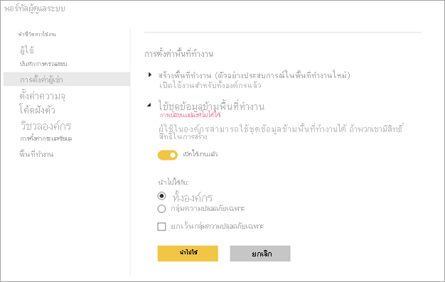
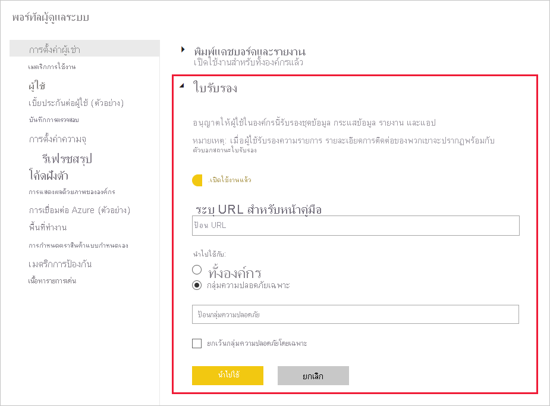

# ควบคุมการใช้งานชุดข้อมูลทั่วทั้งพื้นที่ทำงานControl the use of datasets across workspaces

การใช้ชุดข้อมูลทั้งพื้นที่ทำงานเป็นวิธีมีประสิทธิภาพเพื่อส่งเสริมวัฒนธรรมการเก็บข้อมูลและการพัฒนาข้อมูลให้เป็นระบบภายในองค์กรUsing datasets across workspaces is a powerful way to drive data culture and data democratization within an organization. ถ้าคุณเป็นผู้ดูแลระบบ Power BI ในบางครั้งคุณต้องการจำกัดการไหลของข้อมูลภายในผู้เช่า Power BIStill, if you're a Power BI admin, sometimes you want to restrict the flow of information within your Power BI tenant. ด้วยการตั้งค่าผู้เช่า **ใช้ชุดข้อมูลทั้งพื้นที่ทำงาน** คุณสามารถจำกัดการใช้ชุดข้อมูลซ้ำ ไม่ว่าจะทั้งหมดหรือบางส่วนต่อกลุ่มความปลอดภัยได้With the tenant setting **Use datasets across workspaces**, you can restrict dataset reuse either completely or partially per security groups.

หากคุณปิดการตั้งค่านี้ จะมีผลกระทบต่อผู้สร้างรายงาน:If you turn off this setting, here are the effects on report creators:

- ปุ่มคัดลอกรายงานทั้งพื้นที่ทำงานไม่พร้อมใช้งานThe button to copy reports across workspaces isn't available. 
- ในรายงานที่ยึดตามชุดข้อมูลที่ใช้ร่วมกัน ปุ่ม **แก้ไขรายงาน** ไม่พร้อมใช้งานIn a report based on a shared dataset, the **Edit report** button isn't available.
- ในบริการของ Power BI ประสบการณ์การค้นหาจะแสดงเฉพาะชุดข้อมูลในพื้นที่ทำงานปัจจุบันเท่านั้นIn the Power BI service, the discovery experience only shows datasets in the current workspace.
- ใน Power BI Desktop ประสบการณ์การค้นหาจะแสดงเฉพาะชุดข้อมูลจากพื้นที่ทำงานที่คุณเป็นสมาชิกเท่านั้นIn Power BI Desktop, the discovery experience only shows datasets from workspaces where you're a member.
- ใน Power BI Desktop ถ้าผู้ใช้เปิดไฟล์.pbix ด้วยการเชื่อมต่อสดไปยังชุดข้อมูลที่อยู่นอกพื้นที่ทำงานใด ๆ ที่ผู้ใช้เป็นสมาชิกของ พวกเขาจะเห็นข้อความแสดงข้อผิดพลาด ซึ่งขอให้พวกเขาเชื่อมต่อกับชุดข้อมูลอื่นIn Power BI Desktop, if users open a .pbix file with a live connection to a dataset outside any workspaces they are a member of, they see an error message asking them to connect to a different dataset.

## มีลิงก์สำหรับกระบวนการออกใบรับรองProvide a link for the certification process

ในฐานะผู้ดูแลระบบ Power BI คุณสามารถใส่ URL สำหรับลิงก์ **เรียนรู้เพิ่มเติม** บนหน้าการตั้งค่า **การรับรอง** ได้As a Power BI admin, you can provide a URL for the **Learn more** link on the **Endorsement** setting page.  ดู [เปิดการใช้งานใบรับรองเนื้อหา](../admin/service-admin-setup-certification.md) สำหรับรายละเอียดSee [Enable content certification](../admin/service-admin-setup-certification.md) for detail. ลิงก์นี้สามารถไปที่เอกสารประกอบเกี่ยวกับกระบวนการออกใบรับรองของคุณThis link can go to documentation about your certification process. ถ้าคุณไม่กำหนดปลายทางสำหรับลิงก์ **เรียนรู้เพิ่มเติม** ตามค่าเริ่มต้นจะลิงก์ไปยังบทความ [รับรองเนื้อหาของคุณ](../collaborate-share/service-endorse-content.md)If you don't provide a destination for the **Learn more** link, by default it points to the [Endorse your content](../collaborate-share/service-endorse-content.md) article.

## ขั้นตอนถัดไปNext steps

- [ใช้ชุดข้อมูลทั่วทั้งพื้นที่ทำงานUse datasets across workspaces](service-datasets-across-workspaces.md)
- มีคำถามหรือไม่Questions? [ลองถามชุมชน Power BITry asking the Power BI Community](https://community.powerbi.com/)
