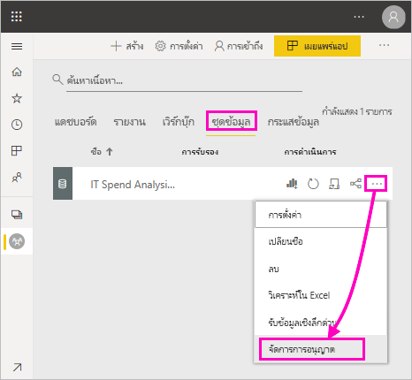
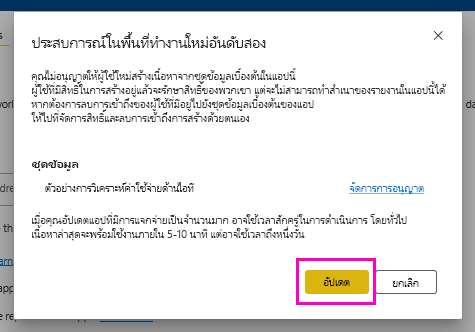

# สร้างสิทธิการอนุญาตสำหรับชุดข้อมูลที่ใช้ร่วมกันBuild permission for shared datasets

เมื่อคุณสร้างรายงานใน Power BI Desktop ข้อมูลในรายงานนั้นจะถูกจัดเก็บไว้ใน *แบบจำลองข้อมูล*When you create a report in Power BI Desktop, the data in that report is stored in a *data model*. เมื่อคุณเผยแพร่รายงานของคุณไปยังบริการ Power BI คุณยังได้เผยแพร่ข้อมูลเป็น *ชุดข้อมูล* ด้วยWhen you publish your reports to the Power BI service, you're also publishing the data as a *dataset*. คุณสามารถกำหนด *สิทธิ์ในการสร้าง* สำหรับรายงานดังกล่าวให้แก่ผู้อื่น เพื่อให้พวกเขาสามารถค้นหาและนำชุดข้อมูลที่คุณแชร์มาใช้ใหม่ได้You can give others *Build permission* for that report, so they can discover and reuse the dataset you've shared. บทความนี้อธิบายวิธีควบคุมการเข้าถึงข้อมูลโดยใช้สิทธิ์ในการสร้างThis article explains how you control access to the data by using the Build permission.

สิทธิ์ในการสร้างนำไปใช้กับชุดข้อมูลBuild permission applies to datasets. เมื่อคุณให้สิทธิ์ในการสร้างแก่ผู้ใช้ ผู้ใช้สามารถสร้างเนื้อหาใหม่ในชุดข้อมูลของคุณ เช่น รายงาน แดชบอร์ด ไทล์ที่ปักหมุดไว้จากฟังก์ชันถามตอบ และการค้นพบข้อมูลเชิงลึกได้When you give users Build permission, they can build new content on your dataset, such as reports, dashboards, pinned tiles from Q&A, and Insights Discovery. 

นอกจากนี้ผู้ใช้จำเป็นต้องมีสิทธิ์ในการสร้างเพื่อทำงานกับข้อมูล *ภายนอก* Power BI:Users also need Build permissions to work with the data *outside* Power BI:

- เมื่อต้องส่งออกข้อมูลเบื้องต้นTo export the underlying data.
- เมื่อต้องสร้างเนื้อหาใหม่บนชุดข้อมูล เช่น สร้างด้วย [Analyze ใน Excel](../collaborate-share/service-analyze-in-excel.md)To build new content on the dataset such as with [Analyze in Excel](../collaborate-share/service-analyze-in-excel.md).
- เมื่อต้องเข้าถึงข้อมูลผ่านจุดสิ้นสุดของ XMLATo access the data via the XMLA endpoint.

## วิธีการให้สิทธิ์ในการสร้างWays to give Build permission

คุณให้สิทธิ์ในการสร้างสำหรับชุดข้อมูลหนึ่ง ๆ ได้ด้วยสองสามวิธีต่อไปนี้:You give Build permission for a dataset in a few different ways:

- สมาชิกของพื้นที่ทำงานที่มีบทบาทผู้สนับสนุนอย่างน้อยหนึ่งบทบาทจะมีสิทธิ์ในการสร้างสำหรับชุดข้อมูลในพื้นที่ทำงานดังกล่าว และสิทธิ์ในการคัดลอกรายงานโดยอัตโนมัติMembers of a workspace with at least a Contributor role automatically have Build permission for datasets in that workspace, and permission to copy a report. อ่านเพิ่มเติมเกี่ยวกับ[บทบาทในพื้นที่ทำงานใหม่](../collaborate-share/service-new-workspaces.md#roles-in-the-new-workspaces)Read more about [roles in the new workspaces](../collaborate-share/service-new-workspaces.md#roles-in-the-new-workspaces).
 
- สมาชิกของพื้นที่ทำงานที่มีชุดข้อมูลสามารถกำหนดสิทธิ์ให้ผู้ใช้หรือกลุ่มความปลอดภัยที่เฉพาะเจาะจงในศูนย์การอนุญาตMembers of the workspace where the dataset resides can assign the permission to specific users or security groups in the Permission center. หากคุณเป็นสมาชิกของพื้นที่ทำงาน เลือก **ตัวเลือกเพิ่มเติม** (...) ที่อยู่ถัดจากชุดข้อมูล > **จัดการสิทธิ์**If you're a member of the workspace, select **More options** (...) next to a dataset > **Manage Permissions**.

    

    ซึ่งจะเปิดศูนย์การอนุญาตสำหรับชุดข้อมูลนั้นที่คุณสามารถตั้งค่าและเปลี่ยนแปลงสิทธิThat opens the Permission center for that dataset, where you can set and change permissions.

    

- ผู้ดูแลระบบหรือสมาชิกของพื้นที่ทำงานที่มีชุดข้อมูลสามารถตัดสินใจในระหว่างการเผยแพร่แอปว่าผู้ใช้ที่มีสิทธิสำหรับแอปจะได้รับสิทธิในการสร้างสำหรับชุดข้อมูลเบื้องต้นด้วยAn admin or member of the workspace where the dataset resides can decide during app publishing that users with permission for the app also get Build permission for the underlying datasets. ดูรายละเอียดได้ใน[แชร์ชุดข้อมูล](service-datasets-share.md)See [Share a dataset](service-datasets-share.md) for details.

- สมมติว่าคุณมีการแชร์ต่อและสิทธิ์ในการสร้างในชุดข้อมูลSay you have Reshare and Build permission on a dataset. เมื่อคุณแชร์รายงานหรือแดชบอร์ดที่สร้างขึ้นในชุดข้อมูลนั้น คุณสามารถระบุว่าผู้รับจะได้รับสิทธิ์ในการสร้างสำหรับชุดข้อมูลเบื้องต้นด้วยWhen you share a report or dashboard built on that dataset, you can specify that the recipients also get Build permission for the underlying dataset.

    

คุณสามารถลบสิทธิ์ในการสร้างของบุคคลสำหรับชุดข้อมูลได้You can remove a person's Build permission for a dataset. ถ้าคุณทำเช่นนั้น พวกเขายังคงสามารถดูรายงานที่สร้างบนชุดข้อมูลที่ใช้ร่วมกัน แต่จะสามารถไม่แก้ไขได้If you do, they can still see the report built on the shared dataset, but they can no longer edit it. ดูรายละเอียดได้ในส่วนถัดไปSee the next section for details.

## ลบสิทธิ์ในการสร้างสำหรับชุดข้อมูลRemove Build permission for a dataset

ในบางกรณี คุณอาจจำเป็นต้องลบสิทธิ์ในการสร้างสำหรับบางผู้ใช้ของชุดข้อมูลที่แชร์At some point, you may need to remove Build permission for some users of a shared dataset. 

1. ในพื้นที่ทำงาน ให้ไปที่หน้ารายการ **ชุดข้อมูล**In a workspace, go to the **Datasets** list page. 
1. เลือก **ตัวเลือกเพิ่มเติม** (...) ที่อยู่ถัดจากชุดข้อมูล > **จัดการสิทธิ์**Select **More options** (...) next to the dataset > **Manage permission**.

    

1. เลือก **ตัวเลือกเพิ่มเติม** (...) ที่อยู่ถัดจากชื่อ > **ลบการสร้าง**Select **More options** (...) next to a name > **Remove build**.

    

    ผู้ใช้ยังคงสามารถดูรายงานที่สร้างไว้ในชุดข้อมูลที่แชร์ แต่จะไม่สามารถแก้ไขได้They can still see the report built on the shared dataset, but they can no longer edit it.

### ลบสิทธิ์ในการสร้างสำหรับชุดข้อมูลในแอปRemove Build permission for a dataset in an app

สมมติว่าคุณแจกจ่ายแอปจากพื้นที่ทำงานไปยังกลุ่มบุคคลSay you've distributed an app from a workspace to a group of people. หลังจากนั้น คุณตัดสินใจที่จะลบการเข้าถึงแอปสำหรับบุคคลบางคนLater, you decide to remove access to the app for some people. การลบการเข้าถึงแอปของบุคคลจะไม่ลบสิทธิ์ในการสร้างและแชร์โดยอัตโนมัติRemoving their access to the app doesn't automatically remove their build and reshare permissions. นี่เป็นขั้นตอนพิเศษThat's an extra step. 

1. ในหน้ารายการพื้นที่ทำงาน ให้เลือก **อัปเดตแอป**In a workspace list page, select **Update app**. 

    

1. ในแท็บ **สิทธิ์** ให้เลือก **X** เพื่อลบบุคคลหรือกลุ่มOn the **Permissions** tab, select the **X** to delete the person or group. 

    
1. เลือก **อัปเดตแอป**Select **Update app**.

    คุณจะเห็นข้อความที่อธิบายว่าคุณจำเป็นต้องไปที่ **จัดการสิทธิ์** เพื่อลบสิทธิ์ในการสร้างสำหรับผู้ใช้ที่มีการเข้าถึงอยู่You see a message explaining that you need to go to **Manage permissions** to remove Build permission for users with existing access. 

    

1. เลือก **อัปเดต**Select **Update**.

1. ในพื้นที่ทำงาน ให้ไปที่หน้ารายการ **ชุดข้อมูล**In the workspace, go to the **Datasets** list page. 
1. เลือก **ตัวเลือกเพิ่มเติม** (...) ที่อยู่ถัดจากชุดข้อมูล > **จัดการสิทธิ์**Select **More options** (...) next to the dataset > **Manage permission**.

    

1. เลือก **ตัวเลือกเพิ่มเติม** (...) ที่อยู่ถัดจากชื่อ > **ลบการสร้าง**Select **More options** (...) next to their name > **Remove build**.

    

    ผู้ใช้ยังคงสามารถดูรายงานที่สร้างไว้ในชุดข้อมูลที่แชร์ แต่จะไม่สามารถแก้ไขได้They can still see the report built on the shared dataset, but they can no longer edit it.

## สิทธิที่แยกย่อยมากขึ้นMore granular permissions

Power BI เปิดตัวสิทธิ์ในการสร้างในเดือนมิถุนายน 2019 ซึ่งเป็นส่วนเสริมของสิทธิ์ที่มีอยู่ อ่านและแชร์ต่อPower BI introduced Build permission in June 2019 as a complement to the existing permissions, Read and Reshare. ผู้ใช้ทั้งหมดที่อยู่มีสิทธิ์ในการอ่านสำหรับชุดข้อมูลผ่านการอนุญาตของแอป การแชร์ หรือการเข้าถึงพื้นที่ทำงานในขณะนั้น ยังได้รับสิทธิ์ในการสร้างสำหรับชุดข้อมูลเดียวกันเหล่านั้นด้วยAll users who already had Read permission for datasets via app permissions, sharing, or workspace access at that time also got Build permission for those same datasets. โดยจะได้รับสิทธิในการสร้างอัตโนมัติเนื่องจากสิทธิในการอ่านได้ให้สิทธิในการสร้างเนื้อหาใหม่ที่ด้านบนของชุดข้อมูล โดยใช้การวิเคราะห์ใน Excel หรือส่งออกThey got Build permission automatically because Read permission already granted them the right to build new content on top of the dataset, by using Analyze in Excel or Export.

ด้วยสิทธิในการสร้างที่แยกย่อยมากขึ้นนี้ คุณสามารถเลือกผู้ที่สามารถดูได้เฉพาะเนื้อหาในรายงานหรือแดชบอร์ดที่มีอยู่เท่านั้น และผู้ที่สามารถสร้างเนื้อหาที่เชื่อมต่อกับชุดข้อมูลเบื้องต้นWith this more granular Build permission, you can choose who can only view the content in the existing report or dashboard and who can create content connected to the underlying datasets.

ถ้าชุดข้อมูลของคุณกำลังถูกใช้โดยรายงานที่อยู่นอกพื้นที่ทำงานชุดข้อมูล คุณไม่สามารถลบชุดข้อมูลนั้นIf your dataset is being used by a report outside the dataset workspace, you can't delete that dataset. แต่คุณสามารถดูข้อความแสดงข้อผิดพลาดได้Instead, you see an error message.

คุณสามารถลบสิทธิ์ในการสร้างได้You can remove Build permission. ถ้าคุณทำเช่นนั้น บุคคลที่คุณยกเลิกสิทธิ์ไปแล้วจะยังสามารถเห็นรายงานได้ แต่ไม่สามารถแก้ไขรายงานหรือส่งออกข้อมูลพื้นฐานได้อีกIf you do, the people whose permissions you have revoked can still see the report, but can no longer edit the report or export underlying data. เฉพาะผู้ใช้ที่มีสิทธิ์ในการอ่านเท่านั้นที่ยังสามารถส่งออกข้อมูลสรุปได้Users with only read permission can still export summarized data. 

## ขั้นตอนถัดไปNext steps

- [ใช้ชุดข้อมูลทั่วทั้งพื้นที่ทำงานUse datasets across workspaces](service-datasets-across-workspaces.md)
- มีคำถามหรือไม่Questions? [ลองถามชุมชน Power BITry asking the Power BI Community](https://community.powerbi.com/)
