# คัดลอกรายงานจากพื้นที่ทำงานอื่นCopy reports from other workspaces

เมื่อคุณพบรายงานที่คุณชอบในพื้นที่ทำงานหรือแอป คุณสามารถทำสำเนา และบันทึกไว้ในพื้นที่ทำงานอื่นได้When you find a report you like in a workspace or an app, you can make a copy of it and save it to a different workspace. จากนั้นคุณสามารถปรับเปลี่ยนสำเนารายงานของคุณโดยการเพิ่มหรือลบภาพวิชวลและองค์ประกอบอื่น ๆThen you can modify your copy of the report, adding or deleting visuals and other elements. คุณไม่ต้องกังวลเกี่ยวกับการสร้างแบบจำลองข้อมูลYou don't have to worry about creating the data model. แบบจำลองจะถูกสร้างไว้แล้วสำหรับคุณIt's already created for you. และการแก้ไขรายงานที่มีอยู่นั้นง่ายกว่าการเริ่มจากศูนย์And it's much easier to modify an existing report than it is to start from scratch. อย่างไรก็ตาม เมื่อคุณสร้างแอปขึ้นจากพื้นที่ทำงานของคุณ ในบางครั้งคุณไม่สามารถเผยแพร่สำเนาของรายงานในแอปได้However, when you make an app from your workspace, sometimes you can't publish your copy of the report in the app. โปรดดู [ข้อควรพิจารณาและข้อจำกัดในบทความ "ใช้ชุดข้อมูลในพื้นที่ทำงาน"](service-datasets-across-workspaces.md#considerations-and-limitations) สำหรับรายละเอียดเพิ่มเติมSee [Considerations and limitations in the article "Use datasets across workspaces"](service-datasets-across-workspaces.md#considerations-and-limitations) for details.

## สิ่งที่จำเป็นต้องมีPrerequisites

- หากต้องการคัดลอกรายงาน คุณต้องมีสิทธิ์การใช้งานระดับ Pro แม้ว่ารายงานต้นฉบับจะอยู่ในพื้นที่ทำงานในความจุพรีเมียมก็ตามTo copy a report, you need a Pro license, even if the original report is in a workspace in a Premium capacity.
- หากต้องการคัดลอกรายงาน และสร้างรายงานในพื้นที่ทำงานหนึ่งโดยยึดตามชุดข้อมูลในพื้นที่ทำงานอื่น คุณจำเป็นต้องมีสิทธิ์การสร้างสำหรับชุดข้อมูลTo copy a report, or to create a report in one workspace based on a dataset in another workspace, you need Build permission for the dataset. สำหรับชุดข้อมูลในพื้นที่ทำงานดั้งเดิม ผู้ใช้ที่มีบทบาทผู้ดูแลระบบ สมาชิก และผู้สนับสนุนมีสิทธิ์การสร้างผ่านบทบาทพื้นที่ทำงานของตนเองโดยอัตโนมัติFor datasets in the original workspace, the people with Admin, Member, and Contributor roles automatically have Build permission through their workspace role. โปรดดู [บทบาทในพื้นที่ทำงานใหม่](../collaborate-share/service-new-workspaces.md#roles-in-the-new-workspaces) สำหรับรายละเอียดSee [Roles in the new workspaces](../collaborate-share/service-new-workspaces.md#roles-in-the-new-workspaces) for details.

## บันทึกสำเนาของรายงานในพื้นที่ทำงานSave a copy of a report in a workspace

1. ในพื้นที่ทำงาน ไปยังมุมมองรายการรายงานIn a workspace, go to the Reports list view.

    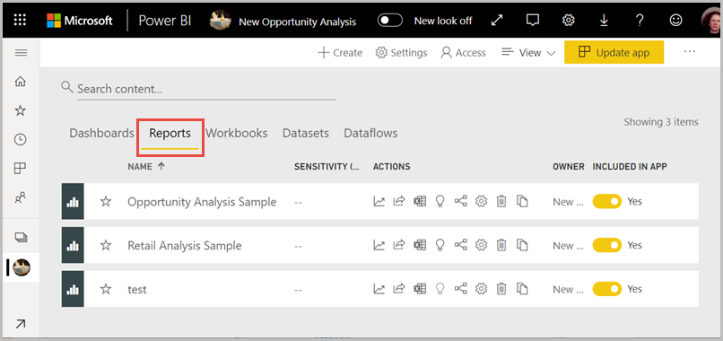

1. ภายใต้ **การดำเนินการ** เลือก **บันทึกสำเนา**Under **Actions**, select **Save a copy**.

    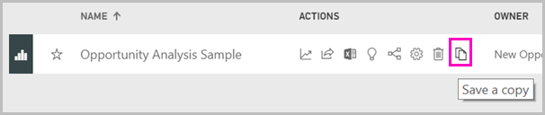

    คุณจะเห็นเฉพาะไอคอน **บันทึกสำเนา** หากรายงานอยู่ในพื้นที่ทำงานประสบการณ์ใหม่ และคุณได้รับ [สิทธิ์ในการสร้าง](service-datasets-build-permissions.md)You only see the **Save a copy** icon if the report is in a new experience workspace, and you have [Build permission](service-datasets-build-permissions.md). แม้ว่าคุณสามารถเข้าถึงพื้นที่ทำงานได้ แต่คุณจะต้องมีสิทธิ์ในการสร้างสำหรับชุดข้อมูลEven if you have access to the workspace, you have to have Build permission for the dataset.

3. ใน **บันทึกสำเนาของรายงานนี้** ให้ตั้งชื่อรายงานและเลือกพื้นที่ทำงานปลายทางIn **Save a copy of this report**, give the report a name and select the destination workspace.

    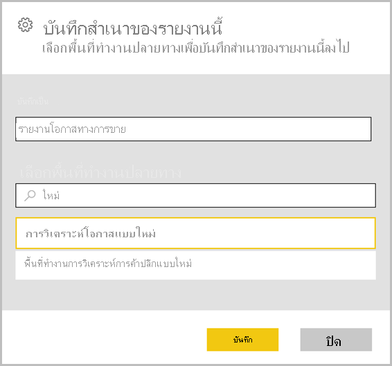

    คุณสามารถบันทึกรายงานไว้ในพื้นที่ทำงานปัจจุบันหรือที่อื่นในบริการของ Power BIYou can save the report to the current workspace or a different one in the Power BI service. คุณเห็นเฉพาะพื้นที่ทำงานที่เป็นพื้นที่ทำงานประสบการณ์ใหม่ ซึ่งคุณเป็นสมาชิกเท่านั้นYou only see workspaces that are new experience workspaces, in which you're a member. 
  
4. เลือก **บันทึก**Select **Save**.

    Power BI จะสร้างสำเนาของรายงานและรายการต่างๆ ในรายการของชุดข้อมูลโดยอัตโนมัติ หากรายงานนั้นอ้างอิงจากชุดข้อมูลที่อยู่ภายนอกพื้นที่ทำงานPower BI automatically creates a copy of the report, and an entry in the list of datasets if the report is based on a dataset outside of the workspace. ไอคอนสำหรับชุดข้อมูลนี้จะแตกต่างจากไอคอนสำหรับชุดข้อมูลในพื้นที่ทำงาน:The icon for this dataset is different from the icon for datasets in the workspace: 
    
    ด้วยวิธี สมาชิกของพื้นที่ทำงานสามารถบอกว่ารายงานและแดชบอร์ดใดใช้ชุดข้อมูลที่อยู่นอกพื้นที่ทำงานThat way, members of the workspace can tell which reports and dashboards use datasets that are outside the workspace. รายการจะแสดงข้อมูลเกี่ยวกับชุดข้อมูลและการดำเนินการเลือกสองสามอย่างThe entry shows information about the dataset, and a few select actions.

    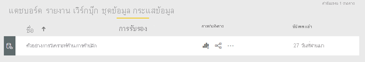

    โปรดดู [สำเนาของรายงานของคุณ](#your-copy-of-the-report) ในบทความนี้สำหรับข้อมูลเพิ่มเติมเกี่ยวกับรายงานและชุดข้อมูลที่เกี่ยวข้องSee [Your copy of the report](#your-copy-of-the-report) in this article for more about the report and related dataset.

## คัดลอกรายงานในแอปCopy a report in an app

1. ภายในแอป ให้คุณเปิดรายงานที่คุณต้องการคัดลอกIn an app, open the report you want to copy.
2. ในแถบเมนู เลือก **ตัวเลือกเพิ่มเติม** ( **...** ) > **บันทึกสำเนา**In the menu bar, select **More options** (**...**) > **Save a copy**.

    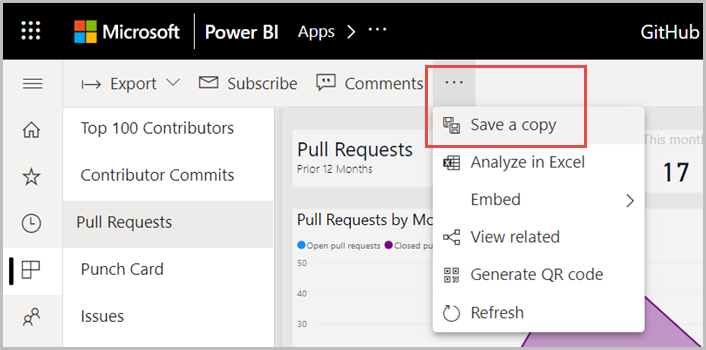

    คุณจะเห็นตัวเลือก **บันทึกสำเนา** เท่านั้นถ้ารายงานอยู่ในพื้นที่ทำงานใหม่และคุณมี [สิทธิ์ในการสร้าง](service-datasets-build-permissions.md)You only see the **Save a copy** option if the report is in a new experience workspace, and you have [Build permission](service-datasets-build-permissions.md).

3. ตั้งชื่อให้รายงานของคุณ > **บันทึก**Give your report a name > **Save**.

    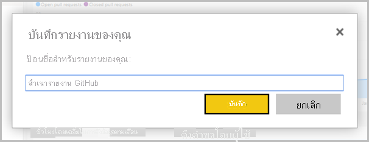

    สำเนาของคุณจะถูกบันทึกไปยัง พื้นที่ทำงานของฉัน โดยอัตโนมัติYour copy is automatically saved to your My Workspace.

4. เลือก **ไปยังรายงาน** เพื่อเปิดสำเนาของคุณSelect **Go to report** to open your copy.

## สำเนาของรายงานของคุณYour copy of the report

เมื่อคุณบันทึกสำเนาของรายงาน คุณจะสร้างการเชื่อมต่อสดกับชุดข้อมูล และสามารถเปิดประสบการณ์ในการสร้างรายงานพร้อมกับชุดข้อมูลทั้งหมดที่พร้อมใช้งานWhen you save a copy of the report, you create a live connection to the dataset, and you can open the report creation experience with the full dataset available. 

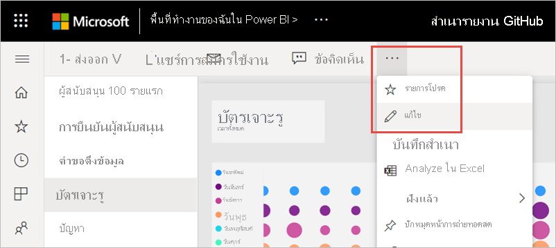

คุณยังไม่ได้ทำสำเนาของชุดข้อมูลYou haven't made a copy of the dataset. ชุดข้อมูลยังคงอยู่ในตำแหน่งเดิมThe dataset still resides in its original location. คุณสามารถใช้ตารางและหน่วยวัดทั้งหมดในชุดข้อมูลในรายงานของคุณเองYou can use all tables and measures in the dataset in your own report. ข้อจำกัดด้านความปลอดภัยระดับแถว (RLS) บนชุดข้อมูลจะมีผล เพื่อให้คุณเท่านั้นดูข้อมูลที่คุณมีสิทธิในการดูตามบทบาท RLS ของคุณRow-level security (RLS) restrictions on the dataset are in effect, so you only see data you have permissions to see based on your RLS role.

## ดูชุดข้อมูลที่เกี่ยวข้องView related datasets

เมื่อคุณมีรายงานในพื้นที่ทำงานหนึ่งที่อ้างอิงจากชุดข้อมูลในพื้นที่ทำงานอื่น คุณอาจจำเป็นต้องทราบข้อมูลเพิ่มเติมเกี่ยวกับชุดข้อมูลอ้างอิงมานั้นWhen you have a report in one workspace based on a dataset in another workspace, you may need to know more about the dataset it's based on.

1. ในมุมมองรายการรายงาน เลือก **มุมมองที่เกี่ยวข้อง**In the Reports list view, select **View related**.

    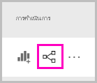

1. กล่องโต้ตอบ **เนื้อหาที่เกี่ยวข้อง** จะแสดงรายการที่เกี่ยวข้องทั้งหมดThe **Related content** dialog box shows all related items. ในรายการนี้ ชุดข้อมูลมีลักษณะเป็นอย่างอื่นIn this list, the dataset looks like any other. คุณไม่สามารถบอกได้ว่าชุดข้อมูลนั้นอยู่ในพื้นที่ทำงานอื่นYou can't tell it resides in a different workspace. ปัญหานี้เป็นที่รู้จักThis issue is known.
 
    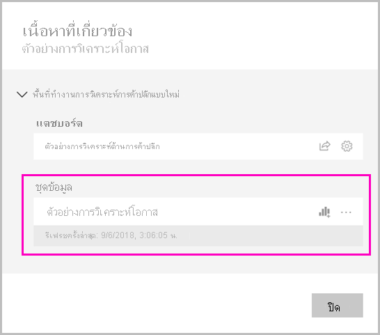

## ลบรายงานและชุดข้อมูลที่ใช้ร่วมกันDelete a report and its shared dataset

คุณอาจตัดสินใจว่าคุณไม่ต้องการรายงานและชุดข้อมูลเชื่อมโยงที่ใช้ร่วมกันในพื้นที่ทำงานYou may decide you no longer want the report and its associated shared dataset in workspace.

1. ลบรายงานDelete the report. ในรายการของรายงานในพื้นที่ทำงาน เลือกไอคอน **ลบ**In the list of reports in the workspace, select the **Delete** icon.

    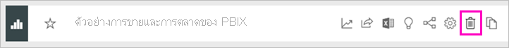

2. ในรายการของชุดข้อมูล คุณจะเห็นว่าชุดข้อมูลที่ใช้ร่วมกันไม่มีไอคอน **ลบ**In the list of datasets, you see the shared datasets don't have **Delete** icons. รีเฟรชหน้า หรือไปยังหน้าอื่น และย้อนกลับRefresh the page, or go to a different page and return. ชุดข้อมูลจะหายไปThe dataset will be gone. หากไม่ ให้ตรวจสอบ **มุมมองที่เกี่ยวข้อง**If not, check **View related**. ซึ่งอาจเกี่ยวข้องกับตารางอื่นในพื้นที่ทำงานของคุณIt may be related to another table in your workspace.

    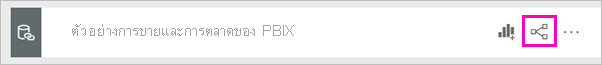

    > [!NOTE]
    > การลบข้อมูลที่ใช้ร่วมกันในพื้นที่ทำงานจะไม่ลบชุดข้อมูลDeleting the shared dataset in this workspace doesn't delete the dataset. โดยจะลบเฉพาะการอ้างอิงIt just deletes the reference to it.

## ขั้นตอนถัดไปNext steps

- [ใช้ชุดข้อมูลทั่วทั้งพื้นที่ทำงานUse datasets across workspaces](service-datasets-across-workspaces.md)
- มีคำถามหรือไม่Questions? [ลองถามชุมชน Power BITry asking the Power BI Community](https://community.powerbi.com/)
