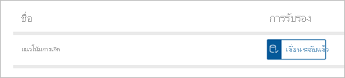

# สร้างรายงานที่ยึดตามชุดข้อมูลจากพื้นที่ทำงานอื่นCreate reports based on datasets from different workspaces

เรียนรู้วิธีการที่คุณสามารถสร้างรายงานในพื้นที่ทำงานของคุณเองโดยยึดตามชุดข้อมูลในพื้นที่ทำงานอื่น ๆLearn how you can create reports in your own workspaces based on datasets in other workspaces. หากต้องการสร้างรายงานที่ด้านบนของชุดข้อมูลที่มีอยู่ คุณสามารถเริ่มต้นจาก Power BI Desktop หรือจากบริการของ Power BI ในพื้นที่ทำงานของฉัน หรือใน[ประสบการณ์การใช้งานพื้นที่ทำงานใหม่](../collaborate-share/service-create-the-new-workspaces.md)ได้To build a report on top of an existing dataset, you can start from Power BI Desktop or from the Power BI service, in your My Workspace or in a [new workspace experience](../collaborate-share/service-create-the-new-workspaces.md).

- ในบริการของ Power BI: **รับข้อมูล** > **ชุดข้อมูลที่เผยแพร่**In the Power BI service: **Get data** > **Published datasets**.
- ใน Power BI Desktop: **รับข้อมูล** > **ชุดข้อมูล Power BI**In Power BI Desktop: **Get data** > **Power BI datasets**.

    
   
ในทั้งสองกรณี ประสบการณ์การค้นพบชุดข้อมูลเริ่มต้นในกล่องโต้ตอบนี้ **เลือกชุดข้อมูลเพื่อสร้างรายงาน**In both cases, the dataset discovery experience starts in this dialog box, **Select a dataset to create a report**. คุณจะเห็นชุดข้อมูลทั้งหมดที่คุณสามารถเข้าถึงโดยไม่คำนึงถึงตำแหน่งที่ชุดข้อมูลเหล่านั้นอยู่:You see all the datasets you have access to, regardless of where they are:

คุณสังเกตเห็นชุดข้อมูลแรกติดป้ายชื่อ **เลื่อนระดับ**You notice the first one is labeled **Promoted**. เราจะดำเนินการเช่นนั้นใน[ค้นหาชุดข้อมูลที่รับรองแล้ว](#find-an-endorsed-dataset) ในภายหลังในบทความนี้We'll get to that in [Find an endorsed dataset](#find-an-endorsed-dataset), later in this article.

ชุดข้อมูลที่คุณเห็นรายการนี้จะตรงกับเงื่อนไขต่อไปนี้อย่างน้อยหนึ่งข้อ:The datasets you see in this list meet at least one of the following conditions:

- ชุดข้อมูลอยู่ในพื้นที่ทำงานที่มีประสบการณ์การใช้งานพื้นที่ทำงานใหม่ที่ใดที่หนึ่ง และคุณเป็นสมาชิกของพื้นที่ทำงานนั้นThe dataset is in one of the new workspace experience workspaces, and you're a member of that workspace. ดู[ข้อควรพิจารณาและข้อจำกัด](service-datasets-across-workspaces.md#considerations-and-limitations)See [Considerations and limitations](service-datasets-across-workspaces.md#considerations-and-limitations).
- คุณมีสิทธิในการสร้างสำหรับชุดข้อมูล ซึ่งอยู่ในพื้นที่ทำงานที่มีประสบการณ์การใช้งานพื้นที่ทำงานใหม่You have Build permission for the dataset, which is in a new workspace experience workspace.
- ชุดข้อมูลอยู่ในพื้นที่ทำงานของฉันThe dataset is in your My Workspace.

> [!NOTE]
> ถ้าคุณเป็นผู้ใช้ฟรี คุณจะเห็นเฉพาะชุดข้อมูลในพื้นที่ทำงานของฉันหรือชุดข้อมูลที่ที่คุณมีสิทธิในการสร้างที่อยู่ในพื้นที่ทำงานของความจุแบบพรีเมียมIf you're a free user, you only see datasets in your My Workspace, or datasets for which you have Build permission that are in Premium-capacity workspaces.

เมื่อคุณคลิกที่ **สร้าง** คุณสร้างการเชื่อมต่อสดกับชุดข้อมูล และประสบการณ์ในการสร้างรายงานจะเปิดขึ้นพร้อมกับชุดข้อมูลทั้งหมดที่พร้อมใช้งานWhen you click **Create**, you create a live connection to the dataset, and the report creation experience opens with the full dataset available. คุณยังไม่ได้ทำสำเนาของชุดข้อมูลYou haven't made a copy of the dataset. ชุดข้อมูลยังคงอยู่ในตำแหน่งเดิมThe dataset still resides in its original location. คุณสามารถใช้ตารางและหน่วยวัดทั้งหมดในชุดข้อมูลเพื่อสร้างรายงานของคุณเองYou can use all tables and measures in the dataset to build your own reports. ข้อจำกัดด้านความปลอดภัยระดับแถว (RLS) บนชุดข้อมูลจะมีผล เพื่อให้คุณเท่านั้นดูข้อมูลที่คุณมีสิทธิในการดูตามบทบาท RLS ของคุณRow-level security (RLS) restrictions on the dataset are in effect, so you only see data you have permissions to see based on your RLS role.

คุณสามารถบันทึกรายงานไปยังพื้นที่ทำงานปัจจุบันในบริการของ Power BI หรือเผยแพร่รายงานไปยังพื้นที่ทำงานจาก Power BI DesktopYou can save the report to the current workspace in the Power BI service, or publish the report to a workspace from Power BI Desktop. Power BI สร้างรายการในรายชื่อของชุดข้อมูลโดยอัตโนมัติถ้ารายงานที่ยึดตามชุดข้อมูลที่อยู่นอกพื้นที่ทำงานPower BI automatically creates an entry in the list of datasets if the report is based on a dataset outside of the workspace. ไอคอนสำหรับชุดข้อมูลนี้จะแตกต่างจากไอคอนสำหรับชุดข้อมูลในพื้นที่ทำงาน:The icon for this dataset is different from the icon for datasets in the workspace: 

ด้วยวิธี สมาชิกของพื้นที่ทำงานสามารถบอกว่ารายงานและแดชบอร์ดใดใช้ชุดข้อมูลที่อยู่นอกพื้นที่ทำงานThat way, members of the workspace can tell which reports and dashboards use datasets that are outside the workspace. รายการจะแสดงข้อมูลเกี่ยวกับชุดข้อมูลและการดำเนินการเลือกสองสามอย่างThe entry shows information about the dataset, and a few select actions.

## ค้นหาชุดข้อมูลที่รับรองแล้วFind an endorsed dataset

มีชุดข้อมูลที่รับรองแล้วสองชนิดแตกต่างกันThere are two different kinds of endorsed datasets. เจ้าของชุดข้อมูลสามารถ *เลื่อนระดับ* ชุดข้อมูลที่พวกเขาแนะนำให้คุณได้Dataset owners can *promote* a dataset that they recommend to you. นอกจากนี้ ผู้ดูแลระบบ Power BI ยังสามารถกำหนดผู้เชี่ยวชาญในองค์กรของคุณที่สามารถ *รับรอง* ชุดข้อมูลสำหรับทุกคนที่จะใช้Also, the Power BI admin can designate experts in your organization who can *certify* datasets for everyone to use. ทั้งชุดข้อมูลที่เลื่อนระดับและได้รับการรับรองจะแสดง *ตัวบอกสถานะ* ที่คุณเห็นทั้งสองอย่างเมื่อค้นหาชุดข้อมูล และในรายชื่อของชุดข้อมูลในพื้นที่ทำงานPromoted and certified datasets both display *badges* that you see both when looking for a dataset, and in the list of datasets in a workspace. ชื่อของบุคคลที่ได้รับการรับรองชุดข้อมูลแล้วจะแสดงในคำแนะนำในระหว่างประสบการณ์การค้นหาชุดข้อมูล โฮเวอร์เหนือป้ายกำกับ **รับรองแล้ว** และคุณเห็นThe name of the person who certified a dataset is displayed in a tooltip during the dataset discovery experience; hover over the **Certified** label and you see it.

- ในบริการของ Power BI: **รับข้อมูล** > **ชุดข้อมูลที่เผยแพร่**In the Power BI service: **Get data** > **Published datasets**.
- ใน Power BI Desktop: **รับข้อมูล** > **ชุดข้อมูล Power BI**In Power BI Desktop: **Get data** > **Power BI datasets**.

    ในกล่องโต้ตอบ **เลือกชุดข้อมูล** ชุดข้อมูลที่รับรองแล้วจะอยู่ด้านบนรายการตามค่าเริ่มต้นIn the **Select a dataset** dialog box, endorsed datasets top the list by default. 

    

## ขั้นตอนถัดไปNext steps

- [ใช้ชุดข้อมูลทั่วทั้งพื้นที่ทำงานUse datasets across workspaces](service-datasets-across-workspaces.md)
- มีคำถามหรือไม่Questions? [ลองถามชุมชน Power BITry asking the Power BI Community](https://community.powerbi.com/)
