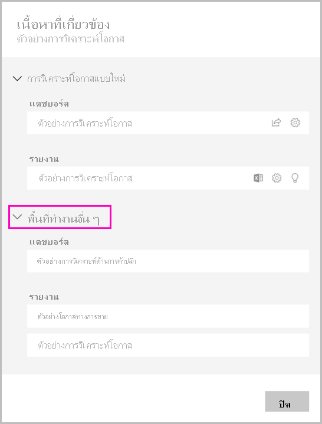

# แชร์ชุดข้อมูลShare a dataset

ในฐานะผู้สร้าง *แบบจำลองข้อมูล* ใน Power BI Desktop คุณกำลังสร้าง *ชุดข้อมูล* ที่คุณสามารถแจกจ่ายได้ในบริการของ Power BIAs a creator of *data models* in Power BI Desktop, you're creating *datasets* that you can distribute in the Power BI service. จากนั้น ผู้สร้างรายงานอื่น ๆ สามารถใช้ชุดข้อมูลของคุณเป็นพื้นฐานสำหรับรายงานของตนเองThen other report creators can use your datasets as a basis for their own reports. ในบทความนี้ คุณจะได้เรียนรู้วิธีการแชร์ชุดข้อมูลของคุณIn this article, you learn how to share your datasets. หากต้องการเรียนรู้วิธีการให้และลบการเข้าถึงชุดข้อมูลที่คุณแชร์ กรุณาอ่านเกี่ยวกับ[สิทธิ์ในการสร้าง](service-datasets-build-permissions.md)To learn how to give and remove access to your shared datasets, read about the [Build permission](service-datasets-build-permissions.md).

## ขั้นตอนการแชร์ชุดข้อมูลSteps to sharing your dataset

1. คุณต้องเริ่มต้นโดยการสร้างไฟล์.pbix ด้วยแบบจำลองข้อมูลใน Power BI DesktopYou start by creating a .pbix file with a data model in Power BI Desktop. หากคุณวางแผนที่จะเสนอชุดข้อมูลนี้ให้ผู้อื่นสร้างรายงาน คุณอาจไม่ได้ออกแบบรายงานในไฟล์. pbixIf you're planning to offer this dataset for others to build reports, you may not even design a report in the .pbix file.

    แนวทางปฏิบัติที่ดีที่สุดคือการบันทึกไฟล์.pbix ไว้ใน Microsoft 365 GroupA best practice is to save the .pbix file to a Microsoft 365 group.

1. เผยแพร่ไฟล์.pbix ไปยัง[ประสบการณ์การใช้งานพื้นที่ทำงานใหม่](../collaborate-share/service-create-the-new-workspaces.md)ในบริการของ Power BIPublish the .pbix file to a [new workspace experience](../collaborate-share/service-create-the-new-workspaces.md) in the Power BI service.
    
    แล้วสมาชิกอื่น ๆ ในพื้นที่ทำงานนี้จะสามารถสร้างรายงานในพื้นที่ทำงานอื่น ๆ โดยยึดตามชุดข้อมูลนี้Already, other members of this workspace can create reports in other workspaces based on this dataset. ใช้ตัวเลือกจัดการสิทธิ์บนชุดข้อมูลในรายการเนื้อหาพื้นที่ทำงานให้ผู้ใช้เพิ่มเติมในการเข้าถึงชุดข้อมูลUse the Manage Permissions option on the dataset in the workspace content list give additional users access to the dataset. 

1. คุณยังสามารถ[เผยแพร่แอป](../collaborate-share/service-create-distribute-apps.md)จากพื้นที่ทำงานนี้You can also [publish an app](../collaborate-share/service-create-distribute-apps.md) from this workspace. เมื่อคุณเช่นนั้น บนหน้า **สิทธิ** คุณสามารถระบุได้ว่าใครมีสิทธิและสามารถทำอะไรได้บ้างWhen you do, on the **Permissions** page, you specify who has permissions and what they can do.

    > [!NOTE]
    > หากคุณเลือก **ทั้งองค์กร** จะไม่มีผู้ใดในองค์กรจะได้รับสิทธิ์ในการสร้างIf you select **Entire organization**, then no one in the organization will have Build permission. ปัญหานี้เป็นที่รู้จักกันแล้วThis issue is already known. ให้ระบุอยู่อีเมลใน **เฉพาะบุคคลหรือกลุ่ม**Instead, specify email addresses in **Specific individuals or groups**.  หากคุณต้องการให้ทั้งองค์กรได้รับสิทธิ์ในการสร้าง กรุณาระบุนามแฝงของอีเมลสำหรับทั้งองค์กรIf you want your entire organization to have Build permission, specify an email alias for the entire organization.

    

1. เลือก **เผยแพร่แอป** หรือ **อัปเดตแอป** ถ้ามีการเผยแพร่อยู่แล้วSelect **Publish app**, or **Update app** if it's already published.

## ติดตามการใช้งานชุดข้อมูลของคุณTrack your dataset usage

เมื่อคุณมีชุดข้อมูลที่ใช้ร่วมกันในพื้นที่ทำงานของคุณ คุณอาจจำเป็นต้องทราบว่ารายงานใดในพื้นที่ทำงานอื่น ๆ ที่ใช้ชุดข้อมูลนั้นWhen you have a shared dataset in your workspace, you may need to know what reports in other workspaces are based on it.

1. ในมุมมองรายการชุดข้อมูล เลือก **มุมมองที่เกี่ยวข้อง**In the Datasets list view, select **View related**.

    

1. กล่องโต้ตอบ **เนื้อหาที่เกี่ยวข้อง** จะแสดงรายการที่เกี่ยวข้องทั้งหมดThe **Related content** dialog box shows all related items. ในรายการนี้ คุณจะเห็นรายการที่เกี่ยวข้องในพื้นที่ทำงานนี้ และใน **พื้นที่ทำงานอื่น ๆ**In this list, you see the related items in this workspace and in **Other workspaces**.
 
    

## ข้อจำกัดและข้อควรพิจารณาLimitations and considerations
สิ่งที่ควรทราบเกี่ยวกับการแชร์ชุดข้อมูล:Things to keep in mind about sharing datasets:

* เมื่อคุณแชร์ชุดข้อมูลโดยการจัดการสิทธิ์ โดยการแชร์รายงานหรือแดชบอร์ด หรือโดยการเผยแพร่แอป แสดงว่าคุณอนุญาตให้เข้าถึงชุดข้อมูลทั้งหมด เว้นแต่[การรักษาความปลอดภัยระดับแถว (RLS)](../admin/service-admin-rls.md) จะจำกัดการเข้าถึงของพวกเขาWhen you share a dataset by managing permissions, by sharing reports or dashboards, or by publishing an app, you're granting access to the entire dataset unless [row-level security (RLS)](../admin/service-admin-rls.md) limits their access. ผู้เขียนรายงานอาจใช้ความสามารถที่กำหนดประสบการณ์ผู้ใช้เมื่อดูหรือโต้ตอบกับรายงาน เช่น การซ่อนคอลัมน์ การจำกัดการดำเนินงานในวิชวล และอื่น ๆReport authors may use capabilities that customize user experiences when viewing or interacting with reports, for example hiding columns, limiting the actions on visuals, and others. ประสบการณ์ผู้ใช้ที่กำหนดเองเหล่านี้ไม่จำกัดสิ่งที่ผู้ใช้สามารถเข้าถึงข้อมูลในชุดข้อมูลThese customized user experience do not restrict what data users can access in the dataset. ใช้ [การรักษาความปลอดภัยระดับแถว (RLS)](../admin/service-admin-rls.md) ในชุดข้อมูลเพื่อให้ข้อมูลประจำตัวของแต่ละบุคคลกำหนดว่าข้อมูลใดที่พวกเขาสามารถเข้าถึงได้Use [row-level security (RLS)](../admin/service-admin-rls.md) in the dataset so that each person's credentials determine which data they can access.

## ขั้นตอนถัดไปNext steps

- [ใช้ชุดข้อมูลทั่วทั้งพื้นที่ทำงานUse datasets across workspaces](service-datasets-across-workspaces.md)
- มีคำถามหรือไม่Questions? [ลองถามชุมชน Power BITry asking the Power BI Community](https://community.powerbi.com/)
