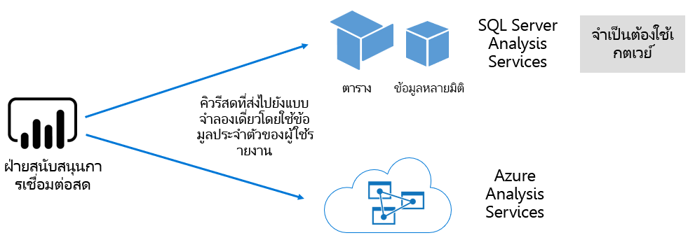

# ชุดข้อมูลในบริการ Power BIDatasets in the Power BI service

บทความนี้ให้คำอธิบายทางเทคนิคของชุดข้อมูล Power BIThis article provides a technical explanation of Power BI datasets.

## ประเภทชุดข้อมูลDataset types

ชุดข้อมูล Power BI แสดงแหล่งข้อมูลที่พร้อมสำหรับการรายงานและการแสดงภาพPower BI datasets represent a source of data ready for reporting and visualization. มีประเภทของชุดข้อมูล 5 แบบที่สร้างในวิธีการต่อไปนี้There are five different dataset types, created in the following ways:

- การเชื่อมต่อกับแบบจำลองข้อมูลที่มีอยู่ซึ่งไม่ได้โฮสต์ในพื้นที่ของ Power BIConnecting to an existing data model that isn't hosted in a Power BI capacity
- อัปโหลดไฟล์ Power BI Desktop ที่ประกอบด้วยแบบจำลองUploading a Power BI Desktop file that contains a model
- การอัปโหลดเวิร์กบุ๊ก Excel (มีตาราง Excel และ/หรือแบบจำลองข้อมูลเวิร์กบุ๊กอย่างน้อย 1 รายการ) หรือการอัปโหลดไฟล์ CSV (ค่าที่คั่นด้วยจุลภาค)Uploading an Excel workbook (containing one or more Excel tables and/or a workbook data model), or uploading a  CSV (comma-separated values) file
- การใช้บริการ Power BI เพื่อสร้าง[ชุดข้อมูลแบบพุช](../developer/automation/walkthrough-push-data.md)Using the Power BI service to create a [push dataset](../developer/automation/walkthrough-push-data.md)
- การใช้บริการ Power BI เพื่อสร้าง[ชุดข้อมูลสตรีมมิ่งหรือสตรีมมิ่งแบบไฮบริด](service-real-time-streaming.md)Using the Power BI service to create a [streaming or hybrid streaming dataset](service-real-time-streaming.md)

ชุดข้อมูลที่แสดงถึงรูปแบบข้อมูลซึ่งใช้เทคโนโลยีการสร้างแบบจำลองเป็นผู้ใหญ่ของ [Analysis Services](/analysis-services/analysis-services-overview)Except for streaming datasets, the dataset represents a data model, which leverages the mature modeling technologies of [Analysis Services](/analysis-services/analysis-services-overview).

> [!NOTE]
> ในเอกสารประกอบของเรา บางครั้งคำศัพท์ _ชุดข้อมูล_ และ _แบบจำลอง_ จะมีการใช้งานสลับกันIn our documentation, sometimes the terms _datasets_ and _models_ are used interchangeably. โดยทั่วไป ในมุมมองบริการ Power BI จะใช้คำว่า **ชุดข้อมูล** และจากมุมมองการพัฒนาจะใช้คำว่า **แบบจำลอง**Generally, from a Power BI service perspective it's referred to as a **dataset**, and from a development perspective it's referred to as a **model**. ในบริบทของเอกสารประกอบนั้นหมายถึงสิ่งเดียวกันIn the context of our documentation they mean much the same thing.

### แบบจำลองที่โฮสต์ภายนอกExternal-hosted models

มีแบบจำลองที่โฮสต์ภายนอก 2 ประเภทดังนี้ SQL Server Analysis Services และ [Azure Analysis Services](/azure/analysis-services/analysis-services-overview)There are two types of external-hosted models: SQL Server Analysis Services and [Azure Analysis Services](/azure/analysis-services/analysis-services-overview).

การเชื่อมต่อกับแบบจำลอง SQL Server Analysis Services จะเกี่ยวข้องกับการติดตั้ง [เกตเวย์ข้อมูลภายในองค์กร](service-gateway-onprem.md) ไม่ว่าจะอยู่ภายในองค์กรหรือโครงสร้างพื้นฐานที่เป็นบริการที่โอสต์โดย VM (IaaS)Connecting to a SQL Server Analysis Services model involves installing the [on-premises data gateway](service-gateway-onprem.md), whether it's on-premises or VM-hosted infrastructure-as-a-service (IaaS). Azure Analysis Services ไม่จำเป็นต้องใช้เกตเวย์Azure Analysis Services doesn't require a gateway.

การเชื่อมต่อกับ Analysis Services จะใช้งานได้เมื่อมีการลงทุนแบบจำลองที่มีอยู่ซึ่งโดยทั่วไปแล้วจะเป็นส่วนหนึ่งของคลังข้อมูลองค์กร (EDW)Connecting to Analysis Services often makes sense when there are existing model investments, typically forming part of an enterprise data warehouse (EDW). Power BI จะทำการ _การเชื่อมต่อสด_ ไปยัง Analysis Services โดยบังคับใช้สิทธิ์ของข้อมูลด้วยตัวตนของผู้ใช้รายงาน Power BIPower BI can make a _live connection_ to Analysis Services, enforcing data permissions by using the identity of the Power BI report user. สำหรับ SQL Server Analysis Services รองรับทั้งแบบจำลองหลายมิติ (คิวบ์) และแบบจำลองแบบตารางFor SQL Server Analysis Services, both multidimensional models (cubes) and tabular models are supported. ดังแสดงในรูปต่อไปนี้ ชุดข้อมูลการเชื่อมต่อสดส่งผ่านคิวรีไปยังแบบจำลองที่โฮสต์ภายนอกAs shown in the following image, a live connection dataset passes queries to external-hosted models.

### แบบจำลอง Power BI Desktop ที่พัฒนาPower BI Desktop-developed models

Power BI Desktop - แอปพลิเคชันไคลเอ็นต์ที่มีไว้สำหรับการพัฒนา Power BI ใช้เพื่อพัฒนาแบบจำลองได้Power BI Desktop - a client application intended for Power BI development - can be used to develop a model. แบบจำลองนี้เป็นแบบจำลองตาราง Analysis Services ที่มีประสิทธิภาพThe model is effectively an Analysis Services tabular model. แบบจำลองสามารถพัฒนาได้โดยการนำเข้าข้อมูลจากกระแสข้อมูลซึ่งผสานรวมกับแหล่งข้อมูลภายนอกได้Models can be developed by importing data from dataflows, which can then be integrated with external data sources. ในขณะที่ข้อมูลเฉพาะเกี่ยวกับวิธีการสร้างแบบจำลองสามารถทำได้นอกขอบเขตของบทความนี้ สิ่งสำคัญคือต้องเข้าใจว่ามีแบบจำลอง 3 ประเภทหรือ _โหมด_ ที่แตกต่างกันที่พัฒนาได้ด้วย Power BI DesktopWhile the specifics on how modeling can be achieved is outside the scope of this article, it's important to understand that there are three different types, or _modes_, of models that can be developed by using Power BI Desktop. โหมดเหล่านี้กำหนดว่าจะนำเข้าข้อมูลลงในแบบจำลอง หรือจะยังคงไว้อยู่ในแหล่งข้อมูลThese modes determine whether data is imported into the model, or whether it remains in the data source. สามโหมดคือ: นำเข้า, DirectQuery และแบบผสมThe three modes are: Import, DirectQuery, and Composite. สำหรับข้อมูลเพิ่มเติมเกี่ยวกับแต่ละโหมด โปรดดูบทความ [โหมดชุดข้อมูลในบริการของ Power BI](service-dataset-modes-understand.md)For more information about each mode, see the [Dataset modes in the Power BI service](service-dataset-modes-understand.md) article.

แบบจำลองที่โฮสต์ภายนอกและแบบจำลอง Power BI Desktop สามารถบังคับใช้การรักษาความปลอดภัยระดับแถว (RLS) เพื่อจำกัดข้อมูลที่ถูกดึงมาสำหรับผู้ใช้บางรายได้External-hosted models and Power BI desktop models can enforce row-Level security (RLS) to limit the data that is retrieved for a certain user. ตัวอย่างเช่น ผู้ใช้ที่กำหนดให้กับกลุ่มความปลอดภัยของ **พนักงานขาย** จะดูข้อมูลรายงานสำหรับภูมิภาคการขายที่พวกเขาได้รับมอบหมายเท่านั้นFor example, users assigned to the **Salespeople** security group can only view report data for the sales region(s) to which they're assigned. บทบาท RLS จะเป็นแบบ _ไดนามิก_ หรือ _คงที่_RLS roles are _dynamic_ or _static_. บทบาทแบบไดนามิกจะกรองตามผู้ใช้รายงาน ในขณะที่บทบาทแบบคงที่จะใช้ตัวกรองเดียวกันสำหรับผู้ใช้ทั้งหมดที่กำหนดให้กับบทบาทดังกล่าวDynamic roles filter by the report user, while static roles apply the same filters for all users assigned to the role. สำหรับข้อมูลเพิ่มเติม โปรดดู [การรักษาความปลอดภัยระดับแถว (RLS) ด้วย Power BI](../admin/service-admin-rls.md)For more information, see [Row-level security (RLS) with Power BI](../admin/service-admin-rls.md).

### แบบจำลองงเวิร์กบุ๊ก ExcelExcel workbook models

การสร้างชุดข้อมูลที่ยึดตาม[เวิร์กบุ๊ก Excel](service-excel-workbook-files.md) หรือ[ไฟล์ CSV](service-comma-separated-value-files.md)  จะส่งผลให้เกิดการสร้างแบบจำลองโดยอัตโนมัติCreating datasets based on [Excel workbooks](service-excel-workbook-files.md) or [CSV files](service-comma-separated-value-files.md) results in the automatic creation of a model. ตาราง excel และข้อมูล CSV จะถูกนำเข้าเพื่อสร้างตารางแบบจำลองในขณะที่แบบจำลองข้อมูลเวิร์กบุ๊ก Excel จะถูกย้ายเพื่อสร้างแบบจำลอง Power BIExcel tables and CSV data are imported to create model tables, while an Excel workbook data model is transposed to create a Power BI model. ในกรณีทั้งหมด ไฟล์ข้อมูลจะถูกนำเข้าไปในแบบจำลองIn all cases, file data is imported into a model.

## สรุปSummary

จากนั้น ความแตกต่างสามารถเกิดขึ้นได้เกี่ยวกับชุดข้อมูล Power BI ที่แสดงแบบจำลอง:Distinctions, then, can be made about Power BI datasets that represent models:

- ทั้งสองแบบจะโฮสต์ในบริการ Power BI หรือโอสต์ภายนอกโดย Analysis ServicesThey're either hosted in the Power BI service, or are externally hosted by Analysis Services.
- ซึ่งเก็บข้อมูลที่นำเข้าหรือข้ามคำขอไปยังแหล่งข้อมูลหรือใช้ทั้งสองอย่างร่วมกันได้They can store imported data, or they can issue pass-through query requests to underlying data sources, or they can use a mix of both.

นี่คือข้อมูลสรุปของข้อมูลสำคัญเกี่ยวกับชุดข้อมูล Power BI ที่แสดงแบบจำลอง:Here is a summary of important facts about Power BI datasets that represent models:

- แบบจำลองที่โฮสต์ SQL Server Analysis Services จำเป็นต้องใช้เกตเวย์เพื่อดำเนินการคิวรี่การเชื่อมต่อสดSQL Server Analysis Services hosted models require a gateway to perform live connection queries.
- แบบจำลองที่โฮสต์ Power BI ที่นำเข้าข้อมูลต้องดำเนินการต่อไปนี้Power BI-hosted models that import data:
  - ต้องโหลดลงในหน่วยความจำอย่างเต็มที่เพื่อให้สามารถทำการคิวรี่ได้Must be fully loaded into memory so that they can be queried.
  - จำเป็นต้องมีการรีเฟรชเพื่อเก็บข้อมูลปัจจุบันและต้องเกี่ยวข้องกับเกตเวย์เมื่อข้อมูลต้นทางไม่สามารถเข้าถึงได้โดยตรงผ่านทางอินเทอร์เน็ตRequire refresh to keep data current, and must involve gateways when source data isn't accessible directly over the internet.
- แบบจำลองที่โฮสต์ Power BI ที่ใช้โหมดที่เก็บข้อมูล [DirectQuery](desktop-directquery-about.md) จำเป็นต้องมีการเชื่อมต่อกับข้อมูลต้นทางPower BI-hosted models that use [DirectQuery](desktop-directquery-about.md) storage mode require connectivity to the source data. เมื่อมีการคิวรีแบบจำลอง Power BI จะปล่อยคิวรีไปยังแหล่งข้อมูลเพื่อเรียกใช้ข้อมูลที่เป็นปัจจุบันWhen the model is queried, Power BI issues queries to the source data to retrieve current data. โหมดนี้ต้องเกี่ยวข้องกับเกตเวย์เมื่อข้อมูลต้นทางไม่สามารถเข้าถึงได้โดยตรงผ่านทางอินเทอร์เน็ตThis mode must involve gateways when source data isn't accessible directly over the internet.
- แบบจำลองอาจบังคับใช้กฎ RLS โดยบังคับใช้ตัวกรองเพื่อจำกัดการเข้าถึงข้อมูลของผู้ใช้บางรายModels may enforce RLS rules, enforcing filters to limit data access to certain users.

## ข้อควรพิจารณาConsiderations

สิ่งสำคัญคือต้องทำความเข้าใจแบบจำลองที่โฮสต์ โหมดที่เก็บข้อมูล การอ้างอิงใดๆ บนเกตเวย์ ขนาดของข้อมูลที่นำเข้า และชนิดการรีเฟรชและความถี่เพื่อใช้งานและจัดการ Power BI ได้อย่างสมบูรณ์To successfully deploy and manage Power BI, it's important to understand where models are hosted, their storage mode, any dependencies on gateways, size of imported data, and refresh type and frequency. การกำหนดค่าเหล่านี้ทั้งหมดจะมีผลกระทบต่อทรัพยากรความจุ Power BI ได้อย่างมีนัยสำคัญThese configurations can all have a significant impact on Power BI capacity resources. นอกจากนี้ การออกแบบแบบจำลอง รวมถึงคิวรีการเตรียมข้อมูล ความสัมพันธ์ และการคำนวณจะเพิ่มไปยังผลของการพิจารณาIn addition, the model design itself, including its data preparation queries, relationships, and calculations, all add to the mix of considerations.

สิ่งสำคัญที่ต้องทำความเข้าใจคือแบบจำลองการนำเข้าที่โฮสต์ Power BI สามารถรีเฟรชตามกำหนดการหรือถูกทริกเกอร์ตามความต้องการโดยผู้ใช้ในบริการ Power BI ได้It's also important to understand that Power BI-hosted Import models can refresh according to a schedule, or be triggered on-demand by a user in the Power BI service.

## ขั้นตอนถัดไปNext steps

- [โหมดชุดข้อมูลในบริการ Power BIDataset modes in the Power BI service](service-dataset-modes-understand.md)
- มีคำถามเพิ่มเติมหรือไม่More questions? [ลองถามชุมชน Power BITry asking the Power BI Community](https://community.powerbi.com/)
