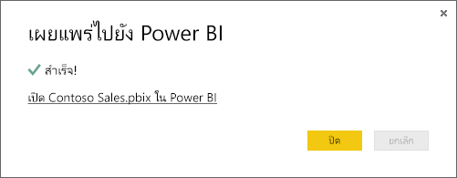

# รับข้อมูลจากไฟล์ Power BI DesktopGet data from Power BI Desktop files

**Power BI Desktop** ทำให้ข่าวกรองธุรกิจและการรายงานเป็นเรื่องง่าย**Power BI Desktop** makes business intelligence and reporting easy. ไม่ว่าคุณกำลังเชื่อมต่อกับแหล่งข้อมูลต่าง ๆ มากมาย ทำแบบสอบถาม หรือกำลังแปลงข้อมูล ทำแบบจำลองข้อมูลของคุณ หรือสร้างรายงานแบบไดนามิกและมีประสิทธิภาพ **Power BI Desktop** ทำให้งานด้านข่าวกรองธุรกิจทำงานง่ายและรวดเร็วWhether you're connecting to a many different data sources, querying and transforming data, modeling your data, and creating powerful and dynamic reports, **Power BI Desktop** makes business intelligence tasks intuitive and fast. ถ้าคุณไม่คุ้นเคยกับ **Power BI Desktop** โปรดดู [เริ่มต้นใช้งาน Power BI Desktop](../fundamentals/desktop-getting-started.md)If you're not familiar with **Power BI Desktop**, check out [Getting started with Power BI Desktop](../fundamentals/desktop-getting-started.md).

เมื่อคุณนำข้อมูลเข้ามายัง **Power BI Desktop** และสร้างสองสามรายงาน ถึงเวลาแล้วที่จะนำไฟล์ของคุณที่บันทึกไว้ลงใน **บริการ Power BI**Once you bring data into **Power BI Desktop** and create a few reports, it’s time to get your saved file into the **Power BI service**.

## ตำแหน่งที่คุณบันทึกไฟล์สร้างความแตกต่างได้Where your file is saved makes a difference
**ภายในเครื่อง** - ถ้าคุณบันทึกไฟล์ของคุณลงในไดรฟ์ภายในคอมพิวเตอร์ของคุณหรือตำแหน่งอื่นในองค์กรของคุณ คุณสามารถ *นำเข้า* ไฟล์ของคุณหรือสามารถ *เผยแพร่* ได้จาก Power BI Desktop เพื่อนำข้อมูลและ รายงานลงใน Power BI**Local** - If you save your file to a local drive on your computer or another location in your organization, you can *import* your file or you can *publish* from Power BI Desktop to get its data and reports into Power BI. ไฟล์ของคุณจะยังคงอยู่บนไดรฟ์ในเครื่อง ดังนั้นจึงไม่มีการเคลื่อนย้ายไปยัง Power BI จริง ๆYour file will actually remain on your local drive, so the whole file isn’t really moved into Power BI. สิ่งที่เกิดขึ้นจริง ๆ คือ ชุดข้อมูลใหม่จะถูกสร้างขึ้นใน Power BI และข้อมูลและแบบจำลองข้อมูลจากไฟล์ Power BI Desktop จะโหลดลงในชุดข้อมูลดังกล่าวWhat really happens is a new dataset is created in Power BI and data and the data model from the Power BI Desktop file are loaded into the dataset. ถ้าไฟล์ของคุณมีรายงานใด ๆ รายงานเหล่านั้นจะปรากฏในไซต์ Power BI ของคุณภายใต้รายงานIf your file has any reports, those will appear in your Power BI site under Reports.

**OneDrive - ธุรกิจ**– ถ้าคุณมี OneDrive for Business และคุณลงชื่อเข้าใช้ด้วยบัญชีเดียวกันกับที่คุณลงชื่อเข้าใช้ Power BI ปัจจุบัน นี่คือวิธีที่มีประสิทธิภาพที่สุดในการเก็บงานของคุณใน Power BI Desktop และชุดข้อมูล รายงาน และแดชบอร์ดใน Power BI ของคุณให้รวมกัน เนื่องจากทั้ง Power BI และ OneDrive อยู่ในระบบคลาวด์ Power BI จะ *เชื่อมต่อ* ไปยังไฟล์ของคุณบน OneDrive ประมาณทุกชั่วโมง**OneDrive - Business** – If you have OneDrive for Business and you sign into it with the same account you sign into Power BI with, this is by-far the most effective way to keep your work in Power BI Desktop and your dataset, reports, and dashboards in Power BI in-sync. Because both Power BI and OneDrive are in the cloud, Power BI *connects* to your file on OneDrive about every hour. ถ้าพบการเปลี่ยนแปลงใด ๆ ก็ตาม Power BI จะอัปเดต ชุดข้อมูล รายงาน และแดชบอร์โดยอัตโนมัติIf any changes are found, your dataset, reports, and dashboards are automatically updated in Power BI.

**OneDrive - ส่วนบุคคล** – ถ้าคุณบันทึกไฟล์ของคุณไปยังบัญชี OneDrive ของคุณเอง คุณจะยังได้รับประโยชน์หลายอย่างแบบเดียวกับที่คุณได้จาก OneDrive for Business**OneDrive - Personal** – If you save your files to your own OneDrive account, you’ll get many of the same benefits as you would with OneDrive for Business. ความแตกต่างที่สำคัญที่สุด คือเมื่อคุณเชื่อมต่อกับไฟล์ของคุณ (โดยใช้ รับข้อมูล > ไฟล์ > OneDrive – ส่วนบุคคล) คุณจำเป็นต้องลงชื่อเข้าใช้ OneDrive ของคุณด้วยบัญชี Microsoft ของคุณ ซึ่งโดยปกติแล้วจะแตกต่างจากที่คุณใช้ลงชื่อเข้าใช้ Power BIThe biggest difference is when you first connect to your file (using Get Data > Files > OneDrive – Personal) you’ll need to sign in to your OneDrive with your Microsoft account, which is usually different from what you use to sign in to Power BI. เมื่อลงชื่อเข้าใช้ OneDrive ของคุณด้วยบัญชี Microsoft ให้แน่ใจว่าได้เลือกตัวเลือก คงการลงชื่อเข้าใช้ของฉันไว้เสมอWhen signing in with your OneDrive with your Microsoft account, be sure to select the Keep me signed in option. ด้วยวิธีนี้ Power BI จะสามารถเชื่อมต่อกับไฟล์ของคุณประมาณทุกชั่วโมง และทำให้คุณแน่ใจว่า ชุดข้อมูลของคุณใน Power BI มีข้อมูลที่ตรงกันThis way, Power BI will be able to connect to your file about every hour and make sure your dataset in Power BI is in-sync.

**SharePoint - ของไซต์ของทีม** การบันทึกไฟล์ Power BI Desktop ของคุณไปยัง SharePoint ไซต์ของทีมจะเหมือนกับการบันทึกไปยัง OneDrive for Business มาก**SharePoint Team-Sites** – Saving your Power BI Desktop files to SharePoint – Team Sites is much the same as saving to OneDrive for Business. ความแตกต่างที่สำคัญที่สุดคือ วิธีที่คุณเชื่อมต่อไปยังไฟล์จาก Power BIThe biggest difference is how you connect to the file from Power BI. คุณสามารถระบุ URL หรือเชื่อมต่อไปยังโฟลเดอร์รากฐานได้You can specify a URL or connect to the root folder. นอกจากนี้ คุณยังสามารถ<a href="https://support.microsoft.com/office/sync-sharepoint-and-teams-files-with-the-onedrive-sync-app-6de9ede8-5b6e-4503-80b2-6190f3354a88">ตั้งค่าโฟลเดอร์ซิงค์</a>ที่ชี้ไปยังโฟลเดอร์ SharePoint ไฟล์ในโฟลเดอร์ดังกล่าวจะซิงค์กับสำเนาต้นแบบบน SharePointYou can also <a href="https://support.microsoft.com/office/sync-sharepoint-and-teams-files-with-the-onedrive-sync-app-6de9ede8-5b6e-4503-80b2-6190f3354a88">set up a Sync folder</a> that points to the SharePoint folder; files there will sync with the master copy on SharePoint.

## นำเข้าหรือเชื่อมต่อไปยังไฟล์ Power BI Desktop จาก Power BIImport or connect to a Power BI Desktop file from Power BI
>[!IMPORTANT]
>ขนาดไฟล์สูงสุดที่คุณสามารถนำเข้าใน Power BI ได้คือ 1 กิกะไบต์The maximum file size you can import into Power BI is 1 gigabyte.

1. ใน Power BI ในพื้นที่ตัวนำทาง คลิก **รับข้อมูล**In Power BI, in the navigator pane, click \*\* Get Data\*\*.
   
   
2. ใน **ไฟล์** คลิก **รับ**In **Files**, click **Get**.
   
   
3. ค้นหาไฟล์ของคุณFind your file. ไฟล์ Power BI Desktop มีนามสกุลเป็น .PBIXPower BI Desktop files have a .PBIX extension.
   
   

## เผยแพร่ไฟล์จาก Power BI Desktop ไปยังไซต์ Power BI ของคุณPublish a file from Power BI Desktop to your Power BI site
การใช้การเผยแพร่จาก Power BI Desktop นั้นคล้ายคลึงกับการใช้รับข้อมูลใน Power BI ในแง่ของการนำเข้าข้อมูลไฟล์ของคุณจากไดรฟ์ภายในคอมพิวเตอร์ของคุณหรือการเชื่อมต่อกับไฟล์บน OneDriveUsing Publish from Power BI Desktop is similar using Get Data in Power BI, in terms of initially importing your file data from a local drive or connecting to it on OneDrive. อย่างไรก็ตาม ทั้งสองแบบมีความแตกต่างบางประการ: หากคุณอัปโหลดจากไดรฟ์ภายในคอมพิวเตอร์ของคุณ คุณจะต้องรีเฟรชข้อมูลนั้นบ่อยครั้งเพื่อให้แน่ใจว่าสำเนาข้อมูลออนไลน์และภายในเครื่องเป็นข้อมูลปัจจุบันซึ่งกันและกันHowever, there are differences: if you upload from a local drive, you'll want to refresh that data frequently to ensure the online and local copies of the data are current with each other. 

ต่อไปนี้เป็นวิธีที่รวดเร็ว แต่คุณสามารถดู[เผยแพร่จาก Power BI Desktop](../create-reports/desktop-upload-desktop-files.md)ได้เมื่อต้องการเรียนรู้เพิ่มเติมHere’s the quick how to, but you can see [Publish from Power BI Desktop](../create-reports/desktop-upload-desktop-files.md) to learn more.

1. ใน Power BI Desktop คลิก **ไฟล์** > **เผยแพร่** > **เผยแพร่ไปยัง Power BI** หรือคลิก **เผยแพร่** บน RibbonIn Power BI Desktop, click **File** > **Publish** > **Publish to Power BI**, or click **Publish** on the ribbon.
   
   
2. ลงชื่อเข้าใช้ไปยัง Power BISign in to Power BI. คุณจำเป็นต้องทำขั้นตอนนี้เฉพาะครั้งแรกเท่านั้นYou'll only need to do this the first time.
   
   เมื่อเสร็จสิ้น คุณจะได้รับลิงก์เพื่อเปิดรายงานของคุณในเว็บไซต์ Power BI ของคุณWhen complete, you'll get a link to open your report in your Power BI site.
   
   

## ขั้นตอนถัดไปNext steps
**สำรวจข้อมูลของคุณ** เมื่อคุณได้รับข้อมูลและรายงานจากไฟล์ของคุณลงใน Power BI แล้ว นั่นก็ถึงเวลาการสำรวจ**Explore your data** - Once you get data and reports from your file into Power BI, it's time to explore. ถ้าไฟล์ของคุณมีรายงานอยู่แล้ว รายงานเหล่านี้จะปรากฏในพื้นที่ตัวนำทางใน **รายงาน**If your file already has reports in it, they'll appear in the navigator pane in **Reports**. ถ้าไฟล์ของคุณมีเพียงข้อมูล คุณสามารถสร้างรายงานใหม่ ได้ เพียงคลิกขวาที่ชุดข้อมูลใหม่แล้ว คลิก **สำรวจ**If your file just had data, you can create new reports; just right-click the new dataset and then click **Explore**.

**รีเฟรชแหล่งข้อมูลภายนอก**- ถ้าไฟล์ Power BI Desktop ของคุณเชื่อมต่อกับแหล่งข้อมูลภายนอก คุณสามารถตั้งค่ารีเฟรชตามกำหนดการ เพื่อให้แน่ใจว่าชุดข้อมูลของคุณเป็นปัจจุบันอยู่เสมอได้**Refresh external data sources** - If your Power BI Desktop file connects to external data sources, you can setup scheduled refresh to make sure your dataset is always up-to-date. กรณีส่วนใหญ่ การตั้งค่ารีเฟรชตามกำหนดการจะค่อนข้างง่าย แต่การลงในรายละเอียดอยู่นอกขอบเขตของบทความนี้In most cases, setting up scheduled refresh is quite easy to do, but going into the details is outside the scope of this article. ดู[รีเฟรชข้อมูลใน Power BI](refresh-data.md)เมื่อต้องการเรียนรู้เพิ่มเติมSee [Data refresh in Power BI](refresh-data.md) to learn more.
