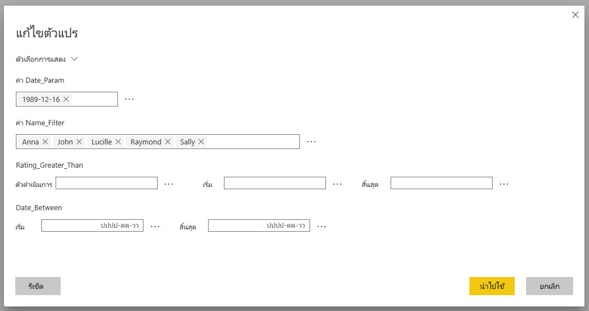
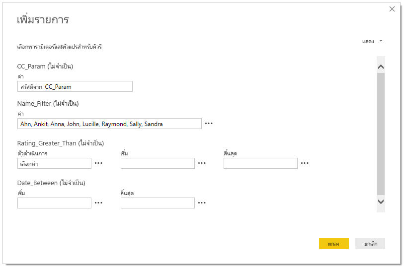

# แก้ไขตัวแปร SAP ในบริการ Power BIEdit SAP variables in the Power BI service

เมื่อคุณใช้ SAP Business Warehouse หรือ SAP HANA กับ DirectQuery ในขณะนี้ผู้เขียนรายงานสามารถอนุญาตให้ผู้ใช้ปลายทางแก้ไขตัวแปร SAP ใน **บริการ Power BI** สำหรับพื้นที่ทำงานแบบพรีเมียมและที่ใช้งานร่วมกันได้แล้วWhen using SAP Business Warehouse or SAP HANA with DirectQuery, report authors can now allow end users to edit SAP variables in the **Power BI Service** for Premium and shared workspaces. โปรดทราบว่าคุณลักษณะนี้ไม่สามารถใช้งานกับรายงานในแท็บ แชร์กับฉัน ของ พื้นที่ทำงานของฉัน และแอปที่สร้างจากพื้นที่ทำงาน V1 ได้Note that this feature does NOT work for reports in the Shared with me tab of My Workspace and Apps created from V1 Workspaces. 

เอกสารนี้อธิบายข้อกำหนดสำหรับการแก้ไขตัวแปรใน Power BI วิธีการเปิดใช้งานคุณลักษณะนี้ และตำแหน่งที่จะแก้ไขตัวแปรในบริการ Power BIThis document describes the requirements for editing variables in Power BI, how to enable this feature, and where to edit variables in the Power BI service.

## ข้อกำหนดสำหรับตัวแปรแก้ไข SAPRequirements for SAP edit variables

มีข้อกำหนดบางอย่างสำหรับการใช้คุณลักษณะตัวแปรแก้ไขของ SAPThere are a few requirements for using the SAP edit variables feature. รายการต่อไปนี้แสดงข้อกำหนดเหล่านี้The following list describes these requirements.

**จำเป็นต้องมีประสบการณ์การใช้งานตัวกรองใหม่** – คุณต้องมี [ประสบการณ์ตัวกรองใหม่](../create-reports/power-bi-report-filter.md)ที่เปิดใช้งานสำหรับรายงานของคุณ**New Filter Experience required** – you must have the [new filter experience](../create-reports/power-bi-report-filter.md) enabled for your report. นี่คือวิธีที่คุณสามารถเปิดใช้งานสำหรับรายงานของคุณใน Power BI Desktop:Here's how you can enable it for your report in Power BI Desktop:
- ใน Power BI Desktop เลือกตัวเลือก **ไฟล์** > **และตัวเลือก** > **การตั้งค่า**In Power BI Desktop, select **File** > **Options and Settings** > **Options**
- ในบานหน้าต่างนำทาง ภายใต้ **ไฟล์ปัจจุบัน** ให้เลือก **การตั้งค่ารายงาน**In the nav pane, under **Current file**, select **Report settings**.
- ภายใต้ **ประสบการณ์การกรอง** ให้เลือก **เปิดใช้งานบานหน้าต่างตัวกรองที่อัปเดตแล้ว**Under **Filtering experience**, select **Enable the updated filter pane**.

**จำเป็นต้องมีการเชื่อมต่อ DirectQuery** – คุณต้องเชื่อมต่อกับแหล่งข้อมูล SAP โดยใช้ DirectQuery**DirectQuery connections required** – you must be connecting to the SAP data source using DirectQuery. การเชื่อมต่อการนำเข้าไม่ได้รับการสนับสนุนImport connections aren't supported.

**จำเป็นต้องตั้งค่า SSO** – เพื่อให้คุณลักษณะนี้ใช้งานได้ ต้องกำหนดค่าการลงชื่อเข้าระบบครั้งเดียว (SSO)**SSO set-up required** – for this feature to work, single sign-on (SSO) must be configured. ดู[ภาพรวมของการลงชื่อเข้าใช้ครั้งเดียว (SSO)](service-gateway-sso-overview.md) สำหรับข้อมูลเพิ่มเติมSee [overview of single sign-on (SSO)](service-gateway-sso-overview.md) for more information.

**จำเป็นต้องมีเกตเวย์บิตใหม่** - ดาวน์โหลดเกตเวย์ล่าสุดและอัปเดตเกตเวย์ที่มีอยู่ของคุณ**New Gateway bits required** - Download latest gateway and update your existing gateway. ดู[เกตเวย์บริการ](service-gateway-onprem.md)สำหรับข้อมูลเพิ่มเติมSee [service gateway](service-gateway-onprem.md) for more information.

**หลายมิติสำหรับ SAP HANA เท่านั้น** - สำหรับ SAP HANA, คุณสมบัติตัวแปรแก้ไข SAP จะทำงานร่วมกับแบบจำลองหลายมิติเท่านั้นและไม่ทำงานกับแหล่งข้อมูลเชิงสัมพันธ์**Multidimensional only for SAP HANA** – for SAP HANA, the SAP edit variables feature only works with multidimensional models and doesn't work on relational sources.

**ไม่ได้รับการสนับสนุนในบริการคลาวด์สาธารณะ** – ขณะนี้ Power Query ออนไลน์ไม่สามารถใช้งานได้ในบริการคลาวด์สาธารณะ ดังนั้นคุณลักษณะนี้ยังไม่ได้รับการสนับสนุนในบริการคลาวด์สาธารณะ**Not supported in Sovereign clouds** – Currently Power Query Online isn't available in Sovereign clouds; therefore, this feature is also not supported in Sovereign clouds.

## วิธีการเปิดใช้งานคุณลักษณะHow to enable the feature

เมื่อต้องการเปิดใช้งานคุณลักษณะ **ตัวแปรแก้ไข SAP** ใน Power BI Desktop เชื่อมต่อกับแหล่งข้อมูล SAP HANA หรือ SAP BWTo enable the **SAP edit variables** feature, in Power BI Desktop connect to an SAP HANA or SAP BW data source. จากนั้นไปที่ **ไฟล์ > ตัวเลือกและการตั้งค่า > ตัวเลือก** จากนั้นในส่วนไฟล์ปัจจุบันในบานหน้าต่างด้านซ้าย ให้เลือก **DirectQuery**Then go to **File > Options and settings > Options** and then, in the Current File section in the left pane, select **DirectQuery**. เมื่อคุณเลือกตัวเลือกนั้น ในบานหน้าต่างด้านขวาคุณจะเห็นตัวเลือก DirectQuery และช่องทำเครื่องหมายที่คุณสามารถ **อนุญาตให้ผู้ใช้ปลายทางเปลี่ยนตัวแปร SAP ในรายงาน** ดังที่แสดงในภาพต่อไปนี้When you select that, in the right pane you see DirectQuery options, and a checkbox where you can **Allow end users to change SAP variables in the report**, as shown in the following image.

## ใช้ตัวแปรแก้ไข SAP ใน Power BI DesktopUse SAP edit variables in Power BI Desktop

เมื่อใช้ตัวแปรแก้ไข SAP ใน Power BI Desktop คุณสามารถแก้ไขตัวแปรได้โดยการเลือกลิงก์แก้ไขตัวแปรจากเมนู **แก้ไขคิวรี** ในริบบอนWhen using SAP edit variables in Power BI Desktop, you can edit the variables by selecting the Edit variables link from **Edit Queries** menu in the ribbon. จากที่นี่ หน้าต่างกล่องโต้ตอบต่อไปนี้ปรากฏขึ้นFrom there, the following dialog appears. คุณลักษณะนี้มีให้ใช้งานใน Power BI Desktop ชั่วขณะThis feature has been available in Power BI Desktop for a while. ผู้สร้างรายงานสามารถเลือกตัวแปรสำหรับรายงานโดยใช้กล่องโต้ตอบต่อไปนี้Report creators can select variables for the report using the following dialog.

## ใช้ตัวแปรแก้ไข SAP ในบริการUse SAP edit variables in the service

เมื่อรายงานถูกเผยแพร่ไปยังบริการของ Power BI ผู้ใช้สามารถดูลิงก์ **แก้ไขตัวแปร** ในบานหน้าต่างตัวกรองใหม่Once the report is published to the Power BI service, users can see the **Edit variables** link in the new Filter pane. ถ้าคุณกำลังเผยแพร่รายงานเป็นครั้งแรก อาจใช้เวลาสูงสุด 5 นาทีก่อนที่ลิงก์แก้ไขตัวแปรจะปรากฏขึ้นIf you're publishing the report for the first time, it may take up to 5 minutes before the Edit variable link appears. ถ้าลิงก์ไม่ปรากฏขึ้น คุณจะต้องรีเฟรชชุดข้อมูลด้วยตนเองIf the link hasn't appeared, you will need to manually refresh the dataset.
คุณสามารถทำได้โดย:You can do so by:

1. ในบริการของ Power BI ให้เลือกแท็บ **ชุดข้อมูล** ในรายการเนื้อหาสำหรับพื้นที่ทำงานIn the Power BI service, select the **Datasets** tab in the content list for a workspace.

2. ค้นหาชุดข้อมูลที่คุณจำเป็นต้องรีเฟรชและเลือกไอคอน **รีเฟรช**Find the dataset you need to refresh, and select the **Refresh** icon.

    

3. การเลือกลิงก์แก้ไขตัวแปรจะเปิดกล่องโต้ตอบ **แก้ไขตัวแปร** ซึ่งผู้ใช้สามารถแทนที่ตัวแปรได้Selecting the Edit variables link brings up the **Edit variables** dialog, where users can override variables. การเลือกปุ่ม **รีเซ็ต** จะรีเซ็ตตัวแปรเป็นค่าเดิมที่ปรากฏขึ้นเมื่อเปิดกล่องโต้ตอบนี้Selecting the **Reset** button resets the variables to the original values that appeared when this dialog was opened.

    

4. การเปลี่ยนแปลงใดๆ ในกล่องโต้ตอบ **แก้ไขตัวแปร** ยังคงอยู่เฉพาะสำหรับผู้ใช้รายนี้เท่านั้น (คล้ายกับลักษณะการทำงานที่มีอยู่อื่นๆ ใน Power BI)Any changes in the **Edit variables** dialog persist only for this user (similar to other persistence behaviors in Power BI). การเลือก **รีเซ็ตเป็นค่าเริ่มต้น** ที่แสดงในรูปต่อไปนี้จะรีเซ็ตค่ารายงานให้เป็นสถานะเดิมของผู้สร้างรายงาน รวมถึงตัวแปรSelecting **Reset to default**, shown in the following image, resets the report to the report creator's original state, including the variables.

    

เมื่อทำงานกับรายงานที่เผยแพร่ในบริการของ Power BI ที่ใช้ SAP Hana หรือ SAP BW ด้วยคุณลักษณะ **แก้ไขตัวแปร** ที่เปิดใช้งาน เจ้าของรายงานสามารถเปลี่ยนค่าเริ่มต้นเหล่านั้นได้When working on a published report in the Power BI service that uses SAP HANA or SAP BW with the **Edit variables** feature enabled, the report owner can change those defaults. เจ้าของรายงานสามารถเปลี่ยนตัวแปรในโหมดแก้ไขและบันทึกรายงานเพื่อเปิดใช้งานการตั้งค่าเหล่านั้นเพื่อให้กลายเป็น *การตั้งค่าเริ่มต้นใหม่* สำหรับรายงานนั้นThe owner of the report can change the variables in edit mode, and save the report to enable those settings to become the *new default settings* for that report. ผู้ใช้รายอื่นที่เข้าถึงรายงานหลังจากมีการเปลี่ยนแปลงโดยเจ้าของรายงานจะเห็นการตั้งค่าใหม่เหล่านั้นเป็นค่าเริ่มต้นAny other users who access the report after such changes are made by the report owner will see those new settings as the defaults.

## ขั้นตอนถัดไปNext steps

สำหรับข้อมูลเพิ่มเติมเกี่ยวกับ SAP HANA, SAP BW หรือ DirectQuery กรุณาอ่านบทความต่อไปนี้:For more information about SAP HANA, SAP BW, or DirectQuery, read the following articles:

- [ใช้ SAP HANA ใน Power BI DesktopUse SAP HANA in Power BI Desktop](desktop-sap-hana.md)
- [DirectQuery และ SAP Business Warehouse (BW)DirectQuery and SAP Business Warehouse (BW)](desktop-directquery-sap-bw.md)
- [DirectQuery และ SAP HANADirectQuery and SAP HANA](desktop-directquery-sap-hana.md)
- [การใช้ DirectQuery ใน Power BIUsing DirectQuery in Power BI](desktop-directquery-about.md)
