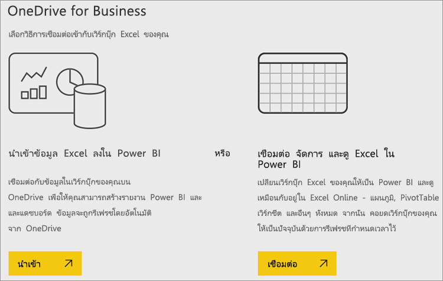
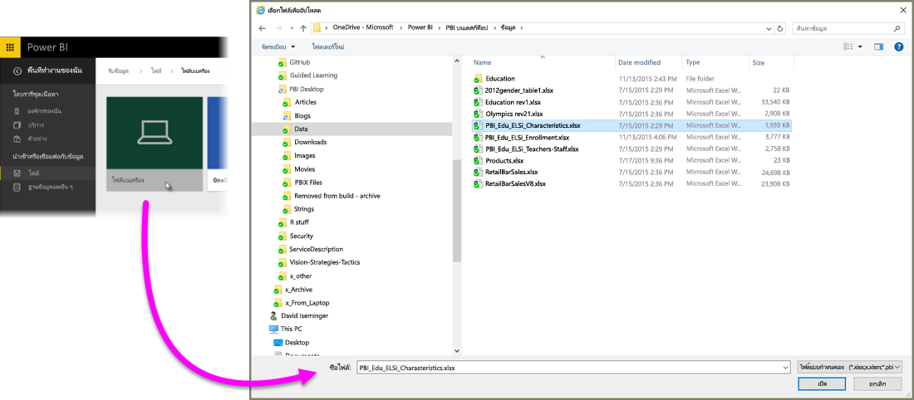
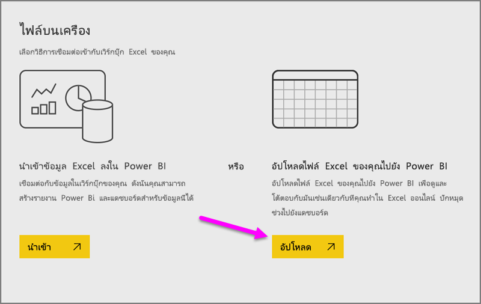
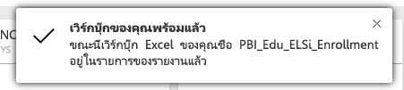
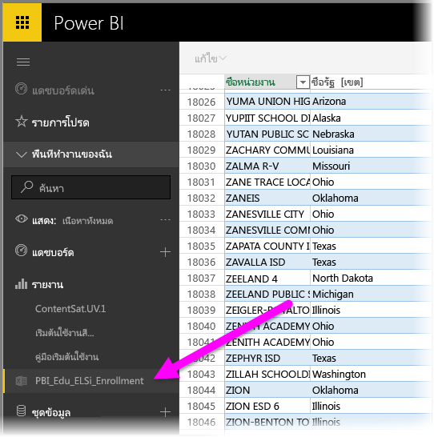

# รับข้อมูลจากไฟล์สมุดงาน ExcelGet data from Excel workbook files

Microsoft Excel เป็นหนึ่งในแอปพลิเคชันทางธุรกิจที่ใช้งานอย่างกว้างขวางที่สุดMicrosoft Excel is one of the most widely used business applications around. นอกจากนี้ Excel เป็นหนึ่งในวิธีที่ใช้ทั่วไปมากที่สุดในการรับข้อมูลของคุณลงใน Power BIIt’s also one of the most common ways to get your data into Power BI.

## Power BI สนับสนุนสมุดงานชนิดใดบ้าง?What types of workbooks does Power BI support?
Power BI สนับสนุนการนำเข้าหรือเชื่อมต่อไปยังสมุดงานที่สร้างขึ้นใน Excel 2007 และเวอร์ชันที่ใหม่กว่าPower BI supports importing or connecting to workbooks created in Excel 2007 and later. สมุดงานต้องถูกบันทึกเป็นชนิดไฟล์ .xlsx หรือ.xlsm และมีขนาดน้อยกว่า 1 GBWorkbooks must be saved as .xlsx or .xlsm file type and be under 1 GB. บางคุณลักษณะที่อธิบายไว้ในบทความนี้มีอยู่ใน Excel เวอร์ชั่นที่ใหม่กว่าเท่านั้นSome features described in this article are only available in later versions of Excel.

### สมุดงานที่มีช่วงหรือตารางของข้อมูลWorkbooks with ranges or tables of data
ถ้าสมุดงานของคุณมีแผ่นงานแบบง่ายที่มีหลายช่วงข้อมูล เพื่อให้ได้ประโยชน์สูงสุดจากข้อมูลของคุณใน Power BI ตรวจสอบให้แน่ใจว่ามีการจัดรูปแบบช่วงเหล่านั้นเป็นตารางIf your workbook has simple worksheets with ranges of data, to get the most out of your data in Power BI, be sure to format those ranges as tables. ด้วยวิธีนี้ เมื่อสร้างรายงานใน Power BI คุณจะเห็นตารางที่มีชื่อและคอลัมน์ในพื้นที่เขตข้อมูล ทำให้ง่ายมากขึ้นในการแสดงภาพข้อมูลของคุณThis way, when creating reports in Power BI, you’ll see named tables and columns in the Fields pane, making it much easier to visualize your data.

### สมุดงานที่มีแบบจำลองข้อมูลWorkbooks with data models
สมุดงานสามารถประกอบด้วยแบบจำลองข้อมูลที่มีหนึ่ง ตารางขึ้นไปของข้อมูลที่โหลดลงในแบบจำลองนั้นโดยใช้ตาราง Power Query (รับและแปลงใน Excel 2016), หรือ Power Pivot ที่เชื่อมโยงWorkbooks can contain a data model with one or more tables of data loaded into it by using linked tables, Power Query (Get & Transform in Excel 2016), or Power Pivot. Power BI สนับสนุนทุกคุณสมบัติแบบจำลองข้อมูล เช่น ความสัมพันธ์ หน่วยวัด ลำดับชั้น และ KPIPower BI supports all data model properties such as relationships, measures, hierarchies, and KPIs.

> [!NOTE]
> สมุดงานที่มีแบบจำลองข้อมูลไม่สามารถแชร์กับผู้เช่าทั้งทั้ง Power BI ได้Workbooks with data models cannot be shared across Power BI tenants. ตัวอย่างเช่น ผู้ใช้ที่ลงชื่อเข้าใช้ใน Power BI โดยใช้บัญชี *contoso.com* ผู้ใช้ไม่สามารถแชร์สมุดงาน Excel กับผู้ใช้ที่ลงชื่อเข้าสู่ระบบโดยใช้ Power BI จาก *woodgrovebank.com* ได้For example, a user who logs in to Power BI using a *contoso.com* account cannot share an Excel workbook with a user who logs in using a Power BI login account from *woodgrovebank.com*.
> 
> 

### สมุดงานที่มีการเชื่อมต่อกับแหล่งข้อมูลภายนอกWorkbooks with connections to external data sources
ถ้าคุณใช้ Excel เพื่อเชื่อมต่อกับแหล่งข้อมูลภายนอก เมื่อสมุดงานของคุณอยู่ใน Power BI คุณสามารถสร้างรายงานและแดชบอร์ดที่ยึดตามข้อมูลจากแหล่งข้อมูลที่เชื่อมต่อนั้นได้If you use Excel to connect to an external data source, once your workbook is in Power BI, you can create reports and dashboards based on data from that connected data source. นอกจากนี้ คุณยังสามารถตั้งค่าการกำหนดการรีเฟรชเพื่อเชื่อมต่อกับแหล่งข้อมูลได้ทันทีโดยอัตโนมัติและรับการอัปเดตYou can also setup Scheduled Refresh to automatically connect right to the data source and get updates. คุณไม่จำเป็นต้องรีเฟรชด้วยตนเองจาก Ribbon ข้อมูลใน Excel อีกต่อไปYou’ll no longer need to refresh manually from the Data ribbon in Excel. การแสดงภาพใด ๆ ในรายงานและไทล์ในแดชบอร์ดที่ยึดตามข้อมูลจากแหล่งข้อมูลนั้นจะอัปเดตโดยอัตโนมัติAny visualizations in reports and tiles in dashboards based on data from that data source are updated automatically. เมื่อต้องการเรียนรู้เพิ่มเติม ดู[รีเฟรชข้อมูลใน Power BI](refresh-data.md)To learn more, see [Data refresh in Power BI](refresh-data.md).

### สมุดงานที่มีแผ่นงาน Power View, Pivottable และแผนภูมิWorkbooks with Power View sheets, PivotTables and charts
วิธีการที่แผ่นงาน PowerView และ Pivottable และแผนภูมิของคุณปรากฏหรือไม่ปรากฏใน Power BI ขึ้นอยู่กับตำแหน่งที่คุณบันทึกไฟล์สมุดงานของคุณและวิธีการที่คุณเลือกเพื่อใส่ลงใน Power BIHow your PowerView sheets and PivotTables and charts appear, or not appear, in Power BI depends on where your workbook file is saved and how you choose to get it into Power BI. เราจะลงรายละเอียดในส่วนนี้เพิ่มเติมที่ด้านล่างWe'll go into this more below.

## ประเภทข้อมูลData types
Power BI รองรับประเภทข้อมูลต่อไปนี้: จำนวนเต็ม เลขทศนิยม สกุลเงิน วันที่ True/False ข้อความPower BI supports the following data types: Whole Number, Decimal Number, Currency, Date, True/False, Text. การทำเครื่องหมายข้อมูลเป็นชนิดข้อมูลที่เฉพาะเจาะจงใน Excel จะช่วยเพิ่มประสบการณ์การใช้งาน Power BIMarking data as specific data types in Excel will improve the Power BI experience.

## เตรียมสมุดงานของคุณสำหรับ Power BIPrepare your workbook for Power BI
ดูวิดีโอที่มีประโยชน์นี้เมื่อต้องการเรียนรู้เพิ่มเติมเกี่ยวกับวิธีการตรวจสอบให้แน่ใจว่าสมุดงาน Excel ของคุณพร้อมสำหรับ Power BI หรือไม่Watch this helpful video to learn more about how to make sure your Excel workbooks are ready for Power BI.

<iframe width="500" height="281" src="https://www.youtube.com/embed/l2wy4XgQIu0" frameborder="0" allowfullscreen></iframe>

## ตำแหน่งที่คุณบันทึกสมุดงานสร้างความแตกต่างได้Where your workbook file is saved makes a difference
**ภายในเครื่อง** - ถ้าคุณบันทึกสมุดงานของคุณลงในไดรฟ์ภายในเครื่องคอมพิวเตอร์ของคุณ หรือตำแหน่งที่ตั้งอื่นในองค์กรของคุณ จาก Power BI คุณสามารถโหลดไฟล์ของคุณไปยัง Power BI ได้**Local** - If you save your workbook file to a local drive on your computer or another location in your organization, from Power BI you can load your file into Power BI. ไฟล์ของคุณจะยังคงอยู่บนไดรฟ์ในเครื่อง ดังนั้นจึงไม่มีการนำเข้าใน Power BI จริง ๆYour file will actually remain on your local drive, so the whole file isn’t really imported into Power BI. สิ่งที่เกิดขึ้นจริง ๆ คือ ชุดข้อมูลใหม่จะถูกสร้างขึ้นใน Power BI และข้อมูลและแบบจำลองข้อมูล (หากมี) จากสมุดงานจะโหลดลงในชุดข้อมูลดังกล่าวWhat really happens is a new dataset is created in Power BI and data and the data model (if any) from the workbook are loaded into the dataset. ถ้าสมุดงานของคุณมีแผ่นงาน Power View ใด ๆ แผ่นงานเหล่านั้นจะปรากฏในไซต์ Power BI ของคุณภายใต้ รายงานIf your workbook has any Power View sheets, those will appear in your Power BI site under Reports. นอกจากนี้ Excel 2016 ยังมีคุณลักษณะ **เผยแพร่** (ใต้เมนู **ไฟล์**)Excel 2016 also has the **Publish** feature (under the **File** menu). การใช้ **เผยแพร่** จะให้ผลเหมือนกับการใช้ **รับข้อมูล > ไฟล์ > ไฟล์ภายในเครื่อง** จาก Power BI แต่มักง่ายกว่าในการอัปเดตชุดข้อมูลของคุณใน Power BI ถ้าคุณทำการเปลี่ยนแปลงไปยังสมุดงานอยู่เป็นประจำUsing **Publish** is effectively the same as using **Get Data > Files > Local File** from Power BI, but is often easier to update your dataset in Power BI if you’re regularly making changes to the workbook.

**OneDrive - ธุรกิจ**– ถ้าคุณมี OneDrive for Business และคุณลงชื่อเข้าใช้ด้วยบัญชีเดียวกันกับที่คุณลงชื่อเข้าใช้ Power BI ปัจจุบัน นี่คือวิธีที่มีประสิทธิภาพที่สุดในการเก็บงานใน Excel และชุดข้อมูล รายงาน และแดชบอร์ดใน Power BI ของคุณให้รวมกัน เนื่องจากทั้ง Power BI และ OneDrive อยู่ในระบบคลาวด์ Power BI จะ *เชื่อมต่อ* ไปยังไฟล์สมุดงานของคุณบน OneDrive ประมาณทุกชั่วโมง**OneDrive - Business** – If you have OneDrive for Business and you sign into it with the same account you sign into Power BI with, this is by-far the most effective way to keep your work in Excel and your dataset, reports, and dashboards in Power BI in-sync. Because both Power BI and OneDrive are in the cloud, Power BI *connects* to your workbook file on OneDrive about every hour. ถ้าพบการเปลี่ยนแปลงใด ๆ ก็ตาม Power BI จะอัปเดต ชุดข้อมูล รายงาน และแดชบอร์โดยอัตโนมัติIf any changes are found, your dataset, reports, and dashboards are automatically updated in Power BI. เช่นเดียวกับการที่คุณได้บันทึกสมุดงานของคุณลงในไดรฟ์ภายในเครื่อง คุณสามารถใช้ เผยแพร่ เพื่ออัปเดตชุดข้อมูลและรายงานของคุณใน Power BI ได้ทันที มิฉะนั้น Power BI จะรวมกันโดยอัตโนมัติ โดยปกติแล้วภายในหนึ่งชั่วโมงJust like if you saved your workbook to a local drive, you can also use Publish to update your dataset and reports in Power BI immediately; otherwise Power BI will automatically synchronize, usually within an hour.

**OneDrive - ส่วนบุคคล** – ถ้าคุณบันทึกไฟล์สมุดงานของคุณไปยังบัญชี OneDrive ของคุณเอง คุณจะยังได้รับประโยชน์หลายอย่างแบบเดียวกับที่คุณได้จาก OneDrive for Business**OneDrive - Personal** – If you save your workbook files to your own OneDrive account, you’ll get many of the same benefits as you would with OneDrive for Business. ความแตกต่างที่สำคัญที่สุด คือเมื่อคุณเชื่อมต่อกับไฟล์ของคุณ (โดยใช้ รับข้อมูล > ไฟล์ > OneDrive – ส่วนบุคคล) คุณจำเป็นต้องลงชื่อเข้าใช้ OneDrive ของคุณด้วยบัญชี Microsoft ของคุณ ซึ่งโดยปกติแล้วจะแตกต่างจากที่คุณใช้ลงชื่อเข้าใช้ Power BIThe biggest difference is when you first connect to your file (using Get Data > Files > OneDrive – Personal) you’ll need to sign in to your OneDrive with your Microsoft account, which is usually different from what you use to sign in to Power BI. เมื่อลงชื่อเข้าใช้ OneDrive ของคุณด้วยบัญชี Microsoft ให้แน่ใจว่าได้เลือกตัวเลือก คงการลงชื่อเข้าใช้ของฉันไว้เสมอWhen signing in with your OneDrive with your Microsoft account, be sure to select the Keep me signed in option. ด้วยวิธีนี้ Power BI จะสามารถเชื่อมต่อกับไฟล์สมุดงานของคุณประมาณทุกชั่วโมง และแน่ใจว่าชุดข้อมูลและรายงานของคุณใน Power BI มีข้อมูลที่ตรงกันThis way, Power BI will be able to connect to your workbook file about every hour and make sure your dataset and reports in Power BI are in-sync.

**SharePoint - ของไซต์ของทีม** การบันทึกไฟล์ Power BI Desktop ของคุณไปยัง SharePoint ไซต์ของทีมจะเหมือนกับการบันทึกไปยัง OneDrive for Business มาก**SharePoint Team-Sites** – Saving your Power BI Desktop files to SharePoint – Team Sites is much the same as saving to OneDrive for Business. ความแตกต่างที่สำคัญที่สุดคือ วิธีที่คุณเชื่อมต่อไปยังไฟล์จาก Power BIThe biggest difference is how you connect to the file from Power BI. คุณสามารถระบุ URL หรือเชื่อมต่อไปยังโฟลเดอร์รากฐานได้You can specify a URL or connect to the root folder.

## หนึ่งสมุดงาน Excel – สองวิธีในการใช้งานOne Excel workbook – two ways to use it
ถ้าคุณบันทึกไฟล์สมุดงานของคุณไปยัง **OneDrive** จะมีสองสามวิธีที่คุณสามารถใช้สำรวจข้อมูลของคุณใน Power BI ได้If you save your workbook files to **OneDrive**, you'll have a couple of ways you can explore your data in Power BI

### นำเข้าข้อมูล Excel ลงใน Power BIImport Excel data into Power BI
เมื่อคุณเลือกนำเข้า **ข้อมูลใด** ๆ ที่สนับสนุนในตารางและ/หรือแบบจำลองข้อมูลจะถูกนำเข้าเป็นชุดข้อมูลใหม่ใน Power BIWhen you choose **Import**, any supported data in tables and/or a data model are imported into a new dataset in Power BI. ถ้าคุณมีแผ่นงาน Power View ใด ๆ แผ่นงานเหล่านั้นจะถูกสร้างอีกครั้งใน Power BI เป็นรายงานIf you have any Power View sheets, those will be re-created in Power BI as reports.

คุณสามารถทำการแก้ไขสมุดงานของคุณต่อได้You can continue editing your workbook. เมื่อบันทึกการเปลี่ยนแปลงของคุณ การเปลี่ยนแปลงเหล่านั้นจะถูกรวมเข้ากับชุดข้อมูลใน Power BI โดยปกติแล้วจะรวมภายในประมาณหนึ่งชั่วโมงWhen your changes are saved, they’ll be synchronized with the dataset in Power BI, usually within about an hour. ถ้าคุณต้องการความพึงพอใจมากขึ้นในทันที คุณเพียงแค่คลิกเผยแพร่อีกครั้ง และการเปลี่ยนแปลงของคุณจะถูกส่งออกทันทีที่นั่นIf you need more immediate gratification, you can just click Publish again, and your changes are exported right then and there. การแสดงภาพใด ๆ ที่คุณมีในรายงานและแดชบอร์ดจะถูกอัปเดตด้วยเช่นกันAny visualizations you have in reports and dashboards will be updated, too.

เลือกตัวเลือกนี้ถ้าคุณเคยใช้ รับและแปลงข้อมูล หรือ Power Pivot เพื่อโหลดข้อมูลลงในแบบจำลองข้อมูล หรือถ้าสมุดงานของคุณมีแผ่นงาน Power View ที่มีการแสดงเป็นภาพที่คุณต้องการเห็นใน Power BIChoose this option if you’ve used Get & Transform data or Power Pivot to load data into a data model, or if your workbook has Power View sheets with visualizations you want to see in Power BI.

ใน Excel 2016 คุณยังสามารถใช้เผยแพร่ > ส่งออกได้In Excel 2016, you can also use Publish > Export. ซึ่งเป็นลักษณะเดียวกันIt's pretty much the same thing. เมื่อต้องการเรียนรู้เพิ่มเติม ดู[เผยแพร่ไปยัง Power BI จาก Excel 2016](service-publish-from-excel.md)To learn more, see [Publish to Power BI from Excel 2016](service-publish-from-excel.md).

### เชื่อมต่อ จัดการ และดู Excel ใน Power BIConnect, manage and view Excel in Power BI
เมื่อคุณเลือก **เชื่อมต่อ** สมุดงานของคุณจะปรากฏใน Power BI เช่นเดียวกับที่ปรากฏใน Excel OnlineWhen you choose **Connect**, your workbook will appear in Power BI just like it would in Excel Online. แต่ไม่เหมือนกับ Excel Online เนื่องจากคุณจะมีคุณลักษณะบางอย่างที่ช่วยให้คุณสามารถปักหมุดองค์ประกอบต่าง ๆ จากแผ่นงานของคุณไปยังแดชบอร์ดได้ทันทีBut, unlike Excel Online, you’ll have some great features to help you pin elements from your worksheets right to your dashboards.

คุณไม่สามารถแก้ไขสมุดงานของคุณใน Power BI ได้You can’t edit your workbook in Power BI. แต่ถ้าคุณจำเป็นต้องทำการเปลี่ยนแปลงบางอย่าง คุณสามารถคลิก แก้ไข แล้วเลือกแก้ไขสมุดงานของคุณใน Excel Online หรือเปิดใน Excel บนคอมพิวเตอร์ของคุณBut if you need to make some changes, you can click Edit, and then choose to edit your workbook in Excel Online or open it in Excel on your computer. การเปลี่ยนแปลงใด ๆ ที่คุณดำเนินการจะถูกบันทึกไปยังสมุดงานบน OneDriveAny changes you make are saved to the workbook on OneDrive.

เลือกตัวเลือกนี้ถ้าคุณมีข้อมูลในแผ่นงานเท่านั้น หรือคุณมีช่วงต่าง ๆ Pivottable และแผนภูมิที่คุณต้องการปักหมุดไปยังแดชบอร์ดChoose this option if you only have data in worksheets, or you have ranges, PivotTables and charts you want to pin to dashboards.

ใน Excel 2016 คุณยังสามารถใช้เผยแพร่ > อัปโหลดได้In Excel 2016, you can also use Publish > Upload. ซึ่งเป็นลักษณะเดียวกันIt's pretty much the same thing. เมื่อต้องการเรียนรู้เพิ่มเติม ดู[เผยแพร่ไปยัง Power BI จาก Excel 2016](service-publish-from-excel.md)To learn more, see [Publish to Power BI from Excel 2016](service-publish-from-excel.md).

## นำเข้าหรือเชื่อมต่อกับสมุดงาน Excel จาก Power BIImport or connect to an Excel workbook from Power BI
1. ใน Power BI ที่บานหน้าต่างนำทาง ให้คลิก **รับข้อมูล**In Power BI, in the nav pane, click **Get Data**.
   
   
2. ในไฟล์ คลิก **รับ**In Files, click **Get**.
   
   
3. ค้นหาไฟล์ของคุณFind your file.
   
   
4. ถ้าไฟล์สมุดงานของคุณอยู่บน OneDrive หรือ SharePoint บนไซต์ของทีม เลือก **นำเข้า** หรือ **เชื่อมต่อ**If your workbook file is on OneDrive or SharePoint - Team Sites, choose **Import** or **Connect**.

## สมุดงาน Excel ภายในเครื่องLocal Excel workbooks
นอกจากนี้ คุณยังสามารถใช้ไฟล์ Excel ภายในเครื่อง และอัปโหลดลงใน Power BI ได้You can also use a local Excel file and upload it into Power BI. เพียงแค่เลือก **ไฟล์ภายในเครื่อง** จากเมนูก่อนหน้า จากนั้นนำทางไปยังตำแหน่งที่คุณบันทึกสมุดงาน Excel ของคุณไว้Simply select **Local File** from the previous menu, then navigate to where you have your Excel workbooks saved.

หลังจากเลือกแล้ว ให้เลือกอัปโหลดไฟล์ของคุณลงใน Power BIOnce selected, choose to Upload your file into Power BI.

เมื่อสมุดงานของคุณได้รับการอัปโหลดแล้ว คุณได้รับการแจ้งว่าสมุดงานนั้นพร้อมใช้งานOnce your workbook is uploaded, you get a notification that the workbook is ready.

เมื่อสมุดงานนั้นพร้อมใช้งาน คุณสามารถค้นหาสมุดงานได้ในส่วน **รายงาน** ของ Power BIOnce the workbook is ready, you can find it in the **Reports** section of Power BI.

## เผยแพร่จาก Excel 2016 ไปยังไซต์ Power BI ของคุณPublish from Excel 2016 to your Power BI site
การใช้คุณลักษณะ **เผยแพร่ไปยัง Power BI** ใน Excel 2016 จะได้ผลเหมือนกับการใช้ **รับข้อมูล** ใน Power BI เพื่อนำเข้าหรือเชื่อมต่อกับไฟล์ของคุณUsing the **Publish to Power BI** feature in Excel 2016 is effectively the same as using **Get Data** in Power BI to import or connect to your file. เราจะไม่ลงในรายละเอียดที่นี่ แต่คุณสามารถดู[เผยแพร่ไปยัง Power BI จาก Excel 2016](service-publish-from-excel.md)ได้เพื่อเรียนรู้เพิ่มเติมWe won't go into the details here, but you can see [Publish to Power BI from Excel 2016](service-publish-from-excel.md) to learn more.

## การแก้ไขปัญหาTroubleshooting
ไฟล์สมุดงานใหญ่เกินไปใช่หรือไม่?Workbook file too big? ดู [ลดขนาดของสมุดงาน Excel เพื่อดูใน Power BI](reduce-the-size-of-an-excel-workbook.md)Check out [Reduce the size of an Excel workbook to view it in Power BI](reduce-the-size-of-an-excel-workbook.md).

ขณะนี้ เมื่อคุณเลือกนำเข้า Power BI จะนำเข้าข้อมูลที่เป็นส่วนหนึ่งของตารางที่มีชื่อหรือแบบจำลองข้อมูลเท่านั้นCurrently, when you choose Import, Power BI only imports data that is part of a named table or a data model. ผลที่ได้คือ ถ้าสมุดงานประกอบด้วยตาราง แผ่นงาน Power View หรือแบบจำลองข้อมูล Excel ที่ไม่มีชื่อ คุณอาจเห็นข้อผิดพลาดนี้: **"เราไม่พบข้อมูลใด ๆ ในสมุดงาน Excel ของคุณ"**As a result, if the workbook contains no named tables, Power View sheets, or Excel data models, you might see this error: **"We couldn't find any data in your Excel workbook"**. [บทความนี้](service-admin-troubleshoot-excel-workbook-data.md)อธิบายถึงวิธีการแก้ไขสมุดงานของคุณ และนำเข้าอีกครั้ง[This article](service-admin-troubleshoot-excel-workbook-data.md) explains how to fix your workbook and re-import it.

## ขั้นตอนถัดไปNext steps
**สำรวจข้อมูลของคุณ** เมื่อคุณได้รับข้อมูลและรายงานจากไฟล์ของคุณลงใน Power BI แล้ว นั่นก็ถึงเวลาการสำรวจ**Explore your data** - Once you get data and reports from your file into Power BI, it's time to explore. เพียงคลิกขวาที่ชุดข้อมูลใหม่ จากนั้นคลิกสำรวจJust right-click the new dataset and then click Explore. ถ้าคุณเลือกที่จะเชื่อมต่อกับไฟล์สมุดงานบน OneDrive ในขั้นตอนที่ 4 สมุดงานของคุณจะปรากฏในรายงานต่าง ๆIf you chose to connect to a workbook file on OneDrive in step 4, your workbook will appear in Reports. เมื่อคุณคลิกที่สมุดงานดังกล่าว สมุดงานจะเปิดใน Power BI เหมือนกับที่ทำงานได้ใน Excel OnlineWhen you click on it, it will open in Power BI, just as it would if it were in Excel Online.

**รีเฟรชตามกำหนดการ**- ถ้าไฟล์สมุดงาน Excel ของคุณเชื่อมต่อกับแหล่งข้อมูลภายนอก หรือคุณนำเข้าจากในไดรฟ์ภายในเครื่อง คุณสามารถตั้งค่ารีเฟรชตามกำหนดการได้ เพื่อให้แน่ใจว่าชุดข้อมูลของคุณหรือรายงานเป็นปัจจุบันอยู่เสมอ**Schedule refresh** - If your Excel workbook file connects to external data sources, or you imported from a local drive, you can setup scheduled refresh to make sure your dataset or report is always up-to-date. กรณีส่วนใหญ่ การตั้งค่ารีเฟรชตามกำหนดการจะค่อนข้างง่าย แต่การลงในรายละเอียดอยู่นอกขอบเขตของบทความนี้In most cases, setting up scheduled refresh is quite easy to do, but going into the details is outside the scope of this article. ดู[รีเฟรชข้อมูลใน Power BI](refresh-data.md)เมื่อต้องการเรียนรู้เพิ่มเติมSee [Data refresh in Power BI](refresh-data.md) to learn more.

[เผยแพร่ไปยัง Power BI จาก Excel 2016Publish to Power BI from Excel 2016](service-publish-from-excel.md)

[การรีเฟรชข้อมูลใน Power BIData refresh in Power BI](refresh-data.md)
