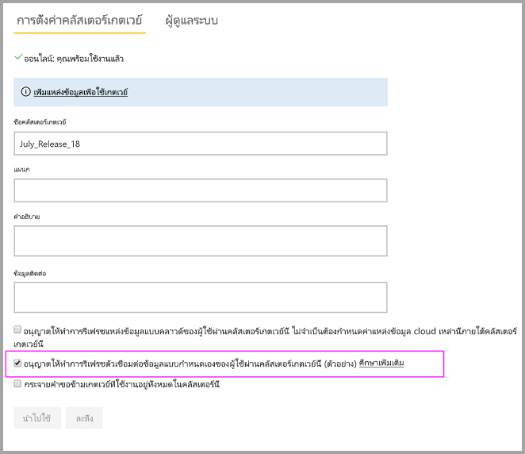

# ใช้ตัวเชื่อมต่อข้อมูลแบบกำหนดเองกับเกตเวย์ข้อมูลภายในองค์กรUse custom data connectors with the on-premises data gateway

[!INCLUDE [gateway-rewrite](../includes/gateway-rewrite.md)]

ด้วยความสามารถของตัวเชื่อมต่อข้อมูลสำหรับ Power BI คุณสามารถเชื่อมต่อและเข้าถึงข้อมูลจากแอปพลิเคชัน บริการ หรือแหล่งข้อมูลWith data connectors for Power BI, you can connect to and access data from an application, service, or data source. คุณสามารถพัฒนาตัวเชื่อมต่อข้อมูลแบบกำหนดเอง และใช้งานได้ใน Power BI DesktopYou can develop custom data connectors and use them in Power BI Desktop.

เมื่อต้องการเรียนรู้เพิ่มเติมเกี่ยวกับวิธีการพัฒนาตัวเชื่อมต่อข้อมูลแบบกำหนดเองสำหรับ Power BI ให้ดู [หน้า SDK GitHub ของตัวเชื่อมต่อข้อมูล](https://aka.ms/dataconnectors)To learn more about how to develop custom data connectors for Power BI, see the [Data connector SDK GitHub page](https://aka.ms/dataconnectors). เว็บไซต์นี้มีข้อมูลเกี่ยวกับวิธีเริ่มต้นใช้งานและตัวอย่างสำหรับ Power BI และ Power QueryThis site includes information on how to get started and samples for Power BI and Power Query.

เมื่อคุณสร้างรายงานใน Power BI Desktop ที่ใช้ตัวเชื่อมต่อข้อมูลแบบกำหนดเอง คุณสามารถใช้เกตเวย์ข้อมูลภายในองค์กรเพื่อรีเฟรชรายงานเหล่านั้นจากบริการของ Power BIWhen you build reports in Power BI Desktop that use custom data connectors, you can use the on-premises data gateway to refresh those reports from the Power BI service.

## เปิดใช้งานและใช้ความสามารถนี้Enable and use this capability

เมื่อคุณติดตั้งเกตเวย์ข้อมูลภายในองค์กรเวอร์ชันเดือนกรกฎาคม 2018 หรือเวอร์ชันที่ใหม่กว่า คุณสามารถดูแท็บ **ตัวเชื่อมต่อ** ในเกตเวย์ข้อมูลภายในองค์กรWhen you install the July 2018 version of the on-premises data gateway or a later version, you see a **Connectors** tab in the on-premises data gateway app. ในกล่อง **โหลดตัวเชื่อมต่อข้อมูลแบบกำหนดเองจากโฟลเดอร์** ให้เลือกโฟลเดอร์ที่สามารถเข้าถึงได้โดยผู้ใช้ที่ใช้บริการเกตเวย์In the **Load custom data connectors from folder** box, select a folder that can be accessed by the user running the gateway service. ผู้ใช้ค่าเริ่มต้น คือ *NT SERVICE\PBIEgwService.*The default user is *NT SERVICE\PBIEgwService*. เกตเวย์จะโหลดไฟล์ตัวเชื่อมต่อแบบกำหนดเองที่อยู่ในโฟลเดอร์นั้นโดยอัตโนมัติThe gateway automatically loads the custom connector files located in that folder. ซึ่งจะปรากฏในรายการตัวเชื่อมต่อข้อมูลThey appear in the list of data connectors.

ถ้าคุณกำลังใช้เกตเวย์ข้อมูลภายในองค์กร (โหมดส่วนบุคคล) คุณจะสามารถอัปโหลดรายงาน Power BI ของคุณไปยังบริการของ Power BI และใช้เกตเวย์เพื่อรีเฟรชIf you're using the on-premises data gateway (personal mode), you can upload your Power BI report to the Power BI service and use the gateway to refresh it.

สำหรับเกตเวย์ข้อมูลภายในองค์กร คุณจำเป็นต้องสร้างแหล่งข้อมูลสำหรับตัวเชื่อมต่อแบบกำหนดเองของคุณFor the on-premises data gateway, you need to create a data source for your custom connector. ในหน้าการตั้งค่าเกตเวย์ในบริการ Power BI คุณควรเห็นตัวเลือกเมื่อคุณเลือกคลัสเตอร์เกตเวย์เพื่ออนุญาตให้ใช้ตัวเชื่อมต่อแบบกำหนดเองที่มีคลัสเตอร์นี้On the gateway settings page in the Power BI service, you should see an option when you select the gateway cluster to allow using custom connectors with this cluster. ตรวจสอบให้แน่ใจว่าเกตเวย์ทั้งหมดในคลัสเตอร์มีรุ่นอัปเดตเดือนกรกฎาคม 2018 หรือใหม่กว่าสำหรับตัวเลือกนี้เพื่อให้พร้อมใช้งานMake sure all gateways in the cluster have the July 2018 update release or later for this option to be available. เลือกตัวเลือกนั้นเพื่อเปิดใช้งานโดยใช้ตัวเชื่อมต่อแบบกำหนดเองที่มีคลัสเตอร์นี้Select that option to enable using custom connectors with this cluster.

เมื่อคุณเปิดใช้งานตัวเลือกนี้ คุณเห็นตัวเชื่อมต่อแบบกำหนดเองของคุณเป็นแหล่งข้อมูลที่พร้อมใช้งานที่คุณสามารถสร้างภายใต้คลัสเตอร์เกตเวย์นี้When this option is enabled, you see your custom connectors as available data sources that you can create under this gateway cluster. หลังจากคุณสร้างแหล่งข้อมูลโดยใช้ตัวเชื่อมต่อแบบกำหนดเองของคุณใหม่ คุณสามารถรีเฟรชรายงาน Power BI โดยใช้ตัวเชื่อมต่อแบบกำหนดเองนั้นในบริการ Power BIAfter you create a data source that uses your new custom connector, you can refresh Power BI reports by using that custom connector in the Power BI service.

## ข้อควรพิจารณาและข้อจำกัดConsiderations and limitations

* ตรวจสอบให้แน่ใจว่าโฟลเดอร์ที่คุณสร้างจะสามารถเข้าถึงบริการเกตเวย์พื้นหลังMake sure the folder you create is accessible to the background gateway service. โดยทั่วไปแล้ว โฟลเดอร์ภายใต้โฟลเดอร์ Windows หรือโฟลเดอร์ระบบของผู้ใช้ของคุณจะไม่สามารถเข้าถึงได้Typically, folders under your user’s Windows folder or system folders won’t be accessible. แอปเกตเวย์ข้อมูลภายในองค์กรจะแสดงข้อความถ้าไม่สามารถเข้าถึงโฟลเดอร์ได้The on-premises data gateway app shows a message if the folder isn't accessible. คำแนะนำนี้ใช้ไม่ได้กับเกตเวย์ข้อมูลภายในองค์กร (โหมดส่วนบุคคล)This instruction doesn't apply for the on-premises data gateway (personal mode).
* สำหรับตัวเชื่อมต่อแบบกำหนดเองเพื่อทำงานกับเกตเวย์ข้อมูลภายในองค์กร พวกเขาจำเป็นต้องใช้ส่วน "TestConnection" ในรหัสของตัวเชื่อมต่อแบบกำหนดเองFor custom connectors to work with the on-premises data gateway, they need to implement a “TestConnection” section in the custom connector’s code. ส่วนนี้ไม่จำเป็นเมื่อคุณใช้ตัวเชื่อมต่อแบบกำหนดเองกับ Power BI DesktopThis section isn't required when you use custom connectors with Power BI Desktop. ด้วยเหตุผลนี้ คุณสามารถมีตัวเชื่อมต่อที่ใช้งานได้กับ Power BI Desktop แต่ไม่ใช่กับเกตเวย์For this reason, you can have a connector that works with Power BI Desktop, but not with the gateway. สำหรับข้อมูลเพิ่มเติมเกี่ยวกับวิธีการใช้งาน TestConnection โปรดดู [เอกสารนี้](https://github.com/Microsoft/DataConnectors/blob/master/docs/m-extensions.md#implementing-testconnection-for-gateway-support)For more information on how to implement a TestConnection section, see [this documentation](https://github.com/Microsoft/DataConnectors/blob/master/docs/m-extensions.md#implementing-testconnection-for-gateway-support).
* OAuth สำหรับตัวเชื่อมต่อแบบกำหนดเองผ่านเกตเวย์ได้รับการรองรับเฉพาะสำหรับผู้ดูแลเกตเวย์แต่ไม่ใช่แหล่งข้อมูลอื่นๆ ในขณะนี้OAuth for custom connectors via gateways is currently supported only for gateway admins but not other data source users.
* หากตัวเชื่อมต่อที่กำหนดเองของคุณอยู่บนไดรฟ์เครือข่ายให้รวมพา ธแบบเต็มในแอปเกตเวย์ข้อมูลภายในองค์กรIf your custom connector is on a network drive, include the fully qualified path on the on-premises data gateway app.

## ขั้นตอนถัดไปNext steps

* [จัดการแหล่งข้อมูลของคุณ - Analysis ServicesManage your data source - Analysis Services](service-gateway-enterprise-manage-ssas.md)  
* [จัดการแหล่งข้อมูลของคุณ - SAP HANAManage your data source - SAP HANA](service-gateway-enterprise-manage-sap.md)  
* [จัดการแหล่งข้อมูลของคุณ - SQL ServerManage your data source - SQL Server](service-gateway-enterprise-manage-sql.md)  
* [จัดการแหล่งข้อมูลของคุณ - OracleManage your data source - Oracle](service-gateway-onprem-manage-oracle.md)  
* [จัดการแหล่งข้อมูลของคุณ - นำเข้า/รีเฟรชตามกำหนดการManage your data source - Import/scheduled refresh](service-gateway-enterprise-manage-scheduled-refresh.md)
* [กำหนดค่าการตั้งค่าพร็อกซีสำหรับเกตเวย์ข้อมูลภายในองค์กรConfigure proxy settings for the on-premises data gateway](/data-integration/gateway/service-gateway-proxy)
* [ใช้ Kerberos สำหรับลงชื่อเข้าใช้ครั้งเดียว (SSO) จาก Power BI ไปยังแหล่งข้อมูลภายในองค์กรUse Kerberos for single sign-on (SSO) from Power BI to on-premises data sources](service-gateway-sso-kerberos.md)  

มีคำถามเพิ่มเติมหรือไม่More questions? ลองถาม[ชุมชน Power BI](https://community.powerbi.com/)Try asking the [Power BI Community](https://community.powerbi.com/).
