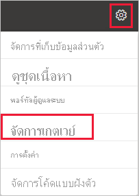
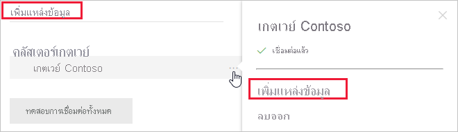
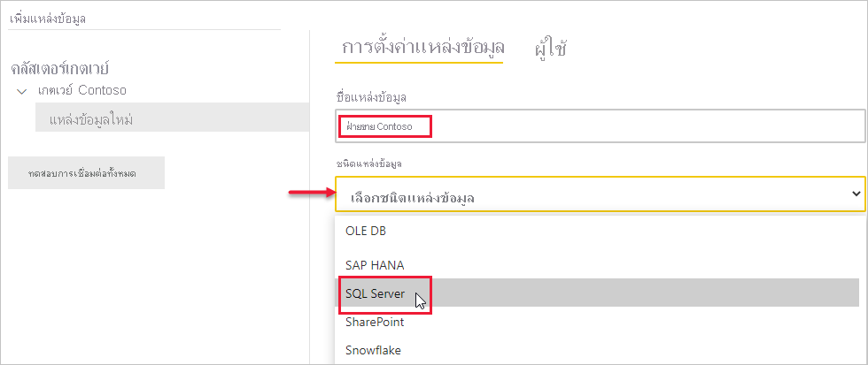
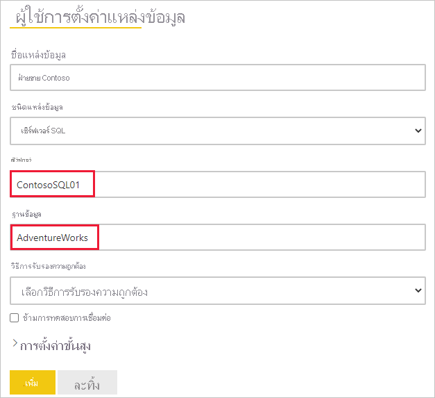
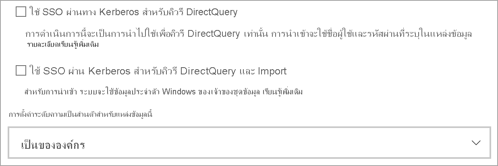
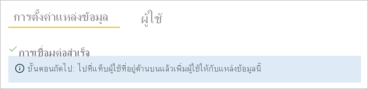
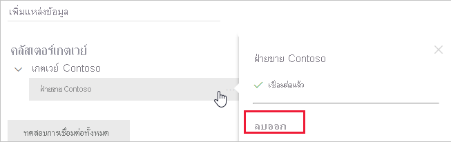
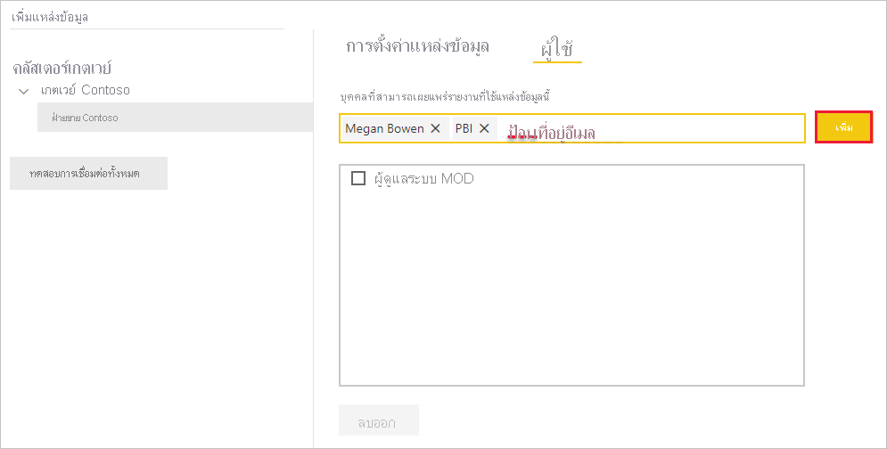
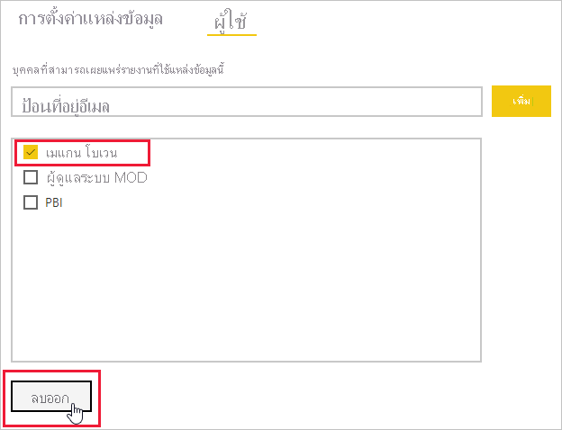

# เพิ่มหรือลบแหล่งข้อมูลเกตเวย์Add or remove a gateway data source

[!INCLUDE [gateway-rewrite](../includes/gateway-rewrite.md)]

Power BI สนับสนุน[แหล่งข้อมูลภายในองค์กร](power-bi-data-sources.md)มากมาย ซึ่งแต่ละชนิดข้อกำหนดของตนเองPower BI supports many [on-premises data sources](power-bi-data-sources.md), and each has its own requirements. สามารถใช้เกตเวย์สำหรับแหล่งข้อมูลเดียวหรือหลายแหล่งข้อมูลA gateway can be used for a single data source or multiple data sources. สำหรับตัวอย่างนี้ เราจะแสดงให้คุณเห็นวิธีการเพิ่ม SQL Server เป็นแหล่งข้อมูลFor this example, we show you how to add SQL Server as a data source. ขั้นตอนก็จะคล้ายกับแหล่งข้อมูลอื่น ๆThe steps are similar for other data sources.

การดำเนินการจัดการแหล่งข้อมูลส่วนใหญ่สามารถดำเนินการได้โดยใช้ API ด้วยเช่นกันMost data sources management operations can be performed by using APIs as well. สำหรับข้อมูลเพิ่มเติม ดู[Rest APIs (เกตเวย์)](/rest/api/power-bi/gateways)For more information, see [REST APIs (Gateways)](/rest/api/power-bi/gateways).

หากคุณยังไม่ได้ติดตั้งเกตเวย์ โปรดดูที่[ติดตั้งเกตเวย์ข้อมูลภายในองค์กร](/data-integration/gateway/service-gateway-install)เพื่อเริ่มต้นใช้งานIf you don't have a gateway installed yet, see [Install an on-premises data gateway](/data-integration/gateway/service-gateway-install) to get started.

## เพิ่มแหล่งข้อมูลAdd a data source

1. จากส่วนหัวของหน้าในบริการ Power BI ให้เลือก **การตั้งค่า** > **จัดการเกตเวย์**From the page header in the Power BI service, select  **Settings**  > **Manage gateways**.

    

2. เลือกเกตเวย์แล้วเลือก **เพิ่มแหล่งข้อมูล**Select a gateway and then select **Add data source**. คุณสามารถเลือกข้อความส่วนหัว **เพิ่มแหล่งข้อมูล** หรือวางเคอร์เซอร์ของคุณถัดจากรายการเกตเวย์เพื่อแสดงเมนูตัวเลือกเพิ่มเติมYou can select the header text **ADD DATA SOURCE** or hover your cursor next to the gateway entry to reveal the more options menu.

    

3. กำหนดชื่อให้กับแหล่งข้อมูลของคุณ จากนั้นเลือก **ชนิดแหล่งข้อมูล**Assign a name to your data source, then select the **Data Source Type**. ในตัวอย่างนี้ เราจะเลือก SQL ServerIn this example, we'll choose SQL Server.

    

4. ป้อนข้อมูลเกี่ยวกับแหล่งข้อมูลEnter information about the data source. สำหรับ SQL Server ให้ระบุ **เซิร์ฟเวอร์** และ **ฐานข้อมูล**For SQL Server, provide the **Server** and **Database**.

    

5. เลือก **วิธีการรับรองความถูกต้อง** เพื่อใช้เมื่อเชื่อมต่อกับแหล่งข้อมูลSelect an **Authentication Method** to use when connecting to the data source. สำหรับ SQL Server ให้เลือก **Windows** หรือ **Basic** (การรับรองความถูกต้อง SQL)For SQL Server, choose **Windows** or **Basic** (SQL Authentication). ใส่ข้อมูลประจำตัวสำหรับแหล่งข้อมูลของคุณEnter the credentials for your data source.

   :::image type="content" source="media/service-gateway-data-sources/basic-auth.png" alt-text="การตั้งค่าการรับรองความถูกต้องแบบ Basic":::

    > [!NOTE]
    > หากวิธีการรับรองความถูกต้องที่เลือกไว้คือ OAuth คิวรีใด ๆ ที่ใช้งานนานกว่านโยบายการหมดอายุโทเค็นของ OAuth อาจล้มเหลวIf the selected authentication method is OAuth, any query that runs longer than the OAuth token expiration policy may fail.

6. ภายใต้ **การตั้งค่าขั้นสูง** คุณสามารถกำหนดค่า [ลงชื่อเข้าระบบครั้งเดียว (SSO)](service-gateway-sso-overview.md) สำหรับแหล่งข้อมูลของคุณได้Under **Advanced settings**, you could configure [Single Sign-On (SSO)](service-gateway-sso-overview.md) for your data source. 

    

    คุณสามารถกำหนดค่า **ใช้ SSO ผ่าน Kerberos สำหรับคิวรีแบบ DirectQuery** หรือ **ใช้ SSO ผ่าน Kerberos สำหรับคิวรีแบบ DirectQuery และ Import** สำหรับรายงานที่ยึดตาม DirectQuery และ **ใช้ SSO ผ่าน Kerberos สำหรับคิวรีแบบ DirectQuery และ Import** สำหรับรายงานที่ยึดตามการรีเฟรชYou could either configure **Use SSO via Kerberos for DirectQuery queries**  or **Use SSO via Kerberos for DirectQuery And Import queries** for DirectQuery-based Reports and **Use SSO via Kerberos for DirectQuery And Import queries** for Refresh-based Reports.

    ถ้าคุณใช้ **ใช้ SSO ผ่าน Kerberos สำหรับคิวรีแบบ DirectQuery** และใช้แหล่งข้อมูลนี้สำหรับรายงานที่ยึดตาม DirectQuery ซึ่งจะใช้ข้อมูลประจำตัวของผู้ใช้ที่ลงชื่อเข้าใช้บริการ Power BIIf you use the **Use SSO via Kerberos for DirectQuery queries** and use this data source for a DirectQuery based Report, it will use the credentials of the user that signs in to the Power BI service. สำหรับรายงานที่ยึดตามการรีเฟรช จะใช้ข้อมูลประจำตัวที่คุณป้อนในเขตข้อมูล **ชื่อผู้ใช้** และ **รหัสผ่าน**For a Refresh-based Report, it will use the credentials that you enter in the **Username** and **Password** fields.

    ถ้าคุณใช้ **ใช้ SSO ผ่าน Kerberos สำหรับคิวรีแบบ DirectQuery และ Import** คุณไม่จำเป็นต้องใส่ข้อมูลประจำตัวใดก็ตามWhen you use the **Use SSO via Kerberos for DirectQuery And Import queries**, you don't need to provide any credentials. หากแหล่งข้อมูลนี้ใช้สำหรับรายงานที่ยึดตาม DirectQuery จะใช้ผู้ใช้ที่มีการแมปกับผู้ใช้ Active Directory (Azure) ที่ลงทะเบียนไว้ในบริการของ Power BIIf this data source is used for DirectQuery based Report, it will use the user that's mapped to the (Azure) Active Directory user that signs in to the Power BI service.  สำหรับรายงานที่ยึดตามการรีเฟรช จะใช้บริบทความปลอดภัยของเจ้าของชุดข้อมูลFor a Refresh based Report, it will use the dataset owner's security context

    > [!NOTE]
    >SSO สำหรับคิวรีนำเข้า จะพร้อมใช้งานสำหรับรายการแหล่งข้อมูล SSO โดยใช้ [การมอบหมายที่มีข้อจำกัดของ Kerberos](service-gateway-sso-kerberos.md) เท่านั้นSSO for Import Queries is available only for the list of SSO data sources using [Kerberos constrained delegation](service-gateway-sso-kerberos.md).

7. ภายใต้ **การตั้งค่าขั้นสูง** อาจกำหนดค่า [ระดับความเป็นส่วนตัว](https://support.office.com/article/Privacy-levels-Power-Query-CC3EDE4D-359E-4B28-BC72-9BEE7900B540) สำหรับแหล่งข้อมูลของคุณ (ไม่ใช้กับ [DirectQuery](desktop-directquery-about.md))Under **Advanced settings**, optionally configure the [privacy level](https://support.office.com/article/Privacy-levels-Power-Query-CC3EDE4D-359E-4B28-BC72-9BEE7900B540) for your data source (doesn't apply to [DirectQuery](desktop-directquery-about.md)).

    :::image type="content" source="media/service-gateway-data-sources/privacy-level.png" alt-text="การเลือกระดับความเป็นส่วนตัว":::

8. เลือก **เพิ่ม**Select **Add**. คุณจะเห็นข้อความ *การเชื่อมต่อเป็นที่สำเร็จ* ถ้ากระบวนการสำเร็จYou see *Connection Successful* if the process succeeds.

    

ตอนนี้คุณสามารถใช้แหล่งข้อมูลนี้เพื่อรวมข้อมูลจาก SQL Server ลงในแดชบอร์ดและรายงาน Power BI ของคุณYou can now use this data source to include data from SQL Server in your Power BI dashboards and reports.

## ลบแหล่งข้อมูลRemove a data source

คุณสามารถลบแหล่งข้อมูลออกถ้าคุณไม่ใช้อีกต่อไปYou can remove a data source if you no longer use it. การลบแหล่งข้อมูลออกจะทำให้แดชบอร์ดและรายงานที่ขึ้นกับแหล่งข้อมูลนั้นไม่ทำงานRemoving a data source breaks any dashboards and reports that rely on that data source.

หากต้องการลบแหล่งข้อมูล ให้ไปที่แหล่งข้อมูลและจากนั้นเลือก **ลบ** จากเมนูตัวเลือกเพิ่มเติมTo remove a data source, go to the data source and then select **Remove** from the more options menu. เมนูตัวเลือกเพิ่มเติมจะปรากฏขึ้นเมื่อคุณวางเคอร์เซอร์ถัดจากชื่อแหล่งข้อมูลThe more options menu appears when you hover your cursor next to the data source name.

## ใช้แหล่งข้อมูลสำหรับการรีเฟรชตามกำหนดการหรือ DirectQueryUse the data source for scheduled refresh or DirectQuery

หลังจากที่คุณสร้างแหล่งข้อมูล รายการนี้จะพร้อมใช้งานเมื่อต้องใช้ทั้งกับการเชื่อมต่อ DirectQuery หรือการเชื่อมต่อสดผ่านการรีเฟรชตามกำหนดการAfter you create the data source, it's available to use with either DirectQuery connections or through scheduled refresh. คุณสามารถเรียนรู้เพิ่มเติมเกี่ยวกับการตั้งค่าการรีเฟรชตามกำหนดเวลาได้ใน[กำหนดค่าการรีเฟรชตามกำหนดเวลา](refresh-scheduled-refresh.md)You can learn more about setting up scheduled refresh in [Configure scheduled refresh](refresh-scheduled-refresh.md).

> [!NOTE]
>ชื่อเซิร์ฟเวอร์และชื่อฐานข้อมูลจะต้องตรงกับ Power BI Desktop และแหล่งที่เพิ่มไปยังเกตเวย์ข้อมูลภายในองค์กรServer and database names must match between Power BI Desktop and the data source added to the on-premises data gateway.

การเชื่อมโยงระหว่างชุดข้อมูลของคุณและแหล่งข้อมูลในเกตเวย์จะเป็นไปตามชื่อเซิร์ฟเวอร์และชื่อฐานข้อมูลของคุณThe link between your dataset and the data source in the gateway is based on your server name and database name. ชื่อเหล่านี้ต้องตรงกันThese names must match. ตัวอย่างเช่น ถ้าคุณใส่ที่อยู่ IP สำหรับชื่อเซิร์ฟเวอร์ ใน Power BI Desktop คุณต้องใช้ที่อยู่ IP สำหรับแหล่งข้อมูลในการกำหนดค่าเกตเวย์ด้วยเช่นกันFor example, if you supply an IP address for the server name, in Power BI Desktop, you must use the IP address for the data source in the gateway configuration. ถ้าคุณใช้ *SERVER\INSTANCE* ใน Power BI Desktop คุณต้องใช้ชื่อเดียวกันในแหล่งข้อมูลที่กำหนดค่าไว้สำหรับเกตเวย์ดังกล่าวIf you use *SERVER\INSTANCE* in Power BI Desktop, you must use the same in the data source configured for the gateway.

ถ้าคุณอยู่ในแท็บ **ผู้ใช้** ของแหล่งข้อมูลที่กำหนดค่าไว้ในเกตเวย์ และชื่อเซิร์ฟเวอร์และชื่อฐานข้อมูลตรงกัน คุณจะเห็นเกตเวย์เป็นตัวเลือกเพื่อใช้กับการรีเฟรชตามกำหนดการIf you're listed in the **Users** tab of the data source configured in the gateway, and the server and database name match, you see the gateway as an option to use with scheduled refresh.

> [!WARNING]
> ถ้าชุดข้อมูลของคุณประกอบด้วยแหล่งข้อมูลหลายแหล่ง คุณต้องเพิ่มแต่ละแหล่งข้อมูลในเกตเวย์ดังกล่าวIf your dataset contains multiple data sources, each data source must be added in the gateway. ถ้าไม่ได้เพิ่มแหล่งข้อมูลอย่างน้อยหนึ่งแหล่งเข้าไปในเกตเวย์ คุณจะไม่เห็นเกตเวย์ดังกล่าวเป็นสถานะพร้อมใช้งานสำหรับการรีเฟรชตามกำหนดการIf one or more data sources aren't added to the gateway, you won't see the gateway as available for scheduled refresh.

### ข้อจำกัดLimitations

OAuth เป็นเค้าร่างการรับรองความถูกต้องที่ได้รับการสนับสนุนเฉพาะสำหรับการเชื่อมต่อกับเกตเวย์ข้อมูลภายในองค์กรเท่านั้นOAuth is a supported authentication scheme only for custom connectors with the on-premises data gateway. คุณไม่สามารถเพิ่มแหล่งข้อมูลที่ต้องใช้ OAuth ได้You can't add other data sources that require OAuth. ถ้าชุดข้อมูลของคุณมีแหล่งข้อมูลที่ต้องมี OAuth และชุดข้อมูลนี้ไม่ใช่ตัวเชื่อมต่อแบบกำหนดเอง คุณจะไม่สามารถใช้เกตเวย์ดังกล่าวสำหรับการรีเฟรชตามกำหนดเวลาได้If your dataset has a data source that requires OAuth and this data source isn't a custom connector, you can't use the gateway for scheduled refresh.

## จัดการผู้ใช้Manage users

หลังจากที่คุณเพิ่มแหล่งข้อมูลให้กับเกตเวย์แล้ว คุณสามารถให้สิทธิการเข้าถึงแหล่งข้อมูลที่กำหนดแก่ผู้ใช้และกลุ่มความปลอดภัยที่เปิดใช้งานอีเมล (ไม่ใช่ทั้งเกตเวย์)After you add a data source to a gateway, you give users and email-enabled security groups access to the specific data source (not the entire gateway). รายการเข้าถึงสำหรับแหล่งข้อมูลจะควบคุมว่าใครสามารถเผยแพร่รายงานที่รวมข้อมูลจากแหล่งข้อมูลนั้นได้บ้างThe access list for the data source controls only who is allowed to publish reports that include data from the data source. เจ้าของรายงานสามารถสร้างแดชบอร์ด ชุดเนื้อหา และแอป จากนั้นแชร์รายการเหล่านั้นให้กับผู้ใช้รายอื่นได้Report owners can create dashboards, content packs, and apps, and then share those items with other users.

คุณยังสามารถให้ผู้ใช้และกลุ่มความปลอดภัย เข้าถึงเกตเวย์ในระดับผู้ดูแลYou can also give users and security groups administrative access to the gateway.

> [!NOTE]
> ผู้ใช้ที่สามารถเข้าถึงแหล่งข้อมูลสามารถเชื่อมโยงชุดข้อมูลกับแหล่งข้อมูลและเชื่อมต่อตามตัวเลือกความปลอดภัย (ข้อมูลประจำตัวที่เก็บไว้หรือการเข้าระบบครั้งเดียว) ที่เลือกขณะสร้างแหล่งข้อมูลUsers with access to the data source can associate datasets to the data source, and connect, based on the security options (either the stored credentials or Single Sign-On) selected while creating a data source.

### เพิ่มผู้ใช้ไปยังแหล่งข้อมูลAdd users to a data source

1. จากส่วนหัวของหน้าในบริการ Power BI ให้เลือก **การตั้งค่า** > **จัดการเกตเวย์**From the page header in the Power BI service, select  **Settings**  > **Manage gateways**.

2. เลือกแหล่งข้อมูลที่คุณต้องการเพิ่มผู้ใช้Select the data source where you want to add users.

3. เลือก **ผู้ใช้** และป้อนผู้ใช้และกลุ่มความปลอดภัยที่เปิดใช้งานอีเมลจากองค์กรของคุณซึ่งจะเข้าถึงแหล่งข้อมูลที่เลือกSelect **Users**, and enter the users and mail-enabled security groups from your organization who will access the selected data source. เลือก **เพิ่ม** และชื่อของสมาชิกที่เพิ่มจะถูกเพิ่มลงในรายการผู้ที่สามารถเผยแพร่รายงานที่ใช้แหล่งข้อมูลนี้Select **Add**, and the added member's name is added to the list of people who can publish reports that use this data source.

    

โปรดทราบคุณต้องเพิ่มผู้ใช้ไปยังแต่ละแหล่งข้อมูลที่คุณต้องการให้สิทธิ์เข้าใช้Remember that you need to add users to each data source that you want to grant access to. แต่ละแหล่งข้อมูลมีรายการชื่อผู้ใช้ที่แยกต่างหากEach data source has a separate list of users. เพิ่มผู้ใช้ไปยังแต่ละแหล่งข้อมูลแยกต่างหากAdd users to each data source separately.

### เอาผู้ใช้ออกจากแหล่งข้อมูลRemove users from a data source

บนแท็บ **ผู้ใช้** สำหรับแหล่งข้อมูล คุณสามารถเอาผู้ใช้และกลุ่มความปลอดภัยที่ใช้แหล่งข้อมูลนี้ออกได้On the **Users** tab for the data source, you can remove users and security groups that use this data source.

## จัดเก็บข้อมูลประจำตัวเข้ารหัสลับในระบบคลาวด์Store encrypted credentials in the cloud

เมื่อคุณเพิ่มแหล่งข้อมูลกับเกตเวย์ คุณต้องใส่ข้อมูลประจำตัวสำหรับแหล่งข้อมูลนั้นWhen you add a data source to the gateway, you must provide credentials for that data source. คิวรีทั้งหมดที่ไปยังแหล่งข้อมูลจะทำงานโดยใช้ข้อมูลประจำตัวเหล่านี้All queries to the data source will run by using these credentials. ข้อมูลประจำตัวจะมีการเข้ารหัสลับอย่างปลอดภัยThe credentials are encrypted securely. โดยการใช้การเข้ารหัสลับสมมาตรเพื่อให้ไม่สามารถถอดรหัสในระบบคลาวด์ก่อนที่จะถูกจัดเก็บในระบบคลาวด์They use symmetric encryption so that they can't be decrypted in the cloud before they're stored in the cloud. ข้อมูลประจำตัวถูกส่งไปยังเครื่องที่เรียกใช้เกตเวย์ภายในองค์กร ที่ข้อมูลเหล่านี้จะถูกถอดรหัสลับเมื่อมีการเข้าถึงแหล่งข้อมูลThe credentials are sent to the machine that runs the gateway, on-premises, where they're decrypted when the data sources are accessed.

## รายการของชนิดแหล่งข้อมูลที่พร้อมใช้งานList of available data source types

สำหรับข้อมูลเกี่ยวกับแหล่งข้อมูลที่เกตเวย์ข้อมูลภายในองค์กรสนับสนุน ให้ดู [แหล่งข้อมูล Power BI](power-bi-data-sources.md)For information about which data sources the on-premises data gateway supports, see [Power BI data sources](power-bi-data-sources.md).

## ขั้นตอนถัดไปNext steps

* [จัดการแหล่งข้อมูลของคุณ - Analysis ServicesManage your data source - Analysis Services](service-gateway-enterprise-manage-ssas.md)
* [จัดการแหล่งข้อมูลของคุณ - SAP HANAManage your data source - SAP HANA](service-gateway-enterprise-manage-sap.md)
* [จัดการแหล่งข้อมูลของคุณ - SQL ServerManage your data source - SQL Server](service-gateway-enterprise-manage-sql.md)
* [จัดการแหล่งข้อมูลของคุณ - OracleManage your data source - Oracle](service-gateway-onprem-manage-oracle.md)
* [จัดการแหล่งข้อมูลของคุณ - นำเข้า/รีเฟรชตามกำหนดการManage your data source - Import/scheduled refresh](service-gateway-enterprise-manage-scheduled-refresh.md)
* [คำแนะนำสำหรับการปรับใช้เกตเวย์ข้อมูลGuidance for deploying a data gateway](service-gateway-deployment-guidance.md)

มีคำถามเพิ่มเติมหรือไม่More questions? ลองไปที่ [ชุมชน Power BI](https://community.powerbi.com/)Try the [Power BI Community](https://community.powerbi.com/).
