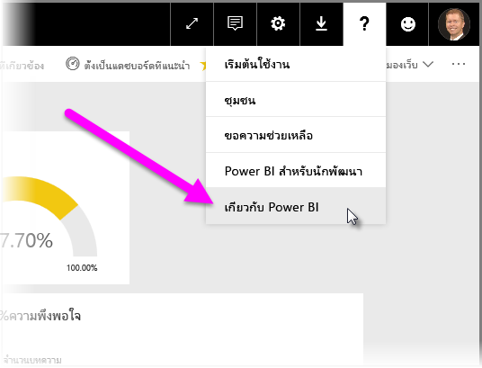

# คำแนะนำสำหรับการปรับใช้เกตเวย์ข้อมูลจาก Power BIGuidance for deploying a data gateway for Power BI

[!INCLUDE [gateway-rewrite](../includes/gateway-rewrite.md)]

บทความนี้มีคำแนะนำและข้อควรพิจารณาสำหรับการปรับใช้เกตเวย์ข้อมูลสำหรับ Power BI ในสภาพแวดล้อมเครือข่ายของคุณThis article provides guidance and considerations for deploying a data gateway for Power BI in your network environment.

สำหรับข้อมูลเกี่ยวกับวิธีการดาวน์โหลด ติดตั้ง กำหนดค่า และจัดการเกตเวย์ข้อมูลภายในองค์กร ให้ดูที่ [เกตเวย์ข้อมูลภายในองค์กรคืออะไร](/data-integration/gateway/service-gateway-onprem)For information about how to download, install, configure, and manage the on-premises data gateway, see [What is an on-premises data gateway?](/data-integration/gateway/service-gateway-onprem). นอกจากนี้ คุณยังสามารถเรียนรู้เพิ่มเติมเกี่ยวกับเกตเวย์ข้อมูลภายในองค์กรและ Power BI ได้โดยการเยี่ยมชมบล็อก [Microsoft Power ](https://powerbi.microsoft.com/blog/)และไซต์ [Microsoft Power BI Community](https://community.powerbi.com/)You can also find out more about the on-premises data gateway and Power BI by visiting the [Microsoft Power blog](https://powerbi.microsoft.com/blog/) and the [Microsoft Power BI Community](https://community.powerbi.com/) site.

## ข้อควรพิจารณาเกี่ยวกับการติดตั้งเกตเวย์ข้อมูลภายในองค์กรInstallation considerations for the on-premises data gateway

ก่อนที่คุณจะติดตั้งเกตเวย์ข้อมูลภายในองค์กรสำหรับบริการคลาวด์ของ Power BI มีข้อควรพิจารณาบางประการที่คุณควรต้องทราบไว้Before you install the on-premises data gateway for your Power BI cloud service, there are some considerations to keep in mind. ส่วนต่อไปนี้อธิบายถึงข้อควรพิจารณาเหล่านี้The following sections describe these considerations.

### จำนวนผู้ใช้Number of users

จำนวนผู้ใช้ที่ใช้รายงานที่มีการใช้เกตเวย์เป็นเมตริกสำคัญในการตัดสินใจของคุณว่าจะติดตั้งเกตเวย์ที่ใดThe number of users who consume a report that uses the gateway is an important metric in your decision about where to install the gateway. นี่คือคำถามบางประการที่ควรพิจารณา:Here are some questions to consider:

* ผู้ใช้กำลังใช้รายงานเหล่านี้ในเวลาที่แตกต่างของวันหรือไม่Do users use these reports at different times of the day?
* การเชื่อมต่อชนิดใดบ้างที่พวกเขาใช้ (DirectQuery หรือการนำเข้า)What types of connections do they use (DirectQuery or Import)?
* ผู้ใช้ทั้งหมดใช้รายงานเดียวกันหรือไม่Do all users use the same report?

ถ้าผู้ใช้ทั้งหมดเข้าถึงรายงานที่กำหนดในเวลาเดียวกันในแต่ละวัน คุณควรตรวจสอบให้แน่ใจว่าคุณได้ติดตั้งเกตเวย์บนเครื่องที่สามารถจัดการการร้องขอเหล่านั้นทั้งหมดได้หรือไม่If all the users access a given report at the same time each day, make sure that you install the gateway on a machine that's capable of handling all those requests. ดูส่วนต่อไปนี้สำหรับตัวนับประสิทธิภาพการทำงานและความต้องการขั้นต่ำที่สามารถช่วยให้คุณตัดสินใจว่าเครื่องมีประสิทธิภาพเพียงพอหรือไม่See the following sections for performance counters and minimum requirements that can help you determine whether a machine is adequate.

ข้อจำกัดใน Power BI อนุญาตให้มีเพียง *หนึ่ง* เกตเวย์ต่อ *รายงาน* เท่านั้นA constraint in Power BI allows only *one* gateway per *report*. แม้ว่ารายงานจะยึดตามแหล่งข้อมูลหลายแหล่ง แต่แหล่งข้อมูลดังกล่าวทั้งหมดต้องผ่านเกตเวย์เดียวEven if a report is based on multiple data sources, all such data sources must go through a single gateway. ถ้าแดชบอร์ดจะยึดตามรายงาน *หลาย* รายกา รคุณสามารถใช้เกตเวย์เฉพาะสำหรับแต่ละรายงานที่ส่งไปยังแดชบอร์ดIf a dashboard is based on *multiple* reports, you can use a dedicated gateway for each contributing report. ด้วยวิธีนี้ คุณกระจายโหลดเกตเวย์ไปยังรายงานทั้งหลายที่ส่งไปยังแดชบอร์ดเดียวIn this way, you distribute the gateway load among the multiple reports that contribute to the single dashboard.

### ชนิดการเชื่อมต่อConnection type

Power BI มีชนิดของการเชื่อมต่อสองชนิด: DirectQuery และ การนำเข้าPower BI offers two types of connections: DirectQuery and Import. แหล่งข้อมูลทั้งหมดไม่สนับสนุนชนิดการเชื่อมต่อทั้งสองประเภทNot all data sources support both connection types. ปัจจัยหลายอย่างอาจมีส่วนร่วมในตัวเลือกของคุณมากกว่าหนึ่งรายการ เช่น ข้อกำหนดด้านความปลอดภัย ประสิทธิภาพ ขีดจำกัดข้อมูล และขนาดของแบบจำลองข้อมูลMany factors might contribute to your choice of one over the other, such as security requirements, performance, data limits, and data model sizes. หากต้องการเรียนรู้เพิ่มเติมเกี่ยวกับชนิดการเชื่อมต่อ และแหล่งข้อมูลที่ได้รับการสนับสนุน โปรดดู [รายการของส่วนชนิดแหล่งข้อมูลที่พร้อมใช้งาน](service-gateway-data-sources.md#list-of-available-data-source-types)To learn more about connection types and supported data sources, see the [list of available data source types](service-gateway-data-sources.md#list-of-available-data-source-types).

การใช้เกตเวย์สามารถแตกต่างกันขึ้นอยู่กับชนิดของการเชื่อมต่อที่จะใช้Depending on which type of connection is used, gateway usage can be different. ตัวอย่างเช่น ลองแยกแหล่งข้อมูล DirectQuery จากแหล่งข้อมูลแบบรีเฟรชตามกำหนดเวลาเมื่อใดก็ตามที่เป็นไปได้For example, try to separate DirectQuery data sources from scheduled refresh data sources whenever possible. สมมติฐานคือว่าแหล่งข้อมูลเหล่านั้นอยู่ในรายงานที่แตกต่างกันและสามารถแยกออกได้The assumption is that they're in different reports and can be separated. การแยกแหล่งข้อมูลจะป้องกันไม่ให้เกตเวย์มีคำขอ DirectQuery ที่เข้าคิวรอจำนวนหลายพัน ในเวลาเดียวกันกับการรีเฟรชแบบจำลองข้อมูลขนาดใหญ่ตามกำหนดการในตอนเช้าที่ใช้สำหรับแดชบอร์ดหลักของบริษัทSeparating sources prevents the gateway from having thousands of DirectQuery requests queued up at the same time as the morning's scheduled refresh of a large-size data model that's used for the company's main dashboard. 

นี่คือสิ่งที่ต้องพิจารณาสำหรับแต่ละตัวเลือก:Here's what to consider for each option:

* **รีเฟรชตามกำหนดเวลา**: ขึ้นอยู่กับขนาดของแบบสอบถามและจำนวนของการรีเฟรชที่เกิดขึ้นในแต่ละวัน คุณสามารถเลือกที่จะใช้กับข้อกำหนดฮาร์ดแวร์ขั้นต่ำที่แนะนำ หรืออัปเกรดไปยังเครื่องที่มีประสิทธิภาพสูงกว่าได้**Scheduled refresh**: Depending on your query size and the number of refreshes that occur per day, you can choose to stay with the recommended minimum hardware requirements or upgrade to a higher performance machine. ถ้าไม่ได้ห่อหุ้มคิวรีที่ระบุ การแปลงจะเกิดขึ้นบนเครื่องเกตเวย์If a given query isn't folded, transformations occur on the gateway machine. ด้วยเหตุนี้คุณจะได้รับประโยชน์จากเครื่องเกตเวย์ที่มี RAM ที่พร้อมใช้งานมากขึ้นAs a result, the gateway machine benefits from having more available RAM.

* **DirectQuery**: คิวรีจะถูกส่งไปยังผู้ใช้ที่เปิดรายงาน หรือดูข้อมูลในแต่ละครั้ง**DirectQuery**: A query is sent each time any user opens the report or looks at data. ถ้าคุณคาดว่าจะมีผู้ใช้มากกว่า 1,000 ราย ที่เข้าถึงข้อมูลพร้อมกัน คุณควรตรวจสอบให้แน่ใจว่าคอมพิวเตอร์ของคุณมีส่วนประกอบฮาร์ดแวร์ที่มีประสิทธิภาพและมีความสามารถIf you expect more than 1,000 users to access the data concurrently, make sure your computer has robust and capable hardware components. แกนประมวลผล CPU ส่งผลต่อปริมาณที่สามารถประมวลผลได้ดียิ่งขึ้นสำหรับการเชื่อมต่อ DirectQueryMore CPU cores result in better throughput for a DirectQuery connection.

สำหรับข้อกำหนดในการติดตั้งเครื่อง ให้ดู[ข้อกำหนดในการติดตั้ง](/data-integration/gateway/service-gateway-install#requirements)เกตเวย์ข้อมูลภายในองค์กรFor the machine installation requirements, see the on-premises data gateway [installation requirements](/data-integration/gateway/service-gateway-install#requirements).

### ตำแหน่งที่ตั้งLocation

ตำแหน่งของการติดตั้งเกตเวย์สามารถมีผลกระทบต่อประสิทธิภาพการทำงานของคิวรีของคุณได้อย่างมีนัยสำคัญThe location of the gateway installation can have significant impact on your query performance. ลองตรวจสอบให้แน่ใจว่าเกตเวย์ของคุณ ตำแหน่งแหล่งข้อมูล และผู้เช่า Power BI อยู่ใกล้เคียงกันมากที่สุดเท่าที่เป็นไปได้เพื่อลดเวลาแฝงของเครือข่ายให้เหลือน้อยที่สุดTry to make sure that your gateway, data source locations, and the Power BI tenant are as close as possible to each other to minimize network latency. เมื่อต้องกำหนดตำแหน่งของผู้เช่า Power BI ให้เลือกไอคอน **?** ในบริการ Power BITo determine your Power BI tenant location, in the Power BI service select the **?** ไอคอนที่มุมขวาบนicon in the upper-right corner. จากนั้นเลือก **เกี่ยวกับ Power BI**Then select **About Power BI**.

ถ้าคุณต้องการใช้เกตเวย์ Power BI กับ Azure Analysis Services โปรดตรวจสอบให้แน่ใจว่าขอบเขตข้อมูลทั้งสองตรงกันIf you intend to use the Power BI gateway with Azure Analysis Services, be sure that the data regions in both match. สำหรับข้อมูลเพิ่มเติมเกี่ยวกับวิธีการตั้งค่าขอบเขตข้อมูลสำหรับบริการหลายรายการ ให้ดู[วิดีโอนี้](https://guyinacube.com/2018/01/power-bi-azure-analysis-services-gateway-data-region/)For more information about how to set data regions for multiple services, watch [this video](https://guyinacube.com/2018/01/power-bi-azure-analysis-services-gateway-data-region/).

## ขั้นตอนถัดไปNext steps

* [กำหนดการตั้งค่าพร็อกซีConfiguring proxy settings](/data-integration/gateway/service-gateway-proxy)  
* [แก้ไขปัญหาเกตเวย์-Power BITroubleshoot gateways - Power BI](service-gateway-onprem-tshoot.md)  
* [คำถามที่ถามบ่อยเกี่ยวกับเกตเวย์ข้อมูลภายในองค์กร - Power BIOn-premises data gateway FAQ - Power BI](service-gateway-power-bi-faq.md)  

มีคำถามเพิ่มเติมหรือไม่More questions? ลองไปที่ [ชุมชน Power BI](https://community.powerbi.com/)Try the [Power BI Community](https://community.powerbi.com/).
