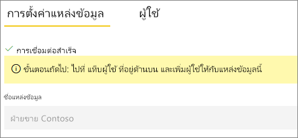

# จัดการแหล่งข้อมูลของคุณ - นำเข้า/รีเฟรชตามกำหนดการManage your data source - Import/scheduled refresh

[!INCLUDE [gateway-rewrite](../includes/gateway-rewrite.md)]

หลังจากคุณ[ติดตั้งเกตเวย์ข้อมูลภายในองค์กรแล้ว](/data-integration/gateway/service-gateway-install) คุณจะต้อง[เพิ่มแหล่งข้อมูล](service-gateway-data-sources.md#add-a-data-source)ที่สามารถใช้ได้กับเกตเวย์ดังกล่าวAfter you [install the on-premises data gateway](/data-integration/gateway/service-gateway-install), you need to [add data sources](service-gateway-data-sources.md#add-a-data-source) that can be used with the gateway. บทความนี้จะดูที่วิธีการทำงานกับเกตเวย์และแหล่งข้อมูลที่จะใช้สำหรับการรีเฟรชตามกำหนดการที่ตรงกันข้ามกับ DirectQuery หรือการเชื่อมต่อแบบสดThis article looks at how to work with gateways and data sources that are used for scheduled refresh as opposed to DirectQuery or live connections.

## เพิ่มแหล่งข้อมูลAdd a data source

สำหรับข้อมูลเพิ่มเติมเกี่ยวกับวิธีการเพิ่มแหล่งข้อมูล ให้ดู[เพิ่มแหล่งข้อมูล](service-gateway-data-sources.md#add-a-data-source)For more information about how to add a data source, see [Add a data source](service-gateway-data-sources.md#add-a-data-source). เลือกชนิดแหล่งข้อมูลSelect a data source type.

ชนิดแหล่งข้อมูลทั้งหมดที่อยู่ในรายการสามารถใช้สำหรับการรีเฟรชตามกำหนดการกับเกตเวย์ข้อมูลภายในองค์กรได้All of the data source types listed can be used for scheduled refresh with the on-premises data gateway. Analysis Services, SQL Server และ SAP HANA สามารถใช้กับทั้งการรีเฟรชตามกำหนดการ หรือกับการเชื่อมต่อ DirectQuery/การเชื่อมต่อสดได้Analysis Services, SQL Server, and SAP HANA can be used for either scheduled refresh or DirectQuery/live connections.

จากนั้นกรอกข้อมูลสำหรับแหล่งข้อมูล ซึ่งรวมถึงข้อมูลแหล่งที่มาและข้อมูลประจำตัวที่ใช้เพื่อเข้าถึงแหล่งข้อมูลThen fill in the information for the data source, which includes the source information and credentials that are used to access the data source.

> [!NOTE]
> คิวรีทั้งหมดที่ไปยังแหล่งข้อมูลจะทำงานโดยใช้ข้อมูลประจำตัวเหล่านี้All queries to the data source run by using these credentials. หากต้องการเรียนรู้เพิ่มเติมเกี่ยวกับวิธีการจัดเก็บข้อมูลประจำตัว ให้ดู [การจัดเก็บข้อมูลประจำตัวที่เข้ารหัสไว้ในระบบคลาวด์](service-gateway-data-sources.md#store-encrypted-credentials-in-the-cloud)To learn more about how credentials are stored, see [Store encrypted credentials in the cloud](service-gateway-data-sources.md#store-encrypted-credentials-in-the-cloud).

สำหรับรายการของชนิดแหล่งข้อมูลที่สามารถใช้ได้กับการรีเฟรชตามกำหนดการ ดูที่ [รายการของชนิดแหล่งข้อมูลที่พร้อมใช้งาน](service-gateway-data-sources.md#list-of-available-data-source-types)For a list of data source types that can be used with scheduled refresh, see [List of available data source types](service-gateway-data-sources.md#list-of-available-data-source-types).

หลังจากที่คุณกรอกข้อมูลทุกอย่างแล้ว ให้เลือก **เพิ่ม**After you fill in everything, select **Add**. ตอนนี้คุณสามารถใช้แหล่งข้อมูลนี้สำหรับการรีเฟรชตามกำหนดการกับข้อมูลภายในองค์กรของคุณได้แล้วYou can now use this data source for scheduled refresh with your on-premises data. คุณจะเห็น *การเชื่อมต่อสำเร็จ* หากการดำเนินการเสร็จสมบูรณ์แล้วYou see *Connection Successful* if it succeeded.

### การตั้งค่าขั้นสูงAdvanced settings

อีกทางหนึ่งคือคุณสามารถกำหนดค่าระดับความเป็นส่วนตัวให้กับแหล่งข้อมูลของคุณOptionally, you can configure the privacy level for your data source. การตั้งค่านี้จะช่วยควบคุมวิธีการรวมข้อมูลได้This setting controls how data can be combined. ซึ่งใช้ได้เฉพาะกับการรีเฟรชตามกำหนดการเท่านั้นIt's only used for scheduled refresh. หากต้องการเรียนรู้เพิ่มเติมเกี่ยวกับระดับความเป็นส่วนตัวสำหรับแหล่งข้อมูลของคุณ ให้ดู [ระดับความเป็นส่วนตัว (Power Query)](https://support.office.com/article/Privacy-levels-Power-Query-CC3EDE4D-359E-4B28-BC72-9BEE7900B540)To learn more about privacy levels for your data source, see [Privacy levels (Power Query)](https://support.office.com/article/Privacy-levels-Power-Query-CC3EDE4D-359E-4B28-BC72-9BEE7900B540).

## ใช้แหล่งข้อมูลสำหรับการรีเฟรชตามกำหนดการUse the data source for scheduled refresh

หลังจากที่คุณสร้างแหล่งข้อมูล รายการนี้จะพร้อมใช้งานเมื่อต้องใช้ทั้งกับการเชื่อมต่อ DirectQuery หรือการเชื่อมต่อสดผ่านการรีเฟรชตามกำหนดการAfter you create the data source, it's available to use with either DirectQuery connections or through scheduled refresh.

> [!NOTE]
> ชื่อเซิร์ฟเวอร์และชื่อฐานข้อมูลจะต้องตรงกับ Power BI Desktop และแหล่งข้อมูลภายในเกตเวย์ข้อมูลภายในองค์กรThe server and database names must match between Power BI Desktop and the data source within the on-premises data gateway.

การเชื่อมโยงระหว่างชุดข้อมูลของคุณและแหล่งข้อมูลภายในเกตเวย์จะเป็นไปตามชื่อเซิร์ฟเวอร์และชื่อฐานข้อมูลของคุณThe link between your dataset and the data source within the gateway is based on your server name and database name. ชื่อเหล่านี้ต้องตรงกันThese names must match. ตัวอย่างเช่น ถ้าคุณใส่ที่อยู่ IP สำหรับชื่อเซิร์ฟเวอร์ภายใน Power BI Desktop คุณต้องใช้ที่อยู่ IP สำหรับแหล่งข้อมูลภายในการกำหนดค่าเกตเวย์ด้วยเช่นกันFor example, if you supply an IP address for the server name within Power BI Desktop, you must use the IP address for the data source within the gateway configuration. ถ้าคุณใช้ *SERVER\INSTANCE* ใน Power BI Desktop คุณต้องใช้ภายในแหล่งข้อมูลที่กำหนดค่าไว้สำหรับเกตเวย์ดังกล่าวด้วยIf you use *SERVER\INSTANCE* in Power BI Desktop, you also must use it within the data source configured for the gateway.

ถ้าคุณอยู่ในแท็บ **ผู้ใช้** ของแหล่งข้อมูลที่กำหนดค่าไว้ภายในเกตเวย์ และชื่อเซิร์ฟเวอร์และชื่อฐานข้อมูลตรงกัน คุณจะเห็นเกตเวย์เป็นตัวเลือกเพื่อใช้กับการรีเฟรชตามกำหนดการIf you're listed in the **Users** tab of the data source configured within the gateway and the server name and database name match, you see the gateway as an option to use with scheduled refresh.

> [!IMPORTANT]
> เมื่อเผยแพร่ซ้ำ เจ้าของชุดข้อมูลจะต้องเชื่อมโยงชุดข้อมูลกับเกตเวย์และแหล่งข้อมูลที่เกี่ยวข้องอีกครั้งUpon republish, the data set owner must reassociate the dataset to a gatweay and corresponding data source again. การเชื่อมโยงก่อนหน้านี้ไม่ได้รับการรักษาไว้เมื่อเผยแพร่ใหม่The previous association is not maintained upon republish. 

> [!WARNING]
> ถ้าชุดข้อมูลของคุณประกอบด้วยแหล่งข้อมูลหลายแหล่ง คุณต้องเพิ่มแต่ละแหล่งข้อมูลภายในเกตเวย์ดังกล่าวIf your dataset contains multiple data sources, each data source must be added within the gateway. ถ้าไม่ได้เพิ่มแหล่งข้อมูลอย่างน้อยหนึ่งแหล่งเข้าไปในเกตเวย์ คุณจะไม่เห็นเกตเวย์ดังกล่าวเป็นสถานะพร้อมใช้งานสำหรับการรีเฟรชตามกำหนดการIf one or more data sources aren't added to the gateway, you won't see the gateway as available for scheduled refresh.

## ขั้นตอนถัดไปNext steps

* [การแก้ไขปัญหาเกตเวย์ข้อมูลภายในองค์กรTroubleshooting the on-premises data gateway](/data-integration/gateway/service-gateway-tshoot)
* [แก้ไขปัญหาเกตเวย์-Power BITroubleshoot gateways - Power BI](service-gateway-onprem-tshoot.md)

มีคำถามเพิ่มเติมหรือไม่More questions? ลองไปที่ [ชุมชน Power BI](https://community.powerbi.com/)Try the [Power BI Community](https://community.powerbi.com/).
