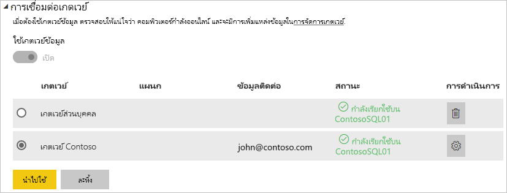

# จัดการแหล่งข้อมูลของคุณ - SQL ServerManage your data source - SQL Server

[!INCLUDE [gateway-rewrite](../includes/gateway-rewrite.md)]

หลังจากคุณ[ติดตั้งเกตเวย์ข้อมูลภายในองค์กรแล้ว](/data-integration/gateway/service-gateway-install) คุณสามารถ[เพิ่มแหล่งข้อมูล](service-gateway-data-sources.md#add-a-data-source)ที่สามารถใช้ได้กับเกตเวย์ดังกล่าวAfter you [install the on-premises data gateway](/data-integration/gateway/service-gateway-install), you can [add data sources](service-gateway-data-sources.md#add-a-data-source) that can be used with the gateway. บทความนี้จะดูวิธีการทำงานกับเกตเวย์และแหล่งข้อมูล SQL Server ที่ใช้สำหรับการรีเฟรชตามกำหนดการหรือสำหรับ DirectQueryThis article looks at how to work with gateways and SQL Server data sources that are used either for scheduled refresh or for DirectQuery.

## เพิ่มแหล่งข้อมูลAdd a data source

สำหรับข้อมูลเพิ่มเติมเกี่ยวกับวิธีการเพิ่มแหล่งข้อมูล ให้ดู[เพิ่มแหล่งข้อมูล](service-gateway-data-sources.md#add-a-data-source)For more information about how to add a data source, see [Add a data source](service-gateway-data-sources.md#add-a-data-source). ภายใต้ **ชนิดแหล่งข้อมูล** ให้เลือก **SQL Server**Under **Data Source Type**, select **SQL Server**.

> [!NOTE]
> เมื่อคุณใช้ DirectQuery เกตเวย์สนับสนุนเฉพาะ **SQL Server 2012 SP1** และเวอร์ชันถัดมาWhen you use DirectQuery, the gateway supports only **SQL Server 2012 SP1** and subsequent versions.

จากนั้นให้กรอกข้อมูลเกี่ยวกับแหล่งข้อมูล ซึ่งประกอบด้วย **เซิร์ฟเวอร์** และ **ฐานข้อมูล**Then fill in the information for the data source, which includes **Server** and **Database**. 

ภายใต้ **วิธีการรับรองความถูกต้อง** ให้เลือก **Windows** หรือ **พื้นฐาน**Under **Authentication Method**, choose either **Windows** or **Basic**. เลือก **พื้นฐาน** ถ้าคุณวางแผนที่จะใช้การรับรองความถูกต้องของ SQL แทนการรับรองความถูกต้องของ WindowsChoose **Basic** if you plan to use SQL authentication instead of Windows authentication. จากนั้นป้อนข้อมูลประจำตัวที่จะใช้สำหรับแหล่งข้อมูลนี้Then enter the credentials to be used for this data source.

> [!NOTE]
> คิวรีทั้งหมดที่ไปยังแหล่งข้อมูลจะทำงานโดยใช้ข้อมูลประจำตัวเหล่านี้ เว้นแต่ว่า single sign-on (SSO) ของ Kerberos จะถูกกำหนดค่าและเปิดใช้งานสำหรับแหล่งข้อมูลAll queries to the data source will run using these credentials, unless Kerberos single sign-on (SSO) is configured and enabled for the data source. SSO จะทำให้ชุดข้อมูลนำเข้าใช้ข้อมูลประจำตัวที่จัดเก็บไว้ แต่ชุดข้อมูล DirectQuery จะใช้ผู้ใช้ Power BI ปัจจุบันเพื่อดำเนินการคิวรีโดยใช้ SSOWith SSO, import datasets use the stored credentials, but DirectQuery datasets use the current Power BI user to execute the queries using SSO. หากต้องการเรียนรู้เพิ่มเติมเกี่ยวกับวิธีการจัดเก็บข้อมูลประจำตัว ให้ดู [การจัดเก็บข้อมูลประจำตัวที่เข้ารหัสไว้ในระบบคลาวด์](service-gateway-data-sources.md#store-encrypted-credentials-in-the-cloud)To learn more about how credentials are stored, see [Store encrypted credentials in the cloud](service-gateway-data-sources.md#store-encrypted-credentials-in-the-cloud). หรือดูบทความที่อธิบายวิธีการ [ใช้ Kerberos สำหรับ single sign-on (SSO) จาก Power BI ไปยังแหล่งข้อมูลภายในองค์กร](service-gateway-sso-kerberos.md)Or, see the article that describes how to [use Kerberos for single sign-on (SSO) from Power BI to on-premises data sources](service-gateway-sso-kerberos.md).

หลังจากที่คุณกรอกข้อมูลทุกอย่างแล้ว ให้เลือก **เพิ่ม**After you fill in everything, select **Add**. คุณสามารถใช้แหล่งข้อมูลนี้สำหรับการรีเฟรชตามกำหนดการหรือ DirectQuery เทียบกับ SQL Server ที่อยู่ภายในองค์กรได้You can now use this data source for scheduled refresh or DirectQuery against a SQL Server that's on-premises. คุณจะเห็น *การเชื่อมต่อสำเร็จ* หากการดำเนินการเสร็จสมบูรณ์แล้วYou see *Connection Successful* if it succeeded.

### การตั้งค่าขั้นสูงAdvanced settings

อีกทางหนึ่งคือคุณสามารถกำหนดค่าระดับความเป็นส่วนตัวให้กับแหล่งข้อมูลของคุณOptionally, you can configure the privacy level for your data source. การตั้งค่านี้จะช่วยควบคุมวิธีการรวมข้อมูลได้This setting controls how data can be combined. ซึ่งใช้ได้เฉพาะกับการรีเฟรชตามกำหนดการเท่านั้นIt's only used for scheduled refresh. การตั้งค่าระดับความเป็นส่วนตัวจะไม่นำไปใช้กับ DirectQueryThe privacy-level setting doesn't apply to DirectQuery. หากต้องการเรียนรู้เพิ่มเติมเกี่ยวกับระดับความเป็นส่วนตัวสำหรับแหล่งข้อมูลของคุณ ให้ดู [ระดับความเป็นส่วนตัว (Power Query)](https://support.office.com/article/Privacy-levels-Power-Query-CC3EDE4D-359E-4B28-BC72-9BEE7900B540)To learn more about privacy levels for your data source, see [Privacy levels (Power Query)](https://support.office.com/article/Privacy-levels-Power-Query-CC3EDE4D-359E-4B28-BC72-9BEE7900B540).

## ใช้แหล่งข้อมูลUse the data source

หลังจากที่คุณสร้างแหล่งข้อมูล รายการนี้จะพร้อมใช้งานเมื่อต้องใช้ทั้งกับการเชื่อมต่อ DirectQuery หรือการเชื่อมต่อสดผ่านการรีเฟรชตามกำหนดการAfter you create the data source, it's available to use with either DirectQuery connections or through scheduled refresh.

> [!NOTE]
> ชื่อเซิร์ฟเวอร์และชื่อฐานข้อมูลจะต้องตรงกับ Power BI Desktop และแหล่งข้อมูลภายในเกตเวย์ข้อมูลภายในองค์กรThe server and database names must match between Power BI Desktop and the data source within the on-premises data gateway.

การเชื่อมโยงระหว่างชุดข้อมูลของคุณและแหล่งข้อมูลภายในเกตเวย์จะเป็นไปตามชื่อเซิร์ฟเวอร์และชื่อฐานข้อมูลของคุณThe link between your dataset and the data source within the gateway is based on your server name and database name. ชื่อเหล่านี้ต้องตรงกันThese names must match. ตัวอย่างเช่น ถ้าคุณใส่ที่อยู่ IP สำหรับชื่อเซิร์ฟเวอร์ภายใน Power BI Desktop คุณต้องใช้ที่อยู่ IP สำหรับแหล่งข้อมูลภายในการกำหนดค่าเกตเวย์ด้วยเช่นกันFor example, if you supply an IP address for the server name within Power BI Desktop, you must use the IP address for the data source within the gateway configuration. ถ้าคุณใช้ *SERVER\INSTANCE* ใน Power BI Desktop คุณต้องใช้ภายในแหล่งข้อมูลที่กำหนดค่าไว้สำหรับเกตเวย์ดังกล่าวด้วยIf you use *SERVER\INSTANCE* in Power BI Desktop, you must use it within the data source configured for the gateway.

ข้อกำหนดนี้เป็นกรณีสำหรับทั้ง DirectQuery และการรีเฟรชตามกำหนดการThis requirement is the case for both DirectQuery and scheduled refresh.

### ใช้แหล่งข้อมูลที่มีการเชื่อมต่อกับ DirectQueryUse the data source with DirectQuery connections

ตรวจสอบให้แน่ใจว่าชื่อเซิร์ฟเวอร์และชื่อฐานข้อมูลตรงกันระหว่าง Power BI Desktop และแหล่งข้อมูลที่กำหนดค่าไว้สำหรับเกตเวย์Make sure that the server and database names match between Power BI Desktop and the configured data source for the gateway. คุณยังต้องตรวจสอบให้แน่ใจอีกว่า ผู้ใช้ของคุณแสดงอยู่ในแท็บ **ผู้ใช้** ของแหล่งข้อมูลเพื่อเผยแพร่ชุดข้อมูล DirectQueryYou also need to make sure your user is listed in the **Users** tab of the data source to publish DirectQuery datasets. ตัวเลือกสำหรับ DirectQuery จะเกิดขึ้นภายใน Power BI Desktop ตอนที่คุณนำเข้าข้อมูลครั้งแรกThe selection for DirectQuery occurs within Power BI Desktop when you first import data. สำหรับข้อมูลเพิ่มเติมเกี่ยวกับวิธีการใช้งาน DirectQuery โปรดดู [ใช้ DirectQuery ใน Power BI Desktop](desktop-use-directquery.md)For more information about how to use DirectQuery, see [Use DirectQuery in Power BI Desktop](desktop-use-directquery.md).

หลังจากที่คุณเผยแพร่ชุดข้อมูลจาก Power BI Desktop หรือ **รับข้อมูล** รายงานของคุณควรเริ่มการทำงานAfter you publish, either from Power BI Desktop or **Get Data**, your reports should start to work. ซึ่งอาจจะใช้เวลาหลายนาทีเพื่อให้การเชื่อมต่อสามารถใช้งานได้ หลังจากคุณสร้างแหล่งข้อมูลภายในเกตเวย์It might take several minutes after you create the data source within the gateway for the connection to be usable.

### ใช้แหล่งข้อมูลที่มีการรีเฟรชตามกำหนดการUse the data source with scheduled refresh

ถ้าคุณอยู่ในแท็บ **ผู้ใช้** ของแหล่งข้อมูลที่กำหนดค่าไว้ภายในเกตเวย์ และชื่อเซิร์ฟเวอร์และชื่อฐานข้อมูลตรงกัน คุณจะเห็นเกตเวย์เป็นตัวเลือกเพื่อใช้กับการรีเฟรชตามกำหนดการIf you're listed in the **Users** tab of the data source configured within the gateway and the server name and database name match, you see the gateway as an option to use with scheduled refresh.

## ขั้นตอนถัดไปNext steps

* [เชื่อมต่อกับข้อมูลภายในองค์กรใน SQL ServerConnect to on-premises data in SQL Server](service-gateway-sql-tutorial.md)
* [การแก้ไขปัญหาเกตเวย์ข้อมูลภายในองค์กรTroubleshooting the on-premises data gateway](/data-integration/gateway/service-gateway-tshoot)
* [แก้ไขปัญหาเกตเวย์-Power BITroubleshoot gateways - Power BI](service-gateway-onprem-tshoot.md)
* [ใช้ Kerberos สำหรับลงชื่อเข้าใช้ครั้งเดียว (SSO) จาก Power BI ไปยังแหล่งข้อมูลภายในองค์กรUse Kerberos for single sign-on (SSO) from Power BI to on-premises data sources](service-gateway-sso-kerberos.md)

มีคำถามเพิ่มเติมหรือไม่More questions? ลองถาม[ชุมชน Power BI](https://community.powerbi.com/)Try asking the [Power BI Community](https://community.powerbi.com/).
