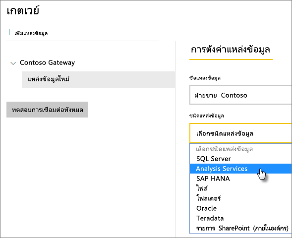
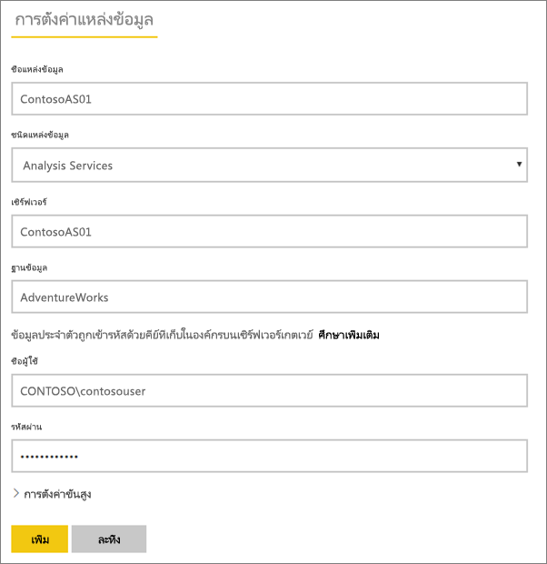
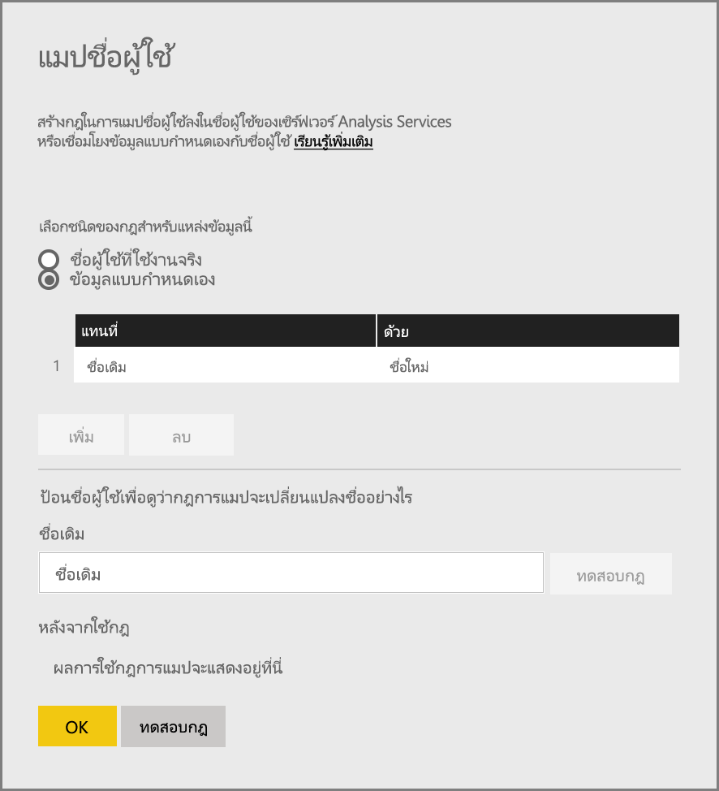
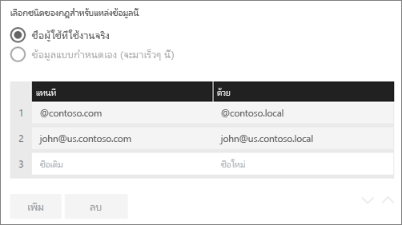
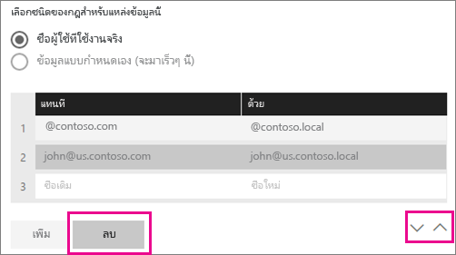
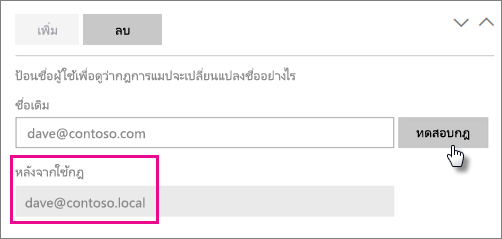
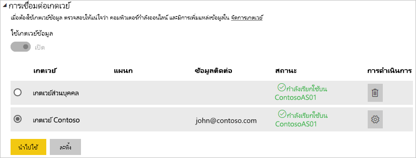

# <a name="manage-your-data-source---analysis-services"></a><span data-ttu-id="199cd-104">จัดการแหล่งข้อมูลของคุณ - Analysis Services</span><span class="sxs-lookup"><span data-stu-id="199cd-104">Manage your data source - Analysis Services</span></span>

[!INCLUDE [gateway-rewrite](../includes/gateway-rewrite.md)]

<span data-ttu-id="199cd-105">หลังจากคุณ[ติดตั้งเกตเวย์ข้อมูลภายในองค์กรแล้ว](/data-integration/gateway/service-gateway-install) คุณจะต้อง[เพิ่มแหล่งข้อมูล](service-gateway-data-sources.md#add-a-data-source)ที่สามารถใช้ได้กับเกตเวย์ดังกล่าว</span><span class="sxs-lookup"><span data-stu-id="199cd-105">After you [install the on-premises data gateway](/data-integration/gateway/service-gateway-install), you need to [add data sources](service-gateway-data-sources.md#add-a-data-source) that can be used with the gateway.</span></span> <span data-ttu-id="199cd-106">บทความนี้จะดูวิธีการทำงานกับเกตเวย์และแหล่งข้อมูล SQL Server Analysis Services (SSAS) ที่ใช้สำหรับการรีเฟรชตามกำหนดการหรือสำหรับการเชื่อมต่อสด</span><span class="sxs-lookup"><span data-stu-id="199cd-106">This article looks at how to work with gateways and SQL Server Analysis Services (SSAS) data sources that are used either for scheduled refresh or for live connections.</span></span>

<span data-ttu-id="199cd-107">หากต้องการเรียนรู้เพิ่มเติมเกี่ยวกับวิธีการตั้งค่าการเชื่อมต่อสดไปยัง Analysis Services [ดูวิดีโอนี้](https://www.youtube.com/watch?v=GPf0YS-Xbyo&feature=youtu.be)</span><span class="sxs-lookup"><span data-stu-id="199cd-107">To learn more about how to set up a live connection to Analysis Services, [watch this video](https://www.youtube.com/watch?v=GPf0YS-Xbyo&feature=youtu.be).</span></span>

> [!NOTE]
> <span data-ttu-id="199cd-108">ถ้าคุณมีแหล่งข้อมูล Analysis Services คุณจะต้องติดตั้งเกตเวย์บนคอมพิวเตอร์ที่เข้าร่วมฟอเรสต์/โดเมนเดียวกับเซิร์ฟเวอร์ Analysis Services ของคุณ</span><span class="sxs-lookup"><span data-stu-id="199cd-108">If you have an Analysis Services data source, you need to install the gateway on a computer joined to the same forest/domain as your Analysis Services server.</span></span>

## <a name="add-a-data-source"></a><span data-ttu-id="199cd-109">เพิ่มแหล่งข้อมูล</span><span class="sxs-lookup"><span data-stu-id="199cd-109">Add a data source</span></span>

<span data-ttu-id="199cd-110">สำหรับข้อมูลเกี่ยวกับวิธีการเพิ่มแหล่งข้อมูล ให้ดู[เพิ่มแหล่งข้อมูล](service-gateway-data-sources.md#add-a-data-source)</span><span class="sxs-lookup"><span data-stu-id="199cd-110">For information about how to add a data source, see [Add a data source](service-gateway-data-sources.md#add-a-data-source).</span></span> <span data-ttu-id="199cd-111">เลือก **Analysis Services** สำหรับ **ชนิดแหล่งข้อมูล** ถ้าคุณกำลังเชื่อมต่อกับเซิร์ฟเวอร์หลายมิติ หรือเซิร์ฟเวอร์แบบตาราง</span><span class="sxs-lookup"><span data-stu-id="199cd-111">Select **Analysis Services** for **Data Source Type** if you're connecting to either a multidimensional or tabular server.</span></span>



<span data-ttu-id="199cd-113">กรอกข้อมูลเกี่ยวกับแหล่งข้อมูล ซึ่งประกอบด้วย **เซิร์ฟเวอร์** และ **ฐานข้อมูล**</span><span class="sxs-lookup"><span data-stu-id="199cd-113">Fill in the information for the data source, which includes **Server** and **Database**.</span></span> <span data-ttu-id="199cd-114">ข้อมูลที่คุณป้อนสำหรับ **ชื่อผู้ใช้** และ **รหัสผ่าน** ถูกใช้โดยเกตเวย์เพื่อเชื่อมต่อกับอินสแตนซ์ Analysis Services</span><span class="sxs-lookup"><span data-stu-id="199cd-114">The information that you enter for **Username** and **Password** is used by the gateway to connect to the Analysis Services instance.</span></span>

> [!NOTE]
> <span data-ttu-id="199cd-115">บัญชี Windows ที่คุณป้อนจะต้องเป็นสมาชิกของผู้มีบทบาทผู้ดูแลระบบเซิร์ฟเวอร์บนอินสแตนซ์ Analysis Services ที่คุณกำลังเชื่อมต่ออยู่</span><span class="sxs-lookup"><span data-stu-id="199cd-115">The Windows account you enter must be a member of the Server Administrator role on the Analysis Services instance you're connecting to.</span></span> <span data-ttu-id="199cd-116">ถ้ารหัสผ่านของบัญชีนี้ถูกตั้งค่าให้หมดอายุ ผู้ใช้อาจจะเจอข้อผิดพลาดในการเชื่อมต่อหากไม่มีการอัปเดตรหัสผ่านสำหรับแหล่งข้อมูลนั้น ๆ</span><span class="sxs-lookup"><span data-stu-id="199cd-116">If this account’s password is set to expire, users could get a connection error if the password isn’t updated for the data source.</span></span> <span data-ttu-id="199cd-117">หากต้องการเรียนรู้เพิ่มเติมเกี่ยวกับวิธีการจัดเก็บข้อมูลประจำตัว ให้ดู [การจัดเก็บข้อมูลประจำตัวที่เข้ารหัสไว้ในระบบคลาวด์](service-gateway-data-sources.md#store-encrypted-credentials-in-the-cloud)</span><span class="sxs-lookup"><span data-stu-id="199cd-117">To learn more about how credentials are stored, see [Store encrypted credentials in the cloud](service-gateway-data-sources.md#store-encrypted-credentials-in-the-cloud).</span></span>



<span data-ttu-id="199cd-119">หลังจากที่คุณกรอกข้อมูลทุกอย่างแล้ว ให้เลือก **เพิ่ม**</span><span class="sxs-lookup"><span data-stu-id="199cd-119">After you fill in everything, select **Add**.</span></span> <span data-ttu-id="199cd-120">ในตอนนี้ คุณสามารถใช้แหล่งข้อมูลนี้ในการรีเฟรชตามกำหนดการ หรือ การเชื่อมต่อแบบสดกับอินสแตนซ์ Analysis Services ที่อยู่ภายในองค์กรแล้ว</span><span class="sxs-lookup"><span data-stu-id="199cd-120">You can now use this data source for scheduled refresh or live connections against an Analysis Services instance that's on-premises.</span></span> <span data-ttu-id="199cd-121">คุณจะเห็น *การเชื่อมต่อสำเร็จ* หากการดำเนินการเสร็จสมบูรณ์แล้ว</span><span class="sxs-lookup"><span data-stu-id="199cd-121">You see *Connection Successful* if it succeeded.</span></span>


### <a name="advanced-settings"></a><span data-ttu-id="199cd-123">การตั้งค่าขั้นสูง</span><span class="sxs-lookup"><span data-stu-id="199cd-123">Advanced settings</span></span>

<span data-ttu-id="199cd-124">อีกทางหนึ่งคือคุณสามารถกำหนดค่าระดับความเป็นส่วนตัวให้กับแหล่งข้อมูลของคุณ</span><span class="sxs-lookup"><span data-stu-id="199cd-124">Optionally, you can configure the privacy level for your data source.</span></span> <span data-ttu-id="199cd-125">การตั้งค่านี้จะช่วยควบคุมวิธีการรวมข้อมูลได้</span><span class="sxs-lookup"><span data-stu-id="199cd-125">This setting controls how data can be combined.</span></span> <span data-ttu-id="199cd-126">ซึ่งใช้ได้เฉพาะกับการรีเฟรชตามกำหนดการเท่านั้น</span><span class="sxs-lookup"><span data-stu-id="199cd-126">It's only used for scheduled refresh.</span></span> <span data-ttu-id="199cd-127">การตั้งค่าระดับความเป็นส่วนตัวจะไม่นำไปใช้กับการเชื่อมต่อแบบสด</span><span class="sxs-lookup"><span data-stu-id="199cd-127">The privacy-level setting doesn't apply to live connections.</span></span> <span data-ttu-id="199cd-128">หากต้องการเรียนรู้เพิ่มเติมเกี่ยวกับระดับความเป็นส่วนตัวสำหรับแหล่งข้อมูลของคุณ ให้ดู [ระดับความเป็นส่วนตัว (Power Query)](https://support.office.com/article/Privacy-levels-Power-Query-CC3EDE4D-359E-4B28-BC72-9BEE7900B540)</span><span class="sxs-lookup"><span data-stu-id="199cd-128">To learn more about privacy levels for your data source, see [Privacy levels (Power Query)](https://support.office.com/article/Privacy-levels-Power-Query-CC3EDE4D-359E-4B28-BC72-9BEE7900B540).</span></span>


## <a name="user-names-with-analysis-services"></a><span data-ttu-id="199cd-130">ชื่อผู้ใช้ที่มี Analysis Services</span><span class="sxs-lookup"><span data-stu-id="199cd-130">User names with Analysis Services</span></span>

<iframe width="560" height="315" src="https://www.youtube.com/embed/Qb5EEjkHoLg" frameborder="0" allowfullscreen></iframe>

<span data-ttu-id="199cd-131">แต่ละครั้งที่ผู้ใช้โต้ตอบกับรายงานที่เชื่อมต่อกับ Analysis Services ชื่อผู้ใช้ที่มีผลบังคับใช้ถูกส่งผ่านไปยังเกตเวย์ แล้วส่งต่อไปยังเซิร์ฟเวอร์ Analysis Services ภายในองค์กรของคุณ</span><span class="sxs-lookup"><span data-stu-id="199cd-131">Each time a user interacts with a report connected to Analysis Services, the effective user name is passed to the gateway and then passed on to your on-premises Analysis Services server.</span></span> <span data-ttu-id="199cd-132">ที่อยู่อีเมลที่คุณนำมาลงชื่อเข้าใช้กับ Power BI จะถูกส่งผ่านไปยัง Analysis Services ในฐานะที่เป็นผู้ใช้ที่มีผลบังคับใช้</span><span class="sxs-lookup"><span data-stu-id="199cd-132">The email address that you use to sign in to Power BI is passed to Analysis Services as the effective user.</span></span> <span data-ttu-id="199cd-133">ซึ่งจะถูกส่งผ่านในคุณสมบัติการเชื่อมต่อ [EffectiveUserName](/analysis-services/instances/connection-string-properties-analysis-services#bkmk_auth)</span><span class="sxs-lookup"><span data-stu-id="199cd-133">It's passed in the connection property [EffectiveUserName](/analysis-services/instances/connection-string-properties-analysis-services#bkmk_auth).</span></span> 

<span data-ttu-id="199cd-134">ที่อยู่อีเมลนี้ต้องตรงกับชื่อหลักของผู้ใช้ (UPN) ที่กำหนดไว้ภายในโดเมน Active Directory ภายในเครื่อง</span><span class="sxs-lookup"><span data-stu-id="199cd-134">The email address must match a defined user principal name (UPN) within the local Active Directory domain.</span></span> <span data-ttu-id="199cd-135">UPN เป็นคุณสมบัติของบัญชีผู้ใช้ Active Directory</span><span class="sxs-lookup"><span data-stu-id="199cd-135">The UPN is a property of an Active Directory account.</span></span> <span data-ttu-id="199cd-136">บัญชีผู้ใช้ Windows นั้นจึงต้องมีอยู่ในบทบาท Analysis Services</span><span class="sxs-lookup"><span data-stu-id="199cd-136">The Windows account must be present in an Analysis Services role.</span></span> <span data-ttu-id="199cd-137">ถ้าหาค่าตรงกันไม่พบใน Active Directory การเข้าสู่ระบบจะไม่ประสบความสำเร็จ</span><span class="sxs-lookup"><span data-stu-id="199cd-137">If a match can't be found in Active Directory, the sign-in isn't successful.</span></span> <span data-ttu-id="199cd-138">หากต้องการเรียนรู้เพิ่มเติมเกี่ยวกับ Active Directory และการตั้งชื่อผู้ใช้ ให้ดู [แอตทริบิวต์การตั้งชื่อผู้ใช้](/windows/win32/ad/naming-properties)</span><span class="sxs-lookup"><span data-stu-id="199cd-138">To learn more about Active Directory and user naming, see [User naming attributes](/windows/win32/ad/naming-properties).</span></span>

<span data-ttu-id="199cd-139">คุณยังสามารถ[แมปชื่อที่ใช้ในการลงชื่อเข้าใช้ใน Power BI กับไดเรกทอรีภายในเครื่อง UPN ได้ด้วย](service-gateway-enterprise-manage-ssas.md#map-user-names-for-analysis-services-data-sources)</span><span class="sxs-lookup"><span data-stu-id="199cd-139">You can also [map your Power BI sign-in name with a local directory UPN](service-gateway-enterprise-manage-ssas.md#map-user-names-for-analysis-services-data-sources).</span></span>

## <a name="map-user-names-for-analysis-services-data-sources"></a><span data-ttu-id="199cd-140">การแมปชื่อผู้ใช้สำหรับแหล่งข้อมูล Analysis Services</span><span class="sxs-lookup"><span data-stu-id="199cd-140">Map user names for Analysis Services data sources</span></span>

<iframe width="560" height="315" src="https://www.youtube.com/embed/eATPS-c7YRU" frameborder="0" allowfullscreen></iframe>

<span data-ttu-id="199cd-141">Power BI อนุญาตสำหรับการแมปชื่อผู้ใช้สำหรับแหล่งข้อมูล Analysis Services</span><span class="sxs-lookup"><span data-stu-id="199cd-141">Power BI allows for mapping user names for Analysis Services data sources.</span></span> <span data-ttu-id="199cd-142">คุณสามารถกำหนดค่ากฎการแมปชื่อผู้ใช้ที่ลงชื่อเข้าสู่ระบบด้วย Power BI เป็นชื่อที่ถูกส่งผ่านสำหรับ EffectiveUserName บนการเชื่อมต่อ Analysis Services ได้</span><span class="sxs-lookup"><span data-stu-id="199cd-142">You can configure rules to map a user name signed in with Power BI to a name that's passed for EffectiveUserName on the Analysis Services connection.</span></span> <span data-ttu-id="199cd-143">คุณลักษณะการแมปชื่อผู้ใช้เป็นวิธีที่ยอดเยี่ยมในการแก้ไขปัญหาเมื่อชื่อผู้ใช้ของคุณใน Azure Active Directory (Azure AD) ไม่ตรงกับ UPN ในอินสแตนซ์ Active Directory ภายในเครื่องของคุณ</span><span class="sxs-lookup"><span data-stu-id="199cd-143">The map user names feature is a great way to work around when your user name in Azure Active Directory (Azure AD) doesn't match a UPN in your local Active Directory instance.</span></span> <span data-ttu-id="199cd-144">ตัวอย่างเช่น ถ้าที่อยู่อีเมลของคุณคือnancy@contoso.onmicrsoft.com คุณสามารถแมปเข้ากับnancy@contoso.com และค่านั้นจะถูกส่งผ่านไปยังเกตเวย์</span><span class="sxs-lookup"><span data-stu-id="199cd-144">For example, if your email address is nancy@contoso.onmicrsoft.com, you map it to nancy@contoso.com and that value is passed to the gateway.</span></span>

<span data-ttu-id="199cd-145">คุณสามารถแมปชื่อผู้ใช้สำหรับ Analysis Services ได้สองวิธี:</span><span class="sxs-lookup"><span data-stu-id="199cd-145">You can map user names for Analysis Services in two different ways:</span></span>

* <span data-ttu-id="199cd-146">แมปผู้ใช้ด้วยตนเองอีกครั้ง</span><span class="sxs-lookup"><span data-stu-id="199cd-146">Manual user remapping</span></span>
* <span data-ttu-id="199cd-147">ใช้การค้นหา (Lookup) คุณสมบัติใน Active Directory ภายในองค์กรเพื่อแมป Azure AD UPNs ไปยังผู้ใช้ Active Directory (การแมปแบบค้นหาบน Active Directory) ใหม่อีกครั้ง</span><span class="sxs-lookup"><span data-stu-id="199cd-147">On-premises Active Directory property lookup to remap Azure AD UPNs to Active Directory users (Active Directory lookup mapping)</span></span>

<span data-ttu-id="199cd-148">ซึ่งเป็นไปได้ที่จะทำการแมปด้วยตนเองโดยใช้วิธีที่สอง แต่การทำเช่นนั้นจะใช้เวลานานและยากต่อการบำรุงรักษา</span><span class="sxs-lookup"><span data-stu-id="199cd-148">It's possible to perform manual mapping by using the second approach, but doing so is time consuming and difficult to maintain.</span></span> <span data-ttu-id="199cd-149">เป็นเรื่องยากโดยเฉพาะอย่างยิ่งเมื่อการจับคู่รูปแบบไม่เหมาะสม</span><span class="sxs-lookup"><span data-stu-id="199cd-149">It's especially difficult when pattern matching doesn't suffice.</span></span> <span data-ttu-id="199cd-150">ตัวอย่างคือเมื่อชื่อโดเมนแตกต่างกันระหว่าง Azure AD และ Active Directory ภายในองค์กรหรือเมื่อชื่อบัญชีผู้ใช้แตกต่างกันระหว่าง Azure AD และ Active Directory</span><span class="sxs-lookup"><span data-stu-id="199cd-150">Examples are when domain names are different between Azure AD and on-premises Active Directory or when user account names are different between Azure AD and Active Directory.</span></span> <span data-ttu-id="199cd-151">นั่นเป็นเหตุผลที่ไม่แนะนำให้ทำการแมปด้วยตนเองด้วยวิธีที่สอง</span><span class="sxs-lookup"><span data-stu-id="199cd-151">That's why manual mapping with the second approach isn't recommended.</span></span>

<span data-ttu-id="199cd-152">เราอธิบายวิธีการสองแบบนี้ไว้ในสองหัวข้อด้านล่างตามลำดับ</span><span class="sxs-lookup"><span data-stu-id="199cd-152">We describe these two approaches, in order, in the following two sections.</span></span>

### <a name="manual-user-name-remapping"></a><span data-ttu-id="199cd-153">แมปผู้ใช้ด้วยตนเองอีกครั้ง</span><span class="sxs-lookup"><span data-stu-id="199cd-153">Manual user name remapping</span></span>

<span data-ttu-id="199cd-154">สำหรับแหล่งข้อมูล Analysis Services คุณสามารถกำหนดค่ากฎต่าง ๆ ของ UPN แบบกำหนดเอง</span><span class="sxs-lookup"><span data-stu-id="199cd-154">For Analysis Services data sources, you can configure custom UPN rules.</span></span> <span data-ttu-id="199cd-155">กฎแบบกำหนดเองจะช่วยให้คุณถ้าชื่อที่ใช้ในการเข้าสู่ระบบบริการของ Power BI ไม่ตรงกับไดเรกทอรีภายในเครื่อง UPN</span><span class="sxs-lookup"><span data-stu-id="199cd-155">Custom rules help you if your Power BI service sign-in names don't match your local directory UPN.</span></span> <span data-ttu-id="199cd-156">ตัวอย่างเช่น ถ้าคุณลงชื่อเข้าสู่ Power BI ด้วยjohn@contoso.comแต่ไดเรกทอรี UPN ภายในเครื่องของคุณคือjohn@contoso.localคุณสามารถกำหนดค่ากฎการแมปให้john@contoso.localส่งผ่านไปยัง Analysis Services ได้</span><span class="sxs-lookup"><span data-stu-id="199cd-156">For example, if you sign in to Power BI with john@contoso.com but your local directory UPN is john@contoso.local, you can configure a mapping rule to have john@contoso.local passed to Analysis Services.</span></span>

<span data-ttu-id="199cd-157">หากต้องการไปที่หน้าจอการแมป UPN ให้ทำตามขั้นตอนเหล่านี้</span><span class="sxs-lookup"><span data-stu-id="199cd-157">To get to the UPN mapping screen, follow these steps.</span></span>

1. <span data-ttu-id="199cd-158">ไปไอคอนรูปเฟือง และเลือก **จัดการเกตเวย์**</span><span class="sxs-lookup"><span data-stu-id="199cd-158">Go to the gear icon, and select **Manage Gateways**.</span></span>
2. <span data-ttu-id="199cd-159">ขยายเกตเวย์ที่ประกอบด้วยแหล่งข้อมูล Analysis Services</span><span class="sxs-lookup"><span data-stu-id="199cd-159">Expand the gateway that contains the Analysis Services data source.</span></span> <span data-ttu-id="199cd-160">หรือ ถ้าคุณยังไม่ได้สร้างแหล่งข้อมูล Analysis Services ใด ๆ คุณจะสามารถทำได้ในขั้นตอนนี้</span><span class="sxs-lookup"><span data-stu-id="199cd-160">Or, if you haven't created the Analysis Services data source, you can do that at this point.</span></span>
3. <span data-ttu-id="199cd-161">เลือกแหล่งข้อมูล จากนั้นเลือกแท็บ **ผู้ใช้**</span><span class="sxs-lookup"><span data-stu-id="199cd-161">Select the data source, and then select the **Users** tab.</span></span>
4. <span data-ttu-id="199cd-162">เลือก **แมปชื่อผู้ใช้**</span><span class="sxs-lookup"><span data-stu-id="199cd-162">Select **Map user names**.</span></span>

    

<span data-ttu-id="199cd-164">คุณจะเห็นตัวเลือกให้เพิ่มกฎ และทดสอบสำหรับผู้ใช้ที่กำหนด</span><span class="sxs-lookup"><span data-stu-id="199cd-164">You see options to add rules and test for a given user.</span></span>

> [!NOTE]
> <span data-ttu-id="199cd-165">คุณอาจเปลี่ยนผู้ใช้ที่คุณไม่ต้องการเปลี่ยน</span><span class="sxs-lookup"><span data-stu-id="199cd-165">You might change a user that you didn't intend to change.</span></span> <span data-ttu-id="199cd-166">ตัวอย่างเช่นถ้า **แทนที่ (ค่าเดิม)** เป็น contoso.com และ **ด้วย (ชื่อใหม่)** คือ @contoso.local ผู้ใช้ทั้งหมดที่ลงชื่อเข้าใช้ที่มี @contoso.com จะถูกแทนที่ด้วย @contoso.local</span><span class="sxs-lookup"><span data-stu-id="199cd-166">For example, if **Replace (original value)** is contoso.com and **With (New name)** is @contoso.local, all users with a sign-in that contains @contoso.com are then replaced with @contoso.local.</span></span> <span data-ttu-id="199cd-167">นอกจากนี้หาก **แทนที่ (ชื่อดั้งเดิม)** คือ dave@contoso.com และ **ด้วย (ชื่อใหม่)** คือ dave@contoso.local ผู้ใช้ที่มีการลงชื่อเข้าใช้ v-dave@contoso.com จะถูกส่งเป็น v-dave@contoso.local</span><span class="sxs-lookup"><span data-stu-id="199cd-167">Also, if **Replace (Original name)** is dave@contoso.com and **With (New name)** is dave@contoso.local, a user with the sign-in of v-dave@contoso.com is sent as v-dave@contoso.local.</span></span>

### <a name="active-directory-lookup-mapping"></a><span data-ttu-id="199cd-168">การแมปแบบค้นหาใน Active Directory</span><span class="sxs-lookup"><span data-stu-id="199cd-168">Active Directory lookup mapping</span></span>

<span data-ttu-id="199cd-169">เพื่อทำการค้นหาคุณสมบัติ Active Directory ในองค์กรเพื่อแมป Azure AD UPNs กับผู้ใช้ Active Directory ใหม่อีกครั้ง ให้ทำตามขั้นตอนในส่วนนี้</span><span class="sxs-lookup"><span data-stu-id="199cd-169">To perform on-premises Active Directory property lookup to remap Azure AD UPNs to Active Directory users, follow the steps in this section.</span></span> <span data-ttu-id="199cd-170">เริ่มแรก มาตรวจสอบวิธีการทำงานกัน</span><span class="sxs-lookup"><span data-stu-id="199cd-170">To begin with, let's review how this works.</span></span>

<span data-ttu-id="199cd-171">ในบริการ Power BI มีสิ่งต่อไปนี้เกิดขึ้น:</span><span class="sxs-lookup"><span data-stu-id="199cd-171">In the Power BI service, the following occurs:</span></span>

* <span data-ttu-id="199cd-172">สำหรับแต่ละคิวรีโดยผู้ใช้ Power BI Azure AD ไปยังเซิร์ฟเวอร์ SSAS ภายในองค์กร สตริง UPN จะถูกส่งผ่านตามไปด้วย เช่น:      firstName.lastName@contoso.com</span><span class="sxs-lookup"><span data-stu-id="199cd-172">For each query by a Power BI Azure AD user to an on-premises SSAS server, a UPN string is passed along, such as      firstName.lastName@contoso.com.</span></span>

> [!NOTE]
> <span data-ttu-id="199cd-173">การแมปผู้ใช้ UPN แบบกำหนดเองใดก็ตามที่ระบุอยู่ในกำหนดค่าแหล่งข้อมูล Power BI จะยังคงใช้ถูกนำมาใช้ *ก่อน* ที่จะส่งสตริงชื่อผู้ใช้ไปยังเกตเวย์ข้อมูลภายในองค์กร</span><span class="sxs-lookup"><span data-stu-id="199cd-173">Any manual UPN user mappings defined in the Power BI data source configuration are still applied *before* the user name string is sent to the on-premises data gateway.</span></span>

<span data-ttu-id="199cd-174">บนเกตเวย์ข้อมูลภายในองค์กรที่มีการแมปผู้ใช้แบบกำหนดเองที่สามารถกำหนดค่าได้ ให้ทำตามขั้นตอนเหล่านี้:</span><span class="sxs-lookup"><span data-stu-id="199cd-174">In the on-premises data gateway with configurable custom user mapping, follow these steps.</span></span>

1. <span data-ttu-id="199cd-175">หา Active Directory เพื่อค้นหา</span><span class="sxs-lookup"><span data-stu-id="199cd-175">Find Active Directory to search.</span></span> <span data-ttu-id="199cd-176">คุณสามารถใช้แบบอัตโนมัติหรือแบบกำหนดค่าได้</span><span class="sxs-lookup"><span data-stu-id="199cd-176">You can use automatic or configurable.</span></span>
2. <span data-ttu-id="199cd-177">ค้นหาแอตทริบิวต์ของบุคคลใน Active Directory เช่น อีเมล จากบริการ Power BI</span><span class="sxs-lookup"><span data-stu-id="199cd-177">Look up the attribute of the Active Directory person, such as Email, from the Power BI service.</span></span> <span data-ttu-id="199cd-178">แอตทริบิวต์จะขึ้นอยู่กับสตริง UPN ที่เข้ามา เช่น firstName.lastName@contoso.com</span><span class="sxs-lookup"><span data-stu-id="199cd-178">The attribute is based on an incoming UPN string like firstName.lastName@contoso.com.</span></span>
3. <span data-ttu-id="199cd-179">ถ้าการค้นหา Active Directory ล้มเหลว ระบบจะพยายามใช้ UPN ผ่านตามเป็น EffectiveUser เพื่อ SSAS</span><span class="sxs-lookup"><span data-stu-id="199cd-179">If the Active Directory lookup fails, it attempts to use the passed-along UPN as EffectiveUser to SSAS.</span></span>
4. <span data-ttu-id="199cd-180">ถ้าการค้นหาใน Active Directory ประสบความสำเร็จ ระบบจะดึงค่า UserPrincipalName ของบุคคลใน Active Directory ดังกล่าว</span><span class="sxs-lookup"><span data-stu-id="199cd-180">If the Active Directory lookup succeeds, it retrieves UserPrincipalName of that Active Directory person.</span></span>
5. <span data-ttu-id="199cd-181">ระบบจะส่งผ่านอีเมล UserPrincipalName เป็น EffectiveUser ไปยัง SSAS เช่น Alias@corp.on-prem.contoso</span><span class="sxs-lookup"><span data-stu-id="199cd-181">It passes the UserPrincipalName email as EffectiveUser to SSAS, such as Alias@corp.on-prem.contoso.</span></span>

<span data-ttu-id="199cd-182">วิธีการกำหนดค่าเกตเวย์ของคุณเพื่อดำเนินการค้นหาใน Active Directory:</span><span class="sxs-lookup"><span data-stu-id="199cd-182">To configure your gateway to perform the Active Directory lookup:</span></span>

1. <span data-ttu-id="199cd-183">[ดาวน์โหลดและติดตั้งเกตเวย์ล่าสุด](/data-integration/gateway/service-gateway-install)</span><span class="sxs-lookup"><span data-stu-id="199cd-183">[Download and install the latest gateway](/data-integration/gateway/service-gateway-install).</span></span>

2. <span data-ttu-id="199cd-184">ในเกตเวย์ ให้เปลี่ยนบริการเกตเวย์ข้อมูลภายในองค์กรเพื่อเรียกใช้ด้วยบัญชีโดเมนแทนบัญชีบริการภายในเครื่อง</span><span class="sxs-lookup"><span data-stu-id="199cd-184">In the gateway, change the on-premises data gateway service to run with a domain account instead of a local service account.</span></span> <span data-ttu-id="199cd-185">มิฉะนั้นการค้นหาใน Active Directory จะไม่สามารถทำงานได้อย่างถูกต้องในขณะใช้งานจริง</span><span class="sxs-lookup"><span data-stu-id="199cd-185">Otherwise, the Active Directory lookup won’t work properly at runtime.</span></span> <span data-ttu-id="199cd-186">ไปที่ [แอปเกตเวย์ข้อมูลภายในองค์กร](/data-integration/gateway/service-gateway-app)บนเครื่องของคุณ จากนั้นไปที่ **การตั้งค่าบริการ** > **เปลี่ยนบัญชีบริการ**</span><span class="sxs-lookup"><span data-stu-id="199cd-186">Go to the [on-premises data gateway app](/data-integration/gateway/service-gateway-app) on your machine, and then go to **Service settings** > **Change service account**.</span></span> <span data-ttu-id="199cd-187">ตรวจสอบให้แน่ใจว่า คุณมีรหัสสำหรับการกู้คืนของเกตเวย์นี้อยู่ เนื่องจากคุณจะต้องทำการคืนค่าบนเครื่องเดียวกัน เว้นแต่ว่าคุณต้องการสร้างเกตเวย์ใหม่แทน</span><span class="sxs-lookup"><span data-stu-id="199cd-187">Make sure you have the recovery key for this gateway because you need to restore it on the same machine unless you want to create a new gateway instead.</span></span> <span data-ttu-id="199cd-188">ปิดและเปิดบริการเกตเวย์ใหม่เพื่อให้การเปลี่ยนแปลงมีผล</span><span class="sxs-lookup"><span data-stu-id="199cd-188">Restart the gateway service for the change to take effect.</span></span>

3. <span data-ttu-id="199cd-189">ไปยังโฟลเดอร์การติดตั้งของเกตเวย์ เกตเวย์ข้อมูล *C:\Program Files\On-premises* ในฐานะผู้ดูแลระบบเพื่อให้แน่ใจว่าคุณมีสิทธิ์เขียนไฟล์</span><span class="sxs-lookup"><span data-stu-id="199cd-189">Go to the gateway’s installation folder, *C:\Program Files\On-premises* data gateway, as an administrator to ensure that you have write permissions.</span></span> <span data-ttu-id="199cd-190">เปิดไฟล์ *Microsoft.PowerBI.DataMovement.Pipeline.GatewayCore.dll.config*.</span><span class="sxs-lookup"><span data-stu-id="199cd-190">Open the *Microsoft.PowerBI.DataMovement.Pipeline.GatewayCore.dll.config* file.</span></span>

4. <span data-ttu-id="199cd-191">แก้ไขการกำหนดค่าสองค่าต่อไปนี้ตามการกำหนดค่าแอตทริบิวต์ Active Directory *ของคุณ* สำหรับผู้ใช้ Active Directory ของคุณ</span><span class="sxs-lookup"><span data-stu-id="199cd-191">Edit the following two configuration values according to *your* Active Directory attribute configurations for your Active Directory users.</span></span> <span data-ttu-id="199cd-192">ค่าการกำหนดค่าต่อไปนี้คือตัวอย่าง</span><span class="sxs-lookup"><span data-stu-id="199cd-192">The following configuration values are examples.</span></span> <span data-ttu-id="199cd-193">ระบุค่าตามการกำหนดค่า Active Directory ของคุณ</span><span class="sxs-lookup"><span data-stu-id="199cd-193">Specify the values based on your Active Directory configuration.</span></span> <span data-ttu-id="199cd-194">การกำหนดค่าเหล่านี้คำนึงถึงตัวพิมพ์ใหญ่-เล็ก ดังนั้นตรวจสอบให้แน่ใจว่าตรงกับค่าใน Active Directory</span><span class="sxs-lookup"><span data-stu-id="199cd-194">These configurations are case sensitive, so make sure they match the values in Active Directory.</span></span>

    

    <span data-ttu-id="199cd-196">หากไม่มีการระบุค่าสำหรับการกำหนดค่า ADServerPath เกตเวย์จะใช้แค็ตตาล็อกส่วนกลางเป็นค่าเริ่มต้น</span><span class="sxs-lookup"><span data-stu-id="199cd-196">If no value is provided for the ADServerPath configuration, the gateway uses the default global catalog.</span></span> <span data-ttu-id="199cd-197">คุณยังสามารถระบุค่าหลายค่าสำหรับ ADServerPath ได้</span><span class="sxs-lookup"><span data-stu-id="199cd-197">You can also specify multiple values for the ADServerPath.</span></span> <span data-ttu-id="199cd-198">แต่ละค่าต้องคั่นด้วยเครื่องหมายอัฒภาค ตามที่แสดงในตัวอย่างต่อไปนี้:</span><span class="sxs-lookup"><span data-stu-id="199cd-198">Each value must be separated by a semicolon, as shown in the following example:</span></span>

    ```xml
    <setting name="ADServerPath" serializeAs="String">
        <value> >GC://serverpath1; GC://serverpath2;GC://serverpath3</value>
    </setting>
    ```

    <span data-ttu-id="199cd-199">เกตเวย์แยกวิเคราะห์ค่าสำหรับ ADServerPath จากซ้ายไปขวาจนกว่าจะพบรายการตรงกัน</span><span class="sxs-lookup"><span data-stu-id="199cd-199">The gateway parses the values for ADServerPath from left to right until it finds a match.</span></span> <span data-ttu-id="199cd-200">หากไม่พบคู่ที่ตรงกัน ระบบจะใช้ UPN ดั้งเดิม</span><span class="sxs-lookup"><span data-stu-id="199cd-200">If no match is found, the original UPN is used.</span></span> <span data-ttu-id="199cd-201">ตรวจสอบให้แน่ใจว่าบัญชีที่เรียกใช้บริการเกตเวย์ (PBIEgwService) มีสิทธิ์คิวรีไปยังเซิร์ฟเวอร์ Active Directory ทั้งหมดที่คุณระบุใน ADServerPath</span><span class="sxs-lookup"><span data-stu-id="199cd-201">Make sure the account that runs the gateway service (PBIEgwService) has query permissions to all Active Directory servers that you specify in ADServerPath.</span></span>

    <span data-ttu-id="199cd-202">เกตเวย์สนับสนุน ADServerPath สองชนิด ดังที่แสดงในตัวอย่างต่อไปนี้:</span><span class="sxs-lookup"><span data-stu-id="199cd-202">The gateway supports two types of ADServerPath, as shown in the following examples:</span></span>

    <span data-ttu-id="199cd-203">**WinNT**</span><span class="sxs-lookup"><span data-stu-id="199cd-203">**WinNT**</span></span>

    ```xml
    <value="WinNT://usa.domain.corp.contoso.com,computer"/>
    ```

    <span data-ttu-id="199cd-204">**GC**</span><span class="sxs-lookup"><span data-stu-id="199cd-204">**GC**</span></span>

    ```xml
    <value> GC://USA.domain.com </value>
    ```

5. <span data-ttu-id="199cd-205">เปิดและปิดบริการเกตเวย์ข้อมูลภายในองค์กรใหม่อีกครั้งเพื่อให้การเปลี่ยนแปลงการกำหนดค่ามีผล</span><span class="sxs-lookup"><span data-stu-id="199cd-205">Restart the on-premises data gateway service for the configuration change to take effect.</span></span>

### <a name="work-with-mapping-rules"></a><span data-ttu-id="199cd-206">ทำงานกับกฎการแมป</span><span class="sxs-lookup"><span data-stu-id="199cd-206">Work with mapping rules</span></span>

<span data-ttu-id="199cd-207">เมื่อต้องสร้างกฎการแมป ใส่ค่าสำหรับ **ชื่อเดิม** และ **ชื่อใหม่** แล้ว เลือก **เพิ่ม**</span><span class="sxs-lookup"><span data-stu-id="199cd-207">To create a mapping rule, enter a value for **Original name** and **New name** and then select **Add**.</span></span>

| <span data-ttu-id="199cd-208">ฟิลด์</span><span class="sxs-lookup"><span data-stu-id="199cd-208">Field</span></span> | <span data-ttu-id="199cd-209">คำอธิบาย</span><span class="sxs-lookup"><span data-stu-id="199cd-209">Description</span></span> |
| --- | --- |
| <span data-ttu-id="199cd-210">แทน (ชื่อเดิม)</span><span class="sxs-lookup"><span data-stu-id="199cd-210">Replace (Original name)</span></span> |<span data-ttu-id="199cd-211">ที่อยู่อีเมลที่คุณใช้ลงชื่อเข้าใช้ Power BI</span><span class="sxs-lookup"><span data-stu-id="199cd-211">The email address that you used to sign in to Power BI.</span></span> |
| <span data-ttu-id="199cd-212">ด้วย (ชื่อใหม่)</span><span class="sxs-lookup"><span data-stu-id="199cd-212">With (New name)</span></span> |<span data-ttu-id="199cd-213">ค่าที่คุณต้องการนำมาแทนที่</span><span class="sxs-lookup"><span data-stu-id="199cd-213">The value you want to replace it with.</span></span> <span data-ttu-id="199cd-214">ผลลัพธ์ของการแทนที่คือสิ่งที่ถูกส่งไปยังคุณสมบัติ EffectiveUserName สำหรับการเชื่อมต่อ Analysis Services</span><span class="sxs-lookup"><span data-stu-id="199cd-214">The result of the replacement is what is passed to the EffectiveUserName property for the Analysis Services connection.</span></span> |



<span data-ttu-id="199cd-216">เมื่อคุณเลือกสิ่งของในรายการ คุณสามารถเลือกที่จะเรียงลำดับใหม่ได้ โดยใช้ไอคอนรูปบั้ง</span><span class="sxs-lookup"><span data-stu-id="199cd-216">When you select an item in the list, you can choose to reorder it by using the chevron icons.</span></span> <span data-ttu-id="199cd-217">หรือคุณสามารถลบรายการได้</span><span class="sxs-lookup"><span data-stu-id="199cd-217">Or, you can delete the entry.</span></span>



### <a name="use-a-wildcard"></a><span data-ttu-id="199cd-219">ใช้สัญลักษณ์ตัวแทน</span><span class="sxs-lookup"><span data-stu-id="199cd-219">Use a wildcard</span></span>

<span data-ttu-id="199cd-220">คุณสามารถใช้สัญลักษณ์ตัวแทน (\*) สำหรับสตริง **แทน (ชื่อเดิม)** ของคุณได้</span><span class="sxs-lookup"><span data-stu-id="199cd-220">You can use a wildcard (\*) for your **Replace (Original name)** string.</span></span> <span data-ttu-id="199cd-221">ซึ่งอักขระนี้สามารถใช้เดี่ยว ๆ ได้ด้วยตัวมันเอง และไม่ใช้กับส่วนอื่นใด ๆ ของสตริง</span><span class="sxs-lookup"><span data-stu-id="199cd-221">It can only be used on its own and not with any other string part.</span></span> <span data-ttu-id="199cd-222">ใช้สัญลักษณ์ตัวแทนถ้าคุณต้องการนำผู้ใช้ทั้งหมด และส่งค่าเดียวไปยังแหล่งข้อมูล</span><span class="sxs-lookup"><span data-stu-id="199cd-222">Use a wildcard if you want to take all users and pass a single value to the data source.</span></span> <span data-ttu-id="199cd-223">วิธีการนี้มีประโยชน์เมื่อคุณต้องการผู้ใช้ทั้งหมดในองค์กรของคุณใช้ผู้ใช้เดียวกันในสภาพแวดล้อมภายในเครื่องของคุณ</span><span class="sxs-lookup"><span data-stu-id="199cd-223">This approach is useful when you want all users in your organization to use the same user in your local environment.</span></span>

### <a name="test-a-mapping-rule"></a><span data-ttu-id="199cd-224">ทดสอบกฎการแมป</span><span class="sxs-lookup"><span data-stu-id="199cd-224">Test a mapping rule</span></span>

<span data-ttu-id="199cd-225">หากต้องการตรวจสอบว่าชื่อเดิมถูกแทนที่หรือไม่ ให้ป้อนค่าสำหรับ **ชื่อเดิม**</span><span class="sxs-lookup"><span data-stu-id="199cd-225">To validate what an original name is replaced with, enter a value for **Original name**.</span></span> <span data-ttu-id="199cd-226">เลือก **กฎการทดสอบ**</span><span class="sxs-lookup"><span data-stu-id="199cd-226">Select **Test rule**.</span></span>



> [!NOTE]
> <span data-ttu-id="199cd-228">กฎที่บันทึกไว้จะใช้เวลาสักครู่ก่อนที่บริการจะเริ่มต้นใช้งานเหล่านั้น</span><span class="sxs-lookup"><span data-stu-id="199cd-228">Rules that are saved take a few minutes before the service starts to use them.</span></span> <span data-ttu-id="199cd-229">กฎทำงานทันทีในเบราว์เซอร์</span><span class="sxs-lookup"><span data-stu-id="199cd-229">The rule works immediately in the browser.</span></span>

### <a name="limitations-for-mapping-rules"></a><span data-ttu-id="199cd-230">ขีดจำกัดสำหรับกฎการแมป</span><span class="sxs-lookup"><span data-stu-id="199cd-230">Limitations for mapping rules</span></span>

<span data-ttu-id="199cd-231">การแมปมีไว้สำหรับแหล่งข้อมูลที่เฉพาะเจาะจงที่ได้รับการกำหนดค่า</span><span class="sxs-lookup"><span data-stu-id="199cd-231">Mapping is for the specific data source that's being configured.</span></span> <span data-ttu-id="199cd-232">ไม่ใช่การตั้งค่าส่วนกลาง</span><span class="sxs-lookup"><span data-stu-id="199cd-232">It's not a global setting.</span></span> <span data-ttu-id="199cd-233">ถ้าคุณมีแหล่งข้อมูล Analysis Services หลายแหล่ง คุณจะต้องแมปผู้ใช้สำหรับแต่ละแหล่งข้อมูล</span><span class="sxs-lookup"><span data-stu-id="199cd-233">If you have multiple Analysis Services data sources, you have to map the users for each data source.</span></span>

## <a name="authentication-to-a-live-analysis-services-data-source"></a><span data-ttu-id="199cd-234">รับรองความถูกต้องไปยังแหล่งข้อมูล Analysis Services แบบออนไลน์</span><span class="sxs-lookup"><span data-stu-id="199cd-234">Authentication to a live Analysis Services data source</span></span>

<span data-ttu-id="199cd-235">แต่ละครั้งที่ผู้ใช้โต้ตอบ Analysis Services ชื่อผู้ใช้ที่มีผลบังคับใช้ถูกส่งผ่านไปยังเกตเวย์ แล้วไปยังเซิร์ฟเวอร์ Analysis Services ภายในองค์กรของคุณ</span><span class="sxs-lookup"><span data-stu-id="199cd-235">Each time a user interacts with Analysis Services, the effective user name is passed to the gateway and then on to your on-premises Analysis Services server.</span></span> <span data-ttu-id="199cd-236">UPN ซึ่งโดยทั่วไปคือที่อยู่อีเมลที่คุณนำมาลงชื่อเข้าใช้ระบบคลาวด์จะถูกส่งผ่านไปยัง Analysis Services ในฐานะที่เป็นผู้ใช้ที่มีผลบังคับใช้</span><span class="sxs-lookup"><span data-stu-id="199cd-236">The UPN, which is typically the email address you use to sign in to the cloud, is passed to Analysis Services as the effective user.</span></span> <span data-ttu-id="199cd-237">UPN จะถูกส่งผ่านในคุณสมบัติการเชื่อมต่อ EffectiveUserName</span><span class="sxs-lookup"><span data-stu-id="199cd-237">The UPN is passed in the connection property EffectiveUserName.</span></span> 

<span data-ttu-id="199cd-238">อีเมลนี้ควรตรงกับ UPN ที่กำหนดไว้ภายในโดเมน Active Directory ภายในเครื่อง</span><span class="sxs-lookup"><span data-stu-id="199cd-238">This email address should match a defined UPN within the local Active Directory domain.</span></span> <span data-ttu-id="199cd-239">UPN เป็นคุณสมบัติของบัญชีผู้ใช้ Active Directory</span><span class="sxs-lookup"><span data-stu-id="199cd-239">The UPN is a property of an Active Directory account.</span></span> <span data-ttu-id="199cd-240">บัญชีผู้ใช้ Windows ต้องมีอยู่ในบทบาท Analysis Services เพื่อให้สามารถเข้าถึงเซิร์ฟเวอร์ได้</span><span class="sxs-lookup"><span data-stu-id="199cd-240">That Windows account must be present in an Analysis Services role to have access to the server.</span></span> <span data-ttu-id="199cd-241">หากไม่พบข้อมูลที่ตรงกันใน Active Directory การลงชื่อเข้าใช้จะไม่ประสบผลสำเร็จ</span><span class="sxs-lookup"><span data-stu-id="199cd-241">If no match is found in Active Directory, the sign-in won't be successful.</span></span>

<span data-ttu-id="199cd-242">นอกจากนี้ Analysis Services ยังสามารถมีการกรองโดยยึดตามบัญชีผู้ใช้นี้</span><span class="sxs-lookup"><span data-stu-id="199cd-242">Analysis Services can also provide filtering based on this account.</span></span> <span data-ttu-id="199cd-243">การกรองสามารถเกิดขึ้นกับทั้งการรักษาความปลอดภัยตามบทบาทหรือการรักษาความปลอดภัยระดับแถว</span><span class="sxs-lookup"><span data-stu-id="199cd-243">The filtering can occur with either role-based security or row-level security.</span></span>

## <a name="role-based-security"></a><span data-ttu-id="199cd-244">รักษาความปลอดภัยตามบทบาท</span><span class="sxs-lookup"><span data-stu-id="199cd-244">Role-based security</span></span>

<span data-ttu-id="199cd-245">แบบจำลองจะมีการรักษาความปลอดภัยตามบทบาทของผู้ใช้</span><span class="sxs-lookup"><span data-stu-id="199cd-245">Models provide security based on user roles.</span></span> <span data-ttu-id="199cd-246">กำหนดบทบาทสำหรับโครงการแบบจำลองเฉพาะในระหว่างการเขียนในเครื่อง SQL Server Data – ระบบธุรกิจอัจฉริยะ (Business Intelligence) หรือหลังจากมีการใช้งานแบบจำลอง โดยใช้ SQL Server Management Studio</span><span class="sxs-lookup"><span data-stu-id="199cd-246">Roles are defined for a particular model project during authoring in SQL Server Data Tools – Business Intelligence or, after a model is deployed, by using SQL Server Management Studio.</span></span> <span data-ttu-id="199cd-247">บทบาทประกอบด้วยสมาชิกโดยแยกตามชื่อผู้ใช้ Windows หรือกลุ่มของ Windows</span><span class="sxs-lookup"><span data-stu-id="199cd-247">Roles contain members by Windows user name or by Windows group.</span></span> <span data-ttu-id="199cd-248">บทบาทกำหนดสิทธิ์ที่ผู้ใช้มีในการร้องขอหรือดำเนินการกับแบบจำลอง</span><span class="sxs-lookup"><span data-stu-id="199cd-248">Roles define the permissions a user has to query or perform actions on the model.</span></span> <span data-ttu-id="199cd-249">ผู้ใช้ส่วนใหญ่มีหนึ่งบทบาทที่มีสิทธิ์การใช้งานแบบอ่าน</span><span class="sxs-lookup"><span data-stu-id="199cd-249">Most users belong to a role with read permissions.</span></span> <span data-ttu-id="199cd-250">บทบาทอื่น ๆ มีไว้สำหรับผู้ดูแลระบบที่มีสิทธิ์ในการประมวลผลรายการ จัดการฟังก์ชันฐานข้อมูล และจัดการบทบาทอื่น</span><span class="sxs-lookup"><span data-stu-id="199cd-250">Other roles are meant for administrators with permissions to process items, manage database functions, and manage other roles.</span></span>

## <a name="row-level-security"></a><span data-ttu-id="199cd-251">รักษาความปลอดภัยตามระดับแถว</span><span class="sxs-lookup"><span data-stu-id="199cd-251">Row-level security</span></span>

<span data-ttu-id="199cd-252">การรักษาความปลอดภัยระดับแถวมีไว้เฉพาะสำหรับการรักษาความปลอดภัยระดับแถว Analysis Services</span><span class="sxs-lookup"><span data-stu-id="199cd-252">Row-level security is specific to Analysis Services row-level security.</span></span> <span data-ttu-id="199cd-253">แบบจำลองสามารถให้การรักษาความปลอดภัยแบบไดนามิกและระดับแถว</span><span class="sxs-lookup"><span data-stu-id="199cd-253">Models can provide dynamic, row-level security.</span></span> <span data-ttu-id="199cd-254">การรักษาความปลอดภัยแบบไดนามิกไม่จำเป็นสำหรับแบบจำลองแบบตาราง ซึ่งไม่เหมือนกับการมีอย่างน้อยหนึ่งบทบาทที่ผู้ใช้ต้องมี</span><span class="sxs-lookup"><span data-stu-id="199cd-254">Unlike having at least one role that users belong to, dynamic security isn't required for any tabular model.</span></span> <span data-ttu-id="199cd-255">การรักษาความปลอดภัยแบบไดนามิก ระบบกำหนดการเข้าถึงแบบอ่านของผู้ใช้ในการเข้าใช้ข้อมูลสำหรับบางแถวในตารางใดตารางหนึ่งที่ระดับสูง</span><span class="sxs-lookup"><span data-stu-id="199cd-255">At a high level, dynamic security defines a user’s read access to data right down to a particular row in a particular table.</span></span> <span data-ttu-id="199cd-256">คล้ายกับบทบาทต่าง ๆ การรักษาความปลอดภัยระดับแถวแบบไดนามิกจะต้องอาศัยชื่อผู้ใช้ Windows ของผู้ใช้</span><span class="sxs-lookup"><span data-stu-id="199cd-256">Similar to roles, dynamic row-level security relies on a user’s Windows user name.</span></span>

<span data-ttu-id="199cd-257">ความสามารถของผู้ใช้ในการคิวรีและดูข้อมูลแบบจำลองจะถูกกำหนดโดย:</span><span class="sxs-lookup"><span data-stu-id="199cd-257">A user’s ability to query and view model data is determined by:</span></span>

- <span data-ttu-id="199cd-258">บทบาทที่บัญชีผู้ใช้ Windows เป็นของสมาชิก</span><span class="sxs-lookup"><span data-stu-id="199cd-258">The roles that their Windows user account belong to as a member.</span></span>
- <span data-ttu-id="199cd-259">การรักษาความปลอดภัยระดับแถวแบบไดนามิก ถ้ามีการกำหนดค่า</span><span class="sxs-lookup"><span data-stu-id="199cd-259">Dynamic row-level security, if it's configured.</span></span>

<span data-ttu-id="199cd-260">การนำบทบาทและการรักษาความปลอดภัยระดับแถวแบบไดนามิกไปใช้ในแบบจำลองอยู่นอกขอบเขตของบทความนี้</span><span class="sxs-lookup"><span data-stu-id="199cd-260">Implementing role and dynamic row-level security in models are beyond the scope of this article.</span></span> <span data-ttu-id="199cd-261">เพื่อเรียนรู้เพิ่มเติม ให้ดูที่[บทบาท (SSAS แบบตาราง)](/analysis-services/tabular-models/roles-ssas-tabular) และ [บทบาทการรักษาความปลอดภัย (Analysis Services - ข้อมูลหลายมิติ)](/analysis-services/multidimensional-models/olap-logical/security-roles-analysis-services-multidimensional-data) บน MSDN ได้</span><span class="sxs-lookup"><span data-stu-id="199cd-261">To learn more, see [Roles (SSAS tabular)](/analysis-services/tabular-models/roles-ssas-tabular) and [Security roles (Analysis Services - Multidimensional data)](/analysis-services/multidimensional-models/olap-logical/security-roles-analysis-services-multidimensional-data) on MSDN.</span></span> <span data-ttu-id="199cd-262">เพื่อทำความเข้าใจในเชิงลึกมากที่สุดเกี่ยวกับการรักษาความปลอดภัยแบบจำลองแบบตาราง ให้ดาวน์โหลดและอ่าน[เอกสารทางเทคนิค Securing Tabular BI Semantic Model](https://download.microsoft.com/download/D/2/0/D20E1C5F-72EA-4505-9F26-FEF9550EFD44/Securing%20the%20Tabular%20BI%20Semantic%20Model.docx)</span><span class="sxs-lookup"><span data-stu-id="199cd-262">For the most in-depth understanding of tabular model security, download and read the [Securing the tabular BI semantic model whitepaper](https://download.microsoft.com/download/D/2/0/D20E1C5F-72EA-4505-9F26-FEF9550EFD44/Securing%20the%20Tabular%20BI%20Semantic%20Model.docx).</span></span>

## <a name="what-about-azure-ad"></a><span data-ttu-id="199cd-263">Azure AD คืออะไร</span><span class="sxs-lookup"><span data-stu-id="199cd-263">What about Azure AD?</span></span>

<span data-ttu-id="199cd-264">บริการระบบคลาวด์ของ Microsoft ใช้ [Azure AD](/azure/active-directory/fundamentals/active-directory-whatis) เพื่อดูแลการรับรองความถูกต้องผู้ใช้</span><span class="sxs-lookup"><span data-stu-id="199cd-264">Microsoft cloud services use [Azure AD](/azure/active-directory/fundamentals/active-directory-whatis) to take care of authenticating users.</span></span> <span data-ttu-id="199cd-265">Azure ADAzure AD คือผู้เช่าที่ประกอบด้วยกลุ่มการรักษาความปลอดภัยและชื่อผู้ใช้</span><span class="sxs-lookup"><span data-stu-id="199cd-265">Azure AD is the tenant that contains user names and security groups.</span></span> <span data-ttu-id="199cd-266">โดยทั่วไปแล้ว ที่อยู่อีเมลที่ผู้ใช้ใช้ลงชื่อเข้าระบบ จะเหมือนกับ UPN ของบัญชีผู้ใช้</span><span class="sxs-lookup"><span data-stu-id="199cd-266">Typically, the email address a user signs in with is the same as the UPN of the account.</span></span>

## <a name="what-is-the-role-of-my-local-active-directory-instance"></a><span data-ttu-id="199cd-267">บทบาทของอินสแตนซ์ Active Directory ภายในเครื่องของฉันคืออะไร</span><span class="sxs-lookup"><span data-stu-id="199cd-267">What is the role of my local Active Directory instance?</span></span>

<span data-ttu-id="199cd-268">สำหรับ Analysis Services เพื่อตรวจสอบว่าผู้ใช้ที่เชื่อมต่ออยู่มีบทบาทที่มีสิทธิ์ในการอ่านข้อมูลหรือไม่ เซิร์ฟเวอร์ต้องแปลงชื่อผู้ใช้ที่สามารถใช้งานได้ที่ส่งมาจาก Azure AD มายังเกตเวย์ การเข้าไปในเซิร์ฟเวอร์ Analysis Services</span><span class="sxs-lookup"><span data-stu-id="199cd-268">For Analysis Services to determine if a user connecting to it belongs to a role with permissions to read data, the server needs to convert the effective user name passed from Azure AD to the gateway and on to the Analysis Services server.</span></span> <span data-ttu-id="199cd-269">เซิร์ฟเวอร์ Analysis Services ส่งผ่านชื่อผู้ใช้ที่สามารถใช้ได้ไปยังตัวควบคุมโดเมน (Domain controller: DC) Windows Active Directory</span><span class="sxs-lookup"><span data-stu-id="199cd-269">The Analysis Services server passes the effective user name to a Windows Active Directory domain controller (DC).</span></span> <span data-ttu-id="199cd-270">จากนั้น Active Directory DC จะตรวจสอบว่าชื่อผู้ใช้ที่บังเกิดผลเป็น UPN ที่ถูกต้องบนบัญชีภายในเครื่องหรือไม่</span><span class="sxs-lookup"><span data-stu-id="199cd-270">The Active Directory DC then validates that the effective user name is a valid UPN on a local account.</span></span> <span data-ttu-id="199cd-271">ซึ่งส่งกลับชื่อผู้ใช้ Windows ของผู้ใช้นั้นกลับไปยังเซิร์ฟเวอร์ Analysis Services</span><span class="sxs-lookup"><span data-stu-id="199cd-271">It returns that user’s Windows user name back to the Analysis Services server.</span></span>

<span data-ttu-id="199cd-272">EffectiveUserName ไม่สามารถใช้บนเซิร์ฟเวอร์รวมเข้ากันที่ไม่ใช่โดเมน Analysis Services ได้</span><span class="sxs-lookup"><span data-stu-id="199cd-272">EffectiveUserName can't be used on a non-domain-joined Analysis Services server.</span></span> <span data-ttu-id="199cd-273">เซิร์ฟเวอร์ Analysis Services ต้องรวมเข้ากับโดเมนเพื่อหลีกเลี่ยงข้อผิดพลาดการเข้าสู่ระบบ</span><span class="sxs-lookup"><span data-stu-id="199cd-273">The Analysis Services server must be joined to a domain to avoid any sign-in errors.</span></span>

## <a name="how-do-i-tell-what-my-upn-is"></a><span data-ttu-id="199cd-274">ฉันจะทราบได้อย่างไรว่า UPN ของฉันเป็นอะไร?</span><span class="sxs-lookup"><span data-stu-id="199cd-274">How do I tell what my UPN is?</span></span>

<span data-ttu-id="199cd-275">คุณอาจไม่ทราบว่า UPN ของคุณเป็นอะไร และคุณอาจจะไม่ใช่ผู้ดูแลระบบโดเมน</span><span class="sxs-lookup"><span data-stu-id="199cd-275">You might not know what your UPN is, and you might not be a domain administrator.</span></span> <span data-ttu-id="199cd-276">คุณสามารถใช้คำสั่งต่อไปนี้จากเวิร์กสเตชันของคุณเพื่อค้นหา UPN สำหรับบัญชีของคุณ</span><span class="sxs-lookup"><span data-stu-id="199cd-276">You can use the following command from your workstation to find out the UPN for your account.</span></span>

```dos
whoami /upn
```

<span data-ttu-id="199cd-277">ผลลัพธ์มีลักษณะคล้ายกับที่อยู่อีเมล แต่นี่คือ UPN ที่อยู่ในบัญชีโดเมนของคุณ</span><span class="sxs-lookup"><span data-stu-id="199cd-277">The result looks similar to an email address, but it's the UPN that's on your domain account.</span></span> <span data-ttu-id="199cd-278">ถ้าคุณใช้แหล่งข้อมูล Analysis Services สำหรับการเชื่อมต่อสด และถ้าหาก UPN นี้ไม่ตรงกับอีเมลของคุณที่ใช้ลงชื่อเข้า Power BI คุณอาจต้องดูที่วิธีการ[แมปชื่อผู้ใช้](#map-user-names-for-analysis-services-data-sources)</span><span class="sxs-lookup"><span data-stu-id="199cd-278">If you use an Analysis Services data source for live connections, and if this UPN doesn't match the email address you use to sign in to Power BI, you might want to look at how to [map user names](#map-user-names-for-analysis-services-data-sources).</span></span>

## <a name="synchronize-an-on-premises-active-directory-with-azure-ad"></a><span data-ttu-id="199cd-279">ซิงโครไนซ์ Active Directory ภายในองค์กรเข้ากับ Azure AD</span><span class="sxs-lookup"><span data-stu-id="199cd-279">Synchronize an on-premises Active Directory with Azure AD</span></span>

<span data-ttu-id="199cd-280">ถ้าคุณวางแผนที่จะใช้การเชื่อมต่อแบบสดของ Analysis Services บัญชี Active Directory ภายในเครื่องของคุณต้องตรงกับ Azure AD</span><span class="sxs-lookup"><span data-stu-id="199cd-280">If you plan to use Analysis Services live connections, your local Active Directory accounts must match Azure AD.</span></span> <span data-ttu-id="199cd-281">UPN จะต้องตรงกันระหว่างบัญชีเหล่านั้น</span><span class="sxs-lookup"><span data-stu-id="199cd-281">The UPN must match between the accounts.</span></span>

<span data-ttu-id="199cd-282">บริการระบบคลาวด์ทราบเกี่ยวกับบัญชีผู้ใช้ภายใน Azure AD เท่านั้น</span><span class="sxs-lookup"><span data-stu-id="199cd-282">The cloud services only know about accounts within Azure AD.</span></span> <span data-ttu-id="199cd-283">ไม่สำคัญว่าคุณได้เพิ่มบัญชีผู้ใช้หนึ่งในอินสแตนซ์ Active Directory ภายในเครื่องของคุณ</span><span class="sxs-lookup"><span data-stu-id="199cd-283">It doesn’t matter if you added an account in your local Active Directory instance.</span></span> <span data-ttu-id="199cd-284">หากบัญชีนั้นไม่อยู่ใน Azure AD จะไม่สามารถนำไปใช้ได้</span><span class="sxs-lookup"><span data-stu-id="199cd-284">If the account doesn’t exist in Azure AD, it can't be used.</span></span> <span data-ttu-id="199cd-285">มีหลายวิธีที่คุณสามารถจับคู่บัญชีผู้ใช้ Active Directory ของคุณภายในเครื่องเข้ากับ Azure AD:</span><span class="sxs-lookup"><span data-stu-id="199cd-285">There are different ways that you can match your local Active Directory accounts with Azure AD:</span></span>

- <span data-ttu-id="199cd-286">คุณสามารถเพิ่มบัญชีผู้ใช้ด้วยตนเองไปยัง Azure AD</span><span class="sxs-lookup"><span data-stu-id="199cd-286">You can add accounts manually to Azure AD.</span></span>

   <span data-ttu-id="199cd-287">คุณสามารถสร้างบัญชีผู้ใช้บนพอร์ทัล Azure หรือภาย ในศูนย์การจัดการ Microsoft 365 และชื่อบัญชีผู้ใช้ตรงกับ UPN ของบัญชี Active Directory ในเครื่อง</span><span class="sxs-lookup"><span data-stu-id="199cd-287">You can create an account on the Azure portal, or within the Microsoft 365 admin center, and the account name matches the UPN of the local Active Directory account.</span></span>

- <span data-ttu-id="199cd-288">คุณสามารถใช้เครื่องมือ [Azure AD Connect](/azure/active-directory/hybrid/how-to-connect-sync-whatis) เพื่อซิงโครไนซ์บัญชีผู้ใช้ภายในเครื่องเข้ากับผู้เช่า Azure AD ของคุณได้</span><span class="sxs-lookup"><span data-stu-id="199cd-288">You can use the [Azure AD Connect](/azure/active-directory/hybrid/how-to-connect-sync-whatis) tool to synchronize local accounts to your Azure AD tenant.</span></span>

   <span data-ttu-id="199cd-289">เครื่องมือ Azure AD Connect ที่มีตัวเลือกสำหรับการซิงโครไนซ์ไดเรกทอรีและตั้งค่าการรับรองความถูกต้อง</span><span class="sxs-lookup"><span data-stu-id="199cd-289">The Azure AD Connect tool provides options for directory synchronization and setting up authentication.</span></span> <span data-ttu-id="199cd-290">ตัวเลือกได้แก่การซิงค์แฮชรหัสผ่าน การรับรองความถูกต้องแบบพาส-ทรู และสหพันธ์</span><span class="sxs-lookup"><span data-stu-id="199cd-290">Options include password hash sync, pass-through authentication, and federation.</span></span> <span data-ttu-id="199cd-291">หากคุณไม่ได้เป็นผู้ดูแลระบบหรือผู้ดูแลระบบโดเมนภายใน ให้ติดต่อผู้ดูแลระบบ IT ของคุณเพื่อช่วยเหลือเกี่ยวกับการกำหนดค่า</span><span class="sxs-lookup"><span data-stu-id="199cd-291">If you're not an admin or a local domain administrator, contact your IT admin to help with configuration.</span></span>

   <span data-ttu-id="199cd-292">การใช้ Azure AD Connect ทำให้แน่ใจว่า UPN จะทำให้ AAD และอินสแตนซ์ Active Directory ภายในเครื่องของคุณตรงกัน</span><span class="sxs-lookup"><span data-stu-id="199cd-292">Using Azure AD Connect ensures that the UPN matches between Azure AD and your local Active Directory instance.</span></span>

> [!NOTE]
> <span data-ttu-id="199cd-293">การรวมบัญชีผู้ใช้ด้วยเครื่องมือ Azure AD Connect จะสร้างบัญชีผู้ใช้ใหม่ภายในผู้เช่า Azure AD ของคุณ</span><span class="sxs-lookup"><span data-stu-id="199cd-293">Synchronizing accounts with the Azure AD Connect tool creates new accounts within your Azure AD tenant.</span></span>

## <a name="use-the-data-source"></a><span data-ttu-id="199cd-294">ใช้แหล่งข้อมูล</span><span class="sxs-lookup"><span data-stu-id="199cd-294">Use the data source</span></span>

<span data-ttu-id="199cd-295">หลังจากที่คุณสร้างแหล่งข้อมูล รายการนี้จะพร้อมใช้งานเมื่อต้องใช้ทั้งกับการเชื่อมต่อสดหรือผ่านการรีเฟรชตามกำหนดการ</span><span class="sxs-lookup"><span data-stu-id="199cd-295">After you create the data source, it's available to use with either live connections or through scheduled refresh.</span></span>

> [!NOTE]
> <span data-ttu-id="199cd-296">ชื่อเซิร์ฟเวอร์และชื่อฐานข้อมูลจะต้องตรงกับ Power BI Desktop และแหล่งข้อมูลในเกตเวย์ข้อมูลภายในองค์กร</span><span class="sxs-lookup"><span data-stu-id="199cd-296">The server and database name must match between Power BI Desktop and the data source within the on-premises data gateway.</span></span>

<span data-ttu-id="199cd-297">การเชื่อมโยงระหว่างชุดข้อมูลของคุณและแหล่งข้อมูลภายในเกตเวย์จะเป็นไปตามชื่อเซิร์ฟเวอร์และชื่อฐานข้อมูลของคุณ</span><span class="sxs-lookup"><span data-stu-id="199cd-297">The link between your dataset and the data source within the gateway is based on your server name and database name.</span></span> <span data-ttu-id="199cd-298">ชื่อเหล่านี้ต้องตรงกัน</span><span class="sxs-lookup"><span data-stu-id="199cd-298">These names must match.</span></span> <span data-ttu-id="199cd-299">ตัวอย่างเช่น ถ้าคุณใส่ที่อยู่ IP สำหรับชื่อเซิร์ฟเวอร์ภายใน Power BI Desktop คุณต้องใช้ที่อยู่ IP สำหรับแหล่งข้อมูลภายในการกำหนดค่าเกตเวย์ด้วยเช่นกัน</span><span class="sxs-lookup"><span data-stu-id="199cd-299">For example, if you supply an IP address for the server name within Power BI Desktop, you must use the IP address for the data source within the gateway configuration.</span></span> <span data-ttu-id="199cd-300">ถ้าคุณใช้ *SERVER\INSTANCE* ใน Power BI Desktop คุณต้องใช้ภายในแหล่งข้อมูลที่กำหนดค่าไว้สำหรับเกตเวย์ดังกล่าวด้วย</span><span class="sxs-lookup"><span data-stu-id="199cd-300">If you use *SERVER\INSTANCE* in Power BI Desktop, you also must use it within the data source configured for the gateway.</span></span>

<span data-ttu-id="199cd-301">ข้อกำหนดนี้คือกรณีสำหรับทั้งเชื่อมต่อแบบสดและรีเฟรชตามกำหนดการ</span><span class="sxs-lookup"><span data-stu-id="199cd-301">This requirement is the case for both live connections and scheduled refresh.</span></span>

### <a name="use-the-data-source-with-live-connections"></a><span data-ttu-id="199cd-302">ใช้แหล่งข้อมูลที่มีการเชื่อมต่อแบบสด</span><span class="sxs-lookup"><span data-stu-id="199cd-302">Use the data source with live connections</span></span>

<span data-ttu-id="199cd-303">ตรวจสอบให้แน่ใจว่าชื่อเซิร์ฟเวอร์และชื่อฐานข้อมูลตรงกันระหว่าง Power BI Desktop และแหล่งข้อมูลที่กำหนดค่าไว้สำหรับเกตเวย์</span><span class="sxs-lookup"><span data-stu-id="199cd-303">Make sure that the server and database name matches between Power BI Desktop and the configured data source for the gateway.</span></span> <span data-ttu-id="199cd-304">คุณจะยังจำเป็นต้องตรวจสอบให้แน่ใจว่าผู้ใช้ของคุณแสดงอยู่ในแท็บ **ผู้ใช้** ของแหล่งข้อมูลเพื่อที่เผยแพร่ชุดข้อมูลการเชื่อมต่อสด</span><span class="sxs-lookup"><span data-stu-id="199cd-304">You also need to make sure your user is listed in the **Users** tab of the data source to publish live connection datasets.</span></span> <span data-ttu-id="199cd-305">ตัวเลือกสำหรับการเชื่อมต่อสด จะเกิดขึ้นภายใน Power BI Desktop ตอนที่คุณนำเข้าข้อมูลครั้งแรก</span><span class="sxs-lookup"><span data-stu-id="199cd-305">The selection for live connections occurs within Power BI Desktop when you first import data.</span></span>

<span data-ttu-id="199cd-306">หลังจากที่คุณเผยแพร่ชุดข้อมูลจาก Power BI Desktop หรือ **รับข้อมูล** รายงานของคุณควรเริ่มการทำงาน</span><span class="sxs-lookup"><span data-stu-id="199cd-306">After you publish, either from Power BI Desktop or **Get Data**, your reports should start to work.</span></span> <span data-ttu-id="199cd-307">ซึ่งอาจจะใช้เวลาหลายนาทีเพื่อให้การเชื่อมต่อสามารถใช้งานได้ หลังจากคุณสร้างแหล่งข้อมูลภายในเกตเวย์</span><span class="sxs-lookup"><span data-stu-id="199cd-307">It might take several minutes after you create the data source within the gateway for the connection to be usable.</span></span>

### <a name="use-the-data-source-with-scheduled-refresh"></a><span data-ttu-id="199cd-308">ใช้แหล่งข้อมูลที่มีการรีเฟรชตามกำหนดการ</span><span class="sxs-lookup"><span data-stu-id="199cd-308">Use the data source with scheduled refresh</span></span>

<span data-ttu-id="199cd-309">ถ้าคุณอยู่ในแท็บ **ผู้ใช้** ของแหล่งข้อมูลที่กำหนดค่าไว้ภายในเกตเวย์ และชื่อเซิร์ฟเวอร์และชื่อฐานข้อมูลตรงกัน คุณจะเห็นเกตเวย์เป็นตัวเลือกเพื่อใช้กับการรีเฟรชตามกำหนดการ</span><span class="sxs-lookup"><span data-stu-id="199cd-309">If you're listed in the **Users** tab of the data source configured within the gateway and the server and database name match, you see the gateway as an option to use with scheduled refresh.</span></span>



### <a name="limitations-of-analysis-services-live-connections"></a><span data-ttu-id="199cd-311">ขีดจำกัดของการเชื่อมต่อแบบสดของ Analysis Services</span><span class="sxs-lookup"><span data-stu-id="199cd-311">Limitations of Analysis Services live connections</span></span>

<span data-ttu-id="199cd-312">คุณสามารถใช้การเชื่อมต่อสดกับอินสแตนซ์ตารางหรืออินสแตนซ์หลายมิติ</span><span class="sxs-lookup"><span data-stu-id="199cd-312">You can use a live connection against tabular or multidimensional instances.</span></span>

| <span data-ttu-id="199cd-313">**รุ่นของเซิร์ฟเวอร์**</span><span class="sxs-lookup"><span data-stu-id="199cd-313">**Server version**</span></span> | <span data-ttu-id="199cd-314">**SKU ที่จำเป็นต้องมี**</span><span class="sxs-lookup"><span data-stu-id="199cd-314">**Required SKU**</span></span> |
| --- | --- |
| <span data-ttu-id="199cd-315">2012 SP1 CU4 หรือใหม่กว่า</span><span class="sxs-lookup"><span data-stu-id="199cd-315">2012 SP1 CU4 or later</span></span> |<span data-ttu-id="199cd-316">เทคโนโลยีสำหรับการรวบรวมข้อมูล จัดเก็บ วิเคราะห์ และการเข้าถึงข้อมูล รวมถึงการดูในหลากหลายมุมมอง (BI) และ SKU องค์กร</span><span class="sxs-lookup"><span data-stu-id="199cd-316">Business Intelligence and Enterprise SKU</span></span> |
| <span data-ttu-id="199cd-317">2014</span><span class="sxs-lookup"><span data-stu-id="199cd-317">2014</span></span> |<span data-ttu-id="199cd-318">เทคโนโลยีสำหรับการรวบรวมข้อมูล จัดเก็บ วิเคราะห์ และการเข้าถึงข้อมูล รวมถึงการดูในหลากหลายมุมมอง (BI) และ SKU องค์กร</span><span class="sxs-lookup"><span data-stu-id="199cd-318">Business Intelligence and Enterprise SKU</span></span> |
| <span data-ttu-id="199cd-319">2016</span><span class="sxs-lookup"><span data-stu-id="199cd-319">2016</span></span> |<span data-ttu-id="199cd-320">SKU มาตรฐาน หรือสูงกว่า</span><span class="sxs-lookup"><span data-stu-id="199cd-320">Standard SKU or higher</span></span> |

* <span data-ttu-id="199cd-321">การจัดรูปแบบระดับเซลล์ และคุณลักษณะการแปลไม่ได้รับการสนับสนุน</span><span class="sxs-lookup"><span data-stu-id="199cd-321">Cell level formatting and translation features aren't supported.</span></span>
* <span data-ttu-id="199cd-322">การดำเนินการและชุดที่ตั้งชื่อจะไม่แสดงใน Power BI</span><span class="sxs-lookup"><span data-stu-id="199cd-322">Actions and named sets aren't exposed to Power BI.</span></span> <span data-ttu-id="199cd-323">คุณยังสามารถเชื่อมต่อกับคิวบ์หลายมิติที่ยังประกอบด้วยการดำเนินการ หรือ Named Sets พร้อมสร้างภาพและรายงานได้</span><span class="sxs-lookup"><span data-stu-id="199cd-323">You can still connect to multidimensional cubes that also contain actions or named sets and create visuals and reports.</span></span>

## <a name="next-steps"></a><span data-ttu-id="199cd-324">ขั้นตอนถัดไป</span><span class="sxs-lookup"><span data-stu-id="199cd-324">Next steps</span></span>

* [<span data-ttu-id="199cd-325">การแก้ไขปัญหาเกตเวย์ข้อมูลภายในองค์กร</span><span class="sxs-lookup"><span data-stu-id="199cd-325">Troubleshooting the on-premises data gateway</span></span>](/data-integration/gateway/service-gateway-tshoot)
* [<span data-ttu-id="199cd-326">แก้ไขปัญหาเกตเวย์-Power BI</span><span class="sxs-lookup"><span data-stu-id="199cd-326">Troubleshoot gateways - Power BI</span></span>](service-gateway-onprem-tshoot.md)

<span data-ttu-id="199cd-327">มีคำถามเพิ่มเติมหรือไม่</span><span class="sxs-lookup"><span data-stu-id="199cd-327">More questions?</span></span> <span data-ttu-id="199cd-328">ลองไปที่ [ชุมชน Power BI](https://community.powerbi.com/)</span><span class="sxs-lookup"><span data-stu-id="199cd-328">Try the [Power BI Community](https://community.powerbi.com/).</span></span>
