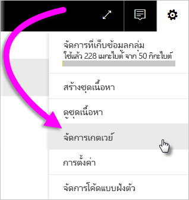
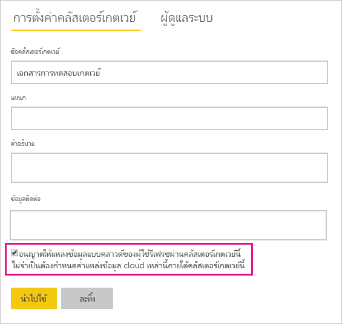
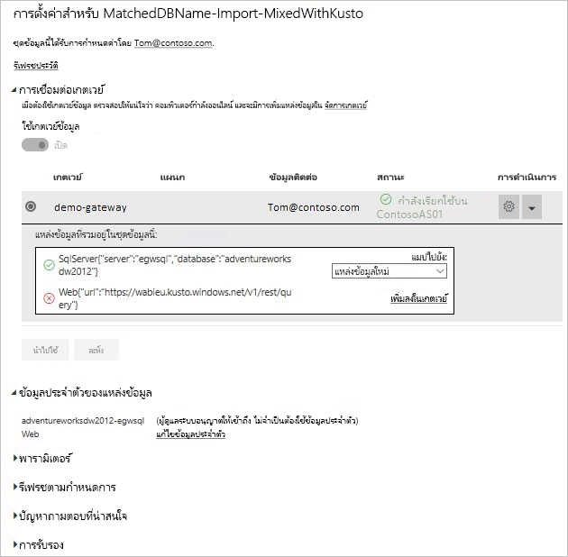

# ผสาน หรือผนวก แหล่งข้อมูลภายในองค์กรและในระบบคลาวด์Merge or append on-premises and cloud data sources

[!INCLUDE [gateway-rewrite](../includes/gateway-rewrite.md)]

คุณสามารถใช้เกตเวย์ข้อมูลภายในองค์กร เพื่อผสานหรือผนวก แหล่งข้อมูลภายในองค์กรและในระบบคลาวด์ ในคิวรีเดียวกันYou can use the on-premises data gateway to merge or append on-premises and cloud data sources in the same query. โซลูชันนี้จะมีประโยชน์เมื่อคุณต้องการรวมข้อมูลจากหลายแหล่งข้อมูลเข้าด้วยกัน โดยไม่ต้องใช้คิวรีที่แยกต่างหากThis solution is helpful when you want to combine data from multiple sources without having to use separate queries.

>[!NOTE]
>บทความนี้นำไปใช้กับชุดข้อมูลที่มีระบบคลาวด์และแหล่งข้อมูลภายในองค์กรที่ผสานหรือผนวกในคิวรีเดียวเท่านั้นThis article applies only to datasets that have cloud and on-premises data sources merged or appended in a single query. สำหรับชุดข้อมูลซึ่งรวมถึงคิวรีที่แยกต่างหาก - คิวรีหนึ่งซึ่งจะเชื่อมต่อไปยังแหล่งข้อมูลภายในองค์กรและอีกคิวรีหนึ่งไปยังแหล่งข้อมูลบนคลาวด์--เกตเวย์ไม่ได้ดำเนินการคิวรีสำหรับแหล่งข้อมูลบนคลาวด์For datasets that include separate queries--one that connects to an on-premises data source and the other to a cloud data source--the gateway doesn't execute the query for the cloud data source.

## ข้อกำหนดเบื้องต้นPrerequisites

- [เกตเวย์ที่ติดตั้ง](/data-integration/gateway/service-gateway-install)ภายในคอมพิวเตอร์A [gateway installed](/data-integration/gateway/service-gateway-install) on a local computer.
- ไฟล์ Power BI Desktop ที่มีคิวรีที่รวมแหล่งข้อมูลภายในองค์กรและในระบบคลาวด์A Power BI Desktop file with queries that combine on-premises and cloud data sources.

>[!NOTE]
>ในการเข้าถึงแหล่งข้อมูลระบบคลาวด์ใด ๆ คุณต้องตรวจสอบให้แน่ใจว่าเกตเวย์มีการเข้าถึงแหล่งข้อมูลเหล่านั้นTo access any cloud data sources, you must ensure that the gateway has access to those data sources.

1. ที่มุมบนขวาของบริการ Power BI เลือกไอคอนรูปเฟือง  > **จัดการเกตเวย์**In the upper-right corner of the Power BI service, select the gear icon  > **Manage gateways**.

    

2. เลือกเกตเวย์ที่คุณต้องการกำหนดค่าSelect the gateway you want to configure.

3. ภายใต้ **การตั้งค่าคลัสเตอร์เกตเวย์** เลือก **อนุญาตให้แหล่งข้อมูลระบบคลาวด์ของผู้ใช้รีเฟรชผ่านคลัสเตอร์เกตเวย์นี้** > **นำไปใช้**Under **Gateway Cluster Settings**, select **Allow user's cloud data sources to refresh through this gateway cluster** > **Apply**.

    

4. ภายใต้คลัสเตอร์เกตเวย์นี้ เพิ่ม[แหล่งข้อมูลในองค์กร](service-gateway-enterprise-manage-scheduled-refresh.md#add-a-data-source)ใด ๆ ที่ใช้ในคิวรีของคุณUnder this gateway cluster, add any [on-premises data sources](service-gateway-enterprise-manage-scheduled-refresh.md#add-a-data-source) used in your queries. คุณไม่จำเป็นต้องเพิ่มแหล่งข้อมูลระบบคลาวด์ตรงนี้You don't need to add the cloud data sources here.

5. อัปโหลดไฟล์ Power BI Desktop พร้อมคิวรีที่รวมแหล่งข้อมูลภายในองค์กรและในระบบคลาวด์ของคุณ ไปยังบริการของ Power BIUpload to the Power BI service your Power BI Desktop file with the queries that combine on-premises and cloud data sources.

6. บนหน้า **การตั้งค่าชุดข้อมูล** สำหรับชุดข้อมูลใหม่:On the **Dataset settings** page for the new dataset:

   - สำหรับแหล่งข้อมูลภายในองค์กร เลือกเกตเวย์ที่เกี่ยวข้องกับแหล่งข้อมูลนี้For the on-premises source, select the gateway associated with this data source.
   - ภายใต้ **ข้อมูลประจำตัวของแหล่งข้อมูล** แก้ไขข้อมูลประจำตัวแหล่งข้อมูลคลาวด์ที่จำเป็นUnder **Data source credentials**, edit the cloud data source credentials, as necessary.

    ตรวจสอบให้แน่ใจว่าระดับความเป็นส่วนตัวสำหรับระบบคลาวด์และแหล่งข้อมูลภายในองค์กรได้รับการตั้งค่าอย่างเหมาะสมเพื่อให้แน่ใจว่ามีการจัดการการรวมอย่างปลอดภัยMake sure privacy levels for both cloud and on-premises data sources are set appropriately to ensure the joins are handled securely.

     

7. เมื่อตั้งค่าข้อมูลประจำตัวบนระบบคลาวด์แล้ว คุณสามารถรีเฟรชชุดข้อมูลได้ โดยใช้ตัวเลือก **รีเฟรชเดี๋ยวนี้**With the cloud credentials set, you can now refresh the dataset by using the **Refresh now** option. หรือกำหนดเวลาการรีเฟรชเป็นระยะได้Or, you can schedule it to refresh periodically.

## ขั้นตอนถัดไปNext steps

เพื่อเรียนรู้เพิ่มเติมเกี่ยวกับการรีเฟรชข้อมูลสำหรับเกตเวย์ ดู[การใช้แหล่งข้อมูลสำหรับการรีเฟรชตามกำหนดเวลา](service-gateway-enterprise-manage-scheduled-refresh.md#use-the-data-source-for-scheduled-refresh)To learn more about data refresh for gateways, see [Use the data source for scheduled refresh](service-gateway-enterprise-manage-scheduled-refresh.md#use-the-data-source-for-scheduled-refresh).
