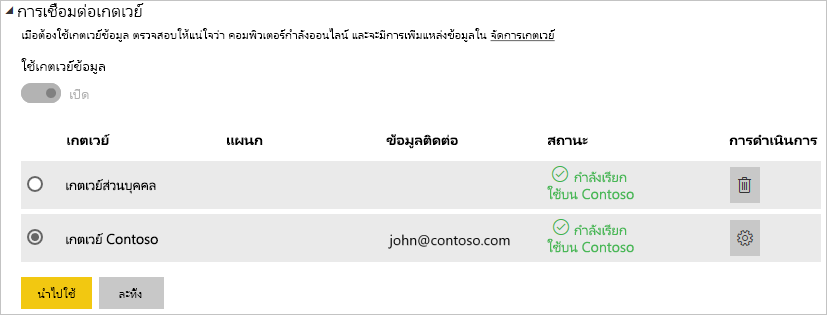

# จัดการแหล่งข้อมูลของคุณ - OracleManage your data source - Oracle

[!INCLUDE [gateway-rewrite](../includes/gateway-rewrite.md)]

หลังจากคุณ[ติดตั้งเกตเวย์ข้อมูลภายในองค์กรแล้ว](/data-integration/gateway/service-gateway-install) คุณจำเป็นต้อง[เพิ่มแหล่งข้อมูล](service-gateway-data-sources.md#add-a-data-source)ที่สามารถใช้ได้กับเกตเวย์ดังกล่าวAfter you [install the on-premises data gateway](/data-integration/gateway/service-gateway-install), you need to [add data sources](service-gateway-data-sources.md#add-a-data-source) that can be used with the gateway. บทความนี้จะดูวิธีการทำงานกับเกตเวย์และแหล่งข้อมูล Oracle สำหรับการรีเฟรชตามกำหนดการหรือสำหรับ DirectQueryThis article looks at how to work with gateways and Oracle data sources either for scheduled refresh or for DirectQuery.

## เชื่อมต่อกับฐานข้อมูล OracleConnect to an Oracle database
การเชื่อมต่อกับฐานข้อมูล Oracle ด้วยเกตเวย์ข้อมูลภายในองค์กรนั้น ต้องติดตั้งซอฟต์แวร์ไคลเอ็นต์ Oracle ที่ถูกต้องบนคอมพิวเตอร์ที่ใช้งานเกตเวย์To connect to an Oracle database with the on-premises data gateway, the correct Oracle client software must be installed on the computer running the gateway. ซอฟต์แวร์ไคลเอ็นต์ Oracle ที่คุณใช้ขึ้นอยู่กับเวอร์ชันของเซิร์ฟเวอร์ Oracle แต่จะตรงกับเกตเวย์ 64 บิตเสมอThe Oracle client software you use depends on the Oracle server version, but will always match the 64-bit gateway.

เวอร์ชัน Oracle ที่รองรับ:Supported Oracle versions: 
- Oracle Server 9 และเวอร์ชันที่ใหม่กว่าOracle Server 9 and later
- ซอฟต์แวร์ Oracle Data Access Client (ODAC) 11.2 และเวอร์ชันที่ใหม่กว่าOracle Data Access Client (ODAC) software 11.2 and later

## ติดตั้ง Oracle clientInstall the Oracle client
- [ดาวน์โหลดและติดตั้งไคลเอ็นต์ Oracle 64 บิต](https://www.oracle.com/database/technologies/odac-downloads.html)[download and install the 64-bit Oracle client](https://www.oracle.com/database/technologies/odac-downloads.html).

> [!NOTE]
> เลือกเวอร์ชันของ Oracle Data Access Client (ODAC) ซึ่งสามารถทำงานร่วมกับเซิร์ฟเวอร์ Oracle ของคุณได้Choose a version of Oracle Data Access Client (ODAC) which is compatible with your Oracle Server. ตัวอย่างเช่น ODAC 12.x ไม่รองรับเซิร์ฟเวอร์ Oracle เวอร์ชัน 9For instance, ODAC 12.x does not always support Oracle Server version 9.
> เลือกตัวติดตั้ง Windows ของไคลเอ็นต์ OracleChoose the Windows installer of the Oracle Client.
> ระหว่างการตั้งค่าของไคลเอ็นต์ Oracle คุณต้องตรวจสอบให้แน่ใจว่าได้เปิดใช้งาน *กำหนดค่า ODP.NET และ/หรือผู้ให้บริการ Oracle สำหรับ ASP.NET ที่ระดับเครื่อง* โดยการเลือกกล่องกาเครื่องหมายที่เกี่ยวข้องในระหว่างการตั้งค่าตัวช่วยสร้างDuring the setup of the Oracle client, make sure you enable *Configure ODP.NET and/or Oracle Providers for ASP.NET at machine-wide level* by selecting the corresponding checkbox during the setup wizard. ตัวช่วยสร้างไคลเอ็นต์ Oracle บางเวอร์ชันเลือกกล่องกาเครื่องหมายตามค่าเริ่มต้น ซึ่งเวอร์ชันอื่น ๆ ไม่ทำเช่นนี้Some versions of the Oracle client wizard selects the checkbox by default, others do not. ตรวจสอบให้แน่ใจว่าคุณได้เลือกกล่องกาเครื่องหมายเพื่อให้ Power BI สามารถเชื่อมต่อกับฐานข้อมูล Oracle ของคุณได้Make sure that checkbox is selected so that Power BI can connect to your Oracle database.
 
หลังจากที่ติดตั้งไคลเอ็นต์และกำหนดค่า ODAC อย่างถูกต้องแล้ว เราขอแนะนำให้ใช้ PowerBI Desktop หรือไคลเอ็นต์ทดสอบอื่น ๆ เพื่อตรวจสอบการติดตั้งและการกำหนดค่าที่ถูกต้องบนเกตเวย์After the client is installed and ODAC is configured properly, we recommend using PowerBI Desktop or other test client to verify correct installation and configuration on the Gateway.

## เพิ่มแหล่งข้อมูลAdd a data source

สำหรับข้อมูลเพิ่มเติมเกี่ยวกับวิธีการเพิ่มแหล่งข้อมูล ให้ดู[เพิ่มแหล่งข้อมูล](service-gateway-data-sources.md#add-a-data-source)For more information about how to add a data source, see [Add a data source](service-gateway-data-sources.md#add-a-data-source). ภายใต้ **ชนิดแหล่งข้อมูล** ให้เลือก **Oracle**Under **Data Source Type**, select **Oracle**.

หลังจากที่คุณเลือกชนิดแหล่งข้อมูล Oracle แล้ว ให้กรอกข้อมูลสำหรับแหล่งข้อมูลซึ่งรวมถึง **เซิร์ฟเวอร์** และ **ฐานข้อมูล**After you select the Oracle data source type, fill in the information for the data source, which includes **Server** and **Database**. 

ภายใต้ **วิธีการรับรองความถูกต้อง** คุณสามารถเลือก **Windows** หรือ **พื้นฐาน** ได้Under **Authentication Method**, you can choose either **Windows** or **Basic**. เลือก **พื้นฐาน** ถ้าคุณวางแผนเพื่อใช้บัญชีที่สร้างขึ้นภายใน Oracle แทนการรับรองความถูกต้องของ WindowsChoose **Basic** if you plan to use an account that's created within Oracle instead of Windows authentication. จากนั้นป้อนข้อมูลประจำตัวที่จะใช้สำหรับแหล่งข้อมูลนี้Then enter the credentials to be used for this data source.

> [!NOTE]
> แบบสอบถามทั้งหมดที่ไปยังแหล่งข้อมูลจะทำงานโดยใช้ข้อมูลประจำตัวเหล่านี้All queries to the data source will run using these credentials. หากต้องการเรียนรู้เพิ่มเติมเกี่ยวกับวิธีการจัดเก็บข้อมูลประจำตัว ให้ดู [จัดเก็บข้อมูลประจำตัวที่เข้ารหัสไว้ในระบบคลาวด์](service-gateway-data-sources.md#store-encrypted-credentials-in-the-cloud)To learn more about how credentials are stored, see [Store encrypted credentials in the cloud](service-gateway-data-sources.md#store-encrypted-credentials-in-the-cloud).

หลังจากที่คุณกรอกข้อมูลทุกอย่างแล้ว ให้เลือก **เพิ่ม**After you fill in everything, select **Add**. คุณสามารถใช้แหล่งข้อมูลนี้สำหรับการรีเฟรชตามกำหนดการหรือ DirectQuery เทียบกับ Oracle server ที่อยู่ภายในองค์กรได้You can now use this data source for scheduled refresh or DirectQuery against an Oracle server that's on-premises. คุณจะเห็น *การเชื่อมต่อสำเร็จ* หากการดำเนินการเสร็จสมบูรณ์แล้วYou see *Connection Successful* if it succeeded.

### การตั้งค่าขั้นสูงAdvanced settings

อีกทางหนึ่งคือคุณสามารถกำหนดค่าระดับความเป็นส่วนตัวให้กับแหล่งข้อมูลของคุณOptionally, you can configure the privacy level for your data source. การตั้งค่านี้จะช่วยควบคุมวิธีการรวมข้อมูลได้This setting controls how data can be combined. ซึ่งใช้ได้เฉพาะกับการรีเฟรชตามกำหนดการเท่านั้นIt's only used for scheduled refresh. การตั้งค่าระดับความเป็นส่วนตัวจะไม่นำไปใช้กับ DirectQueryThe privacy-level setting doesn't apply to DirectQuery. หากต้องการเรียนรู้เพิ่มเติมเกี่ยวกับระดับความเป็นส่วนตัวสำหรับแหล่งข้อมูลของคุณ ให้ดู [ระดับความเป็นส่วนตัว (Power Query)](https://support.office.com/article/Privacy-levels-Power-Query-CC3EDE4D-359E-4B28-BC72-9BEE7900B540)To learn more about privacy levels for your data source, see [Privacy levels (Power Query)](https://support.office.com/article/Privacy-levels-Power-Query-CC3EDE4D-359E-4B28-BC72-9BEE7900B540).

## ใช้แหล่งข้อมูลUse the data source

หลังจากที่คุณสร้างแหล่งข้อมูล รายการนี้จะพร้อมใช้งานเมื่อต้องใช้ทั้งกับการเชื่อมต่อ DirectQuery หรือการเชื่อมต่อสดผ่านการรีเฟรชตามกำหนดการAfter you create the data source, it's available to use with either DirectQuery connections or through scheduled refresh.

> [!WARNING]
> ชื่อเซิร์ฟเวอร์และชื่อฐานข้อมูลจะต้องตรงกับ Power BI Desktop และแหล่งข้อมูลภายในเกตเวย์ข้อมูลภายในองค์กรThe server and database names must match between Power BI Desktop and the data source within the on-premises data gateway.

การเชื่อมโยงระหว่างชุดข้อมูลของคุณและแหล่งข้อมูลภายในเกตเวย์จะเป็นไปตามชื่อเซิร์ฟเวอร์และชื่อฐานข้อมูลของคุณThe link between your dataset and the data source within the gateway is based on your server name and database name. ชื่อเหล่านี้ต้องตรงกันThese names must match. ตัวอย่างเช่น ถ้าคุณใส่ที่อยู่ IP สำหรับชื่อเซิร์ฟเวอร์ภายใน Power BI Desktop คุณต้องใช้ที่อยู่ IP สำหรับแหล่งข้อมูลภายในการกำหนดค่าเกตเวย์ด้วยเช่นกันFor example, if you supply an IP address for the server name within Power BI Desktop, you must use the IP address for the data source within the gateway configuration. นอกจากนี้ ชื่อนี้ยังต้องตรงกับนามแฝงที่กำหนดไว้ภายในแฟ้ม tnsnames.ora ด้วยThis name also has to match an alias defined within the tnsnames.ora file. สำหรับข้อมูลเพิ่มเติมเกี่ยวกับไฟล์ tnsnames.ora โปรดดู [ติดตั้ง Oracle Client](#install-the-oracle-client)For more information about the tnsnames.ora file, see [Install the Oracle client](#install-the-oracle-client).

ข้อกำหนดนี้เป็นกรณีสำหรับทั้ง DirectQuery และการรีเฟรชตามกำหนดการThis requirement is the case for both DirectQuery and scheduled refresh.

### ใช้แหล่งข้อมูลที่มีการเชื่อมต่อกับ DirectQueryUse the data source with DirectQuery connections

ตรวจสอบให้แน่ใจว่าชื่อเซิร์ฟเวอร์และชื่อฐานข้อมูลตรงกันระหว่าง Power BI Desktop และแหล่งข้อมูลที่กำหนดค่าไว้สำหรับเกตเวย์Make sure that the server and database names match between Power BI Desktop and the configured data source for the gateway. คุณยังต้องตรวจสอบให้แน่ใจอีกว่า ผู้ใช้ของคุณแสดงอยู่ในแท็บ **ผู้ใช้** ของแหล่งข้อมูลเพื่อเผยแพร่ชุดข้อมูล DirectQueryYou also need to make sure your user is listed in the **Users** tab of the data source to publish DirectQuery datasets. ตัวเลือกสำหรับ DirectQuery จะเกิดขึ้นภายใน Power BI Desktop ตอนที่คุณนำเข้าข้อมูลครั้งแรกThe selection for DirectQuery occurs within Power BI Desktop when you first import data. สำหรับข้อมูลเพิ่มเติมเกี่ยวกับวิธีการใช้งาน DirectQuery โปรดดู [ใช้ DirectQuery ใน Power BI Desktop](desktop-use-directquery.md)For more information about how to use DirectQuery, see [Use DirectQuery in Power BI Desktop](desktop-use-directquery.md).

หลังจากที่คุณเผยแพร่ชุดข้อมูลจาก Power BI Desktop หรือ **รับข้อมูล** รายงานของคุณควรเริ่มการทำงานAfter you publish, either from Power BI Desktop or **Get Data**, your reports should start to work. ซึ่งอาจจะใช้เวลาหลายนาทีเพื่อให้การเชื่อมต่อสามารถใช้งานได้ หลังจากคุณสร้างแหล่งข้อมูลภายในเกตเวย์It might take several minutes after you create the data source within the gateway for the connection to be usable.

### ใช้แหล่งข้อมูลที่มีการรีเฟรชตามกำหนดการUse the data source with scheduled refresh

ถ้าคุณอยู่ในแท็บ **ผู้ใช้** ของแหล่งข้อมูลที่กำหนดค่าไว้ภายในเกตเวย์ และชื่อเซิร์ฟเวอร์และชื่อฐานข้อมูลตรงกัน คุณจะเห็นเกตเวย์เป็นตัวเลือกเพื่อใช้กับการรีเฟรชตามกำหนดการIf you're listed in the **Users** tab of the data source configured within the gateway and the server name and database name match, you see the gateway as an option to use with scheduled refresh.

## การแก้ไขปัญหาTroubleshooting

คุณอาจพบข้อผิดพลาดต่าง ๆ มากมายจาก Oracle เมื่อไวยากรณ์การตั้งชื่อไม่ถูกต้อง หรือไม่ได้กำหนดค่าอย่างถูกต้อง:You might encounter any of several errors from Oracle when the naming syntax is either incorrect or not configured properly:

* ORA-12154: TNS: ไม่สามารถแก้ไขตัวระบุการเชื่อมต่อที่ระบุได้ORA-12154: TNS:could not resolve the connect identifier specified.
* ORA-12514: TNS: ในขณะนี้ ตัวรอรับการติดต่อไม่รู้จักบริการที่ร้องขอในตัวอธิบายการเชื่อมต่อORA-12514: TNS:listener does not currently know of service requested in connect descriptor.
* ORA-12541: TNS: ไม่มีตัวรอรับการติดต่อORA-12541: TNS:no listener.
* ORA-12170: TNS: เกิดเหตุการณ์การเชื่อมต่อหมดเวลาORA-12170: TNS:connect timeout occurred.
* ORA-12504: TNS: ตัวรอรับการติดต่อไม่ได้รับ SERVICE_NAME ใน CONNECT_DATAORA-12504: TNS:listener was not given the SERVICE_NAME in CONNECT_DATA.

ข้อผิดพลาดเหล่านี้อาจเกิดขึ้นหากไม่ได้ติดตั้ง Oracle client หรือกำหนดค่าไม่ถูกต้องThese errors might occur if the Oracle client either isn't installed or isn't configured properly. ถ้ามีการติดตั้งอยู่แล้ว ให้ตรวจสอบว่ามีการกำหนดค่าไฟล์ tnsnames.ora อย่างถูกต้องหรือไม่ และคุณกำลังใช้ net_service_name ที่เหมาะสมหรือไม่If it's installed, verify that the tnsnames.ora file is properly configured and you're using the proper net_service_name. นอกจากนี้ คุณจะต้องตรวจสอบให้แน่ใจว่า net_service_name สำหรับเครื่องที่ใช้ Power BI Desktop และเครื่องที่ใช้งานเกตเวย์นั้นเป็นตัวเดียวกันหรือไม่You also need to make sure that the net_service_name is the same between the machine that uses Power BI Desktop and the machine that runs the gateway. สำหรับข้อมูลเพิ่มเติม โปรดดู [ติดตั้ง Oracle Client](#install-the-oracle-client)For more information, see [Install the Oracle client](#install-the-oracle-client).

คุณอาจประสบปัญหาความเข้ากันได้ระหว่างเวอร์ชัน Oracle server และเวอร์ชัน Oracle Data Access ClientYou might also encounter a compatibility issue between the Oracle server version and the Oracle Data Access Client version. โดยทั่วไปแล้ว คุณต้องใช้เวอร์ชันที่สอดคล้องกัน เนื่องจากชุดการทำงานบางอย่างอาจไม่เข้ากันTypically, you want these versions to match, as some combinations are incompatible. ตัวอย่างเช่น ODAC 12.x นั้นไม่รองรับเซิร์ฟเวอร์ Oracle เวอร์ชัน 9For instance, ODAC 12.x does not support Oracle Server version 9.

สำหรับการวินิจฉัยปัญหาการเชื่อมต่อระหว่างเซิร์ฟเวอร์แหล่งข้อมูลและเครื่องเกตเวย์ เราขอแนะนำให้ติดตั้งไคลเอ็นต์ (เช่น PowerBI Desktop หรือ Oracle ODBC Test) บนเครื่องเกตเวย์For diagnosing connectivity issues between the data source server and the Gateway machine, we recommend installing a client(such as PowerBI Desktop or Oracle ODBC Test) on the gateway machine. คุณสามารถใช้ไคลเอ็นต์เพื่อตรวจสอบการเชื่อมต่อกับเซิร์ฟเวอร์แหล่งข้อมูลได้You can use the client to check connectivity to the data source server.

สำหรับข้อมูลการแก้ไขปัญหาเพิ่มเติมที่เกี่ยวข้องกับเกตเวย์ โปรดดู [การแก้ไขปัญหาเกตเวย์ข้อมูลในองค์กร](/data-integration/gateway/service-gateway-tshoot)For additional troubleshooting information that relates to the gateway, see [Troubleshooting the on-premises data gateway](/data-integration/gateway/service-gateway-tshoot).

## ขั้นตอนถัดไปNext steps

* [แก้ไขปัญหาเกตเวย์-Power BITroubleshoot gateways - Power BI](service-gateway-onprem-tshoot.md)
* [Power BI PremiumPower BI Premium](../admin/service-premium-what-is.md)

มีคำถามเพิ่มเติมหรือไม่More questions? ลองถาม[ชุมชน Power BI](https://community.powerbi.com/)Try asking the [Power BI Community](https://community.powerbi.com/).
